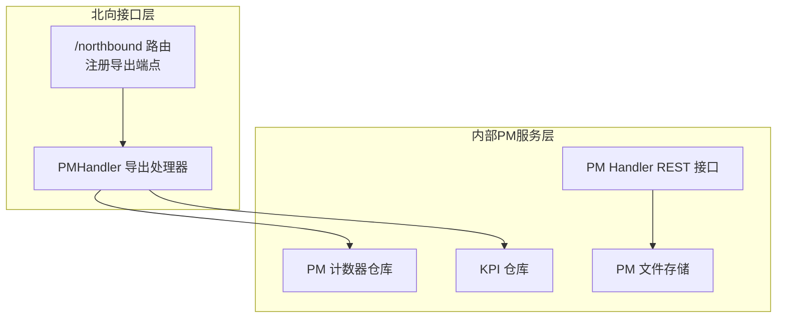
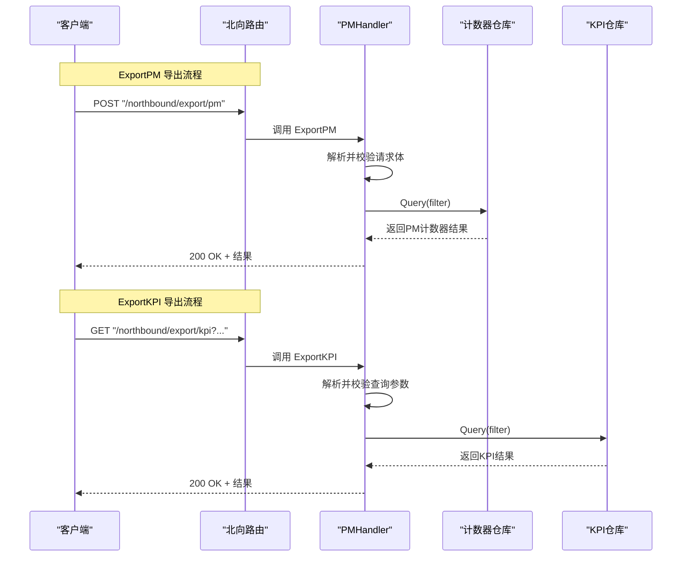
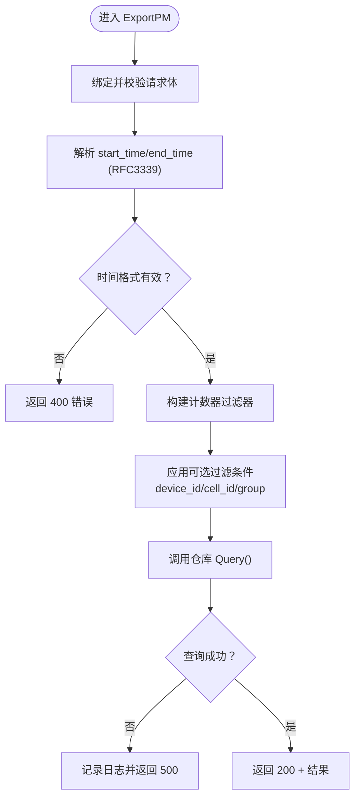
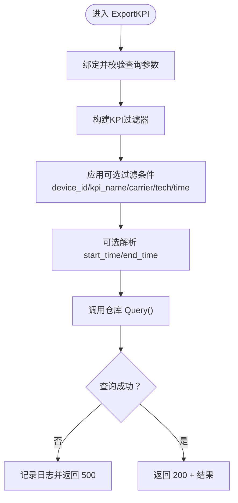
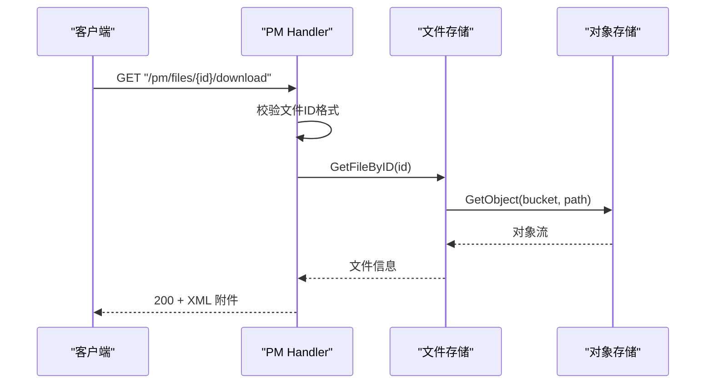
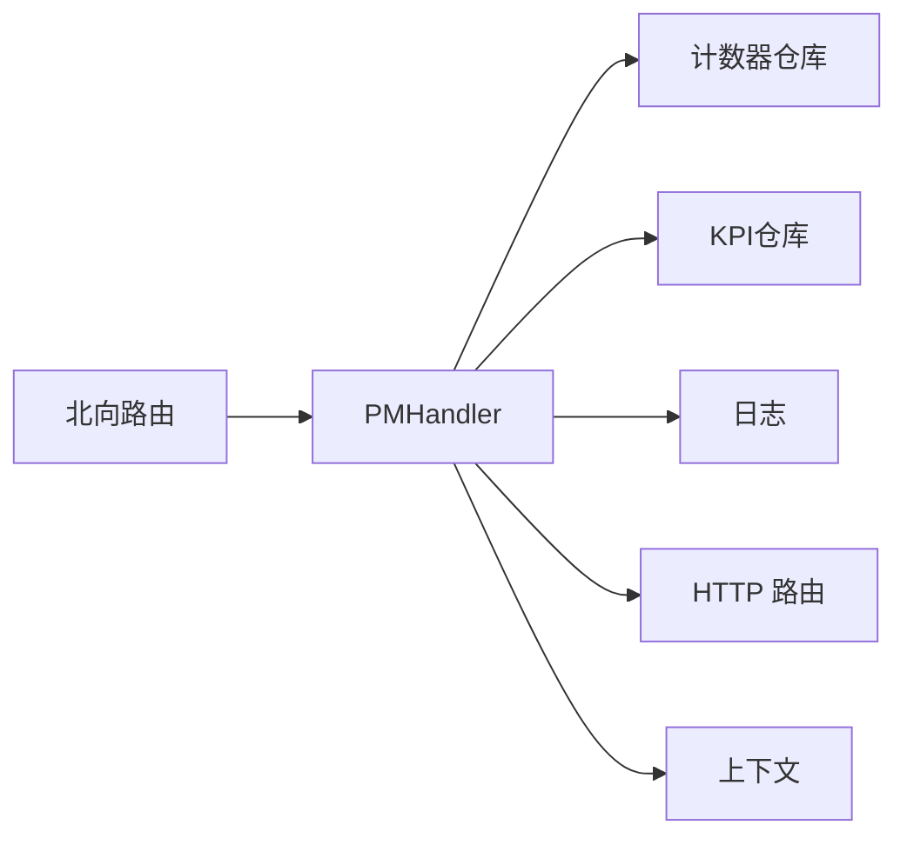

# 性能数据导出

<cite>
**本文引用的文件**
- [omcgo/internal/northbound/pm_handler.go](file://omcgo/internal/northbound/pm_handler.go)
- [omcgo/internal/northbound/model.go](file://omcgo/internal/northbound/model.go)
- [omcgo/internal/northbound/router.go](file://omcgo/internal/northbound/router.go)
- [omcgo/internal/pm/handler.go](file://omcgo/internal/pm/handler.go)
- [omcgo/internal/pm/task_model.go](file://omcgo/internal/pm/task_model.go)
</cite>

## 目录
1. [简介](#简介)
2. [项目结构](#项目结构)
3. [核心组件](#核心组件)
4. [架构概览](#架构概览)
5. [详细组件分析](#详细组件分析)
6. [依赖分析](#依赖分析)
7. [性能考虑](#性能考虑)
8. [故障排查指南](#故障排查指南)
9. [结论](#结论)
10. [附录](#附录)

## 简介
本文件面向性能数据导出功能，聚焦两类导出接口：PM计数器导出（ExportPM）与KPI导出（ExportKPI）。文档从接口定义、请求参数、过滤条件、时间范围处理、设备标识解析、响应格式、查询逻辑、分页机制与错误处理等方面进行系统化说明，并提供API调用示例、性能优化建议与常见问题解决方案。

## 项目结构
性能数据导出能力由“北向接口层”与“内部PM服务层”协同实现：
- 北向接口层提供统一的导出入口，负责参数校验、格式转换与错误返回。
- 内部PM服务层负责具体的数据查询、聚合与文件下载等操作。

图表来源
- [omcgo/internal/northbound/router.go:39-55](file://omcgo/internal/northbound/router.go#L39-L55)
- [omcgo/internal/northbound/pm_handler.go:15-29](file://omcgo/internal/northbound/pm_handler.go#L15-L29)
- [omcgo/internal/pm/handler.go:18-49](file://omcgo/internal/pm/handler.go#L18-L49)

章节来源
- [omcgo/internal/northbound/router.go:39-55](file://omcgo/internal/northbound/router.go#L39-L55)
- [omcgo/internal/northbound/pm_handler.go:15-29](file://omcgo/internal/northbound/pm_handler.go#L15-L29)
- [omcgo/internal/pm/handler.go:18-49](file://omcgo/internal/pm/handler.go#L18-L49)

## 核心组件
- ExportPM 请求体与过滤条件
  - 请求体字段：设备标识、小区标识、计数器组、起止时间、可选格式。
  - 过滤条件：设备ID（UUID）、小区ID、计数器组；时间范围使用RFC3339字符串。
- ExportKPI 查询参数与过滤条件
  - 查询参数：设备ID、KPI名称、运营商、制式、起止时间；分页参数继承通用分页请求。
  - 过滤条件：设备ID（UUID）、KPI名称、运营商编码、制式枚举、时间范围。
- 分页机制
  - ExportPM 使用固定页大小与第一页查询；ExportKPI 使用通用分页请求默认值。
- 错误处理
  - 参数格式错误返回400；
  - 查询失败返回500；
  - 北向导出记录日志便于追踪。

章节来源
- [omcgo/internal/northbound/model.go:34-42](file://omcgo/internal/northbound/model.go#L34-L42)
- [omcgo/internal/northbound/pm_handler.go:31-78](file://omcgo/internal/northbound/pm_handler.go#L31-L78)
- [omcgo/internal/northbound/pm_handler.go:80-136](file://omcgo/internal/northbound/pm_handler.go#L80-L136)

## 架构概览
下图展示ExportPM与ExportKPI的调用链路与数据流：

图表来源
- [omcgo/internal/northbound/router.go:51-54](file://omcgo/internal/northbound/router.go#L51-L54)
- [omcgo/internal/northbound/pm_handler.go:31-78](file://omcgo/internal/northbound/pm_handler.go#L31-L78)
- [omcgo/internal/northbound/pm_handler.go:80-136](file://omcgo/internal/northbound/pm_handler.go#L80-L136)

## 详细组件分析

### ExportPM 接口（POST /northbound/export/pm）
- 请求方式与路径
  - 方法：POST
  - 路径：/northbound/export/pm
- 请求体（JSON）
  - 字段
    - device_id：设备唯一标识（UUID字符串）
    - cell_id：小区标识（字符串）
    - counter_group：计数器组（字符串）
    - start_time：开始时间（RFC3339）
    - end_time：结束时间（RFC3339）
    - format：输出格式（可选）
- 过滤与处理
  - 设备ID解析：若提供则解析为UUID，否则忽略。
  - 时间范围：均按RFC3339解析，非法格式返回400。
  - 计数器组与小区ID：直接作为过滤条件。
  - 分页：固定使用第1页、固定页大小进行查询。
- 响应
  - 成功：200 OK，返回查询结果（包含计数器数据与分页信息）。
  - 失败：400/500，返回错误信息。

图表来源
- [omcgo/internal/northbound/pm_handler.go:31-78](file://omcgo/internal/northbound/pm_handler.go#L31-L78)
- [omcgo/internal/northbound/model.go:34-42](file://omcgo/internal/northbound/model.go#L34-L42)

章节来源
- [omcgo/internal/northbound/pm_handler.go:31-78](file://omcgo/internal/northbound/pm_handler.go#L31-L78)
- [omcgo/internal/northbound/model.go:34-42](file://omcgo/internal/northbound/model.go#L34-L42)

### ExportKPI 接口（GET /northbound/export/kpi）
- 请求方式与路径
  - 方法：GET
  - 路径：/northbound/export/kpi
- 查询参数
  - device_id：设备UUID（可选）
  - kpi_name：KPI名称（可选）
  - carrier：运营商编码（可选）
  - technology：制式（可选）
  - start_time：开始时间（RFC3339，可选）
  - end_time：结束时间（RFC3339，可选）
  - 分页参数：继承通用分页请求（默认值见实现）
- 过滤与处理
  - 设备ID：解析为UUID后作为过滤条件。
  - 运营商与制式：转换为对应枚举类型后过滤。
  - 时间范围：可选解析，非法格式忽略。
  - 分页：使用通用分页请求默认值。
- 响应
  - 成功：200 OK，返回查询结果（包含KPI数据与分页信息）。
  - 失败：400/500，返回错误信息。

图表来源
- [omcgo/internal/northbound/pm_handler.go:80-136](file://omcgo/internal/northbound/pm_handler.go#L80-L136)

章节来源
- [omcgo/internal/northbound/pm_handler.go:80-136](file://omcgo/internal/northbound/pm_handler.go#L80-L136)

### 内部PM文件下载（GET /pm/files/:id/download）
- 用途：下载已生成的PM文件（XML格式），用于离线归档或二次处理。
- 请求方式与路径
  - 方法：GET
  - 路径：/pm/files/:id/download
- 参数
  - id：文件唯一标识（UUID）
- 流程
  - 校验文件ID格式；
  - 通过文件存储定位对象存储路径；
  - 从对象存储读取文件并以附件形式返回。
- 响应
  - 成功：200 OK + XML内容；
  - 失败：400/404/500，返回相应错误。

图表来源
- [omcgo/internal/pm/handler.go:369-403](file://omcgo/internal/pm/handler.go#L369-L403)

章节来源
- [omcgo/internal/pm/handler.go:369-403](file://omcgo/internal/pm/handler.go#L369-L403)

### 性能任务与文件管理（辅助理解导出背景）
- 性能任务
  - 支持的任务类型：抽取、报表、阈值检查；
  - 任务状态：待执行、运行中、已完成、失败、取消；
  - 任务包含粒度、时间范围、设备与KPI集合等元信息。
- 文件管理
  - 列表支持按设备、时间范围过滤；
  - 提供下载能力，返回XML格式文件。

章节来源
- [omcgo/internal/pm/task_model.go:11-63](file://omcgo/internal/pm/task_model.go#L11-L63)
- [omcgo/internal/pm/handler.go:325-367](file://omcgo/internal/pm/handler.go#L325-L367)

## 依赖分析
- 组件耦合
  - PMHandler依赖计数器仓库与KPI仓库，承担参数解析与错误处理职责。
  - 北向路由集中注册导出端点，解耦具体业务实现。
  - 内部PM Handler提供REST接口，支撑文件下载与任务管理等能力。
- 外部依赖
  - 对象存储客户端用于PM文件下载；
  - 日志库用于导出失败时的日志记录。

图表来源
- [omcgo/internal/northbound/router.go:39-55](file://omcgo/internal/northbound/router.go#L39-L55)
- [omcgo/internal/northbound/pm_handler.go:15-29](file://omcgo/internal/northbound/pm_handler.go#L15-L29)

章节来源
- [omcgo/internal/northbound/router.go:39-55](file://omcgo/internal/northbound/router.go#L39-L55)
- [omcgo/internal/northbound/pm_handler.go:15-29](file://omcgo/internal/northbound/pm_handler.go#L15-L29)

## 性能考虑
- 查询范围控制
  - 明确设置时间范围，避免全量扫描；
  - 优先提供设备ID与计数器组，减少无关数据过滤成本。
- 分页与批量
  - ExportPM使用固定页大小，建议在上层前端实现分页加载；
  - ExportKPI使用默认分页，如需大范围导出，建议结合时间切片与并发任务。
- 存储访问
  - 文件下载走对象存储直连，注意网络带宽与并发限制；
  - 对象存储路径与桶名需稳定，避免频繁重试。
- 缓存与预计算
  - 对热点KPI与常用计数器组合可考虑预计算与缓存；
  - 定期清理过期文件，降低存储压力。

## 故障排查指南
- 参数错误（400）
  - 设备ID格式不正确（非UUID）；
  - 时间格式不符合RFC3339；
  - 查询参数绑定失败。
- 业务错误（500）
  - 数据库查询异常；
  - 对象存储读取失败。
- 常见问题
  - 导出结果为空：确认时间范围是否覆盖数据、设备ID是否匹配；
  - 下载失败：确认文件ID有效、对象存储可用、网络稳定。
- 建议
  - 在导出前先进行小范围验证（短时间窗、少量设备）；
  - 记录并复现实例化日志，便于定位问题。

章节来源
- [omcgo/internal/northbound/pm_handler.go:34-48](file://omcgo/internal/northbound/pm_handler.go#L34-L48)
- [omcgo/internal/northbound/pm_handler.go:71-74](file://omcgo/internal/northbound/pm_handler.go#L71-L74)
- [omcgo/internal/northbound/pm_handler.go:92-95](file://omcgo/internal/northbound/pm_handler.go#L92-L95)
- [omcgo/internal/northbound/pm_handler.go:128-133](file://omcgo/internal/northbound/pm_handler.go#L128-L133)
- [omcgo/internal/pm/handler.go:370-398](file://omcgo/internal/pm/handler.go#L370-L398)

## 结论
ExportPM与ExportKPI提供了灵活的性能数据导出能力，分别面向计数器与KPI两类数据。通过严格的参数校验、明确的时间范围与过滤条件、以及清晰的错误处理，保障了导出流程的稳定性。配合内部PM文件下载能力，可满足离线归档与二次处理需求。建议在生产环境中合理规划时间窗口、控制查询范围，并结合对象存储与缓存策略提升整体性能。

## 附录

### API 调用示例（示例路径）
- ExportPM（POST /northbound/export/pm）
  - 请求体字段参考：[omcgo/internal/northbound/model.go:34-42](file://omcgo/internal/northbound/model.go#L34-L42)
  - 实现逻辑参考：[omcgo/internal/northbound/pm_handler.go:31-78](file://omcgo/internal/northbound/pm_handler.go#L31-L78)
- ExportKPI（GET /northbound/export/kpi）
  - 查询参数参考：[omcgo/internal/northbound/pm_handler.go:82-90](file://omcgo/internal/northbound/pm_handler.go#L82-L90)
  - 实现逻辑参考：[omcgo/internal/northbound/pm_handler.go:80-136](file://omcgo/internal/northbound/pm_handler.go#L80-L136)
- 下载PM文件（GET /pm/files/:id/download）
  - 实现逻辑参考：[omcgo/internal/pm/handler.go:369-403](file://omcgo/internal/pm/handler.go#L369-L403)

### 请求参数与响应格式摘要
- ExportPM（POST /northbound/export/pm）
  - 请求体字段：device_id、cell_id、counter_group、start_time、end_time、format
  - 响应：包含计数器数据与分页信息
- ExportKPI（GET /northbound/export/kpi）
  - 查询参数：device_id、kpi_name、carrier、technology、start_time、end_time 及分页参数
  - 响应：包含KPI数据与分页信息
- 下载PM文件（GET /pm/files/:id/download）
  - 参数：id（UUID）
  - 响应：XML文件内容（Content-Type: application/xml）

章节来源
- [omcgo/internal/northbound/model.go:34-42](file://omcgo/internal/northbound/model.go#L34-L42)
- [omcgo/internal/northbound/pm_handler.go:31-78](file://omcgo/internal/northbound/pm_handler.go#L31-L78)
- [omcgo/internal/northbound/pm_handler.go:80-136](file://omcgo/internal/northbound/pm_handler.go#L80-L136)
- [omcgo/internal/pm/handler.go:369-403](file://omcgo/internal/pm/handler.go#L369-L403)