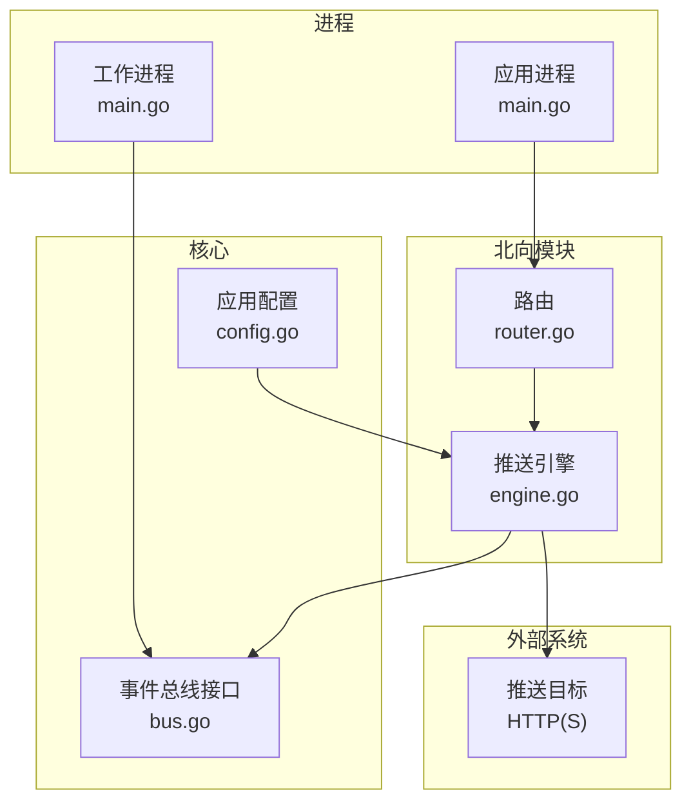
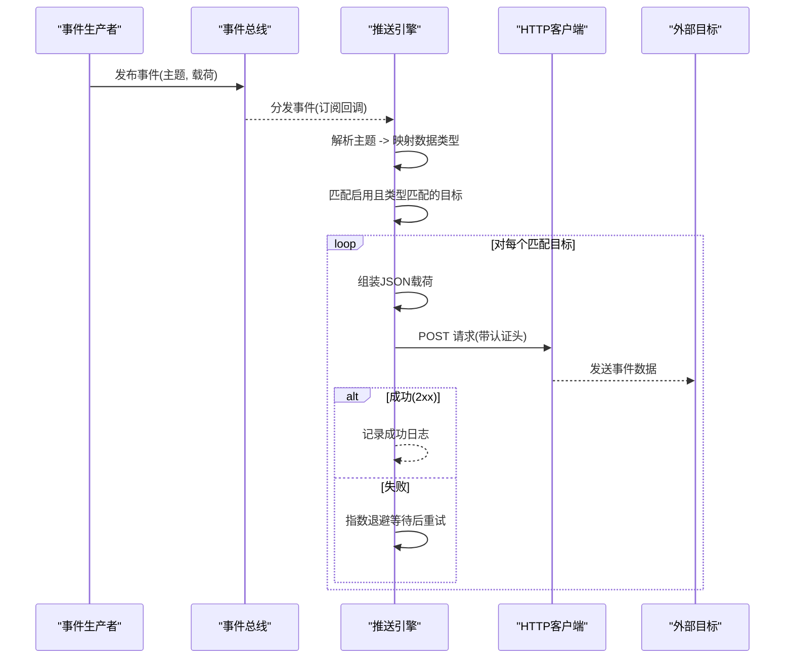
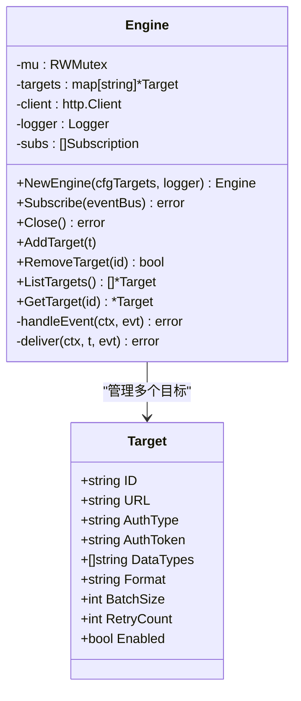
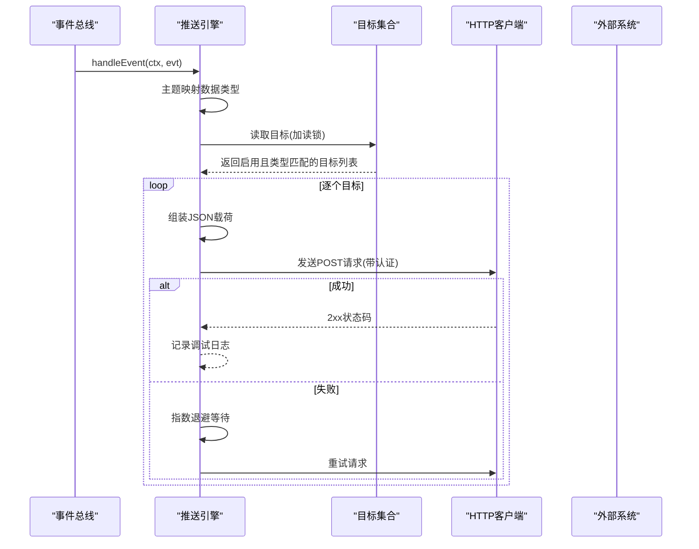
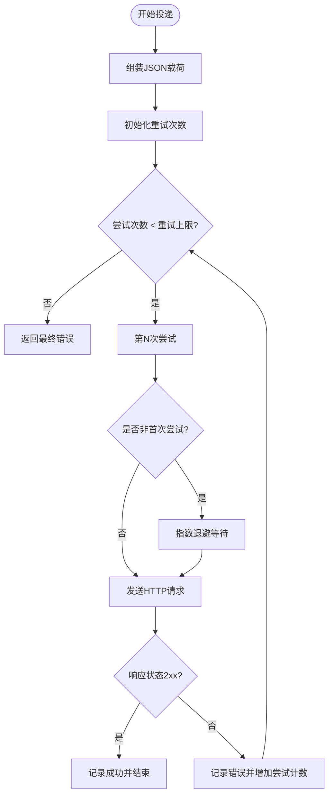
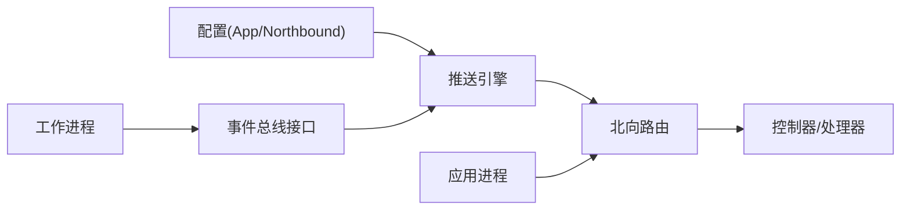

# 推送引擎

<cite>
**本文引用的文件**
- [engine.go](file://omcgo/internal/northbound/push/engine.go)
- [router.go](file://omcgo/internal/northbound/router.go)
- [config.go](file://omcgo/internal/core/appconfig/config.go)
- [bus.go](file://omcgo/internal/core/event/bus.go)
- [main.go](file://omcgo/cmd/app/main.go)
- [main.go](file://omcgo/cmd/worker/main.go)
- [model.go](file://omcgo/internal/northbound/model.go)
- [06-data-pipeline.md](file://omcgo/docs/go-zero-design/06-data-pipeline.md)
</cite>

## 目录
1. [简介](#简介)
2. [项目结构](#项目结构)
3. [核心组件](#核心组件)
4. [架构总览](#架构总览)
5. [详细组件分析](#详细组件分析)
6. [依赖分析](#依赖分析)
7. [性能考虑](#性能考虑)
8. [故障排查指南](#故障排查指南)
9. [结论](#结论)
10. [附录](#附录)

## 简介
本文件为“推送引擎”的技术文档，聚焦于北向（OSS）数据推送能力：事件驱动的数据采集、格式化封装、批量处理与传输优化、调度策略、并发控制与资源管理、失败重试与退避、熔断保护、配置参数、性能指标与监控方法，以及扩展接口与自定义适配器的集成指南。该引擎通过订阅内部事件总线，将告警、性能、配置等数据以统一格式推送到外部目标系统。

## 项目结构
推送引擎位于北向模块中，围绕事件总线进行解耦，通过路由暴露管理接口，并在应用启动时注册订阅。整体采用事件驱动与HTTP推送相结合的方式，具备可配置的目标、认证方式、重试次数与批处理能力。

图表来源
- [router.go:39-56](file://omcgo/internal/northbound/router.go#L39-L56)
- [engine.go:42-57](file://omcgo/internal/northbound/push/engine.go#L42-L57)
- [bus.go:5-26](file://omcgo/internal/core/event/bus.go#L5-L26)
- [config.go:57-73](file://omcgo/internal/core/appconfig/config.go#L57-L73)
- [main.go:33-75](file://omcgo/cmd/app/main.go#L33-L75)
- [main.go:44-68](file://omcgo/cmd/worker/main.go#L44-L68)

章节来源
- [router.go:39-56](file://omcgo/internal/northbound/router.go#L39-L56)
- [engine.go:42-57](file://omcgo/internal/northbound/push/engine.go#L42-L57)
- [bus.go:5-26](file://omcgo/internal/core/event/bus.go#L5-L26)
- [config.go:57-73](file://omcgo/internal/core/appconfig/config.go#L57-L73)
- [main.go:33-75](file://omcgo/cmd/app/main.go#L33-L75)
- [main.go:44-68](file://omcgo/cmd/worker/main.go#L44-L68)

## 核心组件
- 推送引擎（Engine）
  - 负责加载初始推送目标、订阅事件、按数据类型匹配并投递到外部目标、执行指数退避重试。
  - 支持运行时增删改查目标，线程安全。
- 目标（Target）
  - 描述单个外部推送目标的标识、URL、认证方式、数据类型集合、格式、批大小、重试次数与启用状态。
- 路由（Router）
  - 提供北向API：列出/新增/删除推送目标；提供全量/增量同步接口（与推送引擎互补）。
- 事件总线（EventBus）
  - 定义发布/订阅接口，支持普通订阅与队列订阅（负载均衡）。
- 应用配置（AppConfig/NorthboundConfig/PushTargetConfig）
  - 定义推送目标配置结构，支持从文件加载与环境变量覆盖。

章节来源
- [engine.go:19-39](file://omcgo/internal/northbound/push/engine.go#L19-L39)
- [engine.go:90-132](file://omcgo/internal/northbound/push/engine.go#L90-L132)
- [router.go:58-93](file://omcgo/internal/northbound/router.go#L58-L93)
- [bus.go:5-26](file://omcgo/internal/core/event/bus.go#L5-L26)
- [config.go:57-73](file://omcgo/internal/core/appconfig/config.go#L57-L73)

## 架构总览
推送引擎采用“事件驱动 + HTTP推送”的架构。内部模块产生事件，推送引擎订阅并根据目标配置进行匹配与投递；外部系统通过HTTP接收统一格式的事件数据。配置层提供目标清单，路由层提供运行时管理接口。

图表来源
- [engine.go:134-161](file://omcgo/internal/northbound/push/engine.go#L134-L161)
- [engine.go:163-225](file://omcgo/internal/northbound/push/engine.go#L163-L225)
- [bus.go:5-26](file://omcgo/internal/core/event/bus.go#L5-L26)

## 详细组件分析

### 推送引擎（Engine）类图

图表来源
- [engine.go:32-39](file://omcgo/internal/northbound/push/engine.go#L32-L39)
- [engine.go:19-30](file://omcgo/internal/northbound/push/engine.go#L19-L30)

章节来源
- [engine.go:32-57](file://omcgo/internal/northbound/push/engine.go#L32-L57)
- [engine.go:90-132](file://omcgo/internal/northbound/push/engine.go#L90-L132)
- [engine.go:134-161](file://omcgo/internal/northbound/push/engine.go#L134-L161)
- [engine.go:163-225](file://omcgo/internal/northbound/push/engine.go#L163-L225)

### 事件处理流程（序列图）

图表来源
- [engine.go:134-161](file://omcgo/internal/northbound/push/engine.go#L134-L161)
- [engine.go:163-225](file://omcgo/internal/northbound/push/engine.go#L163-L225)

### 重试与退避（流程图）

图表来源
- [engine.go:175-178](file://omcgo/internal/northbound/push/engine.go#L175-L178)
- [engine.go:182-190](file://omcgo/internal/northbound/push/engine.go#L182-L190)
- [engine.go:205-224](file://omcgo/internal/northbound/push/engine.go#L205-L224)

### 路由与管理接口
- GET /northbound/push/targets：列出所有推送目标
- POST /northbound/push/targets：新增/更新推送目标
- DELETE /northbound/push/targets/:id：删除指定推送目标
- GET /northbound/sync/full：全量同步（与推送互补）
- GET /northbound/sync/incremental：增量同步（与推送互补）

章节来源
- [router.go:39-56](file://omcgo/internal/northbound/router.go#L39-L56)
- [router.go:58-93](file://omcgo/internal/northbound/router.go#L58-L93)
- [router.go:95-125](file://omcgo/internal/northbound/router.go#L95-L125)

### 配置参数与数据模型
- 应用配置中的北向推送目标列表
- 单个推送目标的关键字段：ID、URL、认证类型与令牌、数据类型集合、格式、批大小、重试次数、启用状态
- 北向模型与同步请求/结果的数据结构

章节来源
- [config.go:57-73](file://omcgo/internal/core/appconfig/config.go#L57-L73)
- [model.go:5-32](file://omcgo/internal/northbound/model.go#L5-L32)

## 依赖分析
- 推送引擎依赖事件总线接口进行订阅与分发，确保与业务模块解耦。
- 路由依赖推送引擎实例，提供REST API。
- 应用进程负责加载配置并初始化推送引擎；工作进程负责订阅内部事件（与推送引擎互补）。

图表来源
- [config.go:57-73](file://omcgo/internal/core/appconfig/config.go#L57-L73)
- [bus.go:5-26](file://omcgo/internal/core/event/bus.go#L5-L26)
- [engine.go:42-57](file://omcgo/internal/northbound/push/engine.go#L42-L57)
- [router.go:39-56](file://omcgo/internal/northbound/router.go#L39-L56)
- [main.go:33-75](file://omcgo/cmd/app/main.go#L33-L75)
- [main.go:44-68](file://omcgo/cmd/worker/main.go#L44-L68)

章节来源
- [config.go:57-73](file://omcgo/internal/core/appconfig/config.go#L57-L73)
- [bus.go:5-26](file://omcgo/internal/core/event/bus.go#L5-L26)
- [engine.go:42-57](file://omcgo/internal/northbound/push/engine.go#L42-L57)
- [router.go:39-56](file://omcgo/internal/northbound/router.go#L39-L56)
- [main.go:33-75](file://omcgo/cmd/app/main.go#L33-L75)
- [main.go:44-68](file://omcgo/cmd/worker/main.go#L44-L68)

## 性能考虑
- 并发与锁
  - 目标列表读写使用读写锁，读多写少场景下提升并发读性能。
- 传输优化
  - 使用HTTP客户端超时控制；请求体为JSON，避免不必要的格式转换。
- 重试与退避
  - 指数退避降低对下游系统的压力，避免雪崩效应。
- 批量处理
  - 目标结构包含批大小字段，但当前实现为单事件单推送；可在后续扩展中合并多事件为批次。
- 资源管理
  - HTTP客户端复用连接池；日志记录用于可观测性，避免过量输出影响性能。

章节来源
- [engine.go:34-39](file://omcgo/internal/northbound/push/engine.go#L34-L39)
- [engine.go:45-47](file://omcgo/internal/northbound/push/engine.go#L45-L47)
- [engine.go:175-190](file://omcgo/internal/northbound/push/engine.go#L175-L190)

## 故障排查指南
- 认证失败
  - 检查目标的认证类型与令牌配置是否正确；确认外部系统期望的认证方式（Bearer或Basic）。
- 网络超时/连接失败
  - 检查目标URL可达性与TLS配置；确认HTTP客户端超时设置是否合理。
- 重试耗尽
  - 查看日志中的最终错误信息，定位具体失败原因；适当提高重试次数或缩短退避时间。
- 目标未生效
  - 确认目标已启用且数据类型匹配；检查主题到数据类型的映射是否正确。
- 事件未到达
  - 确认事件总线订阅是否成功；检查订阅的主题集合与事件生产者是否一致。

章节来源
- [engine.go:198-203](file://omcgo/internal/northbound/push/engine.go#L198-L203)
- [engine.go:205-224](file://omcgo/internal/northbound/push/engine.go#L205-L224)
- [engine.go:60-77](file://omcgo/internal/northbound/push/engine.go#L60-L77)
- [engine.go:227-238](file://omcgo/internal/northbound/push/engine.go#L227-L238)

## 结论
推送引擎通过事件驱动与HTTP推送实现了北向数据的可靠投递，具备可配置的目标管理、认证支持、指数退避重试与可观测的日志体系。结合北向路由提供的管理接口与同步接口，形成完整的数据上行能力。未来可扩展批量处理、熔断保护与更丰富的认证/传输协议支持。

## 附录

### 配置参数说明
- 北向推送目标配置项
  - id：目标唯一标识
  - url：HTTP(S)目标地址
  - auth_type：认证类型（none/bearer/basic）
  - auth_token：认证令牌
  - data_types：允许推送的数据类型集合（alarm/pm/config/device等）
  - format：输出格式（json/xml）
  - batch_size：批大小（当前实现为单事件）
  - retry_count：最大重试次数
  - enabled：是否启用

章节来源
- [config.go:62-73](file://omcgo/internal/core/appconfig/config.go#L62-L73)
- [model.go:5-16](file://omcgo/internal/northbound/model.go#L5-L16)

### API定义
- 列出目标
  - 方法：GET
  - 路径：/northbound/push/targets
  - 响应：包含目标数组与总数
- 新增/更新目标
  - 方法：POST
  - 路径：/northbound/push/targets
  - 请求体：目标对象（含上述字段）
  - 响应：创建成功消息与目标ID
- 删除目标
  - 方法：DELETE
  - 路径：/northbound/push/targets/:id
  - 响应：删除成功消息或404错误

章节来源
- [router.go:58-93](file://omcgo/internal/northbound/router.go#L58-L93)

### 扩展与集成指南
- 自定义推送适配器
  - 在现有HTTP推送基础上，可新增适配器实现（如MQTT/Kafka），保持与Engine接口一致的投递方法签名。
- 扩展数据类型与主题映射
  - 在主题映射函数中添加新的主题到数据类型的映射，确保事件能被正确识别与投递。
- 批量处理
  - 在目标结构中维护事件缓冲，在达到批大小或超时时触发一次HTTP请求，减少网络开销。
- 熔断保护
  - 在HTTP请求失败率超过阈值时，暂时停止对该目标的投递，待恢复后再逐步恢复流量。
- 监控与告警
  - 结合日志与指标（如推送成功率、延迟、重试次数）建立告警；参考工作进程中的事件处理模式，将关键指标上报至监控系统。

章节来源
- [engine.go:227-238](file://omcgo/internal/northbound/push/engine.go#L227-L238)
- [06-data-pipeline.md:577-631](file://omcgo/docs/go-zero-design/06-data-pipeline.md#L577-L631)