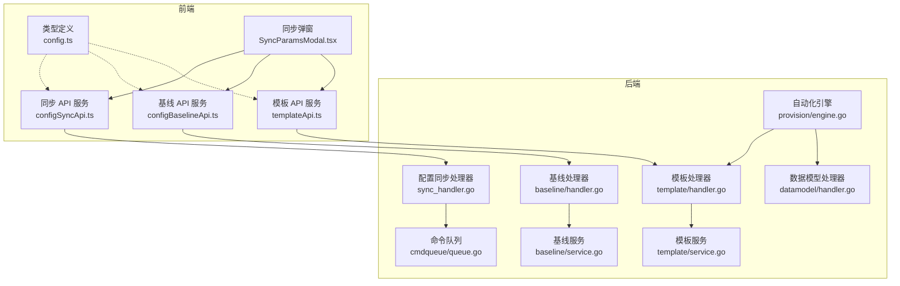
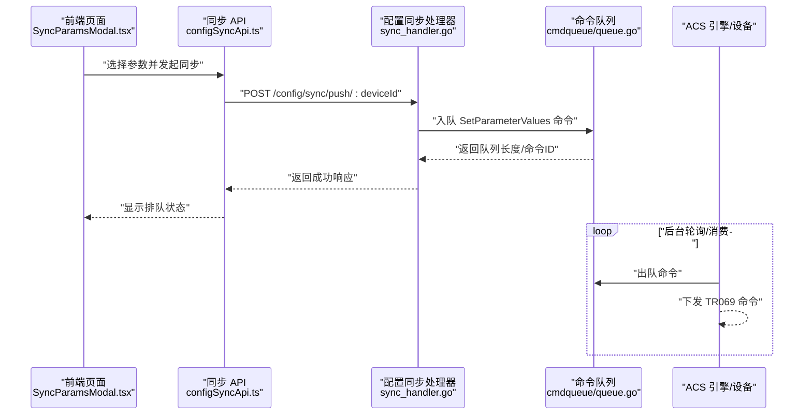
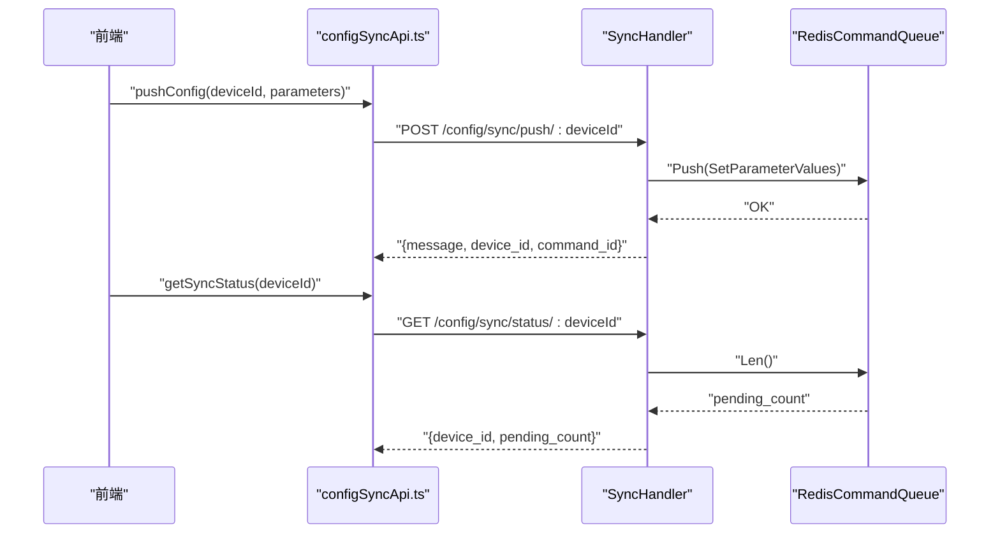
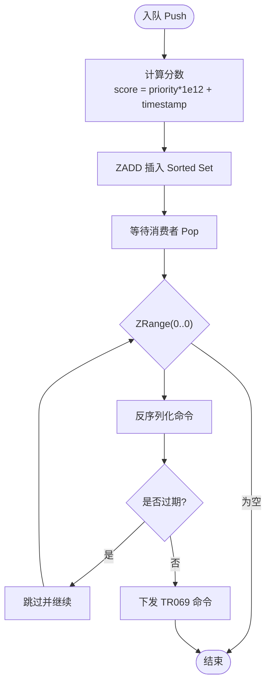
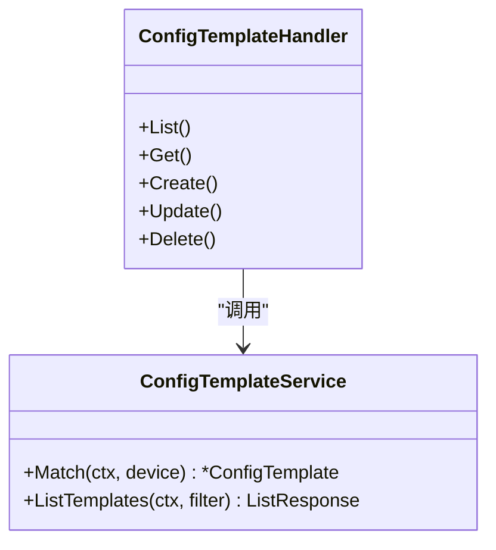
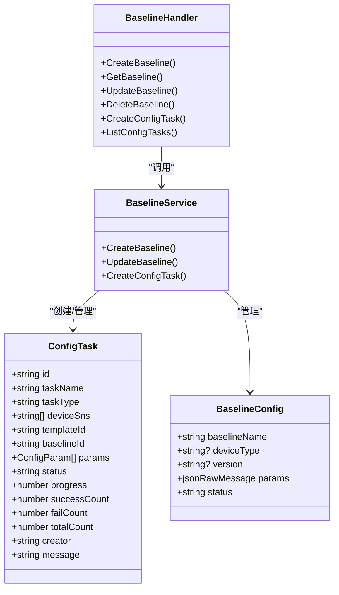
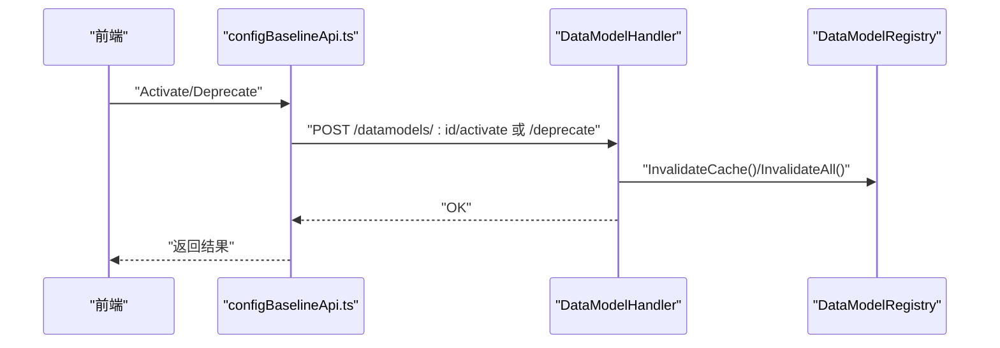
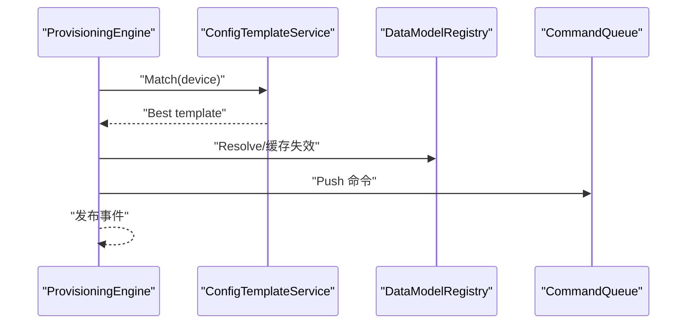
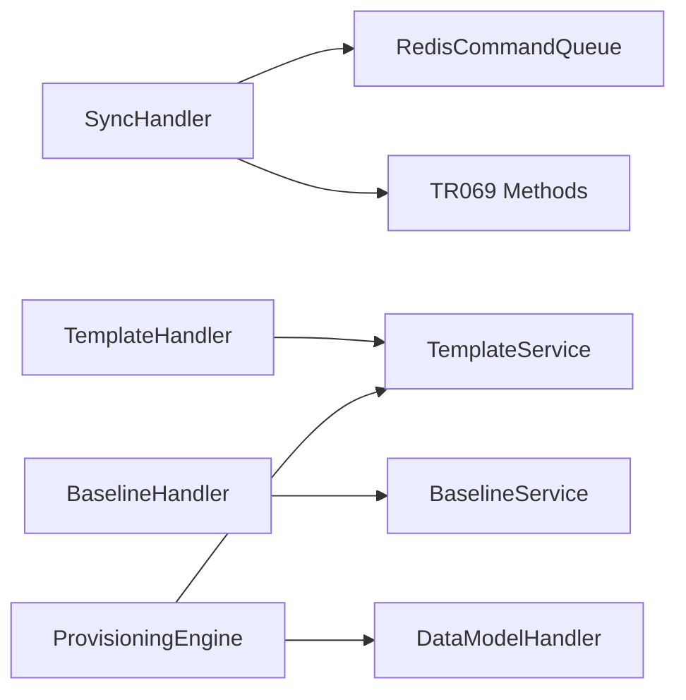

# 配置数据同步

<cite>
**本文引用的文件**
- [omcgo/internal/config/sync_handler.go](file://omcgo/internal/config/sync_handler.go)
- [omcgo/internal/acs/cmdqueue/queue.go](file://omcgo/internal/acs/cmdqueue/queue.go)
- [omcgo/internal/config/template/handler.go](file://omcgo/internal/config/template/handler.go)
- [omcgo/internal/config/template/service.go](file://omcgo/internal/config/template/service.go)
- [omcgo/internal/config/baseline/handler.go](file://omcgo/internal/config/baseline/handler.go)
- [omcgo/internal/config/baseline/service.go](file://omcgo/internal/config/baseline/service.go)
- [omcgo/internal/config/datamodel/handler.go](file://omcgo/internal/config/datamodel/handler.go)
- [omcgo/internal/provision/engine.go](file://omcgo/internal/provision/engine.go)
- [omcgo/internal/provision/repository.go](file://omcgo/internal/provision/repository.go)
- [omcgo/pkg/soap/envelope.go](file://omcgo/pkg/soap/envelope.go)
- [omcgo/docs/detailed-design/08-data-model-config.md](file://omcgo/docs/detailed-design/08-data-model-config.md)
- [omcgo/internal/core/appconfig/config.go](file://omcgo/internal/core/appconfig/config.go)
- [omcmb/webcode/src/services/api/configSyncApi.ts](file://omcmb/webcode/src/services/api/configSyncApi.ts)
- [omcmb/webcode/src/services/api/configBaselineApi.ts](file://omcmb/webcode/src/services/api/configBaselineApi.ts)
- [omcmb/webcode/src/services/api/templateApi.ts](file://omcmb/webcode/src/services/api/templateApi.ts)
- [omcmb/webcode/src/types/config.ts](file://omcmb/webcode/src/types/config.ts)
- [omcmb/webcode/src/pages/device/DeviceList/SyncParamsModal.tsx](file://omcmb/webcode/src/pages/device/DeviceList/SyncParamsModal.tsx)
</cite>

## 目录
1. [简介](#简介)
2. [项目结构](#项目结构)
3. [核心组件](#核心组件)
4. [架构总览](#架构总览)
5. [详细组件分析](#详细组件分析)
6. [依赖分析](#依赖分析)
7. [性能考虑](#性能考虑)
8. [故障排查指南](#故障排查指南)
9. [结论](#结论)
10. [附录](#附录)

## 简介
本文件面向“配置数据同步”能力，系统化阐述配置模板、基线配置与参数同步的实现原理与使用方式，覆盖以下主题：
- 同步机制：推送/拉取参数命令的队列化执行与状态查询
- 变更检测与同步类型：参数同步、批量配置、基线应用、邻区参数更新
- 版本管理、冲突处理与回滚：模板与数据模型的激活/废弃流程
- 触发条件、执行策略与监控告警：任务生命周期与前端可视化
- 配置示例、故障排查与性能优化建议

## 项目结构
围绕配置同步的关键模块分布于后端 Go 服务与前端 Web 应用：
- 后端
  - 配置同步 HTTP 接口：参数推送/拉取与状态查询
  - 命令队列：基于 Redis 的有序集合，支持优先级与过期
  - 配置模板：模板匹配与 CRUD
  - 基线配置：基线与任务的创建、查询与管理
  - 数据模型：TR069 参数树与激活/废弃
  - 自动化编排引擎：模板匹配与任务驱动
- 前端
  - 同步 API 服务：封装后端 REST 接口
  - 类型定义：任务、参数、模板、邻区等
  - 页面组件：参数选择与同步弹窗

图表来源
- [omcgo/internal/config/sync_handler.go:1-157](file://omcgo/internal/config/sync_handler.go#L1-L157)
- [omcgo/internal/acs/cmdqueue/queue.go:1-135](file://omcgo/internal/acs/cmdqueue/queue.go#L1-L135)
- [omcgo/internal/config/template/handler.go:1-189](file://omcgo/internal/config/template/handler.go#L1-L189)
- [omcgo/internal/config/template/service.go:1-53](file://omcgo/internal/config/template/service.go#L1-L53)
- [omcgo/internal/config/baseline/handler.go:1-289](file://omcgo/internal/config/baseline/handler.go#L1-L289)
- [omcgo/internal/config/baseline/service.go:1-141](file://omcgo/internal/config/baseline/service.go#L1-L141)
- [omcgo/internal/config/datamodel/handler.go:1-371](file://omcgo/internal/config/datamodel/handler.go#L1-L371)
- [omcgo/internal/provision/engine.go:1-285](file://omcgo/internal/provision/engine.go#L1-L285)
- [omcmb/webcode/src/services/api/configSyncApi.ts:1-56](file://omcmb/webcode/src/services/api/configSyncApi.ts#L1-L56)
- [omcmb/webcode/src/services/api/configBaselineApi.ts:1-173](file://omcmb/webcode/src/services/api/configBaselineApi.ts#L1-L173)
- [omcmb/webcode/src/services/api/templateApi.ts:1-46](file://omcmb/webcode/src/services/api/templateApi.ts#L1-L46)
- [omcmb/webcode/src/types/config.ts:53-72](file://omcmb/webcode/src/types/config.ts#L53-L72)
- [omcmb/webcode/src/pages/device/DeviceList/SyncParamsModal.tsx:166-197](file://omcmb/webcode/src/pages/device/DeviceList/SyncParamsModal.tsx#L166-L197)

章节来源
- [omcgo/internal/config/sync_handler.go:1-157](file://omcgo/internal/config/sync_handler.go#L1-L157)
- [omcgo/internal/acs/cmdqueue/queue.go:1-135](file://omcgo/internal/acs/cmdqueue/queue.go#L1-L135)
- [omcgo/internal/config/template/handler.go:1-189](file://omcgo/internal/config/template/handler.go#L1-L189)
- [omcgo/internal/config/template/service.go:1-53](file://omcgo/internal/config/template/service.go#L1-L53)
- [omcgo/internal/config/baseline/handler.go:1-289](file://omcgo/internal/config/baseline/handler.go#L1-L289)
- [omcgo/internal/config/baseline/service.go:1-141](file://omcgo/internal/config/baseline/service.go#L1-L141)
- [omcgo/internal/config/datamodel/handler.go:1-371](file://omcgo/internal/config/datamodel/handler.go#L1-L371)
- [omcgo/internal/provision/engine.go:1-285](file://omcgo/internal/provision/engine.go#L1-L285)
- [omcmb/webcode/src/services/api/configSyncApi.ts:1-56](file://omcmb/webcode/src/services/api/configSyncApi.ts#L1-L56)
- [omcmb/webcode/src/services/api/configBaselineApi.ts:1-173](file://omcmb/webcode/src/services/api/configBaselineApi.ts#L1-L173)
- [omcmb/webcode/src/services/api/templateApi.ts:1-46](file://omcmb/webcode/src/services/api/templateApi.ts#L1-L46)
- [omcmb/webcode/src/types/config.ts:53-72](file://omcmb/webcode/src/types/config.ts#L53-L72)
- [omcmb/webcode/src/pages/device/DeviceList/SyncParamsModal.tsx:166-197](file://omcmb/webcode/src/pages/device/DeviceList/SyncParamsModal.tsx#L166-L197)

## 核心组件
- 配置同步处理器
  - 提供参数推送/拉取与状态查询接口，内部将命令入队并返回命令标识
- 命令队列
  - 基于 Redis Sorted Set，支持优先级、FIFO 同优先级排序、过期跳过与长度查询
- 配置模板
  - 模板匹配按运营商+制式+产品类别的优先级选择最优模板；支持 CRUD
- 基线配置
  - 基线与任务的创建、查询与管理；任务状态包含待执行/运行中/成功/失败/部分/取消
- 数据模型
  - TR069 参数树的导入、导出、激活/废弃与缓存刷新
- 自动化引擎
  - 结合模板与数据模型，驱动设备自动编排流程

章节来源
- [omcgo/internal/config/sync_handler.go:1-157](file://omcgo/internal/config/sync_handler.go#L1-L157)
- [omcgo/internal/acs/cmdqueue/queue.go:1-135](file://omcgo/internal/acs/cmdqueue/queue.go#L1-L135)
- [omcgo/internal/config/template/handler.go:1-189](file://omcgo/internal/config/template/handler.go#L1-L189)
- [omcgo/internal/config/template/service.go:1-53](file://omcgo/internal/config/template/service.go#L1-L53)
- [omcgo/internal/config/baseline/handler.go:1-289](file://omcgo/internal/config/baseline/handler.go#L1-L289)
- [omcgo/internal/config/baseline/service.go:1-141](file://omcgo/internal/config/baseline/service.go#L1-L141)
- [omcgo/internal/config/datamodel/handler.go:1-371](file://omcgo/internal/config/datamodel/handler.go#L1-L371)
- [omcgo/internal/provision/engine.go:1-285](file://omcgo/internal/provision/engine.go#L1-L285)

## 架构总览
下图展示从前端到后端的调用链路与关键交互点。

图表来源
- [omcmb/webcode/src/pages/device/DeviceList/SyncParamsModal.tsx:166-197](file://omcmb/webcode/src/pages/device/DeviceList/SyncParamsModal.tsx#L166-L197)
- [omcmb/webcode/src/services/api/configSyncApi.ts:1-56](file://omcmb/webcode/src/services/api/configSyncApi.ts#L1-L56)
- [omcgo/internal/config/sync_handler.go:61-97](file://omcgo/internal/config/sync_handler.go#L61-L97)
- [omcgo/internal/acs/cmdqueue/queue.go:49-72](file://omcgo/internal/acs/cmdqueue/queue.go#L49-L72)

## 详细组件分析

### 配置参数同步（推送/拉取）
- 推送参数
  - 接口：POST /config/sync/push/:deviceId
  - 输入：参数名-值-类型数组
  - 行为：将 SetParameterValues 命令入队，返回命令ID与设备ID
- 拉取参数
  - 接口：POST /config/sync/pull/:deviceId
  - 输入：参数名数组
  - 行为：将 GetParameterValues 命令入队，返回命令ID与设备ID
- 同步状态
  - 接口：GET /config/sync/status/:deviceId
  - 行为：返回设备待处理命令数量

图表来源
- [omcmb/webcode/src/services/api/configSyncApi.ts:24-56](file://omcmb/webcode/src/services/api/configSyncApi.ts#L24-L56)
- [omcgo/internal/config/sync_handler.go:51-156](file://omcgo/internal/config/sync_handler.go#L51-L156)
- [omcgo/internal/acs/cmdqueue/queue.go:24-135](file://omcgo/internal/acs/cmdqueue/queue.go#L24-L135)

章节来源
- [omcgo/internal/config/sync_handler.go:1-157](file://omcgo/internal/config/sync_handler.go#L1-L157)
- [omcgo/internal/acs/cmdqueue/queue.go:1-135](file://omcgo/internal/acs/cmdqueue/queue.go#L1-L135)
- [omcmb/webcode/src/services/api/configSyncApi.ts:1-56](file://omcmb/webcode/src/services/api/configSyncApi.ts#L1-L56)

### 命令队列与执行策略
- 存储与键空间
  - 使用 Redis Sorted Set，键命名空间以设备序列号区分
- 优先级与公平性
  - 分数由优先级与时间戳组合，同优先级内按时间顺序 FIFO
- 过期与跳过
  - 出队时若命令已过期则跳过，尝试下一个
- 执行策略
  - 后台消费者循环出队并下发 TR069 命令；失败重试由上层流程或设备侧处理

图表来源
- [omcgo/internal/acs/cmdqueue/queue.go:33-135](file://omcgo/internal/acs/cmdqueue/queue.go#L33-L135)
- [omcgo/pkg/soap/envelope.go:37-60](file://omcgo/pkg/soap/envelope.go#L37-L60)

章节来源
- [omcgo/internal/acs/cmdqueue/queue.go:1-135](file://omcgo/internal/acs/cmdqueue/queue.go#L1-L135)
- [omcgo/pkg/soap/envelope.go:1-60](file://omcgo/pkg/soap/envelope.go#L1-L60)

### 配置模板与匹配
- 模板匹配策略
  - 优先级：运营商+制式+产品类别 > 运营商+制式（无产品类别）
  - 返回最优激活模板或空
- 模板 CRUD
  - 支持分页查询、详情、创建、更新、删除

图表来源
- [omcgo/internal/config/template/service.go:25-47](file://omcgo/internal/config/template/service.go#L25-L47)
- [omcgo/internal/config/template/handler.go:22-189](file://omcgo/internal/config/template/handler.go#L22-L189)

章节来源
- [omcgo/internal/config/template/service.go:1-53](file://omcgo/internal/config/template/service.go#L1-L53)
- [omcgo/internal/config/template/handler.go:1-189](file://omcgo/internal/config/template/handler.go#L1-L189)

### 基线配置与任务
- 基线管理
  - 创建/获取/更新/删除基线；默认状态为草稿；参数可为空
- 任务管理
  - 任务类型：参数同步、批量配置、基线应用、邻区更新
  - 任务状态：待执行、运行中、成功、失败、部分、取消
  - 任务字段：设备列表、模板/基线ID、参数、进度与计数、消息等

图表来源
- [omcgo/internal/config/baseline/handler.go:72-262](file://omcgo/internal/config/baseline/handler.go#L72-L262)
- [omcgo/internal/config/baseline/service.go:39-141](file://omcgo/internal/config/baseline/service.go#L39-L141)
- [omcmb/webcode/src/types/config.ts:53-72](file://omcmb/webcode/src/types/config.ts#L53-L72)

章节来源
- [omcgo/internal/config/baseline/handler.go:1-289](file://omcgo/internal/config/baseline/handler.go#L1-L289)
- [omcgo/internal/config/baseline/service.go:1-141](file://omcgo/internal/config/baseline/service.go#L1-L141)
- [omcmb/webcode/src/types/config.ts:53-72](file://omcmb/webcode/src/types/config.ts#L53-L72)

### 数据模型与版本管理
- 数据模型
  - 支持导入/导出、激活/废弃、缓存刷新、解析测试、统计等
  - 激活/废弃后会失效相关缓存，确保后续解析使用最新模型
- 版本与激活
  - 通过激活/废弃控制生效范围；废弃后仍可保留以便审计与回溯

图表来源
- [omcgo/internal/config/datamodel/handler.go:217-260](file://omcgo/internal/config/datamodel/handler.go#L217-L260)
- [omcgo/docs/detailed-design/08-data-model-config.md:275-320](file://omcgo/docs/detailed-design/08-data-model-config.md#L275-L320)

章节来源
- [omcgo/internal/config/datamodel/handler.go:1-371](file://omcgo/internal/config/datamodel/handler.go#L1-L371)
- [omcgo/docs/detailed-design/08-data-model-config.md:275-320](file://omcgo/docs/detailed-design/08-data-model-config.md#L275-L320)

### 自动化编排与模板匹配
- 引擎职责
  - 依据设备信息匹配模板，结合数据模型与命令队列推进自动化流程
- 事件发布
  - 成功/失败时发布事件，便于外部系统感知

图表来源
- [omcgo/internal/provision/engine.go:19-285](file://omcgo/internal/provision/engine.go#L19-L285)
- [omcgo/internal/config/template/service.go:25-47](file://omcgo/internal/config/template/service.go#L25-L47)

章节来源
- [omcgo/internal/provision/engine.go:1-285](file://omcgo/internal/provision/engine.go#L1-L285)
- [omcgo/internal/config/template/service.go:1-53](file://omcgo/internal/config/template/service.go#L1-L53)

## 依赖分析
- 组件耦合
  - 配置同步处理器依赖命令队列；模板/基线/数据模型处理器分别依赖对应服务与仓库
  - 自动化引擎聚合模板与数据模型，驱动命令队列
- 外部依赖
  - Redis 用于命令队列存储
  - TR069 方法常量用于统一方法名

图表来源
- [omcgo/internal/config/sync_handler.go:1-157](file://omcgo/internal/config/sync_handler.go#L1-L157)
- [omcgo/internal/acs/cmdqueue/queue.go:1-135](file://omcgo/internal/acs/cmdqueue/queue.go#L1-L135)
- [omcgo/internal/config/template/handler.go:1-189](file://omcgo/internal/config/template/handler.go#L1-L189)
- [omcgo/internal/config/template/service.go:1-53](file://omcgo/internal/config/template/service.go#L1-L53)
- [omcgo/internal/config/baseline/handler.go:1-289](file://omcgo/internal/config/baseline/handler.go#L1-L289)
- [omcgo/internal/config/baseline/service.go:1-141](file://omcgo/internal/config/baseline/service.go#L1-L141)
- [omcgo/internal/config/datamodel/handler.go:1-371](file://omcgo/internal/config/datamodel/handler.go#L1-L371)
- [omcgo/internal/provision/engine.go:1-285](file://omcgo/internal/provision/engine.go#L1-L285)
- [omcgo/pkg/soap/envelope.go:37-60](file://omcgo/pkg/soap/envelope.go#L37-L60)

章节来源
- [omcgo/internal/config/sync_handler.go:1-157](file://omcgo/internal/config/sync_handler.go#L1-L157)
- [omcgo/internal/acs/cmdqueue/queue.go:1-135](file://omcgo/internal/acs/cmdqueue/queue.go#L1-L135)
- [omcgo/internal/config/template/handler.go:1-189](file://omcgo/internal/config/template/handler.go#L1-L189)
- [omcgo/internal/config/template/service.go:1-53](file://omcgo/internal/config/template/service.go#L1-L53)
- [omcgo/internal/config/baseline/handler.go:1-289](file://omcgo/internal/config/baseline/handler.go#L1-L289)
- [omcgo/internal/config/baseline/service.go:1-141](file://omcgo/internal/config/baseline/service.go#L1-L141)
- [omcgo/internal/config/datamodel/handler.go:1-371](file://omcgo/internal/config/datamodel/handler.go#L1-L371)
- [omcgo/internal/provision/engine.go:1-285](file://omcgo/internal/provision/engine.go#L1-L285)
- [omcgo/pkg/soap/envelope.go:1-60](file://omcgo/pkg/soap/envelope.go#L1-L60)

## 性能考虑
- 队列性能
  - Redis Sorted Set 的 ZADD/ZRANGE 操作在高并发下具备良好吞吐；注意合理设置池大小与网络延迟
- 优先级与公平性
  - 通过分数组合实现优先级与时间戳兼顾；避免低优先级长期饿死
- 过期与重试
  - 命令过期跳过减少无效负载；上层应结合设备状态与错误码进行重试策略
- 缓存与模型
  - 激活/废弃后及时失效缓存，避免解析到陈旧参数树导致额外往返
- 前端轮询
  - 合理设置状态查询频率，避免频繁请求造成后端压力

[本节为通用指导，无需特定文件来源]

## 故障排查指南
- 常见问题定位
  - 推送/拉取失败：检查请求体参数合法性与设备ID有效性；查看后端错误响应
  - 无命令执行：确认命令已入队且未过期；检查消费者是否正常运行
  - 状态异常：GET /config/sync/status 返回非零待处理数，需检查队列长度与设备连接
- 基线与模板
  - 基线更新后未生效：确认状态为激活；检查模板匹配是否正确
  - 模板不匹配：核对运营商、制式、产品类别是否满足匹配优先级
- 数据模型
  - 激活/废弃后解析异常：确认缓存已失效；必要时手动刷新缓存
- 监控与告警
  - 建议监控队列长度、命令执行耗时、失败率与设备在线率；对异常峰值进行告警

章节来源
- [omcgo/internal/config/sync_handler.go:61-156](file://omcgo/internal/config/sync_handler.go#L61-L156)
- [omcgo/internal/acs/cmdqueue/queue.go:49-135](file://omcgo/internal/acs/cmdqueue/queue.go#L49-L135)
- [omcgo/internal/config/baseline/handler.go:115-206](file://omcgo/internal/config/baseline/handler.go#L115-L206)
- [omcgo/internal/config/template/handler.go:98-189](file://omcgo/internal/config/template/handler.go#L98-L189)
- [omcgo/internal/config/datamodel/handler.go:217-260](file://omcgo/internal/config/datamodel/handler.go#L217-L260)

## 结论
配置数据同步通过“REST 接口 + 命令队列 + 模板/基线/数据模型”的协同，实现了参数推送/拉取、任务编排与版本治理的闭环。建议在生产环境中完善监控告警、重试策略与缓存一致性保障，并结合前端可视化提升可观测性与运维效率。

[本节为总结性内容，无需特定文件来源]

## 附录

### 配置示例与最佳实践
- 参数同步
  - 使用同步 API 发起推送/拉取；通过状态接口观察排队情况
- 基线应用
  - 创建基线并设为激活；通过任务接口批量下发至目标设备
- 模板匹配
  - 确保模板的运营商/制式/产品类别完整；优先使用激活模板
- 数据模型
  - 新增/变更后及时激活；废弃前评估影响面

章节来源
- [omcmb/webcode/src/services/api/configSyncApi.ts:24-56](file://omcmb/webcode/src/services/api/configSyncApi.ts#L24-L56)
- [omcmb/webcode/src/services/api/configBaselineApi.ts:122-173](file://omcmb/webcode/src/services/api/configBaselineApi.ts#L122-L173)
- [omcgo/internal/config/template/service.go:25-47](file://omcgo/internal/config/template/service.go#L25-L47)
- [omcgo/internal/config/datamodel/handler.go:217-260](file://omcgo/internal/config/datamodel/handler.go#L217-L260)

### 触发条件与执行策略
- 触发条件
  - 用户在前端发起同步或批量任务；模板/基线变更后触发应用
- 执行策略
  - 命令队列按优先级与时间顺序执行；失败时根据策略重试或标记失败
- 监控告警
  - 队列积压、失败率、设备离线率等指标作为告警阈值

章节来源
- [omcgo/internal/acs/cmdqueue/queue.go:49-135](file://omcgo/internal/acs/cmdqueue/queue.go#L49-L135)
- [omcgo/internal/config/sync_handler.go:61-156](file://omcgo/internal/config/sync_handler.go#L61-L156)
- [omcgo/internal/config/baseline/handler.go:235-262](file://omcgo/internal/config/baseline/handler.go#L235-L262)

### 关键配置项参考
- Redis 连接与池大小
- 日志级别与输出路径
- 指标与追踪开关

章节来源
- [omcgo/internal/core/appconfig/config.go:158-221](file://omcgo/internal/core/appconfig/config.go#L158-L221)