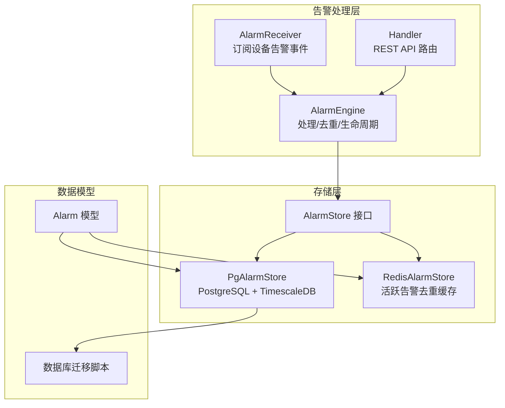
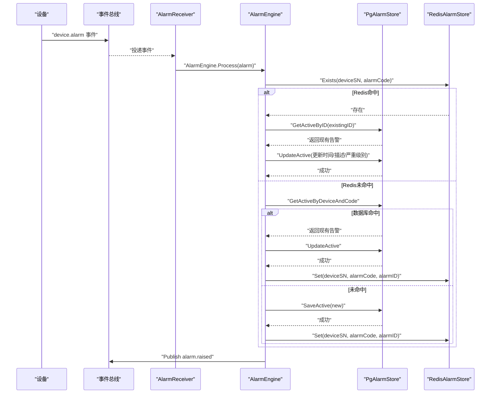
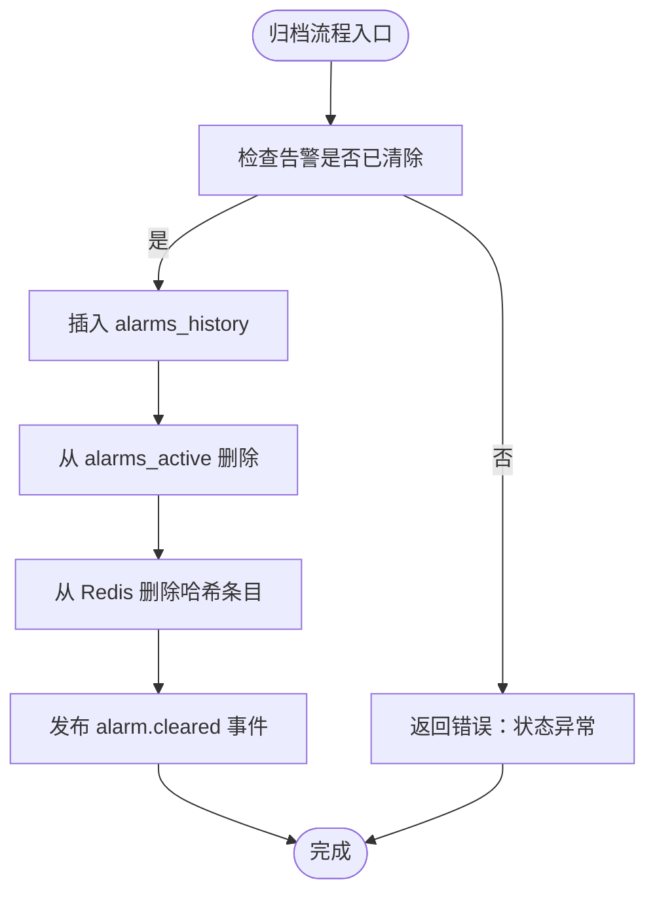
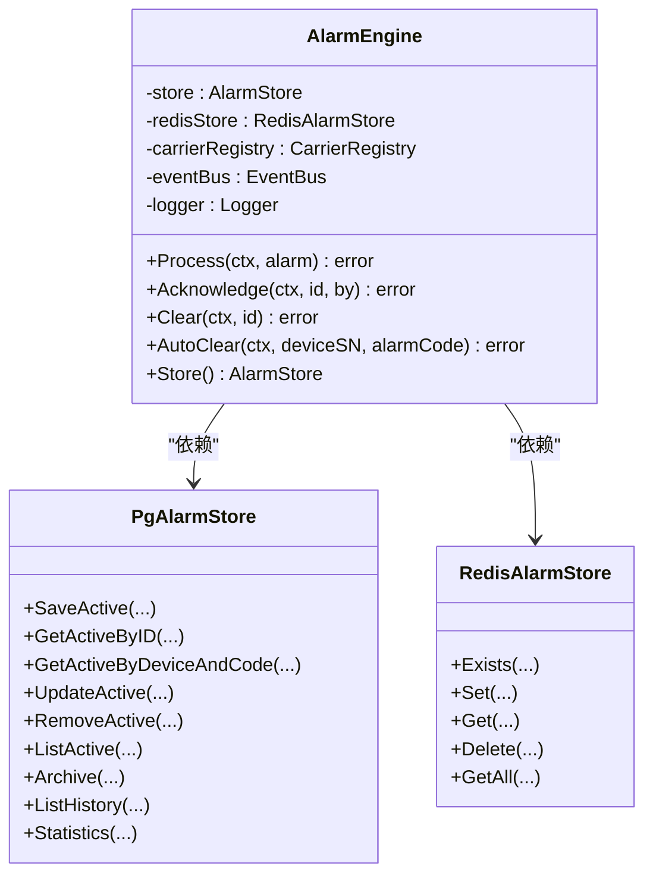
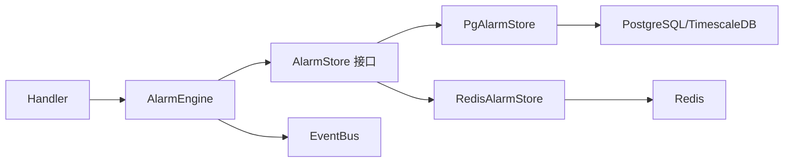

# 告警存储系统

<cite>
**本文引用的文件**
- [store.go](file://omcgo/internal/alarm/store.go)
- [pg_store.go](file://omcgo/internal/alarm/pg_store.go)
- [redis_store.go](file://omcgo/internal/alarm/redis_store.go)
- [engine.go](file://omcgo/internal/alarm/engine.go)
- [handler.go](file://omcgo/internal/alarm/handler.go)
- [receiver.go](file://omcgo/internal/alarm/receiver.go)
- [alarm.go](file://omcgo/internal/core/model/alarm.go)
- [000012_create_alarms.up.sql](file://omcgo/migrations/000012_create_alarms.up.sql)
- [config.dev.yaml](file://omcgo/cmd/app/etc/config.dev.yaml)
- [04-alarm-management.md](file://omcgo/docs/features/04-alarm-management.md)
- [12-alarm-management.md](file://omcgo/docs/detailed-design/12-alarm-management.md)
</cite>

## 目录
1. [简介](#简介)
2. [项目结构](#项目结构)
3. [核心组件](#核心组件)
4. [架构总览](#架构总览)
5. [详细组件分析](#详细组件分析)
6. [依赖关系分析](#依赖关系分析)
7. [性能考虑](#性能考虑)
8. [故障排查指南](#故障排查指南)
9. [结论](#结论)
10. [附录](#附录)

## 简介
本文件面向告警存储系统，系统性阐述活跃告警存储、历史告警存储与 Redis 缓存存储的实现原理与架构设计；详解 AlarmStore 接口设计、PostgreSQL/TimescaleDB 存储实现、Redis 缓存实现；说明告警数据持久化策略、缓存机制与数据一致性保障；覆盖告警查询接口、分页机制、索引优化与性能调优；并提供配置项、备份恢复策略与容量规划建议，以及存储 API 使用示例与最佳实践。

## 项目结构
告警存储系统位于后端工程 omcgo 的 internal/alarm 目录，围绕 AlarmStore 接口与 AlarmEngine 引擎构建，配合 Gin 路由处理器与事件总线，形成“事件驱动 + 分层存储”的完整闭环。

图表来源
- [engine.go:15-39](file://omcgo/internal/alarm/engine.go#L15-L39)
- [handler.go:14-37](file://omcgo/internal/alarm/handler.go#L14-L37)
- [store.go:30-41](file://omcgo/internal/alarm/store.go#L30-L41)
- [pg_store.go:17-26](file://omcgo/internal/alarm/pg_store.go#L17-L26)
- [redis_store.go:10-18](file://omcgo/internal/alarm/redis_store.go#L10-L18)
- [alarm.go:9-27](file://omcgo/internal/core/model/alarm.go#L9-L27)
- [000012_create_alarms.up.sql:1-53](file://omcgo/migrations/000012_create_alarms.up.sql#L1-L53)

章节来源
- [engine.go:15-39](file://omcgo/internal/alarm/engine.go#L15-L39)
- [handler.go:14-37](file://omcgo/internal/alarm/handler.go#L14-L37)
- [store.go:30-41](file://omcgo/internal/alarm/store.go#L30-L41)
- [pg_store.go:17-26](file://omcgo/internal/alarm/pg_store.go#L17-L26)
- [redis_store.go:10-18](file://omcgo/internal/alarm/redis_store.go#L10-L18)
- [alarm.go:9-27](file://omcgo/internal/core/model/alarm.go#L9-L27)
- [000012_create_alarms.up.sql:1-53](file://omcgo/migrations/000012_create_alarms.up.sql#L1-L53)

## 核心组件
- AlarmStore 接口：定义活跃告警的保存、查询、更新、删除、归档、历史查询与统计等能力，是存储抽象的核心契约。
- PgAlarmStore：基于 PostgreSQL 与 TimescaleDB 的实现，负责活跃告警写入、查询与活跃统计，历史告警归档与查询。
- RedisAlarmStore：基于 Redis 的 L1 缓存，用于活跃告警去重与快速存在性判断。
- AlarmEngine：事件驱动的引擎，负责告警严重级别映射、去重、生命周期管理（确认/清除），并发布事件。
- Handler：REST API 层，提供活跃告警列表、历史告警列表、统计、按 ID 查询、确认与清除等接口。
- AlarmReceiver：订阅设备告警事件，转换为内部 Alarm 模型并交由引擎处理。
- Alarm 模型：统一的告警数据结构，包含设备标识、告警码、类型、严重级别、状态、时间戳与附加信息等。
- 数据库迁移：创建 alarms_active（活跃告警）与 alarms_history（历史告警，TimescaleDB 超表）及其索引。

章节来源
- [store.go:30-41](file://omcgo/internal/alarm/store.go#L30-L41)
- [pg_store.go:17-26](file://omcgo/internal/alarm/pg_store.go#L17-L26)
- [redis_store.go:10-18](file://omcgo/internal/alarm/redis_store.go#L10-L18)
- [engine.go:15-39](file://omcgo/internal/alarm/engine.go#L15-L39)
- [handler.go:14-37](file://omcgo/internal/alarm/handler.go#L14-L37)
- [receiver.go:26-35](file://omcgo/internal/alarm/receiver.go#L26-L35)
- [alarm.go:9-27](file://omcgo/internal/core/model/alarm.go#L9-L27)
- [000012_create_alarms.up.sql:1-53](file://omcgo/migrations/000012_create_alarms.up.sql#L1-L53)

## 架构总览
系统采用“事件驱动 + 分层存储”架构：
- 设备通过 TR069 Inform 或专用接口上报告警，AlarmReceiver 订阅并解码为 Alarm。
- AlarmEngine 执行严重级别映射、Redis 去重检查、数据库二次校验与更新/新建，完成后发布 alarm.raised 事件。
- PgAlarmStore 写入活跃告警表，Redis 记录活跃告警键值对；当告警被清除时，先归档到历史表，再从活跃表移除，并清理 Redis。
- Handler 提供 REST 接口，支持活跃/历史查询、分页、统计与生命周期操作。

图表来源
- [receiver.go:37-49](file://omcgo/internal/alarm/receiver.go#L37-L49)
- [engine.go:41-134](file://omcgo/internal/alarm/engine.go#L41-L134)
- [pg_store.go:28-108](file://omcgo/internal/alarm/pg_store.go#L28-L108)
- [redis_store.go:24-32](file://omcgo/internal/alarm/redis_store.go#L24-L32)

章节来源
- [receiver.go:26-85](file://omcgo/internal/alarm/receiver.go#L26-L85)
- [engine.go:41-134](file://omcgo/internal/alarm/engine.go#L41-L134)
- [pg_store.go:28-108](file://omcgo/internal/alarm/pg_store.go#L28-L108)
- [redis_store.go:24-32](file://omcgo/internal/alarm/redis_store.go#L24-L32)

## 详细组件分析

### AlarmStore 接口设计
- 职责边界清晰：仅暴露活跃/历史/统计三类能力，便于替换实现。
- 方法语义明确：SaveActive、GetActiveByID、GetActiveByDeviceAndCode、UpdateActive、RemoveActive、Archive、ListActive、ListHistory、Statistics。
- 查询参数：AlarmFilter 支持设备、序列号、运营商、严重级别、状态、时间范围与分页请求。

章节来源
- [store.go:11-41](file://omcgo/internal/alarm/store.go#L11-L41)

### PostgreSQL/TimescaleDB 存储实现
- 表结构与索引
  - alarms_active：UUID 主键，device_id/device_sn+alarm_code 复合索引，severity/status 索引，additional_info 使用 JSONB 存储扩展字段。
  - alarms_history：时间维度列 time，hypertable（按 7 天切片），保留策略 365 天；索引 idx_alarms_history_device、idx_alarms_history_alarm。
- 活跃告警
  - 写入：Insert 到 alarms_active，包含所有必要字段。
  - 查询：applyActiveFilters 应用多维过滤，COUNT + ORDER BY raised_at DESC + Limit/Offset 实现分页。
  - 更新：Update 严重级别、状态、时间戳与附加信息。
  - 删除：按 ID 删除。
  - 统计：活跃总数、按严重级别与告警类型聚合。
- 历史告警
  - 归档：Insert 到 alarms_history，使用当前时间作为 time 字段。
  - 查询：按 device_id/时间范围过滤，按 time DESC 分页。
- 错误处理：每个 SQL 操作均包裹错误包装，便于定位问题。

图表来源
- [pg_store.go:110-122](file://omcgo/internal/alarm/pg_store.go#L110-L122)
- [pg_store.go:170-212](file://omcgo/internal/alarm/pg_store.go#L170-L212)

章节来源
- [pg_store.go:17-273](file://omcgo/internal/alarm/pg_store.go#L17-L273)
- [000012_create_alarms.up.sql:1-53](file://omcgo/migrations/000012_create_alarms.up.sql#L1-L53)

### Redis 缓存实现
- 结构：Hash，键名 alarm:active:{deviceSN}，键为 alarmCode，值为 alarm ID。
- 能力：Exists、Set、Get、Delete、GetAll，用于活跃告警去重与快速存在性判断。
- 一致性：Redis 作为 L1 缓存，若命中则直接更新现有活跃告警；若未命中，则回退到数据库校验与写入。

章节来源
- [redis_store.go:10-52](file://omcgo/internal/alarm/redis_store.go#L10-L52)

### AlarmEngine：处理、去重与生命周期
- 严重级别映射：通过 CarrierRegistry 将设备告警码映射为统一严重级别。
- 去重策略：优先 Redis HExists/HGet，若未命中则查询数据库 GetActiveByDeviceAndCode，命中则更新而非新增。
- 生命周期：
  - 确认：将状态置为 acknowledged，记录确认时间与人员。
  - 清除：归档到历史表，删除活跃记录，清理 Redis。
  - 自动清除：根据 deviceSN + alarmCode 查找并清除。
- 事件发布：处理成功后发布 alarm.raised；确认/清除分别发布 alarm.acknowledged 与 alarm.cleared。

图表来源
- [engine.go:15-39](file://omcgo/internal/alarm/engine.go#L15-L39)
- [pg_store.go:17-26](file://omcgo/internal/alarm/pg_store.go#L17-L26)
- [redis_store.go:10-18](file://omcgo/internal/alarm/redis_store.go#L10-L18)

章节来源
- [engine.go:41-230](file://omcgo/internal/alarm/engine.go#L41-L230)

### Handler：REST API 与分页
- 路由注册：/alarms/active、/alarms/history、/alarms/statistics、/alarms/:id、/alarms/:id/acknowledge、/alarms/:id/clear。
- 查询参数：device_id、device_sn、carrier、severity、status、start_time、end_time，结合分页 ListRequest。
- 分页机制：ListActive/ListHistory 基于 COUNT + ORDER BY + Limit/Offset，返回 model.ListResponse。
- 状态码：错误时返回 400/404/500，成功返回 200 与结果。

章节来源
- [handler.go:26-206](file://omcgo/internal/alarm/handler.go#L26-L206)

### AlarmReceiver：事件订阅与载荷转换
- 订阅主题：device.alarm，加入队列组 alarm-workers。
- 载荷解析：AlarmPayload → model.Alarm，包含设备标识、告警码、类型、描述、严重级别、时间戳与附加信息。
- 错误处理：解析失败或 UUID 解析失败时记录错误并返回。

章节来源
- [receiver.go:37-85](file://omcgo/internal/alarm/receiver.go#L37-L85)

### 数据模型与迁移
- Alarm 模型：统一字段定义，含 UUID 主键、设备标识、告警码/类型、严重级别、状态、时间戳与 JSONB 扩展。
- 迁移脚本：创建 alarms_active/alarms_history 表，建立索引；若 TimescaleDB 可用则创建超表并设置保留策略。

章节来源
- [alarm.go:9-27](file://omcgo/internal/core/model/alarm.go#L9-L27)
- [000012_create_alarms.up.sql:1-53](file://omcgo/migrations/000012_create_alarms.up.sql#L1-L53)

## 依赖关系分析
- AlarmEngine 依赖 AlarmStore 接口与 RedisAlarmStore；通过事件总线发布生命周期事件。
- Handler 依赖 AlarmEngine 与 AlarmStore，提供 REST API。
- PgAlarmStore 依赖 pgx 连接池与 squirrel 查询构造器；RedisAlarmStore 依赖 go-redis 客户端。
- 数据模型与迁移脚本为存储层提供结构支撑。

图表来源
- [handler.go:14-24](file://omcgo/internal/alarm/handler.go#L14-L24)
- [engine.go:15-39](file://omcgo/internal/alarm/engine.go#L15-L39)
- [pg_store.go:17-26](file://omcgo/internal/alarm/pg_store.go#L17-L26)
- [redis_store.go:10-18](file://omcgo/internal/alarm/redis_store.go#L10-L18)

章节来源
- [handler.go:14-24](file://omcgo/internal/alarm/handler.go#L14-L24)
- [engine.go:15-39](file://omcgo/internal/alarm/engine.go#L15-L39)
- [pg_store.go:17-26](file://omcgo/internal/alarm/pg_store.go#L17-L26)
- [redis_store.go:10-18](file://omcgo/internal/alarm/redis_store.go#L10-L18)

## 性能考虑
- 索引优化
  - 活跃表：device_id、device_sn+alarm_code、severity、status 索引，满足高频查询与去重场景。
  - 历史表：hypertable 按 time 切片，索引 idx_alarms_history_device、idx_alarms_history_alarm，支持按设备与告警 ID 快速检索。
- 分页与排序
  - ListActive/ListHistory 使用 COUNT + ORDER BY + Limit/Offset，避免全表扫描；建议前端固定排序字段与方向，减少复杂排序。
- 缓存去重
  - Redis Hash 作为 L1 缓存，显著降低重复告警写入与数据库压力；注意缓存失效策略与一致性。
- 连接池与慢查询
  - PostgreSQL 与 TimescaleDB 连接池参数可调；开启慢查询日志阈值，定期分析热点 SQL。
- 事件总线
  - AlarmReceiver 加入队列组，避免单点阻塞；合理设置最大重连与等待时间。

章节来源
- [000012_create_alarms.up.sql:20-53](file://omcgo/migrations/000012_create_alarms.up.sql#L20-L53)
- [pg_store.go:75-108](file://omcgo/internal/alarm/pg_store.go#L75-L108)
- [config.dev.yaml:11-31](file://omcgo/cmd/app/etc/config.dev.yaml#L11-L31)

## 故障排查指南
- 常见错误与定位
  - 插入/更新/删除失败：查看 PgAlarmStore 对应 SQL 包裹的错误上下文，确认字段与类型匹配。
  - 查询无结果：检查 AlarmFilter 条件与索引是否覆盖，确认分页参数是否正确。
  - Redis 去重失败：确认键命名与 Hash 写入是否一致，检查 Redis 连接与权限。
  - 事件未发布：检查 EventBus 配置与订阅是否正常。
- 日志与可观测性
  - AlarmEngine 在处理关键路径打印 Info/Warn 级日志，便于定位问题。
  - Handler 对错误进行统一包装与返回，便于前端与运维定位。
- 数据一致性
  - 清除流程：先 Archive 再 RemoveActive，最后清理 Redis；任一步失败需回滚或重试。
  - 去重流程：Redis 未命中时回退数据库校验，确保不会重复创建。

章节来源
- [pg_store.go:28-122](file://omcgo/internal/alarm/pg_store.go#L28-L122)
- [engine.go:41-230](file://omcgo/internal/alarm/engine.go#L41-L230)
- [handler.go:50-90](file://omcgo/internal/alarm/handler.go#L50-L90)

## 结论
告警存储系统通过 AlarmStore 接口实现存储抽象，结合 PostgreSQL/TimescaleDB 与 Redis，形成高可用、高性能的活跃/历史双层存储体系。事件驱动的 AlarmEngine 实现了去重、映射与生命周期管理，并通过 Handler 提供完善的 REST API。合理的索引与分页策略、缓存去重与连接池配置共同保障了系统的稳定性与扩展性。

## 附录

### 存储 API 使用示例与最佳实践
- 新增活跃告警
  - 步骤：AlarmReceiver 订阅设备告警事件 → AlarmEngine.Process 去重与保存 → 发布 alarm.raised。
  - 最佳实践：确保 Redis 命中优先，数据库回退只在必要时触发；对严重级别映射失败进行降级记录。
- 查询活跃告警
  - 步骤：Handler.ListActive → AlarmStore.ListActive → COUNT + 分页查询。
  - 最佳实践：固定排序字段（如 raised_at），避免复杂排序导致性能下降。
- 查询历史告警
  - 步骤：Handler.ListHistory → AlarmStore.ListHistory → 按时间与设备过滤。
  - 最佳实践：合理设置 start_time/end_time，避免跨年度/超长区间查询。
- 确认与清除
  - 步骤：Handler.Acknowledge → AlarmEngine.Acknowledge；Handler.Clear → AlarmEngine.Clear → 归档/删除/清理 Redis → 发布 alarm.cleared。
  - 最佳实践：清除前检查状态，避免重复清除；失败时重试并记录日志。
- 统计
  - 步骤：Handler.Statistics → AlarmStore.Statistics → 活跃总数、按严重级别与类型聚合。
  - 最佳实践：定期缓存统计结果，减少热查询压力。

章节来源
- [receiver.go:37-85](file://omcgo/internal/alarm/receiver.go#L37-L85)
- [engine.go:136-224](file://omcgo/internal/alarm/engine.go#L136-L224)
- [handler.go:50-190](file://omcgo/internal/alarm/handler.go#L50-L190)
- [pg_store.go:177-216](file://omcgo/internal/alarm/pg_store.go#L177-L216)

### 配置选项
- 数据库连接池（PostgreSQL/TimescaleDB）
  - dsn、max_conns、min_conns、max_conn_lifetime、max_conn_idle_time、health_check_interval、log_sql、log_sql_params、log_sql_slow_threshold。
- Redis
  - addrs、password、db、pool_size。
- NATS、MinIO、JWT、CORS、指标、追踪、日志等通用配置。

章节来源
- [config.dev.yaml:11-99](file://omcgo/cmd/app/etc/config.dev.yaml#L11-L99)

### 备份恢复策略
- PostgreSQL/TimescaleDB
  - 使用逻辑备份（如 pg_dump）定期导出 alarms_active/alarms_history 表；针对历史表可按时间分区备份。
  - 恢复时先恢复 schema 与索引，再导入数据；验证 Hypertable 与保留策略。
- Redis
  - 使用 RDB/AOF 持久化；定期备份快照；恢复时注意键空间与过期策略。
- 建议
  - 制定备份窗口与恢复演练计划；对关键业务时段进行增量备份。

章节来源
- [000012_create_alarms.up.sql:42-49](file://omcgo/migrations/000012_create_alarms.up.sql#L42-L49)
- [config.dev.yaml:11-31](file://omcgo/cmd/app/etc/config.dev.yaml#L11-L31)

### 容量规划建议
- 活跃告警
  - 基于设备数量与告警密度估算峰值写入；预留 20%-30% 缓冲；关注 additional_info JSONB 大小。
- 历史告警
  - TimescaleDB 超表按 7 天切片，保留 365 天；评估冷热数据分离与压缩策略。
- Redis
  - Hash 存储 deviceSN → alarmCode → alarmID 映射；根据设备规模与告警类型设定内存上限与淘汰策略。
- 索引
  - 活跃表：device_id、severity、status 索引；历史表：device_id+time、alarm_id+time 索引。
- 监控
  - 连接池利用率、慢查询、索引命中率、Redis 内存与命中率、事件积压。

章节来源
- [000012_create_alarms.up.sql:20-53](file://omcgo/migrations/000012_create_alarms.up.sql#L20-L53)
- [config.dev.yaml:11-31](file://omcgo/cmd/app/etc/config.dev.yaml#L11-L31)