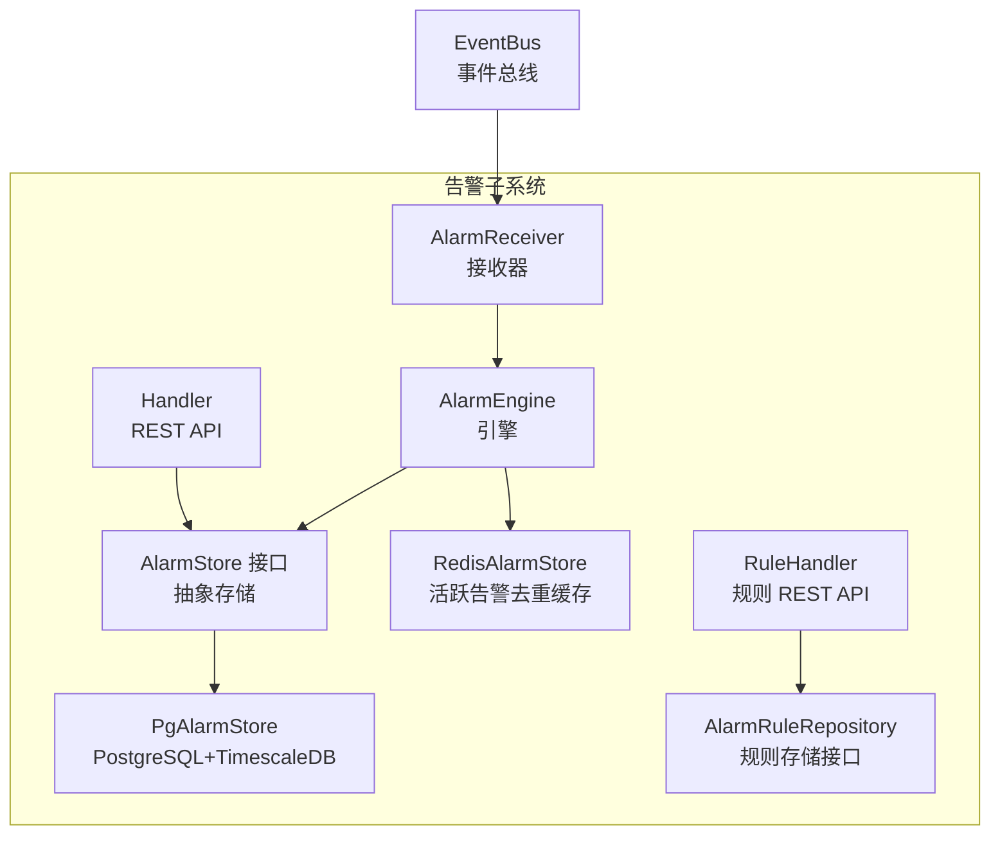
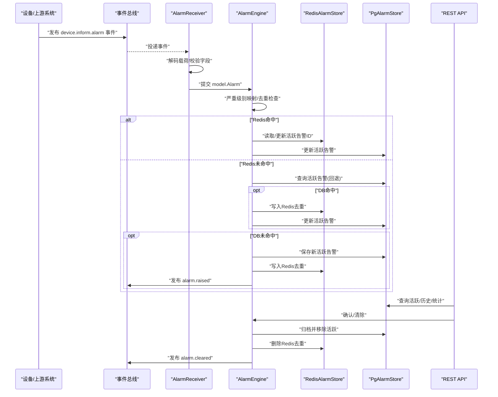
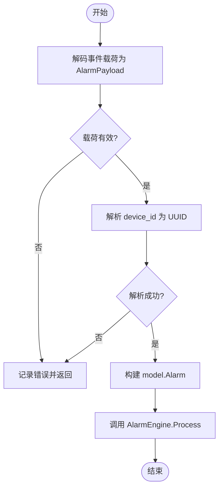
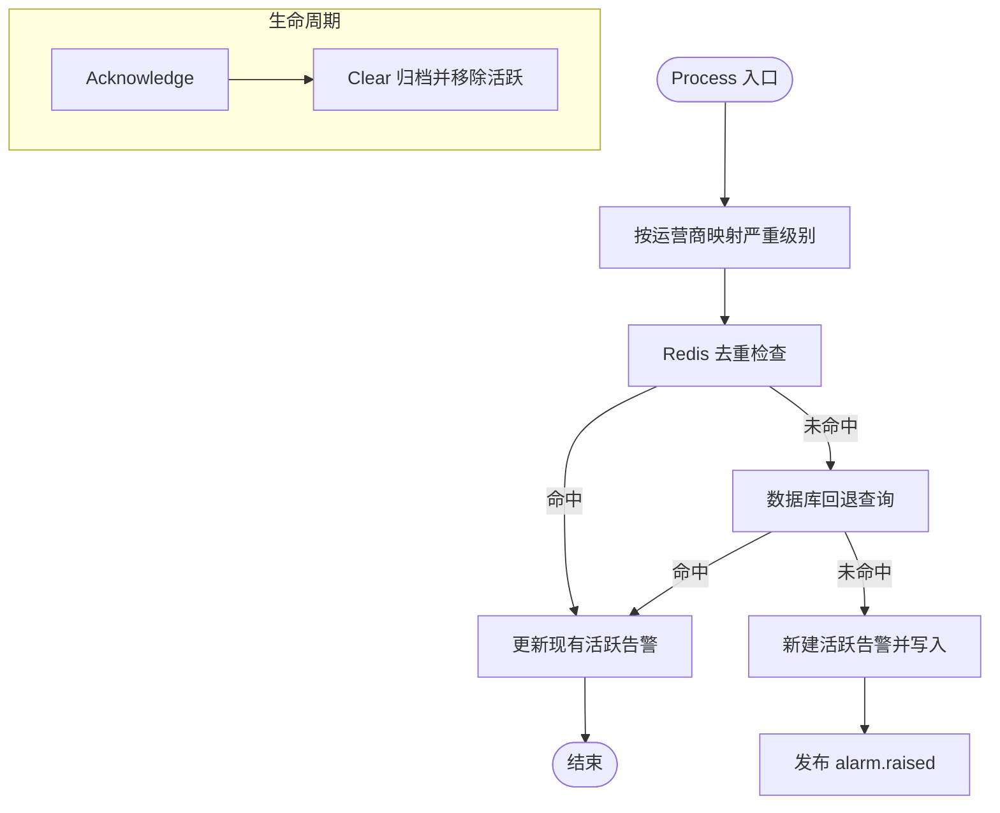
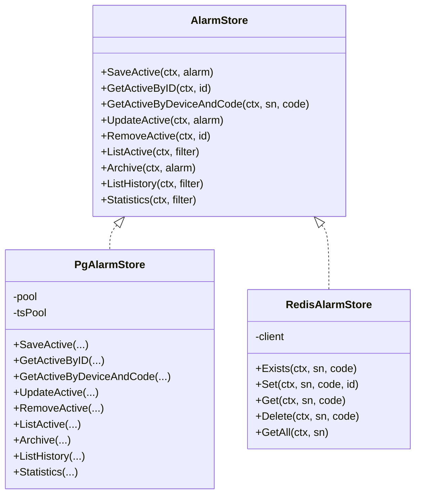
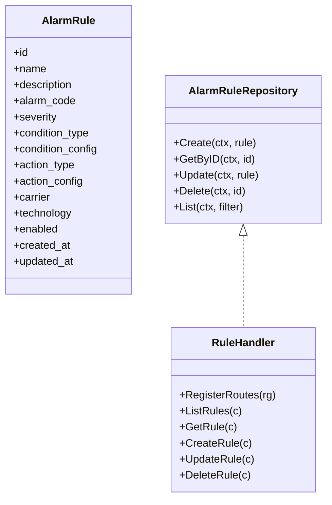
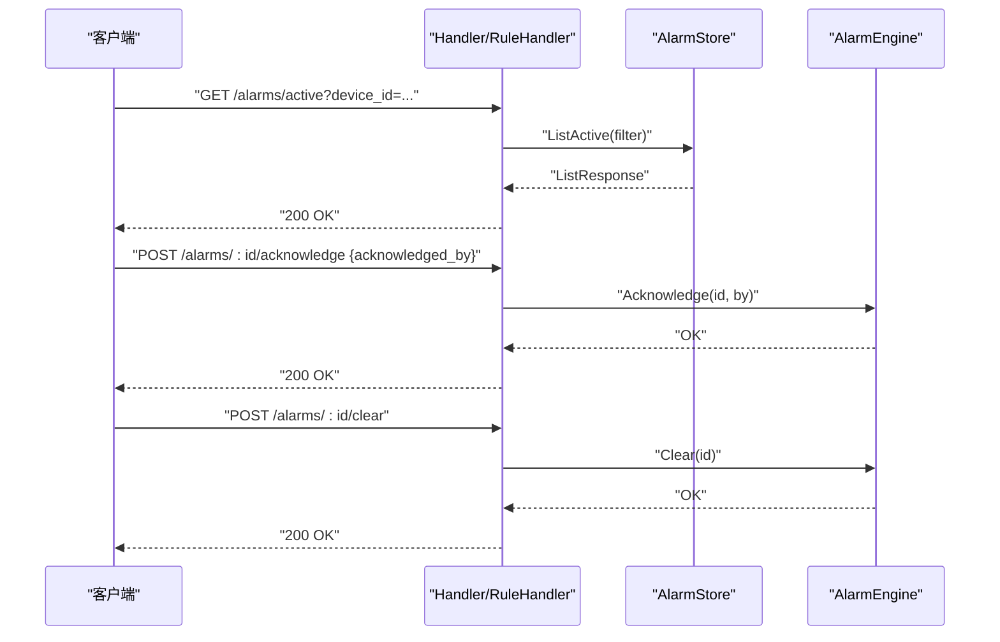
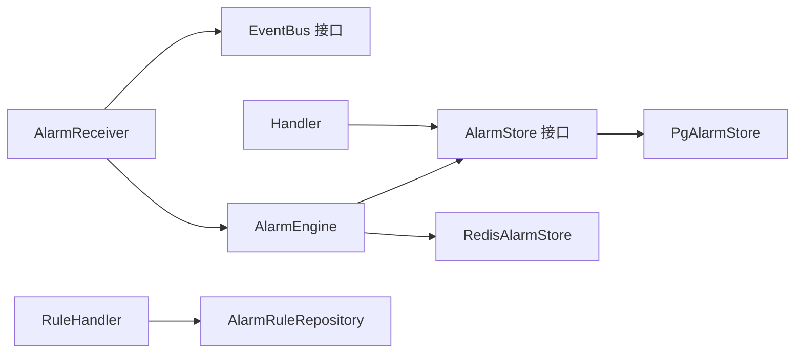

# 告警接收器

<cite>
**本文引用的文件**
- [receiver.go](file://omcgo/internal/alarm/receiver.go)
- [engine.go](file://omcgo/internal/alarm/engine.go)
- [handler.go](file://omcgo/internal/alarm/handler.go)
- [store.go](file://omcgo/internal/alarm/store.go)
- [pg_store.go](file://omcgo/internal/alarm/pg_store.go)
- [redis_store.go](file://omcgo/internal/alarm/redis_store.go)
- [rule_handler.go](file://omcgo/internal/alarm/rule_handler.go)
- [rule_model.go](file://omcgo/internal/alarm/rule_model.go)
- [rule_repository.go](file://omcgo/internal/alarm/rule_repository.go)
- [alarm.go](file://omcgo/internal/core/model/alarm.go)
- [bus.go](file://omcgo/internal/core/event/bus.go)
- [12-alarm-management.md](file://omcgo/docs/detailed-design/12-alarm-management.md)
- [04-alarm-management.md](file://omcgo/docs/features/04-alarm-management.md)
</cite>

## 目录
1. [简介](#简介)
2. [项目结构](#项目结构)
3. [核心组件](#核心组件)
4. [架构总览](#架构总览)
5. [详细组件分析](#详细组件分析)
6. [依赖分析](#依赖分析)
7. [性能考虑](#性能考虑)
8. [故障排除指南](#故障排除指南)
9. [结论](#结论)
10. [附录](#附录)

## 简介
本文件面向告警接收器的技术文档，系统性阐述其在 OMC 系统中的实现原理与工作机制，涵盖告警数据的接收、解析、验证、去重、存储与生命周期管理。文档重点说明接收器如何处理来自不同来源的告警数据（如 TR069 协议告警、性能监控告警、MR 数据告警等），并给出配置选项、数据格式要求、错误处理机制、部署配置、监控指标与故障排除指南。同时提供使用示例与集成最佳实践，帮助读者快速理解与落地。

## 项目结构
告警接收器位于 omcgo 内核模块的 alarm 子系统中，围绕“事件总线 + 接收器 + 引擎 + 存储”的分层设计组织，配合规则引擎与 REST API 提供完整的告警生命周期管理能力。

图示来源
- [receiver.go:1-86](file://omcgo/internal/alarm/receiver.go#L1-L86)
- [engine.go:1-230](file://omcgo/internal/alarm/engine.go#L1-L230)
- [store.go:1-42](file://omcgo/internal/alarm/store.go#L1-L42)
- [pg_store.go:1-273](file://omcgo/internal/alarm/pg_store.go#L1-L273)
- [redis_store.go:1-52](file://omcgo/internal/alarm/redis_store.go#L1-L52)
- [handler.go:1-206](file://omcgo/internal/alarm/handler.go#L1-L206)
- [rule_handler.go:1-214](file://omcgo/internal/alarm/rule_handler.go#L1-L214)
- [rule_repository.go:1-18](file://omcgo/internal/alarm/rule_repository.go#L1-L18)
- [bus.go:1-26](file://omcgo/internal/core/event/bus.go#L1-L26)

章节来源
- [receiver.go:1-86](file://omcgo/internal/alarm/receiver.go#L1-L86)
- [engine.go:1-230](file://omcgo/internal/alarm/engine.go#L1-L230)
- [handler.go:1-206](file://omcgo/internal/alarm/handler.go#L1-L206)
- [store.go:1-42](file://omcgo/internal/alarm/store.go#L1-L42)
- [pg_store.go:1-273](file://omcgo/internal/alarm/pg_store.go#L1-L273)
- [redis_store.go:1-52](file://omcgo/internal/alarm/redis_store.go#L1-L52)
- [rule_handler.go:1-214](file://omcgo/internal/alarm/rule_handler.go#L1-L214)
- [rule_model.go:1-68](file://omcgo/internal/alarm/rule_model.go#L1-L68)
- [rule_repository.go:1-18](file://omcgo/internal/alarm/rule_repository.go#L1-L18)
- [alarm.go:1-28](file://omcgo/internal/core/model/alarm.go#L1-L28)
- [bus.go:1-26](file://omcgo/internal/core/event/bus.go#L1-L26)
- [12-alarm-management.md:1-221](file://omcgo/docs/detailed-design/12-alarm-management.md#L1-L221)
- [04-alarm-management.md:1-101](file://omcgo/docs/features/04-alarm-management.md#L1-L101)

## 核心组件
- 告警接收器（AlarmReceiver）：订阅事件总线上的设备告警主题，解码事件载荷，校验并转换为内部模型，交由引擎处理。
- 告警引擎（AlarmEngine）：执行严重级别映射、Redis 去重与回退 DB 查询、持久化活跃告警、发布生命周期事件、支持确认与清除。
- 存储层（AlarmStore/PgAlarmStore/RedisAlarmStore）：抽象存储接口与 PostgreSQL/TimescaleDB 历史归档实现；Redis 用于活跃告警去重键值缓存。
- 规则引擎（AlarmRuleRepository/RuleHandler）：提供告警规则的增删改查与条件/动作配置，支撑告警分级与自动化处置。
- REST API（Handler/RuleHandler）：提供活跃/历史告警查询、统计、确认、清除以及规则管理接口。
- 事件总线（EventBus）：提供发布/订阅与队列订阅能力，确保告警事件可靠流转。

章节来源
- [receiver.go:13-85](file://omcgo/internal/alarm/receiver.go#L13-L85)
- [engine.go:15-230](file://omcgo/internal/alarm/engine.go#L15-L230)
- [store.go:30-41](file://omcgo/internal/alarm/store.go#L30-L41)
- [pg_store.go:17-273](file://omcgo/internal/alarm/pg_store.go#L17-L273)
- [redis_store.go:10-52](file://omcgo/internal/alarm/redis_store.go#L10-L52)
- [rule_handler.go:14-214](file://omcgo/internal/alarm/rule_handler.go#L14-L214)
- [handler.go:14-206](file://omcgo/internal/alarm/handler.go#L14-L206)
- [bus.go:5-25](file://omcgo/internal/core/event/bus.go#L5-L25)

## 架构总览
告警从设备经 TR069 Inform ALARM 或其他来源进入系统，通过事件总线广播，接收器解码并交给引擎处理。引擎进行严重级别映射、Redis 去重与数据库回退、保存活跃告警并发布“告警已产生”事件；当设备侧清除或人工清除时，引擎归档并移除 Redis 缓存，同时发布“告警已清除”。

图示来源
- [receiver.go:37-85](file://omcgo/internal/alarm/receiver.go#L37-L85)
- [engine.go:41-134](file://omcgo/internal/alarm/engine.go#L41-L134)
- [pg_store.go:28-122](file://omcgo/internal/alarm/pg_store.go#L28-L122)
- [redis_store.go:24-46](file://omcgo/internal/alarm/redis_store.go#L24-L46)
- [handler.go:26-206](file://omcgo/internal/alarm/handler.go#L26-L206)
- [bus.go:6-20](file://omcgo/internal/core/event/bus.go#L6-L20)

## 详细组件分析

### 告警接收器（AlarmReceiver）
职责与流程
- 订阅事件总线的主题，注册队列处理器以实现负载均衡。
- 从事件中解码载荷为 AlarmPayload，校验关键字段（如设备 UUID）。
- 转换为内部 model.Alarm 结构，调用引擎处理。

关键点
- 使用队列订阅保证多实例水平扩展下的消息分摊。
- 错误路径：解码失败、UUID 解析失败、引擎处理失败均记录日志并返回错误，避免脏数据入库。

图示来源
- [receiver.go:51-85](file://omcgo/internal/alarm/receiver.go#L51-L85)

章节来源
- [receiver.go:1-86](file://omcgo/internal/alarm/receiver.go#L1-L86)

### 告警引擎（AlarmEngine）
职责与流程
- 严重级别映射：根据运营商注册表将设备告警码映射为统一严重级别。
- 去重策略：优先使用 Redis 哈希表判断同一设备同一告警码是否已存在；若 Redis 不可用则回退到数据库查询。
- 新告警创建：生成唯一 ID、设置状态为活跃、写入活跃表，并发布 alarm.raised 事件。
- 生命周期管理：支持确认（acknowledge）与清除（clear），清除时归档到历史表并移除 Redis 去重键。

图示来源
- [engine.go:41-230](file://omcgo/internal/alarm/engine.go#L41-L230)

章节来源
- [engine.go:1-230](file://omcgo/internal/alarm/engine.go#L1-L230)

### 存储层（AlarmStore/PgAlarmStore/RedisAlarmStore）
- AlarmStore：定义活跃/历史告警的增删改查与统计接口。
- PgAlarmStore：基于 PostgreSQL/TimescaleDB 的实现，活跃表用于高频读写，历史表用于时序归档与统计。
- RedisAlarmStore：以哈希结构缓存“设备序列号 -> 告警码 -> 告警ID”，实现 L1 去重与快速更新。

图示来源
- [store.go:30-41](file://omcgo/internal/alarm/store.go#L30-L41)
- [pg_store.go:17-273](file://omcgo/internal/alarm/pg_store.go#L17-L273)
- [redis_store.go:10-52](file://omcgo/internal/alarm/redis_store.go#L10-L52)

章节来源
- [store.go:1-42](file://omcgo/internal/alarm/store.go#L1-L42)
- [pg_store.go:1-273](file://omcgo/internal/alarm/pg_store.go#L1-L273)
- [redis_store.go:1-52](file://omcgo/internal/alarm/redis_store.go#L1-L52)

### 规则引擎（AlarmRuleRepository/RuleHandler）
- AlarmRule：规则实体，包含名称、描述、告警码、严重级别、条件类型/配置、动作类型/配置、适用运营商/制式、启用状态等。
- RuleHandler：提供规则的 CRUD 与分页查询，支持按运营商、技术体制、启用状态、告警码、条件类型筛选。

图示来源
- [rule_model.go:11-68](file://omcgo/internal/alarm/rule_model.go#L11-L68)
- [rule_repository.go:10-18](file://omcgo/internal/alarm/rule_repository.go#L10-L18)
- [rule_handler.go:14-214](file://omcgo/internal/alarm/rule_handler.go#L14-L214)

章节来源
- [rule_model.go:1-68](file://omcgo/internal/alarm/rule_model.go#L1-L68)
- [rule_repository.go:1-18](file://omcgo/internal/alarm/rule_repository.go#L1-L18)
- [rule_handler.go:1-214](file://omcgo/internal/alarm/rule_handler.go#L1-L214)

### REST API（Handler/RuleHandler）
- Handler：提供活跃告警列表、历史告警查询、统计、按 ID 获取、确认、清除等接口；支持按设备 ID/SN、运营商、严重级别、状态、时间范围等条件过滤。
- RuleHandler：提供规则的分页列表、详情、创建、更新、删除接口。

图示来源
- [handler.go:26-206](file://omcgo/internal/alarm/handler.go#L26-L206)
- [rule_handler.go:25-214](file://omcgo/internal/alarm/rule_handler.go#L25-L214)

章节来源
- [handler.go:1-206](file://omcgo/internal/alarm/handler.go#L1-L206)
- [rule_handler.go:1-214](file://omcgo/internal/alarm/rule_handler.go#L1-L214)

## 依赖分析
- 接收器依赖事件总线接口与引擎；引擎依赖存储接口、Redis 客户端、运营商注册表与事件总线；存储层依赖 PostgreSQL/TimescaleDB 连接池；规则层依赖规则仓库接口。
- 低耦合高内聚：通过接口抽象隔离具体实现，便于替换存储与事件总线实现。

图示来源
- [receiver.go:3-11](file://omcgo/internal/alarm/receiver.go#L3-L11)
- [engine.go:15-39](file://omcgo/internal/alarm/engine.go#L15-L39)
- [store.go:30-41](file://omcgo/internal/alarm/store.go#L30-L41)
- [pg_store.go:17-26](file://omcgo/internal/alarm/pg_store.go#L17-L26)
- [redis_store.go:10-18](file://omcgo/internal/alarm/redis_store.go#L10-L18)
- [handler.go:14-24](file://omcgo/internal/alarm/handler.go#L14-L24)
- [rule_handler.go:14-23](file://omcgo/internal/alarm/rule_handler.go#L14-L23)
- [bus.go:5-25](file://omcgo/internal/core/event/bus.go#L5-L25)

章节来源
- [receiver.go:1-86](file://omcgo/internal/alarm/receiver.go#L1-L86)
- [engine.go:1-230](file://omcgo/internal/alarm/engine.go#L1-L230)
- [store.go:1-42](file://omcgo/internal/alarm/store.go#L1-L42)
- [pg_store.go:1-273](file://omcgo/internal/alarm/pg_store.go#L1-L273)
- [redis_store.go:1-52](file://omcgo/internal/alarm/redis_store.go#L1-L52)
- [handler.go:1-206](file://omcgo/internal/alarm/handler.go#L1-L206)
- [rule_handler.go:1-214](file://omcgo/internal/alarm/rule_handler.go#L1-L214)
- [bus.go:1-26](file://omcgo/internal/core/event/bus.go#L1-L26)

## 性能考虑
- Redis 去重：使用哈希结构进行 L1 去重，显著降低数据库压力与重复写入开销。
- 分层存储：活跃告警走 PostgreSQL，历史归档走 TimescaleDB，兼顾高频写入与时序查询优化。
- 事件驱动：通过事件总线异步处理，避免阻塞上游告警上报。
- 扩展性：队列订阅模式支持多实例水平扩展，提升吞吐能力。
- 查询优化：活跃表建立索引，历史表采用超表与时序分区，提高统计与范围查询效率。

## 故障排除指南
常见问题与排查步骤
- 接收器无法订阅事件
  - 检查事件总线连接与主题名称是否正确。
  - 查看订阅返回错误与日志。
- 告警载荷解码失败
  - 核对事件载荷结构与字段类型，确保 device_id 为合法 UUID、raised_at 为时间格式。
- Redis 去重异常
  - 检查 Redis 连接状态与键空间；确认哈希键命名与过期策略。
- 数据库写入失败
  - 检查 PostgreSQL/TimescaleDB 连接池配置与权限；查看 SQL 执行错误。
- 告警未去重导致重复
  - 确认 Redis 是否可用且键值存在；必要时回退到数据库查询路径。
- 生命周期事件未发布
  - 检查事件总线发布权限与网络连通性。

章节来源
- [receiver.go:37-85](file://omcgo/internal/alarm/receiver.go#L37-L85)
- [engine.go:41-134](file://omcgo/internal/alarm/engine.go#L41-L134)
- [pg_store.go:28-122](file://omcgo/internal/alarm/pg_store.go#L28-L122)
- [redis_store.go:24-46](file://omcgo/internal/alarm/redis_store.go#L24-L46)

## 结论
告警接收器通过事件总线与引擎化的处理流程，实现了从设备告警到活跃/历史存储的完整闭环。结合 Redis 去重与 PostgreSQL/TimescaleDB 分层存储，具备良好的性能与可扩展性。配套的 REST API 与规则引擎进一步增强了告警的可观测性与自动化处置能力。建议在生产环境中确保事件总线、Redis 与数据库的高可用，并结合监控指标持续优化。

## 附录

### 数据格式与字段要求
- AlarmPayload（事件载荷）
  - device_id：设备 UUID 字符串
  - device_sn：设备序列号
  - carrier：运营商编码
  - alarm_code：告警码
  - alarm_type：告警类型
  - description：告警描述
  - severity：严重级别（整数）
  - raised_at：告警发生时间
  - additional：附加信息（键值对）

- model.Alarm（内部模型）
  - 字段与 AlarmPayload 对应，增加生命周期字段（状态、确认/清除时间、创建/更新时间等）

章节来源
- [receiver.go:13-24](file://omcgo/internal/alarm/receiver.go#L13-L24)
- [alarm.go:9-27](file://omcgo/internal/core/model/alarm.go#L9-L27)

### 配置选项与部署建议
- 事件总线
  - 支持队列订阅，建议为告警工作队列设置合理的并发与重试策略。
- Redis
  - 建议开启持久化与主从复制；合理设置键过期策略与内存上限。
- 数据库
  - PostgreSQL/TimescaleDB 连接池大小需与 CPU/IO 能力匹配；历史表启用压缩与分区。
- REST API
  - 启用鉴权与速率限制；对敏感操作（确认/清除）记录审计日志。

章节来源
- [engine.go:15-39](file://omcgo/internal/alarm/engine.go#L15-L39)
- [pg_store.go:17-26](file://omcgo/internal/alarm/pg_store.go#L17-L26)
- [redis_store.go:10-18](file://omcgo/internal/alarm/redis_store.go#L10-L18)
- [handler.go:26-37](file://omcgo/internal/alarm/handler.go#L26-L37)

### 监控指标
- 告警接收
  - 接收速率、解码失败率、订阅错误数
- 告警处理
  - 处理耗时、去重命中率、活跃告警数量、历史归档数量
- 存储
  - Redis 命中/未命中、数据库写入延迟、查询 QPS
- 规则引擎
  - 规则匹配次数、动作执行成功率

章节来源
- [engine.go:117-133](file://omcgo/internal/alarm/engine.go#L117-L133)
- [pg_store.go:177-216](file://omcgo/internal/alarm/pg_store.go#L177-L216)

### 使用示例与集成最佳实践
- TR069 协议告警
  - 设备通过 Inform ALARM 上报；ACS 解析后发布事件到事件总线；接收器订阅并处理。
- 性能监控告警
  - PM/KPI 超阈值触发；规则引擎根据条件配置自动降级或抑制；最终落库并可选转发。
- MR 数据告警
  - MR 指标异常触发；规则引擎联动动作（如派单/升级），接收器负责生命周期管理与存储。
- 最佳实践
  - 明确运营商告警码映射规则；启用 Redis 去重并定期巡检；对历史数据进行周期性清理与压缩；为关键接口开启熔断与限流。

章节来源
- [12-alarm-management.md:10-26](file://omcgo/docs/detailed-design/12-alarm-management.md#L10-L26)
- [04-alarm-management.md:57-74](file://omcgo/docs/features/04-alarm-management.md#L57-L74)