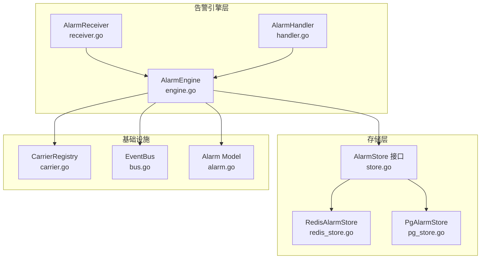
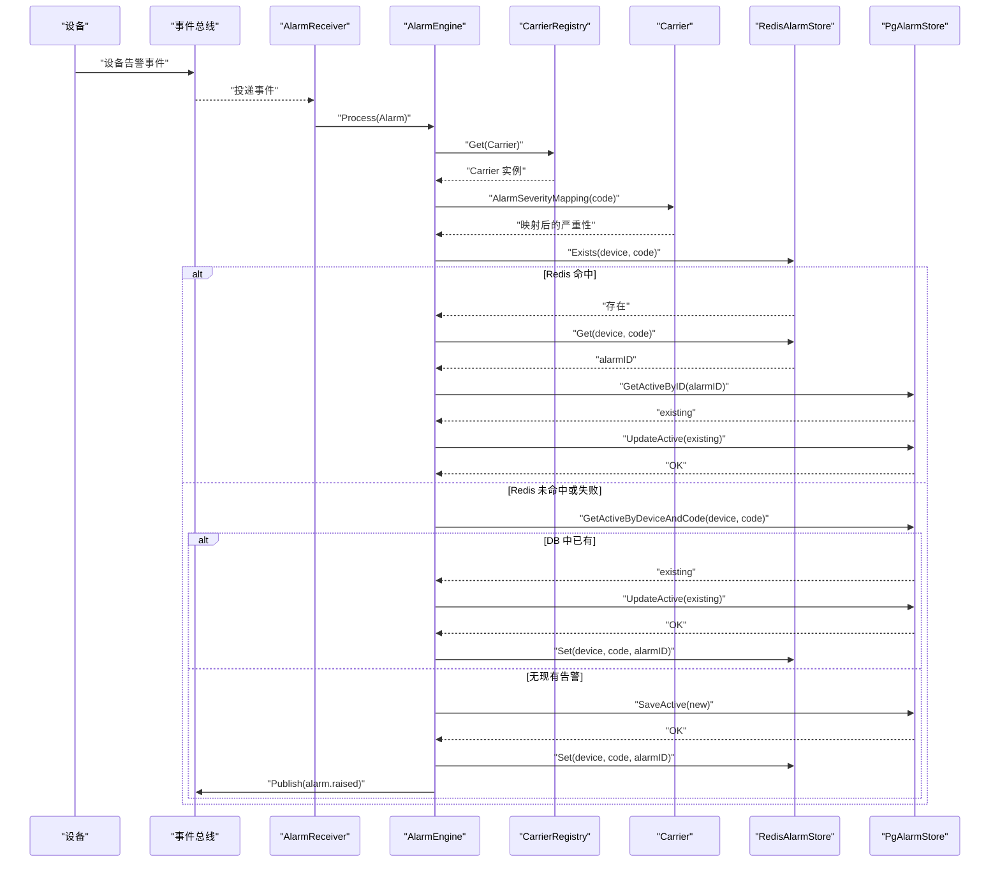
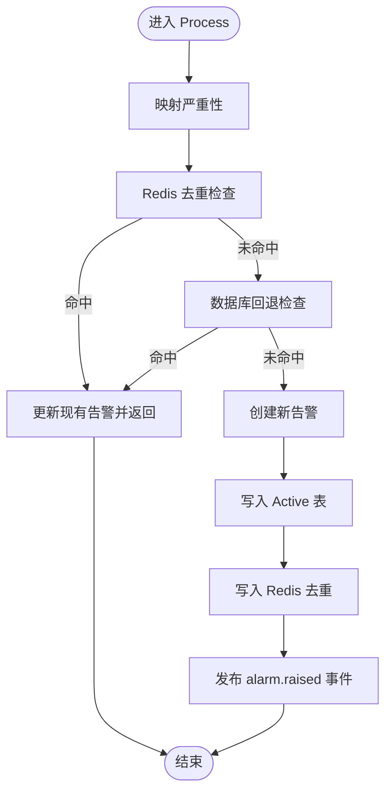
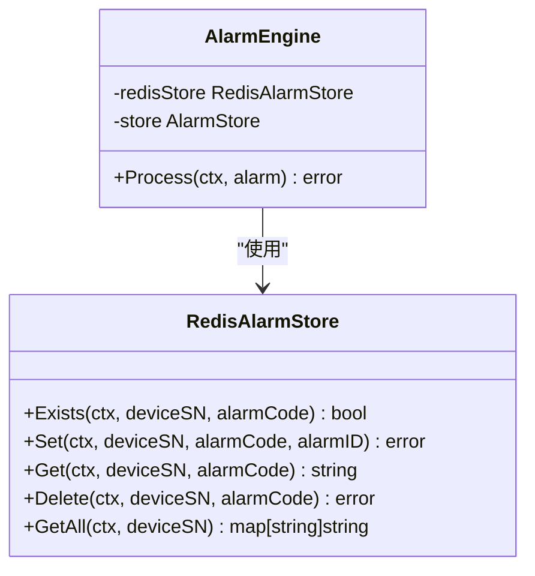
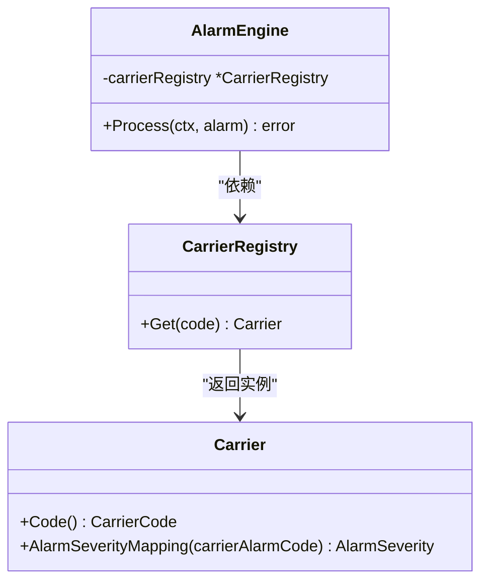
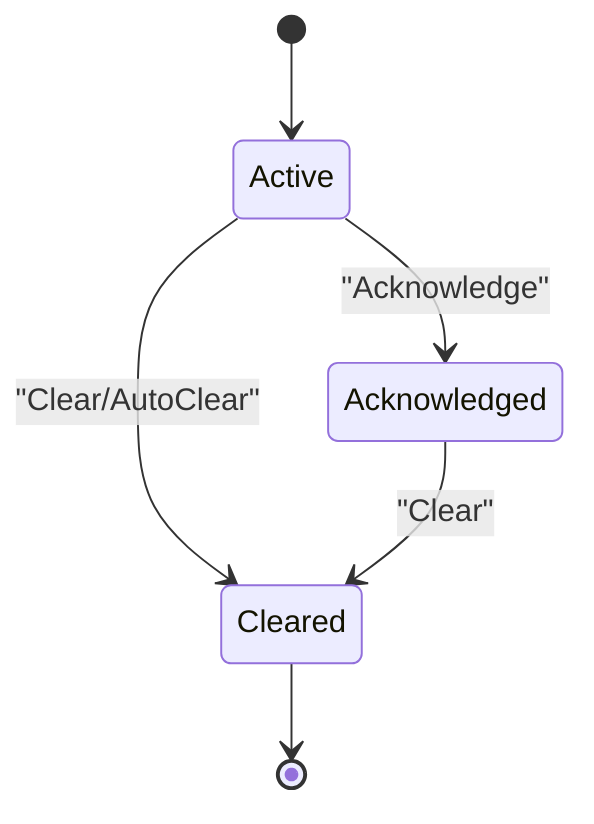
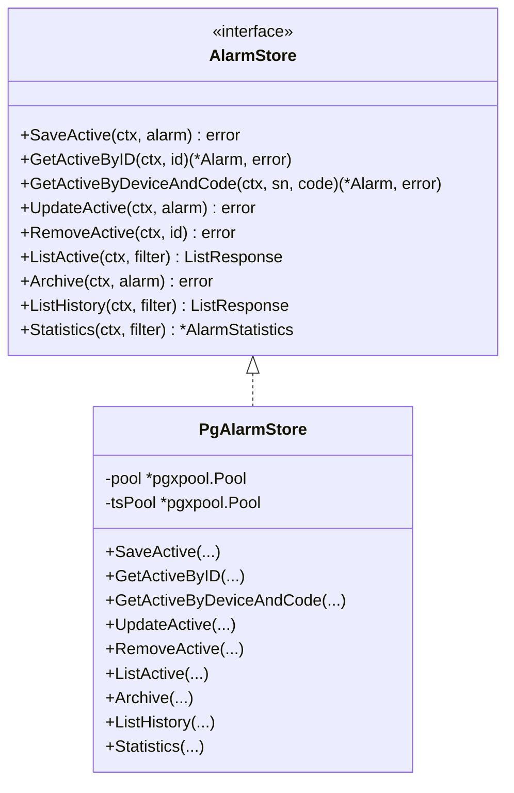
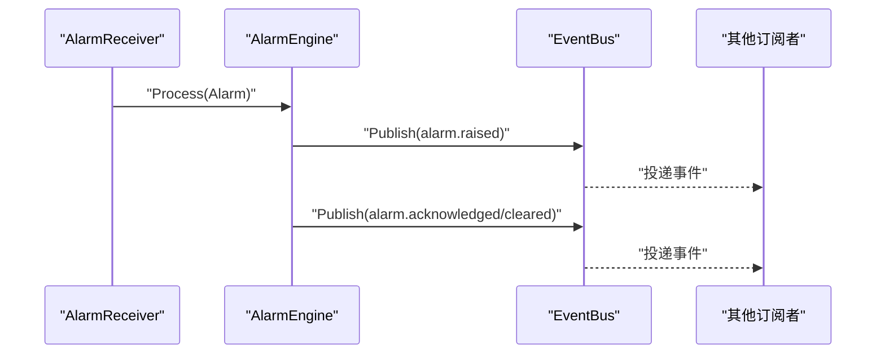
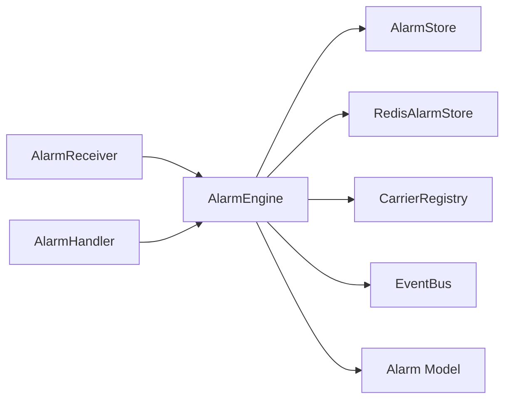

# 告警检测引擎

<cite>
**本文引用的文件**
- [engine.go](file://omcgo/internal/alarm/engine.go)
- [store.go](file://omcgo/internal/alarm/store.go)
- [redis_store.go](file://omcgo/internal/alarm/redis_store.go)
- [pg_store.go](file://omcgo/internal/alarm/pg_store.go)
- [handler.go](file://omcgo/internal/alarm/handler.go)
- [receiver.go](file://omcgo/internal/alarm/receiver.go)
- [rule_model.go](file://omcgo/internal/alarm/rule_model.go)
- [rule_repository.go](file://omcgo/internal/alarm/rule_repository.go)
- [rule_handler.go](file://omcgo/internal/alarm/rule_handler.go)
- [carrier.go](file://omcgo/internal/core/carrier/carrier.go)
- [bus.go](file://omcgo/internal/core/event/bus.go)
- [alarm.go](file://omcgo/internal/core/model/alarm.go)
- [consts.go](file://omcgo/global/consts.go)
- [errors.go](file://omcgo/global/errors.go)
</cite>

## 目录
1. [简介](#简介)
2. [项目结构](#项目结构)
3. [核心组件](#核心组件)
4. [架构总览](#架构总览)
5. [详细组件分析](#详细组件分析)
6. [依赖分析](#依赖分析)
7. [性能考虑](#性能考虑)
8. [故障排查指南](#故障排查指南)
9. [结论](#结论)
10. [附录](#附录)

## 简介
本文件为告警检测引擎的技术文档，聚焦 AlarmEngine 的核心功能实现，包括：
- 告警处理流程：运营商适配器严重性映射、Redis 去重检查、数据库回退检查、新告警创建、事件发布
- 去重机制：基于设备+告警码的哈希去重，Redis 作为 L1 缓存，数据库作为 L2 回退
- 严重性映射：通过 CarrierRegistry 与 Carrier 接口进行运营商特定映射
- 生命周期管理：Active、Acknowledged、Cleared 状态转换与对应操作
- 初始化配置、依赖注入模式、错误处理策略
- 最佳实践与性能优化建议

## 项目结构
告警子系统位于 omcgo/internal/alarm，采用分层与接口解耦设计：
- engine.go：告警引擎核心逻辑（Process/Acknowledge/Clear/AutoClear）
- store.go：抽象存储接口（AlarmStore）
- redis_store.go：Redis 去重缓存实现
- pg_store.go：PostgreSQL/TimescaleDB 存储实现
- receiver.go：订阅设备告警事件并调用引擎处理
- handler.go：REST API 对外暴露告警查询与操作
- rule_*：告警规则模型、仓库与控制器（扩展能力）

图表来源
- [engine.go:15-230](file://omcgo/internal/alarm/engine.go#L15-L230)
- [receiver.go:26-86](file://omcgo/internal/alarm/receiver.go#L26-L86)
- [handler.go:14-206](file://omcgo/internal/alarm/handler.go#L14-L206)
- [store.go:30-42](file://omcgo/internal/alarm/store.go#L30-L42)
- [redis_store.go:10-52](file://omcgo/internal/alarm/redis_store.go#L10-L52)
- [pg_store.go:17-273](file://omcgo/internal/alarm/pg_store.go#L17-L273)
- [carrier.go:5-42](file://omcgo/internal/core/carrier/carrier.go#L5-L42)
- [bus.go:5-26](file://omcgo/internal/core/event/bus.go#L5-L26)
- [alarm.go:9-28](file://omcgo/internal/core/model/alarm.go#L9-L28)

章节来源
- [engine.go:15-230](file://omcgo/internal/alarm/engine.go#L15-L230)
- [store.go:30-42](file://omcgo/internal/alarm/store.go#L30-L42)
- [redis_store.go:10-52](file://omcgo/internal/alarm/redis_store.go#L10-L52)
- [pg_store.go:17-273](file://omcgo/internal/alarm/pg_store.go#L17-L273)
- [receiver.go:26-86](file://omcgo/internal/alarm/receiver.go#L26-L86)
- [handler.go:14-206](file://omcgo/internal/alarm/handler.go#L14-L206)
- [carrier.go:5-42](file://omcgo/internal/core/carrier/carrier.go#L5-L42)
- [bus.go:5-26](file://omcgo/internal/core/event/bus.go#L5-L26)
- [alarm.go:9-28](file://omcgo/internal/core/model/alarm.go#L9-L28)

## 核心组件
- AlarmEngine：负责告警处理主流程、状态转换、事件发布与错误记录
- AlarmStore 接口：抽象持久化能力，支持 Active/History 双表与统计
- RedisAlarmStore：基于 Redis Hash 的去重缓存，键空间为 deviceSN->alarmCode->alarmID
- PgAlarmStore：PostgreSQL 用于 Active 表，TimescaleDB 用于 History 表
- AlarmReceiver：订阅设备告警事件，桥接事件到引擎
- AlarmHandler：提供 REST API 查询与操作（ACK/CLEAR）
- CarrierRegistry/Carrier：运营商适配器，提供严重性映射
- EventBus：事件总线，用于发布告警生命周期事件

章节来源
- [engine.go:15-230](file://omcgo/internal/alarm/engine.go#L15-L230)
- [store.go:30-42](file://omcgo/internal/alarm/store.go#L30-L42)
- [redis_store.go:10-52](file://omcgo/internal/alarm/redis_store.go#L10-L52)
- [pg_store.go:17-273](file://omcgo/internal/alarm/pg_store.go#L17-L273)
- [receiver.go:26-86](file://omcgo/internal/alarm/receiver.go#L26-L86)
- [handler.go:14-206](file://omcgo/internal/alarm/handler.go#L14-L206)
- [carrier.go:5-42](file://omcgo/internal/core/carrier/carrier.go#L5-L42)
- [bus.go:5-26](file://omcgo/internal/core/event/bus.go#L5-L26)

## 架构总览
告警从设备事件进入，经 AlarmReceiver 解析后交由 AlarmEngine 处理。处理流程包含：
- 运营商适配器严重性映射
- Redis 去重检查（命中则更新现有告警）
- 数据库回退检查（避免 Redis 丢失导致重复）
- 新告警入库、写入 Redis、发布事件
- ACK/CLEAR 等状态转换与历史归档

图表来源
- [receiver.go:51-86](file://omcgo/internal/alarm/receiver.go#L51-L86)
- [engine.go:41-134](file://omcgo/internal/alarm/engine.go#L41-L134)
- [carrier.go:36-37](file://omcgo/internal/core/carrier/carrier.go#L36-L37)
- [redis_store.go:24-46](file://omcgo/internal/alarm/redis_store.go#L24-L46)
- [pg_store.go:28-73](file://omcgo/internal/alarm/pg_store.go#L28-L73)

## 详细组件分析

### AlarmEngine：处理流程与状态转换
- Process 方法完整流程
  1) 运营商适配器严重性映射：通过 CarrierRegistry 获取 Carrier，调用 AlarmSeverityMapping 映射严重性；若无匹配则保留原值并记录警告日志
  2) Redis 去重检查：若 Redis 存在相同 device+alarmCode，则获取 alarmID，查询 Active 表更新 RaisedAt/Severity/Description，并写回 Redis
  3) 数据库回退检查：若 Redis 未命中或异常，查询 Active 表，命中则更新并回填 Redis
  4) 新告警创建：生成 UUID、设置 Status=Active、写入 Active 表，同时写入 Redis
  5) 事件发布：构造 alarm.raised 事件并发布
- Acknowledge：仅允许对 Active 告警执行，更新状态为 Acknowledged，记录确认时间与人员，发布 alarm.acknowledged 事件
- Clear：仅允许对非 Cleared 告警执行，更新状态为 Cleared，归档至 History，移除 Active 记录与 Redis 条目，发布 alarm.cleared 事件
- AutoClear：按 deviceSN+alarmCode 自动清除（设备侧主动上报）

图表来源
- [engine.go:41-134](file://omcgo/internal/alarm/engine.go#L41-L134)
- [redis_store.go:24-46](file://omcgo/internal/alarm/redis_store.go#L24-L46)
- [pg_store.go:28-73](file://omcgo/internal/alarm/pg_store.go#L28-L73)

章节来源
- [engine.go:41-134](file://omcgo/internal/alarm/engine.go#L41-L134)
- [engine.go:136-212](file://omcgo/internal/alarm/engine.go#L136-L212)
- [engine.go:214-224](file://omcgo/internal/alarm/engine.go#L214-L224)

### 去重机制与回退策略
- Redis 层：使用 Hash 结构 deviceSN->alarmCode->alarmID，提供 Exists/Set/Get/Delete/GetAll
- 回退策略：Redis 异常时降级到数据库查询，确保一致性
- Redis 命中时：更新现有告警的 RaisedAt/Severity/Description，避免重复事件风暴

图表来源
- [redis_store.go:10-52](file://omcgo/internal/alarm/redis_store.go#L10-L52)
- [engine.go:16-22](file://omcgo/internal/alarm/engine.go#L16-L22)

章节来源
- [redis_store.go:10-52](file://omcgo/internal/alarm/redis_store.go#L10-L52)
- [engine.go:58-100](file://omcgo/internal/alarm/engine.go#L58-L100)

### 严重性映射与运营商适配
- CarrierRegistry 提供按 CarrierCode 获取 Carrier 实例的能力
- Carrier 接口定义 AlarmSeverityMapping，将运营商特定 alarm_code 映射为标准严重性
- 若找不到对应 Carrier 或映射结果为 0，则保留原始严重性并记录警告日志

图表来源
- [carrier.go:5-42](file://omcgo/internal/core/carrier/carrier.go#L5-L42)
- [engine.go:44-56](file://omcgo/internal/alarm/engine.go#L44-L56)

章节来源
- [carrier.go:36-37](file://omcgo/internal/core/carrier/carrier.go#L36-L37)
- [engine.go:44-56](file://omcgo/internal/alarm/engine.go#L44-L56)

### 生命周期管理与状态转换
- 状态枚举：Active、Acknowledged、Cleared
- 转换规则：
  - Active -> Acknowledged：Acknowledge
  - Active -> Cleared：Clear/AutoClear
  - Acknowledged/Cleared 不可再次 Acknowledge
  - Cleared 不可再次 Clear
- 归档与清理：Clear 后将告警归档至 History 表并删除 Active 记录与 Redis 条目

图表来源
- [consts.go:55-71](file://omcgo/global/consts.go#L55-L71)
- [engine.go:136-212](file://omcgo/internal/alarm/engine.go#L136-L212)

章节来源
- [consts.go:55-71](file://omcgo/global/consts.go#L55-L71)
- [engine.go:136-212](file://omcgo/internal/alarm/engine.go#L136-L212)
- [errors.go:44](file://omcgo/global/errors.go#L44)

### 存储层：Active/History 与统计
- AlarmStore 接口：定义 Active/History 的增删改查与统计
- PgAlarmStore 实现：
  - Active 表：保存当前活跃告警
  - History 表（TimescaleDB）：按时间序列归档历史告警
  - 统计接口：计算 Active 总数、按严重性与类型聚合

图表来源
- [store.go:30-42](file://omcgo/internal/alarm/store.go#L30-L42)
- [pg_store.go:17-273](file://omcgo/internal/alarm/pg_store.go#L17-L273)

章节来源
- [store.go:30-42](file://omcgo/internal/alarm/store.go#L30-L42)
- [pg_store.go:28-216](file://omcgo/internal/alarm/pg_store.go#L28-L216)

### 事件发布与订阅
- AlarmReceiver 订阅设备告警事件，解析为 Alarm 模型并调用 Engine.Process
- AlarmEngine 在新告警创建后发布 alarm.raised 事件
- Acknowledge/Clear 后分别发布 alarm.acknowledged/alarm.cleared 事件
- Handler 通过 EventBus 发布事件，接收方通过队列订阅保证负载均衡

图表来源
- [receiver.go:37-49](file://omcgo/internal/alarm/receiver.go#L37-L49)
- [engine.go:117-125](file://omcgo/internal/alarm/engine.go#L117-L125)
- [engine.go:156-161](file://omcgo/internal/alarm/engine.go#L156-L161)
- [engine.go:200-205](file://omcgo/internal/alarm/engine.go#L200-L205)
- [bus.go:6-20](file://omcgo/internal/core/event/bus.go#L6-L20)

章节来源
- [receiver.go:37-49](file://omcgo/internal/alarm/receiver.go#L37-L49)
- [engine.go:117-125](file://omcgo/internal/alarm/engine.go#L117-L125)
- [engine.go:156-161](file://omcgo/internal/alarm/engine.go#L156-L161)
- [engine.go:200-205](file://omcgo/internal/alarm/engine.go#L200-L205)
- [bus.go:6-20](file://omcgo/internal/core/event/bus.go#L6-L20)

### API 与控制器
- Handler 暴露：
  - 列表：/alarms/active、/alarms/history、/alarms/statistics
  - 查询：/alarms/:id
  - 操作：POST /alarms/:id/acknowledge、POST /alarms/:id/clear
- RuleHandler 暴露告警规则管理接口（扩展能力）

章节来源
- [handler.go:26-37](file://omcgo/internal/alarm/handler.go#L26-L37)
- [handler.go:50-90](file://omcgo/internal/alarm/handler.go#L50-L90)
- [handler.go:92-127](file://omcgo/internal/alarm/handler.go#L92-L127)
- [handler.go:129-141](file://omcgo/internal/alarm/handler.go#L129-L141)
- [handler.go:147-163](file://omcgo/internal/alarm/handler.go#L147-L163)
- [handler.go:165-176](file://omcgo/internal/alarm/handler.go#L165-L176)
- [handler.go:178-190](file://omcgo/internal/alarm/handler.go#L178-L190)
- [rule_handler.go:25-35](file://omcgo/internal/alarm/rule_handler.go#L25-L35)
- [rule_handler.go:46-79](file://omcgo/internal/alarm/rule_handler.go#L46-L79)
- [rule_handler.go:81-95](file://omcgo/internal/alarm/rule_handler.go#L81-L95)
- [rule_handler.go:97-137](file://omcgo/internal/alarm/rule_handler.go#L97-L137)
- [rule_handler.go:139-198](file://omcgo/internal/alarm/rule_handler.go#L139-L198)
- [rule_handler.go:200-213](file://omcgo/internal/alarm/rule_handler.go#L200-L213)

## 依赖分析
- AlarmEngine 依赖 AlarmStore、RedisAlarmStore、CarrierRegistry、EventBus、Logger
- AlarmReceiver 依赖 AlarmEngine 与 EventBus
- Handler 依赖 AlarmEngine 与 AlarmStore
- CarrierRegistry 依赖 Carrier 接口
- EventBus 为抽象接口，支持普通订阅与队列订阅

图表来源
- [engine.go:16-22](file://omcgo/internal/alarm/engine.go#L16-L22)
- [receiver.go:27-35](file://omcgo/internal/alarm/receiver.go#L27-L35)
- [handler.go:15-24](file://omcgo/internal/alarm/handler.go#L15-L24)
- [carrier.go:5-42](file://omcgo/internal/core/carrier/carrier.go#L5-L42)
- [bus.go:5-26](file://omcgo/internal/core/event/bus.go#L5-L26)
- [alarm.go:9-28](file://omcgo/internal/core/model/alarm.go#L9-L28)

章节来源
- [engine.go:16-22](file://omcgo/internal/alarm/engine.go#L16-L22)
- [receiver.go:27-35](file://omcgo/internal/alarm/receiver.go#L27-L35)
- [handler.go:15-24](file://omcgo/internal/alarm/handler.go#L15-L24)
- [carrier.go:5-42](file://omcgo/internal/core/carrier/carrier.go#L5-L42)
- [bus.go:5-26](file://omcgo/internal/core/event/bus.go#L5-L26)
- [alarm.go:9-28](file://omcgo/internal/core/model/alarm.go#L9-L28)

## 性能考虑
- Redis 去重优先：降低数据库压力，提升吞吐
- 批量/并发：AlarmReceiver 使用队列订阅，多实例水平扩展
- 数据库索引：Active 表按 device_sn+alarm_code 组合查询，建议建立复合索引
- 时间序列：History 使用 TimescaleDB，按 time 字段高效查询与归档
- 缓存失效：Redis 哈希过期策略需结合业务场景评估，避免内存膨胀
- 错误降级：Redis 异常自动回退到数据库，保障可用性

## 故障排查指南
- Redis 去重异常
  - 现象：频繁创建重复告警
  - 排查：检查 Redis 是否连通、键空间是否存在、Hash 写入是否成功
  - 参考路径：[engine.go:58-85](file://omcgo/internal/alarm/engine.go#L58-L85)、[redis_store.go:24-46](file://omcgo/internal/alarm/redis_store.go#L24-L46)
- 数据库回退失败
  - 现象：去重不生效，重复告警持续
  - 排查：检查 Active 表查询条件与索引、事务一致性
  - 参考路径：[engine.go:87-100](file://omcgo/internal/alarm/engine.go#L87-L100)、[pg_store.go:47-51](file://omcgo/internal/alarm/pg_store.go#L47-L51)
- 状态转换错误
  - 现象：ACK/CLEAR 返回错误
  - 排查：确认告警状态是否为 Active/Cleared，避免重复 ACK/CLEAR
  - 参考路径：[engine.go:136-168](file://omcgo/internal/alarm/engine.go#L136-L168)、[engine.go:170-212](file://omcgo/internal/alarm/engine.go#L170-L212)、[errors.go:44](file://omcgo/global/errors.go#L44)
- 事件未发布
  - 现象：前端无实时更新
  - 排查：检查 EventBus 配置、订阅组名、事件主题
  - 参考路径：[engine.go:117-125](file://omcgo/internal/alarm/engine.go#L117-L125)、[engine.go:156-161](file://omcgo/internal/alarm/engine.go#L156-L161)、[engine.go:200-205](file://omcgo/internal/alarm/engine.go#L200-L205)、[bus.go:6-20](file://omcgo/internal/core/event/bus.go#L6-L20)

章节来源
- [engine.go:58-100](file://omcgo/internal/alarm/engine.go#L58-L100)
- [redis_store.go:24-46](file://omcgo/internal/alarm/redis_store.go#L24-L46)
- [pg_store.go:47-51](file://omcgo/internal/alarm/pg_store.go#L47-L51)
- [engine.go:136-212](file://omcgo/internal/alarm/engine.go#L136-L212)
- [errors.go:44](file://omcgo/global/errors.go#L44)
- [engine.go:117-125](file://omcgo/internal/alarm/engine.go#L117-L125)
- [engine.go:156-161](file://omcgo/internal/alarm/engine.go#L156-L161)
- [engine.go:200-205](file://omcgo/internal/alarm/engine.go#L200-L205)
- [bus.go:6-20](file://omcgo/internal/core/event/bus.go#L6-L20)

## 结论
告警检测引擎通过清晰的分层与接口抽象，实现了高可用、可扩展的告警处理能力。其关键特性包括：
- 基于 Redis 的高效去重与数据库回退
- 运营商适配器驱动的严重性映射
- 完整的生命周期管理与事件发布
- REST API 与事件驱动双入口
建议在生产环境中配合合理的 Redis 过期策略、数据库索引与队列订阅规模，以获得最佳性能与稳定性。

## 附录
- 告警模型字段与状态/严重性枚举定义参见 [alarm.go:9-28](file://omcgo/internal/core/model/alarm.go#L9-L28) 与 [consts.go:55-71](file://omcgo/global/consts.go#L55-L71)
- 告警规则模型与控制器参见 [rule_model.go:11-68](file://omcgo/internal/alarm/rule_model.go#L11-L68)、[rule_repository.go:10-18](file://omcgo/internal/alarm/rule_repository.go#L10-L18)、[rule_handler.go:14-214](file://omcgo/internal/alarm/rule_handler.go#L14-L214)