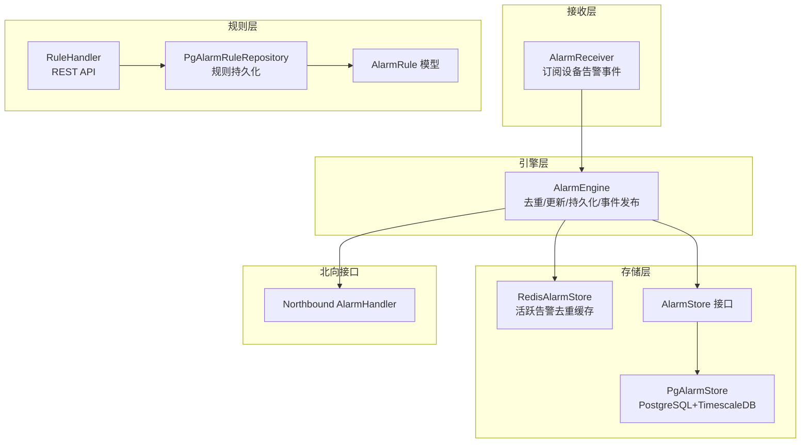
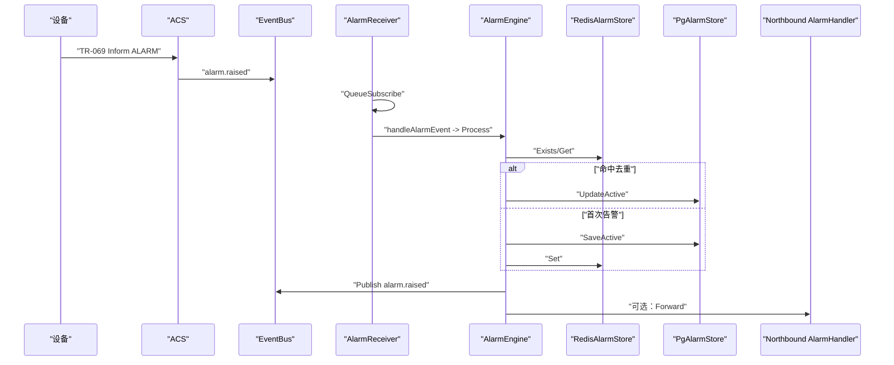
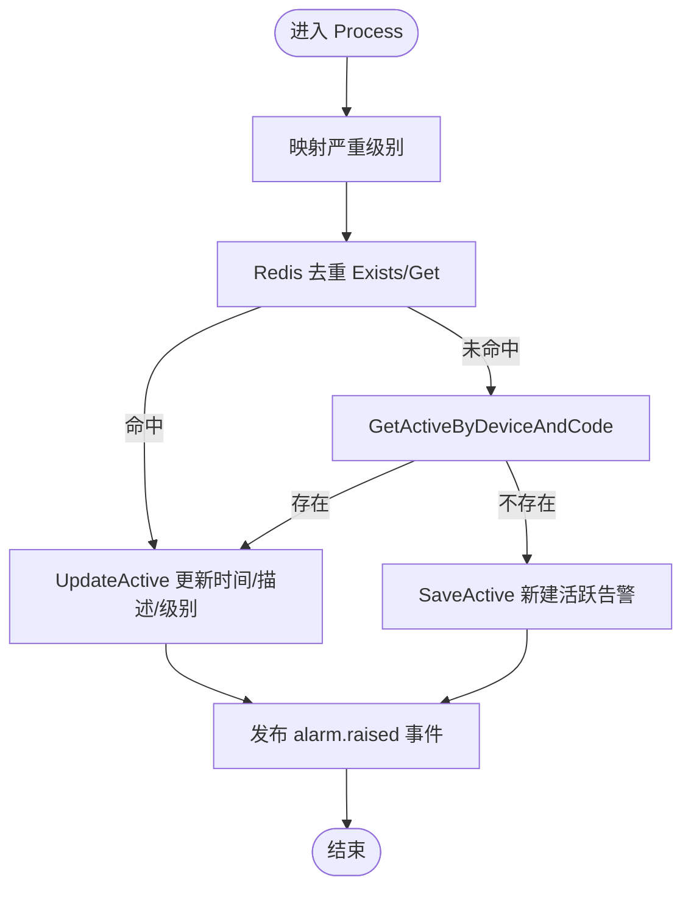
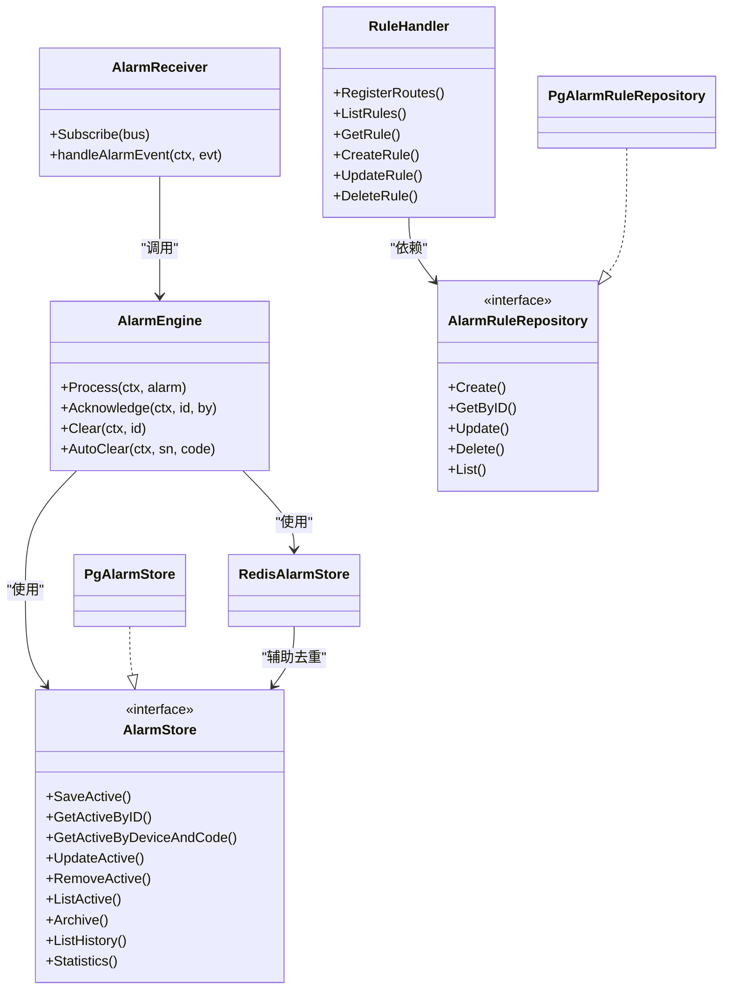

# 告警管理模块

<cite>
**本文引用的文件**
- [engine.go](file://omcgo/internal/alarm/engine.go)
- [receiver.go](file://omcgo/internal/alarm/receiver.go)
- [store.go](file://omcgo/internal/alarm/store.go)
- [pg_store.go](file://omcgo/internal/alarm/pg_store.go)
- [redis_store.go](file://omcgo/internal/alarm/redis_store.go)
- [handler.go](file://omcgo/internal/alarm/handler.go)
- [rule_model.go](file://omcgo/internal/alarm/rule_model.go)
- [rule_handler.go](file://omcgo/internal/alarm/rule_handler.go)
- [rule_repository.go](file://omcgo/internal/alarm/rule_repository.go)
- [pg_rule_repository.go](file://omcgo/internal/alarm/pg_rule_repository.go)
- [000012_create_alarms.up.sql](file://omcgo/migrations/000012_create_alarms.up.sql)
- [000018_create_alarm_rules.up.sql](file://omcgo/migrations/000018_create_alarm_rules.up.sql)
- [04-alarm-management.md](file://omcgo/docs/features/04-alarm-management.md)
- [12-alarm-management.md](file://omcgo/docs/detailed-design/12-alarm-management.md)
- [alarm_handler.go](file://omcgo/internal/northbound/alarm_handler.go)
- [router.go](file://omcgo/internal/northbound/router.go)
- [openapi.yaml](file://omcgo/api/openapi/openapi.yaml)
</cite>

## 目录
1. [简介](#简介)
2. [项目结构](#项目结构)
3. [核心组件](#核心组件)
4. [架构总览](#架构总览)
5. [组件详解](#组件详解)
6. [依赖关系分析](#依赖关系分析)
7. [性能考量](#性能考量)
8. [故障排除指南](#故障排除指南)
9. [结论](#结论)
10. [附录](#附录)

## 简介
本文件为告警管理模块的完整技术文档，面向工程实现与运维操作人员，系统阐述告警检测引擎工作原理、告警规则定义与匹配机制、告警存储与检索体系、告警接收器实现、告警生命周期管理、告警统计分析与历史查询导出、告警阈值与级别分类、告警处理流程设计，并提供最佳实践、性能优化策略与故障排除指南。同时给出告警规则配置示例与API使用说明，帮助快速落地与稳定运行。

## 项目结构
告警管理模块位于后端服务 omcgo 的 internal/alarm 目录下，采用分层与职责分离设计：
- 接收层：AlarmReceiver 订阅设备告警事件，解包为内部 Alarm 结构并交由引擎处理
- 引擎层：AlarmEngine 负责严重级别映射、去重、更新、持久化、事件发布与生命周期变更
- 存储层：AlarmStore 接口抽象 + PgAlarmStore（PostgreSQL+TimescaleDB）实现 + Redis L1 缓存
- 规则层：AlarmRule 模型 + RuleHandler API + PgAlarmRuleRepository 持久化
- 北向接口：Northbound AlarmHandler 提供告警数据上送与同步

图表来源
- [receiver.go:26-49](file://omcgo/internal/alarm/receiver.go#L26-L49)
- [engine.go:41-134](file://omcgo/internal/alarm/engine.go#L41-L134)
- [redis_store.go:10-51](file://omcgo/internal/alarm/redis_store.go#L10-L51)
- [pg_store.go:17-273](file://omcgo/internal/alarm/pg_store.go#L17-L273)
- [store.go:30-41](file://omcgo/internal/alarm/store.go#L30-L41)
- [rule_handler.go:14-35](file://omcgo/internal/alarm/rule_handler.go#L14-L35)
- [pg_rule_repository.go:28-253](file://omcgo/internal/alarm/pg_rule_repository.go#L28-L253)
- [rule_model.go:11-67](file://omcgo/internal/alarm/rule_model.go#L11-L67)
- [alarm_handler.go](file://omcgo/internal/northbound/alarm_handler.go)

章节来源
- [12-alarm-management.md:10-27](file://omcgo/docs/detailed-design/12-alarm-management.md#L10-L27)

## 核心组件
- 告警引擎 AlarmEngine：负责严重级别映射、Redis 去重、数据库更新、事件发布、生命周期变更（确认/清除/自动清除）
- 告警接收器 AlarmReceiver：订阅 EventBus 上的设备告警事件，解包为 Alarm 并调用引擎处理
- 存储接口与实现：AlarmStore 定义 CRUD 与统计；PgAlarmStore 使用 PostgreSQL 存活跃告警、TimescaleDB 存历史告警；Redis 作为 L1 缓存
- 规则模型与API：AlarmRule 描述规则；RuleHandler 提供规则增删改查；PgAlarmRuleRepository 持久化
- 北向告警接口：AlarmHandler 提供告警数据上送与同步

章节来源
- [engine.go:15-39](file://omcgo/internal/alarm/engine.go#L15-L39)
- [receiver.go:26-49](file://omcgo/internal/alarm/receiver.go#L26-L49)
- [store.go:30-41](file://omcgo/internal/alarm/store.go#L30-L41)
- [pg_store.go:17-273](file://omcgo/internal/alarm/pg_store.go#L17-L273)
- [redis_store.go:10-51](file://omcgo/internal/alarm/redis_store.go#L10-L51)
- [rule_model.go:11-67](file://omcgo/internal/alarm/rule_model.go#L11-L67)
- [rule_handler.go:14-35](file://omcgo/internal/alarm/rule_handler.go#L14-L35)
- [pg_rule_repository.go:28-253](file://omcgo/internal/alarm/pg_rule_repository.go#L28-L253)

## 架构总览
告警从设备经 ACS 解析后以事件形式进入系统，AlarmReceiver 订阅并转交给 AlarmEngine。引擎执行严重级别映射、Redis 去重与数据库更新，发布生命周期事件；PgAlarmStore 负责活跃与历史数据的读写；Redis 用于高频去重；RuleHandler/Repository 支持规则管理；Northbound AlarmHandler 提供告警上送。

图表来源
- [12-alarm-management.md:16-26](file://omcgo/docs/detailed-design/12-alarm-management.md#L16-L26)
- [receiver.go:37-49](file://omcgo/internal/alarm/receiver.go#L37-L49)
- [engine.go:41-134](file://omcgo/internal/alarm/engine.go#L41-L134)
- [redis_store.go:24-41](file://omcgo/internal/alarm/redis_store.go#L24-L41)
- [pg_store.go:28-122](file://omcgo/internal/alarm/pg_store.go#L28-L122)
- [alarm_handler.go](file://omcgo/internal/northbound/alarm_handler.go)

## 组件详解

### 告警引擎（AlarmEngine）
- 严重级别映射：根据运营商适配器将设备告警码映射为统一严重级别
- 去重策略：先查 Redis 哈希表，命中则更新现有活跃告警的时间/描述/级别；失败回退到数据库
- 生命周期管理：确认（acknowledge）与清除（clear），清除时归档到历史并移除 Redis
- 事件发布：成功处理后发布 alarm.raised/acknowledged/cleared 事件

图表来源
- [engine.go:41-134](file://omcgo/internal/alarm/engine.go#L41-L134)

章节来源
- [engine.go:41-230](file://omcgo/internal/alarm/engine.go#L41-L230)

### 告警接收器（AlarmReceiver）
- 订阅 EventBus 主题：设备告警事件
- 解码事件载荷为 Alarm 结构
- 调用 AlarmEngine.Process 处理

章节来源
- [receiver.go:26-86](file://omcgo/internal/alarm/receiver.go#L26-L86)

### 存储层（AlarmStore/PgAlarmStore/RedisAlarmStore）
- AlarmStore 接口：定义活跃告警的保存、查询、更新、删除、列表、归档、历史查询、统计
- PgAlarmStore 实现：
  - 活跃表 alarms_active：PostgreSQL 普通表，含索引
  - 历史表 alarms_history：TimescaleDB 超表，带保留策略
  - 支持活跃/历史查询、统计聚合
- RedisAlarmStore 实现：
  - 使用哈希结构 device→alarm_code→alarm_id，用于高频去重

章节来源
- [store.go:11-41](file://omcgo/internal/alarm/store.go#L11-L41)
- [pg_store.go:17-273](file://omcgo/internal/alarm/pg_store.go#L17-L273)
- [redis_store.go:10-51](file://omcgo/internal/alarm/redis_store.go#L10-L51)
- [000012_create_alarms.up.sql:1-53](file://omcgo/migrations/000012_create_alarms.up.sql#L1-L53)

### 告警规则（AlarmRule）
- AlarmRule 模型：名称、描述、告警码、严重级别、条件类型/配置、动作类型/配置、运营商/制式、启用状态、时间戳
- RuleHandler API：列出、查询、创建、更新、删除规则
- PgAlarmRuleRepository：规则的持久化，含 JSONB 字段与索引

章节来源
- [rule_model.go:11-67](file://omcgo/internal/alarm/rule_model.go#L11-L67)
- [rule_handler.go:14-214](file://omcgo/internal/alarm/rule_handler.go#L14-L214)
- [rule_repository.go:10-17](file://omcgo/internal/alarm/rule_repository.go#L10-L17)
- [pg_rule_repository.go:28-253](file://omcgo/internal/alarm/pg_rule_repository.go#L28-L253)
- [000018_create_alarm_rules.up.sql:1-27](file://omcgo/migrations/000018_create_alarm_rules.up.sql#L1-L27)

### 北向告警接口（Northbound AlarmHandler）
- 提供告警数据上送与同步能力，对接 OSS 系统
- 与 AlarmEngine/Store 协作，按需转发活跃/历史告警

章节来源
- [alarm_handler.go](file://omcgo/internal/northbound/alarm_handler.go)

## 依赖关系分析
- AlarmEngine 依赖 AlarmStore、RedisAlarmStore、CarrierRegistry、EventBus
- AlarmReceiver 依赖 AlarmEngine、EventBus
- PgAlarmStore 依赖 PostgreSQL 与 TimescaleDB 连接池
- RuleHandler 依赖 AlarmRuleRepository
- PgAlarmRuleRepository 依赖 PostgreSQL 连接池
- Northbound AlarmHandler 依赖 AlarmStore 与 AlarmEngine

图表来源
- [engine.go:15-39](file://omcgo/internal/alarm/engine.go#L15-L39)
- [receiver.go:26-49](file://omcgo/internal/alarm/receiver.go#L26-L49)
- [store.go:30-41](file://omcgo/internal/alarm/store.go#L30-L41)
- [pg_store.go:17-273](file://omcgo/internal/alarm/pg_store.go#L17-L273)
- [redis_store.go:10-51](file://omcgo/internal/alarm/redis_store.go#L10-L51)
- [rule_handler.go:14-35](file://omcgo/internal/alarm/rule_handler.go#L14-L35)
- [rule_repository.go:10-17](file://omcgo/internal/alarm/rule_repository.go#L10-L17)
- [pg_rule_repository.go:28-253](file://omcgo/internal/alarm/pg_rule_repository.go#L28-L253)

## 性能考量
- Redis 去重：使用哈希结构进行高频去重，降低数据库压力
- TimescaleDB 超表：历史表按时间分区，配合保留策略，提升查询与归档效率
- 索引优化：活跃表与历史表均建立关键字段索引，满足常见查询场景
- 事件驱动：通过 EventBus 异步处理，避免阻塞主流程
- 批量与分页：API 支持分页与排序，避免一次性返回大量数据

章节来源
- [redis_store.go:20-51](file://omcgo/internal/alarm/redis_store.go#L20-L51)
- [pg_store.go:177-216](file://omcgo/internal/alarm/pg_store.go#L177-L216)
- [000012_create_alarms.up.sql:20-53](file://omcgo/migrations/000012_create_alarms.up.sql#L20-L53)

## 故障排除指南
- Redis 去重失败：引擎会回退到数据库检查，若仍失败，检查 Redis 连接与键空间
- 数据库写入异常：检查 PostgreSQL/TimescaleDB 连接、权限与表结构
- 事件未触发：确认 AlarmReceiver 已正确订阅主题，EventBus 配置正常
- 告警未清除：确认生命周期状态为 active/cleared，必要时调用手动清除接口
- 规则未生效：核对规则启用状态、条件类型/配置、运营商/制式匹配

章节来源
- [engine.go:58-100](file://omcgo/internal/alarm/engine.go#L58-L100)
- [pg_store.go:28-122](file://omcgo/internal/alarm/pg_store.go#L28-L122)
- [receiver.go:37-49](file://omcgo/internal/alarm/receiver.go#L37-L49)

## 结论
告警管理模块通过“事件驱动 + 去重缓存 + 分层存储”的架构，实现了高吞吐、低延迟的告警处理链路。结合规则管理与北向接口，满足多运营商、多制式的告警接入与上送需求。建议在生产环境中强化监控与告警自愈机制，持续优化索引与查询路径，确保系统稳定与可扩展性。

## 附录

### 告警规则配置示例
- 规则字段：名称、描述、告警码、严重级别、条件类型/配置、动作类型/配置、运营商、制式、启用状态
- 条件配置与动作配置为 JSONB，可按需扩展
- 示例参考：创建规则时默认严重级别为 4，条件与动作配置为空对象时自动补全

章节来源
- [rule_model.go:11-67](file://omcgo/internal/alarm/rule_model.go#L11-L67)
- [rule_handler.go:97-137](file://omcgo/internal/alarm/rule_handler.go#L97-L137)
- [pg_rule_repository.go:38-66](file://omcgo/internal/alarm/pg_rule_repository.go#L38-L66)

### API 使用说明
- 告警管理 API（Handler）
  - 列出活跃告警：GET /api/v1/alarms/active
  - 列出历史告警：GET /api/v1/alarms/history
  - 获取单条告警：GET /api/v1/alarms/:id
  - 统计：GET /api/v1/alarms/statistics
  - 确认告警：POST /api/v1/alarms/:id/acknowledge
  - 清除告警：POST /api/v1/alarms/:id/clear
- 规则管理 API（RuleHandler）
  - 列出规则：GET /api/v1/rules
  - 查询规则：GET /api/v1/rules/:id
  - 创建规则：POST /api/v1/rules
  - 更新规则：PUT /api/v1/rules/:id
  - 删除规则：DELETE /api/v1/rules/:id
- OpenAPI 规范：详见 openapi.yaml

章节来源
- [handler.go:26-37](file://omcgo/internal/alarm/handler.go#L26-L37)
- [handler.go:50-190](file://omcgo/internal/alarm/handler.go#L50-L190)
- [rule_handler.go:25-35](file://omcgo/internal/alarm/rule_handler.go#L25-L35)
- [rule_handler.go:46-79](file://omcgo/internal/alarm/rule_handler.go#L46-L79)
- [openapi.yaml](file://omcgo/api/openapi/openapi.yaml)

### 告警级别与阈值
- 严重级别：通过 CarrierRegistry 映射设备告警码到统一级别
- 阈值：与告警规则联动，规则中的条件配置可表达阈值判断逻辑

章节来源
- [engine.go:42-56](file://omcgo/internal/alarm/engine.go#L42-L56)
- [rule_model.go:11-27](file://omcgo/internal/alarm/rule_model.go#L11-L27)

### 告警统计与历史查询
- 统计：按活跃总数、按严重级别、按告警类型聚合
- 历史查询：支持按设备、时间范围、严重级别筛选

章节来源
- [pg_store.go:177-216](file://omcgo/internal/alarm/pg_store.go#L177-L216)
- [pg_store.go:124-175](file://omcgo/internal/alarm/pg_store.go#L124-L175)
- [handler.go:178-190](file://omcgo/internal/alarm/handler.go#L178-L190)

### 数据库模式
- 活跃告警表：alarms_active（PostgreSQL）
- 历史告警表：alarms_history（TimescaleDB 超表）
- 规则表：alarm_rules（PostgreSQL）

章节来源
- [000012_create_alarms.up.sql:1-53](file://omcgo/migrations/000012_create_alarms.up.sql#L1-L53)
- [000018_create_alarm_rules.up.sql:1-27](file://omcgo/migrations/000018_create_alarm_rules.up.sql#L1-L27)