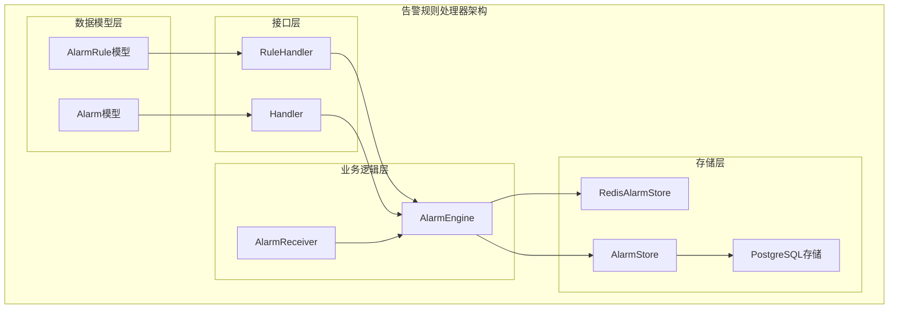
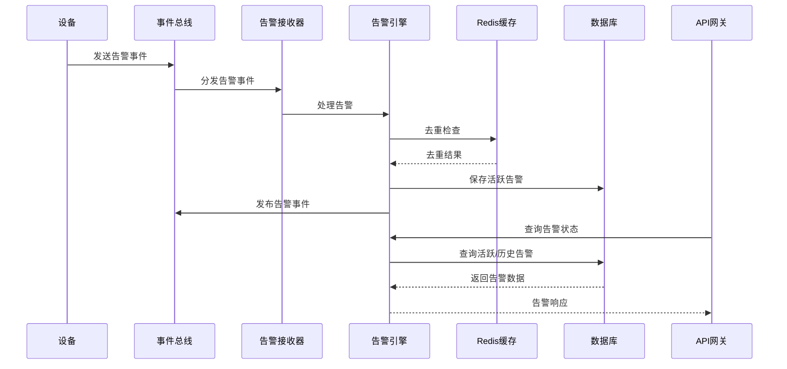
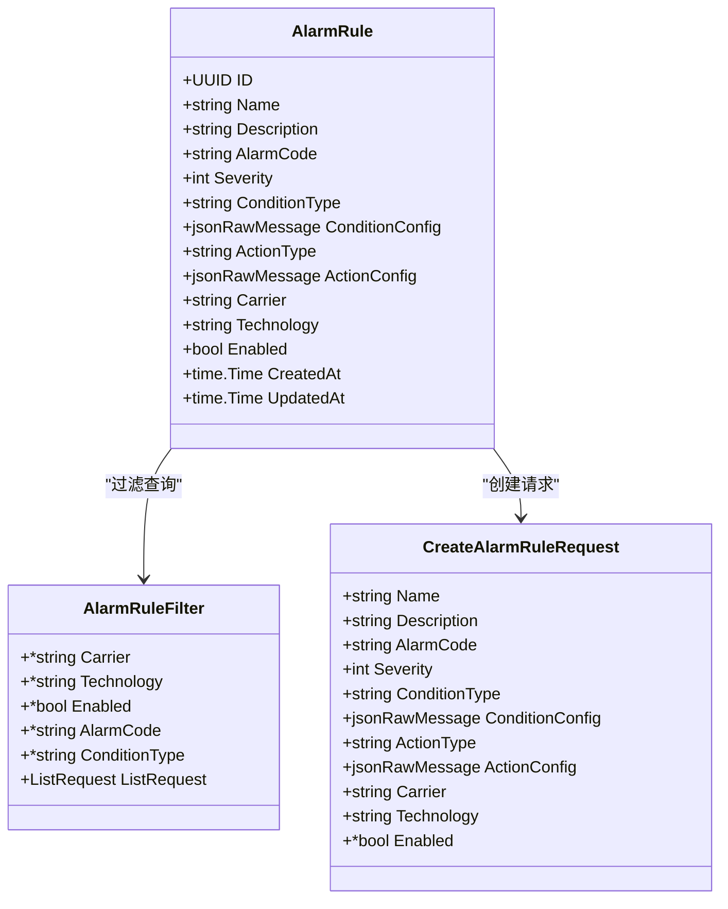
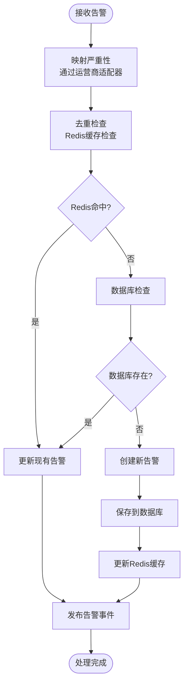
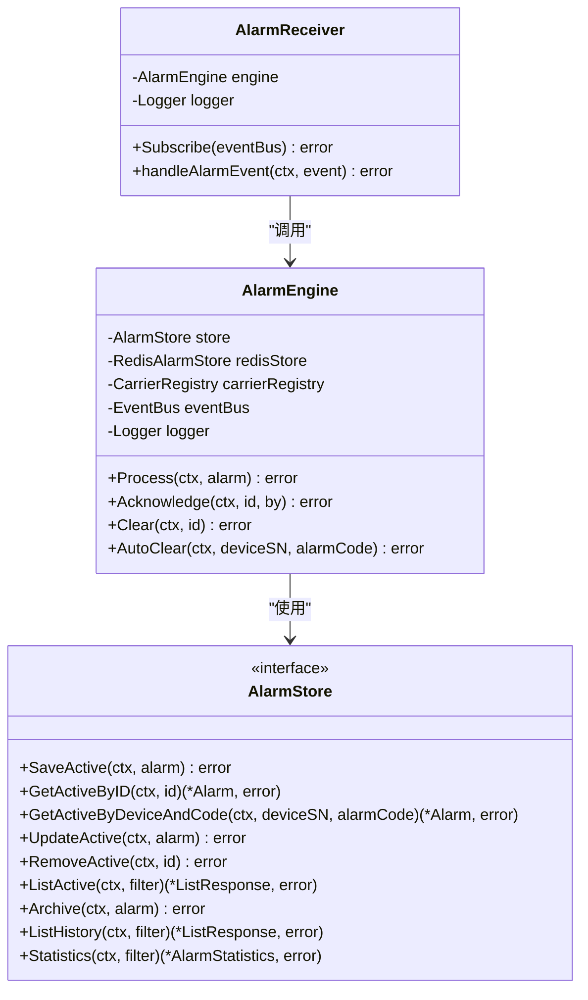
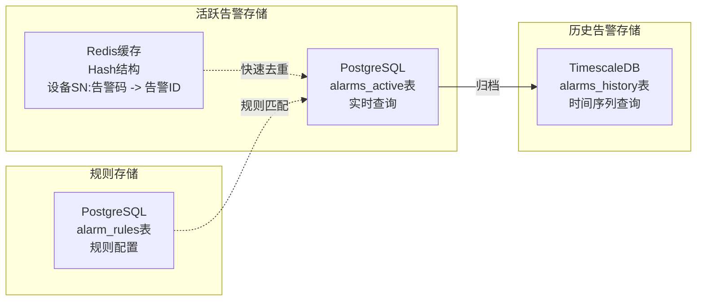
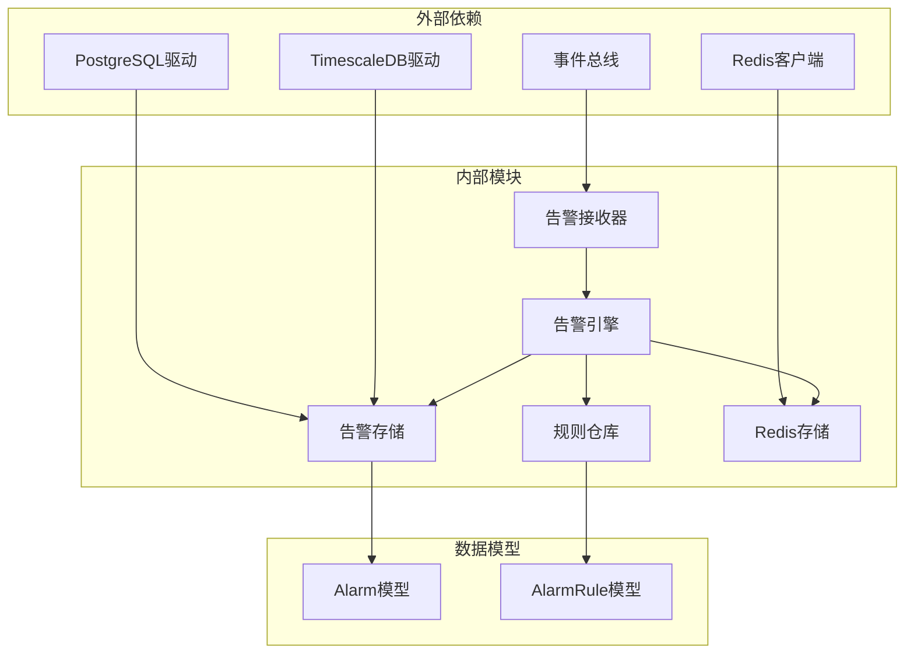

# 告警规则处理器

<cite>
**本文档引用的文件**
- [engine.go](file://omcgo/internal/alarm/engine.go)
- [handler.go](file://omcgo/internal/alarm/handler.go)
- [receiver.go](file://omcgo/internal/alarm/receiver.go)
- [rule_model.go](file://omcgo/internal/alarm/rule_model.go)
- [rule_handler.go](file://omcgo/internal/alarm/rule_handler.go)
- [rule_repository.go](file://omcgo/internal/alarm/rule_repository.go)
- [pg_rule_repository.go](file://omcgo/internal/alarm/pg_rule_repository.go)
- [store.go](file://omcgo/internal/alarm/store.go)
- [pg_store.go](file://omcgo/internal/alarm/pg_store.go)
- [redis_store.go](file://omcgo/internal/alarm/redis_store.go)
- [engine_test.go](file://omcgo/internal/alarm/engine_test.go)
- [rule_handler_test.go](file://omcgo/internal/alarm/rule_handler_test.go)
- [receiver_test.go](file://omcgo/internal/alarm/receiver_test.go)
</cite>

## 目录
1. [简介](#简介)
2. [项目结构](#项目结构)
3. [核心组件](#核心组件)
4. [架构概览](#架构概览)
5. [详细组件分析](#详细组件分析)
6. [依赖关系分析](#依赖关系分析)
7. [性能考虑](#性能考虑)
8. [故障排除指南](#故障排除指南)
9. [结论](#结论)
10. [附录](#附录)

## 简介

告警规则处理器是OMC系统中的关键组件，负责管理设备告警的生命周期和规则引擎。该系统实现了从原始设备告警事件到系统化告警管理的完整流程，包括告警规则的定义、匹配和执行机制。

系统采用事件驱动架构，通过消息总线接收设备告警事件，经过规则引擎处理后生成系统告警。告警规则处理器提供了完整的REST API接口，支持告警规则的创建、修改、删除和查询操作。

## 项目结构

告警规则处理器位于`omcgo/internal/alarm`目录下，采用清晰的分层架构设计：



**图表来源**
- [engine.go:15-39](file://omcgo/internal/alarm/engine.go#L15-L39)
- [handler.go:14-24](file://omcgo/internal/alarm/handler.go#L14-L24)
- [receiver.go:26-35](file://omcgo/internal/alarm/receiver.go#L26-L35)

**章节来源**
- [engine.go:1-230](file://omcgo/internal/alarm/engine.go#L1-L230)
- [handler.go:1-206](file://omcgo/internal/alarm/handler.go#L1-L206)
- [receiver.go:1-86](file://omcgo/internal/alarm/receiver.go#L1-L86)

## 核心组件

### 告警引擎 (AlarmEngine)

告警引擎是系统的核心处理单元，负责告警的完整生命周期管理：

- **告警处理**: 接收原始告警，进行严重性映射、去重检查和持久化
- **状态管理**: 处理告警的确认和清除操作
- **事件发布**: 在告警状态变化时发布相应的事件

### 规则处理器 (RuleHandler)

提供REST API接口管理告警规则：

- **规则CRUD**: 支持告警规则的创建、查询、更新和删除
- **过滤查询**: 支持按运营商、技术类型、启用状态等条件过滤
- **参数验证**: 对请求参数进行严格的验证和默认值设置

### 存储抽象层

系统实现了多层存储架构：

- **Redis缓存层**: 提供L1缓存用于告警去重
- **PostgreSQL层**: 主存储，保存活跃告警
- **TimescaleDB层**: 历史告警存储，支持时间序列查询

**章节来源**
- [engine.go:41-134](file://omcgo/internal/alarm/engine.go#L41-L134)
- [rule_handler.go:14-35](file://omcgo/internal/alarm/rule_handler.go#L14-L35)
- [store.go:30-41](file://omcgo/internal/alarm/store.go#L30-L41)

## 架构概览

系统采用事件驱动的微服务架构，通过消息总线实现松耦合集成：



**图表来源**
- [receiver.go:37-49](file://omcgo/internal/alarm/receiver.go#L37-L49)
- [engine.go:41-134](file://omcgo/internal/alarm/engine.go#L41-L134)
- [pg_store.go:28-41](file://omcgo/internal/alarm/pg_store.go#L28-L41)

## 详细组件分析

### 告警规则模型

告警规则采用灵活的JSON配置结构，支持多种条件类型和动作类型：



**图表来源**
- [rule_model.go:11-67](file://omcgo/internal/alarm/rule_model.go#L11-L67)

### 告警处理流程

告警处理采用五步处理流程，确保数据一致性和性能优化：



**图表来源**
- [engine.go:41-134](file://omcgo/internal/alarm/engine.go#L41-L134)

### 规则引擎工作原理

规则引擎通过条件配置实现灵活的告警规则匹配：



**图表来源**
- [engine.go:15-39](file://omcgo/internal/alarm/engine.go#L15-L39)
- [receiver.go:26-35](file://omcgo/internal/alarm/receiver.go#L26-L35)
- [store.go:30-41](file://omcgo/internal/alarm/store.go#L30-L41)

**章节来源**
- [engine.go:41-230](file://omcgo/internal/alarm/engine.go#L41-L230)
- [rule_model.go:11-67](file://omcgo/internal/alarm/rule_model.go#L11-L67)
- [receiver.go:51-85](file://omcgo/internal/alarm/receiver.go#L51-L85)

### REST API接口设计

系统提供完整的告警规则管理API：

| 方法 | 路径 | 描述 | 请求体 | 响应 |
|------|------|------|--------|------|
| GET | `/rules` | 列出所有告警规则 | 查询参数 | ListResponse[AlarmRule] |
| GET | `/rules/:id` | 获取单个告警规则 | - | AlarmRule |
| POST | `/rules` | 创建告警规则 | CreateAlarmRuleRequest | AlarmRule |
| PUT | `/rules/:id` | 更新告警规则 | UpdateAlarmRuleRequest | AlarmRule |
| DELETE | `/rules/:id` | 删除告警规则 | - | JSON消息 |

**章节来源**
- [rule_handler.go:25-35](file://omcgo/internal/alarm/rule_handler.go#L25-L35)
- [rule_handler.go:97-137](file://omcgo/internal/alarm/rule_handler.go#L97-L137)
- [rule_handler.go:139-198](file://omcgo/internal/alarm/rule_handler.go#L139-L198)

### 存储架构设计

系统采用分层存储架构，优化不同场景的性能需求：



**图表来源**
- [redis_store.go:20-51](file://omcgo/internal/alarm/redis_store.go#L20-L51)
- [pg_store.go:17-26](file://omcgo/internal/alarm/pg_store.go#L17-L26)
- [pg_rule_repository.go:28-36](file://omcgo/internal/alarm/pg_rule_repository.go#L28-L36)

**章节来源**
- [redis_store.go:10-52](file://omcgo/internal/alarm/redis_store.go#L10-L52)
- [pg_store.go:17-273](file://omcgo/internal/alarm/pg_store.go#L17-L273)
- [pg_rule_repository.go:28-253](file://omcgo/internal/alarm/pg_rule_repository.go#L28-L253)

## 依赖关系分析

系统采用清晰的依赖层次结构，确保模块间的低耦合高内聚：



**图表来源**
- [engine.go:3-13](file://omcgo/internal/alarm/engine.go#L3-L13)
- [receiver.go:3-11](file://omcgo/internal/alarm/receiver.go#L3-L11)
- [pg_store.go:3-13](file://omcgo/internal/alarm/pg_store.go#L3-L13)

**章节来源**
- [engine.go:3-13](file://omcgo/internal/alarm/engine.go#L3-L13)
- [pg_rule_repository.go:3-16](file://omcgo/internal/alarm/pg_rule_repository.go#L3-L16)
- [pg_store.go:3-13](file://omcgo/internal/alarm/pg_store.go#L3-L13)

## 性能考虑

### 缓存策略

系统采用多层缓存策略优化性能：

1. **Redis L1缓存**: 使用Hash结构存储活跃告警，提供毫秒级查询响应
2. **数据库索引优化**: 为常用查询字段建立复合索引
3. **批量操作**: 支持批量查询和更新操作

### 查询优化

- **分页查询**: 所有列表查询都支持分页，避免大数据量查询
- **条件过滤**: 支持多字段条件过滤，减少不必要的数据传输
- **时间范围查询**: 历史数据查询支持精确的时间范围限制

### 并发处理

- **事件队列**: 使用消息队列处理告警事件，避免阻塞主流程
- **连接池管理**: 数据库连接池自动管理，支持高并发访问
- **异步处理**: 非关键操作采用异步方式处理

## 故障排除指南

### 常见问题诊断

#### 告警未正确处理
1. 检查事件总线连接状态
2. 验证告警接收器订阅是否成功
3. 确认Redis服务可用性
4. 检查数据库连接配置

#### 规则不生效
1. 验证规则状态是否为启用
2. 检查规则条件配置格式
3. 确认设备运营商和网络类型匹配
4. 验证规则优先级设置

#### 性能问题
1. 监控Redis命中率
2. 检查数据库查询执行计划
3. 分析事件处理延迟
4. 评估硬件资源使用情况

**章节来源**
- [engine_test.go:101-275](file://omcgo/internal/alarm/engine_test.go#L101-L275)
- [rule_handler_test.go:115-447](file://omcgo/internal/alarm/rule_handler_test.go#L115-L447)
- [receiver_test.go:64-147](file://omcgo/internal/alarm/receiver_test.go#L64-L147)

## 结论

告警规则处理器是一个设计精良的事件驱动系统，具有以下特点：

1. **模块化设计**: 清晰的分层架构便于维护和扩展
2. **高性能**: 多层缓存和优化的查询策略确保系统性能
3. **可扩展性**: 灵活的规则配置支持复杂的告警场景
4. **可靠性**: 完善的错误处理和监控机制保证系统稳定运行

系统通过标准化的API接口和事件驱动架构，为设备告警管理提供了完整的解决方案。

## 附录

### 配置示例

#### 告警规则配置示例
```json
{
  "name": "CPU使用率过高",
  "alarm_code": "CPU_HIGH",
  "severity": 1,
  "condition_type": "threshold",
  "condition_config": {
    "max": 90,
    "duration": 300
  },
  "action_type": "notify",
  "action_config": {
    "email": "ops@company.com",
    "sms": true
  },
  "carrier": "cmcc",
  "technology": "lte",
  "enabled": true
}
```

### 最佳实践

1. **规则设计原则**
   - 合理设置告警级别，避免过多的低级别告警
   - 使用合理的阈值和持续时间配置
   - 为不同运营商和网络类型分别配置规则

2. **性能优化建议**
   - 定期清理历史告警数据
   - 监控Redis缓存命中率
   - 优化数据库查询索引

3. **监控和维护**
   - 建立完善的告警规则变更审计
   - 定期验证规则的有效性
   - 监控系统性能指标