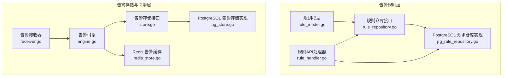
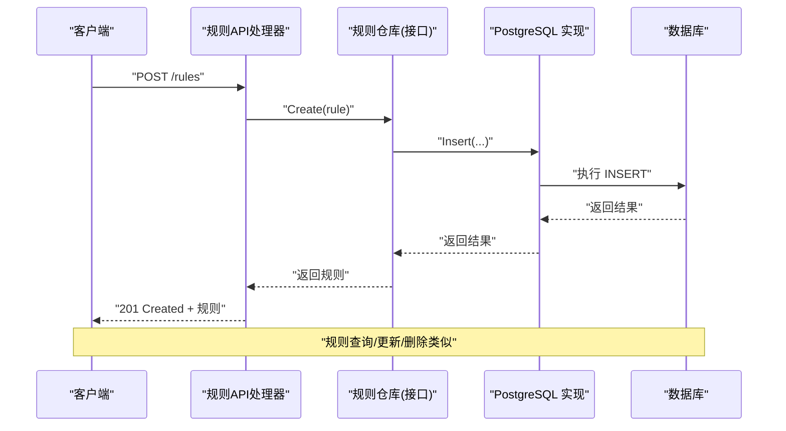
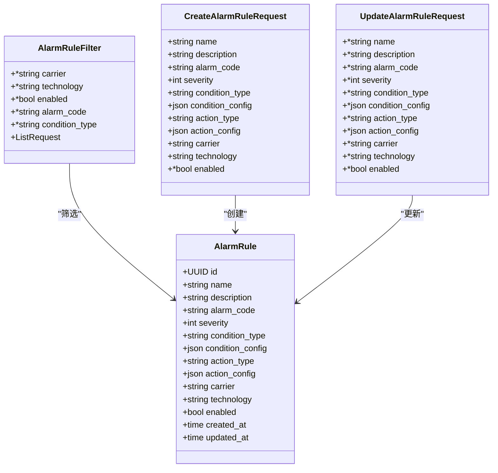
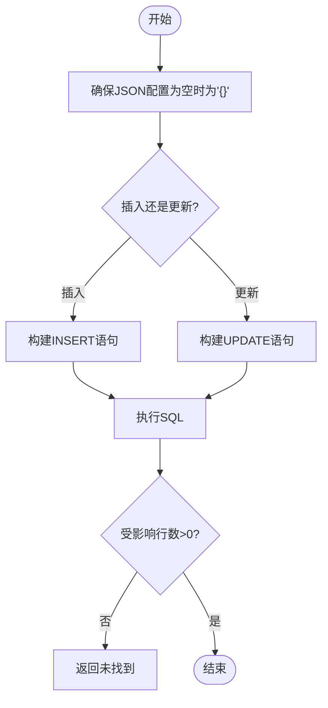
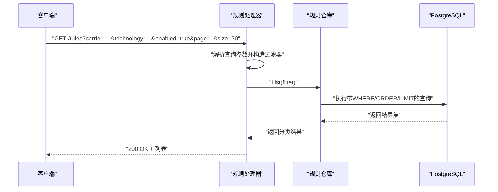
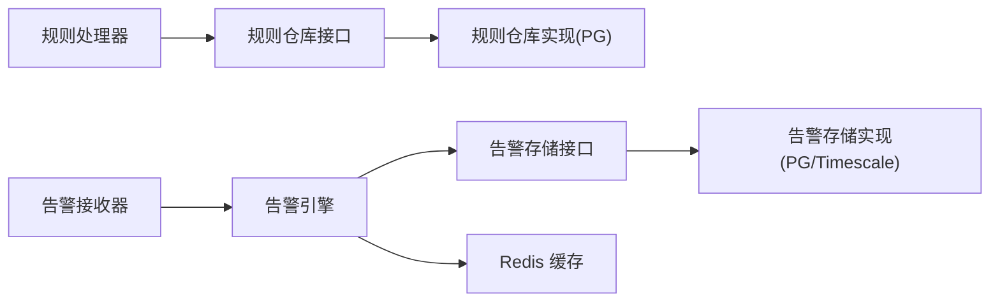

# 告警规则管理

<cite>
**本文引用的文件**
- [rule_model.go](file://omcgo/internal/alarm/rule_model.go)
- [rule_repository.go](file://omcgo/internal/alarm/rule_repository.go)
- [pg_rule_repository.go](file://omcgo/internal/alarm/pg_rule_repository.go)
- [rule_handler.go](file://omcgo/internal/alarm/rule_handler.go)
- [store.go](file://omcgo/internal/alarm/store.go)
- [pg_store.go](file://omcgo/internal/alarm/pg_store.go)
- [engine.go](file://omcgo/internal/alarm/engine.go)
- [receiver.go](file://omcgo/internal/alarm/receiver.go)
- [redis_store.go](file://omcgo/internal/alarm/redis_store.go)
- [000018_create_alarm_rules.up.sql](file://omcgo/migrations/000018_create_alarm_rules.up.sql)
- [12-alarm-management.md](file://omcgo/docs/detailed-design/12-alarm-management.md)
- [04-alarm-management.md](file://omcgo/docs/features/04-alarm-management.md)
</cite>

## 目录
1. [简介](#简介)
2. [项目结构](#项目结构)
3. [核心组件](#核心组件)
4. [架构总览](#架构总览)
5. [详细组件分析](#详细组件分析)
6. [依赖关系分析](#依赖关系分析)
7. [性能考量](#性能考量)
8. [故障排除指南](#故障排除指南)
9. [结论](#结论)
10. [附录](#附录)

## 简介
本文件面向告警规则管理模块，系统化阐述规则实体的数据模型设计、规则仓库的CRUD与查询接口、存储结构与索引、查询优化策略、版本与继承机制、动态加载方式，并提供API接口文档、使用示例与配置指南，最后总结最佳实践、性能优化建议与常见问题排查方法。

## 项目结构
告警规则管理位于后端模块 omcgo 的 internal/alarm 目录下，围绕“规则模型 → 规则仓库接口 → PostgreSQL 实现 → 规则API处理器”的分层组织，配合活跃/历史告警存储与引擎，形成完整的告警生命周期闭环。

**图表来源**
- [rule_model.go:11-67](file://omcgo/internal/alarm/rule_model.go#L11-L67)
- [rule_repository.go:10-17](file://omcgo/internal/alarm/rule_repository.go#L10-L17)
- [pg_rule_repository.go:28-36](file://omcgo/internal/alarm/pg_rule_repository.go#L28-L36)
- [rule_handler.go:14-35](file://omcgo/internal/alarm/rule_handler.go#L14-L35)
- [store.go:30-41](file://omcgo/internal/alarm/store.go#L30-L41)
- [pg_store.go:17-26](file://omcgo/internal/alarm/pg_store.go#L17-L26)
- [engine.go:15-39](file://omcgo/internal/alarm/engine.go#L15-L39)
- [receiver.go:26-35](file://omcgo/internal/alarm/receiver.go#L26-L35)
- [redis_store.go:10-18](file://omcgo/internal/alarm/redis_store.go#L10-L18)

**章节来源**
- [rule_model.go:11-67](file://omcgo/internal/alarm/rule_model.go#L11-L67)
- [rule_repository.go:10-17](file://omcgo/internal/alarm/rule_repository.go#L10-L17)
- [pg_rule_repository.go:28-36](file://omcgo/internal/alarm/pg_rule_repository.go#L28-L36)
- [rule_handler.go:25-35](file://omcgo/internal/alarm/rule_handler.go#L25-L35)
- [store.go:30-41](file://omcgo/internal/alarm/store.go#L30-L41)
- [pg_store.go:17-26](file://omcgo/internal/alarm/pg_store.go#L17-L26)
- [engine.go:15-39](file://omcgo/internal/alarm/engine.go#L15-L39)
- [receiver.go:26-35](file://omcgo/internal/alarm/receiver.go#L26-L35)
- [redis_store.go:10-18](file://omcgo/internal/alarm/redis_store.go#L10-L18)

## 核心组件
- 规则模型与请求体：定义规则实体字段、过滤器、创建/更新请求体，支持JSON配置字段与多租户维度（运营商、制式）。
- 规则仓库接口与PostgreSQL实现：提供Create/GetByID/Update/Delete/List等CRUD与分页排序、条件过滤。
- 规则API处理器：暴露REST路由，绑定查询参数与请求体，调用仓库执行业务。
- 告警存储与引擎：活跃/历史告警持久化、Redis去重、生命周期管理（确认/清除），为规则触发提供运行时支撑。
- 数据库迁移：定义 alarm_rules 表结构、索引与更新触发器。

**章节来源**
- [rule_model.go:11-67](file://omcgo/internal/alarm/rule_model.go#L11-L67)
- [rule_repository.go:10-17](file://omcgo/internal/alarm/rule_repository.go#L10-L17)
- [pg_rule_repository.go:38-193](file://omcgo/internal/alarm/pg_rule_repository.go#L38-L193)
- [rule_handler.go:46-213](file://omcgo/internal/alarm/rule_handler.go#L46-L213)
- [store.go:30-41](file://omcgo/internal/alarm/store.go#L30-L41)
- [pg_store.go:28-270](file://omcgo/internal/alarm/pg_store.go#L28-L270)
- [engine.go:41-230](file://omcgo/internal/alarm/engine.go#L41-L230)
- [000018_create_alarm_rules.up.sql:2-27](file://omcgo/migrations/000018_create_alarm_rules.up.sql#L2-L27)

## 架构总览
告警规则管理采用清晰的分层与职责分离：
- 规则层：模型定义、仓库接口、仓库实现、HTTP API。
- 存储与引擎层：活跃/历史告警存储、Redis去重、引擎处理、接收器订阅。
- 数据层：PostgreSQL + TimescaleDB（历史归档），alarm_rules 表承载规则配置。

**图表来源**
- [rule_handler.go:97-137](file://omcgo/internal/alarm/rule_handler.go#L97-L137)
- [pg_rule_repository.go:38-66](file://omcgo/internal/alarm/pg_rule_repository.go#L38-L66)
- [000018_create_alarm_rules.up.sql:2-17](file://omcgo/migrations/000018_create_alarm_rules.up.sql#L2-L17)

**章节来源**
- [rule_handler.go:46-213](file://omcgo/internal/alarm/rule_handler.go#L46-L213)
- [pg_rule_repository.go:38-193](file://omcgo/internal/alarm/pg_rule_repository.go#L38-L193)
- [000018_create_alarm_rules.up.sql:2-27](file://omcgo/migrations/000018_create_alarm_rules.up.sql#L2-L27)

## 详细组件分析

### 数据模型设计
- 规则实体字段
  - 标识与元信息：ID、名称、描述、创建/更新时间。
  - 告警相关：告警码、严重级别、告警类型。
  - 条件与动作：condition_type + condition_config（JSON）、action_type + action_config（JSON）。
  - 作用域：运营商、制式、启用状态。
- 过滤器与请求体
  - 列表过滤器支持运营商、制式、启用状态、告警码、条件类型与分页排序。
  - 创建/更新请求体用于API输入校验与默认值设置。
- JSON配置字段
  - condition_config 与 action_config 使用 json.RawMessage，确保灵活扩展与默认空对象处理。

**图表来源**
- [rule_model.go:11-67](file://omcgo/internal/alarm/rule_model.go#L11-L67)

**章节来源**
- [rule_model.go:11-67](file://omcgo/internal/alarm/rule_model.go#L11-L67)

### 规则仓库实现
- 接口契约
  - Create/GetByID/Update/Delete/List 定义规则的完整CRUD与列表查询。
- PostgreSQL 实现
  - 插入/更新时确保 condition_config 与 action_config 为合法JSON（空则转为 {}）。
  - 查询支持多条件过滤、排序与分页；统计总数后返回分页响应。
  - 删除/更新未命中返回“未找到”错误。
- 索引与约束
  - 表结构包含主键、默认值与时钟列触发器。
  - 已创建索引：运营商、启用状态、告警码，提升常用过滤效率。

**图表来源**
- [pg_rule_repository.go:38-138](file://omcgo/internal/alarm/pg_rule_repository.go#L38-L138)
- [pg_rule_repository.go:195-212](file://omcgo/internal/alarm/pg_rule_repository.go#L195-L212)
- [000018_create_alarm_rules.up.sql:19-26](file://omcgo/migrations/000018_create_alarm_rules.up.sql#L19-L26)

**章节来源**
- [rule_repository.go:10-17](file://omcgo/internal/alarm/rule_repository.go#L10-L17)
- [pg_rule_repository.go:38-193](file://omcgo/internal/alarm/pg_rule_repository.go#L38-L193)
- [000018_create_alarm_rules.up.sql:2-27](file://omcgo/migrations/000018_create_alarm_rules.up.sql#L2-L27)

### 规则API接口文档
- 路由注册
  - 在给定路由组下注册 /rules 的 GET/POST/PUT/DELETE 路由。
- 查询参数
  - 支持 carrier、technology、enabled、alarm_code、condition_type、分页与排序。
- 请求体
  - 创建：必填 name、condition_type、condition_config、action_type；severity 默认4，enabled 默认true。
  - 更新：可选更新任一字段，其余保持不变。
- 响应
  - 成功返回规则对象；错误返回HTTP状态码与错误信息。

**图表来源**
- [rule_handler.go:46-79](file://omcgo/internal/alarm/rule_handler.go#L46-L79)
- [pg_rule_repository.go:140-193](file://omcgo/internal/alarm/pg_rule_repository.go#L140-L193)

**章节来源**
- [rule_handler.go:25-35](file://omcgo/internal/alarm/rule_handler.go#L25-L35)
- [rule_handler.go:46-213](file://omcgo/internal/alarm/rule_handler.go#L46-L213)

### 存储结构、索引与查询优化
- 表结构
  - alarm_rules：包含规则核心字段与JSON配置字段，启用状态默认true，创建/更新时间默认当前时间。
- 索引
  - idx_alarm_rules_carrier、idx_alarm_rules_enabled、idx_alarm_rules_alarm_code，覆盖常用过滤维度。
- 查询优化策略
  - 列表查询先统计总数，再按排序与分页取数据，避免全表扫描。
  - 过滤器按需拼接WHERE条件，减少无效匹配。
  - JSON字段以BLOB形式存储，便于灵活扩展且支持默认空对象。

**章节来源**
- [000018_create_alarm_rules.up.sql:2-27](file://omcgo/migrations/000018_create_alarm_rules.up.sql#L2-L27)
- [pg_rule_repository.go:140-193](file://omcgo/internal/alarm/pg_rule_repository.go#L140-L193)

### 版本管理、继承机制与动态加载
- 版本管理
  - 通过数据库迁移脚本维护规则表结构演进，新增字段或索引时在新迁移中添加。
- 继承机制
  - 规则实体支持按运营商/制式进行作用域限定，不同租户可拥有各自规则集。
- 动态加载
  - 规则作为静态配置存储于数据库；运行时通过API读取与应用，无需重启服务。

**章节来源**
- [000018_create_alarm_rules.up.sql:2-27](file://omcgo/migrations/000018_create_alarm_rules.up.sql#L2-L27)
- [rule_model.go:16-24](file://omcgo/internal/alarm/rule_model.go#L16-L24)

### 告警规则与引擎联动
- 规则触发
  - 规则定义的 condition_type + condition_config 决定触发条件；当活跃告警满足条件时，触发 action_type + action_config 执行相应动作。
- 引擎与存储
  - 引擎负责活跃/历史告警的去重、确认、清除与生命周期管理；规则管理模块提供规则配置，二者通过事件与存储解耦协作。

**章节来源**
- [engine.go:41-230](file://omcgo/internal/alarm/engine.go#L41-L230)
- [pg_store.go:28-270](file://omcgo/internal/alarm/pg_store.go#L28-L270)
- [receiver.go:51-85](file://omcgo/internal/alarm/receiver.go#L51-L85)

## 依赖关系分析
- 组件耦合
  - 规则API处理器依赖规则仓库接口；仓库实现依赖PostgreSQL连接池。
  - 引擎依赖存储接口与Redis缓存；接收器订阅事件总线并将设备告警转换为内部模型交由引擎处理。
- 外部依赖
  - PostgreSQL/PGX用于规则与告警存储；TimescaleDB用于历史归档；Redis用于活跃告警去重缓存。
- 循环依赖
  - 未发现循环依赖；接口抽象清晰，分层明确。

**图表来源**
- [rule_handler.go:14-23](file://omcgo/internal/alarm/rule_handler.go#L14-L23)
- [rule_repository.go:10-17](file://omcgo/internal/alarm/rule_repository.go#L10-L17)
- [pg_rule_repository.go:28-36](file://omcgo/internal/alarm/pg_rule_repository.go#L28-L36)
- [receiver.go:26-35](file://omcgo/internal/alarm/receiver.go#L26-L35)
- [engine.go:15-39](file://omcgo/internal/alarm/engine.go#L15-L39)
- [pg_store.go:17-26](file://omcgo/internal/alarm/pg_store.go#L17-L26)
- [redis_store.go:10-18](file://omcgo/internal/alarm/redis_store.go#L10-L18)

**章节来源**
- [rule_handler.go:14-23](file://omcgo/internal/alarm/rule_handler.go#L14-L23)
- [pg_rule_repository.go:28-36](file://omcgo/internal/alarm/pg_rule_repository.go#L28-L36)
- [engine.go:15-39](file://omcgo/internal/alarm/engine.go#L15-L39)
- [pg_store.go:17-26](file://omcgo/internal/alarm/pg_store.go#L17-L26)
- [redis_store.go:10-18](file://omcgo/internal/alarm/redis_store.go#L10-L18)

## 性能考量
- 查询性能
  - 列表查询先COUNT再LIMIT，避免大结果集全扫描；按需拼接WHERE条件。
  - 为高频过滤字段建立索引，减少全表扫描。
- 写入性能
  - JSON字段默认空对象，减少NULL判断开销；批量写入可通过事务封装（如需）。
- 缓存与去重
  - Redis哈希结构快速判定活跃告警是否已存在，降低数据库压力。
- 存储选择
  - 历史告警使用TimescaleDB超表，按时间分区，提升时间序列查询效率。

[本节为通用性能建议，不直接分析具体文件]

## 故障排除指南
- 规则创建失败
  - 检查请求体必填字段是否齐全；确认JSON配置合法；查看数据库约束与默认值。
- 规则查询无结果
  - 核对过滤参数（运营商/制式/启用状态/告警码/条件类型）是否正确；确认索引是否生效。
- 规则更新未生效
  - 确认ID有效且存在；检查更新字段是否传入；关注更新时间戳变化。
- 告警处理异常
  - 查看引擎日志与事件总线订阅状态；确认Redis可用性与键空间；核对活跃/历史表结构与索引。

**章节来源**
- [pg_rule_repository.go:38-138](file://omcgo/internal/alarm/pg_rule_repository.go#L38-L138)
- [engine.go:41-230](file://omcgo/internal/alarm/engine.go#L41-L230)
- [redis_store.go:24-46](file://omcgo/internal/alarm/redis_store.go#L24-L46)

## 结论
告警规则管理模块以清晰的分层与接口抽象实现了规则的全生命周期管理，结合PostgreSQL与Redis/TimescaleDB的存储方案，具备良好的扩展性与可维护性。通过合理的索引与查询策略，能够满足高并发场景下的规则查询与告警处理需求。

## 附录

### API 使用示例（路径指引）
- 创建规则
  - 方法与路径：POST /rules
  - 请求体字段参考：[CreateAlarmRuleRequest:39-52](file://omcgo/internal/alarm/rule_model.go#L39-L52)
  - 处理流程参考：[CreateRule:97-137](file://omcgo/internal/alarm/rule_handler.go#L97-L137)
- 查询规则列表
  - 方法与路径：GET /rules
  - 查询参数参考：[ruleQuery:37-44](file://omcgo/internal/alarm/rule_handler.go#L37-L44)
  - 处理流程参考：[ListRules:46-79](file://omcgo/internal/alarm/rule_handler.go#L46-L79)
- 更新规则
  - 方法与路径：PUT /rules/:id
  - 请求体字段参考：[UpdateAlarmRuleRequest:54-67](file://omcgo/internal/alarm/rule_model.go#L54-L67)
  - 处理流程参考：[UpdateRule:139-198](file://omcgo/internal/alarm/rule_handler.go#L139-L198)
- 删除规则
  - 方法与路径：DELETE /rules/:id
  - 处理流程参考：[DeleteRule:200-213](file://omcgo/internal/alarm/rule_handler.go#L200-L213)

### 配置指南
- 数据库初始化
  - 执行迁移脚本创建 alarm_rules 表与索引：[000018_create_alarm_rules.up.sql:2-27](file://omcgo/migrations/000018_create_alarm_rules.up.sql#L2-L27)
- Redis缓存
  - 配置Redis连接，用于活跃告警去重缓存：[redis_store.go:10-18](file://omcgo/internal/alarm/redis_store.go#L10-L18)
- TimescaleDB
  - 历史告警使用超表归档，确保时序查询性能：[pg_store.go:110-122](file://omcgo/internal/alarm/pg_store.go#L110-L122)

**章节来源**
- [000018_create_alarm_rules.up.sql:2-27](file://omcgo/migrations/000018_create_alarm_rules.up.sql#L2-L27)
- [redis_store.go:10-18](file://omcgo/internal/alarm/redis_store.go#L10-L18)
- [pg_store.go:110-122](file://omcgo/internal/alarm/pg_store.go#L110-L122)