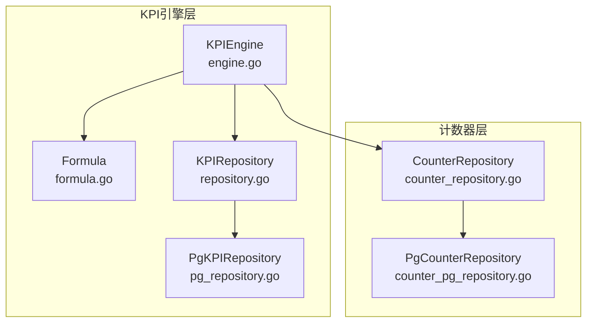
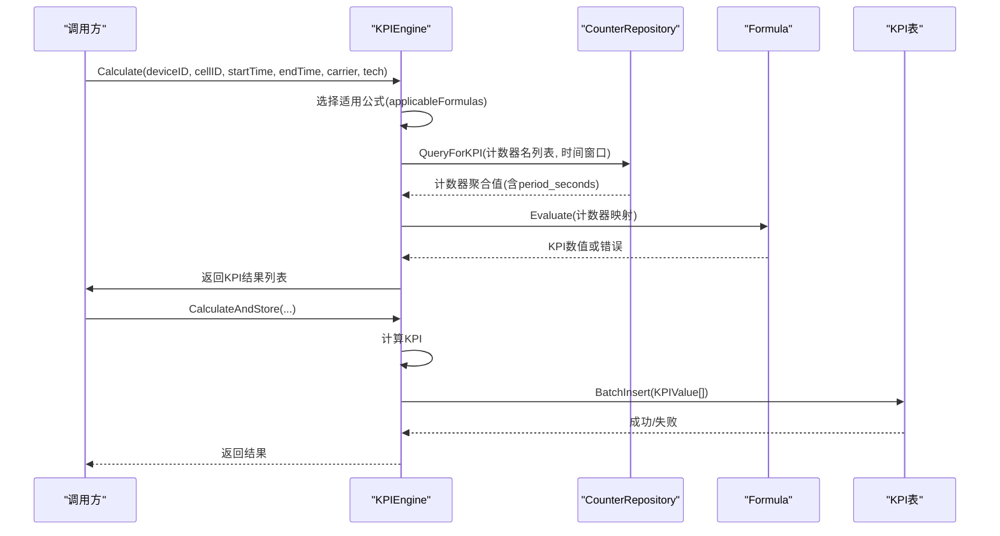
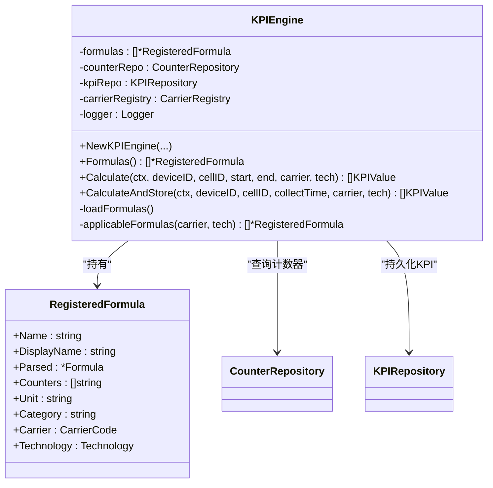
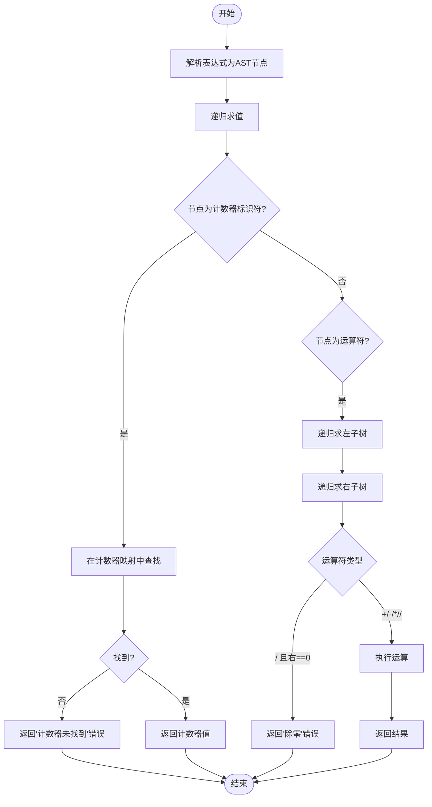
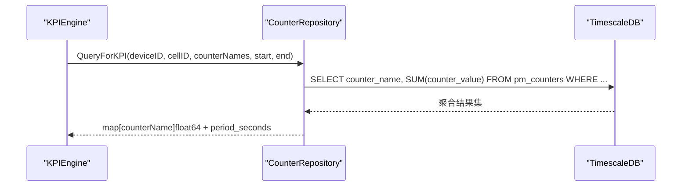
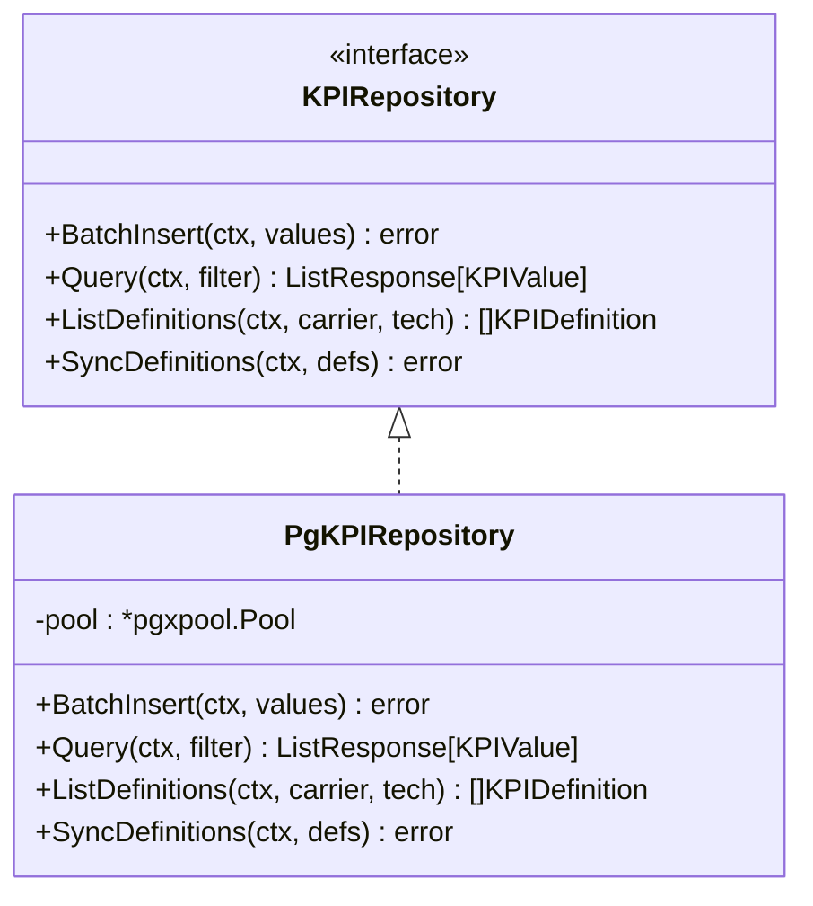
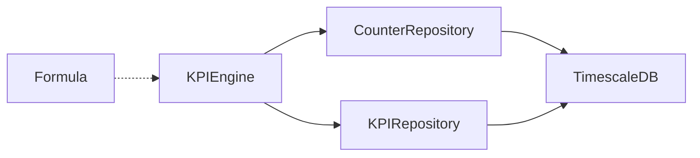

# KPI计算引擎

<cite>
**本文引用的文件**
- [engine.go](file://omcgo/internal/pm/kpi/engine.go)
- [formula.go](file://omcgo/internal/pm/kpi/formula.go)
- [repository.go](file://omcgo/internal/pm/kpi/repository.go)
- [pg_repository.go](file://omcgo/internal/pm/kpi/pg_repository.go)
- [engine_test.go](file://omcgo/internal/pm/kpi/engine_test.go)
- [formula_test.go](file://omcgo/internal/pm/kpi/formula_test.go)
- [counter_repository.go](file://omcgo/internal/pm/counter/repository.go)
- [counter_pg_repository.go](file://omcgo/internal/pm/counter/pg_repository.go)
- [kpi-file-transfer-analysis.md](file://omcgo/docs/reports/kpi-file-transfer-analysis.md)
</cite>

## 目录
1. [简介](#简介)
2. [项目结构](#项目结构)
3. [核心组件](#核心组件)
4. [架构总览](#架构总览)
5. [详细组件分析](#详细组件分析)
6. [依赖关系分析](#依赖关系分析)
7. [性能考虑](#性能考虑)
8. [故障排查指南](#故障排查指南)
9. [结论](#结论)
10. [附录](#附录)

## 简介
本文件为KPI计算引擎的全面技术文档，覆盖KPI公式定义、解析与执行机制，引擎工作原理、公式编译过程与计算优化策略，各类KPI类型的计算逻辑、输入参数与输出格式，阈值配置、异常检测与告警触发机制，以及KPI数据的缓存策略、批量计算与实时计算实现方式。同时提供KPI公式编写指南、性能调优技巧与常见问题解决方案，并给出具体计算示例与API使用说明。

## 项目结构
KPI计算引擎位于omcgo/internal/pm/kpi目录，核心文件包括：
- engine.go：KPI引擎主体，负责加载公式、聚合计数器、执行公式并持久化结果
- formula.go：公式解析器与求值器，支持四则运算、括号、常量与计数器标识符
- repository.go与pg_repository.go：KPI定义与数值的接口与PostgreSQL/TimescaleDB实现
- counter/*：PM计数器的接口与数据库实现，提供按时间窗口聚合的计数器查询能力
- 测试文件：engine_test.go与formula_test.go，覆盖典型场景与边界条件

图表来源
- [engine.go:1-168](file://omcgo/internal/pm/kpi/engine.go#L1-L168)
- [formula.go:1-187](file://omcgo/internal/pm/kpi/formula.go#L1-L187)
- [repository.go:1-30](file://omcgo/internal/pm/kpi/repository.go#L1-L30)
- [pg_repository.go:1-181](file://omcgo/internal/pm/kpi/pg_repository.go#L1-L181)
- [counter_repository.go:1-43](file://omcgo/internal/pm/counter/repository.go#L1-L43)
- [counter_pg_repository.go:1-201](file://omcgo/internal/pm/counter/pg_repository.go#L1-L201)

章节来源
- [engine.go:1-168](file://omcgo/internal/pm/kpi/engine.go#L1-L168)
- [formula.go:1-187](file://omcgo/internal/pm/kpi/formula.go#L1-L187)
- [repository.go:1-30](file://omcgo/internal/pm/kpi/repository.go#L1-L30)
- [pg_repository.go:1-181](file://omcgo/internal/pm/kpi/pg_repository.go#L1-L181)
- [counter_repository.go:1-43](file://omcgo/internal/pm/counter/repository.go#L1-L43)
- [counter_pg_repository.go:1-201](file://omcgo/internal/pm/counter/pg_repository.go#L1-L201)

## 核心组件
- KPIEngine：加载运营商与技术栈相关的KPI定义，按需查询计数器，执行公式并持久化结果
- Formula：表达式解析器与求值器，支持加减乘除、括号、数字常量与计数器标识符
- KPIRepository/PgKPIRepository：KPI定义与数值的持久化接口与PostgreSQL/TimescaleDB实现
- CounterRepository/PgCounterRepository：PM计数器的持久化接口与查询实现，提供按时间窗口聚合的计数器值

章节来源
- [engine.go:27-81](file://omcgo/internal/pm/kpi/engine.go#L27-L81)
- [formula.go:10-83](file://omcgo/internal/pm/kpi/formula.go#L10-L83)
- [repository.go:23-29](file://omcgo/internal/pm/kpi/repository.go#L23-L29)
- [pg_repository.go:16-40](file://omcgo/internal/pm/kpi/pg_repository.go#L16-L40)
- [counter_repository.go:36-42](file://omcgo/internal/pm/counter/repository.go#L36-L42)
- [counter_pg_repository.go:15-39](file://omcgo/internal/pm/counter/pg_repository.go#L15-L39)

## 架构总览
KPI计算引擎采用“公式注册+计数器聚合+表达式求值+批量落库”的流水线架构。引擎在启动时从运营商注册表加载所有KPI定义，解析为Formula对象；计算时根据设备、小区、时间窗口与运营商/技术栈筛选适用公式，查询计数器并进行求值，最后批量写入KPI表。

图表来源
- [engine.go:88-157](file://omcgo/internal/pm/kpi/engine.go#L88-L157)
- [formula.go:80-83](file://omcgo/internal/pm/kpi/formula.go#L80-L83)
- [counter_pg_repository.go:160-198](file://omcgo/internal/pm/counter/pg_repository.go#L160-L198)
- [pg_repository.go:26-40](file://omcgo/internal/pm/kpi/pg_repository.go#L26-L40)

## 详细组件分析

### KPI引擎（KPIEngine）
- 加载公式：遍历运营商注册表，按技术栈加载KPI定义，解析为Formula并缓存
- 计算流程：收集所需计数器名，查询计数器聚合值，逐公式求值，过滤缺失计数器的公式
- 批量落库：将计算结果批量插入KPI表，支持带宽优化的CopyFrom

图表来源
- [engine.go:15-81](file://omcgo/internal/pm/kpi/engine.go#L15-L81)
- [engine.go:88-157](file://omcgo/internal/pm/kpi/engine.go#L88-L157)

章节来源
- [engine.go:36-51](file://omcgo/internal/pm/kpi/engine.go#L36-L51)
- [engine.go:53-81](file://omcgo/internal/pm/kpi/engine.go#L53-L81)
- [engine.go:88-157](file://omcgo/internal/pm/kpi/engine.go#L88-L157)

### 公式解析与求值（Formula）
- 语法支持：数字常量、标识符（计数器名）、加减乘除、括号
- 求值策略：深度优先递归求值，遇到未知计数器返回错误，除零返回错误
- 错误处理：解析阶段与求值阶段均返回明确错误信息，便于定位问题

图表来源
- [formula.go:66-83](file://omcgo/internal/pm/kpi/formula.go#L66-L83)
- [formula.go:104-186](file://omcgo/internal/pm/kpi/formula.go#L104-L186)

章节来源
- [formula.go:10-83](file://omcgo/internal/pm/kpi/formula.go#L10-L83)
- [formula.go:85-186](file://omcgo/internal/pm/kpi/formula.go#L85-L186)

### 计数器查询（CounterRepository/PgCounterRepository）
- QueryForKPI：按设备、小区、计数器名集合与时间窗口进行聚合求和，自动注入period_seconds
- QueryAggregated：提供小时粒度的聚合视图，便于趋势分析与报表

图表来源
- [counter_pg_repository.go:160-198](file://omcgo/internal/pm/counter/pg_repository.go#L160-L198)

章节来源
- [counter_repository.go:36-42](file://omcgo/internal/pm/counter/repository.go#L36-L42)
- [counter_pg_repository.go:160-198](file://omcgo/internal/pm/counter/pg_repository.go#L160-L198)

### KPI持久化（KPIRepository/PgKPIRepository）
- BatchInsert：使用CopyFrom批量写入，提升吞吐
- Query/ListDefinitions/SyncDefinitions：支持查询、列出定义与同步定义

图表来源
- [repository.go:23-29](file://omcgo/internal/pm/kpi/repository.go#L23-L29)
- [pg_repository.go:16-181](file://omcgo/internal/pm/kpi/pg_repository.go#L16-L181)

章节来源
- [repository.go:11-29](file://omcgo/internal/pm/kpi/repository.go#L11-L29)
- [pg_repository.go:26-104](file://omcgo/internal/pm/kpi/pg_repository.go#L26-L104)
- [pg_repository.go:150-171](file://omcgo/internal/pm/kpi/pg_repository.go#L150-L171)

### KPI类型与计算逻辑
- 公式来源：来自运营商注册表中的KPIDefinition，包含名称、显示名、单位、分类、计数器依赖与表达式
- 计算范围：按设备/小区维度，基于时间窗口内的计数器聚合值进行计算
- 输出格式：KPIValue包含时间戳、设备ID、小区ID、KPI名称、数值、运营商与技术栈

章节来源
- [engine.go:15-25](file://omcgo/internal/pm/kpi/engine.go#L15-L25)
- [engine.go:118-127](file://omcgo/internal/pm/kpi/engine.go#L118-L127)

### API与使用示例
- 计算接口：Calculate与CalculateAndStore，支持指定设备、小区、时间窗口与运营商/技术栈
- 查询接口：KPIRepository.Query支持多维过滤与分页
- 北向导出：通过北向接口可导出KPI值（参考文件分析报告）

章节来源
- [engine.go:88-157](file://omcgo/internal/pm/kpi/engine.go#L88-L157)
- [repository.go:23-29](file://omcgo/internal/pm/kpi/repository.go#L23-L29)
- [kpi-file-transfer-analysis.md:311-325](file://omcgo/docs/reports/kpi-file-transfer-analysis.md#L311-L325)

## 依赖关系分析
- 组件耦合：KPIEngine依赖CounterRepository与KPIRepository，Formula独立于外部存储
- 外部依赖：TimescaleDB用于计数器与KPI存储；Zap用于日志；Squirrel用于SQL构建
- 循环依赖：未发现循环依赖

图表来源
- [engine.go:36-51](file://omcgo/internal/pm/kpi/engine.go#L36-L51)
- [formula.go:66-83](file://omcgo/internal/pm/kpi/formula.go#L66-L83)
- [counter_pg_repository.go:15-39](file://omcgo/internal/pm/counter/pg_repository.go#L15-L39)
- [pg_repository.go:16-40](file://omcgo/internal/pm/kpi/pg_repository.go#L16-L40)

章节来源
- [engine.go:36-51](file://omcgo/internal/pm/kpi/engine.go#L36-L51)
- [formula.go:66-83](file://omcgo/internal/pm/kpi/formula.go#L66-L83)
- [counter_pg_repository.go:15-39](file://omcgo/internal/pm/counter/pg_repository.go#L15-L39)
- [pg_repository.go:16-40](file://omcgo/internal/pm/kpi/pg_repository.go#L16-L40)

## 性能考虑
- 批量写入：KPIRepository使用CopyFrom进行批量插入，显著降低写入开销
- 聚合查询：计数器查询按时间窗口与计数器名集合进行聚合，减少网络往返
- 公式求值：AST递归求值，避免运行时字符串解析，复杂度与表达式长度线性相关
- 优化建议：
  - 合理设置时间窗口，避免过长导致内存压力
  - 对频繁使用的计数器建立合适索引（参考计数器查询条件）
  - 在高并发场景下，适当增加数据库连接池与批量大小

章节来源
- [pg_repository.go:26-40](file://omcgo/internal/pm/kpi/pg_repository.go#L26-L40)
- [counter_pg_repository.go:160-198](file://omcgo/internal/pm/counter/pg_repository.go#L160-L198)

## 故障排查指南
- 公式解析错误：检查表达式语法，确保括号匹配、运算符正确
- 计数器缺失：确认计数器名与计数器定义一致，检查时间窗口内是否存在数据
- 除零错误：检查分母计数器是否可能为零，必要时在公式中加入保护
- 数据库连接问题：检查连接池配置与超时设置，关注批量写入失败日志
- 性能问题：分析查询计划，确认索引使用情况；评估批量大小与并发度

章节来源
- [formula_test.go:68-98](file://omcgo/internal/pm/kpi/formula_test.go#L68-L98)
- [engine_test.go:154-196](file://omcgo/internal/pm/kpi/engine_test.go#L154-L196)
- [pg_repository.go:26-40](file://omcgo/internal/pm/kpi/pg_repository.go#L26-L40)

## 结论
KPI计算引擎以简洁高效的表达式求值为核心，结合计数器聚合与批量落库，实现了可扩展、可维护的KPI计算体系。通过运营商注册表与技术栈隔离，引擎能够灵活适配不同运营商的KPI定义；通过清晰的接口与测试覆盖，保证了计算逻辑的正确性与稳定性。

## 附录

### KPI阈值配置、异常检测与告警触发机制
- 阈值配置：KPI阈值通常由独立的阈值管理模块维护，KPI引擎本身不直接处理阈值
- 异常检测：可在KPI落库后，由专门的阈值比较与异常检测服务进行判定
- 告警触发：当KPI值超过阈值时，触发告警规则并推送至告警系统
- 注意：本仓库中KPI引擎与阈值/告警模块的集成点需在业务层实现，本文不展开具体代码

### KPI数据缓存策略
- 计数器缓存：可通过应用层缓存热点计数器聚合结果，减少重复查询
- 结果缓存：对于固定时间窗口的KPI结果，可按设备/小区维度进行短期缓存
- 缓存失效：基于时间窗口边界与设备变更事件进行失效控制

### 批量计算与实时计算
- 批量计算：适用于离线报表与历史回填，使用CalculateAndStore进行批量落库
- 实时计算：适用于监控面板与告警，使用Calculate进行即时求值
- 一致性：批量计算采用固定时间窗口，避免与实时计算的时间漂移

### KPI公式编写指南
- 基本语法：支持数字常量、计数器标识符、加减乘除与括号
- 最佳实践：
  - 明确单位换算与百分比计算
  - 对可能为零的分母添加保护
  - 使用有意义的计数器命名，保持表达式可读性
- 示例参考：测试用例覆盖了常见公式模式，可作为编写新公式的模板

章节来源
- [formula_test.go:10-179](file://omcgo/internal/pm/kpi/formula_test.go#L10-L179)
- [engine_test.go:98-152](file://omcgo/internal/pm/kpi/engine_test.go#L98-L152)