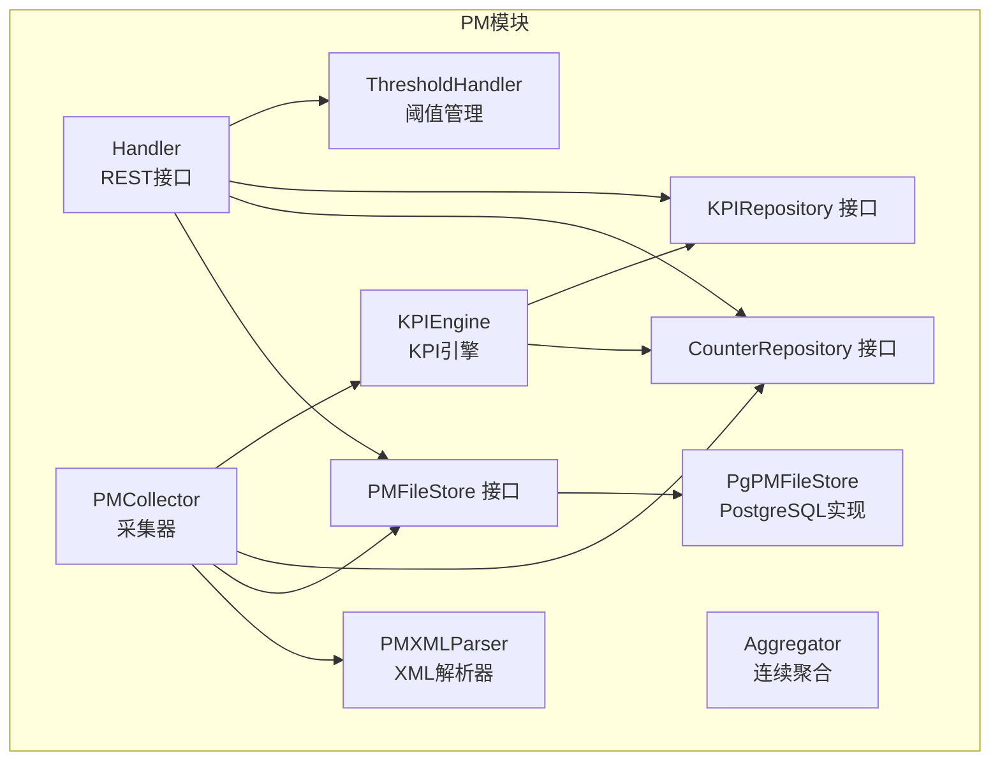
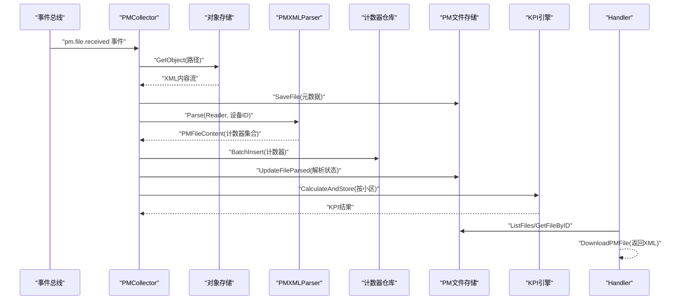
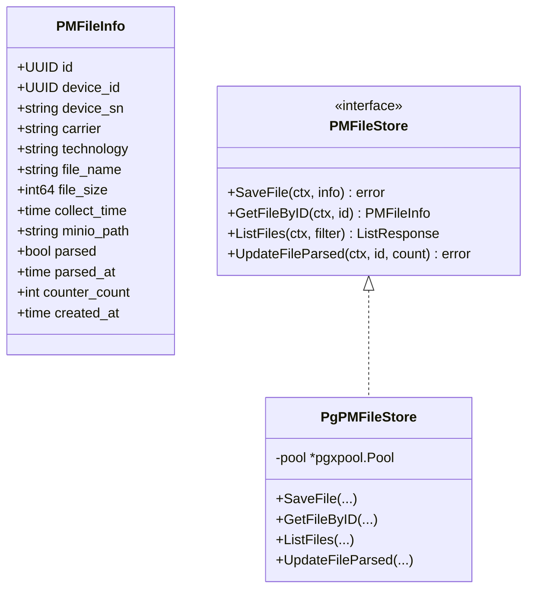
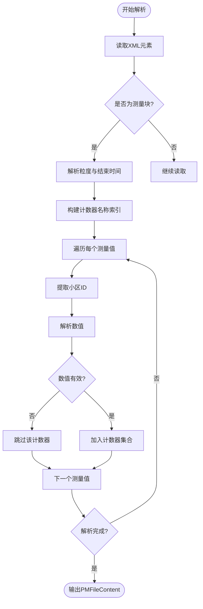
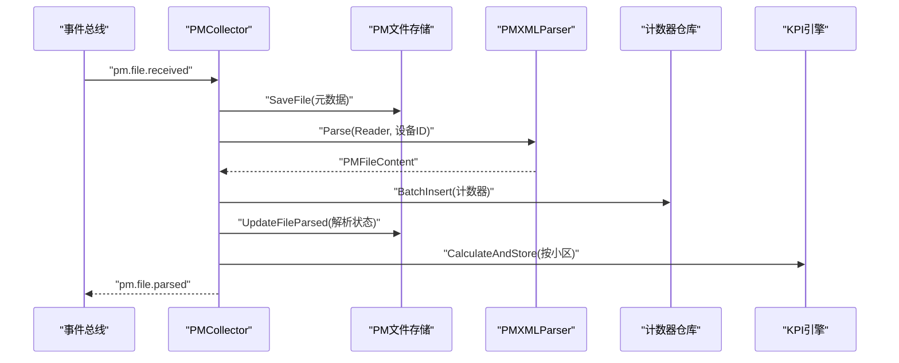
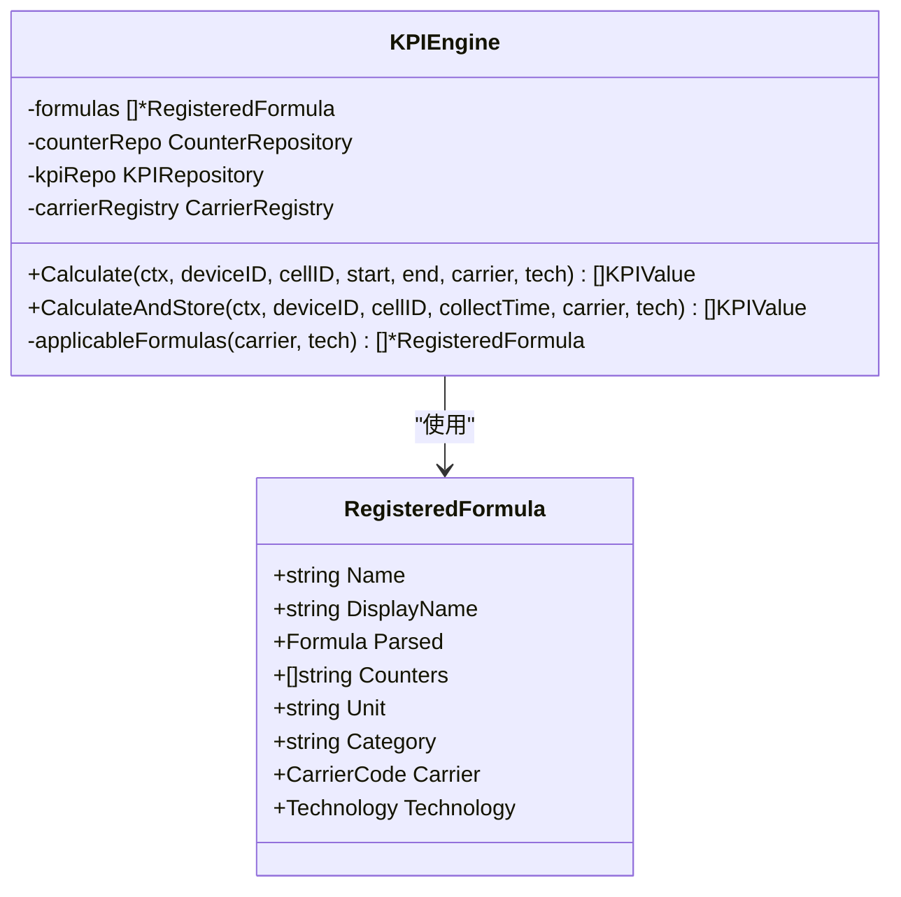
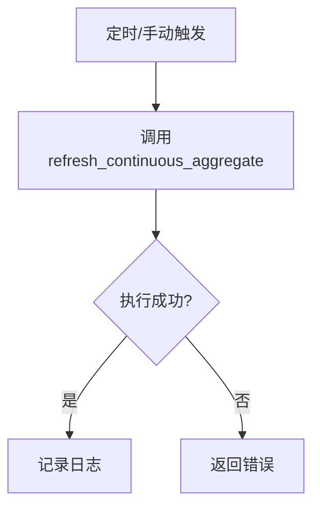
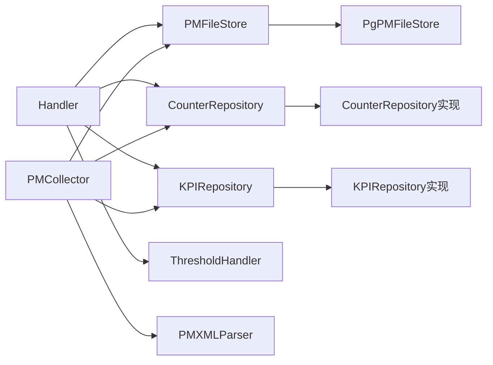

# PM数据采集与处理

<cite>
**本文档引用的文件**
- [omcgo/internal/pm/handler.go](file://omcgo/internal/pm/handler.go)
- [omcgo/internal/pm/file_store.go](file://omcgo/internal/pm/file_store.go)
- [omcgo/internal/pm/pg_file_store.go](file://omcgo/internal/pm/pg_file_store.go)
- [omcgo/internal/pm/task_model.go](file://omcgo/internal/pm/task_model.go)
- [omcgo/internal/pm/pg_task_repository.go](file://omcgo/internal/pm/pg_task_repository.go)
- [omcgo/internal/pm/collector/collector.go](file://omcgo/internal/pm/collector/collector.go)
- [omcgo/internal/pm/collector/parser.go](file://omcgo/internal/pm/collector/parser.go)
- [omcgo/internal/pm/kpi/engine.go](file://omcgo/internal/pm/kpi/engine.go)
- [omcgo/internal/pm/aggregation/aggregator.go](file://omcgo/internal/pm/aggregation/aggregator.go)
- [omcgo/internal/pm/threshold_handler.go](file://omcgo/internal/pm/threshold_handler.go)
- [omcgo/internal/pm/counter/repository.go](file://omcgo/internal/pm/counter/repository.go)
- [omcgo/internal/pm/kpi/repository.go](file://omcgo/internal/pm/kpi/repository.go)
</cite>

## 目录
1. [简介](#简介)
2. [项目结构](#项目结构)
3. [核心组件](#核心组件)
4. [架构总览](#架构总览)
5. [详细组件分析](#详细组件分析)
6. [依赖分析](#依赖分析)
7. [性能考虑](#性能考虑)
8. [故障排查指南](#故障排查指南)
9. [结论](#结论)
10. [附录](#附录)

## 简介
本文件面向PM（性能测量）数据采集与处理功能，系统性阐述PM文件的采集流程、解析机制、存储策略与检索能力；详述PM XML文件格式识别、内容解析、数据清洗与标准化过程；覆盖PM文件的上传、下载、存储与检索机制；解释PM数据的批量处理、增量更新与历史数据管理；提供PM文件格式规范、解析错误处理与数据完整性验证的实现细节，并给出API使用示例与性能优化建议。

## 项目结构
PM相关代码主要位于后端服务的pm子包中，采用分层与职责分离的设计：HTTP接口层负责REST API路由与参数绑定；采集器负责接收事件、下载文件、解析XML并入库；KPI引擎负责基于计数器计算KPI；聚合器负责时序连续聚合刷新；阈值处理器负责KPI阈值的增删改查；存储层通过接口抽象，提供PostgreSQL实现。

图表来源
- [omcgo/internal/pm/handler.go:35-49](file://omcgo/internal/pm/handler.go#L35-L49)
- [omcgo/internal/pm/collector/collector.go:28-53](file://omcgo/internal/pm/collector/collector.go#L28-L53)
- [omcgo/internal/pm/collector/parser.go:23-29](file://omcgo/internal/pm/collector/parser.go#L23-L29)
- [omcgo/internal/pm/file_store.go:36-42](file://omcgo/internal/pm/file_store.go#L36-L42)
- [omcgo/internal/pm/pg_file_store.go:15-23](file://omcgo/internal/pm/pg_file_store.go#L15-L23)
- [omcgo/internal/pm/kpi/engine.go:27-34](file://omcgo/internal/pm/kpi/engine.go#L27-L34)
- [omcgo/internal/pm/aggregation/aggregator.go:11-20](file://omcgo/internal/pm/aggregation/aggregator.go#L11-L20)
- [omcgo/internal/pm/threshold_handler.go:13-22](file://omcgo/internal/pm/threshold_handler.go#L13-L22)

章节来源
- [omcgo/internal/pm/handler.go:18-49](file://omcgo/internal/pm/handler.go#L18-L49)
- [omcgo/internal/pm/collector/collector.go:28-53](file://omcgo/internal/pm/collector/collector.go#L28-L53)
- [omcgo/internal/pm/file_store.go:36-42](file://omcgo/internal/pm/file_store.go#L36-L42)
- [omcgo/internal/pm/pg_file_store.go:15-23](file://omcgo/internal/pm/pg_file_store.go#L15-L23)
- [omcgo/internal/pm/kpi/engine.go:27-34](file://omcgo/internal/pm/kpi/engine.go#L27-L34)
- [omcgo/internal/pm/aggregation/aggregator.go:11-20](file://omcgo/internal/pm/aggregation/aggregator.go#L11-L20)
- [omcgo/internal/pm/threshold_handler.go:13-22](file://omcgo/internal/pm/threshold_handler.go#L13-L22)

## 核心组件
- Handler：提供PM计数器、KPI、任务、文件等REST接口，负责参数校验、过滤与响应。
- PMCollector：订阅PM文件到达事件，从对象存储下载文件，解析XML，批量写入计数器，更新文件元数据，触发KPI计算并发布解析完成事件。
- PMXMLParser：按3GPP 32.435标准解析PM XML，提取设备序列号、采集时间、粒度与计数器集合。
- PMFileStore接口及PgPMFileStore：抽象PM文件元数据持久化，提供保存、查询、更新解析状态等操作。
- KPIEngine：加载各运营商与制式KPI公式，按窗口期查询计数器并计算KPI，批量落库。
- Aggregator：调用TimescaleDB连续聚合刷新过程，维护小时级聚合物化视图。
- ThresholdHandler：提供KPI阈值的增删改查与分页查询接口。
- CounterRepository/KPIRepository：定义计数器与KPI的查询与批量插入接口。

章节来源
- [omcgo/internal/pm/handler.go:18-49](file://omcgo/internal/pm/handler.go#L18-L49)
- [omcgo/internal/pm/collector/collector.go:28-53](file://omcgo/internal/pm/collector/collector.go#L28-L53)
- [omcgo/internal/pm/collector/parser.go:23-29](file://omcgo/internal/pm/collector/parser.go#L23-L29)
- [omcgo/internal/pm/file_store.go:36-42](file://omcgo/internal/pm/file_store.go#L36-L42)
- [omcgo/internal/pm/pg_file_store.go:15-23](file://omcgo/internal/pm/pg_file_store.go#L15-L23)
- [omcgo/internal/pm/kpi/engine.go:27-34](file://omcgo/internal/pm/kpi/engine.go#L27-L34)
- [omcgo/internal/pm/aggregation/aggregator.go:11-20](file://omcgo/internal/pm/aggregation/aggregator.go#L11-L20)
- [omcgo/internal/pm/threshold_handler.go:13-22](file://omcgo/internal/pm/threshold_handler.go#L13-L22)
- [omcgo/internal/pm/counter/repository.go:36-42](file://omcgo/internal/pm/counter/repository.go#L36-L42)
- [omcgo/internal/pm/kpi/repository.go:23-29](file://omcgo/internal/pm/kpi/repository.go#L23-L29)

## 架构总览
PM数据流从事件总线触发采集器，经由对象存储下载PM XML，解析后批量入库计数器，同时更新PM文件元数据并触发KPI计算，最终通过REST接口对外提供查询与下载能力。

图表来源
- [omcgo/internal/pm/collector/collector.go:55-148](file://omcgo/internal/pm/collector/collector.go#L55-L148)
- [omcgo/internal/pm/collector/parser.go:64-155](file://omcgo/internal/pm/collector/parser.go#L64-L155)
- [omcgo/internal/pm/file_store.go:36-42](file://omcgo/internal/pm/file_store.go#L36-L42)
- [omcgo/internal/pm/pg_file_store.go:25-45](file://omcgo/internal/pm/pg_file_store.go#L25-L45)
- [omcgo/internal/pm/kpi/engine.go:132-157](file://omcgo/internal/pm/kpi/engine.go#L132-L157)
- [omcgo/internal/pm/handler.go:369-403](file://omcgo/internal/pm/handler.go#L369-L403)

## 详细组件分析

### 文件存储与检索
- PM文件元数据结构PMFileInfo包含设备标识、采集时间、对象存储路径、解析状态与计数器数量等字段。
- PgPMFileStore提供保存、按条件分页查询、按ID获取与更新解析状态的能力。
- Handler提供PM文件列表查询与下载接口，下载时直接从对象存储读取并以XML类型返回。

图表来源
- [omcgo/internal/pm/file_store.go:11-42](file://omcgo/internal/pm/file_store.go#L11-L42)
- [omcgo/internal/pm/pg_file_store.go:15-124](file://omcgo/internal/pm/pg_file_store.go#L15-L124)

章节来源
- [omcgo/internal/pm/file_store.go:11-42](file://omcgo/internal/pm/file_store.go#L11-L42)
- [omcgo/internal/pm/pg_file_store.go:25-121](file://omcgo/internal/pm/pg_file_store.go#L25-L121)
- [omcgo/internal/pm/handler.go:332-403](file://omcgo/internal/pm/handler.go#L332-L403)

### XML解析与数据清洗
- 解析器遵循3GPP 32.435格式，使用流式解码器逐元素解析，提取设备序列号、采集时间、粒度与计数器集合。
- 清洗策略包括：缺失或非法数值跳过、默认粒度回退、时间解析失败回退到当前时间。
- 计数器标准化：统一时间戳、设备ID、小区ID提取规则，确保后续KPI计算一致性。

图表来源
- [omcgo/internal/pm/collector/parser.go:64-155](file://omcgo/internal/pm/collector/parser.go#L64-L155)

章节来源
- [omcgo/internal/pm/collector/parser.go:64-211](file://omcgo/internal/pm/collector/parser.go#L64-L211)

### 采集器与事件驱动
- 采集器订阅pm.file.received事件，下载对象存储中的PM XML，先写入文件元数据，再解析并批量写入计数器，最后更新解析状态并计算KPI。
- 支持多小区并行KPI计算，解析完成后发布pm.file.parsed事件。

图表来源
- [omcgo/internal/pm/collector/collector.go:55-148](file://omcgo/internal/pm/collector/collector.go#L55-L148)

章节来源
- [omcgo/internal/pm/collector/collector.go:55-161](file://omcgo/internal/pm/collector/collector.go#L55-L161)

### KPI计算与存储
- KPI引擎加载各运营商与制式的KPI公式，按适用范围筛选，查询所需计数器集合，评估表达式得到KPI值，批量写入KPI仓库。
- 计算窗口通常以采集时间为截止时间向前推15分钟，保证窗口内计数器完整性。

图表来源
- [omcgo/internal/pm/kpi/engine.go:15-168](file://omcgo/internal/pm/kpi/engine.go#L15-L168)

章节来源
- [omcgo/internal/pm/kpi/engine.go:88-157](file://omcgo/internal/pm/kpi/engine.go#L88-L157)

### 连续聚合与历史数据管理
- Aggregator封装对TimescaleDB连续聚合的刷新调用，定期刷新小时级物化视图，提升历史查询性能。
- PM文件元数据记录解析状态与计数器数量，便于审计与重跑。

图表来源
- [omcgo/internal/pm/aggregation/aggregator.go:22-31](file://omcgo/internal/pm/aggregation/aggregator.go#L22-L31)

章节来源
- [omcgo/internal/pm/aggregation/aggregator.go:22-31](file://omcgo/internal/pm/aggregation/aggregator.go#L22-L31)

### 任务管理与阈值控制
- 任务模型支持提取、报表、阈值检查等类型，状态涵盖待处理、运行中、完成、失败、取消。
- 阈值处理器提供KPI阈值的增删改查与分页查询，支持按KPI名、运营商、制式与启用状态过滤。

章节来源
- [omcgo/internal/pm/task_model.go:11-64](file://omcgo/internal/pm/task_model.go#L11-L64)
- [omcgo/internal/pm/pg_task_repository.go:76-132](file://omcgo/internal/pm/pg_task_repository.go#L76-L132)
- [omcgo/internal/pm/threshold_handler.go:44-198](file://omcgo/internal/pm/threshold_handler.go#L44-L198)

## 依赖分析
PM模块内部依赖清晰，接口抽象良好：
- Handler依赖PMFileStore、CounterRepository、KPIRepository、KPIEngine、TaskRepository、MinIO客户端。
- Collector依赖MinIO客户端、PMXMLParser、CounterRepository、KPIEngine、PMFileStore、事件总线。
- 存储层通过接口隔离，PostgreSQL实现独立于业务逻辑。
- KPI引擎依赖计数器仓库与KPI仓库，以及运营商注册表。

图表来源
- [omcgo/internal/pm/handler.go:18-33](file://omcgo/internal/pm/handler.go#L18-L33)
- [omcgo/internal/pm/collector/collector.go:28-53](file://omcgo/internal/pm/collector/collector.go#L28-L53)
- [omcgo/internal/pm/file_store.go:36-42](file://omcgo/internal/pm/file_store.go#L36-L42)
- [omcgo/internal/pm/pg_file_store.go:15-23](file://omcgo/internal/pm/pg_file_store.go#L15-L23)
- [omcgo/internal/pm/kpi/engine.go:27-34](file://omcgo/internal/pm/kpi/engine.go#L27-L34)

章节来源
- [omcgo/internal/pm/handler.go:18-33](file://omcgo/internal/pm/handler.go#L18-L33)
- [omcgo/internal/pm/collector/collector.go:28-53](file://omcgo/internal/pm/collector/collector.go#L28-L53)
- [omcgo/internal/pm/file_store.go:36-42](file://omcgo/internal/pm/file_store.go#L36-L42)
- [omcgo/internal/pm/pg_file_store.go:15-23](file://omcgo/internal/pm/pg_file_store.go#L15-L23)
- [omcgo/internal/pm/kpi/engine.go:27-34](file://omcgo/internal/pm/kpi/engine.go#L27-L34)

## 性能考虑
- 批量写入：计数器与KPI均采用批量插入，减少事务开销与网络往返。
- 流式解析：PM XML采用流式解码，避免大文件内存占用。
- 连续聚合：通过刷新小时级物化视图，降低历史查询成本。
- 分页查询：文件与任务列表均支持分页与排序，避免一次性返回大量数据。
- 并发KPI：按小区并发计算KPI，充分利用CPU资源。
- 对象存储直传：下载时直接将对象存储内容作为响应体返回，减少中间缓冲。

## 故障排查指南
- 下载失败：检查对象存储桶名与路径、访问凭证与网络连通性；确认Handler下载接口返回的状态码与错误信息。
- 解析失败：核对PM XML格式是否符合3GPP 32.435；查看采集器日志中解析错误原因；确认计数器名称索引与数值解析逻辑。
- 插入失败：检查数据库连接池状态、表结构与索引；关注批量插入的事务回滚与唯一约束冲突。
- KPI计算异常：确认KPI公式是否正确加载、计数器查询窗口是否合理、是否存在缺失计数器导致跳过。
- 聚合未刷新：检查TimescaleDB扩展与连续聚合配置，确认刷新调用权限与日志输出。

章节来源
- [omcgo/internal/pm/handler.go:369-403](file://omcgo/internal/pm/handler.go#L369-L403)
- [omcgo/internal/pm/collector/collector.go:111-114](file://omcgo/internal/pm/collector/collector.go#L111-L114)
- [omcgo/internal/pm/kpi/engine.go:104-108](file://omcgo/internal/pm/kpi/engine.go#L104-L108)
- [omcgo/internal/pm/aggregation/aggregator.go:22-31](file://omcgo/internal/pm/aggregation/aggregator.go#L22-L31)

## 结论
PM数据采集与处理模块通过事件驱动、流式解析与批量入库实现了高吞吐的数据管道；KPI引擎与连续聚合进一步提升了查询效率与实时性；接口层提供完善的查询与下载能力。建议在生产环境中结合监控与日志完善可观测性，并持续优化公式与聚合策略以满足不同运营商与制式的差异化需求。

## 附录

### PM文件格式规范（3GPP TS 32.435）
- 关键元素：managedElement（提取设备序列号）、measInfo（粒度、结束时间、计数器类型与值）。
- 计数器命名：通过measType的p属性映射到具体指标名称。
- 时间与粒度：granPeriod.duration以ISO 8601表示（秒或分钟），endTime为RFC3339时间戳。
- 小区ID提取：优先从measObjLdn的CellId/NRCellDU/NRCellCU属性解析，否则回退到原始字符串。

章节来源
- [omcgo/internal/pm/collector/parser.go:31-57](file://omcgo/internal/pm/collector/parser.go#L31-L57)
- [omcgo/internal/pm/collector/parser.go:157-185](file://omcgo/internal/pm/collector/parser.go#L157-L185)
- [omcgo/internal/pm/collector/parser.go:187-210](file://omcgo/internal/pm/collector/parser.go#L187-L210)

### API使用示例（路径指引）
- 列出计数器
  - 方法与路径：GET /pm/counters
  - 查询参数：device_id、cell_id、counter_group、counter_name、start_time、end_time、分页参数
  - 参考实现：[omcgo/internal/pm/handler.go:61-102](file://omcgo/internal/pm/handler.go#L61-L102)
- 聚合计数器
  - 方法与路径：GET /pm/counters/aggregated
  - 查询参数：device_id、cell_id、counter_group、start_time、end_time、分页参数
  - 参考实现：[omcgo/internal/pm/handler.go:104-137](file://omcgo/internal/pm/handler.go#L104-L137)
- 列出KPI值
  - 方法与路径：GET /pm/kpi
  - 查询参数：device_id、cell_id、kpi_name、carrier、technology、start_time、end_time、分页参数
  - 参考实现：[omcgo/internal/pm/handler.go:150-192](file://omcgo/internal/pm/handler.go#L150-L192)
- 列出KPI定义
  - 方法与路径：GET /pm/kpi/definitions
  - 查询参数：carrier、technology
  - 参考实现：[omcgo/internal/pm/handler.go:194-218](file://omcgo/internal/pm/handler.go#L194-L218)
- 计算KPI
  - 方法与路径：POST /pm/kpi/calculate
  - 请求体：device_id、cell_id、start_time、end_time、carrier、technology
  - 参考实现：[omcgo/internal/pm/handler.go:229-261](file://omcgo/internal/pm/handler.go#L229-L261)
- 列出任务
  - 方法与路径：GET /pm/tasks
  - 查询参数：status、task_type、分页参数
  - 参考实现：[omcgo/internal/pm/handler.go:271-296](file://omcgo/internal/pm/handler.go#L271-L296)
- 创建任务
  - 方法与路径：POST /pm/tasks
  - 请求体：task_name、task_type、device_sns、kpi_codes、granularity、time_range、creator
  - 参考实现：[omcgo/internal/pm/handler.go:298-321](file://omcgo/internal/pm/handler.go#L298-L321)
- 列出PM文件
  - 方法与路径：GET /pm/files
  - 查询参数：device_id、start_time、end_time、分页参数
  - 参考实现：[omcgo/internal/pm/handler.go:332-367](file://omcgo/internal/pm/handler.go#L332-L367)
- 下载PM文件
  - 方法与路径：GET /pm/files/:id/download
  - 参数：id（文件ID）
  - 参考实现：[omcgo/internal/pm/handler.go:369-403](file://omcgo/internal/pm/handler.go#L369-L403)

### 数据完整性验证
- 解析完整性：若未提取到任何计数器，解析器返回错误，采集器据此记录失败。
- 存储完整性：文件元数据记录解析状态与计数器数量；KPI计算后批量写入，失败时保留重试入口。
- 查询完整性：分页查询返回总数与条目，前端可据此判断是否需要继续翻页。

章节来源
- [omcgo/internal/pm/collector/parser.go:150-155](file://omcgo/internal/pm/collector/parser.go#L150-L155)
- [omcgo/internal/pm/pg_file_store.go:111-121](file://omcgo/internal/pm/pg_file_store.go#L111-L121)
- [omcgo/internal/pm/kpi/engine.go:150-154](file://omcgo/internal/pm/kpi/engine.go#L150-L154)