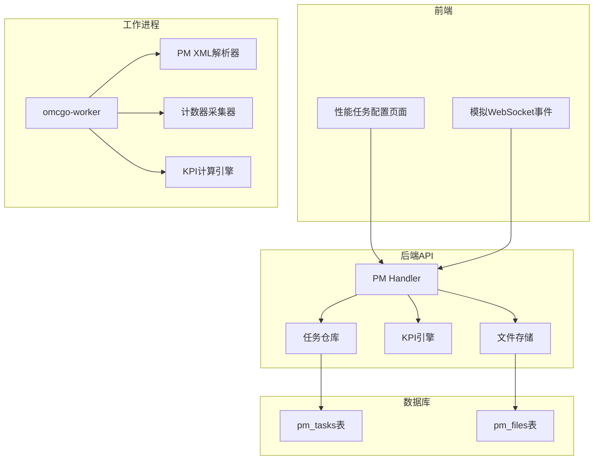
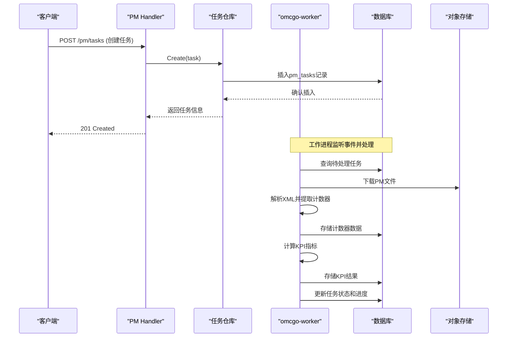
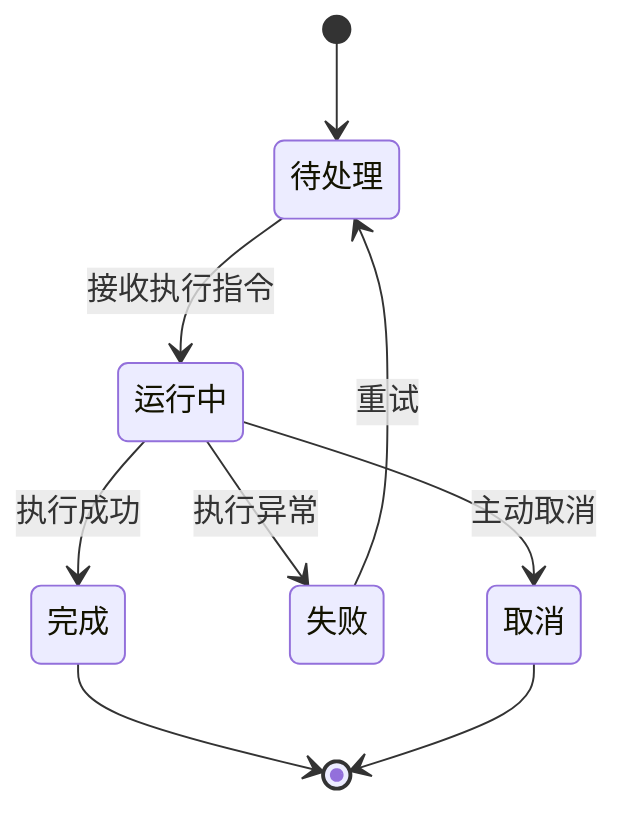
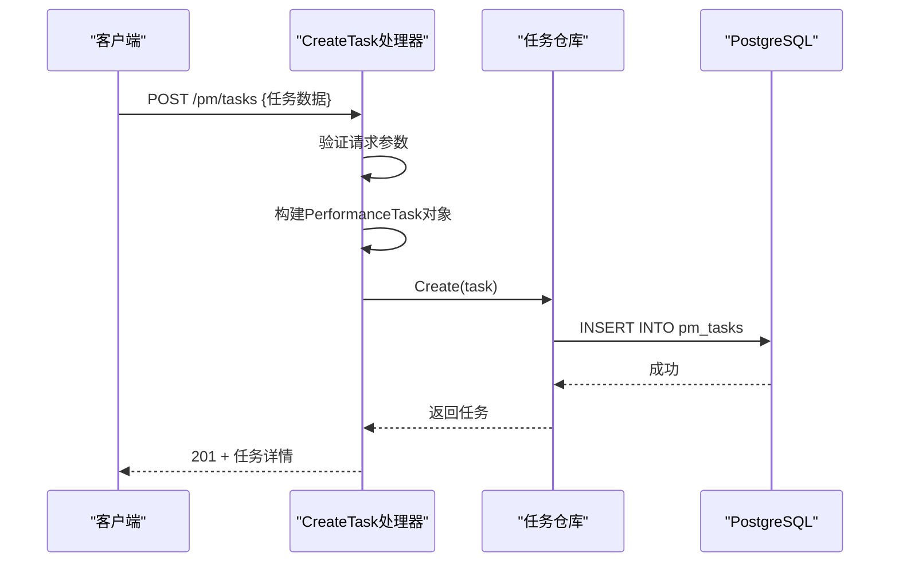
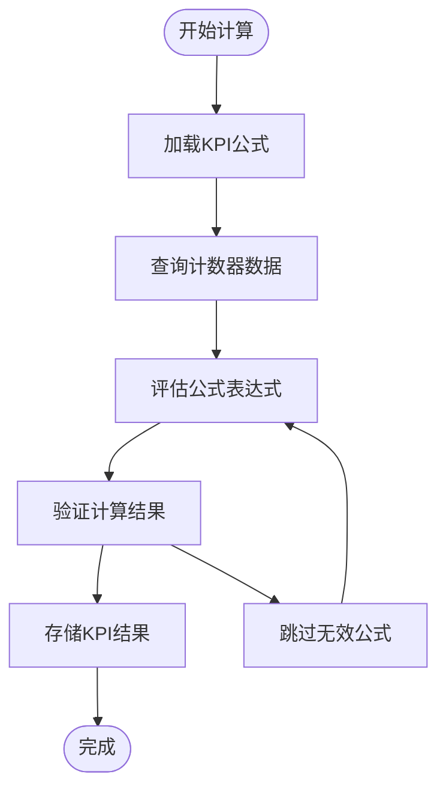
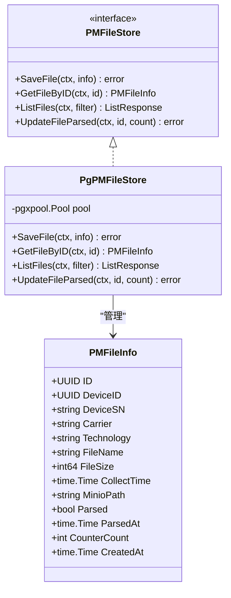
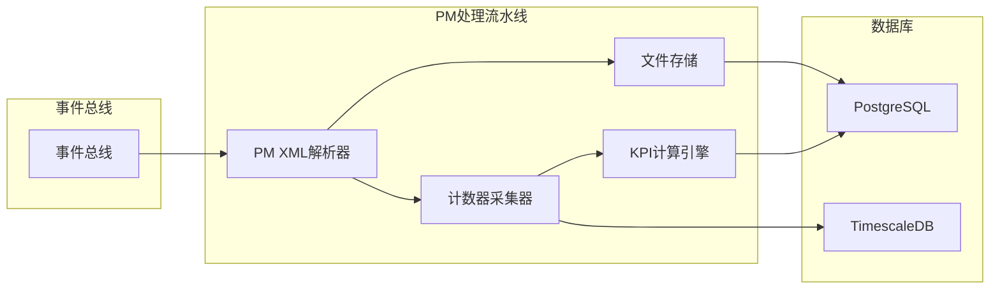
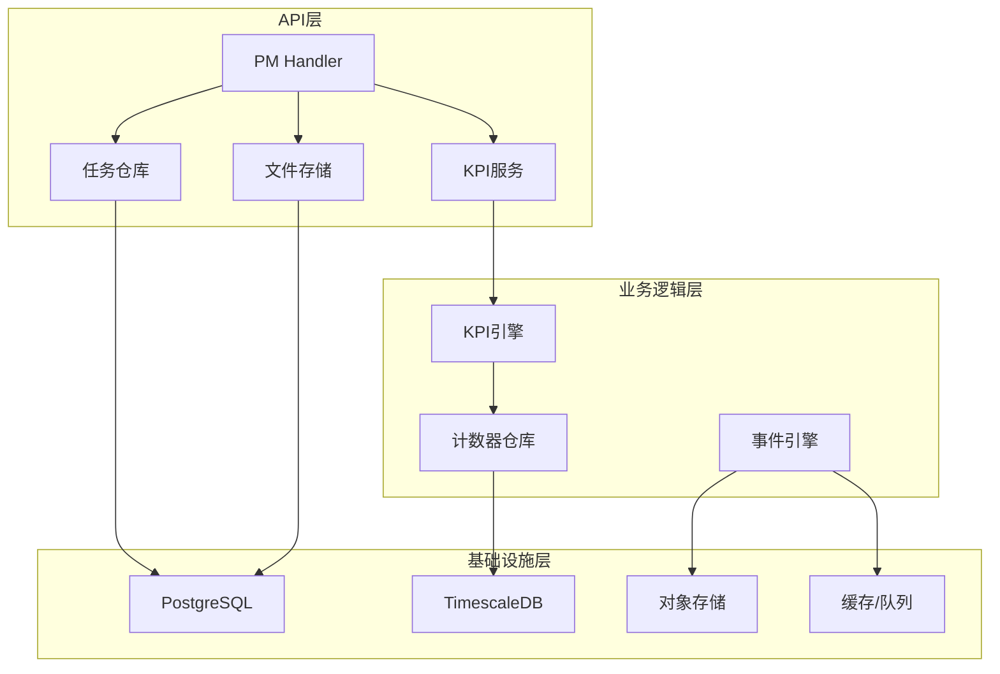

# 性能任务管理

<cite>
**本文档引用的文件**
- [task_model.go](file://omcgo/internal/pm/task_model.go)
- [pg_task_repository.go](file://omcgo/internal/pm/pg_task_repository.go)
- [handler.go](file://omcgo/internal/pm/handler.go)
- [000026_create_pm_tasks.up.sql](file://omcgo/migrations/000026_create_pm_tasks.up.sql)
- [engine.go](file://omcgo/internal/pm/kpi/engine.go)
- [file_store.go](file://omcgo/internal/pm/file_store.go)
- [pg_file_store.go](file://omcgo/internal/pm/pg_file_store.go)
- [main.go](file://omcgo/cmd/worker/main.go)
- [queue.go](file://omcgo/internal/acs/cmdqueue/queue.go)
- [index.tsx](file://omcmb/webcode/src/pages/performance/PerformanceTaskConfig/index.tsx)
- [performanceService.ts](file://omcmb/webcode/src/mock/services/performanceService.ts)
- [taskWebSocket.ts](file://omcmb/webcode/src/mock/websocket/taskWebSocket.ts)
- [06-data-pipeline.md](file://omcgo/docs/go-zero-design/06-data-pipeline.md)
</cite>

## 目录
1. [简介](#简介)
2. [项目结构](#项目结构)
3. [核心组件](#核心组件)
4. [架构概览](#架构概览)
5. [详细组件分析](#详细组件分析)
6. [依赖分析](#依赖分析)
7. [性能考虑](#性能考虑)
8. [故障排除指南](#故障排除指南)
9. [结论](#结论)
10. [附录](#附录)

## 简介
本文件为性能任务管理功能的全面技术文档，涵盖性能任务的创建、调度、执行和监控机制。文档详细解释了性能任务的生命周期管理、状态转换和错误处理流程，说明了任务配置参数、执行策略和资源分配机制，并包含任务队列管理、并发控制和优先级调度的实现细节。同时，文档阐述了任务执行结果的存储、查询和导出功能，提供了配置指南、监控方法和故障排除技巧，并包含具体的任务创建示例和API使用说明。

## 项目结构
性能任务管理功能主要分布在以下模块：
- 后端服务层：PM API处理器、任务仓库、KPI引擎、文件存储
- 数据库层：pm_tasks表、pm_files表及索引
- 工作进程：PM/XML解析器、计数器采集器、KPI计算引擎
- 前端界面：性能任务配置页面、模拟WebSocket事件

**图表来源**
- [handler.go:18-49](file://omcgo/internal/pm/handler.go#L18-L49)
- [main.go:70-144](file://omcgo/cmd/worker/main.go#L70-L144)
- [000026_create_pm_tasks.up.sql:1-22](file://omcgo/migrations/000026_create_pm_tasks.up.sql#L1-L22)

**章节来源**
- [handler.go:18-49](file://omcgo/internal/pm/handler.go#L18-L49)
- [main.go:28-68](file://omcgo/cmd/worker/main.go#L28-L68)

## 核心组件
性能任务管理由以下核心组件构成：

### 任务模型与状态
- 任务状态：pending（待处理）、running（运行中）、completed（已完成）、failed（失败）、cancelled（已取消）
- 任务类型：extraction（指标提取）、report（报表生成）、threshold-check（阈值检查）
- 关键字段：任务名称、设备序列号数组、KPI编码数组、粒度、时间范围、进度、创建者

### 任务仓库
- 提供任务的持久化操作：创建、列表查询
- 支持按状态和任务类型过滤
- 默认值处理：未设置时自动填充默认状态、任务类型和粒度

### API处理器
- 提供REST API端点：任务列表查询、任务创建、文件列表、文件下载
- 输入验证和错误处理
- 与任务仓库、文件存储、KPI引擎集成

**章节来源**
- [task_model.go:11-52](file://omcgo/internal/pm/task_model.go#L11-L52)
- [pg_task_repository.go:34-74](file://omcgo/internal/pm/pg_task_repository.go#L34-L74)
- [handler.go:263-321](file://omcgo/internal/pm/handler.go#L263-L321)

## 架构概览
性能任务管理采用分层架构，从前端到后端再到工作进程的完整链路如下：

**图表来源**
- [handler.go:298-321](file://omcgo/internal/pm/handler.go#L298-L321)
- [pg_task_repository.go:34-74](file://omcgo/internal/pm/pg_task_repository.go#L34-L74)
- [main.go:70-83](file://omcgo/cmd/worker/main.go#L70-L83)

## 详细组件分析

### 任务生命周期管理
性能任务从创建到完成经历完整的生命周期：

**图表来源**
- [task_model.go:14-20](file://omcgo/internal/pm/task_model.go#L14-L20)

### 任务创建与API交互
任务创建通过REST API完成，包含完整的请求验证和响应处理：

**图表来源**
- [handler.go:298-321](file://omcgo/internal/pm/handler.go#L298-L321)
- [pg_task_repository.go:34-74](file://omcgo/internal/pm/pg_task_repository.go#L34-L74)

**章节来源**
- [handler.go:298-321](file://omcgo/internal/pm/handler.go#L298-L321)
- [pg_task_repository.go:34-74](file://omcgo/internal/pm/pg_task_repository.go#L34-L74)

### KPI计算引擎
KPI计算引擎负责从原始计数器数据中计算各种性能指标：

**图表来源**
- [engine.go:88-157](file://omcgo/internal/pm/kpi/engine.go#L88-L157)

**章节来源**
- [engine.go:88-157](file://omcgo/internal/pm/kpi/engine.go#L88-L157)

### 文件存储与管理
PM文件存储采用分层架构，支持文件元数据管理和对象存储集成：

**图表来源**
- [file_store.go:11-42](file://omcgo/internal/pm/file_store.go#L11-L42)
- [pg_file_store.go:15-45](file://omcgo/internal/pm/pg_file_store.go#L15-L45)

**章节来源**
- [file_store.go:11-42](file://omcgo/internal/pm/file_store.go#L11-L42)
- [pg_file_store.go:25-121](file://omcgo/internal/pm/pg_file_store.go#L25-L121)

### 工作进程与任务执行
omcgo-worker作为后台执行器，负责处理PM文件解析、计数器采集和KPI计算：

**图表来源**
- [main.go:70-83](file://omcgo/cmd/worker/main.go#L70-L83)
- [06-data-pipeline.md:633-660](file://omcgo/docs/go-zero-design/06-data-pipeline.md#L633-L660)

**章节来源**
- [main.go:70-83](file://omcgo/cmd/worker/main.go#L70-L83)
- [06-data-pipeline.md:633-660](file://omcgo/docs/go-zero-design/06-data-pipeline.md#L633-L660)

## 依赖分析
性能任务管理涉及多个组件间的复杂依赖关系：

**图表来源**
- [handler.go:18-33](file://omcgo/internal/pm/handler.go#L18-L33)
- [main.go:70-144](file://omcgo/cmd/worker/main.go#L70-L144)

**章节来源**
- [handler.go:18-33](file://omcgo/internal/pm/handler.go#L18-L33)
- [main.go:70-144](file://omcgo/cmd/worker/main.go#L70-L144)

## 性能考虑
基于代码分析，性能任务管理在以下方面具有优化特性：

### 并发控制
- 工作进程池配置建议：PM解析4个工作者、MR解析2个工作者、KPI计算2个工作者
- 使用通道进行任务分发，避免阻塞
- 连接池复用数据库连接

### 数据库优化
- pm_tasks表建立状态和创建时间索引
- 使用JSONB字段存储动态配置
- 自动更新时间戳触发器

### 缓存策略
- Redis用于命令队列和事件发布订阅
- 前端使用Mock WebSocket模拟实时更新

**章节来源**
- [06-data-pipeline.md:633-660](file://omcgo/docs/go-zero-design/06-data-pipeline.md#L633-L660)
- [000026_create_pm_tasks.up.sql:15-16](file://omcgo/migrations/000026_create_pm_tasks.up.sql#L15-L16)

## 故障排除指南
针对性能任务管理中的常见问题提供排查指导：

### 任务创建失败
- 检查请求参数是否符合CreatePerformanceTaskRequest要求
- 验证数据库连接和权限
- 查看PostgreSQL错误日志

### 任务执行异常
- 检查omcgo-worker进程状态
- 验证MinIO对象存储连接
- 查看KPI计算引擎日志

### 数据查询问题
- 确认索引是否正确创建
- 检查时间范围参数格式
- 验证用户权限

**章节来源**
- [handler.go:298-321](file://omcgo/internal/pm/handler.go#L298-L321)
- [pg_task_repository.go:76-132](file://omcgo/internal/pm/pg_task_repository.go#L76-L132)

## 结论
性能任务管理功能通过清晰的分层架构和完善的生命周期管理，实现了从任务创建到结果导出的完整闭环。系统采用事件驱动的设计模式，结合数据库和对象存储，确保了高可用性和可扩展性。前端通过Mock WebSocket提供了实时监控体验，便于用户跟踪任务执行状态。

## 附录

### API使用说明
- 创建性能任务：POST /pm/tasks
- 查询任务列表：GET /pm/tasks
- 下载PM文件：GET /pm/files/:id/download

### 配置参数说明
- 任务名称：必填，任务的描述性名称
- 任务类型：extraction/report/threshold-check
- 设备序列号：JSON数组，支持多设备批量处理
- KPI编码：JSON数组，指定需要计算的指标
- 时间粒度：15min/30min/1h/1d
- 时间范围：JSON数组，包含开始和结束时间

### 监控方法
- 实时任务状态：通过WebSocket接收任务更新事件
- 历史任务查询：使用分页查询接口获取历史记录
- 性能指标：通过KPI接口获取计算结果

**章节来源**
- [handler.go:36-49](file://omcgo/internal/pm/handler.go#L36-L49)
- [index.tsx:1-32](file://omcmb/webcode/src/pages/performance/PerformanceTaskConfig/index.tsx#L1-L32)
- [performanceService.ts:100-152](file://omcmb/webcode/src/mock/services/performanceService.ts#L100-L152)
- [taskWebSocket.ts:47-197](file://omcmb/webcode/src/mock/websocket/taskWebSocket.ts#L47-L197)