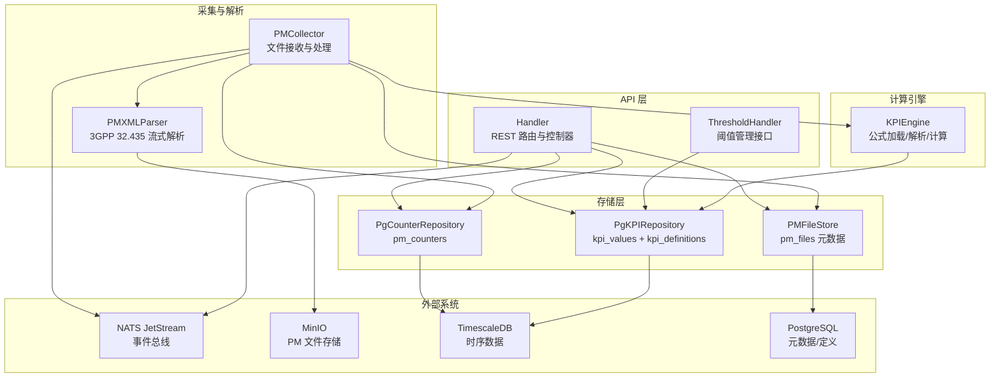
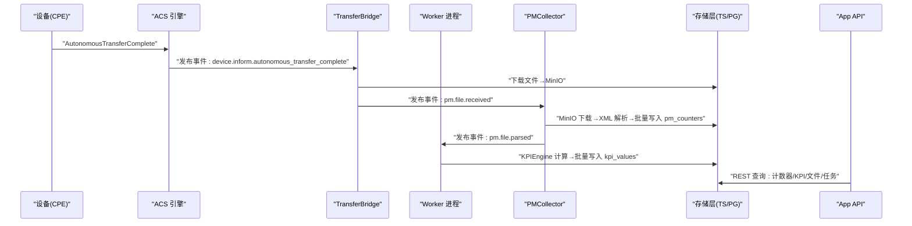
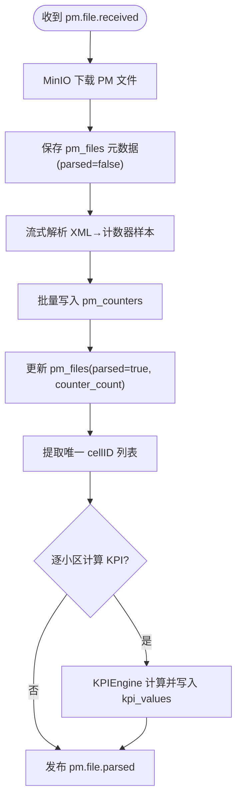
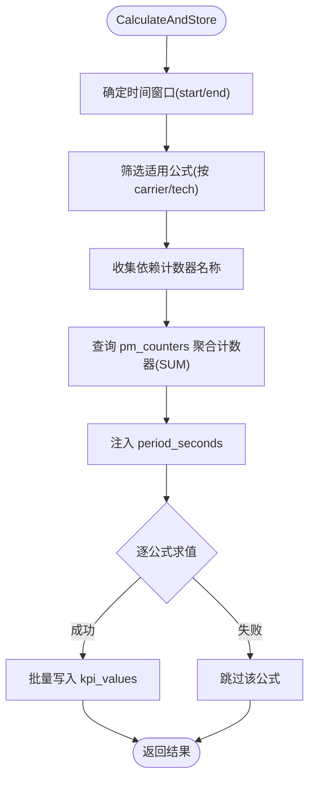
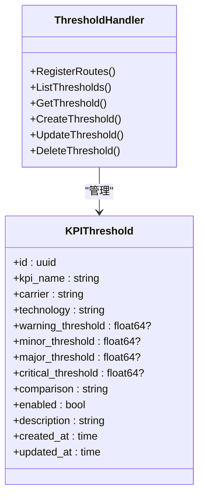
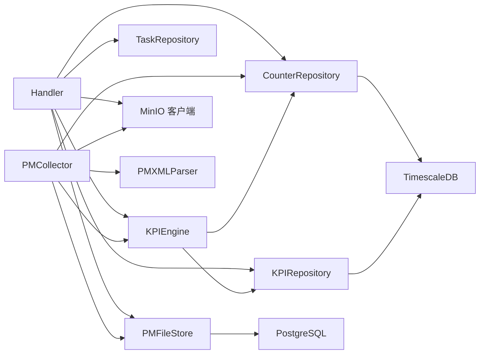

# 性能管理模块

<cite>
**本文引用的文件**
- [omcgo/internal/pm/handler.go](file://omcgo/internal/pm/handler.go)
- [omcgo/internal/pm/task_model.go](file://omcgo/internal/pm/task_model.go)
- [omcgo/internal/pm/threshold_model.go](file://omcgo/internal/pm/threshold_model.go)
- [omcgo/internal/pm/file_store.go](file://omcgo/internal/pm/file_store.go)
- [omcgo/internal/pm/collector/collector.go](file://omcgo/internal/pm/collector/collector.go)
- [omcgo/internal/pm/kpi/engine.go](file://omcgo/internal/pm/kpi/engine.go)
- [omcgo/internal/pm/aggregation/aggregator.go](file://omcgo/internal/pm/aggregation/aggregator.go)
- [omcgo/internal/pm/threshold_handler.go](file://omcgo/internal/pm/threshold_handler.go)
- [omcgo/internal/pm/counter/pg_repository.go](file://omcgo/internal/pm/counter/pg_repository.go)
- [omcgo/internal/pm/kpi/pg_repository.go](file://omcgo/internal/pm/kpi/pg_repository.go)
- [omcgo/migrations/000010_create_pm_counters.up.sql](file://omcgo/migrations/000010_create_pm_counters.up.sql)
- [omcgo/migrations/000011_create_kpi_tables.up.sql](file://omcgo/migrations/000011_create_kpi_tables.up.sql)
- [omcgo/migrations/000034_create_pm_files.up.sql](file://omcgo/migrations/000034_create_pm_files.up.sql)
- [omcgo/docs/design/pm-kpi-flow.md](file://omcgo/docs/design/pm-kpi-flow.md)
</cite>

## 目录
1. [简介](#简介)
2. [项目结构](#项目结构)
3. [核心组件](#核心组件)
4. [架构总览](#架构总览)
5. [详细组件分析](#详细组件分析)
6. [依赖关系分析](#依赖关系分析)
7. [性能考量](#性能考量)
8. [故障排查指南](#故障排查指南)
9. [结论](#结论)
10. [附录](#附录)

## 简介
本文件面向性能管理模块，系统性阐述 PM 数据采集流程、KPI 计算引擎算法、阈值监控系统与性能文件存储机制。内容覆盖从设备上传 PM XML 文件，经 ACS 事件驱动、Worker 异步处理，到计数器入库、KPI 公式计算、连续聚合与 REST 查询接口的完整链路；同时给出任务调度、报表生成与导出、性能优化与监控告警配置的最佳实践。

## 项目结构
性能管理模块位于 omcgo 内部，围绕 PM 数据处理形成“事件驱动 + 异步 Worker”的流水线，主要文件组织如下：
- API 层：REST 路由与控制器，提供计数器、KPI、文件、任务、阈值等查询与管理接口
- 采集与解析：PM 文件接收、MinIO 存储、XML 流式解析、计数器入库
- 计算引擎：KPI 公式加载、解析与求值、批量写入 KPI 结果
- 存储层：TimescaleDB 超表与连续聚合、PostgreSQL 元数据表
- 任务与阈值：任务模型与阈值模型、阈值规则配置与检测



图表来源
- [omcgo/internal/pm/handler.go:35-49](file://omcgo/internal/pm/handler.go#L35-L49)
- [omcgo/internal/pm/collector/collector.go:55-63](file://omcgo/internal/pm/collector/collector.go#L55-L63)
- [omcgo/internal/pm/kpi/engine.go:36-51](file://omcgo/internal/pm/kpi/engine.go#L36-L51)
- [omcgo/internal/pm/counter/pg_repository.go:15-23](file://omcgo/internal/pm/counter/pg_repository.go#L15-L23)
- [omcgo/internal/pm/kpi/pg_repository.go:16-24](file://omcgo/internal/pm/kpi/pg_repository.go#L16-L24)
- [omcgo/internal/pm/file_store.go:36-42](file://omcgo/internal/pm/file_store.go#L36-L42)

章节来源
- [omcgo/docs/design/pm-kpi-flow.md:1-737](file://omcgo/docs/design/pm-kpi-flow.md#L1-L737)

## 核心组件
- Handler：提供 REST API，支持计数器查询、聚合查询、KPI 查询与定义、按需 KPI 计算、PM 文件列表与下载、PM 任务的创建与查询
- PMCollector：订阅 PM 文件接收事件，下载 PM XML、流式解析、批量写入计数器、更新文件元数据、触发 KPI 计算并发布解析完成事件
- KPIEngine：加载运营商适配器中的 KPI 公式，按设备/小区/时间窗口查询计数器并计算 KPI，批量写入结果
- 存储层：
  - PgCounterRepository：pm_counters（TimescaleDB 超表）的批量写入与查询
  - PgKPIRepository：kpi_values 与 kpi_definitions 的读写与同步
  - PMFileStore：pm_files 元数据的保存、查询与解析状态更新
- 阈值系统：KPIThreshold 模型与阈值管理 API，支持增删改查与启用/禁用控制
- 任务系统：PerformanceTask 模型与任务创建接口，支持提取、报表、阈值检查等类型

章节来源
- [omcgo/internal/pm/handler.go:18-49](file://omcgo/internal/pm/handler.go#L18-L49)
- [omcgo/internal/pm/collector/collector.go:28-53](file://omcgo/internal/pm/collector/collector.go#L28-L53)
- [omcgo/internal/pm/kpi/engine.go:27-51](file://omcgo/internal/pm/kpi/engine.go#L27-L51)
- [omcgo/internal/pm/counter/pg_repository.go:15-23](file://omcgo/internal/pm/counter/pg_repository.go#L15-L23)
- [omcgo/internal/pm/kpi/pg_repository.go:16-24](file://omcgo/internal/pm/kpi/pg_repository.go#L16-L24)
- [omcgo/internal/pm/file_store.go:36-42](file://omcgo/internal/pm/file_store.go#L36-L42)
- [omcgo/internal/pm/threshold_model.go:10-25](file://omcgo/internal/pm/threshold_model.go#L10-L25)
- [omcgo/internal/pm/task_model.go:31-45](file://omcgo/internal/pm/task_model.go#L31-L45)

## 架构总览
性能管理采用事件驱动的异步流水线，跨 ACS 与 Worker 两个进程单元，通过 NATS JetStream 串联各阶段，实现高吞吐、可扩展的 PM 数据处理。



图表来源
- [omcgo/docs/design/pm-kpi-flow.md:43-61](file://omcgo/docs/design/pm-kpi-flow.md#L43-L61)
- [omcgo/internal/pm/collector/collector.go:65-148](file://omcgo/internal/pm/collector/collector.go#L65-L148)
- [omcgo/internal/pm/handler.go:35-49](file://omcgo/internal/pm/handler.go#L35-L49)

章节来源
- [omcgo/docs/design/pm-kpi-flow.md:1-737](file://omcgo/docs/design/pm-kpi-flow.md#L1-L737)

## 详细组件分析

### 数据采集与文件处理
- 事件触发：设备上传 PM XML 后，ACS 接收 AutonomousTransferComplete 并发布事件
- 文件下载与分类：TransferBridge 根据 FileType/文件名将 PM/MR/Log 分类，下载至 MinIO
- PMCollector 订阅 pm.file.received，下载 XML、解析为计数器样本、批量写入 pm_counters，并更新 pm_files 元数据
- KPI 计算：遍历唯一 cellID，调用 KPIEngine 计算并写入 kpi_values，发布 pm.file.parsed



图表来源
- [omcgo/internal/pm/collector/collector.go:65-148](file://omcgo/internal/pm/collector/collector.go#L65-L148)

章节来源
- [omcgo/internal/pm/collector/collector.go:28-161](file://omcgo/internal/pm/collector/collector.go#L28-L161)

### KPI 计算引擎
- 公式加载：KPIEngine 启动时从运营商注册表加载 KPI 定义，解析为 Formula 对象并缓存
- 计算流程：确定时间窗口（通常为 15 分钟），收集适用公式依赖的计数器名称，查询 pm_counters 的聚合值，注入 period_seconds，逐公式求值，批量写入 kpi_values
- 运营商适配：不同运营商与制式（如 CMCC/LTE、CMCC/NR）拥有独立 KPI 定义集合



图表来源
- [omcgo/internal/pm/kpi/engine.go:88-157](file://omcgo/internal/pm/kpi/engine.go#L88-L157)

章节来源
- [omcgo/internal/pm/kpi/engine.go:27-168](file://omcgo/internal/pm/kpi/engine.go#L27-L168)

### 阈值监控系统
- 配置模型：KPIThreshold 支持为特定 KPI 设置多级别阈值（预警/轻微/严重/致命）、比较方式（如大于/小于）、启用状态与描述
- API 管理：提供列表、详情、创建、更新、删除接口；支持按 KPI 名称、运营商、制式、启用状态过滤
- 使用场景：结合 KPI 结果与阈值规则进行告警判定（可与告警引擎联动）



图表来源
- [omcgo/internal/pm/threshold_model.go:10-25](file://omcgo/internal/pm/threshold_model.go#L10-L25)
- [omcgo/internal/pm/threshold_handler.go:13-34](file://omcgo/internal/pm/threshold_handler.go#L13-L34)

章节来源
- [omcgo/internal/pm/threshold_model.go:10-63](file://omcgo/internal/pm/threshold_model.go#L10-L63)
- [omcgo/internal/pm/threshold_handler.go:13-199](file://omcgo/internal/pm/threshold_handler.go#L13-L199)

### 性能文件存储机制
- MinIO 存储：PM 文件按日期与设备序列号分区存放，便于检索与归档
- 元数据表：pm_files 记录设备 ID/SN、运营商/制式、文件名、大小、采集时间、MinIO 路径、解析状态与计数器数量
- 数据生命周期：TimescaleDB 对 pm_counters 进行压缩与保留策略，kpi_values 与中间物化视图按超表策略管理

```mermaid
erDiagram
PM_FILES {
uuid id PK
uuid device_id
string device_sn
string carrier
string technology
string file_name
bigint file_size
timestamptz collect_time
string minio_path
bool parsed
timestamptz parsed_at
int counter_count
timestamptz created_at
}
PM_COUNTERS {
timestamptz time
uuid device_id
string cell_id
string counter_group
string counter_name
double precision counter_value
smallint granularity
}
KPI_VALUES {
timestamptz time
uuid device_id
string cell_id
string kpi_name
double precision kpi_value
string carrier
string technology
}
PM_FILES ||--o{ PM_COUNTERS : "记录→解析"
PM_FILES ||--o{ KPI_VALUES : "触发→计算"
```

图表来源
- [omcgo/migrations/000034_create_pm_files.up.sql:1-19](file://omcgo/migrations/000034_create_pm_files.up.sql#L1-L19)
- [omcgo/migrations/000010_create_pm_counters.up.sql:1-28](file://omcgo/migrations/000010_create_pm_counters.up.sql#L1-L28)
- [omcgo/migrations/000011_create_kpi_tables.up.sql:15-35](file://omcgo/migrations/000011_create_kpi_tables.up.sql#L15-L35)

章节来源
- [omcgo/internal/pm/file_store.go:11-42](file://omcgo/internal/pm/file_store.go#L11-L42)
- [omcgo/migrations/000034_create_pm_files.up.sql:1-19](file://omcgo/migrations/000034_create_pm_files.up.sql#L1-L19)
- [omcgo/migrations/000010_create_pm_counters.up.sql:1-28](file://omcgo/migrations/000010_create_pm_counters.up.sql#L1-L28)
- [omcgo/migrations/000011_create_kpi_tables.up.sql:1-56](file://omcgo/migrations/000011_create_kpi_tables.up.sql#L1-L56)

### REST API 与报表导出
- 计数器查询：支持按设备/小区/计数器组/计数器名/时间范围过滤，支持聚合视图查询
- KPI 查询：支持按 KPI 名称、运营商、制式、时间范围过滤
- KPI 定义：按运营商/制式返回可用公式定义
- 按需计算：POST /pm/kpi/calculate 指定设备、小区、时间范围触发计算
- 文件管理：列出 PM 文件、下载原始 XML 文件
- 任务管理：创建/查询 PM 任务（提取、报表、阈值检查）

章节来源
- [omcgo/internal/pm/handler.go:35-49](file://omcgo/internal/pm/handler.go#L35-L49)
- [omcgo/internal/pm/handler.go:61-102](file://omcgo/internal/pm/handler.go#L61-L102)
- [omcgo/internal/pm/handler.go:104-137](file://omcgo/internal/pm/handler.go#L104-L137)
- [omcgo/internal/pm/handler.go:150-192](file://omcgo/internal/pm/handler.go#L150-L192)
- [omcgo/internal/pm/handler.go:194-218](file://omcgo/internal/pm/handler.go#L194-L218)
- [omcgo/internal/pm/handler.go:229-261](file://omcgo/internal/pm/handler.go#L229-L261)
- [omcgo/internal/pm/handler.go:332-367](file://omcgo/internal/pm/handler.go#L332-L367)
- [omcgo/internal/pm/handler.go:369-403](file://omcgo/internal/pm/handler.go#L369-L403)
- [omcgo/internal/pm/handler.go:271-296](file://omcgo/internal/pm/handler.go#L271-L296)
- [omcgo/internal/pm/handler.go:298-321](file://omcgo/internal/pm/handler.go#L298-L321)

### 任务调度与执行
- 任务类型：extraction（提取）、report（报表）、threshold-check（阈值检查）
- 任务状态：pending、running、completed、failed、cancelled
- 任务请求体：包含任务名称、类型、设备序列号列表、KPI 编码、粒度、时间范围、创建人等字段
- 执行流程：由 Worker 订阅事件并驱动具体任务（如触发 PM 文件采集、生成报表、执行阈值检查）

章节来源
- [omcgo/internal/pm/task_model.go:11-64](file://omcgo/internal/pm/task_model.go#L11-L64)

## 依赖关系分析
- Handler 依赖 CounterRepository、KPIRepository、KPIEngine、TaskRepository、PMFileStore、MinIO 客户端
- PMCollector 依赖 MinIO 客户端、PMXMLParser、CounterRepository、KPIEngine、PMFileStore、EventBus
- KPIEngine 依赖 CounterRepository、KPIRepository、CarrierRegistry
- 存储层分别对接 TimescaleDB 与 PostgreSQL，提供批量写入与查询能力
- Aggregator 用于手动刷新连续聚合视图，提升查询性能



图表来源
- [omcgo/internal/pm/handler.go:18-33](file://omcgo/internal/pm/handler.go#L18-L33)
- [omcgo/internal/pm/collector/collector.go:28-53](file://omcgo/internal/pm/collector/collector.go#L28-L53)
- [omcgo/internal/pm/kpi/engine.go:27-51](file://omcgo/internal/pm/kpi/engine.go#L27-L51)
- [omcgo/internal/pm/counter/pg_repository.go:15-23](file://omcgo/internal/pm/counter/pg_repository.go#L15-L23)
- [omcgo/internal/pm/kpi/pg_repository.go:16-24](file://omcgo/internal/pm/kpi/pg_repository.go#L16-L24)
- [omcgo/internal/pm/file_store.go:36-42](file://omcgo/internal/pm/file_store.go#L36-L42)

章节来源
- [omcgo/internal/pm/handler.go:18-33](file://omcgo/internal/pm/handler.go#L18-L33)
- [omcgo/internal/pm/collector/collector.go:28-53](file://omcgo/internal/pm/collector/collector.go#L28-L53)
- [omcgo/internal/pm/kpi/engine.go:27-51](file://omcgo/internal/pm/kpi/engine.go#L27-L51)
- [omcgo/internal/pm/aggregation/aggregator.go:11-32](file://omcgo/internal/pm/aggregation/aggregator.go#L11-L32)

## 性能考量
- 流式解析：PM XML 采用 encoding/xml Decoder，避免大文件全量加载内存
- 批量写入：使用 pgx.CopyFrom 批量插入，显著提升写入吞吐
- TimescaleDB 超表：pm_counters 与 kpi_values 作为超表，按天分块、压缩与保留策略，降低存储与查询成本
- 连续聚合：pm_counters_hourly 物化视图预计算小时粒度聚合，加速仪表盘与报表查询
- 事件驱动：NATS JetStream 支持 Queue Group 水平扩展，保障幂等与负载均衡
- 索引与分区：针对设备、计数器维度建立索引，配合 TimescaleDB 自动分区与压缩

章节来源
- [omcgo/docs/design/pm-kpi-flow.md:703-713](file://omcgo/docs/design/pm-kpi-flow.md#L703-L713)
- [omcgo/migrations/000010_create_pm_counters.up.sql:12-27](file://omcgo/migrations/000010_create_pm_counters.up.sql#L12-L27)
- [omcgo/migrations/000011_create_kpi_tables.up.sql:37-55](file://omcgo/migrations/000011_create_kpi_tables.up.sql#L37-L55)

## 故障排查指南
- 文件未解析：检查 pm_files 中 parsed 字段与 counter_count 是否更新，确认 MinIO 路径是否存在
- 计数器缺失：核对 PM XML 中计数器名称是否与公式依赖一致，确认解析是否成功写入 pm_counters
- KPI 计算失败：查看 KPIEngine 日志，确认时间窗口与计数器聚合查询是否正确，关注缺失计数器或除零错误
- 查询性能差：确认连续聚合是否刷新，必要时调用 Aggregator.RefreshContinuousAggregates
- API 返回错误：检查 Handler 中参数绑定与校验逻辑，确保设备 ID、时间格式、枚举值合法

章节来源
- [omcgo/internal/pm/collector/collector.go:86-127](file://omcgo/internal/pm/collector/collector.go#L86-L127)
- [omcgo/internal/pm/kpi/engine.go:88-130](file://omcgo/internal/pm/kpi/engine.go#L88-L130)
- [omcgo/internal/pm/aggregation/aggregator.go:22-31](file://omcgo/internal/pm/aggregation/aggregator.go#L22-L31)
- [omcgo/internal/pm/handler.go:61-102](file://omcgo/internal/pm/handler.go#L61-L102)

## 结论
性能管理模块通过事件驱动与异步 Worker 实现高吞吐 PM 数据处理，结合 TimescaleDB 超表与连续聚合，提供高效的数据存储与查询能力。KPI 公式引擎支持运营商与制式适配，阈值系统提供灵活的告警配置入口。整体架构具备良好的扩展性与可维护性，适合大规模网管场景。

## 附录

### API 使用示例（路径指引）
- 查询计数器样本：GET /pm/counters（支持 device_id、cell_id、counter_group、counter_name、start_time、end_time）
  - 参考：[omcgo/internal/pm/handler.go:61-102](file://omcgo/internal/pm/handler.go#L61-L102)
- 查询小时聚合：GET /pm/counters/aggregated（支持 device_id、cell_id、counter_group、start_time、end_time）
  - 参考：[omcgo/internal/pm/handler.go:104-137](file://omcgo/internal/pm/handler.go#L104-L137)
- 查询 KPI 结果：GET /pm/kpi（支持 device_id、cell_id、kpi_name、carrier、technology、start_time、end_time）
  - 参考：[omcgo/internal/pm/handler.go:150-192](file://omcgo/internal/pm/handler.go#L150-L192)
- 查询 KPI 定义：GET /pm/kpi/definitions（支持 carrier、technology）
  - 参考：[omcgo/internal/pm/handler.go:194-218](file://omcgo/internal/pm/handler.go#L194-L218)
- 按需计算 KPI：POST /pm/kpi/calculate（请求体包含 device_id、cell_id、start_time、end_time、carrier、technology）
  - 参考：[omcgo/internal/pm/handler.go:229-261](file://omcgo/internal/pm/handler.go#L229-L261)
- 列出 PM 文件：GET /pm/files（支持 device_id、start_time、end_time）
  - 参考：[omcgo/internal/pm/handler.go:332-367](file://omcgo/internal/pm/handler.go#L332-L367)
- 下载 PM 文件：GET /pm/files/:id/download
  - 参考：[omcgo/internal/pm/handler.go:369-403](file://omcgo/internal/pm/handler.go#L369-L403)
- 创建 PM 任务：POST /pm/tasks（请求体包含任务名称、类型、设备序列号、KPI 编码、粒度、时间范围、创建人）
  - 参考：[omcgo/internal/pm/handler.go:298-321](file://omcgo/internal/pm/handler.go#L298-L321)
- 列出任务：GET /pm/tasks（支持 status、task_type）
  - 参考：[omcgo/internal/pm/handler.go:271-296](file://omcgo/internal/pm/handler.go#L271-L296)
- 阈值管理：
  - 列表：GET /thresholds（支持 kpi_name、carrier、technology、enabled）
    - 参考：[omcgo/internal/pm/threshold_handler.go:44-74](file://omcgo/internal/pm/threshold_handler.go#L44-L74)
  - 新增：POST /thresholds（请求体包含 KPI 名称、运营商、制式、各级阈值、比较方式、启用状态、描述）
    - 参考：[omcgo/internal/pm/threshold_handler.go:92-125](file://omcgo/internal/pm/threshold_handler.go#L92-L125)
  - 更新：PUT /thresholds/:id（支持部分字段更新）
    - 参考：[omcgo/internal/pm/threshold_handler.go:127-183](file://omcgo/internal/pm/threshold_handler.go#L127-L183)
  - 删除：DELETE /thresholds/:id
    - 参考：[omcgo/internal/pm/threshold_handler.go:185-199](file://omcgo/internal/pm/threshold_handler.go#L185-L199)

### 数据库表结构（路径指引）
- pm_counters：TimescaleDB 超表，计数器原始样本
  - 参考：[omcgo/migrations/000010_create_pm_counters.up.sql:1-28](file://omcgo/migrations/000010_create_pm_counters.up.sql#L1-L28)
- kpi_values：TimescaleDB 超表，KPI 计算结果
  - 参考：[omcgo/migrations/000011_create_kpi_tables.up.sql:15-35](file://omcgo/migrations/000011_create_kpi_tables.up.sql#L15-L35)
- kpi_definitions：KPI 公式定义表
  - 参考：[omcgo/migrations/000011_create_kpi_tables.up.sql:1-14](file://omcgo/migrations/000011_create_kpi_tables.up.sql#L1-L14)
- pm_files：PM 文件元数据表
  - 参考：[omcgo/migrations/000034_create_pm_files.up.sql:1-19](file://omcgo/migrations/000034_create_pm_files.up.sql#L1-L19)