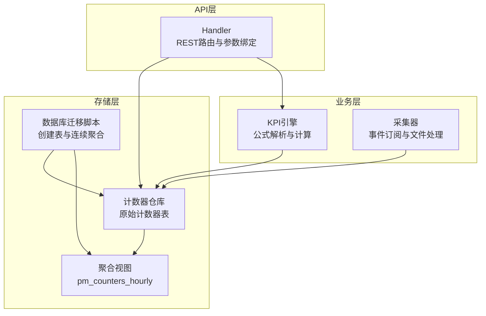
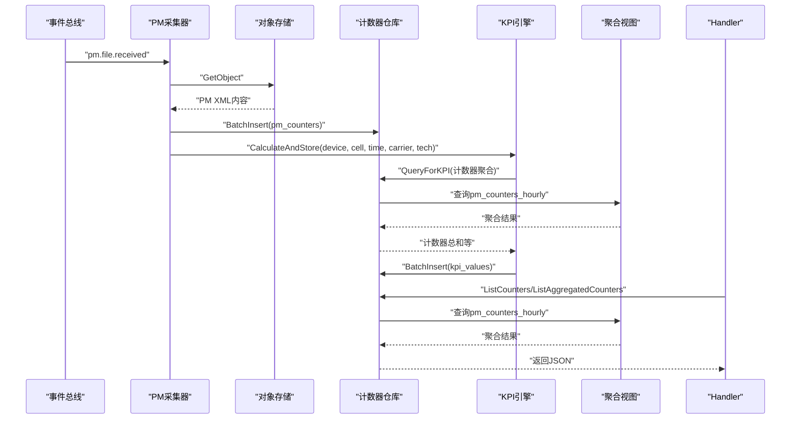
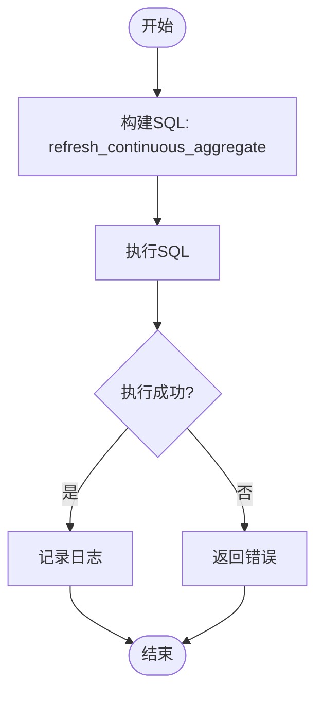
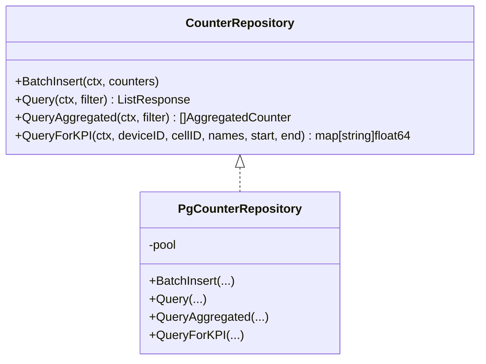
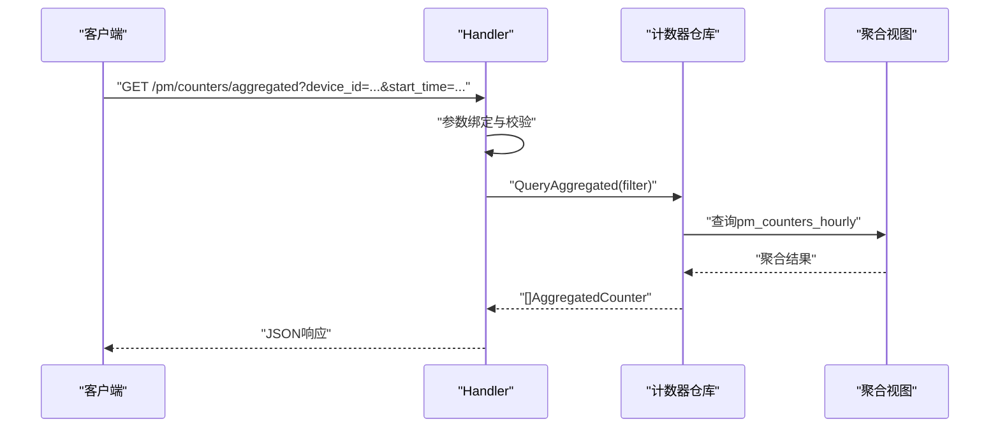
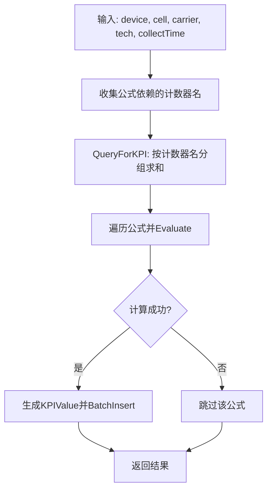
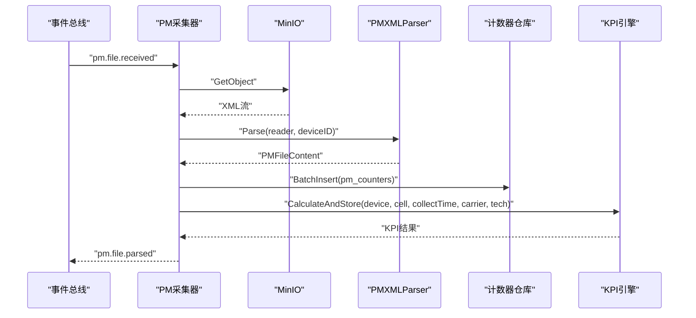
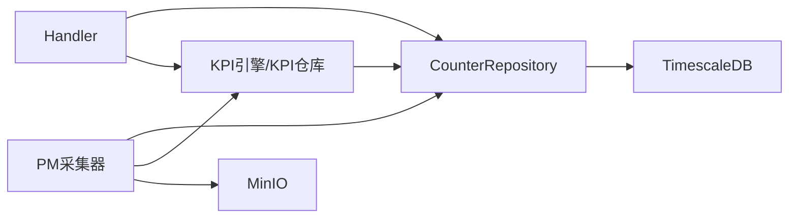

# 计数器聚合管理

<cite>
**本文引用的文件**
- [aggregator.go](file://omcgo/internal/pm/aggregation/aggregator.go)
- [repository.go](file://omcgo/internal/pm/counter/repository.go)
- [pg_repository.go](file://omcgo/internal/pm/counter/pg_repository.go)
- [handler.go](file://omcgo/internal/pm/handler.go)
- [000010_create_pm_counters.up.sql](file://omcgo/migrations/000010_create_pm_counters.up.sql)
- [000011_create_kpi_tables.up.sql](file://omcgo/migrations/000011_create_kpi_tables.up.sql)
- [pm.go](file://omcgo/internal/core/model/pm.go)
- [engine.go](file://omcgo/internal/pm/kpi/engine.go)
- [collector.go](file://omcgo/internal/pm/collector/collector.go)
- [parser.go](file://omcgo/internal/pm/collector/parser.go)
- [aggregator_test.go](file://omcgo/internal/pm/aggregation/aggregator_test.go)
</cite>

## 目录
1. [简介](#简介)
2. [项目结构](#项目结构)
3. [核心组件](#核心组件)
4. [架构总览](#架构总览)
5. [详细组件分析](#详细组件分析)
6. [依赖分析](#依赖分析)
7. [性能考虑](#性能考虑)
8. [故障排查指南](#故障排查指南)
9. [结论](#结论)
10. [附录](#附录)

## 简介
本文件面向“计数器聚合管理”功能，系统性阐述PM（性能测量）计数器在TimescaleDB中的聚合算法、时间窗口管理、数据汇总机制与查询路径。重点覆盖：
- 聚合策略：基于连续聚合视图的小时级滚动聚合
- 时间窗口：以bucket为单位的时间分桶与过滤
- 数据汇总：按设备、小区、计数器组与名称进行多维聚合
- 批量处理：从PM文件到计数器入库、KPI计算与存储的完整链路
- 配置与一致性：TimescaleDB扩展、压缩与保留策略、查询一致性保障
- 监控与排障：关键指标、常见问题定位与修复建议

## 项目结构
PM聚合相关代码主要位于以下模块：
- 聚合层：内部使用TimescaleDB连续聚合视图，提供手动刷新能力
- 存储层：基于PostgreSQL/ TimescaleDB的计数器表与聚合视图表
- 查询层：统一的REST API，支持原始计数器与聚合计数器查询
- 解析与采集：PM XML解析、文件接收事件驱动、批量写入与KPI计算
- 模型层：PM计数器与KPI值的数据结构定义



**图表来源**
- [handler.go:35-49](file://omcgo/internal/pm/handler.go#L35-L49)
- [engine.go:88-130](file://omcgo/internal/pm/kpi/engine.go#L88-L130)
- [collector.go:55-63](file://omcgo/internal/pm/collector/collector.go#L55-L63)
- [pg_repository.go:114-158](file://omcgo/internal/pm/counter/pg_repository.go#L114-L158)
- [000010_create_pm_counters.up.sql:1-28](file://omcgo/migrations/000010_create_pm_counters.up.sql#L1-L28)
- [000011_create_kpi_tables.up.sql:37-56](file://omcgo/migrations/000011_create_kpi_tables.up.sql#L37-L56)

**章节来源**
- [handler.go:35-49](file://omcgo/internal/pm/handler.go#L35-L49)
- [pg_repository.go:114-158](file://omcgo/internal/pm/counter/pg_repository.go#L114-L158)
- [000010_create_pm_counters.up.sql:1-28](file://omcgo/migrations/000010_create_pm_counters.up.sql#L1-L28)
- [000011_create_kpi_tables.up.sql:37-56](file://omcgo/migrations/000011_create_kpi_tables.up.sql#L37-L56)

## 核心组件
- 聚合器（Aggregator）
  - 负责调用TimescaleDB的连续聚合刷新过程，确保聚合视图与原始数据保持一致
  - 提供手动刷新接口，便于运维或批处理场景触发
- 计数器仓库（CounterRepository）
  - 定义原始计数器与聚合计数器的查询接口
  - 支持批量插入、条件过滤、排序与分页
- Handler（REST）
  - 对外暴露原始计数器查询与聚合计数器查询的HTTP接口
  - 统一参数绑定与错误处理
- KPI引擎（KPIEngine）
  - 加载并解析各运营商/制式下的KPI公式
  - 基于计数器聚合结果计算KPI并持久化
- 采集器（PMCollector）
  - 订阅PM文件到达事件，下载、解析、批量入库，并触发KPI计算
- 模型（PMCounter/KPIValue）
  - 定义计数器与KPI的数据结构，包括粒度（分钟）

**章节来源**
- [aggregator.go:11-31](file://omcgo/internal/pm/aggregation/aggregator.go#L11-L31)
- [repository.go:11-42](file://omcgo/internal/pm/counter/repository.go#L11-L42)
- [handler.go:35-49](file://omcgo/internal/pm/handler.go#L35-L49)
- [engine.go:27-51](file://omcgo/internal/pm/kpi/engine.go#L27-L51)
- [collector.go:28-53](file://omcgo/internal/pm/collector/collector.go#L28-L53)
- [pm.go:9-29](file://omcgo/internal/core/model/pm.go#L9-L29)

## 架构总览
PM计数器从采集到聚合的关键流程如下：



**图表来源**
- [collector.go:65-148](file://omcgo/internal/pm/collector/collector.go#L65-L148)
- [pg_repository.go:114-158](file://omcgo/internal/pm/counter/pg_repository.go#L114-L158)
- [engine.go:132-157](file://omcgo/internal/pm/kpi/engine.go#L132-L157)
- [handler.go:104-137](file://omcgo/internal/pm/handler.go#L104-L137)
- [000011_create_kpi_tables.up.sql:37-56](file://omcgo/migrations/000011_create_kpi_tables.up.sql#L37-L56)

## 详细组件分析

### 聚合器（Aggregator）
- 职责
  - 通过调用TimescaleDB的连续聚合刷新过程，确保聚合视图pm_counters_hourly与原始表pm_counters在指定时间窗口内一致
  - 提供手动刷新入口，便于批处理或运维干预
- 关键点
  - 使用原生SQL调用refresh_continuous_aggregate，限定刷新窗口为最近两小时
  - 刷新成功后记录日志，便于监控与审计
- 测试现状
  - 单元测试仅覆盖构造函数与字段初始化，连续聚合刷新需集成测试环境验证



**图表来源**
- [aggregator.go:22-31](file://omcgo/internal/pm/aggregation/aggregator.go#L22-L31)
- [aggregator_test.go:10-13](file://omcgo/internal/pm/aggregation/aggregator_test.go#L10-L13)

**章节来源**
- [aggregator.go:11-31](file://omcgo/internal/pm/aggregation/aggregator.go#L11-L31)
- [aggregator_test.go:10-32](file://omcgo/internal/pm/aggregation/aggregator_test.go#L10-L32)

### 计数器仓库与聚合查询
- 原始计数器查询
  - 支持按设备、小区、计数器组、计数器名、时间范围过滤
  - 支持排序与分页，先COUNT再取数据，保证分页一致性
- 聚合计数器查询
  - 查询pm_counters_hourly视图，按bucket分桶返回sum/avg/min/max/sample_count
  - 默认限制最多1000条，避免大范围扫描
- KPI专用查询
  - 按计数器名分组求和，返回计数器名到总值的映射，并附加时间段秒数



**图表来源**
- [repository.go:36-42](file://omcgo/internal/pm/counter/repository.go#L36-L42)
- [pg_repository.go:15-23](file://omcgo/internal/pm/counter/pg_repository.go#L15-L23)

**章节来源**
- [repository.go:11-42](file://omcgo/internal/pm/counter/repository.go#L11-L42)
- [pg_repository.go:65-158](file://omcgo/internal/pm/counter/pg_repository.go#L65-L158)

### Handler（REST API）
- 原始计数器查询
  - 支持设备ID、小区ID、计数器组、计数器名、起止时间、排序与分页
- 聚合计数器查询
  - 支持设备ID、小区ID、计数器组、起止时间，返回bucket与聚合统计
- KPI相关
  - 列出KPI定义、按请求计算并存储KPI值
- 文件相关
  - 列出PM文件、下载PM文件（从MinIO）



**图表来源**
- [handler.go:104-137](file://omcgo/internal/pm/handler.go#L104-L137)
- [pg_repository.go:114-158](file://omcgo/internal/pm/counter/pg_repository.go#L114-L158)

**章节来源**
- [handler.go:35-49](file://omcgo/internal/pm/handler.go#L35-L49)
- [handler.go:104-137](file://omcgo/internal/pm/handler.go#L104-L137)

### KPI引擎与公式计算
- 公式加载
  - 从运营商注册表中加载各制式的KPI定义，解析表达式为可执行公式
- 计算流程
  - 收集所需计数器名集合
  - 通过仓库查询计数器总和（按计数器名分组）
  - 逐个公式评估，生成KPI值并持久化
- 时间窗口
  - 默认使用15分钟滚动窗口（结束时间为采集时间，开始时间为-15分钟）



**图表来源**
- [engine.go:88-157](file://omcgo/internal/pm/kpi/engine.go#L88-L157)
- [pg_repository.go:160-198](file://omcgo/internal/pm/counter/pg_repository.go#L160-L198)

**章节来源**
- [engine.go:27-157](file://omcgo/internal/pm/kpi/engine.go#L27-L157)
- [pg_repository.go:160-198](file://omcgo/internal/pm/counter/pg_repository.go#L160-L198)

### 采集器与PM文件处理
- 事件驱动
  - 订阅pm.file.received事件，下载MinIO中的PM XML
- 处理流程
  - 解析XML为PM计数器样本，填充设备ID、采集时间、粒度等
  - 批量写入pm_counters
  - 更新PM文件元数据（解析状态）
  - 针对每个小区计算KPI并存储
  - 发布pm.file.parsed事件



**图表来源**
- [collector.go:55-148](file://omcgo/internal/pm/collector/collector.go#L55-L148)
- [parser.go:64-155](file://omcgo/internal/pm/collector/parser.go#L64-L155)
- [pg_repository.go:25-39](file://omcgo/internal/pm/counter/pg_repository.go#L25-L39)
- [engine.go:132-157](file://omcgo/internal/pm/kpi/engine.go#L132-L157)

**章节来源**
- [collector.go:28-161](file://omcgo/internal/pm/collector/collector.go#L28-L161)
- [parser.go:15-211](file://omcgo/internal/pm/collector/parser.go#L15-L211)

### 数据库模式与连续聚合
- 原始表pm_counters
  - 时间列、设备ID、小区ID、计数器组、计数器名、计数器值、粒度（分钟）
  - 创建hypertable，启用压缩与保留策略
- 聚合视图表pm_counters_hourly
  - 基于1小时bucket的连续聚合，包含sum/avg/min/max/sample_count
- KPI表kpi_values
  - 存储KPI值，按时间建立索引

```mermaid
erDiagram
PM_COUNTERS {
timestamptz time
uuid device_id
varchar cell_id
varchar counter_group
varchar counter_name
double precision counter_value
smallint granularity
}
PM_COUNTERS_HOURLY {
timestamptz bucket
uuid device_id
varchar cell_id
varchar counter_group
varchar counter_name
double precision sum_value
double precision avg_value
double precision min_value
double precision max_value
bigint sample_count
}
KPI_VALUES {
timestamptz time
uuid device_id
varchar cell_id
varchar kpi_name
double precision kpi_value
varchar carrier
varchar technology
}
PM_COUNTERS ||--o{ PM_COUNTERS_HOURLY : "按1小时bucket聚合"
PM_COUNTERS ||--o{ KPI_VALUES : "由KPI引擎写入"
```

**图表来源**
- [000010_create_pm_counters.up.sql:1-28](file://omcgo/migrations/000010_create_pm_counters.up.sql#L1-L28)
- [000011_create_kpi_tables.up.sql:1-56](file://omcgo/migrations/000011_create_kpi_tables.up.sql#L1-L56)

**章节来源**
- [000010_create_pm_counters.up.sql:1-28](file://omcgo/migrations/000010_create_pm_counters.up.sql#L1-L28)
- [000011_create_kpi_tables.up.sql:37-56](file://omcgo/migrations/000011_create_kpi_tables.up.sql#L37-L56)

## 依赖分析
- 组件耦合
  - Handler依赖计数器仓库与KPI仓库/引擎，用于对外提供查询与计算服务
  - KPI引擎依赖计数器仓库与运营商注册表，负责公式解析与计算
  - 采集器依赖MinIO客户端、解析器、计数器仓库与KPI引擎，负责端到端的ETL链路
- 外部依赖
  - TimescaleDB扩展：hypertable、压缩策略、连续聚合、保留策略
  - MinIO：PM文件下载与存储
  - Squirrel：SQL构建与参数化查询
- 循环依赖
  - 未发现循环依赖；模块边界清晰



**图表来源**
- [handler.go:18-33](file://omcgo/internal/pm/handler.go#L18-L33)
- [engine.go:27-51](file://omcgo/internal/pm/kpi/engine.go#L27-L51)
- [collector.go:28-53](file://omcgo/internal/pm/collector/collector.go#L28-L53)
- [pg_repository.go:15-23](file://omcgo/internal/pm/counter/pg_repository.go#L15-L23)

**章节来源**
- [handler.go:18-33](file://omcgo/internal/pm/handler.go#L18-L33)
- [engine.go:27-51](file://omcgo/internal/pm/kpi/engine.go#L27-L51)
- [collector.go:28-53](file://omcgo/internal/pm/collector/collector.go#L28-L53)
- [pg_repository.go:15-23](file://omcgo/internal/pm/counter/pg_repository.go#L15-L23)

## 性能考虑
- 存储与索引
  - 原始表启用hypertable，chunk_time_interval为1天，有利于分区裁剪与压缩
  - 压缩策略按设备、小区、计数器组、计数器名分段，提升压缩比
  - 保留策略设置为90天，平衡存储成本与查询需求
- 查询优化
  - 原始查询使用复合索引(device_id, time DESC)与(group, name, time DESC)，减少扫描
  - 聚合查询默认限制1000条，避免超大数据集返回
- 批量写入
  - 使用CopyFrom进行批量插入，显著降低写入延迟与事务开销
- 连续聚合
  - pm_counters_hourly按1小时bucket聚合，适合高频采样场景的低延迟查询
- 内存管理
  - 查询采用游标迭代扫描，避免一次性加载大量行
  - 聚合查询返回固定上限，控制内存占用

**章节来源**
- [000010_create_pm_counters.up.sql:12-27](file://omcgo/migrations/000010_create_pm_counters.up.sql#L12-L27)
- [pg_repository.go:25-39](file://omcgo/internal/pm/counter/pg_repository.go#L25-L39)
- [pg_repository.go:114-158](file://omcgo/internal/pm/counter/pg_repository.go#L114-L158)

## 故障排查指南
- 连续聚合未刷新
  - 现象：聚合视图与原始数据存在时间差
  - 排查：调用RefreshContinuousAggregates手动刷新；检查TimescaleDB扩展是否启用
  - 参考：[aggregator.go:22-31](file://omcgo/internal/pm/aggregation/aggregator.go#L22-L31)
- 查询无结果或结果异常
  - 现象：ListAggregatedCounters返回空或数量异常
  - 排查：确认过滤条件（设备ID、小区ID、计数器组、时间范围）是否正确；检查bucket范围与LIMIT限制
  - 参考：[pg_repository.go:114-158](file://omcgo/internal/pm/counter/pg_repository.go#L114-L158)
- 批量写入失败
  - 现象：PM文件解析后入库失败
  - 排查：检查数据库连接池、表权限、TimescaleDB扩展状态；确认CopyFrom参数与列顺序
  - 参考：[pg_repository.go:25-39](file://omcgo/internal/pm/counter/pg_repository.go#L25-L39)
- KPI计算缺失
  - 现象：CalculateKPI无结果或部分公式被跳过
  - 排查：确认计数器名与公式依赖一致；检查QueryForKPI返回的计数器总和；关注日志中“skip invalid kpi formula”
  - 参考：[engine.go:88-130](file://omcgo/internal/pm/kpi/engine.go#L88-L130)
- 文件下载/解析异常
  - 现象：PM文件无法下载或解析为空
  - 排查：确认MinIO路径与权限；检查PM XML格式与字段解析逻辑
  - 参考：[collector.go:80-114](file://omcgo/internal/pm/collector/collector.go#L80-L114), [parser.go:64-155](file://omcgo/internal/pm/collector/parser.go#L64-L155)

**章节来源**
- [aggregator.go:22-31](file://omcgo/internal/pm/aggregation/aggregator.go#L22-L31)
- [pg_repository.go:114-158](file://omcgo/internal/pm/counter/pg_repository.go#L114-L158)
- [pg_repository.go:25-39](file://omcgo/internal/pm/counter/pg_repository.go#L25-L39)
- [engine.go:88-130](file://omcgo/internal/pm/kpi/engine.go#L88-L130)
- [collector.go:80-114](file://omcgo/internal/pm/collector/collector.go#L80-L114)
- [parser.go:64-155](file://omcgo/internal/pm/collector/parser.go#L64-L155)

## 结论
本方案以TimescaleDB为核心，结合连续聚合视图与批量写入，实现了PM计数器的高效采集、存储与查询。通过明确的API与事件驱动的采集链路，系统在保证数据一致性的同时，兼顾了性能与可维护性。建议在生产环境中配合监控与告警，定期审查连续聚合刷新策略与保留策略，确保长期稳定运行。

## 附录

### API调用示例
- 获取原始计数器（支持分页与排序）
  - GET /pm/counters?device_id={uuid}&cell_id={string}&counter_group={string}&counter_name={string}&start_time={RFC3339}&end_time={RFC3339}&sort_by=time&sort_dir=desc&page=1&pageSize=100
  - 参考：[handler.go:61-102](file://omcgo/internal/pm/handler.go#L61-L102)
- 获取聚合计数器（按小时bucket）
  - GET /pm/counters/aggregated?device_id={uuid}&cell_id={string}&counter_group={string}&start_time={RFC3339}&end_time={RFC3339}
  - 参考：[handler.go:104-137](file://omcgo/internal/pm/handler.go#L104-L137), [pg_repository.go:114-158](file://omcgo/internal/pm/counter/pg_repository.go#L114-L158)
- 计算KPI（按请求）
  - POST /pm/kpi/calculate
  - 请求体：{device_id, cell_id, start_time(RFC3339), end_time(RFC3339), carrier, technology}
  - 参考：[handler.go:229-261](file://omcgo/internal/pm/handler.go#L229-L261), [engine.go:132-157](file://omcgo/internal/pm/kpi/engine.go#L132-L157)

### 配置与一致性要点
- TimescaleDB扩展
  - 启用hypertable、压缩策略、保留策略与连续聚合
  - 参考：[000010_create_pm_counters.up.sql:12-27](file://omcgo/migrations/000010_create_pm_counters.up.sql#L12-L27), [000011_create_kpi_tables.up.sql:26-56](file://omcgo/migrations/000011_create_kpi_tables.up.sql#L26-L56)
- 数据一致性
  - 连续聚合视图依赖原始表的写入；建议在写入后及时刷新聚合视图
  - 查询时优先使用bucket过滤与LIMIT限制，避免全表扫描
  - 参考：[aggregator.go:22-31](file://omcgo/internal/pm/aggregation/aggregator.go#L22-L31), [pg_repository.go:114-158](file://omcgo/internal/pm/counter/pg_repository.go#L114-L158)