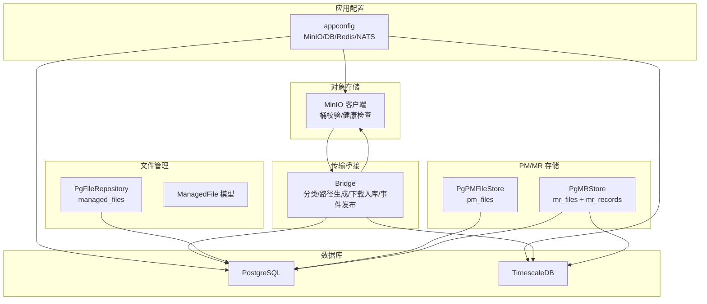
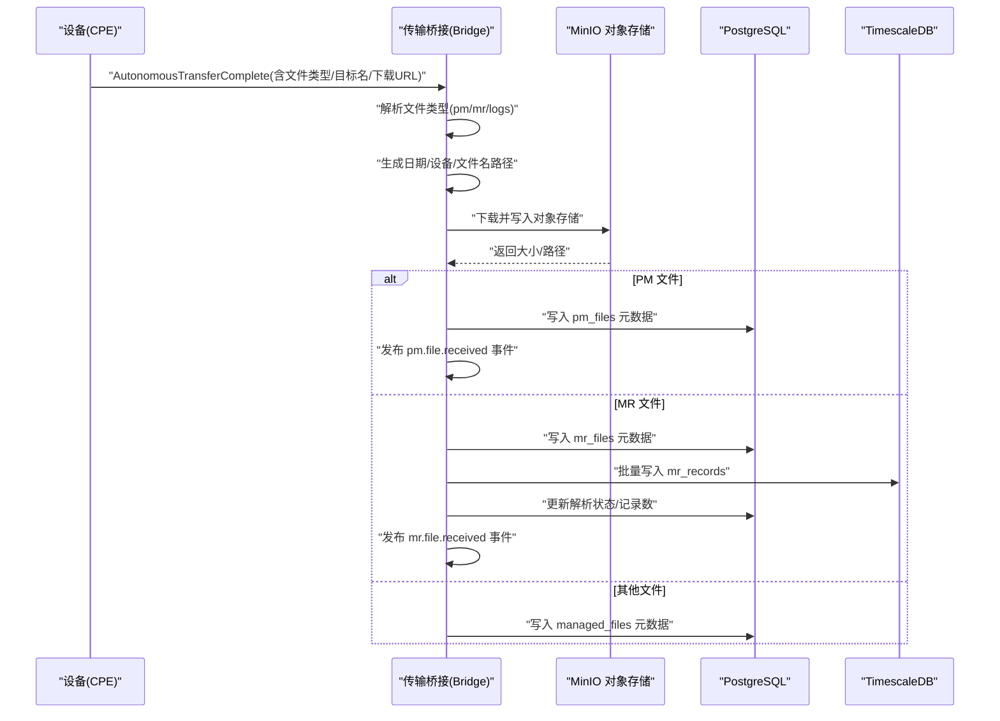
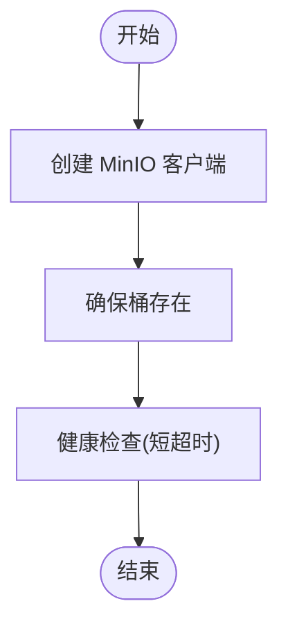
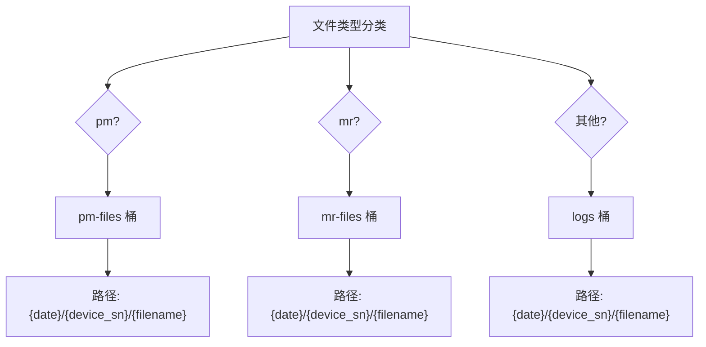
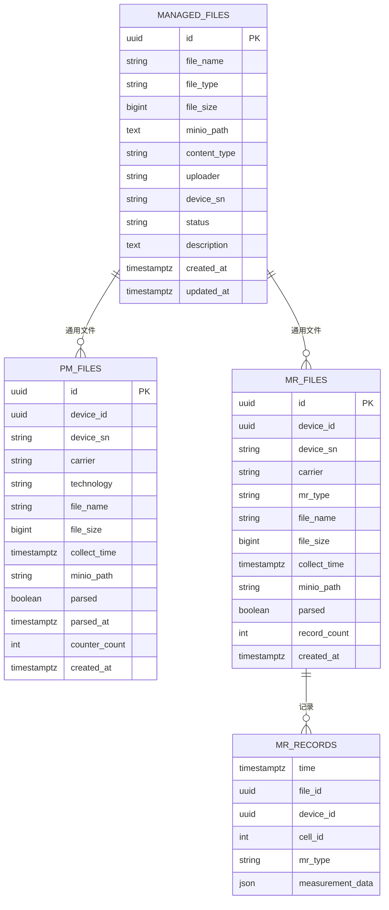
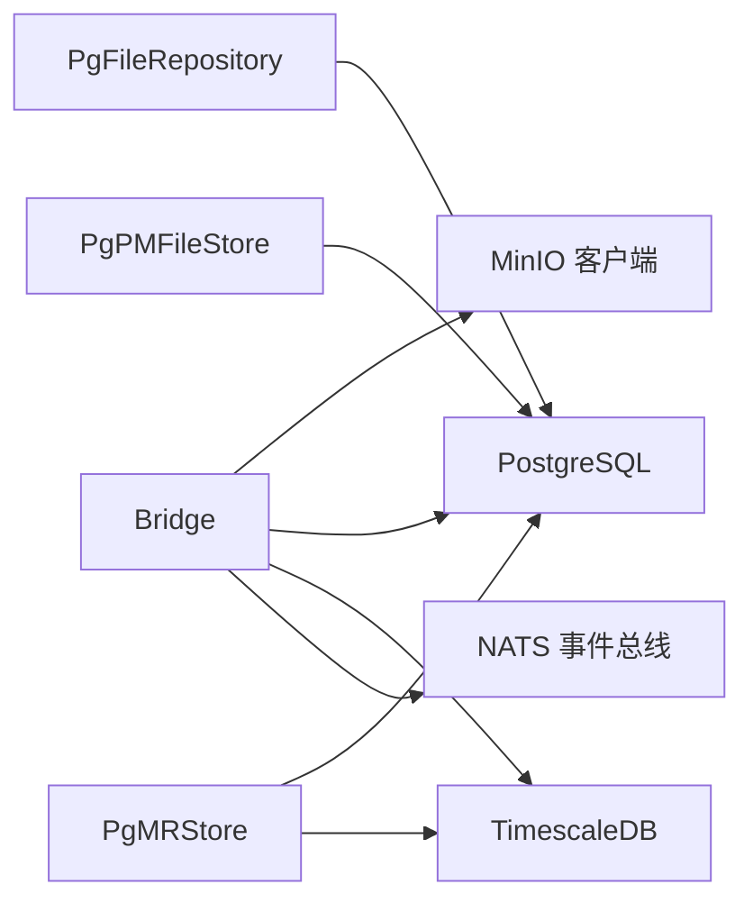

# 存储集成

<cite>
**本文引用的文件**
- [omcgo/internal/core/components/minio/minio.go](file://omcgo/internal/core/components/minio/minio.go)
- [omcgo/internal/core/appconfig/config.go](file://omcgo/internal/core/appconfig/config.go)
- [omcgo/internal/filemanager/repository.go](file://omcgo/internal/filemanager/repository.go)
- [omcgo/internal/filemanager/pg_repository.go](file://omcgo/internal/filemanager/pg_repository.go)
- [omcgo/internal/filemanager/model.go](file://omcgo/internal/filemanager/model.go)
- [omcgo/internal/pm/pg_file_store.go](file://omcgo/internal/pm/pg_file_store.go)
- [omcgo/internal/mr/pg_store.go](file://omcgo/internal/mr/pg_store.go)
- [omcgo/internal/transfer/bridge.go](file://omcgo/internal/transfer/bridge.go)
- [omcgo/migrations/000023_create_managed_files.up.sql](file://omcgo/migrations/000023_create_managed_files.up.sql)
- [omcgo/migrations/000034_create_pm_files.up.sql](file://omcgo/migrations/000034_create_pm_files.up.sql)
- [omcgo/migrations/000013_create_mr_tables.up.sql](file://omcgo/migrations/000013_create_mr_tables.up.sql)
- [omcgo/docs/design/pm-kpi-flow.md](file://omcgo/docs/design/pm-kpi-flow.md)
- [omcgo/docs/go-zero-design/04-data-model-service.md](file://omcgo/docs/go-zero-design/04-data-model-service.md)
- [omcgo/docs/acs-rpc-interaction-flows.md](file://omcgo/docs/acs-rpc-interaction-flows.md)
- [omcgo/internal/core/components/postgres/postgres.go](file://omcgo/internal/core/components/postgres/postgres.go)
- [omcgo/internal/core/components/nats/nats.go](file://omcgo/internal/core/components/nats/nats.go)
- [omcgo/internal/core/components/redis/redis.go](file://omcgo/internal/core/components/redis/redis.go)
- [omcgo/internal/core/components/monitor/monitor.go](file://omcgo/internal/core/components/monitor/monitor.go)
- [omcgo/internal/core/components/health.go](file://omcgo/internal/core/components/health.go)
- [omcgo/internal/core/components/shutdown.go](file://omcgo/internal/core/components/shutdown.go)
- [omcgo/internal/core/components/sysinfo.go](file://omcgo/internal/core/components/sysinfo.go)
- [omcgo/internal/core/components/tracer.go](file://omcgo/internal/core/components/tracer.go)
- [omcgo/internal/core/errors/codes.go](file://omcgo/internal/core/errors/codes.go)
- [omcgo/internal/core/errors/errors.go](file://omcgo/internal/core/errors/errors.go)
- [omcgo/internal/core/utils/util.go](file://omcgo/internal/core/utils/util.go)
- [omcgo/cmd/app/etc/config.dev.yaml](file://omcgo/cmd/app/etc/config.dev.yaml)
- [omcgo/cmd/app/etc/config.prod.yaml](file://omcgo/cmd/app/etc/config.prod.yaml)
- [omcgo/cmd/app/etc/config.test.yaml](file://omcgo/cmd/app/etc/config.test.yaml)
- [omcgo/cmd/worker/etc/config.dev.yaml](file://omcgo/cmd/worker/etc/config.dev.yaml)
- [omcgo/cmd/worker/etc/config.prod.yaml](file://omcgo/cmd/worker/etc/config.prod.yaml)
- [omcgo/cmd/worker/etc/config.test.yaml](file://omcgo/cmd/worker/etc/config.test.yaml)
- [omcgo/cmd/acs/etc/config.dev.yaml](file://omcgo/cmd/acs/etc/config.dev.yaml)
- [omcgo/cmd/acs/etc/config.prod.yaml](file://omcgo/cmd/acs/etc/config.prod.yaml)
- [omcgo/cmd/acs/etc/config.test.yaml](file://omcgo/cmd/acs/etc/config.test.yaml)
</cite>

## 目录
1. [简介](#简介)
2. [项目结构](#项目结构)
3. [核心组件](#核心组件)
4. [架构总览](#架构总览)
5. [详细组件分析](#详细组件分析)
6. [依赖分析](#依赖分析)
7. [性能考虑](#性能考虑)
8. [故障排查指南](#故障排查指南)
9. [结论](#结论)
10. [附录](#附录)

## 简介
本文件面向“存储集成”能力，系统化阐述本项目的对象存储（MinIO）与关系型存储（PostgreSQL/TimescaleDB）集成方案。内容涵盖：
- MinIO 客户端配置、连接管理与健康检查
- 文件存储路径策略（按日期分桶、按文件类型分类、命名规范）
- 数据库存储实现（表结构、事务处理、一致性保障）
- 高可用设计（冗余、备份、灾难恢复思路）
- 性能优化建议（缓存、压缩、传输优化）
- 成本控制、容量规划与监控告警

## 项目结构
围绕存储集成的关键代码分布在以下模块：
- MinIO 组件：客户端创建、桶校验、健康检查
- 应用配置：MinIO/PostgreSQL/Redis/NATS 等配置项
- 文件管理：受管文件的元数据持久化与查询
- PM/MR 文件存储：PM/MR 文件元数据写入与批量导入
- 传输桥接：从设备上传触发到 MinIO 存储与事件发布的流程
- 数据库迁移：managed_files、pm_files、mr_records 等表结构
- 文档与设计：PM/KPI 流程中的 MinIO 路径设计与保留策略
- 其他基础设施：PostgreSQL、Redis、NATS、监控、健康检查等

图表来源
- [omcgo/internal/core/appconfig/config.go:173-190](file://omcgo/internal/core/appconfig/config.go#L173-L190)
- [omcgo/internal/core/components/minio/minio.go:14-62](file://omcgo/internal/core/components/minio/minio.go#L14-L62)
- [omcgo/internal/filemanager/pg_repository.go:27-35](file://omcgo/internal/filemanager/pg_repository.go#L27-L35)
- [omcgo/internal/pm/pg_file_store.go:15-23](file://omcgo/internal/pm/pg_file_store.go#L15-L23)
- [omcgo/internal/mr/pg_store.go:19-28](file://omcgo/internal/mr/pg_store.go#L19-L28)
- [omcgo/internal/transfer/bridge.go:124-179](file://omcgo/internal/transfer/bridge.go#L124-L179)

章节来源
- [omcgo/internal/core/appconfig/config.go:173-190](file://omcgo/internal/core/appconfig/config.go#L173-L190)
- [omcgo/internal/core/components/minio/minio.go:14-62](file://omcgo/internal/core/components/minio/minio.go#L14-L62)
- [omcgo/internal/filemanager/pg_repository.go:27-35](file://omcgo/internal/filemanager/pg_repository.go#L27-L35)
- [omcgo/internal/pm/pg_file_store.go:15-23](file://omcgo/internal/pm/pg_file_store.go#L15-L23)
- [omcgo/internal/mr/pg_store.go:19-28](file://omcgo/internal/mr/pg_store.go#L19-L28)
- [omcgo/internal/transfer/bridge.go:124-179](file://omcgo/internal/transfer/bridge.go#L124-L179)

## 核心组件
- MinIO 客户端与桶管理
  - 客户端创建：基于配置项 endpoint、access_key、secret_key、use_ssl
  - 桶确保：自动创建 PMFiles、MRFiles、Firmware、ConfigBackup、Logs、Reports 等桶
  - 健康检查：短超时请求列举桶以验证连通性
- 应用配置
  - MinIOConfig、BucketConfig 提供桶命名与连接参数
  - PostgresConfig、RedisConfig、NATSConfig 提供其他基础设施配置
- 文件管理（受管文件）
  - ManagedFile 模型定义文件类型、状态、上传者、设备序列号等字段
  - PgFileRepository 提供 CRUD 与分页查询，并带索引优化
- PM/MR 文件存储
  - PgPMFileStore 写入 pm_files 元数据
  - PgMRStore 写入 mr_files 元数据并批量写入 mr_records（TimescaleDB）
- 传输桥接
  - 根据文件类型分类（pm/mr/logs），按日期/设备/文件名生成对象路径
  - 下载文件并写入 MinIO，随后发布事件驱动下游处理

章节来源
- [omcgo/internal/core/components/minio/minio.go:14-62](file://omcgo/internal/core/components/minio/minio.go#L14-L62)
- [omcgo/internal/core/appconfig/config.go:173-190](file://omcgo/internal/core/appconfig/config.go#L173-L190)
- [omcgo/internal/filemanager/model.go:10-45](file://omcgo/internal/filemanager/model.go#L10-L45)
- [omcgo/internal/filemanager/pg_repository.go:37-193](file://omcgo/internal/filemanager/pg_repository.go#L37-L193)
- [omcgo/internal/pm/pg_file_store.go:25-45](file://omcgo/internal/pm/pg_file_store.go#L25-L45)
- [omcgo/internal/mr/pg_store.go:30-78](file://omcgo/internal/mr/pg_store.go#L30-L78)
- [omcgo/internal/transfer/bridge.go:124-179](file://omcgo/internal/transfer/bridge.go#L124-L179)

## 架构总览
下图展示从设备上传到存储与后续处理的整体流程。

图表来源
- [omcgo/internal/transfer/bridge.go:124-179](file://omcgo/internal/transfer/bridge.go#L124-L179)
- [omcgo/internal/pm/pg_file_store.go:25-45](file://omcgo/internal/pm/pg_file_store.go#L25-L45)
- [omcgo/internal/mr/pg_store.go:30-78](file://omcgo/internal/mr/pg_store.go#L30-L78)
- [omcgo/migrations/000034_create_pm_files.up.sql:1-19](file://omcgo/migrations/000034_create_pm_files.up.sql#L1-L19)
- [omcgo/migrations/000013_create_mr_tables.up.sql:32-48](file://omcgo/migrations/000013_create_mr_tables.up.sql#L32-L48)

## 详细组件分析

### MinIO 客户端与桶管理
- 客户端创建：使用 endpoint、access_key、secret_key、use_ssl 初始化
- 桶确保：遍历配置中的桶名，若不存在则创建
- 健康检查：短超时列举桶，用于存活探测

图表来源
- [omcgo/internal/core/components/minio/minio.go:14-62](file://omcgo/internal/core/components/minio/minio.go#L14-L62)

章节来源
- [omcgo/internal/core/components/minio/minio.go:14-62](file://omcgo/internal/core/components/minio/minio.go#L14-L62)

### 文件存储路径策略
- 分类与桶映射
  - pm → pm-files 桶
  - mr → mr-files 桶
  - 其他 → logs 桶
- 路径结构
  - 采用“日期/设备序列号/文件名”的层级组织
  - 便于按天切分与按设备检索
- 命名规范
  - 使用设备序列号作为二级目录，避免同一天内同设备对象过多导致的单目录膨胀
  - 文件名保持原文件名或目标名，确保可追溯

图表来源
- [omcgo/internal/transfer/bridge.go:124-179](file://omcgo/internal/transfer/bridge.go#L124-L179)
- [omcgo/docs/design/pm-kpi-flow.md:481-490](file://omcgo/docs/design/pm-kpi-flow.md#L481-L490)

章节来源
- [omcgo/internal/transfer/bridge.go:124-179](file://omcgo/internal/transfer/bridge.go#L124-L179)
- [omcgo/docs/design/pm-kpi-flow.md:481-490](file://omcgo/docs/design/pm-kpi-flow.md#L481-L490)

### 数据库存储实现
- managed_files（通用受管文件）
  - 字段：文件名、类型、大小、MinIO 路径、内容类型、上传者、设备序列号、状态、描述、时间戳
  - 索引：按类型、状态、设备序列号、创建时间倒序
  - 触发器：自动维护 updated_at
- pm_files（性能文件）
  - 字段：设备标识、运营商、制式、文件名、大小、采集时间、MinIO 路径、解析状态/时间、计数器数量
  - 索引：按设备、创建时间倒序
- mr_files + mr_records（测量报告）
  - mr_files：元数据表，含解析状态与记录数
  - mr_records：TimescaleDB 超表，支持压缩与保留策略

图表来源
- [omcgo/migrations/000023_create_managed_files.up.sql:1-24](file://omcgo/migrations/000023_create_managed_files.up.sql#L1-L24)
- [omcgo/migrations/000034_create_pm_files.up.sql:1-19](file://omcgo/migrations/000034_create_pm_files.up.sql#L1-L19)
- [omcgo/migrations/000013_create_mr_tables.up.sql:32-48](file://omcgo/migrations/000013_create_mr_tables.up.sql#L32-L48)

章节来源
- [omcgo/migrations/000023_create_managed_files.up.sql:1-24](file://omcgo/migrations/000023_create_managed_files.up.sql#L1-L24)
- [omcgo/migrations/000034_create_pm_files.up.sql:1-19](file://omcgo/migrations/000034_create_pm_files.up.sql#L1-L19)
- [omcgo/migrations/000013_create_mr_tables.up.sql:32-48](file://omcgo/migrations/000013_create_mr_tables.up.sql#L32-L48)

### 事务处理与一致性
- PostgreSQL 事务
  - PgPMFileStore/PgMRStore 在单条插入或批量写入中保持原子性
  - 使用 pgx 连接池，结合 SQL Builder 构造参数化查询
- TimescaleDB 批量写入
  - PgMRStore 使用 CopyFrom 批量写入 mr_records，提升吞吐
- 一致性保障
  - managed_files/pm_files/mr_files 三表分别记录元数据，配合事件总线驱动下游解析
  - 解析完成后更新解析状态与记录数，确保最终一致

章节来源
- [omcgo/internal/pm/pg_file_store.go:25-45](file://omcgo/internal/pm/pg_file_store.go#L25-L45)
- [omcgo/internal/mr/pg_store.go:30-78](file://omcgo/internal/mr/pg_store.go#L30-L78)

### 高可用性设计
- MinIO
  - 多桶隔离不同业务类型，降低单桶压力
  - 健康检查短超时，便于快速发现异常
- PostgreSQL/TimescaleDB
  - managed_files/pm_files/mr_files 索引优化查询
  - TimescaleDB 设置压缩与保留策略，自动清理旧数据
- 事件驱动
  - 通过事件总线在对象落盘后触发下游解析，解耦存储与处理

章节来源
- [omcgo/internal/core/components/minio/minio.go:53-62](file://omcgo/internal/core/components/minio/minio.go#L53-L62)
- [omcgo/migrations/000013_create_mr_tables.up.sql:32-48](file://omcgo/migrations/000013_create_mr_tables.up.sql#L32-L48)
- [omcgo/internal/core/components/nats/nats.go](file://omcgo/internal/core/components/nats/nats.go)

### 认证与连接管理
- MinIO 认证
  - 使用静态凭证（access_key/secret_key），支持 SSL
- 应用配置
  - 通过配置文件与环境变量注入，支持多环境（dev/prod/test）
- 连接池与健康检查
  - PostgreSQL 使用连接池与健康检查间隔
  - MinIO 使用短超时健康检查

章节来源
- [omcgo/internal/core/components/minio/minio.go:14-23](file://omcgo/internal/core/components/minio/minio.go#L14-L23)
- [omcgo/internal/core/appconfig/config.go:173-190](file://omcgo/internal/core/appconfig/config.go#L173-L190)
- [omcgo/cmd/app/etc/config.dev.yaml](file://omcgo/cmd/app/etc/config.dev.yaml)
- [omcgo/cmd/app/etc/config.prod.yaml](file://omcgo/cmd/app/etc/config.prod.yaml)
- [omcgo/cmd/app/etc/config.test.yaml](file://omcgo/cmd/app/etc/config.test.yaml)

## 依赖分析
- 组件耦合
  - Bridge 依赖 MinIO 客户端、PG/TimescaleDB 连接、设备仓库与事件总线
  - PgFileRepository/PgPMFileStore/PgMRStore 依赖 pgx 连接池
- 外部依赖
  - MinIO SDK、pgx、Masterminds/squirrel、TimescaleDB 扩展

图表来源
- [omcgo/internal/transfer/bridge.go:124-179](file://omcgo/internal/transfer/bridge.go#L124-L179)
- [omcgo/internal/filemanager/pg_repository.go:27-35](file://omcgo/internal/filemanager/pg_repository.go#L27-L35)
- [omcgo/internal/pm/pg_file_store.go:15-23](file://omcgo/internal/pm/pg_file_store.go#L15-L23)
- [omcgo/internal/mr/pg_store.go:19-28](file://omcgo/internal/mr/pg_store.go#L19-L28)

## 性能考虑
- 缓存策略
  - 参考数据模型服务的三级缓存（进程内内存 → Redis → PostgreSQL），可对热点查询结果进行缓存
- 压缩与传输
  - 设备侧周期上传性能文件，OMC 北向应保存原始数据；可结合压缩策略与传输优化减少带宽占用
- 数据库写入
  - TimescaleDB 批量写入（CopyFrom）显著提升 MR 记录导入性能
- 索引与查询
  - managed_files/pm_files 的索引有助于按类型/状态/设备/时间过滤

章节来源
- [omcgo/docs/go-zero-design/04-data-model-service.md:332-357](file://omcgo/docs/go-zero-design/04-data-model-service.md#L332-L357)
- [omcgo/docs/acs-rpc-interaction-flows.md:387-406](file://omcgo/docs/acs-rpc-interaction-flows.md#L387-L406)
- [omcgo/migrations/000013_create_mr_tables.up.sql:32-48](file://omcgo/migrations/000013_create_mr_tables.up.sql#L32-L48)
- [omcgo/migrations/000023_create_managed_files.up.sql:15-18](file://omcgo/migrations/000023_create_managed_files.up.sql#L15-L18)

## 故障排查指南
- MinIO 连接问题
  - 检查 endpoint、access_key、secret_key、use_ssl 配置
  - 使用健康检查接口定位网络/认证异常
- 桶不存在
  - 确认 EnsureBuckets 是否正确执行，必要时手动创建对应桶
- 数据库写入失败
  - 检查连接池配置（最大连接数、空闲时间、健康检查间隔）
  - 查看具体 SQL 错误与参数日志（可通过配置开启 SQL 日志）
- 事件未触发
  - 检查事件总线连接与主题订阅
- 文件解析异常
  - 确认解析状态字段与记录数更新逻辑

章节来源
- [omcgo/internal/core/components/minio/minio.go:53-62](file://omcgo/internal/core/components/minio/minio.go#L53-L62)
- [omcgo/internal/core/appconfig/config.go:144-156](file://omcgo/internal/core/appconfig/config.go#L144-L156)
- [omcgo/internal/core/errors/codes.go](file://omcgo/internal/core/errors/codes.go)
- [omcgo/internal/core/errors/errors.go](file://omcgo/internal/core/errors/errors.go)

## 结论
本存储集成方案以“对象存储 + 关系型存储 + 事件驱动”为核心，实现了：
- 明确的文件路径策略与桶隔离
- 完整的元数据持久化与索引优化
- 高吞吐的批量写入与自动清理
- 健壮的健康检查与配置管理

在此基础上，可进一步完善备份与灾备、容量规划与成本控制、以及更丰富的监控告警体系。

## 附录

### 配置参考（关键键位）
- MinIO
  - endpoint、access_key、secret_key、use_ssl、buckets.pm_files、buckets.mr_files、buckets.firmware、buckets.config_backup、buckets.logs、buckets.reports
- PostgreSQL
  - dsn、max_conns、min_conns、max_conn_lifetime、max_conn_idle_time、health_check_interval、log_sql、log_sql_params、log_sql_slow_threshold
- Redis
  - addrs、password、db、pool_size
- NATS
  - url、max_reconnect、reconnect_wait

章节来源
- [omcgo/internal/core/appconfig/config.go:173-190](file://omcgo/internal/core/appconfig/config.go#L173-L190)
- [omcgo/cmd/app/etc/config.dev.yaml](file://omcgo/cmd/app/etc/config.dev.yaml)
- [omcgo/cmd/app/etc/config.prod.yaml](file://omcgo/cmd/app/etc/config.prod.yaml)
- [omcgo/cmd/app/etc/config.test.yaml](file://omcgo/cmd/app/etc/config.test.yaml)
- [omcgo/cmd/worker/etc/config.dev.yaml](file://omcgo/cmd/worker/etc/config.dev.yaml)
- [omcgo/cmd/worker/etc/config.prod.yaml](file://omcgo/cmd/worker/etc/config.prod.yaml)
- [omcgo/cmd/worker/etc/config.test.yaml](file://omcgo/cmd/worker/etc/config.test.yaml)
- [omcgo/cmd/acs/etc/config.dev.yaml](file://omcgo/cmd/acs/etc/config.dev.yaml)
- [omcgo/cmd/acs/etc/config.prod.yaml](file://omcgo/cmd/acs/etc/config.prod.yaml)
- [omcgo/cmd/acs/etc/config.test.yaml](file://omcgo/cmd/acs/etc/config.test.yaml)