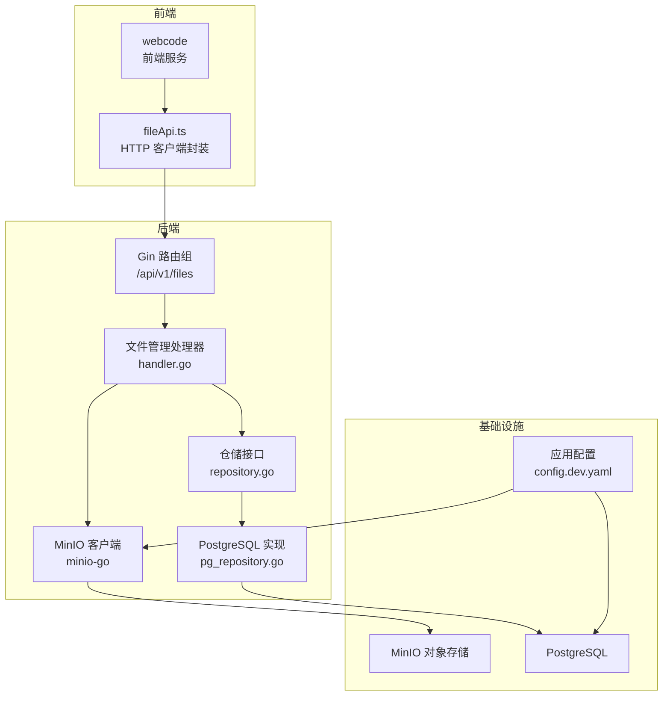
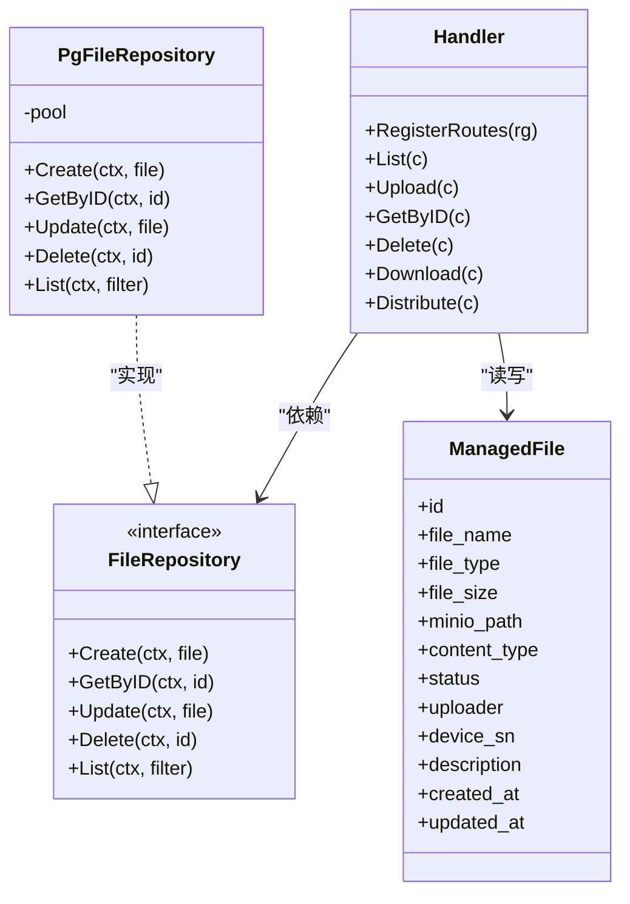
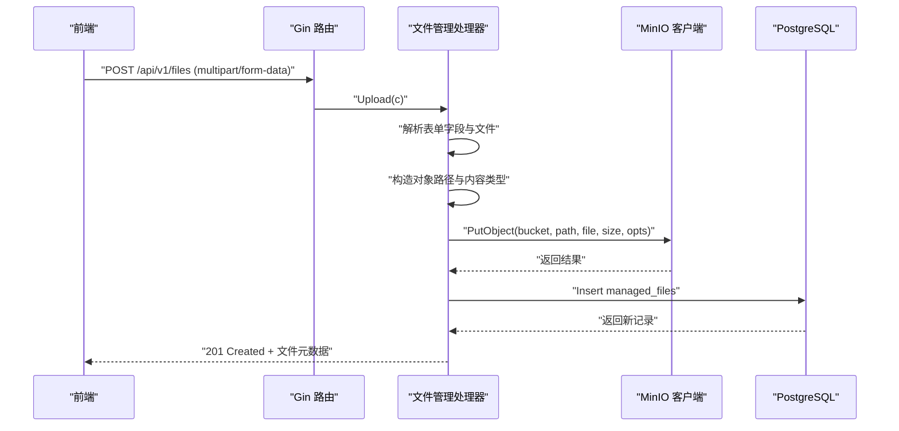
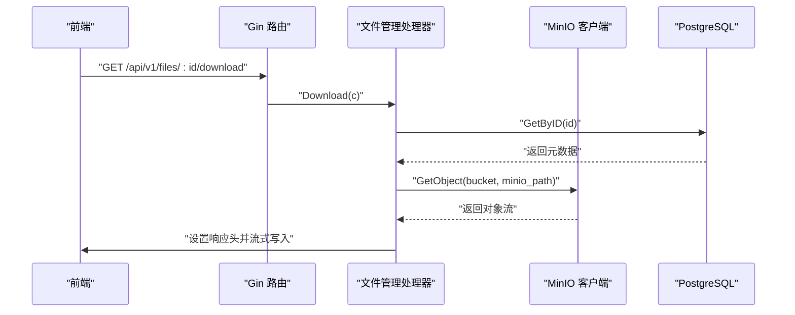
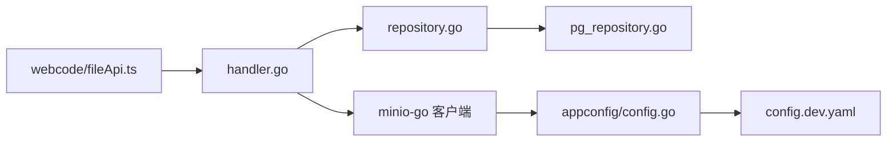

# 文件上传下载

<cite>
**本文引用的文件**
- [omcgo/internal/filemanager/handler.go](file://omcgo/internal/filemanager/handler.go)
- [omcgo/internal/filemanager/model.go](file://omcgo/internal/filemanager/model.go)
- [omcgo/internal/filemanager/repository.go](file://omcgo/internal/filemanager/repository.go)
- [omcgo/internal/filemanager/pg_repository.go](file://omcgo/internal/filemanager/pg_repository.go)
- [omcgo/internal/core/components/minio/minio.go](file://omcgo/internal/core/components/minio/minio.go)
- [omcgo/internal/core/appconfig/config.go](file://omcgo/internal/core/appconfig/config.go)
- [omcgo/cmd/app/etc/config.dev.yaml](file://omcgo/cmd/app/etc/config.dev.yaml)
- [omcgo/api/openapi/openapi.yaml](file://omcgo/api/openapi/openapi.yaml)
- [omcgo/internal/pm/file_store.go](file://omcgo/internal/pm/file_store.go)
- [omcgo/internal/pm/pg_file_store.go](file://omcgo/internal/pm/pg_file_store.go)
- [omcgo/scripts/e2e_verify.sh](file://omcgo/scripts/e2e_verify.sh)
- [omcgo/webcode/src/services/api/fileApi.ts](file://omcgo/webcode/src/services/api/fileApi.ts)
</cite>

## 目录
1. [简介](#简介)
2. [项目结构](#项目结构)
3. [核心组件](#核心组件)
4. [架构总览](#架构总览)
5. [详细组件分析](#详细组件分析)
6. [依赖关系分析](#依赖关系分析)
7. [性能考量](#性能考量)
8. [故障排查指南](#故障排查指南)
9. [结论](#结论)
10. [附录](#附录)

## 简介
本文件围绕文件上传与下载功能进行系统化技术文档整理，覆盖以下关键主题：
- 上传实现机制：multipart/form-data 解析、字段绑定、文件类型与内容类型处理
- 下载流程：MinIO 对象读取、流式传输、响应头设置
- 存储策略：路径命名规则、桶与对象组织方式
- 安全性：鉴权、最小权限、访问控制与敏感信息保护
- API 使用示例：端到端调用路径与参数说明
- 错误处理：统一错误码映射、异常分支与日志记录
- 性能优化：并发与带宽利用、分块与缓存策略
- 扩展能力：上传进度、断点续传（当前未实现，提供可扩展方案）

## 项目结构
文件管理子系统位于后端 omcgo 内部模块，前端通过 webcode 提供调用封装。整体涉及的关键位置如下：
- 后端路由与处理器：omcgo/internal/filemanager/handler.go
- 数据模型与枚举：omcgo/internal/filemanager/model.go
- 仓储接口与 PostgreSQL 实现：repository.go、pg_repository.go
- MinIO 客户端与桶管理：internal/core/components/minio/minio.go
- 应用配置：internal/core/appconfig/config.go、cmd/app/etc/config.dev.yaml
- OpenAPI 文档：api/openapi/openapi.yaml
- PM 文件存储（对比参考）：internal/pm/file_store.go、internal/pm/pg_file_store.go
- 端到端脚本与前端 API 封装：scripts/e2e_verify.sh、webcode/src/services/api/fileApi.ts

图表来源
- [omcgo/internal/filemanager/handler.go:41-49](file://omcgo/internal/filemanager/handler.go#L41-L49)
- [omcgo/internal/filemanager/pg_repository.go:32-35](file://omcgo/internal/filemanager/pg_repository.go#L32-L35)
- [omcgo/internal/core/components/minio/minio.go:14-23](file://omcgo/internal/core/components/minio/minio.go#L14-L23)
- [omcgo/cmd/app/etc/config.dev.yaml:45-57](file://omcgo/cmd/app/etc/config.dev.yaml#L45-L57)

章节来源
- [omcgo/internal/filemanager/handler.go:41-49](file://omcgo/internal/filemanager/handler.go#L41-L49)
- [omcgo/internal/filemanager/model.go:10-54](file://omcgo/internal/filemanager/model.go#L10-L54)
- [omcgo/internal/filemanager/repository.go:10-17](file://omcgo/internal/filemanager/repository.go#L10-L17)
- [omcgo/internal/filemanager/pg_repository.go:32-35](file://omcgo/internal/filemanager/pg_repository.go#L32-L35)
- [omcgo/internal/core/components/minio/minio.go:14-23](file://omcgo/internal/core/components/minio/minio.go#L14-L23)
- [omcgo/internal/core/appconfig/config.go:170-187](file://omcgo/internal/core/appconfig/config.go#L170-L187)
- [omcgo/cmd/app/etc/config.dev.yaml:45-57](file://omcgo/cmd/app/etc/config.dev.yaml#L45-L57)

## 核心组件
- 处理器（Handler）
  - 负责注册路由、接收请求、调用仓储与 MinIO 客户端、返回响应
  - 关键方法：List、Upload、GetByID、Delete、Download、Distribute
- 数据模型（ManagedFile）
  - 字段：文件名、类型、大小、MinIO 路径、内容类型、状态、描述、设备序列号、上传者等
  - 枚举：FileType、FileStatus
- 仓储接口与实现
  - 接口定义 CRUD 与分页查询
  - PostgreSQL 实现使用 squirrel 构建 SQL，pgx 连接池执行
- MinIO 客户端与桶管理
  - 创建客户端、确保桶存在、健康检查
- 配置
  - MinIO 端点、密钥、桶名称、数据库连接等

章节来源
- [omcgo/internal/filemanager/handler.go:20-38](file://omcgo/internal/filemanager/handler.go#L20-L38)
- [omcgo/internal/filemanager/model.go:10-54](file://omcgo/internal/filemanager/model.go#L10-L54)
- [omcgo/internal/filemanager/repository.go:10-17](file://omcgo/internal/filemanager/repository.go#L10-L17)
- [omcgo/internal/filemanager/pg_repository.go:37-56](file://omcgo/internal/filemanager/pg_repository.go#L37-L56)
- [omcgo/internal/core/components/minio/minio.go:14-23](file://omcgo/internal/core/components/minio/minio.go#L14-L23)
- [omcgo/internal/core/appconfig/config.go:170-187](file://omcgo/internal/core/appconfig/config.go#L170-L187)

## 架构总览
文件管理采用“控制器-仓储-对象存储”的分层架构：
- 控制器负责 HTTP 协议与业务编排
- 仓储负责数据持久化（PostgreSQL）
- MinIO 负责对象存储（文件内容）

图表来源
- [omcgo/internal/filemanager/handler.go:20-38](file://omcgo/internal/filemanager/handler.go#L20-L38)
- [omcgo/internal/filemanager/repository.go:10-17](file://omcgo/internal/filemanager/repository.go#L10-L17)
- [omcgo/internal/filemanager/pg_repository.go:27-35](file://omcgo/internal/filemanager/pg_repository.go#L27-L35)
- [omcgo/internal/filemanager/model.go:31-45](file://omcgo/internal/filemanager/model.go#L31-L45)

## 详细组件分析

### 上传流程（multipart/form-data）
- 请求体：multipart/form-data，字段包括 file、file_type、description、device_sn、uploader
- 处理步骤：
  1) 从请求中获取文件与头部信息
  2) 从表单字段解析 file_type（默认 other），以及可选字段
  3) 构造 MinIO 对象路径：managed-files/{file_type}/{YYYY-MM-DD}/{原始文件名}
  4) 从头部读取 Content-Type，若为空则回退为 application/octet-stream
  5) 调用 MinIO PutObject 写入对象
  6) 将元数据写入 PostgreSQL（含文件名、类型、大小、MinIO 路径、内容类型、状态等）
  7) 返回 201 Created 与新建文件元数据

图表来源
- [omcgo/internal/filemanager/handler.go:86-146](file://omcgo/internal/filemanager/handler.go#L86-L146)
- [omcgo/internal/filemanager/pg_repository.go:37-56](file://omcgo/internal/filemanager/pg_repository.go#L37-L56)
- [omcgo/internal/core/components/minio/minio.go:14-23](file://omcgo/internal/core/components/minio/minio.go#L14-L23)

章节来源
- [omcgo/internal/filemanager/handler.go:86-146](file://omcgo/internal/filemanager/handler.go#L86-L146)
- [omcgo/internal/filemanager/model.go:31-45](file://omcgo/internal/filemanager/model.go#L31-L45)
- [omcgo/internal/filemanager/pg_repository.go:37-56](file://omcgo/internal/filemanager/pg_repository.go#L37-L56)

要点与注意事项
- multipart/form-data 字段绑定：使用 Gin 的 FormFile 与 PostForm 获取文件与表单字段
- 路径命名：按类型与日期分桶，便于归档与检索
- 内容类型：优先使用请求头 Content-Type，缺失时回退二进制类型
- 错误处理：任一步失败均返回相应 HTTP 状态码；上传失败不会残留对象或元数据

### 下载流程（MinIO 对象读取与流式传输）
- 请求：GET /api/v1/files/{id}/download
- 处理步骤：
  1) 校验并解析 UUID
  2) 查询元数据（含 MinIO 路径、内容类型、文件大小）
  3) 通过 MinIO GetObject 获取对象流
  4) 设置响应头：Content-Disposition（附件下载）、Content-Type、Content-Length（如已知）
  5) 使用 io.Copy 将对象流写入 HTTP 响应
  6) 若复制过程中发生错误，仅记录日志，无法再返回 JSON 错误（响应头已发送）

图表来源
- [omcgo/internal/filemanager/handler.go:195-227](file://omcgo/internal/filemanager/handler.go#L195-L227)
- [omcgo/internal/filemanager/pg_repository.go:58-75](file://omcgo/internal/filemanager/pg_repository.go#L58-L75)
- [omcgo/internal/core/components/minio/minio.go:14-23](file://omcgo/internal/core/components/minio/minio.go#L14-L23)

章节来源
- [omcgo/internal/filemanager/handler.go:195-227](file://omcgo/internal/filemanager/handler.go#L195-L227)
- [omcgo/internal/filemanager/pg_repository.go:58-75](file://omcgo/internal/filemanager/pg_repository.go#L58-L75)

### 删除流程（清理 MinIO 对象与数据库记录）
- 步骤：
  1) 根据 ID 获取元数据
  2) 从 MinIO 删除对象（失败仅记录警告，继续删除元数据）
  3) 从 PostgreSQL 删除记录
  4) 返回删除成功响应

章节来源
- [omcgo/internal/filemanager/handler.go:165-193](file://omcgo/internal/filemanager/handler.go#L165-L193)
- [omcgo/internal/filemanager/pg_repository.go:104-120](file://omcgo/internal/filemanager/pg_repository.go#L104-L120)

### 分发流程（向设备推送下载任务）
- 步骤：
  1) 校验文件 ID 与设备 SN 列表
  2) 生成任务 ID，构造 minio://{bucket}/{minio_path} 下载地址
  3) 将 Download 命令推送到命令队列（NATS/内部队列），逐台下发
  4) 记录成功/失败计数

章节来源
- [omcgo/internal/filemanager/handler.go:234-293](file://omcgo/internal/filemanager/handler.go#L234-L293)

### 路由与 API 定义
- 路由注册：/api/v1/files 下的 List、Upload、GetByID、Delete、Download、Distribute
- OpenAPI 文档中包含认证与各端点的描述

章节来源
- [omcgo/internal/filemanager/handler.go:41-49](file://omcgo/internal/filemanager/handler.go#L41-L49)
- [omcgo/api/openapi/openapi.yaml:1-200](file://omcgo/api/openapi/openapi.yaml#L1-L200)

## 依赖关系分析
- 处理器依赖仓储接口与 MinIO 客户端
- PostgreSQL 实现依赖连接池与 SQL 构建库
- 配置模块提供 MinIO 与数据库连接参数
- 前端通过 HTTP 客户端封装调用后端 API

图表来源
- [omcgo/internal/filemanager/handler.go:20-38](file://omcgo/internal/filemanager/handler.go#L20-L38)
- [omcgo/internal/filemanager/repository.go:10-17](file://omcgo/internal/filemanager/repository.go#L10-L17)
- [omcgo/internal/filemanager/pg_repository.go:27-35](file://omcgo/internal/filemanager/pg_repository.go#L27-L35)
- [omcgo/internal/core/appconfig/config.go:170-187](file://omcgo/internal/core/appconfig/config.go#L170-L187)
- [omcgo/cmd/app/etc/config.dev.yaml:45-57](file://omcgo/cmd/app/etc/config.dev.yaml#L45-L57)
- [omcgo/webcode/src/services/api/fileApi.ts:162-213](file://omcgo/webcode/src/services/api/fileApi.ts#L162-L213)

章节来源
- [omcgo/internal/filemanager/handler.go:20-38](file://omcgo/internal/filemanager/handler.go#L20-L38)
- [omcgo/internal/filemanager/pg_repository.go:27-35](file://omcgo/internal/filemanager/pg_repository.go#L27-L35)
- [omcgo/internal/core/appconfig/config.go:170-187](file://omcgo/internal/core/appconfig/config.go#L170-L187)
- [omcgo/cmd/app/etc/config.dev.yaml:45-57](file://omcgo/cmd/app/etc/config.dev.yaml#L45-L57)
- [omcgo/webcode/src/services/api/fileApi.ts:162-213](file://omcgo/webcode/src/services/api/fileApi.ts#L162-L213)

## 性能考量
- 流式传输：下载采用 io.Copy 将对象流直接写入响应，避免将整个文件加载到内存
- 并发与带宽：MinIO 客户端与 PostgreSQL 连接池支持高并发；合理设置连接池大小与超时
- 存储布局：按类型与日期分层，有利于冷热分离与归档策略
- 建议
  - 上传大文件时启用分块上传（MinIO 支持）与断点续传（见扩展方案）
  - 在网关或反向代理层开启压缩与缓存（视场景而定）
  - 监控 MinIO 与数据库延迟、吞吐量与错误率

## 故障排查指南
- 常见错误与定位
  - 上传失败：检查 MinIO 可用性、桶是否存在、写权限；查看日志中对象路径
  - 下载失败：确认文件 ID 有效、对象路径正确、MinIO 可达；关注响应头是否已发送导致无法返回 JSON
  - 删除失败：MinIO 删除失败会记录警告并继续删除数据库记录
- 健康检查
  - MinIO 健康检查：通过客户端列举桶判断可用性
- 端到端验证
  - e2e 脚本包含上传与详情查询的校验逻辑

章节来源
- [omcgo/internal/filemanager/handler.go:114-118](file://omcgo/internal/filemanager/handler.go#L114-L118)
- [omcgo/internal/filemanager/handler.go:210-214](file://omcgo/internal/filemanager/handler.go#L210-L214)
- [omcgo/internal/filemanager/handler.go:181-184](file://omcgo/internal/filemanager/handler.go#L181-L184)
- [omcgo/internal/core/components/minio/minio.go:53-62](file://omcgo/internal/core/components/minio/minio.go#L53-L62)
- [omcgo/scripts/e2e_verify.sh:3115-3142](file://omcgo/scripts/e2e_verify.sh#L3115-L3142)

## 结论
该文件管理子系统以清晰的分层设计实现了上传、下载、删除与分发等核心能力，结合 PostgreSQL 与 MinIO 达成元数据与内容的解耦存储。当前实现具备良好的可维护性与扩展性，后续可在上传进度与断点续传方面进一步增强。

## 附录

### API 调用示例与最佳实践
- 上传（multipart/form-data）
  - 方法与路径：POST /api/v1/files
  - 表单字段：file（必填）、file_type（可选，默认 other）、description（可选）、device_sn（可选）、uploader（可选）
  - 返回：201 Created + 文件元数据
- 下载（blob）
  - 方法与路径：GET /api/v1/files/{id}/download
  - 响应头：Content-Disposition、Content-Type、Content-Length（如已知）
- 删除
  - 方法与路径：DELETE /api/v1/files/{id}
  - 行为：删除 MinIO 对象与数据库记录
- 分发
  - 方法与路径：POST /api/v1/files/{id}/distribute
  - 请求体：{ device_sns: [ ... ] }
  - 行为：向设备推送下载任务

章节来源
- [omcgo/internal/filemanager/handler.go:41-49](file://omcgo/internal/filemanager/handler.go#L41-L49)
- [omcgo/internal/filemanager/handler.go:86-146](file://omcgo/internal/filemanager/handler.go#L86-L146)
- [omcgo/internal/filemanager/handler.go:195-227](file://omcgo/internal/filemanager/handler.go#L195-L227)
- [omcgo/internal/filemanager/handler.go:165-193](file://omcgo/internal/filemanager/handler.go#L165-L193)
- [omcgo/internal/filemanager/handler.go:234-293](file://omcgo/internal/filemanager/handler.go#L234-L293)
- [omcgo/webcode/src/services/api/fileApi.ts:162-213](file://omcgo/webcode/src/services/api/fileApi.ts#L162-L213)

### 文件类型与状态
- FileType：config、log、firmware、script、other
- FileStatus：uploaded、processing、ready、failed

章节来源
- [omcgo/internal/filemanager/model.go:13-29](file://omcgo/internal/filemanager/model.go#L13-L29)

### 路径命名规则与存储策略
- MinIO 对象路径：managed-files/{file_type}/{YYYY-MM-DD}/{原始文件名}
- 桶名称：由配置提供（pm-files、mr-files、firmware、config-backup、logs、reports）

章节来源
- [omcgo/internal/filemanager/handler.go:103-105](file://omcgo/internal/filemanager/handler.go#L103-L105)
- [omcgo/cmd/app/etc/config.dev.yaml:50-56](file://omcgo/cmd/app/etc/config.dev.yaml#L50-L56)

### 安全性考虑
- 鉴权：OpenAPI 文档声明 BearerAuth，需在请求头携带令牌
- 最小权限：MinIO 桶与对象操作遵循最小权限原则
- 敏感信息：避免在日志中输出敏感字段；注意响应头与临时路径

章节来源
- [omcgo/api/openapi/openapi.yaml:10-11](file://omcgo/api/openapi/openapi.yaml#L10-L11)

### 错误处理机制
- 统一错误码映射：根据错误类型映射为合适的 HTTP 状态码
- 失败回滚：上传失败不写入数据库；删除失败仅记录警告
- 日志记录：关键错误与路径信息记录在日志中

章节来源
- [omcgo/internal/filemanager/handler.go:57-80](file://omcgo/internal/filemanager/handler.go#L57-L80)
- [omcgo/internal/filemanager/handler.go:114-118](file://omcgo/internal/filemanager/handler.go#L114-L118)
- [omcgo/internal/filemanager/handler.go:210-214](file://omcgo/internal/filemanager/handler.go#L210-L214)
- [omcgo/internal/filemanager/handler.go:181-184](file://omcgo/internal/filemanager/handler.go#L181-L184)

### 性能优化建议
- 上传：启用分块上传与断点续传（见扩展方案）
- 下载：保持流式传输，避免一次性加载至内存
- 并发：合理设置连接池与超时，避免阻塞
- 缓存：在网关层对静态资源进行缓存（视场景而定）

### 上传进度与断点续传（扩展方案）
- 上传进度
  - 前端：基于浏览器原生进度事件（XMLHttpRequest/FormData）上报已上传字节
  - 后端：可引入分片上传接口，结合会话记录上传进度
- 断点续传
  - 基于分片与校验和（如 ETag）实现
  - 建议：后端新增分片上传、合并与校验接口，并在前端实现断点续传逻辑

章节来源
- [omcgo/webcode/src/services/api/fileApi.ts:162-213](file://omcgo/webcode/src/services/api/fileApi.ts#L162-L213)

### 对比参考：PM 文件存储
- PM 文件存储采用独立的元数据表与 MinIO 路径字段，便于统计与解析状态
- 可借鉴其分层设计与 SQL 构建模式

章节来源
- [omcgo/internal/pm/file_store.go:11-42](file://omcgo/internal/pm/file_store.go#L11-L42)
- [omcgo/internal/pm/pg_file_store.go:25-121](file://omcgo/internal/pm/pg_file_store.go#L25-L121)