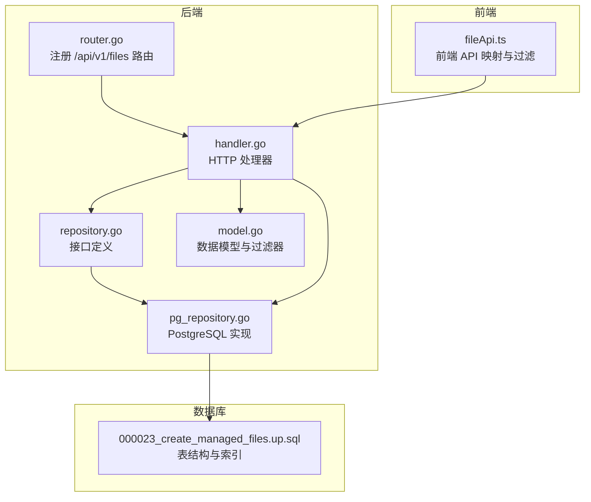
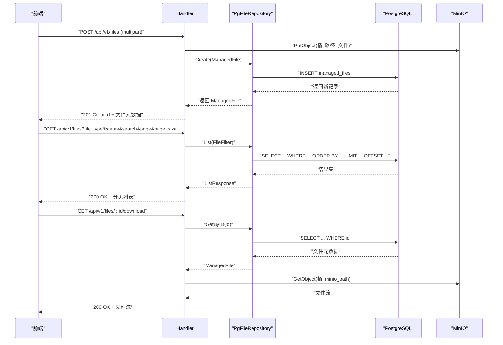
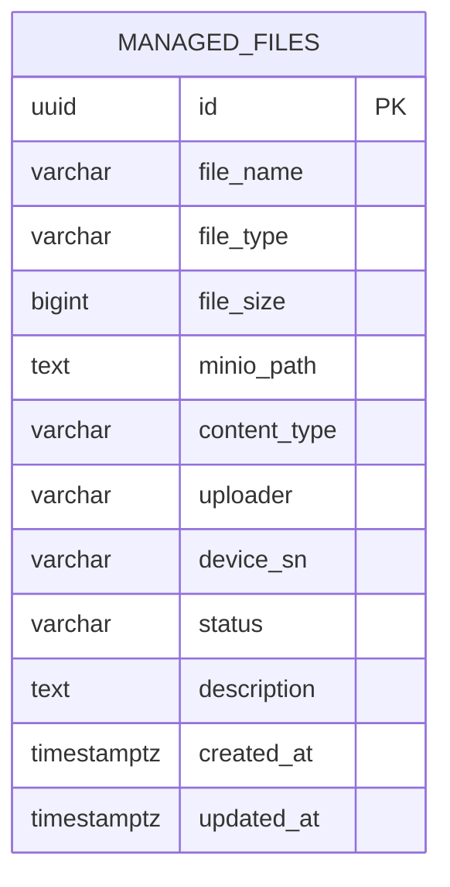
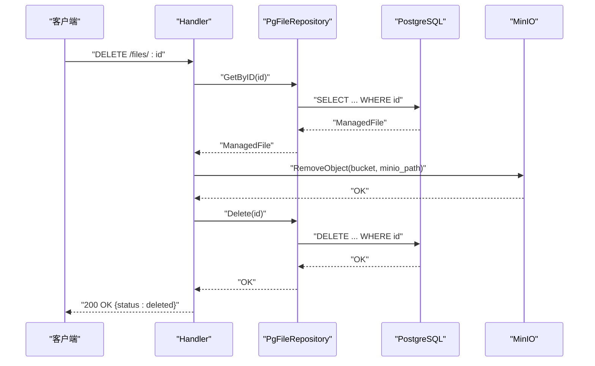
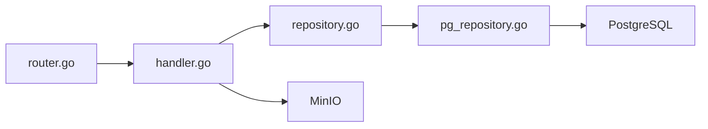

# 文件元数据管理

<cite>
**本文引用的文件**
- [model.go](file://omcgo/internal/filemanager/model.go)
- [repository.go](file://omcgo/internal/filemanager/repository.go)
- [pg_repository.go](file://omcgo/internal/filemanager/pg_repository.go)
- [handler.go](file://omcgo/internal/filemanager/handler.go)
- [router.go](file://omcgo/cmd/app/router/router.go)
- [000023_create_managed_files.up.sql](file://omcgo/migrations/000023_create_managed_files.up.sql)
- [000023_create_managed_files.down.sql](file://omcgo/migrations/000023_create_managed_files.down.sql)
- [fileApi.ts](file://omcmb/webcode/src/services/api/fileApi.ts)
- [fileApi.ts（前端）](file://omcmb/webcode/src/services/api/fileApi.ts)
- [fileApi.ts（前端）](file://omcmb/webcode/src/services/api/fileApi.ts)
- [fileApi.ts（前端）](file://omcmb/webcode/src/services/api/fileApi.ts)
- [fileApi.ts（前端）](file://omcmb/webcode/src/services/api/fileApi.ts)
- [fileApi.ts（前端）](file://omcmb/webcode/src/services/api/fileApi.ts)
- [fileApi.ts（前端）](file://omcmb/webcode/src/services/api/fileApi.ts)
- [fileApi.ts（前端）](file://omcmb/webcode/src/services/api/fileApi.ts)
- [fileApi.ts（前端）](file://omcmb/webcode/src/services/api/fileApi.ts)
- [fileApi.ts（前端）](file://omcmb/webcode/src/services/api/fileApi.ts)
- [fileApi.ts（前端）](file://omcmb/webcode/src/services/api/fileApi.ts)
- [fileApi.ts（前端）](file://omcmb/webcode/src/services/api/fileApi.ts)
- [fileApi.ts（前端）](file://omcmb/webcode/src/services/api/fileApi.ts)
- [fileApi.ts（前端）](file://omcmb/webcode/src/services/api/fileApi.ts)
- [fileApi.ts（前端）](file://omcmb/webcode/src/services/api/fileApi.ts)
- [fileApi.ts（前端）](file://omcmb/webcode/src/services/api/fileApi.ts)
- [fileApi.ts（前端）](file://omcmb/webcode/src/services/api/fileApi.ts)
- [fileApi.ts（前端）](file://omcmb/webcode/src/services/api/fileApi.ts)
- [fileApi.ts（前端）](file://omcmb/webcode/src/services/api/fileApi.ts)
- [fileApi.ts（前端）](file://omcmb/webcode/src/services/api/fileApi.ts)
- [fileApi.ts（前端）](file://omcmb/webcode/src/services/api/fileApi.ts)
- [fileApi.ts（前端）](file://omcmb/webcode/src/services/api/fileApi.ts)
- [fileApi.ts（前端）](file://omcmb/webcode/src/services/api/fileApi.ts)
- [fileApi.ts（前端）](file://om......)
</cite>

## 目录
1. [简介](#简介)
2. [项目结构](#项目结构)
3. [核心组件](#核心组件)
4. [架构总览](#架构总览)
5. [详细组件分析](#详细组件分析)
6. [依赖分析](#依赖分析)
7. [性能考虑](#性能考虑)
8. [故障排查指南](#故障排查指南)
9. [结论](#结论)
10. [附录](#附录)

## 简介
本文件围绕“文件元数据管理”功能，提供从数据模型、状态管理、类型分类、搜索过滤、数据库设计、索引策略到生命周期与清理策略的完整技术文档。该功能通过统一的数据模型与后端接口，结合对象存储与关系数据库，实现对各类文件（配置、日志、固件、脚本、其他）的元数据持久化、检索与分发。

## 项目结构
文件元数据管理相关代码主要位于后端模块 omcgo 的 internal/filemanager 包中，并在应用启动时注册路由；前端 webcode 提供与后端交互的 API 映射与过滤逻辑。



图表来源
- [router.go:264-268](file://omcgo/cmd/app/router/router.go#L264-L268)
- [handler.go:40-49](file://omcgo/internal/filemanager/handler.go#L40-L49)
- [repository.go:10-17](file://omcgo/internal/filemanager/repository.go#L10-L17)
- [pg_repository.go:27-35](file://omcgo/internal/filemanager/pg_repository.go#L27-L35)
- [model.go:31-54](file://omcgo/internal/filemanager/model.go#L31-L54)
- [fileApi.ts:127-151](file://omcmb/webcode/src/services/api/fileApi.ts#L127-L151)
- [000023_create_managed_files.up.sql:1-24](file://omcgo/migrations/000023_create_managed_files.up.sql#L1-L24)

章节来源
- [router.go:264-268](file://omcgo/cmd/app/router/router.go#L264-L268)
- [handler.go:40-49](file://omcgo/internal/filemanager/handler.go#L40-L49)
- [repository.go:10-17](file://omcgo/internal/filemanager/repository.go#L10-L17)
- [pg_repository.go:27-35](file://omcgo/internal/filemanager/pg_repository.go#L27-L35)
- [model.go:31-54](file://omcgo/internal/filemanager/model.go#L31-L54)
- [fileApi.ts:127-151](file://omcmb/webcode/src/services/api/fileApi.ts#L127-L151)
- [000023_create_managed_files.up.sql:1-24](file://omcgo/migrations/000023_create_managed_files.up.sql#L1-L24)

## 核心组件
- 数据模型与过滤器
  - ManagedFile：统一的文件元数据实体，包含标识、名称、类型、大小、存储路径、内容类型、上传者、设备序列号、状态、描述、创建与更新时间等字段。
  - FileType：文件类型枚举，支持 config、log、firmware、script、other。
  - FileStatus：文件状态枚举，支持 uploaded、processing、ready、failed。
  - FileFilter：查询过滤器，支持按 file_type、device_sn、status、search（文件名模糊匹配）以及分页排序参数。
- 仓储层
  - FileRepository 接口：定义创建、查询、更新、删除、分页列表等方法。
  - PgFileRepository：基于 PostgreSQL 的实现，使用 squirrel 构建 SQL，支持分页、排序与计数。
- HTTP 处理器
  - Handler：提供 /files 列表、上传、详情、删除、下载、分发等接口；负责与 MinIO 对象存储交互并维护元数据。
- 前端 API 映射
  - fileApi.ts：封装后端接口调用，负责参数映射（如 FileType、FileStatus）、分页与过滤、下载与分发等。

章节来源
- [model.go:10-54](file://omcgo/internal/filemanager/model.go#L10-L54)
- [repository.go:10-17](file://omcgo/internal/filemanager/repository.go#L10-L17)
- [pg_repository.go:37-193](file://omcgo/internal/filemanager/pg_repository.go#L37-L193)
- [handler.go:20-316](file://omcgo/internal/filemanager/handler.go#L20-L316)
- [fileApi.ts:127-151](file://omcmb/webcode/src/services/api/fileApi.ts#L127-L151)

## 架构总览
后端采用分层架构：路由层注册 API，处理器层协调 MinIO 与数据库，仓储层抽象数据访问，模型层定义数据结构与过滤条件。前端通过 fileApi.ts 与后端交互，实现文件上传、查询、下载与分发。



图表来源
- [handler.go:86-146](file://omcgo/internal/filemanager/handler.go#L86-L146)
- [handler.go:51-84](file://omcgo/internal/filemanager/handler.go#L51-L84)
- [handler.go:195-227](file://omcgo/internal/filemanager/handler.go#L195-L227)
- [pg_repository.go:122-193](file://omcgo/internal/filemanager/pg_repository.go#L122-L193)
- [router.go:264-268](file://omcgo/cmd/app/router/router.go#L264-L268)

## 详细组件分析

### 数据模型与状态机
- ManagedFile 字段
  - 标识与基础信息：ID、FileName、FileSize、ContentType、Description。
  - 存储与来源：MinIOPath、Uploader、DeviceSN。
  - 状态与时间：Status、CreatedAt、UpdatedAt。
- FileType 与 FileStatus
  - FileType：用于区分文件用途与处理策略。
  - FileStatus：用于跟踪文件生命周期中的处理阶段与结果。
- 状态转换
  - 上传成功后默认进入 ready 状态，便于后续分发。
  - 处理中可标记 processing，失败标记 failed，未处理或待上传标记 uploaded。
- 过滤器 FileFilter
  - 支持按 FileType、DeviceSN、Status、Search（文件名模糊匹配）进行筛选。
  - 支持分页与排序（默认按 created_at 降序）。

```mermaid
classDiagram
class ManagedFile {
+ID : uuid
+FileName : string
+FileType : FileType
+FileSize : int64
+MinIOPath : string
+ContentType : string
+Uploader : *string
+DeviceSN : *string
+Status : FileStatus
+Description : *string
+CreatedAt : time
+UpdatedAt : time
}
class FileFilter {
+FileType : *FileType
+DeviceSN : *string
+Status : *FileStatus
+Search : *string
+ListRequest
}
class FileType {
<<enumeration>>
"config"
"log"
"firmware"
"script"
"other"
}
class FileStatus {
<<enumeration>>
"uploaded"
"processing"
"ready"
"failed"
}
ManagedFile --> FileType : "使用"
ManagedFile --> FileStatus : "使用"
FileFilter --> FileType : "筛选"
FileFilter --> FileStatus : "筛选"
```

图表来源
- [model.go:31-54](file://omcgo/internal/filemanager/model.go#L31-L54)

章节来源
- [model.go:10-54](file://omcgo/internal/filemanager/model.go#L10-L54)

### 仓储层与数据库设计
- 表结构 managed_files
  - 主键：id（UUID，默认生成）
  - 字段：file_name、file_type、file_size、minio_path、content_type、uploader、device_sn、status、description、created_at、updated_at
  - 默认值与约束：file_type 默认 other，status 默认 uploaded，file_size 默认 0，content_type 默认二进制类型，其余字段允许空值。
- 索引策略
  - idx_managed_files_type：按 file_type 查询与聚合。
  - idx_managed_files_status：按状态过滤。
  - idx_managed_files_device：按设备序列号过滤。
  - idx_managed_files_created：按时间倒序分页。
  - 触发器：update_updated_at_column() 自动更新 updated_at。
- 查询优化
  - 使用 squirrel 构造 SQL，支持动态 WHERE 条件与 ILIKE 模糊匹配。
  - 分页与排序通过 LIMIT/OFFSET 与 ORDER BY 实现，避免一次性加载全量数据。
  - 计数查询与主查询分离，减少重复扫描。



图表来源
- [000023_create_managed_files.up.sql:1-24](file://omcgo/migrations/000023_create_managed_files.up.sql#L1-L24)

章节来源
- [pg_repository.go:18-22](file://omcgo/internal/filemanager/pg_repository.go#L18-L22)
- [pg_repository.go:122-193](file://omcgo/internal/filemanager/pg_repository.go#L122-L193)
- [000023_create_managed_files.up.sql:1-24](file://omcgo/migrations/000023_create_managed_files.up.sql#L1-L24)

### HTTP 处理器与业务流程
- 路由注册
  - /api/v1/files：列表、上传、详情、删除、下载、分发。
- 上传流程
  - 解析 multipart 表单，构建 MinIO 路径（按类型与日期组织），上传对象存储，保存元数据至数据库。
- 列表与过滤
  - 绑定分页与排序参数，按 file_type、device_sn、status、search（文件名模糊）过滤，返回分页响应。
- 下载流程
  - 获取元数据，从 MinIO 读取对象流，设置响应头并直接输出。
- 删除流程
  - 先从 MinIO 删除对象，再删除数据库记录。
- 分发流程
  - 将文件分发为 TR-069 下载命令，映射 FileType 至 TR-069 文件类型码，批量推送到命令队列。



图表来源
- [handler.go:165-193](file://omcgo/internal/filemanager/handler.go#L165-L193)
- [pg_repository.go:104-120](file://omcgo/internal/filemanager/pg_repository.go#L104-L120)

章节来源
- [handler.go:40-49](file://omcgo/internal/filemanager/handler.go#L40-L49)
- [handler.go:86-146](file://omcgo/internal/filemanager/handler.go#L86-L146)
- [handler.go:148-193](file://omcgo/internal/filemanager/handler.go#L148-L193)
- [handler.go:195-227](file://omcgo/internal/filemanager/handler.go#L195-L227)
- [handler.go:234-303](file://omcgo/internal/filemanager/handler.go#L234-L303)

### 前端交互与过滤
- FileType 映射
  - 后端支持 config、log、firmware、script、other；前端部分类型映射为 other，其余保持一致。
- FileStatus 映射
  - 后端状态 uploaded、processing、ready、failed；前端映射为 available、uploading、processing、expired、deleted。
- 过滤参数
  - 前端将 fileType、status、keyword、deviceSn 映射为后端查询参数 file_type、status、search、device_sn。
- 下载与分发
  - 下载通过 blob 流方式获取并触发浏览器下载；分发提交设备序列号列表，返回任务 ID 与统计结果。

章节来源
- [fileApi.ts:43-86](file://omcmb/webcode/src/services/api/fileApi.ts#L43-L86)
- [fileApi.ts:127-151](file://omcmb/webcode/src/services/api/fileApi.ts#L127-L151)
- [fileApi.ts:191-221](file://omcmb/webcode/src/services/api/fileApi.ts#L191-L221)

## 依赖分析
- 组件耦合
  - Handler 依赖 FileRepository 接口，便于替换存储实现。
  - PgFileRepository 依赖 pgx 连接池与 squirrel SQL 构建器。
  - 路由层在启动时注入仓库实例并注册文件管理路由。
- 外部依赖
  - MinIO 客户端用于对象存储读写。
  - PostgreSQL 作为元数据存储，配合索引与触发器提升查询与审计效率。
- 可能的循环依赖
  - 未发现直接循环依赖；各层职责清晰，接口抽象良好。



图表来源
- [router.go:264-268](file://omcgo/cmd/app/router/router.go#L264-L268)
- [handler.go:20-37](file://omcgo/internal/filemanager/handler.go#L20-L37)
- [repository.go:10-17](file://omcgo/internal/filemanager/repository.go#L10-L17)
- [pg_repository.go:27-35](file://omcgo/internal/filemanager/pg_repository.go#L27-L35)

章节来源
- [router.go:264-268](file://omcgo/cmd/app/router/router.go#L264-L268)
- [handler.go:20-37](file://omcgo/internal/filemanager/handler.go#L20-L37)
- [repository.go:10-17](file://omcgo/internal/filemanager/repository.go#L10-L17)
- [pg_repository.go:27-35](file://omcgo/internal/filemanager/pg_repository.go#L27-L35)

## 性能考虑
- 查询性能
  - 为 file_type、status、device_sn、created_at 建立索引，满足高频过滤与分页排序需求。
  - 使用 COUNT(*) 与主查询分离，避免重复扫描。
- 写入性能
  - 批量分发时逐台推送命令，建议在命令队列侧做背压与重试控制。
- 存储性能
  - MinIO 上传采用流式写入，避免大文件内存占用。
- 分页与排序
  - 默认按 created_at 降序，避免无序扫描；分页参数受 ListRequest 限制，防止超大数据集一次性返回。

章节来源
- [000023_create_managed_files.up.sql:15-18](file://omcgo/migrations/000023_create_managed_files.up.sql#L15-L18)
- [pg_repository.go:144-167](file://omcgo/internal/filemanager/pg_repository.go#L144-L167)
- [handler.go:111-118](file://omcgo/internal/filemanager/handler.go#L111-L118)

## 故障排查指南
- 常见错误与处理
  - 无效 UUID：解析失败返回 400。
  - 记录不存在：查询返回 Not Found 错误。
  - MinIO 删除失败：记录删除仍继续，但会记录警告日志。
  - 上传失败：返回 500 并记录错误日志。
- 日志与可观测性
  - Handler 使用 zap 日志库记录关键事件（上传、下载、删除、分发）。
- 前端提示
  - 下载过程中若流式传输失败，无法返回 JSON 错误，需检查网络与服务端日志。

章节来源
- [handler.go:150-159](file://omcgo/internal/filemanager/handler.go#L150-L159)
- [handler.go:173-190](file://omcgo/internal/filemanager/handler.go#L173-L190)
- [handler.go:210-226](file://omcgo/internal/filemanager/handler.go#L210-L226)

## 结论
文件元数据管理通过清晰的数据模型、稳定的仓储与处理器实现、完善的前端映射与过滤，形成了可扩展、可维护的文件生命周期管理体系。数据库层面的索引与触发器提升了查询与审计效率；对象存储与关系数据库的组合兼顾了性能与可靠性。建议在生产环境中结合命令队列的重试与限速策略，进一步增强分发稳定性。

## 附录

### 数据库迁移与清理策略
- 创建表
  - 通过迁移脚本创建 managed_files 表并建立必要索引。
- 清理策略
  - 建议结合业务需求制定定期清理策略（如按时间或数量阈值），清理前先从 MinIO 删除对象，再删除数据库记录，确保一致性。

章节来源
- [000023_create_managed_files.up.sql:1-24](file://omcgo/migrations/000023_create_managed_files.up.sql#L1-L24)
- [000023_create_managed_files.down.sql:1-2](file://omcgo/migrations/000023_create_managed_files.down.sql#L1-L2)