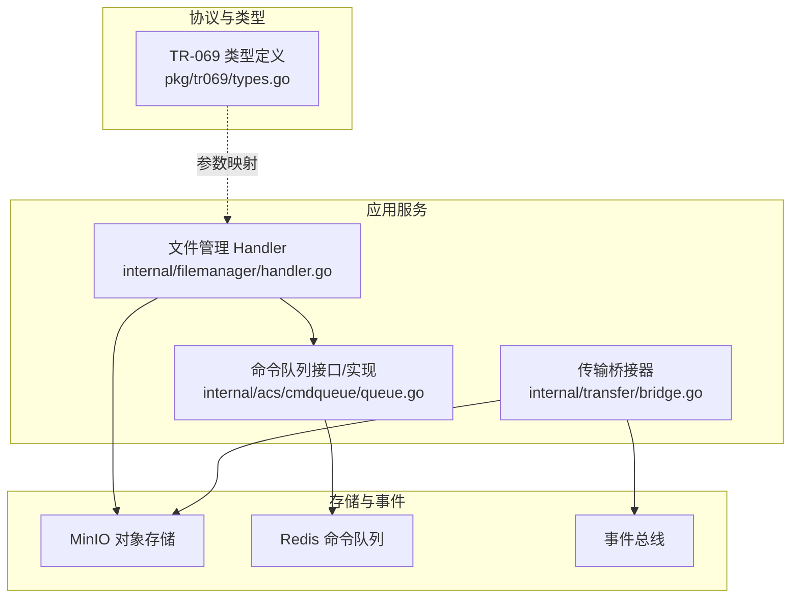
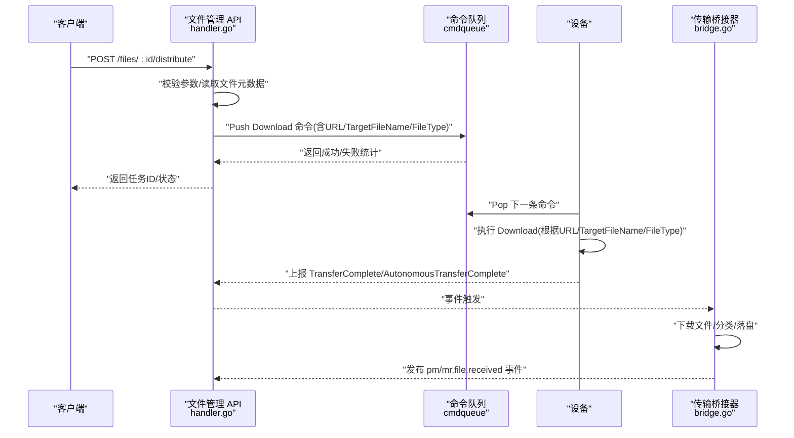
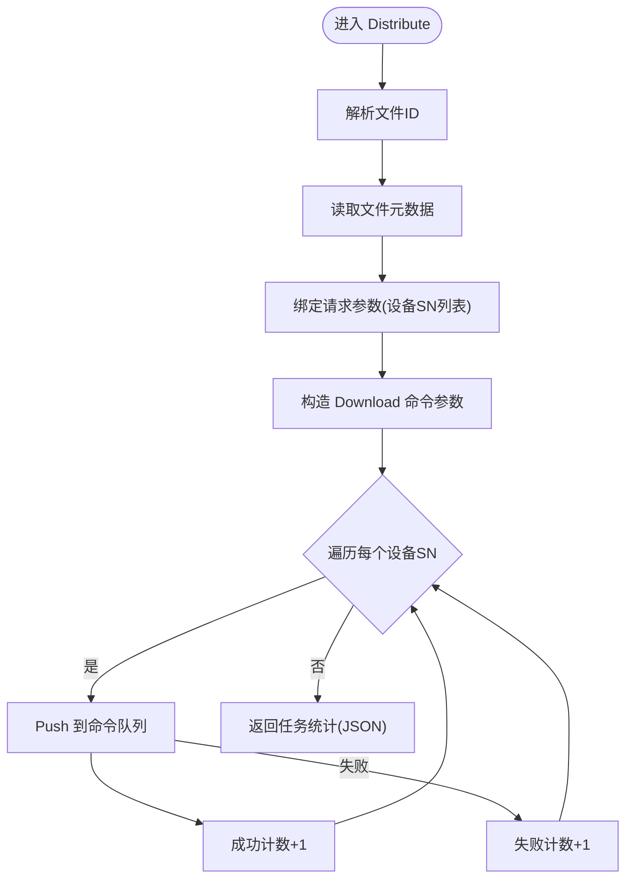
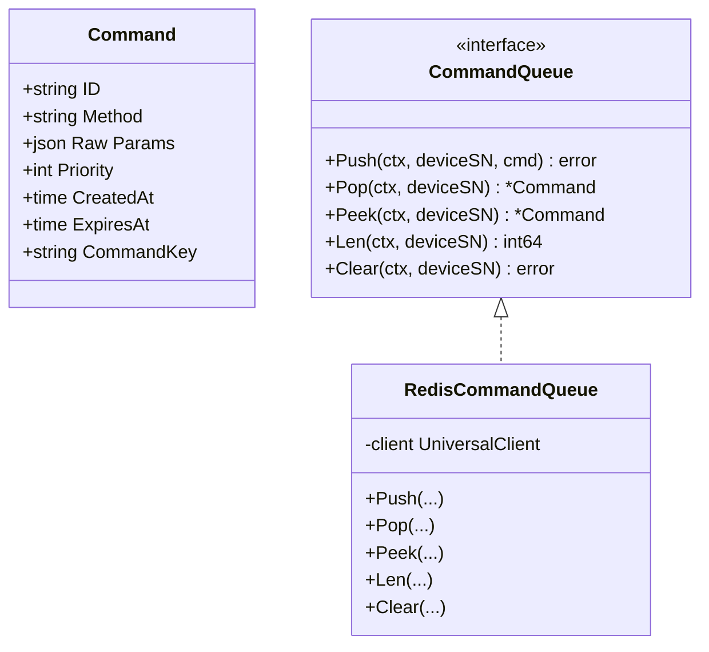
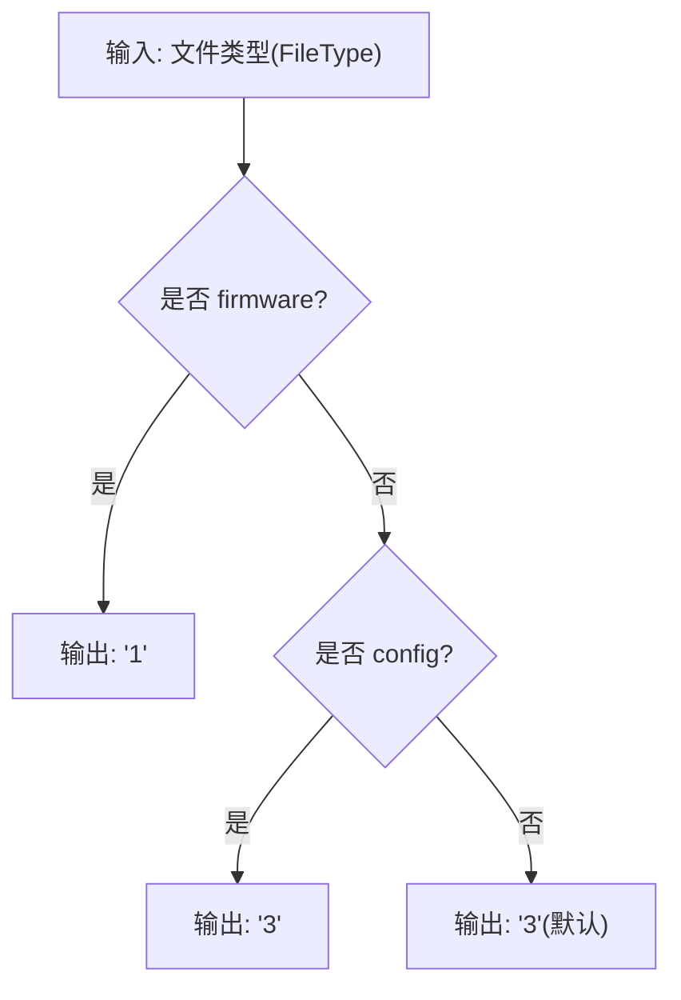
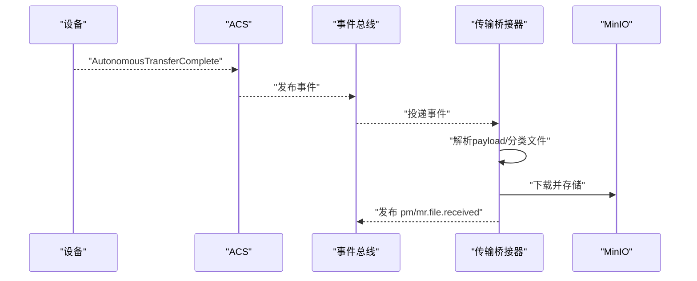
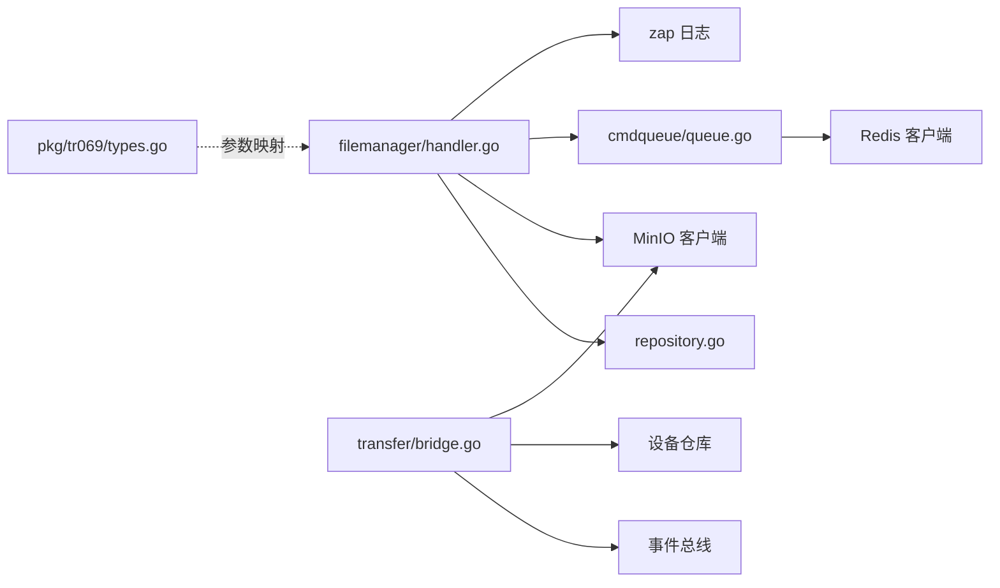

# 文件分发机制

<cite>
**本文引用的文件**
- [omcgo/internal/filemanager/handler.go](file://omcgo/internal/filemanager/handler.go)
- [omcgo/internal/filemanager/model.go](file://omcgo/internal/filemanager/model.go)
- [omcgo/internal/filemanager/repository.go](file://omcgo/internal/filemanager/repository.go)
- [omcgo/internal/acs/cmdqueue/queue.go](file://omcgo/internal/acs/cmdqueue/queue.go)
- [omcgo/pkg/tr069/types.go](file://omcgo/pkg/tr069/types.go)
- [omcgo/internal/transfer/bridge.go](file://omcgo/internal/transfer/bridge.go)
- [omcgo/docs/reports/file-transfer-implementation-plan.md](file://omcgo/docs/reports/file-transfer-implementation-plan.md)
- [omcgo/docs/reports/kpi-file-transfer-analysis.md](file://omcgo/docs/reports/kpi-file-transfer-analysis.md)
- [omcgo/docs/reports/file-transfer-completion-report.md](file://omcgo/docs/reports/file-transfer-completion-report.md)
- [omcgo/scripts/e2e_verify.sh](file://omcgo/scripts/e2e_verify.sh)
- [omcmb/webcode/src/services/api/fileApi.ts](file://omcmb/webcode/src/services/api/fileApi.ts)
</cite>

## 目录
1. [简介](#简介)
2. [项目结构](#项目结构)
3. [核心组件](#核心组件)
4. [架构概览](#架构概览)
5. [详细组件分析](#详细组件分析)
6. [依赖分析](#依赖分析)
7. [性能考量](#性能考量)
8. [故障排查指南](#故障排查指南)
9. [结论](#结论)
10. [附录](#附录)

## 简介
本文件面向“文件分发机制”的技术文档，聚焦于以下目标：
- 解释文件分发的工作流程：设备选择、命令队列管理、批量分发策略
- 详述 TR-069 Download 命令实现：参数映射、FileType 转换、URL 构建
- 说明命令队列的优先级管理、重试机制与失败处理
- 说明分发任务的状态跟踪、进度监控与结果统计
- 提供分发 API 使用示例、批量操作最佳实践与性能调优建议
- 包含错误处理、超时管理与回滚机制

## 项目结构
围绕文件分发的相关模块主要分布在以下位置：
- 文件管理 API 层：负责接收分发请求、校验参数、构造 TR-069 Download 命令并推送到命令队列
- 命令队列层：基于 Redis 的有序集合实现，支持优先级、过期与并发安全弹出
- TR-069 类型定义：Download 请求/响应结构体，用于参数映射与序列化
- 传输桥接层：处理设备自主传输完成事件，将文件落地至 MinIO 并触发下游处理
- 文档与验收：实现计划、分析报告与端到端脚本，验证分发链路

**图表来源**
- [omcgo/internal/filemanager/handler.go:40-49](file://omcgo/internal/filemanager/handler.go#L40-L49)
- [omcgo/internal/acs/cmdqueue/queue.go:39-72](file://omcgo/internal/acs/cmdqueue/queue.go#L39-L72)
- [omcgo/pkg/tr069/types.go:104-123](file://omcgo/pkg/tr069/types.go#L104-L123)
- [omcgo/internal/transfer/bridge.go:54-67](file://omcgo/internal/transfer/bridge.go#L54-L67)

**章节来源**
- [omcgo/internal/filemanager/handler.go:40-49](file://omcgo/internal/filemanager/handler.go#L40-L49)
- [omcgo/internal/acs/cmdqueue/queue.go:39-72](file://omcgo/internal/acs/cmdqueue/queue.go#L39-L72)
- [omcgo/pkg/tr069/types.go:104-123](file://omcgo/pkg/tr069/types.go#L104-L123)
- [omcgo/internal/transfer/bridge.go:54-67](file://omcgo/internal/transfer/bridge.go#L54-L67)

## 核心组件
- 文件管理 Handler：提供 REST API，接收分发请求，构造 Download 命令并推送到命令队列；统计成功/失败数量并返回任务状态
- 命令队列：以 Redis 有序集合实现，支持按优先级与时间戳排序，具备过期跳过与并发安全弹出
- TR-069 类型：Download 请求结构体，定义 FileType、URL、TargetFileName 等字段，用于参数映射
- 传输桥接器：订阅设备自主传输完成事件，下载文件并落盘至 MinIO，发布下游事件

**章节来源**
- [omcgo/internal/filemanager/handler.go:234-303](file://omcgo/internal/filemanager/handler.go#L234-L303)
- [omcgo/internal/acs/cmdqueue/queue.go:13-31](file://omcgo/internal/acs/cmdqueue/queue.go#L13-L31)
- [omcgo/pkg/tr069/types.go:104-123](file://omcgo/pkg/tr069/types.go#L104-L123)
- [omcgo/internal/transfer/bridge.go:83-209](file://omcgo/internal/transfer/bridge.go#L83-L209)

## 架构概览
下图展示从 API 到设备的完整分发链路：API 接收请求 → 构造 Download 命令 → 推送命令队列 → 设备侧拉取执行 → 设备上报传输完成 → 桥接器落地文件并触发下游。

**图表来源**
- [omcgo/internal/filemanager/handler.go:234-303](file://omcgo/internal/filemanager/handler.go#L234-L303)
- [omcgo/internal/acs/cmdqueue/queue.go:74-110](file://omcgo/internal/acs/cmdqueue/queue.go#L74-L110)
- [omcgo/internal/transfer/bridge.go:83-209](file://omcgo/internal/transfer/bridge.go#L83-L209)
- [omcgo/pkg/tr069/types.go:104-123](file://omcgo/pkg/tr069/types.go#L104-L123)

## 详细组件分析

### 文件分发 API（POST /files/:id/distribute）
- 输入：文件 ID、设备序列号数组
- 处理：
  - 校验文件存在性与请求参数
  - 从存储读取文件元数据（名称、大小、类型、MinIO 路径）
  - 构造 Download 命令参数：CommandKey（任务ID）、FileType（映射）、URL（minio://bucket/path）、TargetFileName
  - 逐台设备推送命令到 Redis 队列，统计成功/失败数量
- 输出：任务ID、文件ID、设备总数、成功数、失败数、状态（queued）

**图表来源**
- [omcgo/internal/filemanager/handler.go:234-303](file://omcgo/internal/filemanager/handler.go#L234-L303)

**章节来源**
- [omcgo/internal/filemanager/handler.go:234-303](file://omcgo/internal/filemanager/handler.go#L234-L303)
- [omcgo/docs/reports/file-transfer-implementation-plan.md:465-513](file://omcgo/docs/reports/file-transfer-implementation-plan.md#L465-L513)

### 命令队列（Redis 有序集合）
- 数据结构：以设备SN为键，值为命令JSON，分数用于排序
- 排序规则：priority*1e12 + 时间戳（纳秒转秒），同优先级按时间先后
- 弹出策略：循环弹出最高优先级命令，遇到过期则跳过，最多尝试100次避免死循环
- 并发控制：ZREM 成功才视为取出，否则重试下一个

**图表来源**
- [omcgo/internal/acs/cmdqueue/queue.go:13-31](file://omcgo/internal/acs/cmdqueue/queue.go#L13-L31)
- [omcgo/internal/acs/cmdqueue/queue.go:39-134](file://omcgo/internal/acs/cmdqueue/queue.go#L39-L134)

**章节来源**
- [omcgo/internal/acs/cmdqueue/queue.go:49-110](file://omcgo/internal/acs/cmdqueue/queue.go#L49-L110)

### TR-069 Download 命令实现
- 参数映射：
  - CommandKey：任务ID（用于关联批次）
  - FileType：根据文件类型映射为 TR-069 代码
  - URL：minio://bucket/path
  - TargetFileName：文件名
- FileType 映射：
  - firmware → "1"
  - config → "3"
  - 其他 → "3"
- URL 构建：基于 MinIO 存储桶与对象路径

**图表来源**
- [omcgo/internal/filemanager/handler.go:305-315](file://omcgo/internal/filemanager/handler.go#L305-L315)
- [omcgo/pkg/tr069/types.go:104-123](file://omcgo/pkg/tr069/types.go#L104-L123)

**章节来源**
- [omcgo/internal/filemanager/handler.go:260-276](file://omcgo/internal/filemanager/handler.go#L260-L276)
- [omcgo/internal/filemanager/handler.go:305-315](file://omcgo/internal/filemanager/handler.go#L305-L315)
- [omcgo/pkg/tr069/types.go:104-123](file://omcgo/pkg/tr069/types.go#L104-L123)

### 传输桥接器（设备自主传输完成）
- 订阅事件：device.inform.autonomous_transfer_complete
- 处理流程：
  - 解析 payload（设备SN、传输URL、文件类型、目标文件名等）
  - 跳过故障或空URL
  - 查询设备信息，分类文件类型（PM/MR/Log）
  - 下载文件并存储到对应 MinIO 桶
  - 发布 pm.file.received 或 mr.file.received 事件

**图表来源**
- [omcgo/internal/transfer/bridge.go:54-67](file://omcgo/internal/transfer/bridge.go#L54-L67)
- [omcgo/internal/transfer/bridge.go:83-209](file://omcgo/internal/transfer/bridge.go#L83-L209)

**章节来源**
- [omcgo/internal/transfer/bridge.go:83-209](file://omcgo/internal/transfer/bridge.go#L83-L209)

### 状态跟踪、进度监控与结果统计
- API 层统计：成功/失败计数、任务ID、状态（queued）
- 验收与端到端验证：脚本检查任务ID、设备数量、状态字段
- 前端 API 封装：提供 distribute 调用，返回任务ID

**章节来源**
- [omcgo/internal/filemanager/handler.go:288-302](file://omcgo/internal/filemanager/handler.go#L288-L302)
- [omcgo/docs/reports/file-transfer-completion-report.md:181-196](file://omcgo/docs/reports/file-transfer-completion-report.md#L181-L196)
- [omcgo/scripts/e2e_verify.sh:4283-4307](file://omcgo/scripts/e2e_verify.sh#L4283-L4307)
- [omcmb/webcode/src/services/api/fileApi.ts:215-221](file://omcmb/webcode/src/services/api/fileApi.ts#L215-L221)

## 依赖分析
- 文件管理 Handler 依赖：
  - 文件仓库接口（持久化）
  - MinIO 客户端（对象存储）
  - 命令队列接口（设备命令调度）
  - 日志组件（记录分发统计）
- 命令队列依赖 Redis 客户端
- TR-069 类型定义独立，供参数映射与序列化使用
- 传输桥接器依赖事件总线、设备仓库、MinIO 客户端

**图表来源**
- [omcgo/internal/filemanager/handler.go:15-37](file://omcgo/internal/filemanager/handler.go#L15-L37)
- [omcgo/internal/acs/cmdqueue/queue.go:3-11](file://omcgo/internal/acs/cmdqueue/queue.go#L3-L11)
- [omcgo/internal/transfer/bridge.go:14-30](file://omcgo/internal/transfer/bridge.go#L14-L30)
- [omcgo/pkg/tr069/types.go:3-4](file://omcgo/pkg/tr069/types.go#L3-L4)

**章节来源**
- [omcgo/internal/filemanager/handler.go:15-37](file://omcgo/internal/filemanager/handler.go#L15-L37)
- [omcgo/internal/acs/cmdqueue/queue.go:3-11](file://omcgo/internal/acs/cmdqueue/queue.go#L3-L11)
- [omcgo/internal/transfer/bridge.go:14-30](file://omcgo/internal/transfer/bridge.go#L14-L30)
- [omcgo/pkg/tr069/types.go:3-4](file://omcgo/pkg/tr069/types.go#L3-L4)

## 性能考量
- 批量分发策略
  - 单次请求逐台推送命令，避免一次性大量并发导致队列压力
  - 建议前端分批提交（例如每批 50~100 台），结合任务ID轮询统计结果
- 队列优先级
  - 默认优先级适中，紧急任务可提升优先级；注意避免破坏 FIFO
- 超时与重试
  - 设备侧执行超时由设备端控制；服务端可通过命令过期时间避免堆积
  - 弹出循环最多尝试100次，防止无限阻塞
- 存储与网络
  - MinIO URL 采用内网域名或直连，减少公网抖动
  - 大文件分发建议评估带宽与并发，必要时拆分或压缩

[本节为通用性能建议，无需特定文件引用]

## 故障排查指南
- 常见错误与定位
  - 命令队列未配置：返回 500，提示未配置
  - 设备SN无效或不存在：命令推送失败，记录警告日志
  - MinIO 下载失败：检查对象路径与权限
- 端到端验证
  - 使用脚本验证响应字段（task_id、device_count、status）
- 前端交互
  - 调用 distribute 接口后，依据返回的任务ID轮询后端任务状态

**章节来源**
- [omcgo/internal/filemanager/handler.go:254-257](file://omcgo/internal/filemanager/handler.go#L254-L257)
- [omcgo/internal/filemanager/handler.go:277-284](file://omcgo/internal/filemanager/handler.go#L277-L284)
- [omcgo/scripts/e2e_verify.sh:4283-4307](file://omcgo/scripts/e2e_verify.sh#L4283-L4307)
- [omcmb/webcode/src/services/api/fileApi.ts:215-221](file://omcmb/webcode/src/services/api/fileApi.ts#L215-L221)

## 结论
文件分发机制通过“REST API + 命令队列 + TR-069 Download + 传输桥接器”形成闭环：API 层负责参数校验与命令构造，队列层保证可靠投递，设备侧执行并上报，桥接器完成文件落地与事件驱动。当前实现已覆盖核心链路并通过验收与端到端脚本验证，后续可在设备侧 Worker 与回滚策略方面进一步完善。

[本节为总结性内容，无需特定文件引用]

## 附录

### 分发 API 使用示例（REST）
- 请求
  - 方法：POST
  - 路径：/api/v1/files/{id}/distribute
  - 请求体：包含设备序列号数组
- 响应
  - 返回任务ID、文件ID、设备总数、成功数、失败数、状态（queued）

**章节来源**
- [omcgo/internal/filemanager/handler.go:234-303](file://omcgo/internal/filemanager/handler.go#L234-L303)
- [omcgo/docs/reports/file-transfer-completion-report.md:181-196](file://omcgo/docs/reports/file-transfer-completion-report.md#L181-L196)

### 批量操作最佳实践
- 分批提交：避免单次推送过多设备
- 任务追踪：使用任务ID轮询统计结果
- 错误隔离：对失败设备单独处理或重试

**章节来源**
- [omcgo/internal/filemanager/handler.go:263-286](file://omcgo/internal/filemanager/handler.go#L263-L286)

### 性能调优建议
- 控制并发：合理设置队列弹出速率与设备执行并发
- 优化存储：使用就近 MinIO 节点，启用压缩或分片
- 监控告警：对命令积压、失败率、下载耗时建立阈值告警

[本节为通用建议，无需特定文件引用]

### 回滚机制
- 当前实现未包含自动回滚逻辑；建议在设备侧 Download 失败时，结合命令过期与重试策略，必要时通过 Upload 命令回传状态或人工介入

[本节为概念性建议，无需特定文件引用]