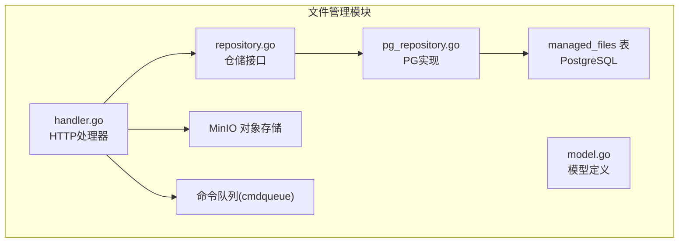
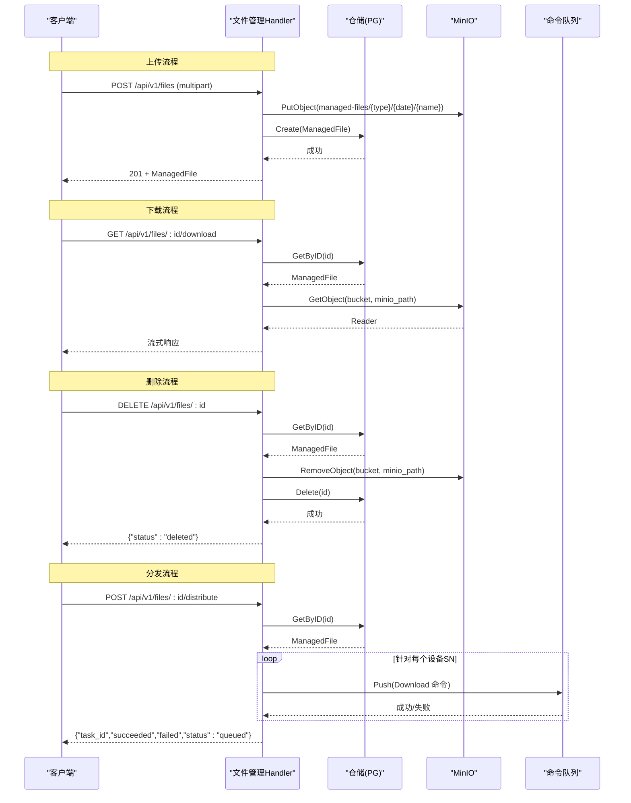
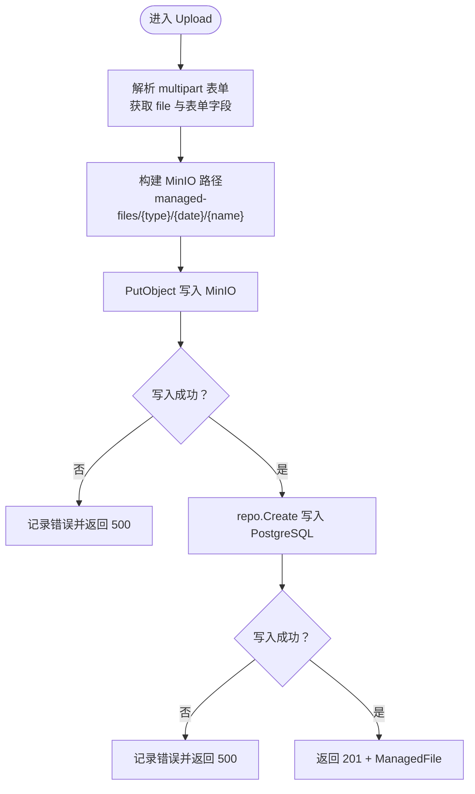
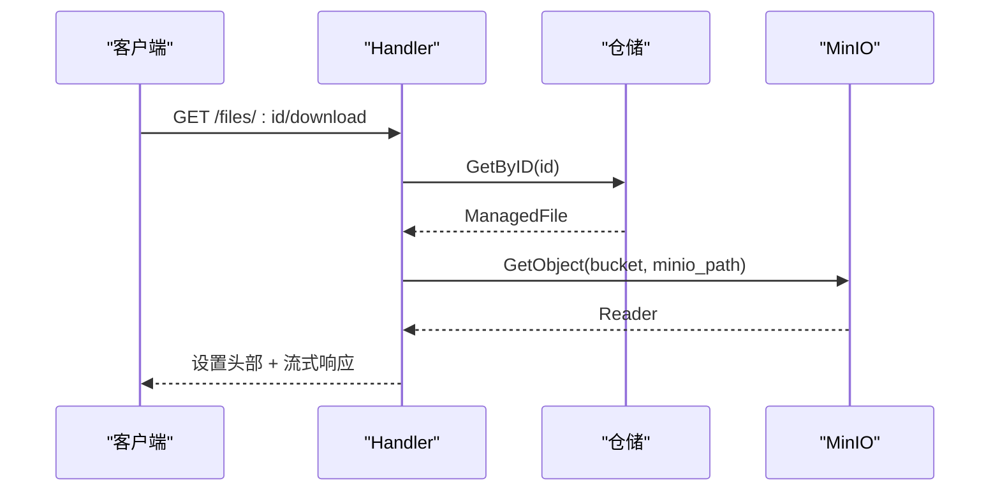
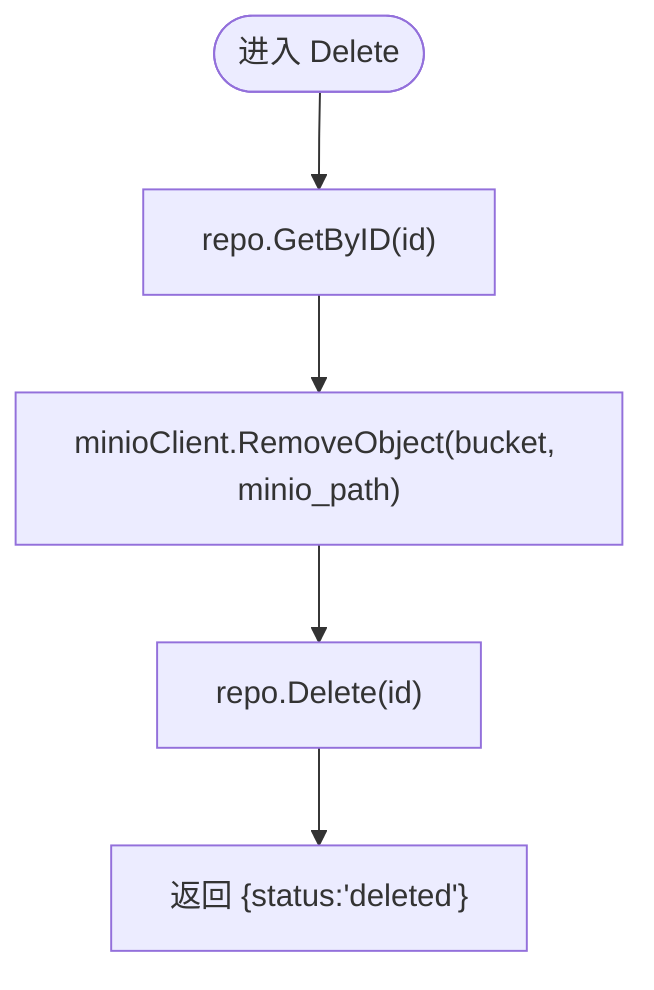
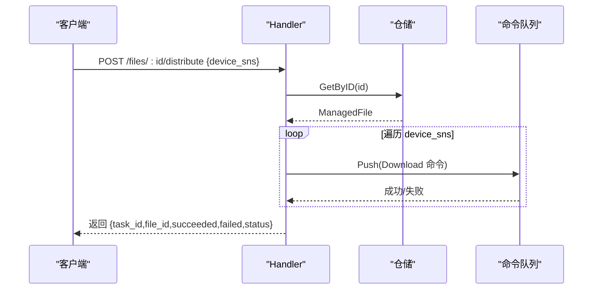
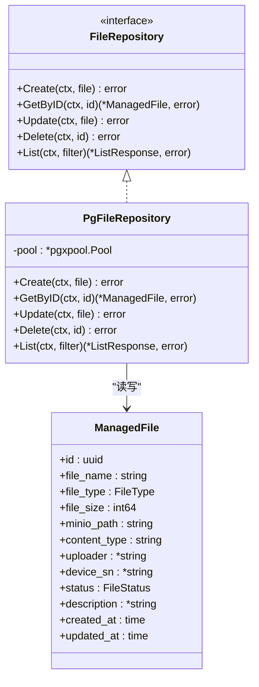
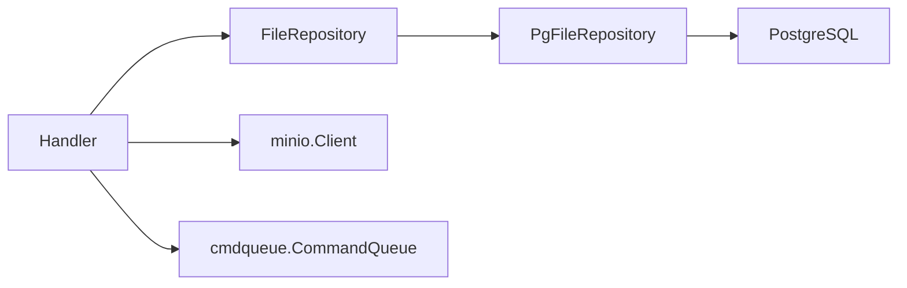

# 文件管理模块

<cite>
**本文引用的文件**
- [omcgo/internal/filemanager/handler.go](file://omcgo/internal/filemanager/handler.go)
- [omcgo/internal/filemanager/model.go](file://omcgo/internal/filemanager/model.go)
- [omcgo/internal/filemanager/repository.go](file://omcgo/internal/filemanager/repository.go)
- [omcgo/internal/filemanager/pg_repository.go](file://omcgo/internal/filemanager/pg_repository.go)
- [omcgo/migrations/000023_create_managed_files.up.sql](file://omcgo/migrations/000023_create_managed_files.up.sql)
- [omcgo/docs/reports/kpi-file-transfer-analysis.md](file://omcgo/docs/reports/kpi-file-transfer-analysis.md)
- [omcgo/docs/reports/file-transfer-implementation-plan.md](file://omcgo/docs/reports/file-transfer-implementation-plan.md)
- [omcgo/internal/core/appconfig/config.go](file://omcgo/internal/core/appconfig/config.go)
- [omcgo/internal/admin/middleware.go](file://omcgo/internal/admin/middleware.go)
- [omcgo/internal/acs/cmdqueue/queue.go](file://omcgo/internal/acs/cmdqueue/queue.go)
- [omcgo/internal/core/components/minio/minio.go](file://omcgo/internal/core/components/minio/minio.go)
</cite>

## 目录
1. [简介](#简介)
2. [项目结构](#项目结构)
3. [核心组件](#核心组件)
4. [架构总览](#架构总览)
5. [详细组件分析](#详细组件分析)
6. [依赖关系分析](#依赖关系分析)
7. [性能考虑](#性能考虑)
8. [故障排除指南](#故障排除指南)
9. [结论](#结论)
10. [附录](#附录)

## 简介
本文件管理模块提供统一的文件上传、下载、删除、分发能力，并与 TR-069 下载命令队列集成，实现文件向设备的批量分发。文件采用对象存储（MinIO）进行持久化，元数据存储于 PostgreSQL managed_files 表。模块支持文件类型分类、基础权限控制与审计日志，同时具备与设备侧传输事件的桥接能力（见实施方案文档）。

## 项目结构
文件管理模块位于后端工程的 internal/filemanager 目录，包含以下关键文件：
- handler.go：HTTP REST 接口与业务流程编排
- model.go：文件类型、状态与查询过滤模型
- repository.go：抽象仓储接口
- pg_repository.go：PostgreSQL 仓储实现
- migrations/000023_create_managed_files.up.sql：managed_files 表结构迁移

图表来源
- [omcgo/internal/filemanager/handler.go:41-49](file://omcgo/internal/filemanager/handler.go#L41-L49)
- [omcgo/internal/filemanager/pg_repository.go:24-36](file://omcgo/internal/filemanager/pg_repository.go#L24-L36)
- [omcgo/migrations/000023_create_managed_files.up.sql:1-24](file://omcgo/migrations/000023_create_managed_files.up.sql#L1-L24)

章节来源
- [omcgo/internal/filemanager/handler.go:1-316](file://omcgo/internal/filemanager/handler.go#L1-L316)
- [omcgo/internal/filemanager/model.go:1-55](file://omcgo/internal/filemanager/model.go#L1-L55)
- [omcgo/internal/filemanager/repository.go:1-18](file://omcgo/internal/filemanager/repository.go#L1-L18)
- [omcgo/internal/filemanager/pg_repository.go:1-237](file://omcgo/internal/filemanager/pg_repository.go#L1-L237)
- [omcgo/migrations/000023_create_managed_files.up.sql:1-24](file://omcgo/migrations/000023_create_managed_files.up.sql#L1-L24)

## 核心组件
- Handler：封装 HTTP 路由与业务处理，负责上传、下载、删除、分发、查询等操作；与 MinIO、PostgreSQL、命令队列交互。
- Model：定义文件类型、状态、分页查询过滤等数据结构。
- Repository 接口与 PgFileRepository：抽象与实现分离，便于替换存储后端。
- 配置与中间件：应用配置（MinIO Bucket）、鉴权与权限中间件、审计日志中间件。

章节来源
- [omcgo/internal/filemanager/handler.go:20-38](file://omcgo/internal/filemanager/handler.go#L20-L38)
- [omcgo/internal/filemanager/model.go:10-55](file://omcgo/internal/filemanager/model.go#L10-L55)
- [omcgo/internal/filemanager/repository.go:10-18](file://omcgo/internal/filemanager/repository.go#L10-L18)
- [omcgo/internal/filemanager/pg_repository.go:24-36](file://omcgo/internal/filemanager/pg_repository.go#L24-L36)
- [omcgo/internal/admin/middleware.go:21-101](file://omcgo/internal/admin/middleware.go#L21-L101)

## 架构总览
文件管理模块的端到端流程包括：
- 上传：客户端以 multipart/form-data 提交文件，服务端写入 MinIO 并在 PostgreSQL 记录元数据。
- 下载：根据文件 ID 从 PostgreSQL 查询元数据，再从 MinIO 流式返回文件。
- 删除：先删除 MinIO 对象，再删除数据库记录。
- 分发：将文件分发请求转换为 TR-069 Download 命令，推送到设备命令队列。

图表来源
- [omcgo/internal/filemanager/handler.go:86-146](file://omcgo/internal/filemanager/handler.go#L86-L146)
- [omcgo/internal/filemanager/handler.go:195-227](file://omcgo/internal/filemanager/handler.go#L195-L227)
- [omcgo/internal/filemanager/handler.go:165-193](file://omcgo/internal/filemanager/handler.go#L165-L193)
- [omcgo/internal/filemanager/handler.go:234-303](file://omcgo/internal/filemanager/handler.go#L234-L303)
- [omcgo/internal/filemanager/pg_repository.go:37-75](file://omcgo/internal/filemanager/pg_repository.go#L37-L75)
- [omcgo/internal/acs/cmdqueue/queue.go](file://omcgo/internal/acs/cmdqueue/queue.go)

## 详细组件分析

### 上传处理（Upload）
- 请求体：multipart/form-data，必填字段为 file；可选 file_type、description、device_sn、uploader。
- MinIO 路径：managed-files/{file_type}/{YYYY-MM-DD}/{filename}，便于按类型与日期归档。
- 元数据入库：记录文件名、类型、大小、内容类型、上传者、设备序列号、状态、描述、创建/更新时间。
- 错误处理：缺失文件、存储写入失败、数据库写入失败均返回相应 HTTP 状态码。

图表来源
- [omcgo/internal/filemanager/handler.go:86-146](file://omcgo/internal/filemanager/handler.go#L86-L146)
- [omcgo/internal/filemanager/pg_repository.go:37-56](file://omcgo/internal/filemanager/pg_repository.go#L37-L56)

章节来源
- [omcgo/internal/filemanager/handler.go:86-146](file://omcgo/internal/filemanager/handler.go#L86-L146)
- [omcgo/migrations/000023_create_managed_files.up.sql:1-24](file://omcgo/migrations/000023_create_managed_files.up.sql#L1-L24)

### 下载处理（Download）
- 根据文件 ID 查询元数据，包含 MinIO 路径、文件名、大小、内容类型。
- 从 MinIO 以 GetObject 获取 Reader，设置 Content-Disposition、Content-Type、Content-Length。
- 使用 io.Copy 流式传输至客户端，避免一次性加载到内存。

图表来源
- [omcgo/internal/filemanager/handler.go:195-227](file://omcgo/internal/filemanager/handler.go#L195-L227)

章节来源
- [omcgo/internal/filemanager/handler.go:195-227](file://omcgo/internal/filemanager/handler.go#L195-L227)

### 删除处理（Delete）
- 先查询元数据以获取 MinIO 路径。
- 删除 MinIO 对象，若失败仅记录警告并继续。
- 删除数据库记录，返回删除成功状态。

图表来源
- [omcgo/internal/filemanager/handler.go:165-193](file://omcgo/internal/filemanager/handler.go#L165-L193)
- [omcgo/internal/filemanager/pg_repository.go:104-120](file://omcgo/internal/filemanager/pg_repository.go#L104-L120)

章节来源
- [omcgo/internal/filemanager/handler.go:165-193](file://omcgo/internal/filemanager/handler.go#L165-L193)
- [omcgo/internal/filemanager/pg_repository.go:104-120](file://omcgo/internal/filemanager/pg_repository.go#L104-L120)

### 分发处理（Distribute）
- 校验文件存在性与命令队列可用性。
- 将文件分发转换为 TR-069 Download 命令，参数包含 CommandKey、FileType、URL、TargetFileName。
- 针对每个设备 SN 推送到命令队列，统计成功/失败数量并返回任务状态。

图表来源
- [omcgo/internal/filemanager/handler.go:234-303](file://omcgo/internal/filemanager/handler.go#L234-L303)

章节来源
- [omcgo/internal/filemanager/handler.go:234-303](file://omcgo/internal/filemanager/handler.go#L234-L303)

### 数据模型与仓储
- 模型：ManagedFile 包含文件标识、名称、类型、大小、MinIO 路径、内容类型、上传者、设备 SN、状态、描述及时间戳。
- 过滤：FileFilter 支持按类型、设备 SN、状态、关键词搜索与分页排序。
- 仓储：PgFileRepository 使用 squirrel 构建 SQL，pgx 进行查询与更新，支持插入、查询、更新、删除与列表查询。

图表来源
- [omcgo/internal/filemanager/model.go:31-55](file://omcgo/internal/filemanager/model.go#L31-L55)
- [omcgo/internal/filemanager/repository.go:10-18](file://omcgo/internal/filemanager/repository.go#L10-L18)
- [omcgo/internal/filemanager/pg_repository.go:24-36](file://omcgo/internal/filemanager/pg_repository.go#L24-L36)

章节来源
- [omcgo/internal/filemanager/model.go:10-55](file://omcgo/internal/filemanager/model.go#L10-L55)
- [omcgo/internal/filemanager/repository.go:10-18](file://omcgo/internal/filemanager/repository.go#L10-L18)
- [omcgo/internal/filemanager/pg_repository.go:122-193](file://omcgo/internal/filemanager/pg_repository.go#L122-L193)

### 文件类型与状态
- 文件类型：config、log、firmware、script、other。
- 文件状态：uploaded、processing、ready、failed。

章节来源
- [omcgo/internal/filemanager/model.go:13-29](file://omcgo/internal/filemanager/model.go#L13-L29)

### 访问控制与审计
- 鉴权中间件：校验 Authorization Bearer Token，注入用户上下文。
- 权限中间件：检查资源-动作权限，拒绝无权限请求。
- 审计中间件：对成功的非 GET/HEAD/OPTIONS 请求记录审计日志。

章节来源
- [omcgo/internal/admin/middleware.go:21-101](file://omcgo/internal/admin/middleware.go#L21-L101)
- [omcgo/internal/admin/middleware.go:122-166](file://omcgo/internal/admin/middleware.go#L122-L166)

### 配置与对象存储
- MinIO 配置：包含 endpoint、access_key、secret_key、use_ssl、buckets。
- Bucket 命名：firmware、managed-files、pm-files、mr-files、config-backup、logs、reports。
- Handler 初始化：从配置读取 bucket 名称，构造 MinIO 客户端与路由。

章节来源
- [omcgo/internal/core/appconfig/config.go:170-187](file://omcgo/internal/core/appconfig/config.go#L170-L187)
- [omcgo/internal/filemanager/handler.go:29-38](file://omcgo/internal/filemanager/handler.go#L29-L38)

## 依赖关系分析
- Handler 依赖仓储接口、MinIO 客户端、命令队列、日志。
- PgFileRepository 依赖 pgx 连接池与 squirrel SQL 构建器。
- 路由注册：Handler.RegisterRoutes 将 /api/v1/files 下的子路由挂载到 Gin 路由组。

图表来源
- [omcgo/internal/filemanager/handler.go:20-38](file://omcgo/internal/filemanager/handler.go#L20-L38)
- [omcgo/internal/filemanager/pg_repository.go:24-36](file://omcgo/internal/filemanager/pg_repository.go#L24-L36)

章节来源
- [omcgo/internal/filemanager/handler.go:40-49](file://omcgo/internal/filemanager/handler.go#L40-L49)
- [omcgo/internal/filemanager/pg_repository.go:16-237](file://omcgo/internal/filemanager/pg_repository.go#L16-L237)

## 性能考虑
- 流式下载：下载时使用 GetObject + io.Copy，避免将大文件加载到内存，降低峰值内存占用。
- 分页查询：列表接口支持分页与排序，结合索引提升查询性能。
- 并发与限流：可在网关或上游层引入限流与熔断，防止突发流量冲击存储与数据库。
- 存储成本控制：按类型与日期归档（YYYY-MM-DD）便于冷热分层与生命周期策略配置，减少长期存储成本。

## 故障排除指南
- 上传失败（500）：检查 MinIO 连接、桶权限、磁盘空间；查看 Handler 日志中的存储错误。
- 下载失败（500）：确认 ManagedFile 记录存在且 MinIO 路径有效；检查 GetObject 返回的错误。
- 删除失败（500）：确认对象存在且可删除；注意删除 MinIO 失败不会阻断 DB 删除流程。
- 分发失败（500）：确认命令队列初始化与可用；检查设备 SN 是否存在；查看日志中的推送失败记录。
- 权限不足（403）：确认 JWT 有效且具备 file:* 权限；检查角色与权限映射。

章节来源
- [omcgo/internal/filemanager/handler.go:114-118](file://omcgo/internal/filemanager/handler.go#L114-L118)
- [omcgo/internal/filemanager/handler.go:210-214](file://omcgo/internal/filemanager/handler.go#L210-L214)
- [omcgo/internal/filemanager/handler.go:181-184](file://omcgo/internal/filemanager/handler.go#L181-L184)
- [omcgo/internal/filemanager/handler.go:254-257](file://omcgo/internal/filemanager/handler.go#L254-L257)
- [omcgo/internal/admin/middleware.go:62-101](file://omcgo/internal/admin/middleware.go#L62-L101)

## 结论
文件管理模块提供了稳定、可扩展的文件上传、下载、删除与分发能力，采用对象存储与关系数据库双写确保高可用与可审计。通过命令队列与 TR-069 协议集成，实现了对设备侧的批量文件分发。结合权限中间件与审计日志，满足企业级安全与合规要求。后续可按实施方案推进事件桥接、报告生成、MR 导出与备份执行等能力完善。

## 附录

### API 使用指南
- 上传文件
  - 方法与路径：POST /api/v1/files
  - 请求体：multipart/form-data，字段包括 file、file_type（可选，默认 other）、description（可选）、device_sn（可选）、uploader（可选）
  - 成功响应：201 + ManagedFile
- 查询文件列表
  - 方法与路径：GET /api/v1/files
  - 查询参数：file_type、device_sn、status、search、page、page_size、sort_by、sort_dir
  - 成功响应：分页列表
- 获取文件详情
  - 方法与路径：GET /api/v1/files/:id
  - 成功响应：ManagedFile
- 删除文件
  - 方法与路径：DELETE /api/v1/files/:id
  - 成功响应：{"status":"deleted"}
- 下载文件
  - 方法与路径：GET /api/v1/files/:id/download
  - 成功响应：文件流（Content-Disposition、Content-Type、Content-Length）
- 分发文件到设备
  - 方法与路径：POST /api/v1/files/:id/distribute
  - 请求体：{"device_sns": ["device_sn1","device_sn2",...]}
  - 成功响应：{"task_id","file_id","device_count","succeeded","failed","status":"queued"}

章节来源
- [omcgo/internal/filemanager/handler.go:41-49](file://omcgo/internal/filemanager/handler.go#L41-L49)
- [omcgo/internal/filemanager/handler.go:51-84](file://omcgo/internal/filemanager/handler.go#L51-L84)
- [omcgo/internal/filemanager/handler.go:86-146](file://omcgo/internal/filemanager/handler.go#L86-L146)
- [omcgo/internal/filemanager/handler.go:148-163](file://omcgo/internal/filemanager/handler.go#L148-L163)
- [omcgo/internal/filemanager/handler.go:165-193](file://omcgo/internal/filemanager/handler.go#L165-L193)
- [omcgo/internal/filemanager/handler.go:195-227](file://omcgo/internal/filemanager/handler.go#L195-L227)
- [omcgo/internal/filemanager/handler.go:234-303](file://omcgo/internal/filemanager/handler.go#L234-L303)

### 最佳实践
- 上传前校验文件类型与大小，避免无效或超大文件占用存储。
- 下载使用流式传输，确保大文件稳定下载。
- 删除操作先删对象后删记录，失败时记录告警并人工介入。
- 分发前校验命令队列可用性与设备 SN 有效性，统计成功/失败数量。
- 使用权限中间件限制敏感操作，开启审计日志追踪关键行为。

### 安全性与完整性
- 传输安全：建议启用 TLS（配置中包含 TLS 字段），并在网关层强制 HTTPS。
- 访问控制：通过鉴权与权限中间件限制文件操作范围。
- 完整性：下载时可结合前端校验（如校验和），服务端暂未内置校验逻辑。
- 大文件处理：采用流式下载与分块上传策略，避免内存峰值过高。

### 版本控制与归档
- 当前未实现文件版本控制与归档机制；可通过在 MinIO 中引入版本化桶或自定义版本目录策略实现。