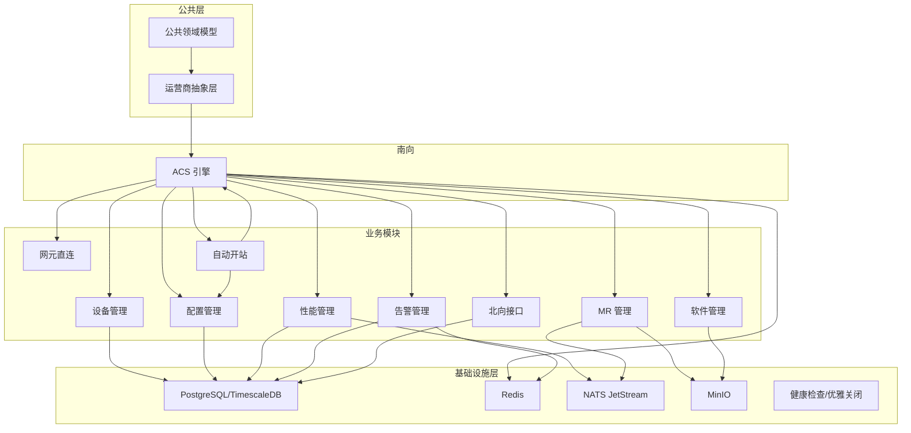
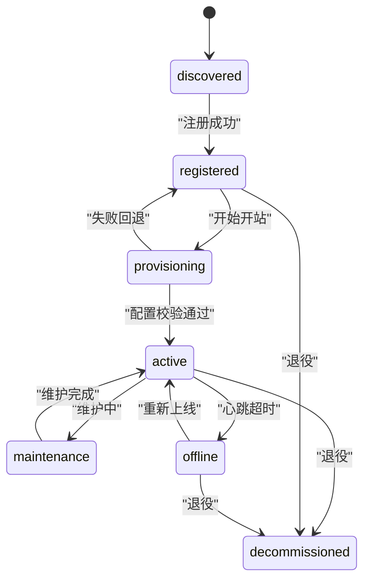
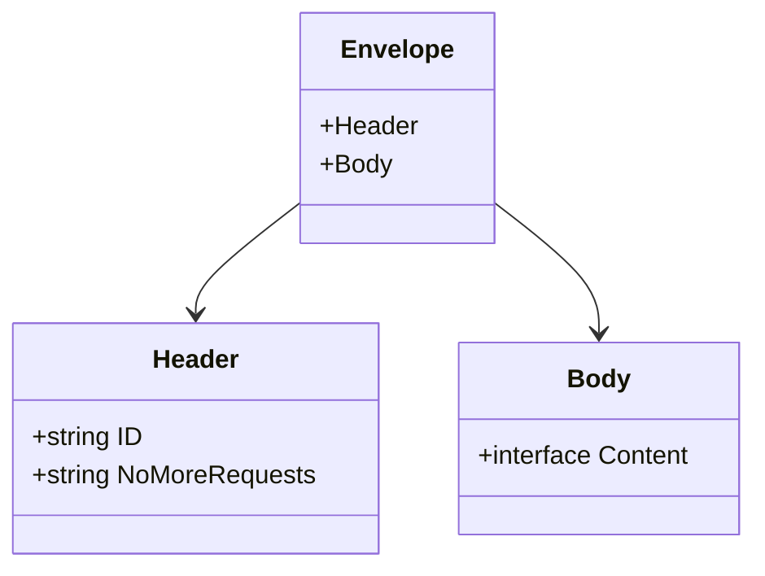
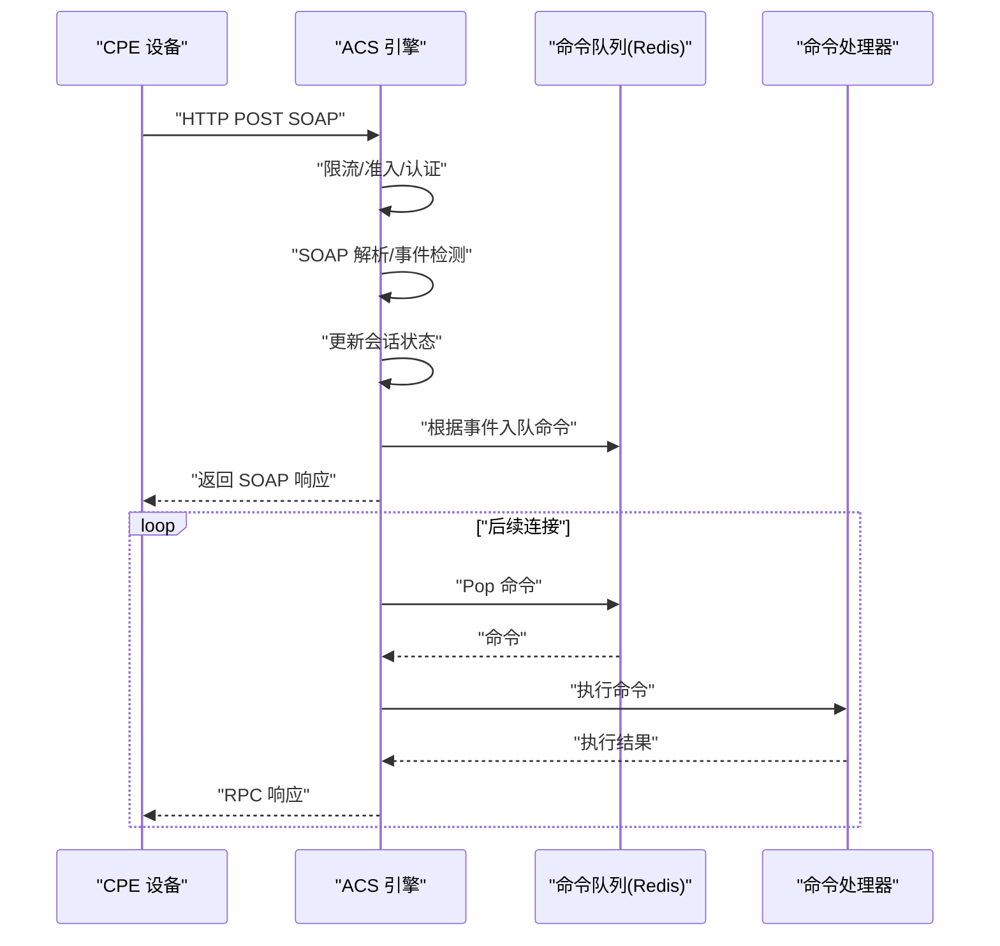
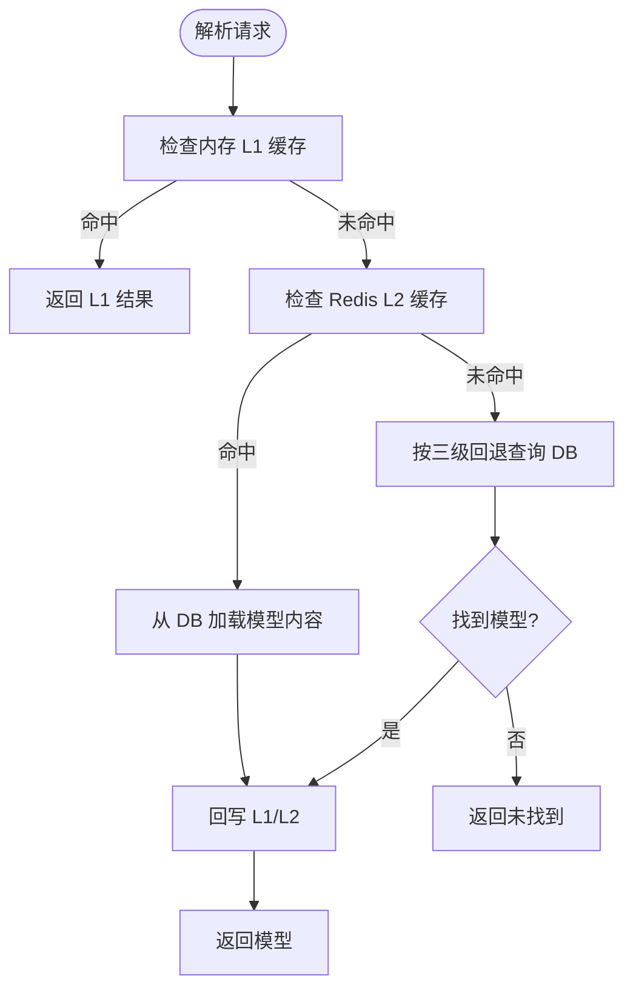
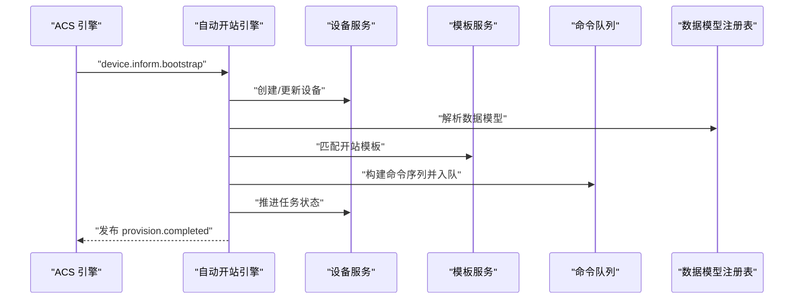
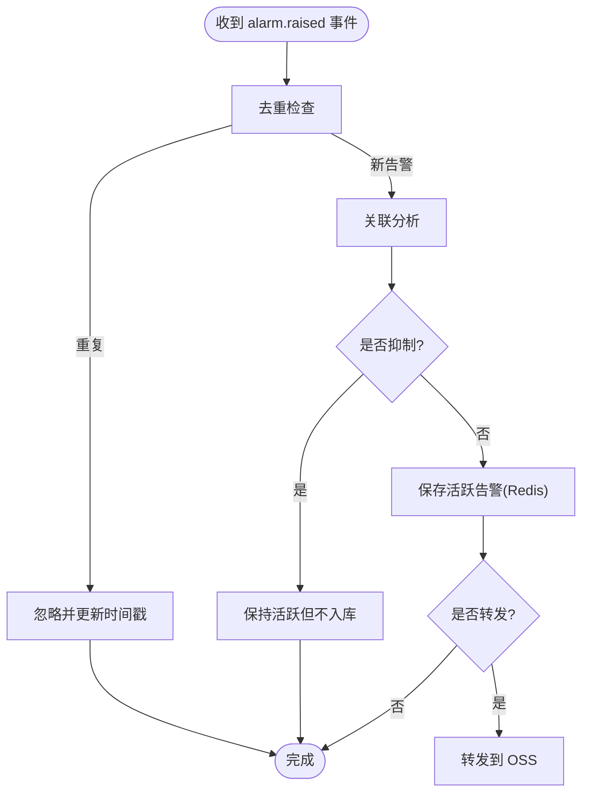
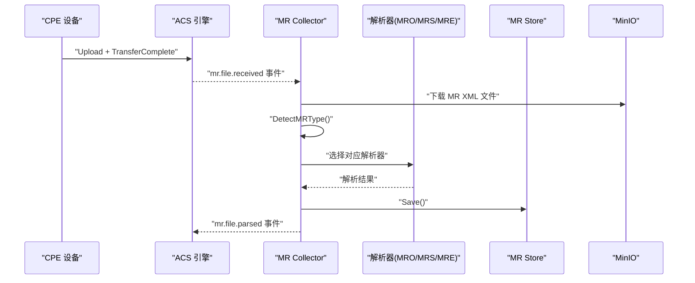
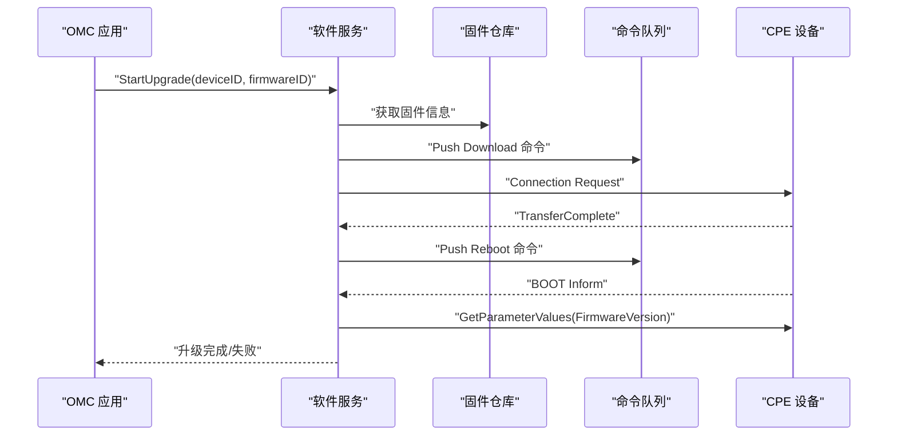
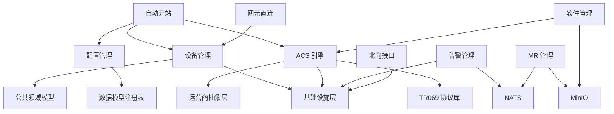

# 核心模块

<cite>
**本文引用的文件**   
- [TR069协议库-概述](file://omcgo/docs/detailed-design/06-tr069-protocol-library.md)
- [TR069协议库-数据模型](file://omcgo/docs/detailed-design/06-tr069-protocol-library.md)
- [TR069协议库-SOAP工具](file://omcgo/docs/detailed-design/06-tr069-protocol-library.md)
- [TR069协议库-XML工具](file://omcgo/docs/detailed-design/06-tr069-protocol-library.md)
- [TR069协议库-实施子阶段](file://omcgo/docs/detailed-design/06-tr069-protocol-library.md)
- [TR069协议库-文件清单](file://omcgo/docs/detailed-design/06-tr069-protocol-library.md)
- [TR069协议库-测试策略](file://omcgo/docs/detailed-design/06-tr069-protocol-library.md)
- [TR069协议库-参考](file://omcgo/docs/detailed-design/06-tr069-protocol-library.md)
- [ACS引擎核心-概述](file://omcgo/docs/detailed-design/07-acs-engine.md)
- [ACS引擎核心-接口设计](file://omcgo/docs/detailed-design/07-acs-engine.md)
- [ACS引擎核心-详细设计](file://omcgo/docs/detailed-design/07-acs-engine.md)
- [ACS引擎核心-运营商差异](file://omcgo/docs/detailed-design/07-acs-engine.md)
- [ACS引擎核心-实施子阶段](file://omcgo/docs/detailed-design/07-acs-engine.md)
- [ACS引擎核心-文件清单](file://omcgo/docs/detailed-design/07-acs-engine.md)
- [ACS引擎核心-测试策略](file://omcgo/docs/detailed-design/07-acs-engine.md)
- [ACS引擎核心-依赖与风险](file://omcgo/docs/detailed-design/07-acs-engine.md)
- [数据模型与配置管理-概述](file://omcgo/docs/detailed-design/08-data-model-config.md)
- [数据模型与配置管理-接口设计](file://omcgo/docs/detailed-design/08-data-model-config.md)
- [数据模型与配置管理-数据模型](file://omcgo/docs/detailed-design/08-data-model-config.md)
- [数据模型与配置管理-详细设计](file://omcgo/docs/detailed-design/08-data-model-config.md)
- [数据模型与配置管理-运营商差异](file://omcgo/docs/detailed-design/08-data-model-config.md)
- [数据模型与配置管理-实施子阶段](file://omcgo/docs/detailed-design/08-data-model-config.md)
- [数据模型与配置管理-文件清单](file://omcgo/docs/detailed-design/08-data-model-config.md)
- [数据模型与配置管理-测试策略](file://omcgo/docs/detailed-design/08-data-model-config.md)
- [设备管理-概述](file://omcgo/docs/detailed-design/09-device-management.md)
- [设备管理-接口设计](file://omcgo/docs/detailed-design/09-device-management.md)
- [设备管理-数据模型](file://omcgo/docs/detailed-design/09-device-management.md)
- [设备管理-详细设计](file://omcgo/docs/detailed-design/09-device-management.md)
- [设备管理-实施子阶段](file://omcgo/docs/detailed-design/09-device-management.md)
- [设备管理-文件清单](file://omcgo/docs/detailed-design/09-device-management.md)
- [设备管理-测试策略](file://omcgo/docs/detailed-design/09-device-management.md)
- [自动开站-概述](file://omcgo/docs/detailed-design/10-provisioning.md)
- [自动开站-接口设计](file://omcgo/docs/detailed-design/10-provisioning.md)
- [自动开站-详细设计](file://omcgo/docs/detailed-design/10-provisioning.md)
- [自动开站-运营商差异](file://omcgo/docs/detailed-design/10-provisioning.md)
- [自动开站-实施子阶段](file://omcgo/docs/detailed-design/10-provisioning.md)
- [自动开站-文件清单](file://omcgo/docs/detailed-design/10-provisioning.md)
- [自动开站-参考](file://omcgo/docs/detailed-design/10-provisioning.md)
- [告警管理-概述](file://omcgo/docs/detailed-design/12-alarm-management.md)
- [告警管理-接口设计](file://omcgo/docs/detailed-design/12-alarm-management.md)
- [告警管理-数据模型](file://omcgo/docs/detailed-design/12-alarm-management.md)
- [告警管理-详细设计](file://omcgo/docs/detailed-design/12-alarm-management.md)
- [告警管理-实施子阶段](file://omcgo/docs/detailed-design/12-alarm-management.md)
- [告警管理-文件清单](file://omcgo/docs/detailed-design/12-alarm-management.md)
- [告警管理-参考](file://omcgo/docs/detailed-design/12-alarm-management.md)
- [测量报告-概述](file://omcgo/docs/detailed-design/13-measurement-reports.md)
- [测量报告-接口设计](file://omcgo/docs/detailed-design/13-measurement-reports.md)
- [测量报告-数据模型](file://omcgo/docs/detailed-design/13-measurement-reports.md)
- [测量报告-运营商差异](file://omcgo/docs/detailed-design/13-measurement-reports.md)
- [测量报告-实施子阶段](file://omcgo/docs/detailed-design/13-measurement-reports.md)
- [测量报告-文件清单](file://omcgo/docs/detailed-design/13-measurement-reports.md)
- [测量报告-参考](file://omcgo/docs/detailed-design/13-measurement-reports.md)
- [软件管理-概述](file://omcgo/docs/detailed-design/14-software-management.md)
- [软件管理-接口设计](file://omcgo/docs/detailed-design/14-software-management.md)
- [软件管理-数据模型](file://omcgo/docs/detailed-design/14-software-management.md)
- [软件管理-实施子阶段](file://omcgo/docs/detailed-design/14-software-management.md)
- [软件管理-文件清单](file://omcgo/docs/detailed-design/14-software-management.md)
- [软件管理-参考](file://omcgo/docs/detailed-design/14-software-management.md)
- [网元直连-概述](file://omcgo/docs/detailed-design/16-ne-direct.md)
- [网元直连-接口设计](file://omcgo/docs/detailed-design/16-ne-direct.md)
- [网元直连-详细设计](file://omcgo/docs/detailed-design/16-ne-direct.md)
- [网元直连-实施子阶段](file://omcgo/docs/detailed-design/16-ne-direct.md)
- [网元直连-文件清单](file://omcgo/docs/detailed-design/16-ne-direct.md)
- [网元直连-参考](file://omcgo/docs/detailed-design/16-ne-direct.md)
- [北向接口-概述](file://omcgo/docs/detailed-design/15-northbound-oss.md)
- [北向接口-接口设计](file://omcgo/docs/detailed-design/15-northbound-oss.md)
- [北向接口-REST API](file://omcgo/docs/detailed-design/15-northbound-oss.md)
- [北向接口-运营商差异](file://omcgo/docs/detailed-design/15-northbound-oss.md)
- [北向接口-实施子阶段](file://omcgo/docs/detailed-design/15-northbound-oss.md)
- [北向接口-文件清单](file://omcgo/docs/detailed-design/15-northbound-oss.md)
- [北向接口-参考](file://omcgo/docs/detailed-design/15-northbound-oss.md)
- [运营商抽象层-概述](file://omcgo/docs/detailed-design/05-carrier-abstraction.md)
- [运营商抽象层-接口设计](file://omcgo/docs/detailed-design/05-carrier-abstraction.md)
- [运营商抽象层-详细设计](file://omcgo/docs/detailed-design/05-carrier-abstraction.md)
- [运营商抽象层-实施子阶段](file://omcgo/docs/detailed-design/05-carrier-abstraction.md)
- [运营商抽象层-文件清单](file://omcgo/docs/detailed-design/05-carrier-abstraction.md)
- [运营商抽象层-测试策略](file://omcgo/docs/detailed-design/05-carrier-abstraction.md)
- [公共领域模型-概述](file://omcgo/docs/detailed-design/03-common-domain-models.md)
- [公共领域模型-数据模型](file://omcgo/docs/detailed-design/03-common-domain-models.md)
- [公共领域模型-错误类型体系](file://omcgo/docs/detailed-design/03-common-domain-models.md)
- [公共领域模型-HTTP中间件](file://omcgo/docs/detailed-design/03-common-domain-models.md)
- [公共领域模型-通用分页与过滤](file://omcgo/docs/detailed-design/03-common-domain-models.md)
- [公共领域模型-实施子阶段](file://omcgo/docs/detailed-design/03-common-domain-models.md)
- [公共领域模型-文件清单](file://omcgo/docs/detailed-design/03-common-domain-models.md)
- [公共领域模型-测试策略](file://omcgo/docs/detailed-design/03-common-domain-models.md)
- [基础设施层-概述](file://omcgo/docs/detailed-design/02-infrastructure-layer.md)
- [基础设施层-接口设计](file://omcgo/docs/detailed-design/02-infrastructure-layer.md)
- [基础设施层-详细设计](file://omcgo/docs/detailed-design/02-infrastructure-layer.md)
- [基础设施层-实施子阶段](file://omcgo/docs/detailed-design/02-infrastructure-layer.md)
- [基础设施层-文件清单](file://omcgo/docs/detailed-design/02-infrastructure-layer.md)
- [基础设施层-测试策略](file://omcgo/docs/detailed-design/02-infrastructure-layer.md)
</cite>

## 目录
1. [简介](#简介)
2. [项目结构](#项目结构)
3. [核心组件](#核心组件)
4. [架构总览](#架构总览)
5. [详细组件分析](#详细组件分析)
6. [依赖分析](#依赖分析)
7. [性能考虑](#性能考虑)
8. [故障排查指南](#故障排查指南)
9. [结论](#结论)
10. [附录](#附录)

## 简介
本文件面向 Baicells OMC 项目的“核心模块”，系统性梳理并阐述以下关键业务模块的设计与实现要点：
- 设备管理模块：设备注册、状态管理、参数配置、拓扑管理
- TR069 协议处理模块：消息解析、会话管理、RPC 实现
- 性能管理模块：数据采集、KPI 计算、阈值监控
- 告警管理模块：规则引擎、检测算法、通知系统
- 配置管理模块：模板系统、基线管理、批量配置
- MR 管理模块：数据处理、质量分析、优化建议
- 软件管理模块：升级流程、版本控制、监控系统
- 网元直连模块：高效通信、实时控制
- 北向接口模块：联通规范对接、数据推送
- 自动开站模块：流程设计、参数匹配、配置下发

每个模块均包含架构设计、核心算法、API 接口、配置选项与最佳实践，帮助读者快速理解与落地。

## 项目结构
OMC 后端采用分层与模块化组织方式：
- 基础设施层（Infra）：统一管理数据库、缓存、消息队列、对象存储与健康检查
- 公共领域模型（Common）：定义统一的领域常量、模型与错误处理
- 运营商抽象层（Carrier）：屏蔽 CMCC/CTCC/CUCC 差异
- 南向 ACS 引擎：TR069 协议处理与命令下发
- 业务模块：设备管理、配置管理、性能管理、告警管理、MR 管理、软件管理、网元直连、北向接口、自动开站



**图表来源**
- [基础设施层-概述:1-306](file://omcgo/docs/detailed-design/02-infrastructure-layer.md#L1-L306)
- [公共领域模型-概述:1-346](file://omcgo/docs/detailed-design/03-common-domain-models.md#L1-L346)
- [运营商抽象层-概述:1-257](file://omcgo/docs/detailed-design/05-carrier-abstraction.md#L1-L257)
- [TR069协议库-概述:1-400](file://omcgo/docs/detailed-design/06-tr069-protocol-library.md#L1-L400)
- [ACS引擎核心-概述:1-426](file://omcgo/docs/detailed-design/07-acs-engine.md#L1-L426)

**章节来源**
- [基础设施层-概述:1-306](file://omcgo/docs/detailed-design/02-infrastructure-layer.md#L1-L306)
- [公共领域模型-概述:1-346](file://omcgo/docs/detailed-design/03-common-domain-models.md#L1-L346)
- [运营商抽象层-概述:1-257](file://omcgo/docs/detailed-design/05-carrier-abstraction.md#L1-L257)
- [TR069协议库-概述:1-400](file://omcgo/docs/detailed-design/06-tr069-protocol-library.md#L1-L400)
- [ACS引擎核心-概述:1-426](file://omcgo/docs/detailed-design/07-acs-engine.md#L1-L426)

## 核心组件
本节概览各核心模块的关键职责与边界：
- 设备管理：设备生命周期、状态机、心跳离线检测、拓扑分组
- TR069 协议库：RPC 类型、事件码、CWMP 错误码、SOAP 模板、XML 工具
- ACS 引擎：HTTP/HTTPS 服务器、会话状态机、命令队列、Connection Request、认证与限流
- 配置管理：数据模型注册表（三级回退解析）、模板管理、导入导出、审计与备份
- 自动开站：开站状态机、模板匹配、命令编排、批量开站
- 告警管理：去重、关联、抑制、生命周期、历史归档、北向转发
- MR 管理：文件接收、类型判定、解析器（MRO/MRS/MRE）、存储与查询
- 软件管理：固件版本管理、升级工作流、批量升级、失败恢复
- 网元直连：中国移动专有直连协议、与 TR069 双模共存
- 北向接口：PM/告警/配置数据推送、全量/增量同步、OSS 对接

**章节来源**
- [设备管理-概述:1-317](file://omcgo/docs/detailed-design/09-device-management.md#L1-L317)
- [TR069协议库-概述:1-400](file://omcgo/docs/detailed-design/06-tr069-protocol-library.md#L1-L400)
- [ACS引擎核心-概述:1-426](file://omcgo/docs/detailed-design/07-acs-engine.md#L1-L426)
- [数据模型与配置管理-概述:1-379](file://omcgo/docs/detailed-design/08-data-model-config.md#L1-L379)
- [自动开站-概述:1-226](file://omcgo/docs/detailed-design/10-provisioning.md#L1-L226)
- [告警管理-概述:1-221](file://omcgo/docs/detailed-design/12-alarm-management.md#L1-L221)
- [测量报告-概述:1-167](file://omcgo/docs/detailed-design/13-measurement-reports.md#L1-L167)
- [软件管理-概述:1-162](file://omcgo/docs/detailed-design/14-software-management.md#L1-L162)
- [网元直连-概述:1-106](file://omcgo/docs/detailed-design/16-ne-direct.md#L1-L106)
- [北向接口-概述:1-138](file://omcgo/docs/detailed-design/15-northbound-oss.md#L1-L138)

## 架构总览
下图展示 OMCR 核心模块的交互关系与数据流：

```mermaid
graph TB
CPE["CPE 设备"]
ACS["ACS 引擎"]
BUS["NATS 事件总线"]
REDIS["Redis"]
PG["PostgreSQL/TimescaleDB"]
MINIO["MinIO"]
DEV["设备管理"]
CFG["配置管理"]
PM["性能管理"]
ALM["告警管理"]
MR["MR 管理"]
SW["软件管理"]
ND["网元直连"]
NB["北向接口"]
PR["自动开站"]
CPE <- --> ACS
ACS --> REDIS
ACS --> BUS
ACS --> DEV
ACS --> CFG
ACS --> PM
ACS --> ALM
ACS --> MR
ACS --> SW
ACS --> ND
ACS --> NB
ACS --> PR
DEV --> PG
CFG --> PG
PM --> PG
PM --> BUS
ALM --> REDIS
ALM --> PG
MR --> MINIO
MR --> BUS
SW --> MINIO
NB --> PG
PR --> CFG
```

**图表来源**
- [TR069协议库-概述:1-400](file://omcgo/docs/detailed-design/06-tr069-protocol-library.md#L1-L400)
- [ACS引擎核心-概述:1-426](file://omcgo/docs/detailed-design/07-acs-engine.md#L1-L426)
- [设备管理-概述:1-317](file://omcgo/docs/detailed-design/09-device-management.md#L1-L317)
- [告警管理-概述:1-221](file://omcgo/docs/detailed-design/12-alarm-management.md#L1-L221)
- [测量报告-概述:1-167](file://omcgo/docs/detailed-design/13-measurement-reports.md#L1-L167)
- [软件管理-概述:1-162](file://omcgo/docs/detailed-design/14-software-management.md#L1-L162)
- [网元直连-概述:1-106](file://omcgo/docs/detailed-design/16-ne-direct.md#L1-L106)
- [北向接口-概述:1-138](file://omcgo/docs/detailed-design/15-northbound-oss.md#L1-L138)

## 详细组件分析

### 设备管理模块
- 职责
  - 设备注册（从 Bootstrap Inform 自动创建）
  - 设备状态机管理（7 种状态）
  - 设备参数存储与查询
  - 心跳监控与离线检测
  - 拓扑管理（设备分组、层级树）
  - 设备列表查询与过滤
- 核心算法
  - 设备状态机：discovered → registered → provisioning → active → maintenance/offline → decommissioned
  - 心跳离线检测：基于 Redis TTL 与 Inform 事件
  - 拓扑树构建：设备分组的父子关系与设备成员
- API 接口
  - 设备列表/详情、参数读取/设置、远程重启、恢复出厂、拓扑树与分组查询
- 配置选项
  - inform_interval、站点经纬度、扩展字段
- 最佳实践
  - 使用事件驱动的状态推进
  - 定时任务扫描离线设备
  - 拓扑分组与站点信息联动



**图表来源**
- [设备管理-详细设计:225-248](file://omcgo/docs/detailed-design/09-device-management.md#L225-L248)

**章节来源**
- [设备管理-接口设计:27-125](file://omcgo/docs/detailed-design/09-device-management.md#L27-L125)
- [设备管理-数据模型:128-197](file://omcgo/docs/detailed-design/09-device-management.md#L128-L197)
- [设备管理-详细设计:200-258](file://omcgo/docs/detailed-design/09-device-management.md#L200-L258)
- [设备管理-实施子阶段:261-288](file://omcgo/docs/detailed-design/09-device-management.md#L261-L288)
- [设备管理-文件清单:291-299](file://omcgo/docs/detailed-design/09-device-management.md#L291-L299)
- [设备管理-测试策略:303-310](file://omcgo/docs/detailed-design/09-device-management.md#L303-L310)

### TR069 协议处理模块
- 职责
  - TR069 RPC 类型定义（Inform、Get/Set/Add/Delete/Download/Upload/Reboot/FactoryReset/ScheduleInform）
  - Inform 事件码常量
  - CWMP 错误码
  - SOAP 信封结构与模板
  - XML 流式解析工具
- 核心算法
  - SOAP 模板预编译与渲染
  - 流式 XML 解析与元素遍历
  - 事件码判断与 RPC 方法检测
- API 接口
  - 以公共库形式提供，供 ACS 引擎与其它模块复用
- 配置选项
  - 模板变量、解析参数
- 最佳实践
  - 使用预编译模板提升渲染性能
  - 流式解析避免大报文内存占用



**图表来源**
- [TR069协议库-数据模型:26-66](file://omcgo/docs/detailed-design/06-tr069-protocol-library.md#L26-L66)
- [TR069协议库-SOAP工具:243-296](file://omcgo/docs/detailed-design/06-tr069-protocol-library.md#L243-L296)

**章节来源**
- [TR069协议库-数据模型:26-240](file://omcgo/docs/detailed-design/06-tr069-protocol-library.md#L26-L240)
- [TR069协议库-SOAP工具:243-314](file://omcgo/docs/detailed-design/06-tr069-protocol-library.md#L243-L314)
- [TR069协议库-XML工具:317-341](file://omcgo/docs/detailed-design/06-tr069-protocol-library.md#L317-L341)
- [TR069协议库-实施子阶段:344-365](file://omcgo/docs/detailed-design/06-tr069-protocol-library.md#L344-L365)
- [TR069协议库-文件清单:368-384](file://omcgo/docs/detailed-design/06-tr069-protocol-library.md#L368-L384)
- [TR069协议库-测试策略:387-393](file://omcgo/docs/detailed-design/06-tr069-protocol-library.md#L387-L393)

### ACS 引擎核心
- 职责
  - HTTP/HTTPS 服务器，接受 CPE 连接
  - SOAP/XML 编解码
  - TR069 会话状态机管理
  - 9 种 RPC 方法实现
  - 设备命令队列（Redis-backed）
  - Connection Request 发起
  - CPE 认证（HTTP Digest/Basic）
  - 流量控制（设备级限流 + 全局准入控制）
- 核心算法
  - 会话状态机：IDLE → INFORM_RECEIVED → PROCESSING → RPC_PENDING → RPC_RESPONSE → COMPLETE
  - 命令队列：基于 Redis Sorted Set 的优先级调度
  - 限流与准入控制：设备级速率限制 + 全局并发控制
- API 接口
  - gRPC 控制接口：队列命令、发送连接请求、事件流、状态查询
- 配置选项
  - HTTP 服务、认证、限流、准入控制、RPC 调度
- 最佳实践
  - 严格区分会话状态，避免并发状态冲突
  - 使用 Redis 保证命令队列与会话状态一致性
  - 合理设置超时与重试策略



**图表来源**
- [ACS引擎核心-详细设计:135-282](file://omcgo/docs/detailed-design/07-acs-engine.md#L135-L282)

**章节来源**
- [ACS引擎核心-接口设计:41-132](file://omcgo/docs/detailed-design/07-acs-engine.md#L41-L132)
- [ACS引擎核心-详细设计:135-321](file://omcgo/docs/detailed-design/07-acs-engine.md#L135-L321)
- [ACS引擎核心-运营商差异:311-321](file://omcgo/docs/detailed-design/07-acs-engine.md#L311-L321)
- [ACS引擎核心-实施子阶段:324-368](file://omcgo/docs/detailed-design/07-acs-engine.md#L324-L368)
- [ACS引擎核心-文件清单:371-400](file://omcgo/docs/detailed-design/07-acs-engine.md#L371-L400)
- [ACS引擎核心-测试策略:404-411](file://omcgo/docs/detailed-design/07-acs-engine.md#L404-L411)
- [ACS引擎核心-依赖与风险:413-419](file://omcgo/docs/detailed-design/07-acs-engine.md#L413-L419)

### 配置管理模块
- 职责
  - 数据模型注册表（三级回退解析：product → oui → carrier_default）
  - 三级缓存（内存 L1 + Redis L2 + PostgreSQL L3）
  - 数据模型导入/导出工作流
  - 数据模型生命周期管理（draft → active → deprecated）
  - 配置模板管理
  - 配置审计与备份
- 核心算法
  - 三级回退解析：按 scope 逐级查找，命中后回写缓存
  - 缓存版本号：激活/废弃时自增版本，触发缓存失效
  - 模板匹配：按运营商/制式/产品类匹配最优模板
- API 接口
  - 数据模型 CRUD、激活/废弃、导入/导出、解析测试、差异对比、缓存刷新
- 配置选项
  - scope、status、版本、根对象、参数树
- 最佳实践
  - 同分类仅允许一个 active 模型，避免歧义
  - 导入流程：dry-run 校验 + 审核 + 激活
  - 缓存一致性：版本号驱动失效



**图表来源**
- [数据模型与配置管理-详细设计:238-274](file://omcgo/docs/detailed-design/08-data-model-config.md#L238-L274)

**章节来源**
- [数据模型与配置管理-接口设计:27-90](file://omcgo/docs/detailed-design/08-data-model-config.md#L27-L90)
- [数据模型与配置管理-数据模型:103-235](file://omcgo/docs/detailed-design/08-data-model-config.md#L103-L235)
- [数据模型与配置管理-详细设计:238-274](file://omcgo/docs/detailed-design/08-data-model-config.md#L238-L274)
- [数据模型与配置管理-运营商差异:321-330](file://omcgo/docs/detailed-design/08-data-model-config.md#L321-L330)
- [数据模型与配置管理-实施子阶段:332-340](file://omcgo/docs/detailed-design/08-data-model-config.md#L332-L340)
- [数据模型与配置管理-文件清单:342-361](file://omcgo/docs/detailed-design/08-data-model-config.md#L342-L361)
- [数据模型与配置管理-测试策略:364-371](file://omcgo/docs/detailed-design/08-data-model-config.md#L364-L371)

### 自动开站模块
- 职责
  - 开站状态机（bootstrap → 识别 → 模板匹配 → 配置下发 → 验证 → 激活）
  - 模板匹配规则引擎
  - 配置下发编排（命令序列）
  - 批量开站管理
- 核心算法
  - 开站状态机：discovered → identifying → matching → configuring → verifying → completed/failed
  - 模板匹配：按 carrier + tech + product_class 优先级匹配
  - 命令编排：按步骤顺序执行 Get/Set/Download/Reboot，并排队等待 CPE 下次连接执行
- API 接口
  - 任务列表/详情、手动创建任务、模板 CRUD
- 配置选项
  - 模板参数、默认值、必填项、下发顺序
- 最佳实践
  - Bootstrap 事件自动触发开站流程
  - 校验失败重试与失败回退
  - 批量任务并发控制与进度跟踪



**图表来源**
- [自动开站-详细设计:83-121](file://omcgo/docs/detailed-design/10-provisioning.md#L83-L121)

**章节来源**
- [自动开站-接口设计:25-80](file://omcgo/docs/detailed-design/10-provisioning.md#L25-L80)
- [自动开站-详细设计:83-175](file://omcgo/docs/detailed-design/10-provisioning.md#L83-L175)
- [自动开站-运营商差异:178-186](file://omcgo/docs/detailed-design/10-provisioning.md#L178-L186)
- [自动开站-实施子阶段:188-205](file://omcgo/docs/detailed-design/10-provisioning.md#L188-L205)
- [自动开站-文件清单:207-218](file://omcgo/docs/detailed-design/10-provisioning.md#L207-L218)
- [自动开站-参考:222-226](file://omcgo/docs/detailed-design/10-provisioning.md#L222-L226)

### 告警管理模块
- 职责
  - 接收 TR069 Inform ALARM 事件，去重、关联、抑制
  - 活跃告警存储（Redis）、历史归档（PostgreSQL/TimescaleDB）
  - 生命周期管理（active → acknowledged → cleared）
  - 可选北向转发
- 核心算法
  - 去重：相同设备 + 相同告警码视为重复
  - 关联：基于设备与告警类型进行关联分析
  - 抑制：根据运营商映射与规则抑制重复/无效告警
  - 生命周期：确认、清除、自动清除
- API 接口
  - 活跃告警列表、历史查询、确认、清除、统计
- 配置选项
  - 告警严重级别映射、转发目标
- 最佳实践
  - 使用 Redis 快速去重与活跃状态管理
  - 历史表使用 TimescaleDB 时序优化
  - 北向转发幂等与重试



**图表来源**
- [告警管理-概述:16-27](file://omcgo/docs/detailed-design/12-alarm-management.md#L16-L27)

**章节来源**
- [告警管理-接口设计:30-116](file://omcgo/docs/detailed-design/12-alarm-management.md#L30-L116)
- [告警管理-数据模型:119-174](file://omcgo/docs/detailed-design/12-alarm-management.md#L119-L174)
- [告警管理-详细设计:177-194](file://omcgo/docs/detailed-design/12-alarm-management.md#L177-L194)
- [告警管理-实施子阶段:196-201](file://omcgo/docs/detailed-design/12-alarm-management.md#L196-L201)
- [告警管理-文件清单:204-214](file://omcgo/docs/detailed-design/12-alarm-management.md#L204-L214)
- [告警管理-参考:217-221](file://omcgo/docs/detailed-design/12-alarm-management.md#L217-L221)

### MR 管理模块
- 职责
  - 接收 CPE 上传的 MR 文件（MRO/MRS/MRE）
  - 文件名解析类型，选择对应解析器
  - 存储解析后的 MR 数据，提供查询与下载
- 核心算法
  - 文件类型判定：根据文件名后缀或内容特征
  - 三种解析器：MRO（切换优化）、MRS（服务小区）、MRE（终端能力）
  - 存储：MinIO 对象存储 + 数据库记录
- API 接口
  - MR 文件列表、下载、解析数据查询
- 配置选项
  - MinIO Bucket 路径、解析器开关
- 最佳实践
  - 使用 Worker 异步处理上传事件
  - MR 文件命名规范与路径结构
  - 解析失败重试与告警



**图表来源**
- [测量报告-概述:16-27](file://omcgo/docs/detailed-design/13-measurement-reports.md#L16-L27)

**章节来源**
- [测量报告-接口设计:30-110](file://omcgo/docs/detailed-design/13-measurement-reports.md#L30-L110)
- [测量报告-数据模型:113-128](file://omcgo/docs/detailed-design/13-measurement-reports.md#L113-L128)
- [测量报告-运营商差异:131-140](file://omcgo/docs/detailed-design/13-measurement-reports.md#L131-L140)
- [测量报告-实施子阶段:142-147](file://omcgo/docs/detailed-design/13-measurement-reports.md#L142-L147)
- [测量报告-文件清单:150-160](file://omcgo/docs/detailed-design/13-measurement-reports.md#L150-L160)
- [测量报告-参考:163-167](file://omcgo/docs/detailed-design/13-measurement-reports.md#L163-L167)

### 软件管理模块
- 职责
  - 固件版本管理（版本号、兼容设备列表、文件存储）
  - 升级工作流（下载 → 传输 → 重启 → 验证）
  - 升级任务调度（单设备、批量、滚动升级）
  - 升级失败恢复
- 核心算法
  - 升级状态机：pending → downloading → rebooting → verifying → completed/failed
  - 版本验证：重启后读取固件版本参数进行比对
  - 批量调度：并发控制与失败重试
- API 接口
  - 固件列表/上传、触发升级、升级任务列表
- 配置选项
  - 固件存储路径、兼容 OUI、发布说明
- 最佳实践
  - 下载完成后发送 Connection Request 触发设备连接
  - 升级失败回滚策略与人工干预入口



**图表来源**
- [软件管理-接口设计:25-52](file://omcgo/docs/detailed-design/14-software-management.md#L25-L52)

**章节来源**
- [软件管理-接口设计:25-80](file://omcgo/docs/detailed-design/14-software-management.md#L25-L80)
- [软件管理-数据模型:97-139](file://omcgo/docs/detailed-design/14-software-management.md#L97-L139)
- [软件管理-实施子阶段:142-146](file://omcgo/docs/detailed-design/14-software-management.md#L142-L146)
- [软件管理-文件清单:149-156](file://omcgo/docs/detailed-design/14-software-management.md#L149-L156)
- [软件管理-参考:159-162](file://omcgo/docs/detailed-design/14-software-management.md#L159-L162)

### 网元直连模块
- 职责
  - 直连接口协议处理（中国移动专有）
  - 直连模式下的设备注册与认证
  - 配置管理、状态监控、故障上报
  - 与 TR069 双模共存
- 核心算法
  - 通过 Carrier 接口判断是否支持直连
  - 与 TR069 南向接口互补，适合高容量设备的实时管理
- API 接口
  - 注册、配置、状态、故障上报
- 配置选项
  - 直连服务端口、认证方式
- 最佳实践
  - 仅在 CMCC 场景启用直连
  - 与 TR069 并行部署，按场景分流

**章节来源**
- [网元直连-接口设计:25-60](file://omcgo/docs/detailed-design/16-ne-direct.md#L25-L60)
- [网元直连-详细设计:63-81](file://omcgo/docs/detailed-design/16-ne-direct.md#L63-L81)
- [网元直连-实施子阶段:84-90](file://omcgo/docs/detailed-design/16-ne-direct.md#L84-L90)
- [网元直连-文件清单:93-99](file://omcgo/docs/detailed-design/16-ne-direct.md#L93-L99)
- [网元直连-参考:102-106](file://omcgo/docs/detailed-design/16-ne-direct.md#L102-L106)

### 北向接口模块
- 职责
  - 性能数据接口（PM 统计推送、文件导出）
  - 配置数据接口（设备配置快照、变更推送）
  - 告警数据接口（实时推送、全量/增量同步）
  - 数据推送引擎（HTTP 回调、文件推送）
  - 全量/增量同步设计
- 核心算法
  - 推送目标配置：URL、认证方式、数据类型、格式、批大小、重试次数
  - 同步策略：基于时间戳的增量同步
- API 接口
  - 北向专用配置、全量/增量同步、PM/告警导出
- 配置选项
  - 推送目标、认证凭据、格式与批大小
- 最佳实践
  - OSS 侧幂等消费与去重
  - 增量同步减少数据传输压力

**章节来源**
- [北向接口-接口设计:26-78](file://omcgo/docs/detailed-design/15-northbound-oss.md#L26-L78)
- [北向接口-REST API:81-96](file://omcgo/docs/detailed-design/15-northbound-oss.md#L81-L96)
- [北向接口-运营商差异:99-108](file://omcgo/docs/detailed-design/15-northbound-oss.md#L99-L108)
- [北向接口-实施子阶段:111-117](file://omcgo/docs/detailed-design/15-northbound-oss.md#L111-L117)
- [北向接口-文件清单:120-131](file://omcgo/docs/detailed-design/15-northbound-oss.md#L120-L131)
- [北向接口-参考:134-138](file://omcgo/docs/detailed-design/15-northbound-oss.md#L134-L138)

## 依赖分析
- 组件耦合
  - 设备管理依赖公共领域模型与基础设施层（PG/Redis）
  - ACS 引擎依赖 TR069 协议库、运营商抽象层、基础设施层
  - 配置管理依赖数据模型注册表与模板服务
  - 自动开站依赖设备服务、模板服务、命令队列
  - 告警管理依赖事件总线、Redis、PG/TimescaleDB
  - MR 管理依赖 MinIO、NATS、存储层
  - 软件管理依赖 MinIO、命令队列、设备服务
  - 网元直连依赖设备服务与运营商适配
  - 北向接口依赖 PG、推送引擎、同步服务
- 外部依赖
  - PostgreSQL/TimescaleDB：结构化数据与时序数据
  - Redis：会话、命令队列、活跃告警
  - NATS：事件总线与工作队列
  - MinIO：对象存储（PM/MR/固件/日志）



**图表来源**
- [公共领域模型-概述:1-346](file://omcgo/docs/detailed-design/03-common-domain-models.md#L1-L346)
- [TR069协议库-概述:1-400](file://omcgo/docs/detailed-design/06-tr069-protocol-library.md#L1-L400)
- [运营商抽象层-概述:1-257](file://omcgo/docs/detailed-design/05-carrier-abstraction.md#L1-L257)
- [基础设施层-概述:1-306](file://omcgo/docs/detailed-design/02-infrastructure-layer.md#L1-L306)

**章节来源**
- [公共领域模型-概述:1-346](file://omcgo/docs/detailed-design/03-common-domain-models.md#L1-L346)
- [TR069协议库-概述:1-400](file://omcgo/docs/detailed-design/06-tr069-protocol-library.md#L1-L400)
- [运营商抽象层-概述:1-257](file://omcgo/docs/detailed-design/05-carrier-abstraction.md#L1-L257)
- [基础设施层-概述:1-306](file://omcgo/docs/detailed-design/02-infrastructure-layer.md#L1-L306)

## 性能考虑
- 连接池与缓存
  - PostgreSQL/TimescaleDB：根据规模设置 MaxConns/MinConns、健康检查间隔
  - Redis：PoolSize、最小空闲连接、读写超时
- 事件总线
  - NATS JetStream：合理设置 Stream 副本数与工作队列策略
- 解析与序列化
  - TR069 SOAP 模板预编译，流式 XML 解析降低内存峰值
- 限流与并发
  - 设备级限流 + 全局准入控制，避免过载
- 存储优化
  - TimescaleDB 时序表分区与索引
  - MinIO 分层存储与路径规范

[本节为通用指导，无需列出具体文件来源]

## 故障排查指南
- 设备离线不更新
  - 检查心跳 Redis Key TTL 与 Inform 事件
  - 确认定时任务运行状态
- 告警未去重/未转发
  - 核对活跃告警 Redis 结构与转发目标配置
  - 检查 TimescaleDB 历史表创建与写入
- 升级失败
  - 检查命令队列是否正确入队与执行
  - 核对 Connection Request 发送与 CPE 响应
- MR 解析异常
  - 确认文件类型判定与解析器选择
  - 检查 MinIO 下载权限与路径
- 北向推送失败
  - 校验认证方式与回调地址可达性
  - 查看推送重试与幂等策略

**章节来源**
- [设备管理-详细设计:249-258](file://omcgo/docs/detailed-design/09-device-management.md#L249-L258)
- [告警管理-数据模型:159-164](file://omcgo/docs/detailed-design/12-alarm-management.md#L159-L164)
- [软件管理-接口设计:25-52](file://omcgo/docs/detailed-design/14-software-management.md#L25-L52)
- [测量报告-接口设计:30-49](file://omcgo/docs/detailed-design/13-measurement-reports.md#L30-L49)
- [北向接口-接口设计:40-78](file://omcgo/docs/detailed-design/15-northbound-oss.md#L40-L78)

## 结论
本文件系统梳理了 Baicells OMC 的核心模块，明确了各模块的职责边界、关键算法、接口与配置，并给出了最佳实践与故障排查建议。通过统一的基础设施层、公共领域模型与运营商抽象层，系统实现了跨运营商、跨制式的可扩展能力；借助事件驱动与三级缓存策略，提升了整体性能与可靠性。建议在后续迭代中持续完善自动化测试与压测方案，保障大规模场景下的稳定性与可观测性。

[本节为总结性内容，无需列出具体文件来源]

## 附录
- 相关参考文档与规范
  - TR069 协议库与 ACS 引擎设计
  - 运营商抽象层与数据模型抽象
  - 告警管线、PM/KPI 流程、会话设计
  - 北向接口规范与对接指南

**章节来源**
- [TR069协议库-参考:395-400](file://omcgo/docs/detailed-design/06-tr069-protocol-library.md#L395-L400)
- [ACS引擎核心-参考:421-426](file://omcgo/docs/detailed-design/07-acs-engine.md#L421-L426)
- [运营商抽象层-测试策略:244-250](file://omcgo/docs/detailed-design/05-carrier-abstraction.md#L244-L250)
- [公共领域模型-测试策略:333-340](file://omcgo/docs/detailed-design/03-common-domain-models.md#L333-L340)
- [基础设施层-测试策略:293-300](file://omcgo/docs/detailed-design/02-infrastructure-layer.md#L293-L300)