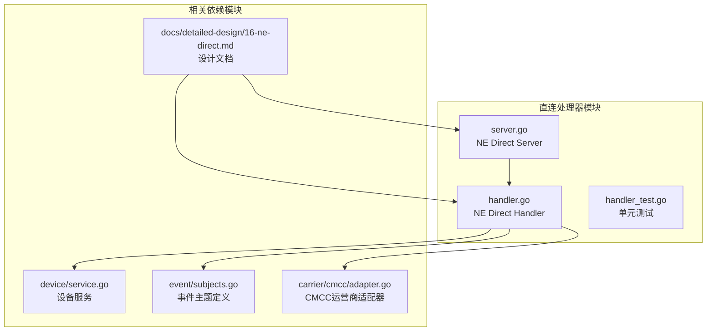
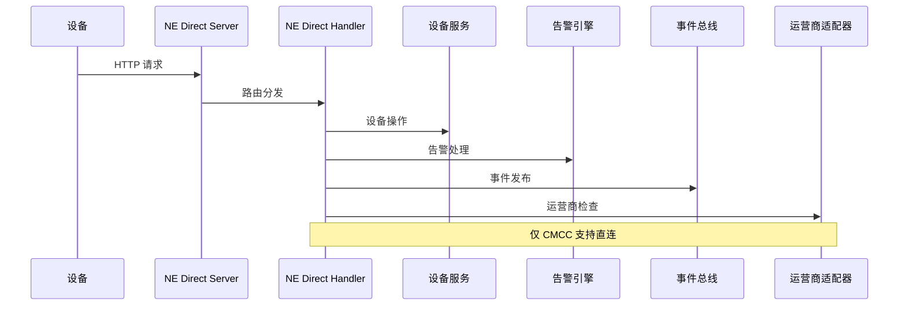
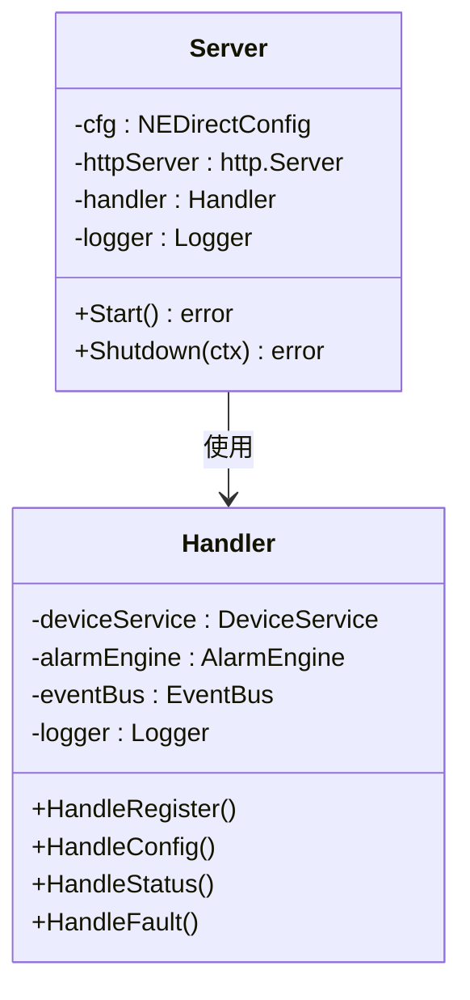
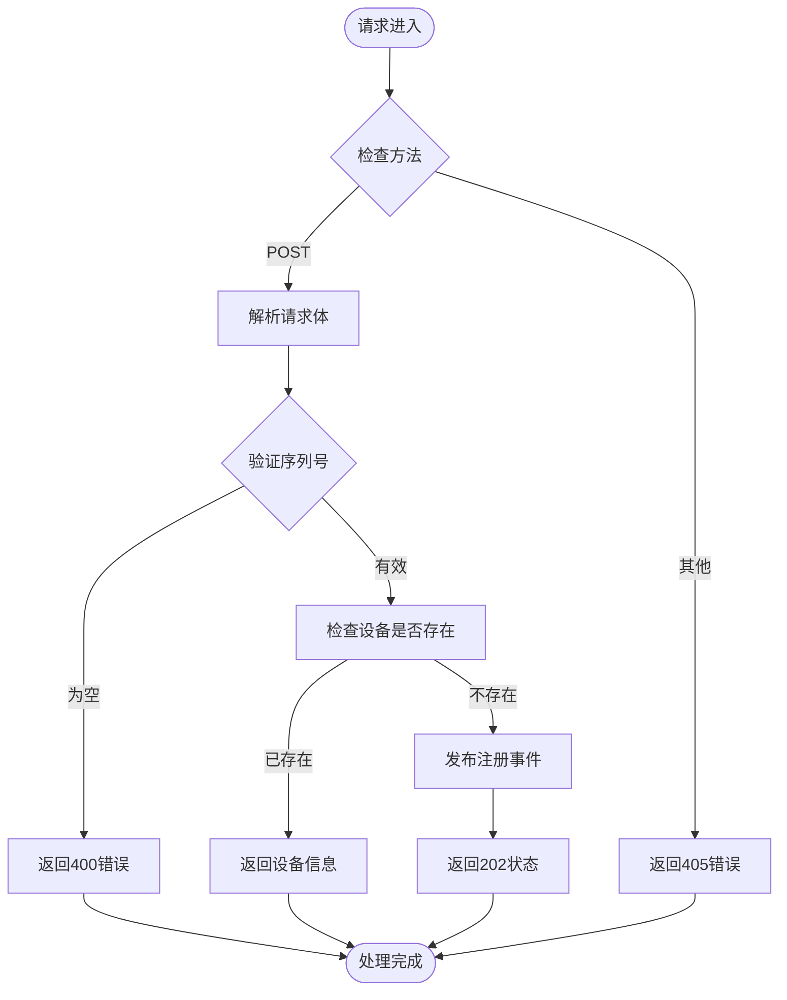
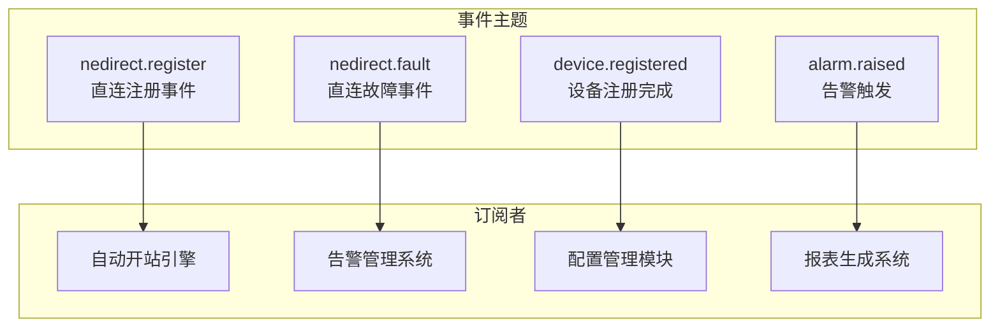
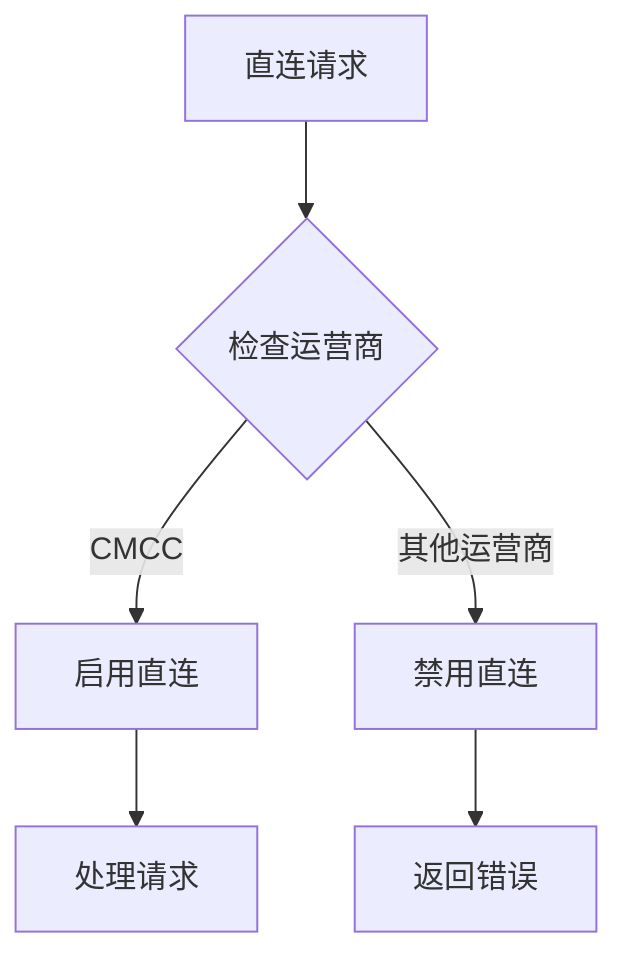

# 直连处理器

<cite>
**本文档引用的文件**
- [handler.go](file://omcgo/internal/nedirect/handler.go)
- [server.go](file://omcgo/internal/nedirect/server.go)
- [16-ne-direct.md](file://omcgo/docs/detailed-design/16-ne-direct.md)
- [subjects.go](file://omcgo/internal/core/event/subjects.go)
- [service.go](file://omcgo/internal/device/service.go)
- [adapter.go](file://omcgo/internal/core/carrier/cmcc/adapter.go)
- [acs-service-flow.md](file://omcgo/docs/design/acs-service-flow.md)
- [handler_test.go](file://omcgo/internal/nedirect/handler_test.go)
</cite>

## 目录
1. [简介](#简介)
2. [项目结构](#项目结构)
3. [核心组件](#核心组件)
4. [架构概览](#架构概览)
5. [详细组件分析](#详细组件分析)
6. [依赖分析](#依赖分析)
7. [性能考虑](#性能考虑)
8. [故障排除指南](#故障排除指南)
9. [结论](#结论)
10. [附录](#附录)

## 简介
直连处理器（NE Direct）是网元设备与网管系统之间的专用直连通信通道，专为中国移动（CMCC）设计，区别于标准 TR069 南向接口。该模块提供设备注册、配置查询、状态监控和故障上报等核心功能，支持与 TR069 南向接口的双模共存。

## 项目结构
直连处理器位于 `internal/nedirect/` 目录下，包含以下关键文件：



**图表来源**
- [server.go:1-67](file://omcgo/internal/nedirect/server.go#L1-L67)
- [handler.go:1-257](file://omcgo/internal/nedirect/handler.go#L1-L257)

**章节来源**
- [server.go:1-67](file://omcgo/internal/nedirect/server.go#L1-L67)
- [handler.go:1-257](file://omcgo/internal/nedirect/handler.go#L1-L257)
- [16-ne-direct.md:1-106](file://omcgo/docs/detailed-design/16-ne-direct.md#L1-L106)

## 核心组件
直连处理器由两个主要组件构成：

### NE Direct Server
独立的 HTTP 服务器，使用标准 `net/http` 包而非 Gin 框架，仅在配置启用时启动。

### NE Direct Handler
HTTP 请求处理器，提供四个核心 API 端点：
- `/nedirect/register` - 设备注册
- `/nedirect/config` - 配置查询
- `/nedirect/status` - 状态查询
- `/nedirect/fault` - 故障上报

**章节来源**
- [server.go:14-42](file://omcgo/internal/nedirect/server.go#L14-L42)
- [handler.go:37-66](file://omcgo/internal/nedirect/handler.go#L37-L66)

## 架构概览
直连处理器采用事件驱动架构，与设备管理模块深度集成：



**图表来源**
- [handler.go:68-239](file://omcgo/internal/nedirect/handler.go#L68-L239)
- [adapter.go:82-83](file://omcgo/internal/core/carrier/cmcc/adapter.go#L82-L83)

## 详细组件分析

### Server 组件分析
NE Direct Server 是独立的 HTTP 服务器，具有以下特性：



**图表来源**
- [server.go:16-41](file://omcgo/internal/nedirect/server.go#L16-L41)
- [handler.go:38-57](file://omcgo/internal/nedirect/handler.go#L38-L57)

#### 启动流程
服务器启动时会：
1. 创建 HTTP ServeMux
2. 注册路由处理器
3. 绑定 TCP 端口
4. 在后台 goroutine 中开始监听

#### 配置选项
- Host: 监听地址
- Port: 监听端口
- ReadTimeout: 读取超时时间
- WriteTimeout: 写入超时时间
- IdleTimeout: 空闲超时时间

**章节来源**
- [server.go:23-66](file://omcgo/internal/nedirect/server.go#L23-L66)

### Handler 组件分析
NE Direct Handler 提供完整的 HTTP API 处理能力：

#### 注册接口（HandleRegister）


**图表来源**
- [handler.go:68-112](file://omcgo/internal/nedirect/handler.go#L68-L112)

#### 配置查询接口（HandleConfig）
- **HTTP方法**: POST
- **请求体**: JSON 格式的 ConfigRequest
- **响应**: 包含设备参数列表的 JSON 对象
- **错误处理**: 设备不存在返回 404，内部错误返回 500

#### 状态查询接口（HandleStatus）
- **HTTP方法**: GET
- **查询参数**: serial_number（必需）
- **响应**: 设备状态信息的 JSON 对象
- **错误处理**: 参数缺失返回 400，设备不存在返回 404

#### 故障上报接口（HandleFault）
- **HTTP方法**: POST
- **请求体**: JSON 格式的 FaultReport
- **处理流程**: 
  1. 验证必填字段
  2. 构建告警对象
  3. 通过告警引擎处理
  4. 发布故障事件
- **响应**: 成功返回 200，失败返回相应错误码

**章节来源**
- [handler.go:114-239](file://omcgo/internal/nedirect/handler.go#L114-L239)

### 事件集成分析
直连处理器通过事件总线与其他模块进行解耦集成：



**图表来源**
- [subjects.go:96-100](file://omcgo/internal/core/event/subjects.go#L96-L100)
- [acs-service-flow.md:364-366](file://omcgo/docs/design/acs-service-flow.md#L364-L366)

**章节来源**
- [subjects.go:1-101](file://omcgo/internal/core/event/subjects.go#L1-L101)
- [handler.go:241-250](file://omcgo/internal/nedirect/handler.go#L241-L250)

## 依赖分析

### 运营商限制机制
直连处理器仅对中国移动（CMCC）开放，通过运营商适配器的 `SupportsDirectConnection()` 方法进行判断：



**图表来源**
- [adapter.go:82-83](file://omcgo/internal/core/carrier/cmcc/adapter.go#L82-L83)

### 设备管理集成
处理器与设备管理模块的集成点：

| 集成点 | 功能描述 | 使用的服务 |
|--------|----------|------------|
| 设备查询 | 根据序列号获取设备信息 | deviceService.GetBySerialNumber |
| 参数查询 | 获取设备参数列表 | deviceService.GetDeviceParameters |
| 状态更新 | 自动更新设备状态 | 设备服务内部逻辑 |
| 注册流程 | 触发设备注册事件 | 事件总线发布 |

**章节来源**
- [handler.go:87-151](file://omcgo/internal/nedirect/handler.go#L87-L151)
- [service.go:42-130](file://omcgo/internal/device/service.go#L42-L130)

## 性能考虑
直连处理器在设计上注重性能和可靠性：

### 超时配置
- ReadTimeout: 30秒
- WriteTimeout: 30秒  
- IdleTimeout: 120秒

### 并发处理
- 使用标准 HTTP 服务器的并发模型
- 每个请求在独立 goroutine 中处理
- 无连接池管理，适合低到中等负载场景

### 内存管理
- 请求体解析使用流式 JSON 解码器
- 及时关闭请求体资源
- 避免大对象的重复拷贝

## 故障排除指南

### 常见错误及解决方案

#### 400 错误（Bad Request）
- **原因**: 请求体格式错误或缺少必要字段
- **解决方案**: 检查 JSON 格式和必填字段完整性

#### 404 错误（Not Found）
- **原因**: 设备不存在
- **解决方案**: 先调用注册接口，确保设备已在系统中登记

#### 405 错误（Method Not Allowed）
- **原因**: 使用了错误的 HTTP 方法
- **解决方案**: 检查接口文档，使用正确的 HTTP 方法

#### 500 错误（Internal Server Error）
- **原因**: 服务器内部错误
- **解决方案**: 查看服务器日志，检查数据库连接和依赖服务状态

### 调试方法
1. **启用详细日志**: 检查服务器启动日志中的 "ne-direct server starting" 记录
2. **验证路由**: 确认 HTTP 服务器已成功绑定到指定端口
3. **单元测试**: 运行处理器的单元测试套件验证核心功能
4. **事件监控**: 检查事件总线是否正确发布直连相关事件

**章节来源**
- [handler_test.go:244-404](file://omcgo/internal/nedirect/handler_test.go#L244-L404)

## 结论
直连处理器为网元设备提供了高效、可靠的专用通信通道，特别针对中国移动的运营需求进行了优化。通过事件驱动架构和严格的运营商限制机制，该模块实现了与现有系统的无缝集成，同时保持了良好的可维护性和扩展性。

## 附录

### API 端点定义

#### 注册接口
- **URL**: `/nedirect/register`
- **方法**: POST
- **请求体**: 
  ```json
  {
    "serial_number": "设备序列号",
    "ip_address": "设备IP地址",
    "manufacturer": "制造商",
    "model_name": "型号名称"
  }
  ```
- **响应**: 
  - 已注册设备: `{ "message": "device already registered", "device_id": "...", "status": "..." }`
  - 新设备注册: `{ "message": "registration accepted" }`

#### 配置查询接口
- **URL**: `/nedirect/config`
- **方法**: POST
- **请求体**: `{ "serial_number": "设备序列号" }`
- **响应**: `{ "device_id": "...", "parameters": [...], "total": N }`

#### 状态查询接口
- **URL**: `/nedirect/status?serial_number=SN`
- **方法**: GET
- **响应**: 
  ```json
  {
    "device_id": "...",
    "serial_number": "SN",
    "status": "active",
    "firmware_version": "1.0.0",
    "ip_address": "192.168.1.100",
    "last_inform_at": "2026-01-01T00:00:00Z"
  }
  ```

#### 故障上报接口
- **URL**: `/nedirect/fault`
- **方法**: POST
- **请求体**: 
  ```json
  {
    "serial_number": "设备序列号",
    "alarm_code": "告警代码",
    "severity": 1,
    "description": "告警描述"
  }
  ```
- **响应**: `{ "message": "fault reported" }`

### 配置选项
- **Host**: 监听主机地址（默认: localhost）
- **Port**: 监听端口号（默认: 8080）
- **ReadTimeout**: 读取超时时间（秒）
- **WriteTimeout**: 写入超时时间（秒）
- **IdleTimeout**: 空闲超时时间（秒）