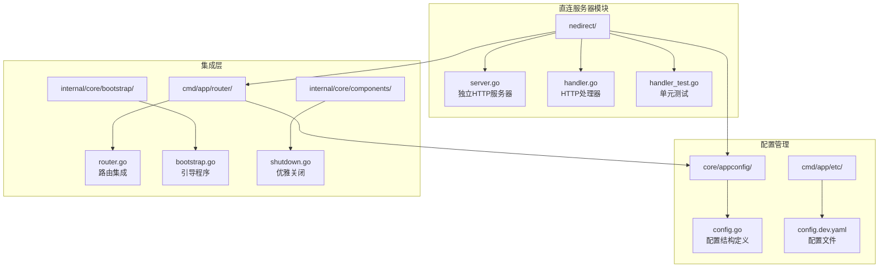
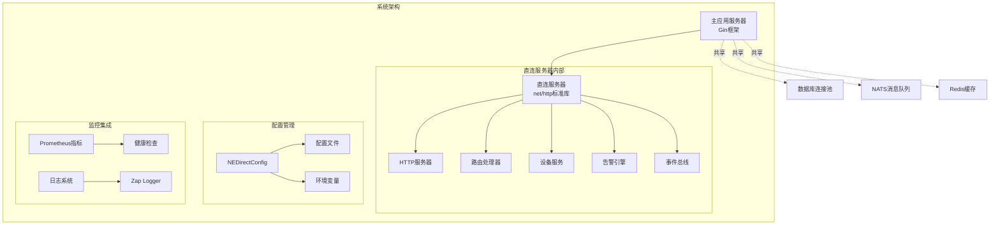
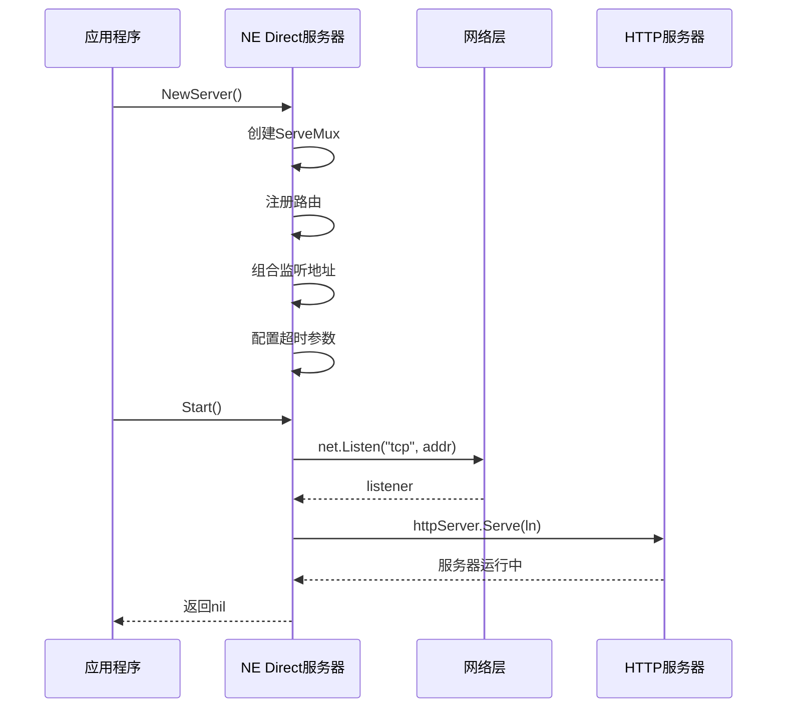
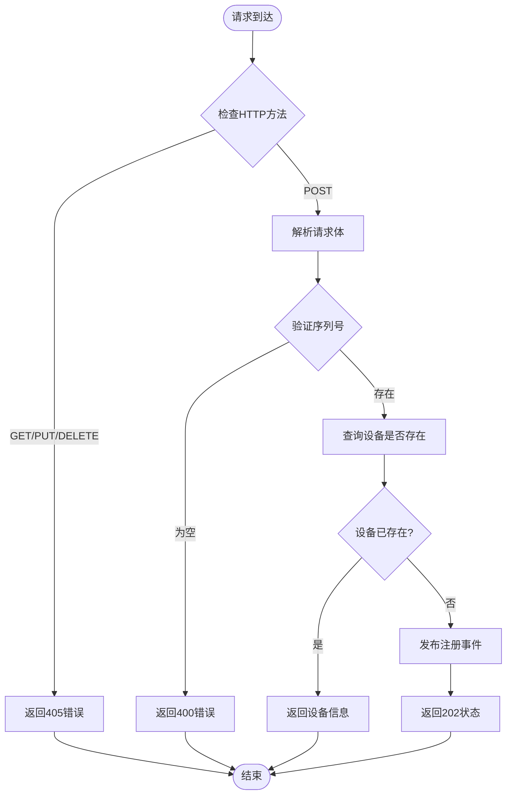
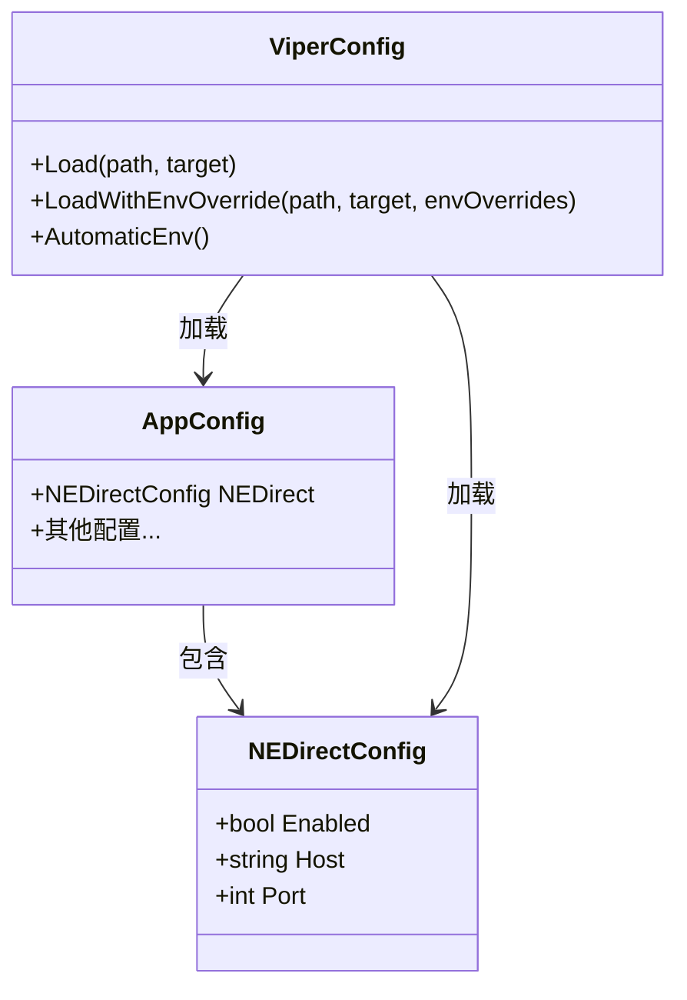
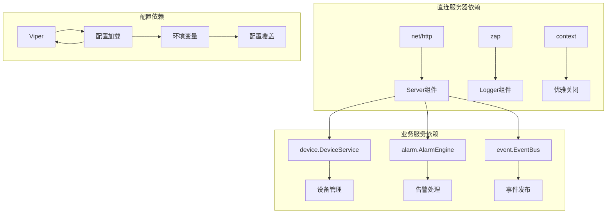

# 直连服务器实现

<cite>
**本文档引用的文件**
- [server.go](file://omcgo/internal/nedirect/server.go)
- [handler.go](file://omcgo/internal/nedirect/handler.go)
- [config.go](file://omcgo/internal/core/appconfig/config.go)
- [router.go](file://omcgo/cmd/app/router/router.go)
- [bootstrap.go](file://omcgo/internal/core/bootstrap/bootstrap.go)
- [shutdown.go](file://omcgo/internal/core/components/shutdown.go)
- [config.dev.yaml](file://omcgo/cmd/app/etc/config.dev.yaml)
- [handler_test.go](file://omcgo/internal/nedirect/handler_test.go)
</cite>

## 目录
1. [简介](#简介)
2. [项目结构](#项目结构)
3. [核心组件](#核心组件)
4. [架构概览](#架构概览)
5. [详细组件分析](#详细组件分析)
6. [依赖关系分析](#依赖关系分析)
7. [性能考虑](#性能考虑)
8. [故障排除指南](#故障排除指南)
9. [结论](#结论)
10. [附录](#附录)

## 简介

直连服务器实现是OMC系统中专门为中国移动运营商提供的网元直连接口服务。该实现采用Go语言的net/http标准库构建独立的HTTP服务器，与Gin框架形成差异化设计，专注于CMCC特定的直连通信需求。

本系统提供了四个核心API端点：设备注册、配置查询、状态查询和故障上报，完全基于HTTP协议实现，无需额外的传输层抽象。服务器采用优雅关闭机制，确保在接收到系统信号时能够安全地停止服务。

## 项目结构

直连服务器相关代码主要分布在以下目录结构中：



**图表来源**
- [server.go:1-67](file://omcgo/internal/nedirect/server.go#L1-L67)
- [handler.go:1-257](file://omcgo/internal/nedirect/handler.go#L1-L257)
- [config.go:73-78](file://omcgo/internal/core/appconfig/config.go#L73-L78)

**章节来源**
- [server.go:1-67](file://omcgo/internal/nedirect/server.go#L1-L67)
- [handler.go:1-257](file://omcgo/internal/nedirect/handler.go#L1-L257)
- [config.go:73-78](file://omcgo/internal/core/appconfig/config.go#L73-L78)

## 核心组件

直连服务器实现包含三个核心组件：

### 1. Server结构体
独立的HTTP服务器实例，负责网络监听、请求处理和优雅关闭。

### 2. Handler结构体  
HTTP处理器，实现四个核心业务API：
- `/nedirect/register` - 设备注册
- `/nedirect/config` - 配置查询  
- `/nedirect/status` - 状态查询
- `/nedirect/fault` - 故障上报

### 3. NEDirectConfig配置
专门的直连服务器配置结构，包含启用开关、主机地址和端口号。

**章节来源**
- [server.go:14-21](file://omcgo/internal/nedirect/server.go#L14-L21)
- [handler.go:37-43](file://omcgo/internal/nedirect/handler.go#L37-L43)
- [config.go:73-78](file://omcgo/internal/core/appconfig/config.go#L73-L78)

## 架构概览

直连服务器采用独立的服务架构，与主应用的Gin框架形成互补：



**图表来源**
- [server.go:14-21](file://omcgo/internal/nedirect/server.go#L14-L21)
- [router.go:331-343](file://omcgo/cmd/app/router/router.go#L331-L343)
- [config.go:73-78](file://omcgo/internal/core/appconfig/config.go#L73-L78)

## 详细组件分析

### Server组件分析

Server组件实现了独立的HTTP服务器，具有以下特点：

#### 初始化过程
- 创建HTTP ServeMux路由表
- 注册所有NE Direct路由
- 组合监听地址（主机+端口）
- 配置超时参数：ReadTimeout=30s, WriteTimeout=30s, IdleTimeout=120s

#### 启动流程


**图表来源**
- [server.go:24-42](file://omcgo/internal/nedirect/server.go#L24-L42)
- [server.go:44-60](file://omcgo/internal/nedirect/server.go#L44-L60)

#### 优雅关闭机制
- 使用context.Context控制关闭超时
- 通过http.Server.Shutdown()方法安全停止
- 记录详细的关闭日志信息

**章节来源**
- [server.go:24-42](file://omcgo/internal/nedirect/server.go#L24-L42)
- [server.go:62-66](file://omcgo/internal/nedirect/server.go#L62-L66)

### Handler组件分析

Handler组件实现了四个核心业务API：

#### 设备注册 (/nedirect/register)


**图表来源**
- [handler.go:68-112](file://omcgo/internal/nedirect/handler.go#L68-L112)

#### 配置查询 (/nedirect/config)
- 支持POST方法
- 验证序列号参数
- 查询设备参数并返回JSON响应
- 错误处理包括设备不存在和内部错误

#### 状态查询 (/nedirect/status)
- 支持GET方法
- 通过URL查询参数获取序列号
- 返回设备的完整状态信息

#### 故障上报 (/nedirect/fault)
- 支持POST方法
- 验证序列号和告警代码
- 构建告警对象并处理
- 发布故障事件到事件总线

**章节来源**
- [handler.go:68-239](file://omcgo/internal/nedirect/handler.go#L68-L239)

### 配置系统分析

配置系统采用Viper库实现，支持文件配置和环境变量覆盖：

#### 配置结构


**图表来源**
- [config.go:73-78](file://omcgo/internal/core/appconfig/config.go#L73-L78)
- [config.go:219-263](file://omcgo/internal/core/appconfig/config.go#L219-L263)

#### 配置文件示例
配置文件位于`cmd/app/etc/config.dev.yaml`，包含以下关键配置项：
- `ne_direct.enabled`: 控制是否启用直连服务器
- `ne_direct.host`: 监听主机地址
- `ne_direct.port`: 监听端口号

**章节来源**
- [config.go:73-78](file://omcgo/internal/core/appconfig/config.go#L73-L78)
- [config.dev.yaml:71-75](file://omcgo/cmd/app/etc/config.dev.yaml#L71-L75)

## 依赖关系分析

直连服务器与系统其他组件的依赖关系如下：



**图表来源**
- [server.go:3-12](file://omcgo/internal/nedirect/server.go#L3-L12)
- [handler.go:3-14](file://omcgo/internal/nedirect/handler.go#L3-L14)
- [config.go:219-263](file://omcgo/internal/core/appconfig/config.go#L219-L263)

**章节来源**
- [server.go:3-12](file://omcgo/internal/nedirect/server.go#L3-L12)
- [handler.go:3-14](file://omcgo/internal/nedirect/handler.go#L3-L14)

## 性能考虑

### 超时参数配置
直连服务器采用了经过优化的超时参数：
- **ReadTimeout**: 30秒 - 控制读取请求体的时间限制
- **WriteTimeout**: 30秒 - 控制写入响应的时间限制  
- **IdleTimeout**: 120秒 - 控制空闲连接的保持时间

### 并发处理
- 服务器使用Go标准库的并发模型
- 每个请求在独立的goroutine中处理
- 无中间件层，减少处理开销

### 内存管理
- 使用标准库的内存管理机制
- 避免不必要的内存分配
- 及时释放请求体资源

## 故障排除指南

### 常见问题及解决方案

#### 服务器启动失败
**症状**: 启动时出现"listen"错误
**可能原因**:
- 端口已被占用
- 主机地址配置错误
- 权限不足

**解决方法**:
1. 检查端口占用情况
2. 验证主机地址配置
3. 确认运行权限

#### 请求超时错误
**症状**: 客户端收到超时响应
**可能原因**:
- ReadTimeout过短
- WriteTimeout过短
- 网络延迟过高

**解决方法**:
1. 调整超时参数配置
2. 检查网络连接质量
3. 优化后端服务性能

#### 设备注册失败
**症状**: 注册API返回错误
**可能原因**:
- 请求体格式不正确
- 序列号为空
- 数据库连接问题

**解决方法**:
1. 验证JSON请求格式
2. 检查序列号字段
3. 确认数据库服务正常

**章节来源**
- [handler_test.go:163-247](file://omcgo/internal/nedirect/handler_test.go#L163-L247)
- [handler_test.go:288-300](file://omcgo/internal/nedirect/handler_test.go#L288-L300)

## 结论

直连服务器实现展现了清晰的架构设计和良好的工程实践：

### 技术优势
1. **简洁性**: 采用net/http标准库，避免了额外的框架依赖
2. **可靠性**: 实现了完整的优雅关闭机制
3. **可维护性**: 清晰的组件分离和配置管理
4. **性能**: 高效的并发处理和合理的超时配置

### 架构特色
- 与Gin框架形成互补，满足不同场景需求
- 专门针对CMCC运营商优化
- 独立的服务架构，便于扩展和维护

### 改进建议
1. 添加更多的监控指标
2. 增强错误处理和重试机制
3. 考虑添加中间件支持
4. 扩展API文档和示例

## 附录

### API参考

#### 设备注册
- **URL**: `/nedirect/register`
- **方法**: POST
- **请求体**: JSON格式的RegisterRequest
- **响应**: JSON格式的状态信息

#### 配置查询  
- **URL**: `/nedirect/config`
- **方法**: POST
- **请求体**: JSON格式的ConfigRequest
- **响应**: JSON格式的设备参数列表

#### 状态查询
- **URL**: `/nedirect/status?serial_number={sn}`
- **方法**: GET
- **参数**: serial_number（查询参数）
- **响应**: JSON格式的设备状态

#### 故障上报
- **URL**: `/nedirect/fault`
- **方法**: POST
- **请求体**: JSON格式的FaultReport
- **响应**: JSON格式的操作结果

### 部署配置示例

#### 基本配置
```yaml
ne_direct:
  enabled: true
  host: "0.0.0.0"
  port: 7549
```

#### 生产环境配置
```yaml
ne_direct:
  enabled: false
  host: "127.0.0.1"
  port: 7549
```

**章节来源**
- [config.dev.yaml:71-75](file://omcgo/cmd/app/etc/config.dev.yaml#L71-L75)
- [router.go:331-343](file://omcgo/cmd/app/router/router.go#L331-L343)