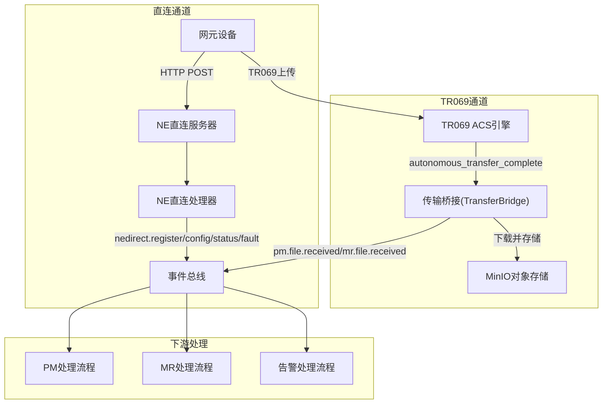
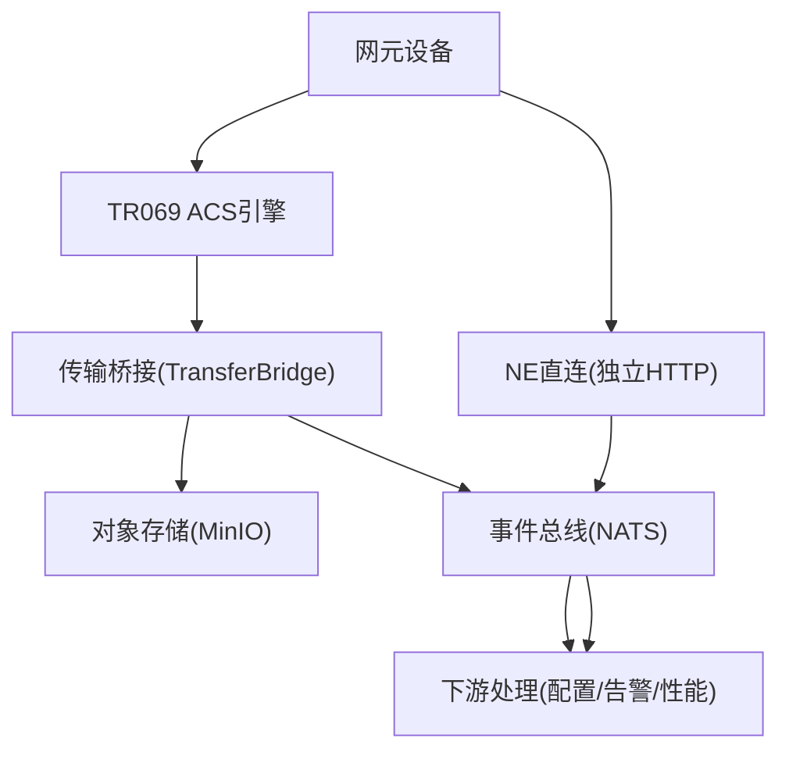
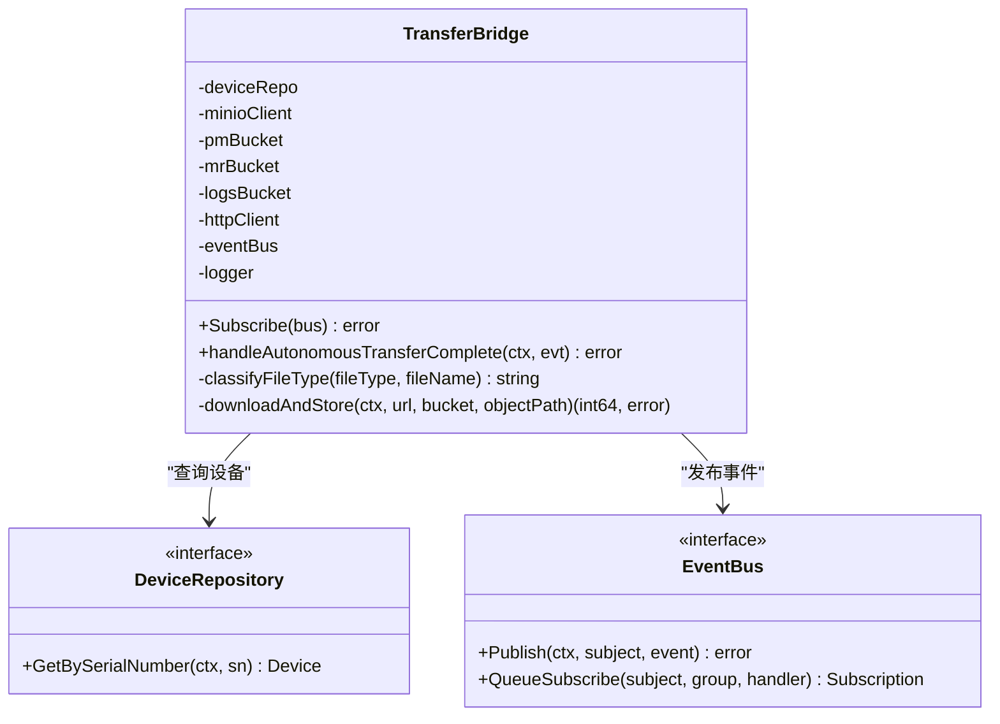
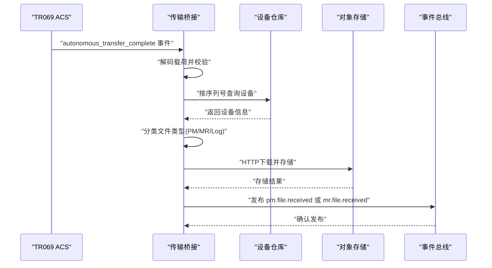
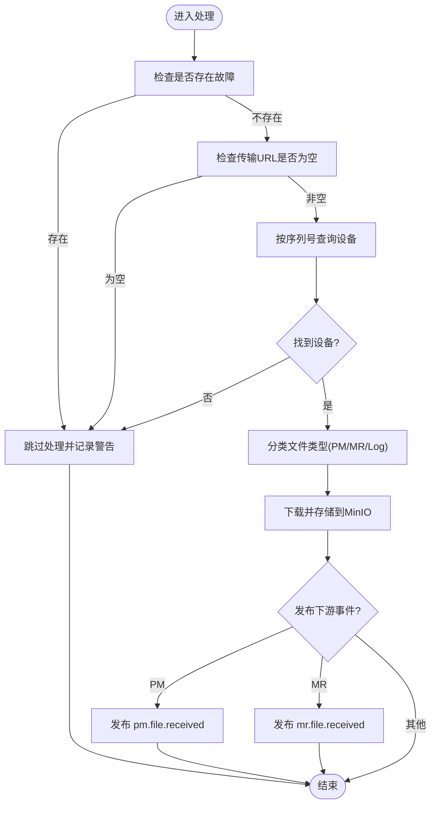
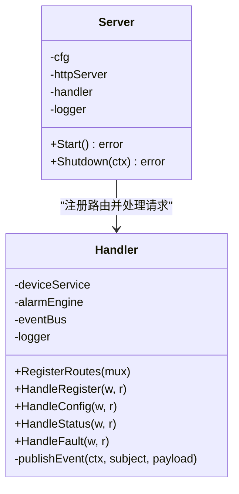
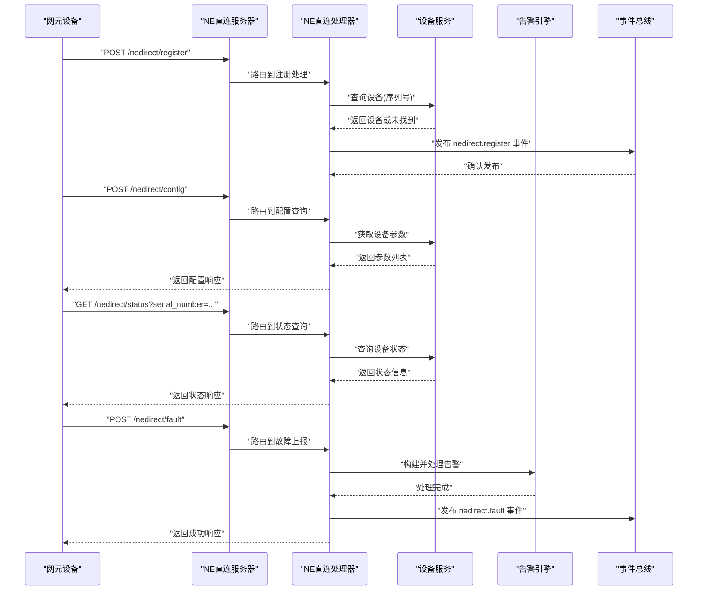
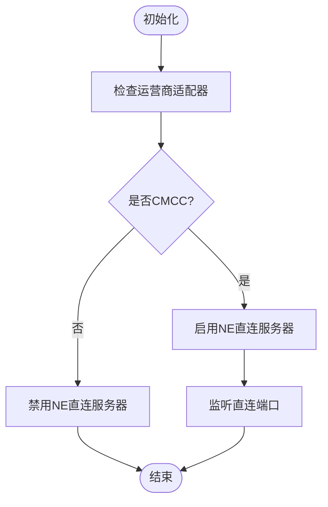
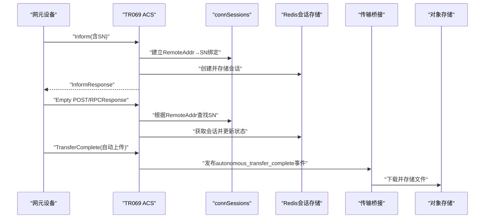
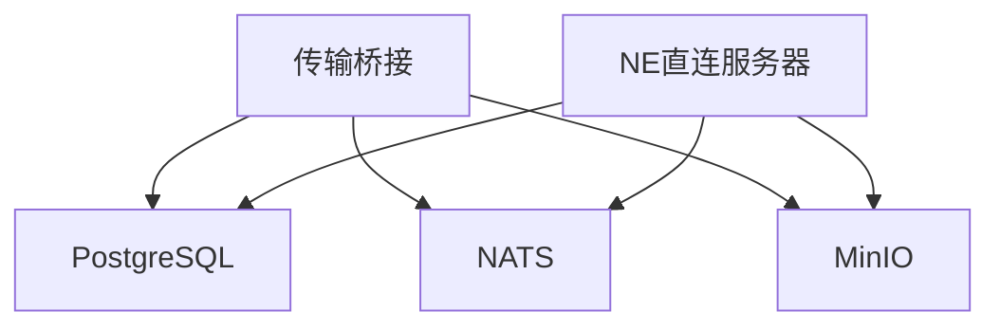

# 直连桥接机制

<cite>
**本文档引用的文件**
- [bridge.go](file://omcgo/internal/transfer/bridge.go)
- [bridge_test.go](file://omcgo/internal/transfer/bridge_test.go)
- [server.go](file://omcgo/internal/nedirect/server.go)
- [handler.go](file://omcgo/internal/nedirect/handler.go)
- [adapter.go](file://omcgo/internal/core/carrier/cmcc/adapter.go)
- [registry.go](file://omcgo/internal/core/carrier/registry.go)
- [metrics.go](file://omcgo/internal/acs/metrics.go)
- [docker-compose.yml](file://omcgo/deployments/docker/docker-compose.yml)
- [deployment-guide.md](file://omcgo/docs/operations/deployment-guide.md)
- [interface-topology.md](file://omcgo/docs/architecture/interface-topology.md)
- [16-ne-direct.md](file://omcgo/docs/detailed-design/16-ne-direct.md)
- [06-tr069-protocol-library.md](file://omcgo/docs/detailed-design/06-tr069-protocol-library.md)
- [session-design.md](file://omcgo/docs/design/session-design.md)
</cite>

## 目录
1. [简介](#简介)
2. [项目结构](#项目结构)
3. [核心组件](#核心组件)
4. [架构概览](#架构概览)
5. [详细组件分析](#详细组件分析)
6. [依赖分析](#依赖分析)
7. [性能考虑](#性能考虑)
8. [故障排查指南](#故障排查指南)
9. [结论](#结论)
10. [附录](#附录)

## 简介
本文件针对直连桥接机制进行深入技术文档编制，重点阐述以下内容：
- 直连通信的桥接原理与消息转发机制
- 连接管理策略与会话绑定
- 桥接器在网元设备与OMC系统之间的高效通信通道
- 连接池管理、消息队列处理与负载均衡策略
- 配置参数、性能监控指标与故障转移机制
- 与TR069协议处理模块的协作关系、数据同步策略与冲突处理
- 部署架构、网络拓扑要求与安全防护措施
- 配置示例、性能调优指南与故障诊断方法

## 项目结构
直连桥接机制涉及两个关键子系统：
- TR069传输桥接（TransferBridge）：从TR069自动上传事件中抽取文件并存储到对象存储，发布下游事件以驱动PM/MR数据处理
- 网元直连（NE Direct）：为特定运营商（如CMCC）提供独立HTTP服务，处理注册、配置查询、状态查询与故障上报

**图表来源**
- [bridge.go:18-67](file://omcgo/internal/transfer/bridge.go#L18-L67)
- [handler.go:37-66](file://omcgo/internal/nedirect/handler.go#L37-L66)

**章节来源**
- [interface-topology.md:134-149](file://omcgo/docs/architecture/interface-topology.md#L134-L149)
- [16-ne-direct.md:63-106](file://omcgo/docs/detailed-design/16-ne-direct.md#L63-L106)

## 核心组件
- 传输桥接（TransferBridge）：订阅TR069自动传输完成事件，下载文件到MinIO，并根据文件类型发布PM/MR接收事件
- NE直连服务器（NEDirect Server）：独立HTTP服务，按运营商策略启用，处理注册、配置查询、状态查询与故障上报
- NE直连处理器（NEDirect Handler）：实现具体的HTTP路由与业务逻辑，发布事件驱动下游处理
- 运营商适配器（Carrier Adapter）：通过接口判断是否启用直连能力（例如CMCC）

**章节来源**
- [bridge.go:18-67](file://omcgo/internal/transfer/bridge.go#L18-L67)
- [server.go:14-42](file://omcgo/internal/nedirect/server.go#L14-L42)
- [handler.go:37-66](file://omcgo/internal/nedirect/handler.go#L37-L66)
- [adapter.go:82-83](file://omcgo/internal/core/carrier/cmcc/adapter.go#L82-L83)

## 架构概览
直连桥接机制采用“双通道”架构：
- TR069通道：标准化协议，适用于广泛场景；传输桥接负责文件落地与事件发布
- 直连通道：绕过TR069中间层，面向特定运营商的高性能直连接口

**图表来源**
- [bridge.go:18-67](file://omcgo/internal/transfer/bridge.go#L18-L67)
- [handler.go:37-66](file://omcgo/internal/nedirect/handler.go#L37-L66)

## 详细组件分析

### 传输桥接（TransferBridge）
传输桥接负责从TR069自动传输完成事件中抽取文件，分类存储到MinIO，并发布下游事件。

**图表来源**
- [bridge.go:18-67](file://omcgo/internal/transfer/bridge.go#L18-L67)

**图表来源**
- [bridge.go:83-209](file://omcgo/internal/transfer/bridge.go#L83-L209)

**图表来源**
- [bridge.go:83-209](file://omcgo/internal/transfer/bridge.go#L83-L209)

**章节来源**
- [bridge.go:18-259](file://omcgo/internal/transfer/bridge.go#L18-L259)
- [bridge_test.go:124-176](file://omcgo/internal/transfer/bridge_test.go#L124-L176)

### NE直连服务器与处理器
NE直连为特定运营商提供独立HTTP服务，处理注册、配置查询、状态查询与故障上报。

**图表来源**
- [server.go:14-67](file://omcgo/internal/nedirect/server.go#L14-L67)
- [handler.go:37-66](file://omcgo/internal/nedirect/handler.go#L37-L66)

**图表来源**
- [handler.go:68-239](file://omcgo/internal/nedirect/handler.go#L68-L239)

**章节来源**
- [server.go:14-67](file://omcgo/internal/nedirect/server.go#L14-L67)
- [handler.go:37-257](file://omcgo/internal/nedirect/handler.go#L37-L257)

### 运营商门控与直连启用策略
通过运营商适配器接口判断是否启用直连能力，当前仅CMCC返回true。

**图表来源**
- [16-ne-direct.md:71-80](file://omcgo/docs/detailed-design/16-ne-direct.md#L71-L80)
- [adapter.go:82-83](file://omcgo/internal/core/carrier/cmcc/adapter.go#L82-L83)

**章节来源**
- [16-ne-direct.md:63-106](file://omcgo/docs/detailed-design/16-ne-direct.md#L63-L106)
- [adapter.go:82-83](file://omcgo/internal/core/carrier/cmcc/adapter.go#L82-L83)

### 与TR069协议处理模块的协作
- TR069会话管理：通过connSessions将TCP连接与设备SN绑定，确保后续Empty POST与RPC响应可定位设备
- 传输桥接：在TR069自动传输完成后，桥接器接管文件落地与事件发布
- NE直连：与TR069互补，适用于高容量设备的实时管理

**图表来源**
- [session-design.md:85-243](file://omcgo/docs/design/session-design.md#L85-L243)
- [bridge.go:83-209](file://omcgo/internal/transfer/bridge.go#L83-L209)

**章节来源**
- [session-design.md:85-243](file://omcgo/docs/design/session-design.md#L85-L243)
- [06-tr069-protocol-library.md:1-400](file://omcgo/docs/detailed-design/06-tr069-protocol-library.md#L1-L400)

## 依赖分析
- 组件耦合与内聚
  - 传输桥接与设备仓库、事件总线、MinIO客户端耦合，职责清晰且内聚于文件落地与事件发布
  - NE直连服务器与处理器通过net/http标准库实现，路由注册与业务逻辑分离
- 外部依赖
  - NATS用于事件总线，MinIO用于对象存储，Redis用于会话存储（TR069）
  - PostgreSQL作为主数据库，TimescaleDB用于时序数据（部署指南提及）

**图表来源**
- [docker-compose.yml:20-91](file://omcgo/deployments/docker/docker-compose.yml#L20-L91)
- [deployment-guide.md:10-18](file://omcgo/docs/operations/deployment-guide.md#L10-L18)

**章节来源**
- [docker-compose.yml:1-194](file://omcgo/deployments/docker/docker-compose.yml#L1-L194)
- [deployment-guide.md:1-207](file://omcgo/docs/operations/deployment-guide.md#L1-L207)

## 性能考虑
- 连接池管理
  - 每服务独立连接池，PostgreSQL建议最大20连接，全局预算约200连接
  - Redis推荐集群部署，提升并发与可用性
- 消息队列处理
  - NATS JetStream用于事件存储与消费，Worker基于KEDA水平扩展
  - 队列深度超过阈值时触发扩容，避免积压
- 负载均衡策略
  - ACS按自定义指标（活动会话数）水平扩展
  - App按CPU使用率扩展
- 监控指标
  - ACS暴露会话数、RPC耗时、错误数、速率限制等指标
  - 生产环境建议设置告警阈值，如会话使用率、错误率、队列滞后等

**章节来源**
- [deployment-guide.md:108-169](file://omcgo/docs/operations/deployment-guide.md#L108-L169)
- [metrics.go:5-63](file://omcgo/internal/acs/metrics.go#L5-L63)

## 故障排查指南
- 传输桥接常见问题
  - 事件未订阅：检查事件总线订阅是否成功
  - 设备不存在：确认设备序列号正确且已入库
  - 传输URL为空：检查TR069上传流程是否正常
  - HTTP下载失败：检查网络连通性与目标URL可达性
  - MinIO存储失败：检查桶权限、对象路径与存储空间
- NE直连常见问题
  - 服务器未启动：确认运营商配置启用直连
  - 路由不匹配：检查HTTP方法与路径
  - 设备未找到：确认序列号正确
  - 告警处理失败：检查告警引擎与事件发布
- 基础设施问题
  - NATS连接异常：检查JetStream状态与消费者健康
  - 数据库连接池耗尽：监控池使用率并适当扩容
  - MinIO不可用：检查存储节点与镜像配置

**章节来源**
- [bridge_test.go:178-252](file://omcgo/internal/transfer/bridge_test.go#L178-L252)
- [handler.go:68-239](file://omcgo/internal/nedirect/handler.go#L68-L239)
- [deployment-guide.md:186-207](file://omcgo/docs/operations/deployment-guide.md#L186-L207)

## 结论
直连桥接机制通过“TR069通道+直连通道”的双通道架构，在保证标准化协议兼容的同时，为特定运营商提供了高性能的直连能力。传输桥接与NE直连分别承担文件落地与业务处理职责，配合事件总线与基础设施组件，形成完整的数据流转闭环。结合完善的监控与扩缩容策略，可在大规模设备场景下保持稳定与高效。

## 附录

### 配置参数示例
- 运营商门控（仅CMCC启用直连）
  - 通过运营商适配器接口判断是否启用直连
- NE直连服务器
  - 主机与端口配置，超时参数（读取/写入/空闲）
- 数据库连接池
  - 每服务最大连接数、最小连接数、生命周期与空闲时间
- 对象存储
  - MinIO端点、访问密钥、秘密密钥与桶名称

**章节来源**
- [16-ne-direct.md:71-80](file://omcgo/docs/detailed-design/16-ne-direct.md#L71-L80)
- [server.go:23-42](file://omcgo/internal/nedirect/server.go#L23-L42)
- [deployment-guide.md:155-167](file://omcgo/docs/operations/deployment-guide.md#L155-L167)
- [docker-compose.yml:63-78](file://omcgo/deployments/docker/docker-compose.yml#L63-L78)

### 部署架构与网络拓扑
- 基础设施组件：PostgreSQL、Redis、NATS、MinIO
- 应用组件：ACS引擎、App服务、Worker
- 网络要求：设备可访问ACS与直连端点，内部服务通过Service暴露

**章节来源**
- [docker-compose.yml:19-194](file://omcgo/deployments/docker/docker-compose.yml#L19-L194)
- [deployment-guide.md:10-18](file://omcgo/docs/operations/deployment-guide.md#L10-L18)

### 安全防护措施
- TLS配置：ACS设备端TLS证书与API入口TLS证书管理
- 认证与授权：基于RBAC的访问控制
- 日志与审计：结构化日志与审计日志记录

**章节来源**
- [deployment-guide.md:90-107](file://omcgo/docs/operations/deployment-guide.md#L90-L107)