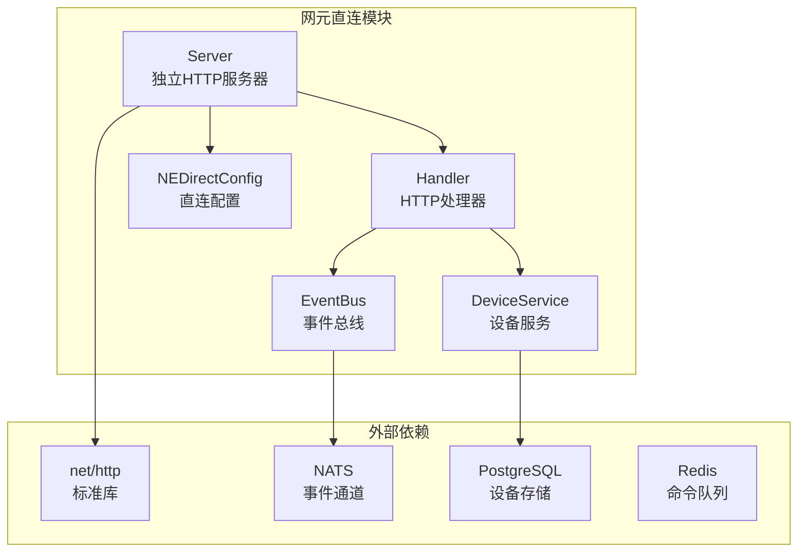
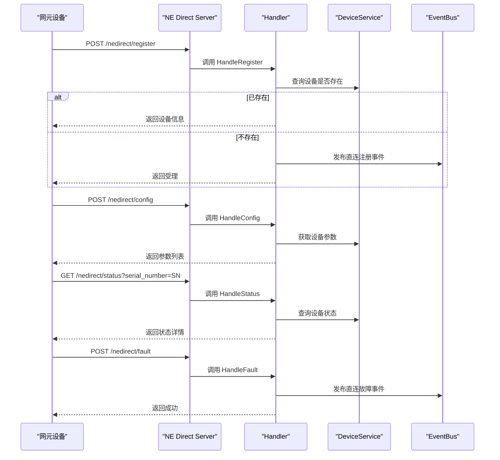
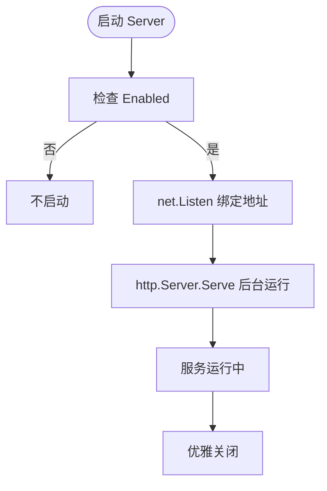
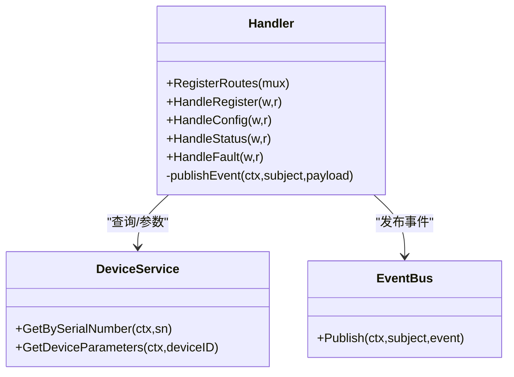
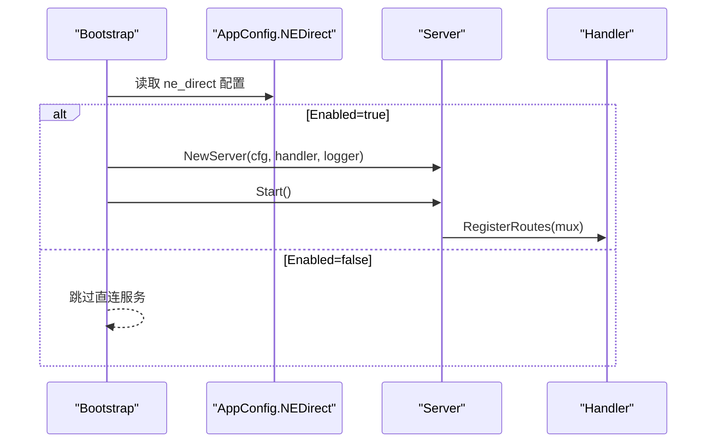
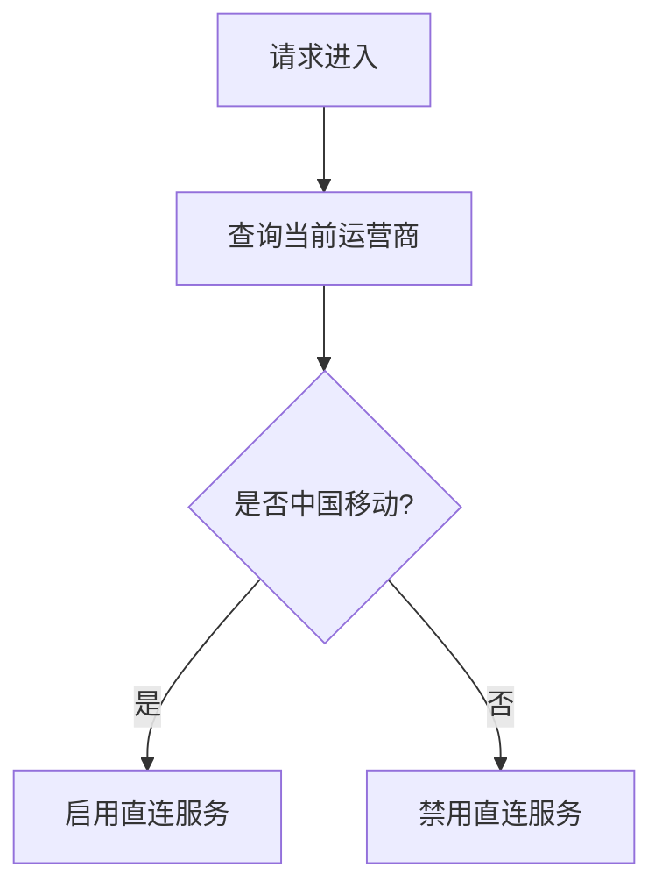
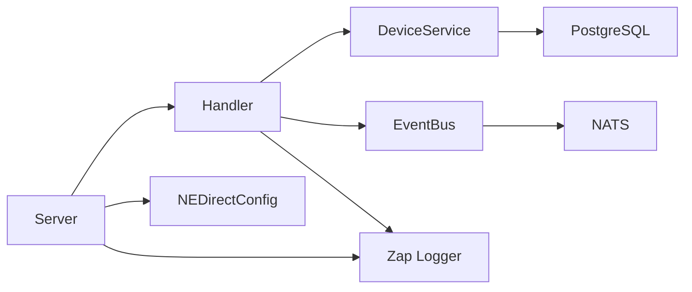

# 网元直连模块

<cite>
**本文引用的文件**
- [server.go](file://omcgo/internal/nedirect/server.go)
- [handler.go](file://omcgo/internal/nedirect/handler.go)
- [config.go](file://omcgo/internal/core/appconfig/config.go)
- [config.dev.yaml](file://omcgo/cmd/app/etc/config.dev.yaml)
- [16-ne-direct.md](file://omcgo/docs/detailed-design/16-ne-direct.md)
- [07-ne-direct-connection.md](file://omcgo/docs/features/07-ne-direct-connection.md)
- [adapter.go](file://omcgo/internal/core/carrier/cmcc/adapter.go)
- [handler_test.go](file://omcgo/internal/nedirect/handler_test.go)
- [service.go](file://omcgo/internal/device/service.go)
- [bus.go](file://omcgo/internal/core/event/bus.go)
- [bootstrap.go](file://omcgo/internal/core/bootstrap/bootstrap.go)
</cite>

## 目录
1. [简介](#简介)
2. [项目结构](#项目结构)
3. [核心组件](#核心组件)
4. [架构总览](#架构总览)
5. [详细组件分析](#详细组件分析)
6. [依赖关系分析](#依赖关系分析)
7. [性能考虑](#性能考虑)
8. [故障排除指南](#故障排除指南)
9. [结论](#结论)
10. [附录](#附录)

## 简介
本文件面向“网元直连模块”的技术文档，聚焦于中国移动专有的网元直连通信能力，涵盖直连通信实现原理、高效管理机制、实时控制流程、安全策略、连接状态监控、异常处理与故障恢复、应用场景、性能优化与最佳实践，并提供配置示例、API 使用指南与故障排除方法。该模块以独立 HTTP 服务器形式提供直连接口，与 TR069 南向接口形成互补，支持设备注册、配置查询、状态查询与故障上报等关键能力。

## 项目结构
网元直连模块位于后端工程的内部包中，采用清晰的分层与职责分离：
- 独立 HTTP 服务器：负责监听 TCP 端口并提供路由
- 处理器：封装 HTTP 路由与业务处理逻辑
- 应用配置：集中管理直连服务的开关与网络参数
- 运营商适配：通过 CarrierRegistry 识别是否启用直连（移动独有）
- 事件总线：用于发布直连相关事件，驱动后续处理流程
- 设备服务：提供设备查询与参数读取能力

**图表来源**
- [server.go:14-66](file://omcgo/internal/nedirect/server.go#L14-L66)
- [handler.go:37-58](file://omcgo/internal/nedirect/handler.go#L37-L58)
- [config.go:73-78](file://omcgo/internal/core/appconfig/config.go#L73-L78)

**章节来源**
- [server.go:14-66](file://omcgo/internal/nedirect/server.go#L14-L66)
- [handler.go:37-66](file://omcgo/internal/nedirect/handler.go#L37-L66)
- [config.go:73-78](file://omcgo/internal/core/appconfig/config.go#L73-L78)

## 核心组件
- 独立 HTTP 服务器
  - 仅在配置开启时启动，使用标准库 net/http 构建
  - 提供优雅关闭与超时控制
- HTTP 处理器
  - 注册四类路由：注册、配置查询、状态查询、故障上报
  - 与设备服务、事件总线、告警引擎协作
- 应用配置
  - NEDirectConfig 提供开关、主机与端口
  - 默认关闭，需显式启用
- 运营商适配
  - 仅中国移动（CMCC）支持直连能力
- 事件总线
  - 发布直连注册与故障事件，供后续处理流程消费

**章节来源**
- [server.go:23-66](file://omcgo/internal/nedirect/server.go#L23-L66)
- [handler.go:60-66](file://omcgo/internal/nedirect/handler.go#L60-L66)
- [config.go:73-78](file://omcgo/internal/core/appconfig/config.go#L73-L78)
- [adapter.go:82-83](file://omcgo/internal/core/carrier/cmcc/adapter.go#L82-L83)

## 架构总览
网元直连模块采用“独立服务器 + 轻量处理器”的架构，与主应用解耦，便于按需启用与运维隔离。其核心交互如下：

**图表来源**
- [server.go:44-66](file://omcgo/internal/nedirect/server.go#L44-L66)
- [handler.go:68-239](file://omcgo/internal/nedirect/handler.go#L68-L239)
- [service.go:132-200](file://omcgo/internal/device/service.go#L132-L200)
- [bus.go:5-20](file://omcgo/internal/core/event/bus.go#L5-L20)

## 详细组件分析

### 独立 HTTP 服务器
- 职责
  - 构造标准 HTTP 服务器，注册路由
  - 在配置允许时启动监听，后台 goroutine 提供服务
  - 提供优雅关闭，确保资源释放
- 关键点
  - 仅在 NEDirectConfig.Enabled 为真时启动
  - 使用标准库 net/http，避免额外依赖
  - 设置 ReadTimeout/WriteTimeout/IdleTimeout，提升稳定性

**图表来源**
- [server.go:23-66](file://omcgo/internal/nedirect/server.go#L23-L66)

**章节来源**
- [server.go:23-66](file://omcgo/internal/nedirect/server.go#L23-L66)

### HTTP 处理器与路由
- 路由注册
  - /nedirect/register：POST 设备注册
  - /nedirect/config：POST 配置查询
  - /nedirect/status：GET 状态查询
  - /nedirect/fault：POST 故障上报
- 业务处理
  - 注册：校验序列号，若未注册则发布事件交由后续流程处理
  - 配置：校验序列号，查询设备参数并返回
  - 状态：查询设备状态信息
  - 故障：构建告警对象，调用告警引擎处理并发布事件

**图表来源**
- [handler.go:37-257](file://omcgo/internal/nedirect/handler.go#L37-L257)
- [service.go:132-200](file://omcgo/internal/device/service.go#L132-L200)
- [bus.go:5-20](file://omcgo/internal/core/event/bus.go#L5-L20)

**章节来源**
- [handler.go:60-257](file://omcgo/internal/nedirect/handler.go#L60-L257)

### 配置与启动集成
- 应用配置
  - AppConfig.NEDirect 提供 Enabled/Host/Port
  - 默认关闭，避免误启用
- 启动流程
  - 通过 bootstrap 初始化基础设施后，按需创建 Server 与 Handler
  - 仅在配置为真时启动

**图表来源**
- [config.go:73-78](file://omcgo/internal/core/appconfig/config.go#L73-L78)
- [config.dev.yaml:65-68](file://omcgo/cmd/app/etc/config.dev.yaml#L65-L68)
- [bootstrap.go:64-91](file://omcgo/internal/core/bootstrap/bootstrap.go#L64-L91)

**章节来源**
- [config.go:73-78](file://omcgo/internal/core/appconfig/config.go#L73-L78)
- [config.dev.yaml:65-68](file://omcgo/cmd/app/etc/config.dev.yaml#L65-L68)
- [bootstrap.go:64-91](file://omcgo/internal/core/bootstrap/bootstrap.go#L64-L91)

### 运营商限制与直连启用
- 仅中国移动（CMCC）支持直连能力
- 通过 CarrierRegistry 与 CMCC 适配器的 SupportsDirectConnection 方法判断

**图表来源**
- [adapter.go:82-83](file://omcgo/internal/core/carrier/cmcc/adapter.go#L82-L83)

**章节来源**
- [adapter.go:82-83](file://omcgo/internal/core/carrier/cmcc/adapter.go#L82-L83)

### 安全策略与访问控制
- 认证与授权
  - 当前直连模块未内置认证/鉴权逻辑，建议通过前置网关或反向代理实现
  - 可结合企业级 WAF/防火墙限制来源 IP 与访问频率
- 传输安全
  - 建议在生产环境启用 TLS（通过反向代理或服务端证书）
- 请求校验
  - 对关键字段进行必填校验与方法校验，避免非法请求

**章节来源**
- [handler.go:68-112](file://omcgo/internal/nedirect/handler.go#L68-L112)
- [handler.go:114-152](file://omcgo/internal/nedirect/handler.go#L114-L152)
- [handler.go:154-181](file://omcgo/internal/nedirect/handler.go#L154-L181)
- [handler.go:183-239](file://omcgo/internal/nedirect/handler.go#L183-L239)

### 连接状态监控与异常处理
- 连接监控
  - 服务器设置 ReadTimeout/WriteTimeout/IdleTimeout，防止资源泄漏
  - 通过日志记录启动/停止与错误事件
- 异常处理
  - 对设备查询失败、参数读取失败等情况返回 500 并记录错误
  - 对缺失参数、方法不匹配等情况返回 4xx 并提示原因
- 故障恢复
  - 优雅关闭：接收信号后先停止新连接，再等待活动连接结束
  - 事件重试：通过事件总线与下游消费者实现幂等与重试

**章节来源**
- [server.go:34-41](file://omcgo/internal/nedirect/server.go#L34-L41)
- [server.go:62-66](file://omcgo/internal/nedirect/server.go#L62-L66)
- [handler.go:88-94](file://omcgo/internal/nedirect/handler.go#L88-L94)
- [handler.go:140-145](file://omcgo/internal/nedirect/handler.go#L140-L145)

## 依赖关系分析
- 组件耦合
  - Handler 依赖 DeviceService、EventBus、Zap 日志
  - Server 依赖 Handler、Zap 日志、标准库 HTTP
  - 配置通过 AppConfig 注入
- 外部依赖
  - PostgreSQL：设备与参数持久化
  - NATS：事件总线
  - Redis：命令队列（间接参与）

**图表来源**
- [handler.go:37-58](file://omcgo/internal/nedirect/handler.go#L37-L58)
- [server.go:16-21](file://omcgo/internal/nedirect/server.go#L16-L21)
- [config.go:73-78](file://omcgo/internal/core/appconfig/config.go#L73-L78)

**章节来源**
- [handler.go:37-58](file://omcgo/internal/nedirect/handler.go#L37-L58)
- [server.go:16-21](file://omcgo/internal/nedirect/server.go#L16-L21)
- [config.go:73-78](file://omcgo/internal/core/appconfig/config.go#L73-L78)

## 性能考虑
- 连接与并发
  - 使用标准库 HTTP 服务器，避免额外中间层开销
  - 合理设置超时参数，平衡响应速度与资源占用
- 路由与处理
  - 路由简单明确，处理器职责单一，降低上下文切换成本
- 存储与查询
  - 设备查询与参数读取走数据库，建议在设备表与参数表建立合适索引
- 事件处理
  - 事件总线异步化，避免阻塞请求处理路径

[本节为通用性能建议，无需具体文件分析]

## 故障排除指南
- 常见问题与排查步骤
  - 无法访问直连接口
    - 检查 AppConfig.ne_direct.enabled 是否为 true
    - 确认 Host/Port 配置正确且端口未被占用
  - 注册接口返回 400
    - 检查请求体是否包含 serial_number
    - 确认请求方法为 POST
  - 配置查询返回 404
    - 确认设备已注册且 serial_number 正确
  - 故障上报返回 500
    - 查看日志中告警处理失败原因
- 单元测试参考
  - 提供了完整的路由与业务逻辑测试用例，可作为行为验证的参考

**章节来源**
- [handler_test.go:163-247](file://omcgo/internal/nedirect/handler_test.go#L163-L247)
- [handler_test.go:249-300](file://omcgo/internal/nedirect/handler_test.go#L249-L300)
- [handler_test.go:302-353](file://omcgo/internal/nedirect/handler_test.go#L302-L353)
- [handler_test.go:355-415](file://omcgo/internal/nedirect/handler_test.go#L355-L415)
- [handler_test.go:417-442](file://omcgo/internal/nedirect/handler_test.go#L417-L442)

## 结论
网元直连模块以简洁、独立的方式实现了中国移动特有的直连能力，与 TR069 形成互补。通过独立 HTTP 服务器、轻量处理器与事件总线的组合，模块具备良好的可维护性与扩展性。建议在生产环境中配合前置网关、TLS 与访问控制策略，确保安全与稳定。

[本节为总结性内容，无需具体文件分析]

## 附录

### 应用场景
- 高频配置查询与状态监控
- 实时故障上报与告警联动
- 与 TR069 双模共存，满足不同场景需求

**章节来源**
- [16-ne-direct.md:16-21](file://omcgo/docs/detailed-design/16-ne-direct.md#L16-L21)
- [07-ne-direct-connection.md:23-30](file://omcgo/docs/features/07-ne-direct-connection.md#L23-L30)

### 配置示例
- 开启直连服务
  - 将 AppConfig.ne_direct.enabled 设为 true
  - 配置 host 与 port
- 示例路径
  - [config.dev.yaml:65-68](file://omcgo/cmd/app/etc/config.dev.yaml#L65-L68)

**章节来源**
- [config.dev.yaml:65-68](file://omcgo/cmd/app/etc/config.dev.yaml#L65-L68)

### API 使用指南
- 注册接口
  - 方法：POST
  - 路径：/nedirect/register
  - 请求体：包含 serial_number、ip_address、manufacturer、model_name
  - 响应：已注册返回设备信息；未注册返回受理
- 配置查询接口
  - 方法：POST
  - 路径：/nedirect/config
  - 请求体：包含 serial_number
  - 响应：返回设备参数列表与总数
- 状态查询接口
  - 方法：GET
  - 路径：/nedirect/status?serial_number=SN
  - 响应：返回设备状态、固件版本、IP 地址、最后上报时间等
- 故障上报接口
  - 方法：POST
  - 路径：/nedirect/fault
  - 请求体：包含 serial_number、alarm_code、severity、description
  - 响应：返回成功

**章节来源**
- [handler.go:68-112](file://omcgo/internal/nedirect/handler.go#L68-L112)
- [handler.go:114-152](file://omcgo/internal/nedirect/handler.go#L114-L152)
- [handler.go:154-181](file://omcgo/internal/nedirect/handler.go#L154-L181)
- [handler.go:183-239](file://omcgo/internal/nedirect/handler.go#L183-L239)

### 最佳实践
- 安全
  - 通过反向代理启用 TLS
  - 限制来源 IP 与速率
- 可靠性
  - 合理设置超时参数
  - 使用事件总线实现异步处理与重试
- 可观测性
  - 记录关键操作日志
  - 配置健康检查与告警

[本节为通用最佳实践，无需具体文件分析]