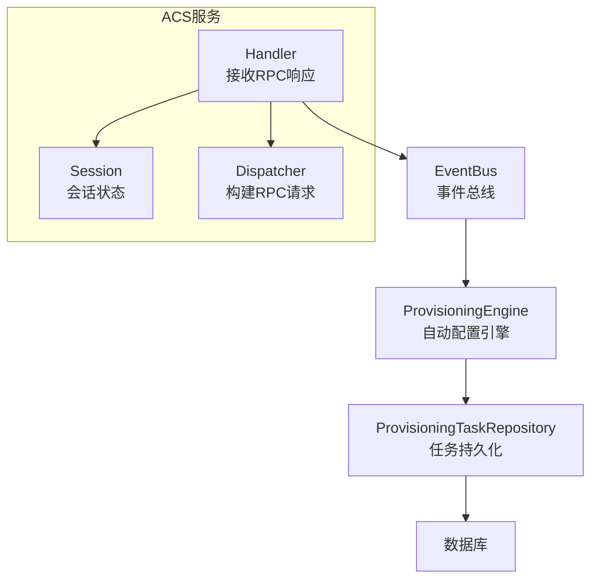
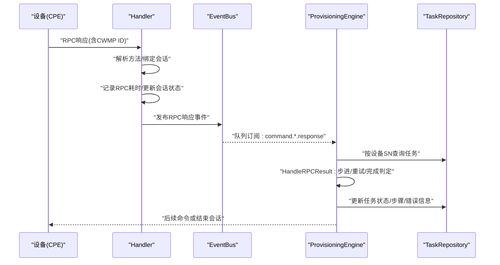
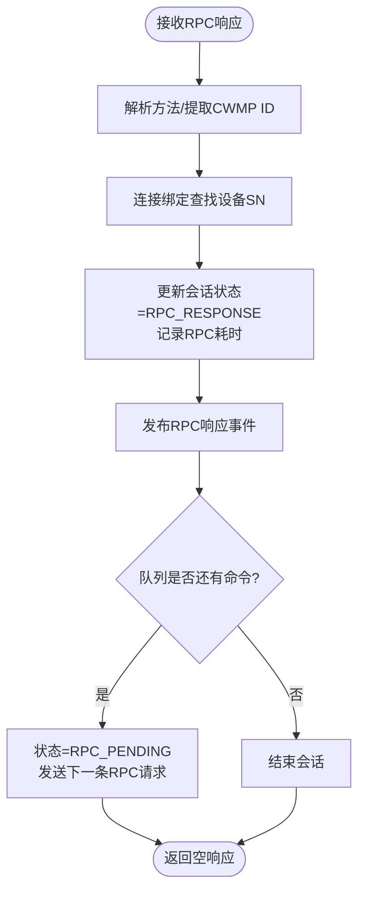
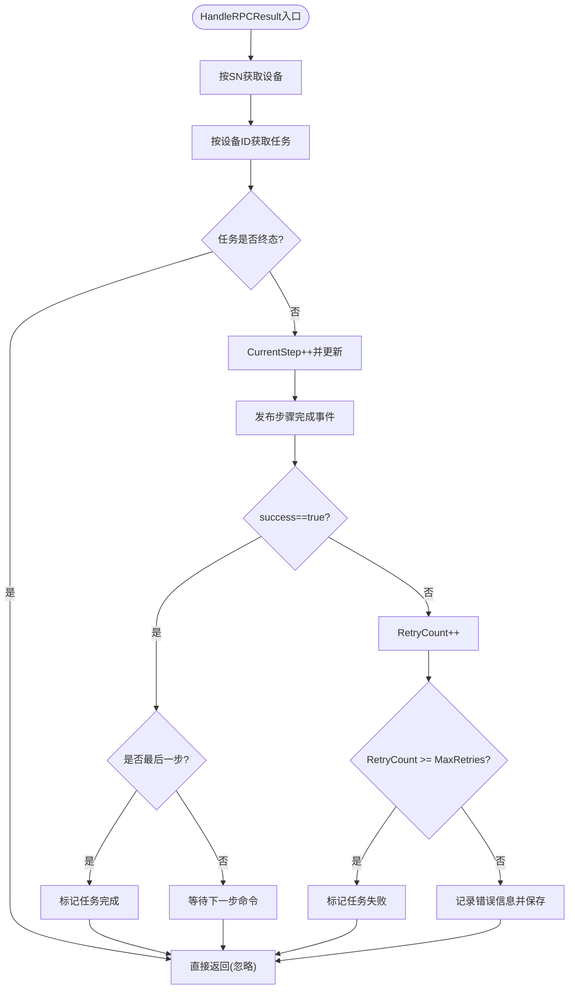
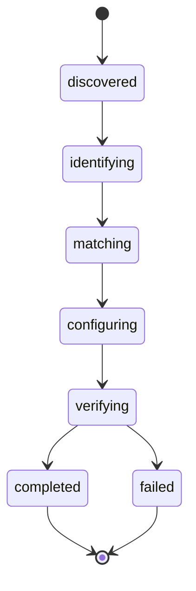
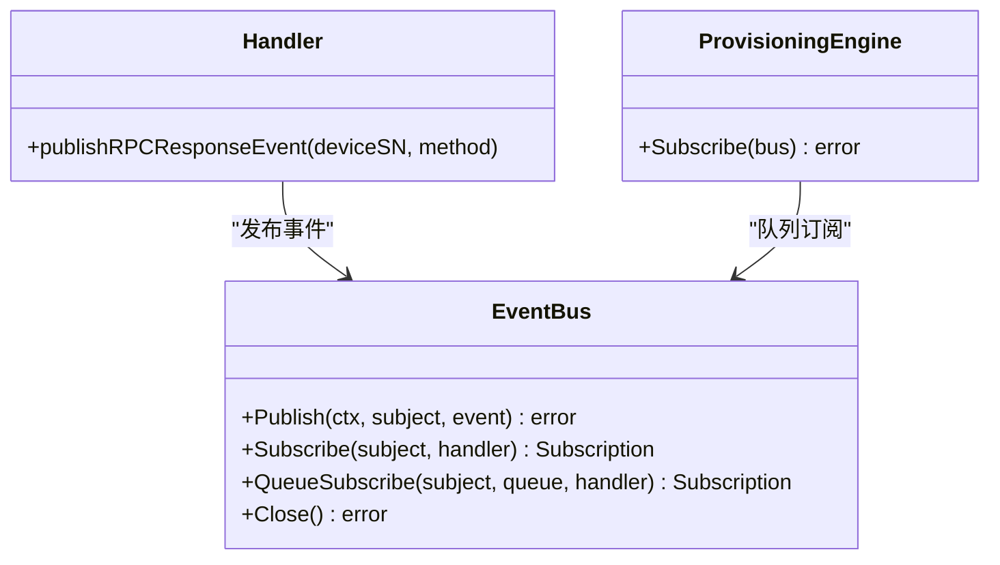
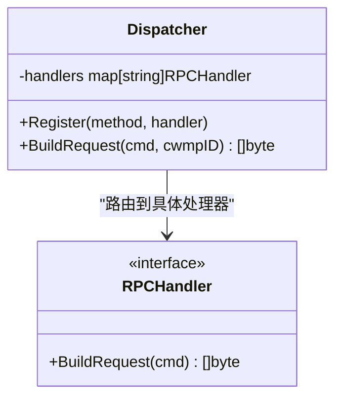
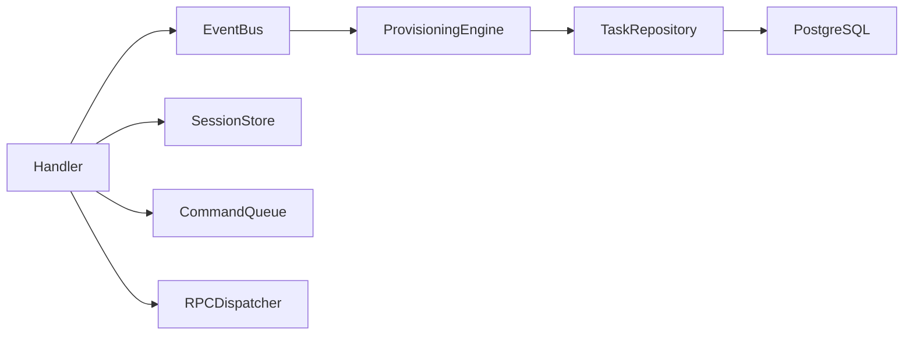

# RPC结果处理

<cite>
**本文档引用的文件**
- [engine.go](file://omcgo/internal/provision/engine.go)
- [engine_test.go](file://omcgo/internal/provision/engine_test.go)
- [state_machine.go](file://omcgo/internal/provision/state_machine.go)
- [model.go](file://omcgo/internal/provision/model.go)
- [pg_repository.go](file://omcgo/internal/provision/pg_repository.go)
- [handler.go](file://omcgo/internal/acs/handler.go)
- [session.go](file://omcgo/internal/acs/session.go)
- [dispatcher.go](file://omcgo/internal/acs/rpc/dispatcher.go)
- [bus.go](file://omcgo/internal/core/event/bus.go)
- [codes.go](file://omcgo/internal/core/errors/codes.go)
- [errors.go](file://omcgo/global/errors.go)
- [acs-service-flow.md](file://omcgo/docs/design/acs-service-flow.md)
- [session-design.md](file://omcgo/docs/design/session-design.md)
</cite>

## 目录
1. [简介](#简介)
2. [项目结构](#项目结构)
3. [核心组件](#核心组件)
4. [架构总览](#架构总览)
5. [详细组件分析](#详细组件分析)
6. [依赖分析](#依赖分析)
7. [性能考虑](#性能考虑)
8. [故障排除指南](#故障排除指南)
9. [结论](#结论)

## 简介
本文件聚焦于RPC结果处理机制，系统性阐述从TR069设备侧RPC响应到达，到自动配置引擎如何解析响应并驱动任务状态流转的完整链路。内容涵盖：
- 成功/失败响应的分类处理与重试策略
- 错误信息的解析、记录与错误码映射
- 步骤进度更新逻辑、状态机状态转换
- 异常情况下的恢复策略与超时处理
- RPC结果与任务状态的关联机制
- 重试策略配置与实际处理示例

## 项目结构
围绕RPC结果处理的关键模块分布如下：
- ACS服务层：接收设备RPC响应，解析方法，发布事件
- 事件总线：跨模块解耦，提供队列订阅能力
- 自动配置引擎：消费RPC响应事件，推进任务状态与步骤
- 任务持久化：维护任务状态、步骤、重试次数等
- 会话状态机：跟踪TR069会话生命周期与RPC阶段

**图表来源**
- [handler.go:304-366](file://omcgo/internal/acs/handler.go#L304-L366)
- [bus.go:5-20](file://omcgo/internal/core/event/bus.go#L5-L20)
- [engine.go:65-75](file://omcgo/internal/provision/engine.go#L65-L75)
- [pg_repository.go:80-96](file://omcgo/internal/provision/pg_repository.go#L80-L96)
- [session.go:21-31](file://omcgo/internal/acs/session.go#L21-L31)
- [dispatcher.go:16-54](file://omcgo/internal/acs/rpc/dispatcher.go#L16-L54)

**章节来源**
- [handler.go:304-366](file://omcgo/internal/acs/handler.go#L304-L366)
- [bus.go:5-20](file://omcgo/internal/core/event/bus.go#L5-L20)
- [engine.go:65-75](file://omcgo/internal/provision/engine.go#L65-L75)
- [pg_repository.go:80-96](file://omcgo/internal/provision/pg_repository.go#L80-L96)
- [session.go:21-31](file://omcgo/internal/acs/session.go#L21-L31)
- [dispatcher.go:16-54](file://omcgo/internal/acs/rpc/dispatcher.go#L16-L54)

## 核心组件
- Handler：负责识别RPC响应方法、绑定设备会话、记录会话时长、发布RPC响应事件
- EventBus：提供事件发布/订阅与队列分组订阅能力
- ProvisioningEngine：订阅RPC响应事件，调用HandleRPCResult推进任务状态
- ProvisioningTaskRepository：读写任务状态、步骤、重试次数、错误信息
- Session：跟踪TR069会话状态（含RPC阶段），确保状态转换合法
- Dispatcher：根据命令方法选择对应处理器，生成SOAP请求体

**章节来源**
- [handler.go:304-366](file://omcgo/internal/acs/handler.go#L304-L366)
- [bus.go:5-20](file://omcgo/internal/core/event/bus.go#L5-L20)
- [engine.go:165-215](file://omcgo/internal/provision/engine.go#L165-L215)
- [pg_repository.go:80-96](file://omcgo/internal/provision/pg_repository.go#L80-L96)
- [session.go:21-59](file://omcgo/internal/acs/session.go#L21-L59)
- [dispatcher.go:16-54](file://omcgo/internal/acs/rpc/dispatcher.go#L16-L54)

## 架构总览
RPC响应处理的端到端流程如下：

**图表来源**
- [handler.go:304-366](file://omcgo/internal/acs/handler.go#L304-L366)
- [bus.go:14-16](file://omcgo/internal/core/event/bus.go#L14-L16)
- [engine.go:165-215](file://omcgo/internal/provision/engine.go#L165-L215)
- [pg_repository.go:80-96](file://omcgo/internal/provision/pg_repository.go#L80-L96)

## 详细组件分析

### 组件A：Handler（RPC响应处理与事件发布）
- 关键职责
  - 识别RPC响应方法，提取CWMP ID
  - 通过连接级绑定获取设备序列号
  - 记录RPC耗时（自上次状态变更起）
  - 更新会话状态至RPC_RESPONSE
  - 发布对应命令响应事件（队列主题）
  - 若队列仍有待执行命令，切换会话状态至RPC_PENDING并发送下一条RPC请求；否则结束会话
- 事件映射
  - 不同RPC方法映射到不同的事件主题，供引擎订阅

**图表来源**
- [handler.go:304-366](file://omcgo/internal/acs/handler.go#L304-L366)
- [acs-service-flow.md:146-164](file://omcgo/docs/design/acs-service-flow.md#L146-L164)

**章节来源**
- [handler.go:304-366](file://omcgo/internal/acs/handler.go#L304-L366)
- [acs-service-flow.md:146-164](file://omcgo/docs/design/acs-service-flow.md#L146-L164)

### 组件B：ProvisioningEngine（RPC结果处理与状态推进）
- 关键职责
  - 订阅RPC响应事件（队列分组）
  - 依据设备SN定位当前任务
  - 执行HandleRPCResult推进步骤/重试/完成
  - 发布步骤完成、失败、完成等事件
- HandleRPCResult处理逻辑
  - 步进：CurrentStep++，持久化更新
  - 成功：发布“步骤完成”事件，若已到最后一步则标记任务完成
  - 失败：RetryCount++，超过MaxRetries则标记任务失败；否则记录错误信息并等待重试
  - 终止态：若任务已是终态（已完成/失败）则忽略

**图表来源**
- [engine.go:165-215](file://omcgo/internal/provision/engine.go#L165-L215)

**章节来源**
- [engine.go:65-75](file://omcgo/internal/provision/engine.go#L65-L75)
- [engine.go:165-215](file://omcgo/internal/provision/engine.go#L165-L215)
- [engine_test.go:311-385](file://omcgo/internal/provision/engine_test.go#L311-L385)
- [engine_test.go:432-466](file://omcgo/internal/provision/engine_test.go#L432-L466)

### 组件C：状态机与任务模型
- 任务状态机
  - 定义合法状态转移路径，Fail/Complete为终态
  - 提供校验函数，防止非法状态跃迁
- 会话状态机
  - TR069会话生命周期：INFORM_RECEIVED → PROCESSING → RPC_PENDING → RPC_RESPONSE → 循环或结束
- 任务模型
  - 包含CurrentStep/TotalSteps/RetryCount/MaxRetries/ErrorMessage等字段
  - 默认最大重试次数在任务创建时设定

**图表来源**
- [state_machine.go:5-36](file://omcgo/internal/provision/state_machine.go#L5-L36)
- [model.go:13-21](file://omcgo/internal/provision/model.go#L13-L21)

**章节来源**
- [state_machine.go:5-36](file://omcgo/internal/provision/state_machine.go#L5-L36)
- [session.go:33-59](file://omcgo/internal/acs/session.go#L33-L59)
- [model.go:23-38](file://omcgo/internal/provision/model.go#L23-L38)

### 组件D：事件总线与RPC响应事件
- EventBus接口支持普通订阅与队列分组订阅
- Handler根据RPC方法映射到具体事件主题，并发布
- 引擎以队列分组方式订阅，实现多实例负载均衡

**图表来源**
- [bus.go:5-20](file://omcgo/internal/core/event/bus.go#L5-L20)
- [handler.go:524-566](file://omcgo/internal/acs/handler.go#L524-L566)
- [engine.go:65-75](file://omcgo/internal/provision/engine.go#L65-L75)

**章节来源**
- [bus.go:5-20](file://omcgo/internal/core/event/bus.go#L5-L20)
- [handler.go:524-566](file://omcgo/internal/acs/handler.go#L524-L566)
- [engine.go:65-75](file://omcgo/internal/provision/engine.go#L65-L75)

### 组件E：RPC请求构建与超时处理
- Dispatcher按命令方法选择对应处理器，渲染SOAP模板
- 超时处理：任务步骤包含超时字段，可在构建步骤时设置；引擎推进时未直接体现超时重试逻辑，建议结合步骤超时与命令队列策略共同使用

**图表来源**
- [dispatcher.go:16-54](file://omcgo/internal/acs/rpc/dispatcher.go#L16-L54)

**章节来源**
- [dispatcher.go:16-54](file://omcgo/internal/acs/rpc/dispatcher.go#L16-L54)
- [model.go:40-47](file://omcgo/internal/provision/model.go#L40-L47)

## 依赖分析
- Handler依赖SessionStore/CommandQueue/EventBus/RPCDispatcher，负责会话状态推进与事件发布
- ProvisioningEngine依赖DeviceService/EventBus/TaskRepository，负责任务状态推进与持久化
- 事件流经EventBus，采用队列分组订阅，避免重复处理
- 任务持久化通过PostgreSQL仓库实现，支持状态、步骤、重试次数与错误信息的原子更新

**图表来源**
- [handler.go:34-48](file://omcgo/internal/acs/handler.go#L34-L48)
- [engine.go:19-29](file://omcgo/internal/provision/engine.go#L19-L29)
- [pg_repository.go:80-96](file://omcgo/internal/provision/pg_repository.go#L80-L96)

**章节来源**
- [handler.go:34-48](file://omcgo/internal/acs/handler.go#L34-L48)
- [engine.go:19-29](file://omcgo/internal/provision/engine.go#L19-L29)
- [pg_repository.go:80-96](file://omcgo/internal/provision/pg_repository.go#L80-L96)

## 性能考虑
- 会话时延观测：Handler在收到RPC响应后计算自上次状态更新以来的时间，用于RPC耗时观测
- 速率限制与准入控制：Handler内置速率限制器与准入控制器，避免过载
- 事件总线：队列分组订阅可扩展多个消费者实例，提升吞吐
- 数据库写入：任务更新采用批量字段更新，减少不必要的写放大

**章节来源**
- [handler.go:327-329](file://omcgo/internal/acs/handler.go#L327-L329)
- [handler.go:177-191](file://omcgo/internal/acs/handler.go#L177-L191)
- [bus.go:14-16](file://omcgo/internal/core/event/bus.go#L14-L16)

## 故障排除指南
- 常见问题与定位
  - RPC响应未被处理：检查Handler是否正确解析方法、是否完成会话状态更新、是否发布事件
  - 引擎未推进任务：确认EventBus订阅是否生效、队列分组是否一致、任务是否处于终态
  - 重试过多导致失败：核对任务的MaxRetries与RetryCount，查看错误信息字段
  - 会话异常终止：检查会话状态机转换是否符合预期，是否存在超时或异常中断
- 错误码映射
  - 自动配置领域错误码范围：6000-6999，包含任务不存在、无模板、重试失败等
  - 全局错误码定义位于global包，便于统一映射与对外展示
- 恢复策略
  - 对于失败任务，可通过API创建新的任务进行重试
  - 对于离线设备，结合离线重试策略（前端界面中存在相关配置项）进行周期性重试

**章节来源**
- [codes.go:50-55](file://omcgo/internal/core/errors/codes.go#L50-L55)
- [errors.go:48-53](file://omcgo/global/errors.go#L48-L53)
- [handler.go:368-383](file://omcgo/internal/acs/handler.go#L368-L383)
- [engine.go:225-245](file://omcgo/internal/provision/engine.go#L225-L245)
- [engine.go:108-127](file://omcgo/internal/provision/engine.go#L108-L127)

## 结论
RPC结果处理机制通过Handler解析响应、发布事件，由ProvisioningEngine消费事件并推进任务状态，形成清晰的解耦与可扩展架构。关键点在于：
- 明确的成功/失败分支与重试阈值
- 严谨的状态机与终态保护
- 可观测的会话时延与事件追踪
- 可配置的重试上限与错误信息记录
- 与任务模型字段的强关联（步骤、重试、错误）

该机制为大规模设备自动化配置提供了稳定可靠的基础。