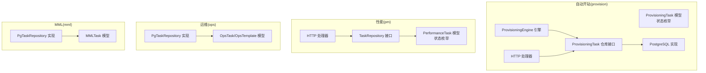
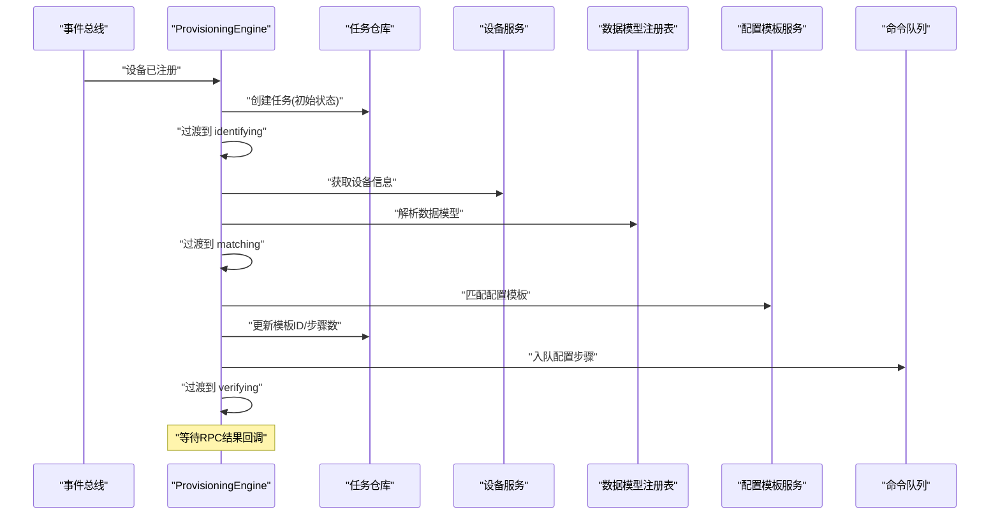
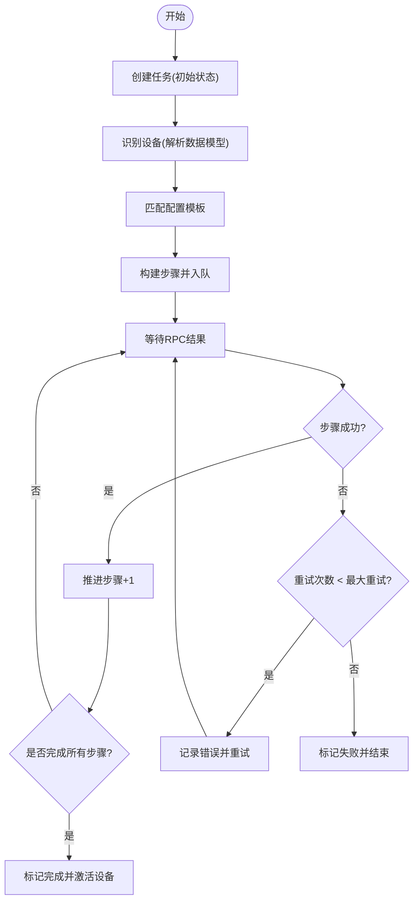
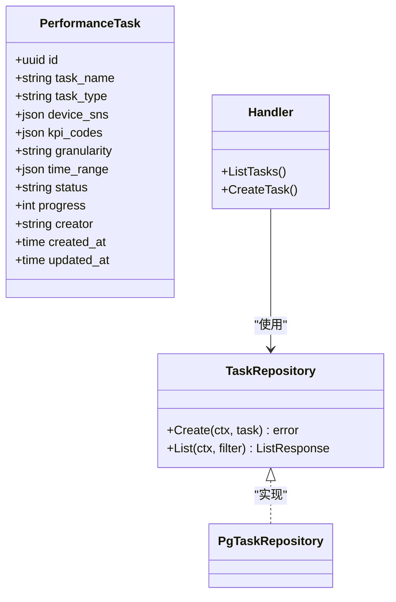
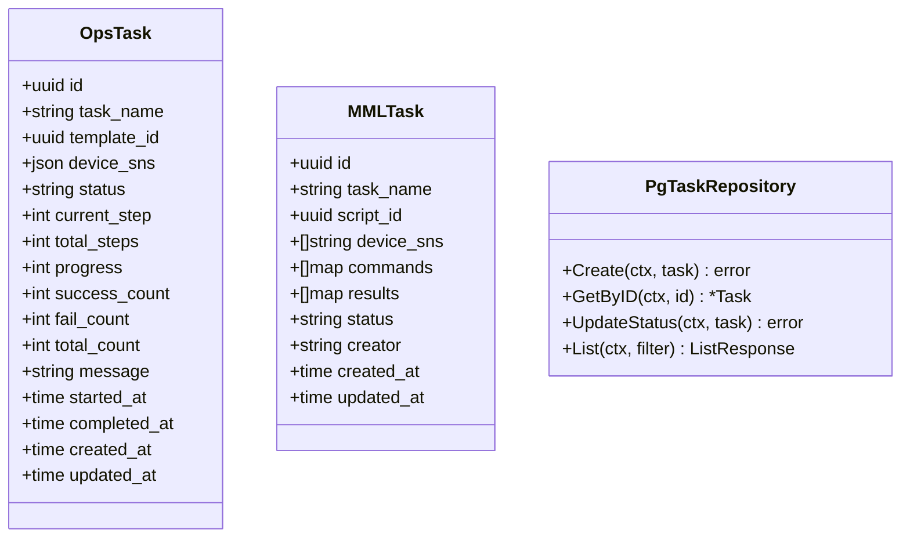
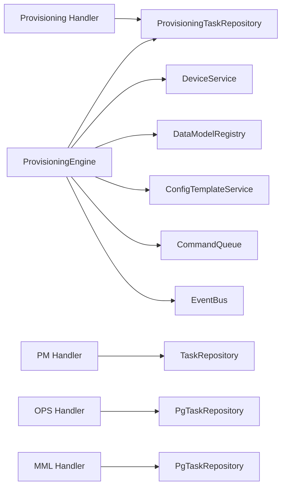

# 任务管理

<cite>
**本文引用的文件**
- [model.go](file://omcgo/internal/provision/model.go)
- [repository.go](file://omcgo/internal/provision/repository.go)
- [pg_repository.go](file://omcgo/internal/provision/pg_repository.go)
- [engine.go](file://omcgo/internal/provision/engine.go)
- [handler.go](file://omcgo/internal/provision/handler.go)
- [000007_create_provisioning_tasks.up.sql](file://omcgo/migrations/000007_create_provisioning_tasks.up.sql)
- [task_model.go](file://omcgo/internal/pm/task_model.go)
- [task_repository.go](file://omcgo/internal/pm/task_repository.go)
- [pg_task_repository.go](file://omcgo/internal/ops/pg_repository.go)
- [model.go](file://omcgo/internal/ops/model.go)
- [pg_repository.go](file://omcgo/internal/mml/pg_repository.go)
- [model.go](file://omcgo/internal/mml/model.go)
- [000026_create_pm_tasks.up.sql](file://omcgo/migrations/000026_create_pm_tasks.up.sql)
- [handler.go](file://omcgo/internal/pm/handler.go)
- [taskWebSocket.ts](file://omcmb/webcode/src/mock/websocket/taskWebSocket.ts)
</cite>

## 目录
1. [简介](#简介)
2. [项目结构](#项目结构)
3. [核心组件](#核心组件)
4. [架构总览](#架构总览)
5. [详细组件分析](#详细组件分析)
6. [依赖分析](#依赖分析)
7. [性能考量](#性能考量)
8. [故障排查指南](#故障排查指南)
9. [结论](#结论)
10. [附录](#附录)

## 简介
本文件面向“任务管理”子系统，围绕开站任务（设备自动配置流程）与运维类任务（如性能采集、模板化批量操作、MML命令执行等）进行系统化技术文档编制。内容涵盖：
- 数据模型设计与字段语义
- 任务状态的持久化与生命周期管理
- 创建、更新、查询、删除（含重试）的实现要点
- 并发安全与原子性保障
- 索引策略、查询优化与大数据量下的性能建议
- API 接口定义与调用示例
- 任务状态流转的完整示例

## 项目结构
任务管理涉及多个领域模块：
- 自动开站任务（provision）：事件驱动的状态机，基于 PostgreSQL 持久化
- 性能任务（pm）：KPI/计数器采集与报告任务，基于 PostgreSQL 持久化
- 运维任务（ops）：模板化批量操作任务，基于 PostgreSQL 持久化
- MML 任务（mml）：命令脚本执行任务，基于 PostgreSQL 持久化

图表来源
- [model.go:10-66](file://omcgo/internal/provision/model.go#L10-L66)
- [repository.go:9-18](file://omcgo/internal/provision/repository.go#L9-L18)
- [pg_repository.go:43-255](file://omcgo/internal/provision/pg_repository.go#L43-L255)
- [engine.go:19-52](file://omcgo/internal/provision/engine.go#L19-L52)
- [handler.go:21-30](file://omcgo/internal/provision/handler.go#L21-L30)
- [task_model.go:11-64](file://omcgo/internal/pm/task_model.go#L11-L64)
- [pg_task_repository.go:299-430](file://omcgo/internal/ops/pg_repository.go#L299-L430)
- [model.go:11-96](file://omcgo/internal/ops/model.go#L11-L96)
- [pg_repository.go:442-486](file://omcgo/internal/mml/pg_repository.go#L442-L486)
- [model.go:10-80](file://omcgo/internal/mml/model.go#L10-L80)

章节来源
- [model.go:10-66](file://omcgo/internal/provision/model.go#L10-L66)
- [pg_repository.go:43-255](file://omcgo/internal/provision/pg_repository.go#L43-L255)
- [engine.go:19-52](file://omcgo/internal/provision/engine.go#L19-L52)
- [handler.go:21-30](file://omcgo/internal/provision/handler.go#L21-L30)
- [task_model.go:11-64](file://omcgo/internal/pm/task_model.go#L11-L64)
- [pg_task_repository.go:299-430](file://omcgo/internal/ops/pg_repository.go#L299-L430)
- [model.go:11-96](file://omcgo/internal/ops/model.go#L11-L96)
- [pg_repository.go:442-486](file://omcgo/internal/mml/pg_repository.go#L442-L486)
- [model.go:10-80](file://omcgo/internal/mml/model.go#L10-L80)

## 核心组件
- 自动开站任务（Provisioning）
  - 模型：ProvisioningTask，状态枚举（discovered/identifying/matching/configuring/verifying/completed/failed），步骤计数与重试控制
  - 引擎：ProvisioningEngine，订阅设备注册事件，按状态机推进并发布事件
  - 仓库：ProvisioningTaskRepository 接口及 PostgreSQL 实现，提供创建、按设备查询、更新、分页列表、按状态计数
  - 处理器：HTTP 路由与控制器，支持列表、详情、创建、重试
- 性能任务（PM）
  - 模型：PerformanceTask，状态枚举（pending/running/completed/failed/cancelled），类型枚举（extraction/report/threshold-check）
  - 仓库：TaskRepository 接口及 PostgreSQL 实现，提供创建、分页列表
  - 处理器：REST API 提供任务创建与列表
- 运维任务（OPS）
  - 模型：OpsTask/OpsTemplate，状态枚举（pending/running/success/failed/cancelled/paused）
  - 仓库：PgTaskRepository，提供创建、按状态过滤、分页列表、状态更新
- MML 任务（MML）
  - 模型：MMLTask，状态枚举（pending/running/completed/failed）
  - 仓库：PgTaskRepository，提供创建、查询、分页列表

章节来源
- [model.go:10-66](file://omcgo/internal/provision/model.go#L10-L66)
- [engine.go:19-52](file://omcgo/internal/provision/engine.go#L19-L52)
- [repository.go:9-18](file://omcgo/internal/provision/repository.go#L9-L18)
- [pg_repository.go:43-255](file://omcgo/internal/provision/pg_repository.go#L43-L255)
- [handler.go:21-128](file://omcgo/internal/provision/handler.go#L21-L128)
- [task_model.go:11-64](file://omcgo/internal/pm/task_model.go#L11-L64)
- [pg_task_repository.go:299-430](file://omcgo/internal/ops/pg_repository.go#L299-L430)
- [model.go:11-96](file://omcgo/internal/ops/model.go#L11-L96)
- [pg_repository.go:442-486](file://omcgo/internal/mml/pg_repository.go#L442-L486)
- [model.go:10-80](file://omcgo/internal/mml/model.go#L10-L80)

## 架构总览
自动开站任务采用事件驱动的状态机模式：设备注册事件触发任务创建与状态推进；RPC 结果回调推进步骤并处理失败重试；状态变更通过事件总线广播。

图表来源
- [engine.go:64-163](file://omcgo/internal/provision/engine.go#L64-L163)

章节来源
- [engine.go:64-163](file://omcgo/internal/provision/engine.go#L64-L163)

## 详细组件分析

### 自动开站任务（Provisioning）
- 数据模型
  - 关键字段：设备ID、模板ID、状态、当前/总步骤、错误消息、重试次数与最大重试、起止时间、创建/更新时间
  - 状态机：discovered → identifying → matching → configuring → verifying → completed 或 failed
- 生命周期管理
  - 事件驱动：设备注册后创建任务并推进至 identifying
  - 匹配模板后更新模板ID与总步骤，入队配置步骤
  - RPC 回调推进步骤，失败则重试或终止
  - 完成后将设备状态置为激活，并发布完成事件
- 并发与原子性
  - 状态推进通过 UpdateStatus 原子更新，避免竞态
  - 步进推进通过 Update 原子更新当前步骤与时间戳
- API
  - GET /api/v1/provisioning/tasks?status=&device_id=
  - GET /api/v1/provisioning/tasks/:id
  - POST /api/v1/provisioning/tasks
  - POST /api/v1/provisioning/tasks/:id/retry

图表来源
- [engine.go:165-215](file://omcgo/internal/provision/engine.go#L165-L215)

章节来源
- [model.go:10-66](file://omcgo/internal/provision/model.go#L10-L66)
- [engine.go:165-215](file://omcgo/internal/provision/engine.go#L165-L215)
- [pg_repository.go:128-196](file://omcgo/internal/provision/pg_repository.go#L128-L196)
- [handler.go:32-128](file://omcgo/internal/provision/handler.go#L32-L128)

### 性能任务（PM）
- 数据模型
  - 关键字段：任务名、类型（extraction/report/threshold-check）、设备序列号集合、KPI 编码、粒度、时间范围、状态、进度、创建者
- 生命周期管理
  - 创建后进入 pending，执行中逐步推进进度，完成后生成文件或返回结果
- API
  - GET /pm/tasks 列表（支持按状态、类型过滤）
  - POST /pm/tasks 创建

图表来源
- [task_model.go:31-64](file://omcgo/internal/pm/task_model.go#L31-L64)
- [task_repository.go:9-14](file://omcgo/internal/pm/task_repository.go#L9-L14)
- [handler.go:263-321](file://omcgo/internal/pm/handler.go#L263-L321)

章节来源
- [task_model.go:11-64](file://omcgo/internal/pm/task_model.go#L11-L64)
- [pg_task_repository.go:384-430](file://omcgo/internal/ops/pg_repository.go#L384-L430)
- [handler.go:263-321](file://omcgo/internal/pm/handler.go#L263-L321)

### 运维任务（OPS）与 MML 任务
- 数据模型
  - OpsTask：任务名、模板ID、设备序列号集合、状态、当前/总步骤、进度、成功/失败/总数、消息、起止时间
  - MMLTask：任务名、脚本ID、设备序列号数组、命令数组、结果数组、状态、创建者
- 生命周期管理
  - 创建后进入 pending/running，逐步推进进度，完成后标记 success/failed
- API
  - 运维任务：POST /ops/tasks、GET /ops/tasks
  - MML 任务：POST /mml/tasks、GET /mml/tasks

图表来源
- [model.go:39-58](file://omcgo/internal/ops/model.go#L39-L58)
- [pg_task_repository.go:299-430](file://omcgo/internal/ops/pg_repository.go#L299-L430)
- [model.go:46-58](file://omcgo/internal/mml/model.go#L46-L58)
- [pg_repository.go:442-486](file://omcgo/internal/mml/pg_repository.go#L442-L486)

章节来源
- [model.go:11-96](file://omcgo/internal/ops/model.go#L11-L96)
- [pg_task_repository.go:299-430](file://omcgo/internal/ops/pg_repository.go#L299-L430)
- [model.go:10-80](file://omcgo/internal/mml/model.go#L10-L80)
- [pg_repository.go:442-486](file://omcgo/internal/mml/pg_repository.go#L442-L486)

## 依赖分析
- 组件耦合
  - ProvisioningEngine 依赖任务仓库、设备服务、数据模型注册表、模板服务、命令队列、事件总线
  - 各模块的 Handler 仅依赖对应仓库接口，保持良好分层
- 外部依赖
  - PostgreSQL：任务表、索引、触发器
  - Gin：HTTP 路由与控制器
  - MinIO：PM 文件下载（非任务核心，但与任务产物相关）

图表来源
- [engine.go:31-52](file://omcgo/internal/provision/engine.go#L31-L52)
- [handler.go:16-19](file://omcgo/internal/provision/handler.go#L16-L19)
- [pg_task_repository.go:299-307](file://omcgo/internal/ops/pg_repository.go#L299-L307)

章节来源
- [engine.go:31-52](file://omcgo/internal/provision/engine.go#L31-L52)
- [handler.go:16-19](file://omcgo/internal/provision/handler.go#L16-L19)
- [pg_task_repository.go:299-307](file://omcgo/internal/ops/pg_repository.go#L299-L307)

## 性能考量
- 索引策略
  - provisioning_tasks：按 device_id、status、(device_id,status)、created_at 排序索引，满足高频查询与排序
  - pm_tasks：按 status、created_at 排序索引，支持按状态筛选与时间倒序
- 查询优化
  - 使用分页参数（limit/offset）与排序字段（默认 created_at desc）
  - 列表接口支持按状态、模板ID等条件过滤，减少扫描范围
- 并发与原子性
  - UpdateStatus 与 Update 均为单行原子更新，避免竞态
  - 通过事件总线异步推进，降低请求链路阻塞
- 大数据量建议
  - 对高频过滤字段（status、device_id、template_id）保持索引
  - 使用游标式分页或基于时间窗口的增量拉取
  - 对 JSONB 字段（如 device_sns、kpi_codes）谨慎使用，必要时拆表或物化派生列

章节来源
- [000007_create_provisioning_tasks.up.sql:21-29](file://omcgo/migrations/000007_create_provisioning_tasks.up.sql#L21-L29)
- [000026_create_pm_tasks.up.sql:15-21](file://omcgo/migrations/000026_create_pm_tasks.up.sql#L15-L21)
- [pg_repository.go:128-196](file://omcgo/internal/provision/pg_repository.go#L128-L196)
- [pg_task_repository.go:384-430](file://omcgo/internal/ops/pg_repository.go#L384-L430)

## 故障排查指南
- 任务未推进
  - 检查 RPC 结果回调是否正确触发（HandleRPCResult）
  - 确认事件总线订阅正常，引擎日志中是否存在“publish event”警告
- 重试无效
  - 确认任务状态为 failed 才允许重试
  - 检查 MaxRetries 配置与 RetryCount 是否递增
- 查询异常
  - 确认过滤参数格式（UUID、时间字符串）
  - 检查索引是否生效，必要时重建索引
- 前端实时更新
  - 参考模拟 WebSocket 更新逻辑，确保前端 store 与事件一致

章节来源
- [engine.go:165-215](file://omcgo/internal/provision/engine.go#L165-L215)
- [handler.go:100-128](file://omcgo/internal/provision/handler.go#L100-L128)
- [taskWebSocket.ts:92-175](file://omcmb/webcode/src/mock/websocket/taskWebSocket.ts#L92-L175)

## 结论
本任务管理子系统以清晰的领域模型与事件驱动的状态机为核心，结合 PostgreSQL 的原子更新与索引策略，在高并发场景下保证了任务状态的一致性与可追踪性。自动开站、性能、运维与 MML 任务分别覆盖不同业务场景，具备良好的扩展性与可维护性。

## 附录

### API 接口清单（任务管理）
- 自动开站任务
  - GET /api/v1/provisioning/tasks?status=&device_id=
  - GET /api/v1/provisioning/tasks/:id
  - POST /api/v1/provisioning/tasks
  - POST /api/v1/provisioning/tasks/:id/retry
- 性能任务
  - GET /pm/tasks
  - POST /pm/tasks
- 运维任务
  - GET /ops/tasks
  - POST /ops/tasks
- MML 任务
  - GET /mml/tasks
  - POST /mml/tasks

章节来源
- [handler.go:21-128](file://omcgo/internal/provision/handler.go#L21-L128)
- [handler.go:35-49](file://omcgo/internal/pm/handler.go#L35-L49)

### 数据模型字段说明（节选）
- 自动开站任务（ProvisioningTask）
  - id、device_id、template_id、status、current_step、total_steps、error_message、retry_count、max_retries、started_at、completed_at、created_at、updated_at
- 性能任务（PerformanceTask）
  - id、task_name、task_type、device_sns、kpi_codes、granularity、time_range、status、progress、creator、created_at、updated_at
- 运维任务（OpsTask）
  - id、task_name、template_id、device_sns、status、current_step、total_steps、progress、success_count、fail_count、total_count、message、started_at、completed_at、created_at、updated_at
- MML 任务（MMLTask）
  - id、task_name、script_id、device_sns、commands、results、status、creator、created_at、updated_at

章节来源
- [model.go:23-38](file://omcgo/internal/provision/model.go#L23-L38)
- [task_model.go:31-45](file://omcgo/internal/pm/task_model.go#L31-L45)
- [model.go:39-58](file://omcgo/internal/ops/model.go#L39-L58)
- [model.go:46-58](file://omcgo/internal/mml/model.go#L46-L58)

### 任务状态流转示例（自动开站）
- 设备注册 → 创建任务（discovered）→ identifying → matching（设置模板ID）→ configuring（入队步骤）→ verifying → completed 或 failed
- 失败时根据重试策略决定继续或终止，并记录错误信息

章节来源
- [engine.go:77-163](file://omcgo/internal/provision/engine.go#L77-L163)
- [engine.go:217-274](file://omcgo/internal/provision/engine.go#L217-L274)