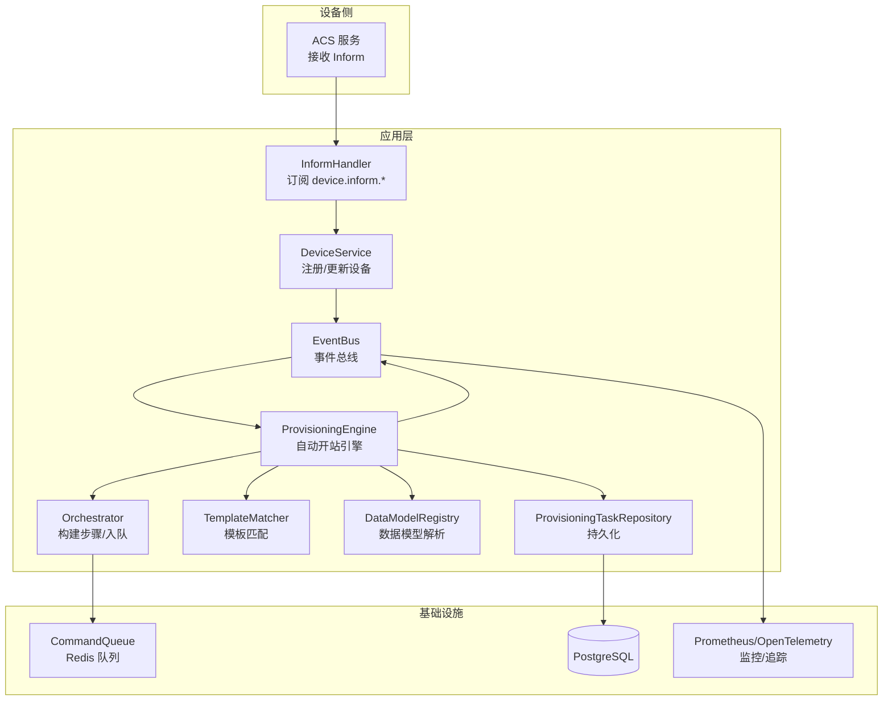
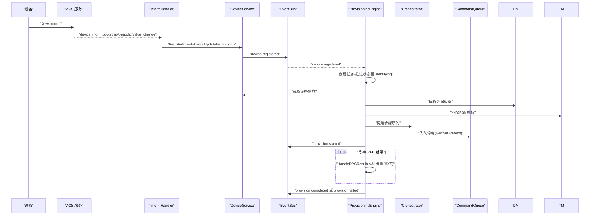
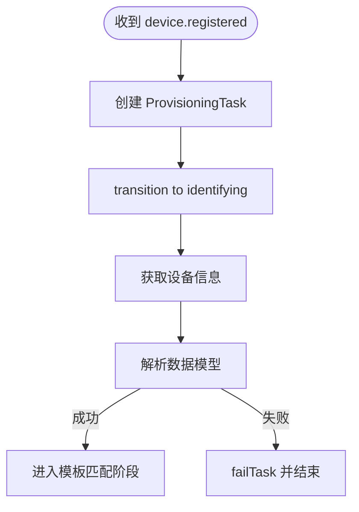
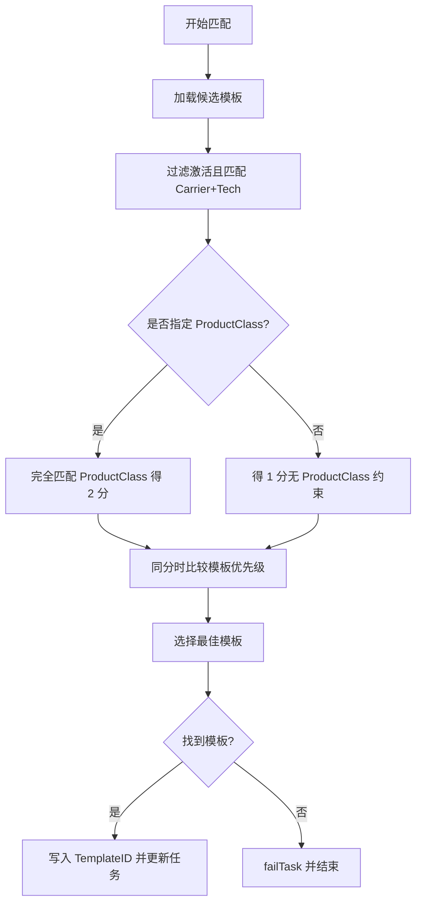
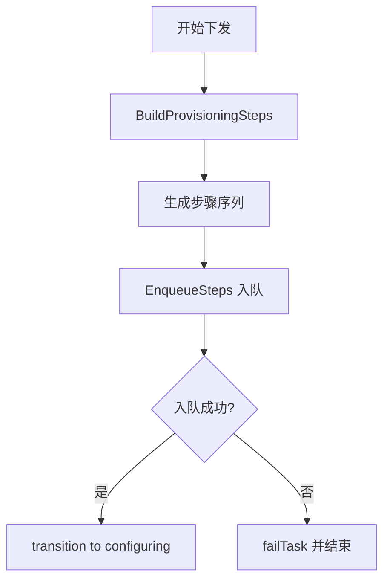
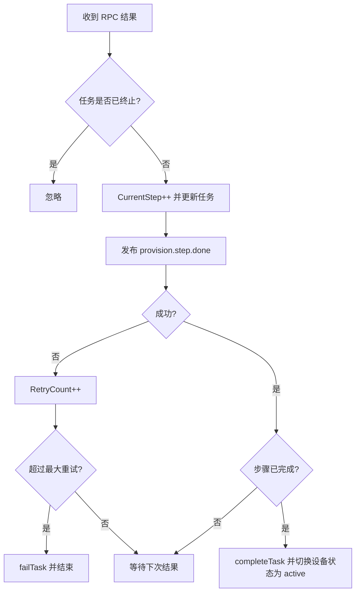
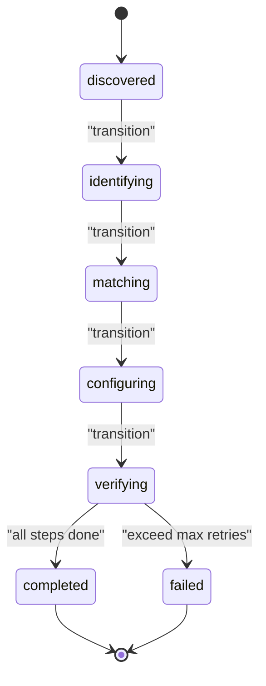
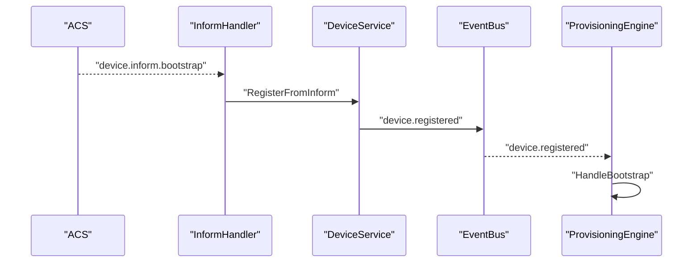
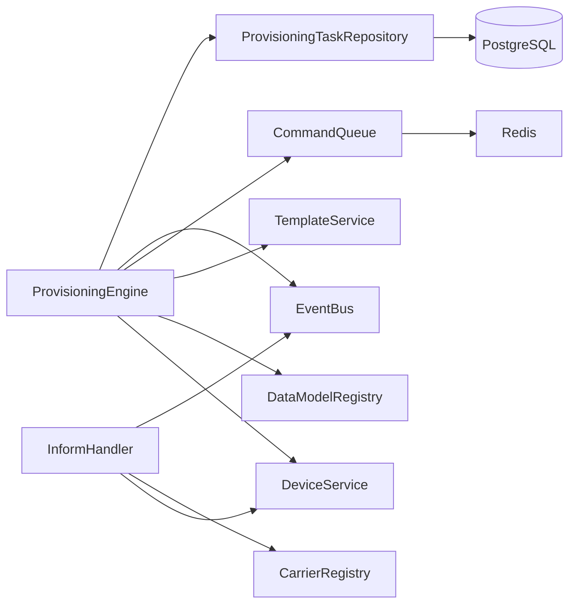

# 开站工作流程

<cite>
**本文引用的文件**
- [engine.go](file://omcgo/internal/provision/engine.go)
- [state_machine.go](file://omcgo/internal/provision/state_machine.go)
- [matcher.go](file://omcgo/internal/provision/matcher.go)
- [orchestrator.go](file://omcgo/internal/provision/orchestrator.go)
- [model.go](file://omcgo/internal/provision/model.go)
- [repository.go](file://omcgo/internal/provision/repository.go)
- [pg_repository.go](file://omcgo/internal/provision/pg_repository.go)
- [handler.go](file://omcgo/internal/provision/handler.go)
- [inform_handler.go](file://omcgo/internal/device/inform_handler.go)
- [service.go](file://omcgo/internal/device/service.go)
- [subjects.go](file://omcgo/internal/core/event/subjects.go)
- [19-observability.md](file://omcgo/docs/detailed-design/19-observability.md)
- [05-device-management.md](file://omcgo/docs/go-zero-design/05-device-management.md)
- [01-device-onboarding.md](file://omcmb/design/06-user-flows/01-device-onboarding.md)
</cite>

## 目录
1. [简介](#简介)
2. [项目结构](#项目结构)
3. [核心组件](#核心组件)
4. [架构总览](#架构总览)
5. [详细组件分析](#详细组件分析)
6. [依赖分析](#依赖分析)
7. [性能考虑](#性能考虑)
8. [故障排查指南](#故障排查指南)
9. [结论](#结论)
10. [附录](#附录)

## 简介
本文件面向自动开站（设备入网与配置下发）工作流程，提供从设备注册到开站完成的完整技术文档。内容覆盖设备识别、模板匹配、配置下发、验证确认四个阶段的状态转换逻辑、关键节点处理机制、错误处理与重试策略，并解释 bootstrap 事件处理、任务状态管理、进度跟踪与监控机制。文档同时给出流程图、状态转换图与代码示例路径，帮助读者正确实现与扩展该流程。

## 项目结构
自动开站流程涉及设备管理、配置模板、数据模型解析、命令队列与事件总线等多个模块。核心流程由设备 Inform 事件驱动，经设备服务注册后触发 Provisioning Engine 的自动开站引擎，按阶段推进并发布事件，最终完成设备状态切换与任务闭环。

图表来源
- [inform_handler.go:46-114](file://omcgo/internal/device/inform_handler.go#L46-L114)
- [service.go:42-130](file://omcgo/internal/device/service.go#L42-L130)
- [engine.go:64-163](file://omcgo/internal/provision/engine.go#L64-L163)
- [orchestrator.go:24-86](file://omcgo/internal/provision/orchestrator.go#L24-L86)
- [matcher.go:8-48](file://omcgo/internal/provision/matcher.go#L8-L48)
- [repository.go:9-18](file://omcgo/internal/provision/repository.go#L9-L18)
- [pg_repository.go:25-153](file://omcgo/internal/provision/pg_repository.go#L25-L153)
- [subjects.go:3-15](file://omcgo/internal/core/event/subjects.go#L3-L15)

章节来源
- [inform_handler.go:46-114](file://omcgo/internal/device/inform_handler.go#L46-L114)
- [service.go:42-130](file://omcgo/internal/device/service.go#L42-L130)
- [engine.go:64-163](file://omcgo/internal/provision/engine.go#L64-L163)
- [orchestrator.go:24-86](file://omcgo/internal/provision/orchestrator.go#L24-L86)
- [matcher.go:8-48](file://omcgo/internal/provision/matcher.go#L8-L48)
- [repository.go:9-18](file://omcgo/internal/provision/repository.go#L9-L18)
- [pg_repository.go:25-153](file://omcgo/internal/provision/pg_repository.go#L25-L153)
- [subjects.go:3-15](file://omcgo/internal/core/event/subjects.go#L3-L15)

## 核心组件
- ProvisioningEngine：自动开站引擎，负责订阅设备注册事件、创建任务、推进状态、构建并下发配置步骤、处理 RPC 结果并完成任务。
- InformHandler：订阅 device.inform.* 事件，将 Inform 消息转换为内部结构，调用 DeviceService 完成设备注册或更新。
- DeviceService：根据 Inform 内容创建/更新设备记录，必要时发布 device.registered 事件以触发后续流程。
- Orchestrator：根据模板生成配置下发步骤序列（读取参数、设置参数、重启），并将命令入队。
- TemplateMatcher：基于运营商、制式、产品类匹配最优配置模板。
- DataModelRegistry：根据设备信息解析数据模型，用于参数映射与校验。
- ProvisioningTaskRepository/PgProvisioningTaskRepository：任务持久化，支持查询、计数、状态更新。
- EventBus：事件总线，用于跨模块解耦通信（如 provision.started/completed/failed/step.done）。
- Handler：提供 REST 接口用于手动触发任务、查询任务与重试失败任务。

章节来源
- [engine.go:19-52](file://omcgo/internal/provision/engine.go#L19-L52)
- [inform_handler.go:23-44](file://omcgo/internal/device/inform_handler.go#L23-L44)
- [service.go:16-40](file://omcgo/internal/device/service.go#L16-L40)
- [orchestrator.go:13-22](file://omcgo/internal/provision/orchestrator.go#L13-L22)
- [matcher.go:8-48](file://omcgo/internal/provision/matcher.go#L8-L48)
- [repository.go:9-18](file://omcgo/internal/provision/repository.go#L9-L18)
- [pg_repository.go:25-33](file://omcgo/internal/provision/pg_repository.go#L25-L33)
- [handler.go:10-19](file://omcgo/internal/provision/handler.go#L10-L19)

## 架构总览
自动开站采用事件驱动与状态机相结合的设计。设备通过 ACS 发送 Inform，InformHandler 将其转换并调用 DeviceService 完成注册/更新；DeviceService 成功入库后发布 device.registered 事件；ProvisioningEngine 订阅该事件，启动开站流程，按阶段推进并在完成后发布 provision.completed 事件。

图表来源
- [inform_handler.go:69-114](file://omcgo/internal/device/inform_handler.go#L69-L114)
- [service.go:121-129](file://omcgo/internal/device/service.go#L121-L129)
- [engine.go:64-163](file://omcgo/internal/provision/engine.go#L64-L163)
- [orchestrator.go:24-86](file://omcgo/internal/provision/orchestrator.go#L24-L86)
- [subjects.go:3-15](file://omcgo/internal/core/event/subjects.go#L3-L15)

章节来源
- [inform_handler.go:69-114](file://omcgo/internal/device/inform_handler.go#L69-L114)
- [service.go:121-129](file://omcgo/internal/device/service.go#L121-L129)
- [engine.go:64-163](file://omcgo/internal/provision/engine.go#L64-L163)
- [orchestrator.go:24-86](file://omcgo/internal/provision/orchestrator.go#L24-L86)
- [subjects.go:3-15](file://omcgo/internal/core/event/subjects.go#L3-L15)

## 详细组件分析

### 设备识别阶段（identifying）
- 输入：设备注册事件（device.registered）携带设备标识（SN、OUI、ProductClass、Carrier、Technology）。
- 处理：
  - ProvisioningEngine 创建任务并推进到 identifying 状态。
  - 获取设备信息并解析数据模型（DataModelRegistry.ResolveForDevice），用于后续参数映射与校验。
- 关键点：
  - 若解析失败，直接 failTask 并结束流程。
  - 该阶段不直接与设备交互，主要为后续模板匹配做准备。

图表来源
- [engine.go:77-115](file://omcgo/internal/provision/engine.go#L77-L115)
- [state_machine.go:17-31](file://omcgo/internal/provision/state_machine.go#L17-L31)

章节来源
- [engine.go:77-115](file://omcgo/internal/provision/engine.go#L77-L115)
- [state_machine.go:17-31](file://omcgo/internal/provision/state_machine.go#L17-L31)

### 模板匹配阶段（matching）
- 输入：设备对象（含 Carrier、Technology、ProductClass）。
- 处理：
  - TemplateMatcher 依据“运营商+制式+产品类”优先级匹配模板；若无产品类约束则退化为“运营商+制式”匹配。
  - 匹配成功后将模板 ID 写入任务并更新持久化。
- 关键点：
  - 若无匹配模板，直接 failTask 并结束流程。
  - 匹配逻辑确保高优先级模板被选中（同分情况下优先级更高）。

图表来源
- [matcher.go:8-48](file://omcgo/internal/provision/matcher.go#L8-L48)
- [engine.go:116-135](file://omcgo/internal/provision/engine.go#L116-L135)

章节来源
- [matcher.go:8-48](file://omcgo/internal/provision/matcher.go#L8-L48)
- [engine.go:116-135](file://omcgo/internal/provision/engine.go#L116-L135)

### 配置下发阶段（configuring）
- 输入：匹配到的配置模板。
- 处理：
  - Orchestrator 根据模板生成步骤序列：读取当前参数、设置模板参数、可选重启。
  - 将步骤入队到设备命令队列（CommandQueue），按顺序执行。
  - ProvisioningEngine 推进状态至 configuring。
- 关键点：
  - 步骤顺序固定，超时时间针对不同方法设定。
  - 入队失败将导致 failTask 并结束流程。

图表来源
- [orchestrator.go:24-86](file://omcgo/internal/provision/orchestrator.go#L24-L86)
- [engine.go:137-162](file://omcgo/internal/provision/engine.go#L137-L162)

章节来源
- [orchestrator.go:24-86](file://omcgo/internal/provision/orchestrator.go#L24-L86)
- [engine.go:137-162](file://omcgo/internal/provision/engine.go#L137-L162)

### 验证确认阶段（verifying）
- 输入：设备执行命令后的 RPC 结果（成功/失败、错误信息）。
- 处理：
  - ProvisioningEngine.HandleRPCResult 更新任务步骤计数与错误信息。
  - 若失败，增加重试计数；超过最大重试次数则 failTask。
  - 若所有步骤完成，completeTask 并将设备状态切换为 active。
- 关键点：
  - 任务处于终端状态（completed/failed）时不再处理结果。
  - 成功完成后发布 provision.completed 事件。

图表来源
- [engine.go:165-215](file://omcgo/internal/provision/engine.go#L165-L215)
- [state_machine.go:33-36](file://omcgo/internal/provision/state_machine.go#L33-L36)

章节来源
- [engine.go:165-215](file://omcgo/internal/provision/engine.go#L165-L215)
- [state_machine.go:33-36](file://omcgo/internal/provision/state_machine.go#L33-L36)

### 任务状态管理与事件发布
- 状态机：discovered → identifying → matching → configuring → verifying → completed/failed。
- 事件：provision.started、provision.step.done、provision.completed、provision.failed。
- REST 接口：支持列出、查询、创建任务以及对失败任务进行重试。

图表来源
- [model.go:10-21](file://omcgo/internal/provision/model.go#L10-L21)
- [state_machine.go:5-15](file://omcgo/internal/provision/state_machine.go#L5-L15)
- [engine.go:217-245](file://omcgo/internal/provision/engine.go#L217-L245)
- [subjects.go:46-52](file://omcgo/internal/core/event/subjects.go#L46-L52)

章节来源
- [model.go:10-21](file://omcgo/internal/provision/model.go#L10-L21)
- [state_machine.go:5-15](file://omcgo/internal/provision/state_machine.go#L5-L15)
- [engine.go:217-245](file://omcgo/internal/provision/engine.go#L217-L245)
- [subjects.go:46-52](file://omcgo/internal/core/event/subjects.go#L46-L52)
- [handler.go:21-127](file://omcgo/internal/provision/handler.go#L21-L127)

### bootstrap 事件处理流程
- InformHandler 订阅 device.inform.bootstrap/periodic/value_change，解析载荷并调用 DeviceService。
- DeviceService 完成设备注册或更新，并在成功后发布 device.registered。
- ProvisioningEngine 订阅 device.registered，启动自动开站流程。

图表来源
- [inform_handler.go:46-114](file://omcgo/internal/device/inform_handler.go#L46-L114)
- [service.go:121-129](file://omcgo/internal/device/service.go#L121-L129)
- [engine.go:64-75](file://omcgo/internal/provision/engine.go#L64-L75)

章节来源
- [inform_handler.go:46-114](file://omcgo/internal/device/inform_handler.go#L46-L114)
- [service.go:121-129](file://omcgo/internal/device/service.go#L121-L129)
- [engine.go:64-75](file://omcgo/internal/provision/engine.go#L64-L75)

### 进度跟踪与监控
- 事件驱动：provision.started、provision.step.done、provision.completed、provision.failed。
- 指标与追踪：Prometheus 指标、OpenTelemetry 追踪、Grafana 面板。
- REST 接口：查询任务列表、详情与重试失败任务。

章节来源
- [subjects.go:46-67](file://omcgo/internal/core/event/subjects.go#L46-L67)
- [19-observability.md:63-164](file://omcgo/docs/detailed-design/19-observability.md#L63-L164)
- [handler.go:32-127](file://omcgo/internal/provision/handler.go#L32-L127)

## 依赖分析
- 模块内聚与耦合：
  - ProvisioningEngine 依赖 DeviceService、DataModelRegistry、TemplateService、CommandQueue、EventBus、Repository。
  - InformHandler 依赖 DeviceService、CarrierRegistry、EventBus。
  - Repository 与数据库交互，提供任务生命周期管理。
- 外部依赖：
  - Redis 作为命令队列存储。
  - PostgreSQL 存储任务与设备参数。
  - NATS/OpenTelemetry/Prometheus 用于事件传输与可观测性。

图表来源
- [engine.go:19-51](file://omcgo/internal/provision/engine.go#L19-L51)
- [inform_handler.go:23-44](file://omcgo/internal/device/inform_handler.go#L23-L44)
- [repository.go:9-18](file://omcgo/internal/provision/repository.go#L9-L18)
- [pg_repository.go:25-33](file://omcgo/internal/provision/pg_repository.go#L25-L33)

章节来源
- [engine.go:19-51](file://omcgo/internal/provision/engine.go#L19-L51)
- [inform_handler.go:23-44](file://omcgo/internal/device/inform_handler.go#L23-L44)
- [repository.go:9-18](file://omcgo/internal/provision/repository.go#L9-L18)
- [pg_repository.go:25-33](file://omcgo/internal/provision/pg_repository.go#L25-L33)

## 性能考虑
- 步骤超时与重试：
  - 不同 RPC 方法设置不同默认超时，避免单步阻塞影响整体。
  - 最大重试次数限制，防止无限循环。
- 事件与队列：
  - 使用队列异步执行命令，降低请求堆积风险。
  - 事件发布失败不影响核心流程（仅记录警告）。
- 监控与采样：
  - Prometheus 指标覆盖关键路径，便于容量规划与问题定位。
  - OpenTelemetry 在生产环境采用尾部采样，平衡成本与可观测性。

## 故障排查指南
- 设备未上线/未触发注册：
  - 检查 InformHandler 是否正确订阅 device.inform.bootstrap/periodic/value_change。
  - 确认 DeviceService.RegisterFromInform 是否成功入库并发布 device.registered。
- 无匹配模板：
  - 检查 TemplateMatcher 的匹配条件（Carrier、Technology、ProductClass）与模板优先级。
- 下发失败/卡住：
  - 查看 provision.step.done 事件与任务 CurrentStep/TotalSteps。
  - 检查 CommandQueue 是否正常消费，必要时重试失败任务。
- 任务状态异常：
  - 使用 REST 接口查询任务详情，必要时对 failed 任务发起重试。
- 监控与日志：
  - 查看 Prometheus 指标与 OpenTelemetry Trace，定位瓶颈与错误根因。

章节来源
- [inform_handler.go:46-114](file://omcgo/internal/device/inform_handler.go#L46-L114)
- [service.go:121-129](file://omcgo/internal/device/service.go#L121-L129)
- [engine.go:165-215](file://omcgo/internal/provision/engine.go#L165-L215)
- [handler.go:100-127](file://omcgo/internal/provision/handler.go#L100-L127)
- [19-observability.md:63-164](file://omcgo/docs/detailed-design/19-observability.md#L63-L164)

## 结论
自动开站流程通过事件驱动与状态机实现高内聚、低耦合的模块协作。从设备注册到配置下发再到验证确认，每一步都有明确的状态推进与事件反馈，配合完善的错误处理与重试策略，能够稳定支撑大规模设备入网场景。结合监控与可观测性体系，可实现端到端的进度跟踪与问题快速定位。

## 附录
- 用户流程参考：设备入网（Device Onboarding）包含从设备出现到开站、交维的整体用户路径，便于理解业务视角下的开站流程。

章节来源
- [01-device-onboarding.md:1-79](file://omcmb/design/06-user-flows/01-device-onboarding.md#L1-L79)
- [05-device-management.md:380-415](file://omcgo/docs/go-zero-design/05-device-management.md#L380-L415)