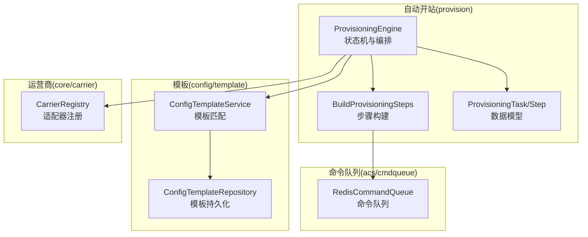
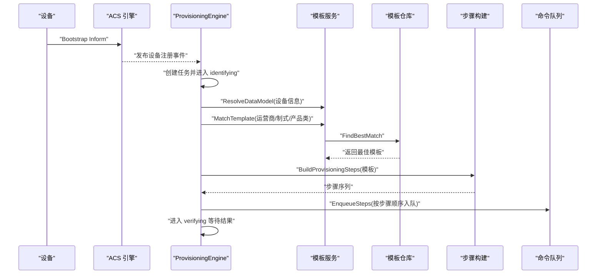
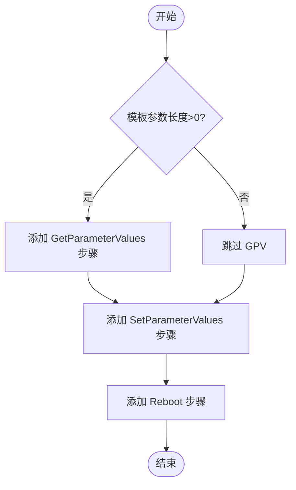
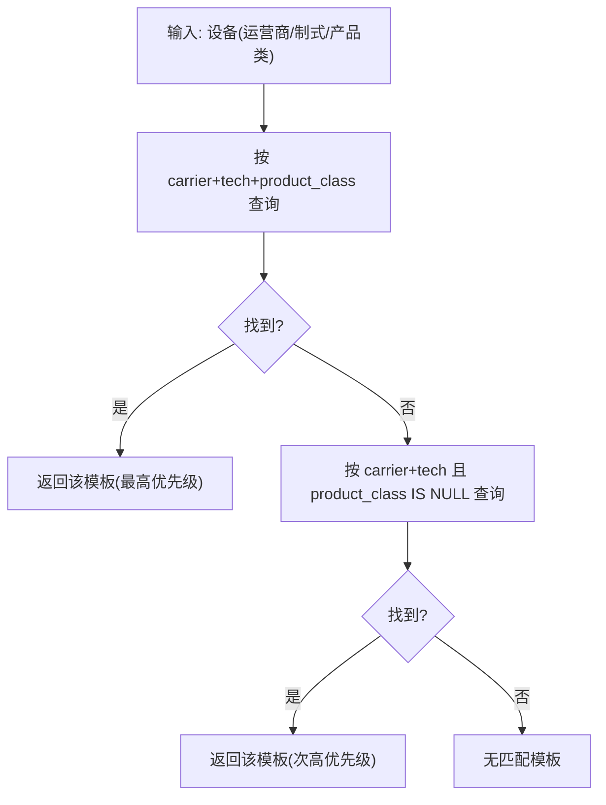
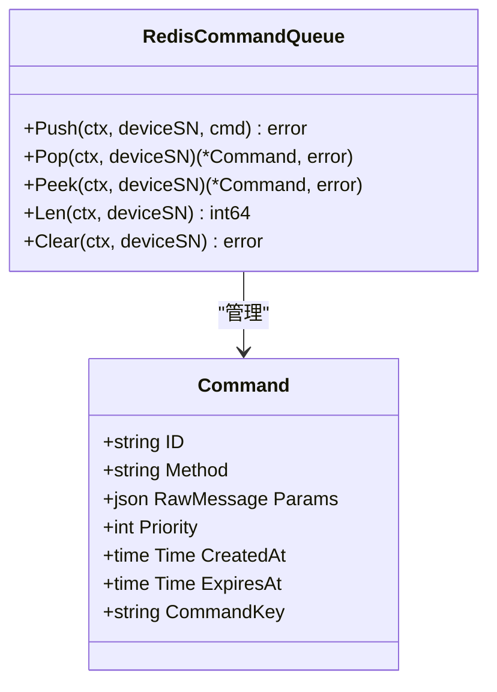
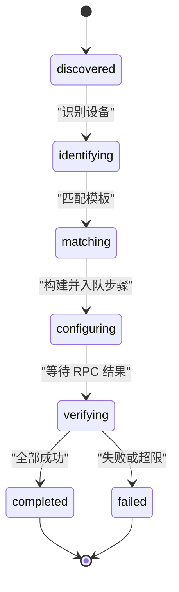
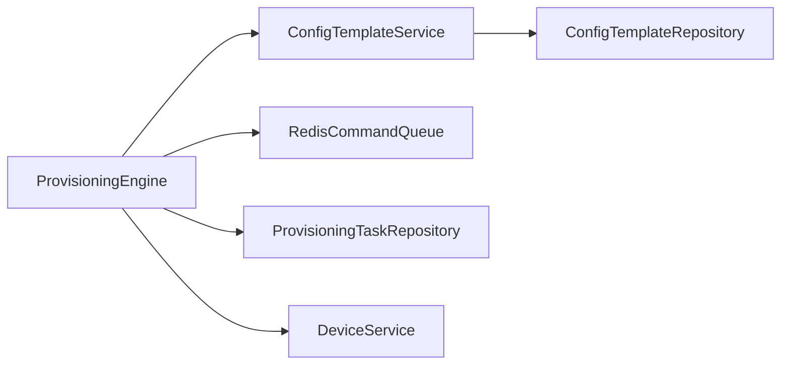

# 开站步骤构建

<cite>
**本文引用的文件**
- [orchestrator.go](file://omcgo/internal/provision/orchestrator.go)
- [engine.go](file://omcgo/internal/provision/engine.go)
- [model.go](file://omcgo/internal/provision/model.go)
- [service.go](file://omcgo/internal/config/template/service.go)
- [repository.go](file://omcgo/internal/config/template/repository.go)
- [pg_repository.go](file://omcgo/internal/config/template/pg_repository.go)
- [matcher.go](file://omcgo/internal/provision/matcher.go)
- [queue.go](file://omcgo/internal/acs/cmdqueue/queue.go)
- [10-provisioning.md](file://omcgo/docs/detailed-design/10-provisioning.md)
- [05-device-management.md](file://omcgo/docs/go-zero-design/05-device-management.md)
- [carrier.go](file://omcgo/internal/core/carrier/carrier.go)
</cite>

## 目录
1. [简介](#简介)
2. [项目结构](#项目结构)
3. [核心组件](#核心组件)
4. [架构总览](#架构总览)
5. [详细组件分析](#详细组件分析)
6. [依赖关系分析](#依赖关系分析)
7. [性能考量](#性能考量)
8. [故障排查指南](#故障排查指南)
9. [结论](#结论)
10. [附录](#附录)

## 简介
本文件围绕“开站步骤构建”机制，系统阐述从配置模板到具体步骤序列的生成与执行全流程。内容涵盖：
- 步骤定义格式与执行顺序
- 步骤间依赖关系与优先级管理
- 命令队列构建与调度策略
- 步骤分组与批量处理优化
- 不同类型配置的步骤差异与动态生成逻辑
- 实际执行流程与示例

## 项目结构
与“开站步骤构建”直接相关的代码主要分布在以下模块：
- provision：自动开站引擎、步骤构建与执行、任务状态管理
- config/template：模板匹配与存储
- acs/cmdqueue：命令队列（Redis ZSet）实现
- core/carrier：运营商抽象与适配

**图表来源**
- [engine.go:19-52](file://omcgo/internal/provision/engine.go#L19-L52)
- [orchestrator.go:24-69](file://omcgo/internal/provision/orchestrator.go#L24-L69)
- [service.go:25-47](file://omcgo/internal/config/template/service.go#L25-L47)
- [repository.go:10-19](file://omcgo/internal/config/template/repository.go#L10-L19)
- [queue.go:39-47](file://omcgo/internal/acs/cmdqueue/queue.go#L39-L47)
- [carrier.go:5-34](file://omcgo/internal/core/carrier/carrier.go#L5-L34)

**章节来源**
- [engine.go:1-286](file://omcgo/internal/provision/engine.go#L1-L286)
- [orchestrator.go:1-101](file://omcgo/internal/provision/orchestrator.go#L1-L101)
- [service.go:1-53](file://omcgo/internal/config/template/service.go#L1-L53)
- [repository.go:1-19](file://omcgo/internal/config/template/repository.go#L1-L19)
- [queue.go:1-135](file://omcgo/internal/acs/cmdqueue/queue.go#L1-L135)
- [10-provisioning.md:1-200](file://omcgo/docs/detailed-design/10-provisioning.md#L1-L200)
- [05-device-management.md:380-549](file://omcgo/docs/go-zero-design/05-device-management.md#L380-L549)

## 核心组件
- ProvisioningEngine：负责自动开站全流程编排，订阅设备注册事件并驱动状态机流转；匹配模板后构建步骤并入队。
- BuildProvisioningSteps：根据模板参数动态生成步骤序列，包含参数读取、参数设置、可选重启等。
- ConfigTemplateService/Repository：提供模板匹配与持久化能力，按优先级选择最佳模板。
- RedisCommandQueue：基于 Redis 的有序集合实现命令队列，支持优先级与过期控制。
- ProvisioningTask/Step：定义任务状态、步骤顺序、超时与是否必需等属性。

**章节来源**
- [engine.go:19-52](file://omcgo/internal/provision/engine.go#L19-L52)
- [orchestrator.go:24-69](file://omcgo/internal/provision/orchestrator.go#L24-L69)
- [service.go:25-47](file://omcgo/internal/config/template/service.go#L25-L47)
- [repository.go:10-19](file://omcgo/internal/config/template/repository.go#L10-L19)
- [queue.go:39-47](file://omcgo/internal/acs/cmdqueue/queue.go#L39-L47)
- [model.go:10-66](file://omcgo/internal/provision/model.go#L10-L66)

## 架构总览
自动开站的整体流程如下：
- 设备上电触发 Inform，ProvisioningEngine 订阅事件并创建任务
- 识别设备（数据模型解析、运营商与制式确定）
- 匹配模板（按 carrier + tech + product_class 优先级）
- 构建步骤序列并入队 Redis
- 等待设备连接执行命令，通过 RPC 结果推进状态机
- 校验成功后完成并激活设备

**图表来源**
- [engine.go:77-163](file://omcgo/internal/provision/engine.go#L77-L163)
- [service.go:25-47](file://omcgo/internal/config/template/service.go#L25-L47)
- [pg_repository.go:250-292](file://omcgo/internal/config/template/pg_repository.go#L250-L292)
- [orchestrator.go:24-69](file://omcgo/internal/provision/orchestrator.go#L24-L69)
- [queue.go:49-72](file://omcgo/internal/acs/cmdqueue/queue.go#L49-L72)

**章节来源**
- [05-device-management.md:380-482](file://omcgo/docs/go-zero-design/05-device-management.md#L380-L482)
- [10-provisioning.md:83-121](file://omcgo/docs/detailed-design/10-provisioning.md#L83-L121)

## 详细组件分析

### 步骤定义与生成逻辑
- 步骤类型与顺序
  - GetParameterValues：当模板参数非空时，先读取当前配置以对比差异
  - SetParameterValues：写入模板中的参数键值
  - Reboot：可选，用于确保参数生效
- 生成规则
  - 若模板参数为空字节串，则跳过 Get/Set 步骤，仅保留 Reboot
  - 若模板参数为 nil，则仅执行 Reboot
  - 步骤顺序严格按 Order 递增，且 Priority 与 Order 同步，便于队列调度

**图表来源**
- [orchestrator.go:26-69](file://omcgo/internal/provision/orchestrator.go#L26-L69)

**章节来源**
- [orchestrator.go:24-69](file://omcgo/internal/provision/orchestrator.go#L24-L69)
- [orchestrator_test.go:21-137](file://omcgo/internal/provision/orchestrator_test.go#L21-L137)

### 模板匹配与优先级
- 匹配优先级（从高到低）
  1) carrier + tech + product_class（精确匹配）
  2) carrier + tech（运营商默认模板）
  3) tech（制式默认模板）
- 仓库实现
  - 先按精确条件查找，未命中再回退到 carrier + tech 且 product_class 为空的记录
  - 同一候选集内按 priority 降序取第一条

**图表来源**
- [pg_repository.go:250-292](file://omcgo/internal/config/template/pg_repository.go#L250-L292)
- [matcher.go:8-48](file://omcgo/internal/provision/matcher.go#L8-L48)

**章节来源**
- [service.go:25-47](file://omcgo/internal/config/template/service.go#L25-L47)
- [pg_repository.go:250-292](file://omcgo/internal/config/template/pg_repository.go#L250-L292)
- [matcher.go:8-48](file://omcgo/internal/provision/matcher.go#L8-L48)
- [05-device-management.md:484-492](file://omcgo/docs/go-zero-design/05-device-management.md#L484-L492)

### 命令队列构建与调度
- 队列结构
  - 使用 Redis Sorted Set 存储命令，键命名空间为固定前缀 + 设备序列号
  - Score 组合规则：Priority*1e12 + 时间戳秒，保证同优先级内的 FIFO
- 入队与出队
  - 入队：为每个步骤构造 Command，设置 Method、Params、Priority、CommandKey，并写入队列
  - 出队：循环弹出最前命令，跳过过期项，若被并发弹走则继续尝试
- 优先级与顺序
  - Priority 与步骤 Order 一致，越小优先级越高
  - CommandKey 由方法名与顺序拼接，便于追踪与去重

**图表来源**
- [queue.go:13-31](file://omcgo/internal/acs/cmdqueue/queue.go#L13-L31)
- [queue.go:49-110](file://omcgo/internal/acs/cmdqueue/queue.go#L49-L110)

**章节来源**
- [queue.go:39-135](file://omcgo/internal/acs/cmdqueue/queue.go#L39-L135)
- [orchestrator.go:71-86](file://omcgo/internal/provision/orchestrator.go#L71-L86)

### 步骤执行与状态机推进
- 状态机
  - discovered → identifying → matching → configuring → verifying → completed/failed
- 执行推进
  - 收到 RPC 结果后，任务 CurrentStep 自增；若失败则重试，超过最大重试次数则失败
  - 当 CurrentStep 达到 TotalSteps 时完成并激活设备
- 事件发布
  - 每一步完成后发布事件，便于前端与监控感知

**图表来源**
- [model.go:10-22](file://omcgo/internal/provision/model.go#L10-L22)
- [engine.go:165-215](file://omcgo/internal/provision/engine.go#L165-L215)
- [engine.go:217-274](file://omcgo/internal/provision/engine.go#L217-L274)

**章节来源**
- [engine.go:77-163](file://omcgo/internal/provision/engine.go#L77-L163)
- [engine.go:165-215](file://omcgo/internal/provision/engine.go#L165-L215)
- [engine.go:217-274](file://omcgo/internal/provision/engine.go#L217-L274)

### 不同类型配置的步骤差异与动态生成
- 普通配置下发（provisioning）
  - 依据模板参数动态决定是否插入 GPV/SPV 步骤
- 批量配置（batch_config）
  - 通常需要更严格的参数校验与分批下发策略（具体实现以模板定义为准）
- 固件升级（firmware_upgrade）
  - 可能包含 Download 步骤，但当前步骤构建逻辑聚焦于配置下发，升级流程另行编排

**章节来源**
- [model.go:11-18](file://omcgo/internal/config/template/model.go#L11-L18)
- [orchestrator.go:24-69](file://omcgo/internal/provision/orchestrator.go#L24-L69)

### 运营商适配与步骤差异
- Carrier 接口提供统一抽象，不同运营商可通过适配器覆盖参数映射、KPI 定义与开站流程差异
- ProvisioningEngine 通过 CarrierRegistry 获取适配器，避免硬编码分支

**章节来源**
- [carrier.go:5-34](file://omcgo/internal/core/carrier/carrier.go#L5-L34)
- [05-device-management.md:494-549](file://omcgo/docs/go-zero-design/05-device-management.md#L494-L549)

## 依赖关系分析
- 组件耦合
  - ProvisioningEngine 依赖模板服务与仓库、设备服务、命令队列与事件总线
  - BuildProvisioningSteps 仅依赖模板参数，保持纯函数特性，便于测试
- 外部依赖
  - Redis 作为命令队列存储
  - PostgreSQL 存储任务与模板
- 循环依赖
  - 未见直接循环依赖；模板匹配与步骤构建解耦良好

**图表来源**
- [engine.go:19-52](file://omcgo/internal/provision/engine.go#L19-L52)
- [service.go:11-23](file://omcgo/internal/config/template/service.go#L11-L23)
- [repository.go:10-19](file://omcgo/internal/config/template/repository.go#L10-L19)
- [queue.go:39-47](file://omcgo/internal/acs/cmdqueue/queue.go#L39-L47)

**章节来源**
- [engine.go:19-52](file://omcgo/internal/provision/engine.go#L19-L52)
- [service.go:11-23](file://omcgo/internal/config/template/service.go#L11-L23)
- [repository.go:10-19](file://omcgo/internal/config/template/repository.go#L10-L19)
- [queue.go:39-47](file://omcgo/internal/acs/cmdqueue/queue.go#L39-L47)

## 性能考量
- 队列排序复杂度
  - 入队使用 ZAdd，时间复杂度近似 O(log N)，其中 N 为队列长度
  - 出队循环弹出并跳过过期项，单次出队平均 O(1)，最坏 O(K)（K 为并发弹出竞争次数）
- 步骤构建
  - 参数解析与步骤拼接为 O(M)（M 为参数数量），常数很小
- 并发与重试
  - 通过 MaxRetries 控制失败重试次数，避免雪崩
  - 队列优先级确保关键步骤优先执行

[本节为通用性能讨论，不直接分析具体文件]

## 故障排查指南
- 入队失败
  - 现象：EnqueueSteps 返回错误，包含步骤序号与方法
  - 排查：检查 Redis 连接、队列键前缀、命令序列化
- 无匹配模板
  - 现象：匹配返回空，任务失败
  - 排查：确认设备信息（运营商/制式/产品类）、模板是否存在且 Active
- 步骤失败与重试
  - 现象：HandleRPCResult 中失败计数增加，超过阈值后任务失败
  - 排查：查看错误消息、逐步缩小到具体步骤与参数
- 队列积压
  - 现象：Peek/Pop 返回空或频繁过期
  - 排查：确认消费者是否正常拉取、过期时间设置、Score 计算

**章节来源**
- [orchestrator.go:71-86](file://omcgo/internal/provision/orchestrator.go#L71-L86)
- [engine.go:165-215](file://omcgo/internal/provision/engine.go#L165-L215)
- [queue.go:74-110](file://omcgo/internal/acs/cmdqueue/queue.go#L74-L110)

## 结论
开站步骤构建机制以“模板 + 步骤 + 队列”的清晰分层实现：
- 模板匹配确保面向运营商与设备类型的差异化
- 步骤构建遵循最小必要原则，按参数存在性动态生成
- 命令队列以优先级与顺序保障执行可控与可观测
- 状态机与事件驱动使整体流程可追踪、可恢复

## 附录

### 配置示例与字段说明
- 模板字段
  - carrier/technology/product_class/template_type/priority/version/active/parameters
- 任务字段
  - status/current_step/total_steps/error_message/retry_count/started_at/completed_at
- 步骤字段
  - order/method/params/timeout/required

**章节来源**
- [model.go:20-35](file://omcgo/internal/config/template/model.go#L20-L35)
- [model.go:23-47](file://omcgo/internal/provision/model.go#L23-L47)

### API 与数据库
- REST API
  - 任务列表/创建/状态查询
  - 模板列表/创建
- 数据库
  - provisioning_tasks 表与 config_templates 表

**章节来源**
- [10-provisioning.md:166-176](file://omcgo/docs/detailed-design/10-provisioning.md#L166-L176)
- [10-provisioning.md:148-164](file://omcgo/docs/detailed-design/10-provisioning.md#L148-L164)