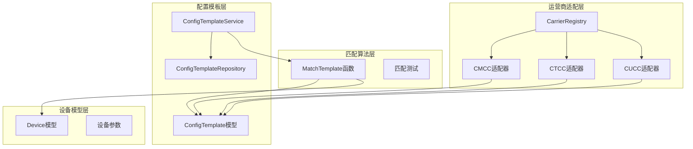
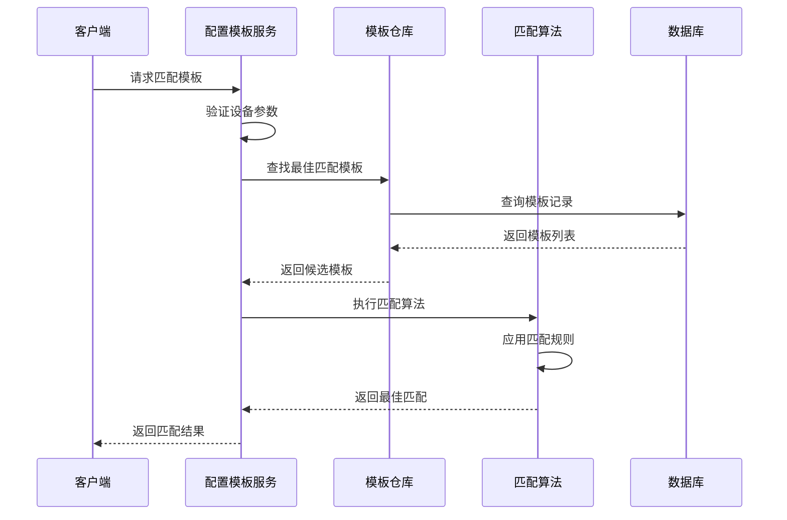
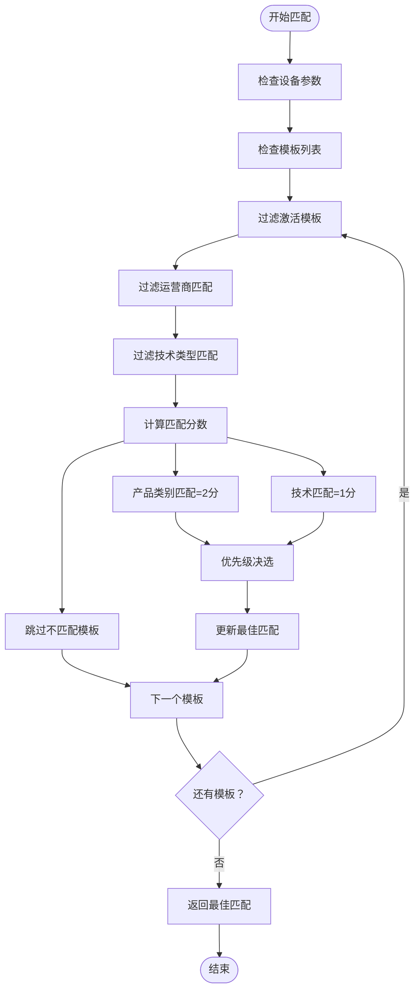
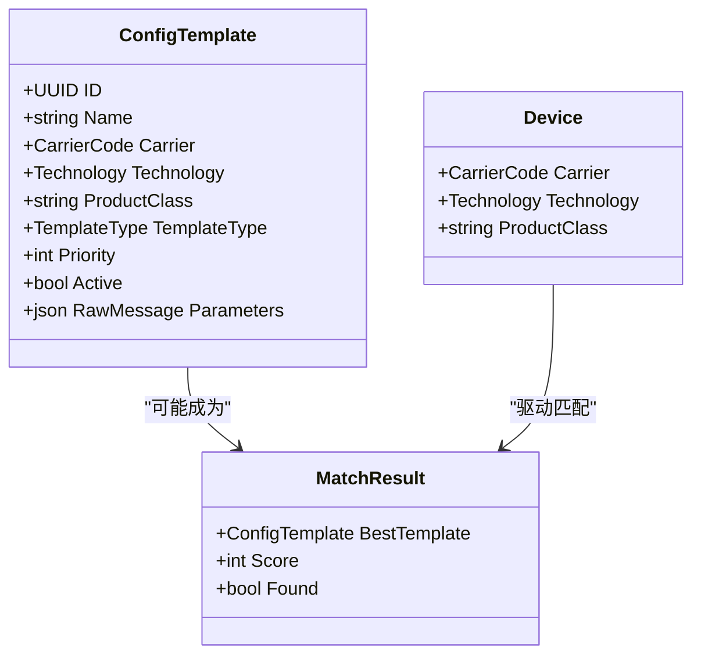
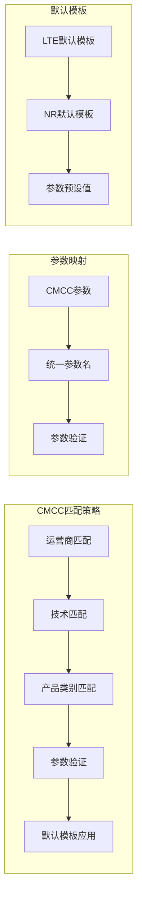
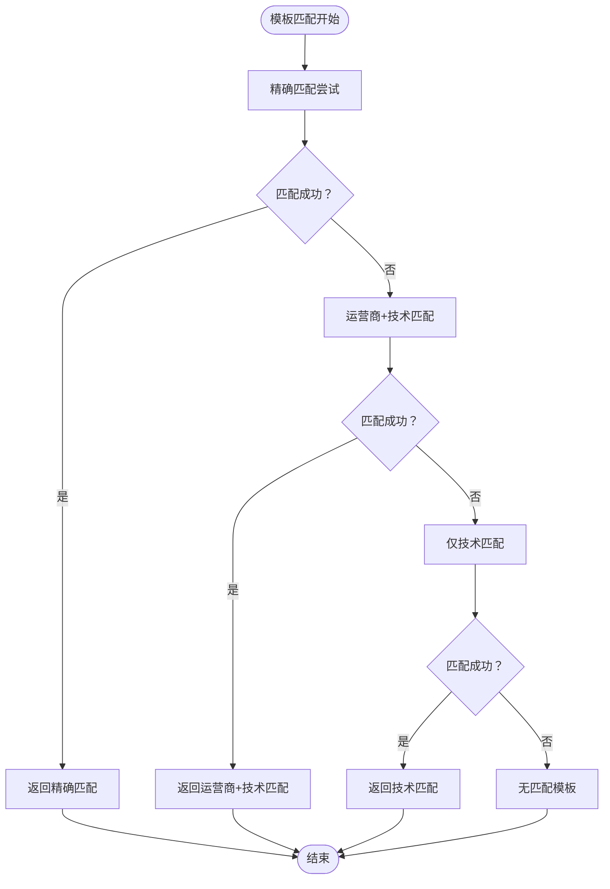
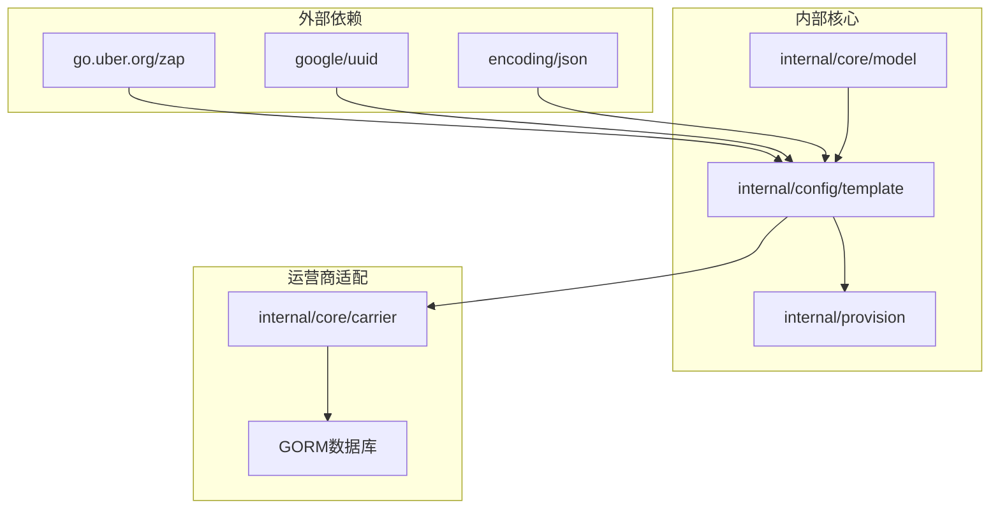
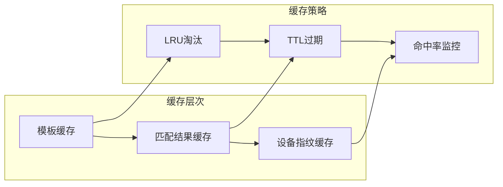
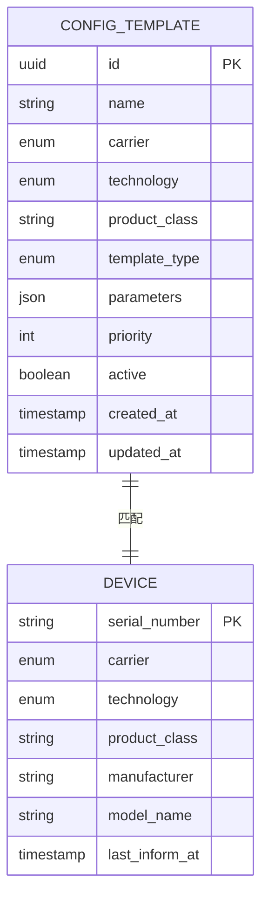

# 模板匹配机制

<cite>
**本文档引用的文件**
- [matcher.go](file://omcgo/internal/provision/matcher.go)
- [matcher_test.go](file://omcgo/internal/provision/matcher_test.go)
- [service.go](file://omcgo/internal/config/template/service.go)
- [repository.go](file://omcgo/internal/config/template/repository.go)
- [model.go](file://omcgo/internal/config/template/model.go)
- [device.go](file://omcgo/internal/core/model/device.go)
- [adapter.go](file://omcgo/internal/core/carrier/cmcc/adapter.go)
- [types.go](file://omcgo/internal/core/carrier/types.go)
- [registry.go](file://omcgo/internal/core/carrier/registry.go)
- [defaults.go](file://omcgo/internal/core/carrier/cmcc/defaults.go)
- [05-device-management.md](file://omcgo/docs/go-zero-design/05-device-management.md)
</cite>

## 目录
1. [简介](#简介)
2. [项目结构](#项目结构)
3. [核心组件](#核心组件)
4. [架构概览](#架构概览)
5. [详细组件分析](#详细组件分析)
6. [依赖关系分析](#依赖关系分析)
7. [性能考虑](#性能考虑)
8. [故障排除指南](#故障排除指南)
9. [结论](#结论)
10. [附录](#附录)

## 简介

模板匹配机制是设备管理系统中用于为不同设备类型和运营商自动选择最合适配置模板的核心功能。该机制通过多维度匹配算法，结合设备参数、运营商特定规则和产品类别信息，实现精准的模板选择。

本机制支持三种匹配优先级：运营商+技术+产品类别（最高优先级）、运营商+技术（次高优先级）和仅技术（最低优先级）。系统还提供了运营商特定的参数映射、验证规则和默认模板配置，确保不同运营商的设备能够获得最适合的配置。

## 项目结构

模板匹配机制在项目中的组织结构如下：

**图表来源**
- [service.go:11-23](file://omcgo/internal/config/template/service.go#L11-L23)
- [matcher.go:8-10](file://omcgo/internal/provision/matcher.go#L8-L10)
- [device.go:9-35](file://omcgo/internal/core/model/device.go#L9-L35)
- [registry.go:10-14](file://omcgo/internal/core/carrier/registry.go#L10-L14)

**章节来源**
- [service.go:1-53](file://omcgo/internal/config/template/service.go#L1-L53)
- [matcher.go:1-49](file://omcgo/internal/provision/matcher.go#L1-L49)
- [model.go:1-46](file://omcgo/internal/config/template/model.go#L1-L46)

## 核心组件

### 配置模板服务
配置模板服务是模板匹配机制的业务逻辑核心，负责协调整个匹配流程并提供对外接口。

### 匹配算法引擎
匹配算法引擎实现了基于优先级的模板选择逻辑，支持精确匹配和回退机制。

### 设备模型
设备模型定义了参与匹配的关键属性，包括运营商代码、技术类型和产品类别等。

### 运营商适配器
运营商适配器提供了运营商特定的参数映射、验证规则和默认模板配置。

**章节来源**
- [service.go:11-23](file://omcgo/internal/config/template/service.go#L11-L23)
- [matcher.go:8-10](file://omcgo/internal/provision/matcher.go#L8-L10)
- [device.go:9-35](file://omcgo/internal/core/model/device.go#L9-L35)

## 架构概览

模板匹配机制采用分层架构设计，各层职责清晰分离：

**图表来源**
- [service.go:25-47](file://omcgo/internal/config/template/service.go#L25-L47)
- [repository.go:10-19](file://omcgo/internal/config/template/repository.go#L10-L19)
- [matcher.go:8-48](file://omcgo/internal/provision/matcher.go#L8-L48)

## 详细组件分析

### 匹配算法实现

匹配算法采用多阶段评分机制，通过以下步骤实现精确匹配：

#### 匹配规则设计原理

**图表来源**
- [matcher.go:10-48](file://omcgo/internal/provision/matcher.go#L10-L48)

#### 匹配优先级确定

匹配算法采用三层优先级体系：

1. **最高优先级（2分）**：运营商 + 技术 + 产品类别完全匹配
2. **次高优先级（1分）**：运营商 + 技术匹配（忽略产品类别）
3. **最低优先级（0分）**：不匹配的模板被跳过

当同一优先级存在多个候选时，系统使用模板优先级字段进行决选，数值越大优先级越高。

#### 参数解析和条件判断

匹配过程中的关键判断逻辑：

**图表来源**
- [model.go:20-35](file://omcgo/internal/config/template/model.go#L20-L35)
- [device.go:9-35](file://omcgo/internal/core/model/device.go#L9-L35)

#### 权重计算和最终选择

权重计算采用简单的整数评分系统：
- 精确匹配（产品类别+运营商+技术）：权重2
- 运营商+技术匹配：权重1  
- 不匹配：权重0（跳过）

最终选择遵循"最高权重优先，权重相同时优先级字段优先"的原则。

**章节来源**
- [matcher.go:8-48](file://omcgo/internal/provision/matcher.go#L8-L48)
- [matcher_test.go:14-122](file://omcgo/internal/provision/matcher_test.go#L14-L122)

### 运营商特定匹配策略

#### CMCC（中国移动）匹配规则

CMCC运营商提供了完整的参数映射和验证机制：

**图表来源**
- [adapter.go:45-80](file://omcgo/internal/core/carrier/cmcc/adapter.go#L45-L80)
- [defaults.go:32-63](file://omcgo/internal/core/carrier/cmcc/defaults.go#L32-L63)

#### CTCC（中国电信）匹配策略

CTCC运营商采用骨架实现，预留扩展空间：
- 参数映射：待实现
- 默认模板：待实现  
- 验证规则：待实现

#### CUCC（中国联通）匹配策略

CUCC运营商实现相对简单：
- 参数映射：基础映射
- 默认模板：空实现
- 验证规则：宽松验证

**章节来源**
- [adapter.go:10-115](file://omcgo/internal/core/carrier/cmcc/adapter.go#L10-L115)
- [registry.go:10-78](file://omcgo/internal/core/carrier/registry.go#L10-L78)

### 匹配失败回退机制

系统实现了多层次的回退策略：

**图表来源**
- [matcher.go:27-44](file://omcgo/internal/provision/matcher.go#L27-L44)

**章节来源**
- [matcher.go:8-48](file://omcgo/internal/provision/matcher.go#L8-L48)

## 依赖关系分析

模板匹配机制的依赖关系呈现清晰的分层结构：

**图表来源**
- [service.go:3-9](file://omcgo/internal/config/template/service.go#L3-L9)
- [model.go:3-9](file://omcgo/internal/config/template/model.go#L3-L9)

### 组件耦合度分析

- **低耦合设计**：各层之间通过接口和标准类型通信
- **高内聚性**：每个包专注于单一职责
- **可扩展性**：新增运营商只需实现Carrier接口

### 外部依赖管理

系统主要依赖以下外部库：
- **zap**：高性能日志记录
- **uuid**：唯一标识符生成
- **json**：JSON数据序列化

**章节来源**
- [service.go:3-9](file://omcgo/internal/config/template/service.go#L3-L9)
- [model.go:3-9](file://omcgo/internal/config/template/model.go#L3-L9)

## 性能考虑

### 时间复杂度优化

匹配算法采用单次遍历策略，时间复杂度为O(n)，其中n为模板数量：
- **初始化开销**：常数时间
- **遍历成本**：O(n)
- **比较操作**：常数时间

### 空间复杂度分析

- **内存占用**：O(n)用于存储候选模板
- **临时变量**：常数空间
- **递归深度**：无递归，栈空间常数

### 缓存机制建议

虽然当前实现未包含缓存，但建议的缓存策略：

### 性能优化建议

1. **索引优化**：在数据库层面为carrier、technology、product_class建立复合索引
2. **批量查询**：支持批量模板查询减少数据库往返
3. **并发控制**：使用读写锁优化并发访问
4. **预编译查询**：减少SQL解析开销

## 故障排除指南

### 常见匹配问题

#### 模板未找到
- 检查模板是否激活（Active=true）
- 验证运营商代码是否正确
- 确认技术类型匹配
- 核实产品类别字符串一致性

#### 匹配结果不符合预期
- 检查模板优先级设置
- 验证产品类别匹配逻辑
- 确认回退机制是否按预期工作

#### 性能问题
- 监控数据库查询性能
- 检查索引使用情况
- 分析模板数量增长趋势

**章节来源**
- [matcher_test.go:59-121](file://omcgo/internal/provision/matcher_test.go#L59-L121)

### 调试技巧

1. **启用详细日志**：使用zap记录匹配过程
2. **单元测试覆盖**：确保各种边界情况都被测试
3. **性能基准测试**：定期评估匹配算法性能
4. **错误处理**：完善的错误返回和处理机制

## 结论

模板匹配机制通过精心设计的多层匹配算法和清晰的分层架构，实现了高效、准确的设备模板选择。系统支持运营商特定的配置需求，提供了灵活的扩展机制，并具备良好的性能表现。

该机制的核心优势在于：
- **精确匹配优先**：确保最符合设备特征的模板被选择
- **渐进式回退**：在精确匹配不可用时提供合理的替代方案
- **运营商适配**：支持不同运营商的特殊需求
- **可扩展设计**：易于添加新的匹配规则和运营商支持

未来可以考虑的改进方向包括引入缓存机制、优化数据库查询性能、增强匹配算法的智能化程度等。

## 附录

### 实际匹配示例

以下是一个典型的匹配流程示例：

1. **设备信息**：CMCC运营商，LTE技术，产品类别"SmallCell-LTE"
2. **候选模板**：
   - cmcc_lte_huawei（产品类别匹配，权重2）
   - cmcc_lte_default（技术匹配，权重1）
3. **匹配结果**：选择cmcc_lte_huawei模板

### 配置模板结构

**图表来源**
- [model.go:20-35](file://omcgo/internal/config/template/model.go#L20-L35)
- [device.go:9-35](file://omcgo/internal/core/model/device.go#L9-L35)