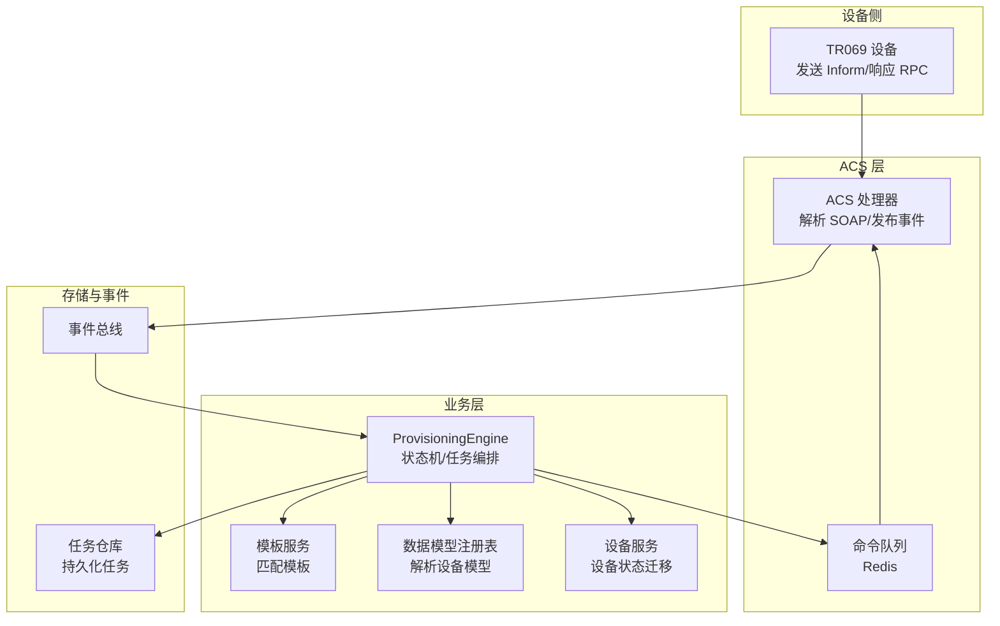
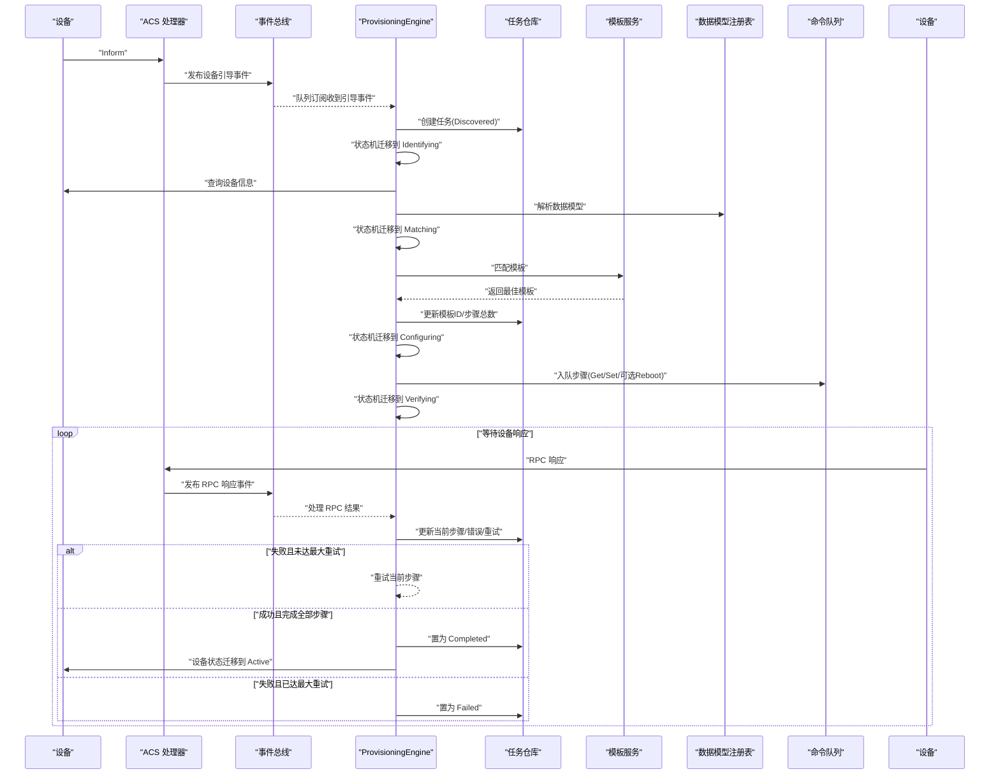
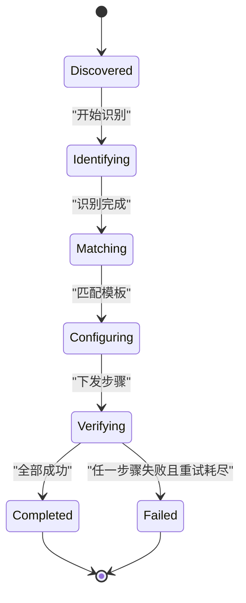
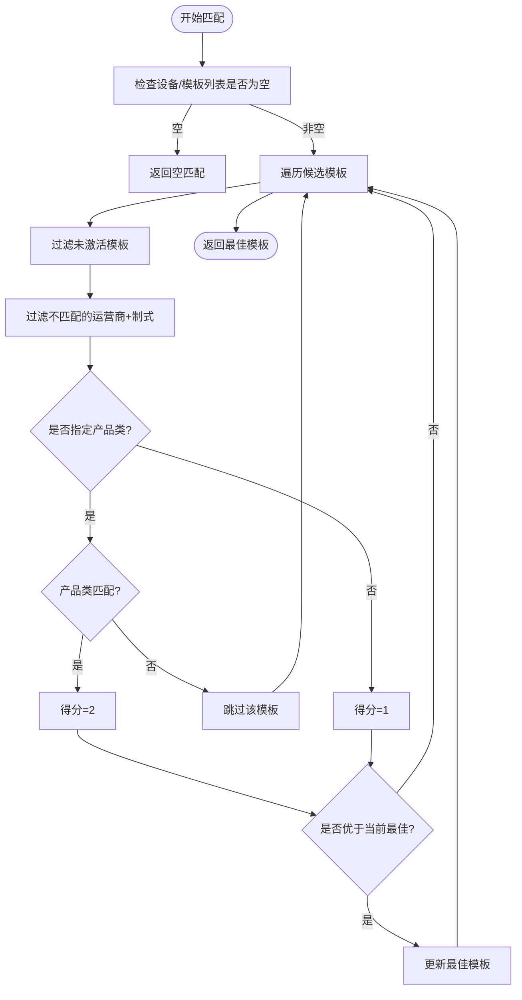
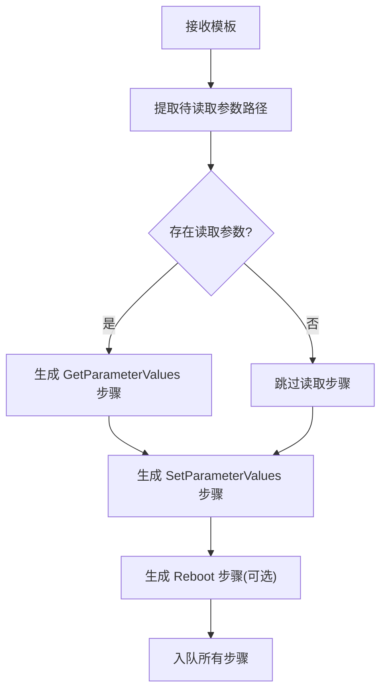
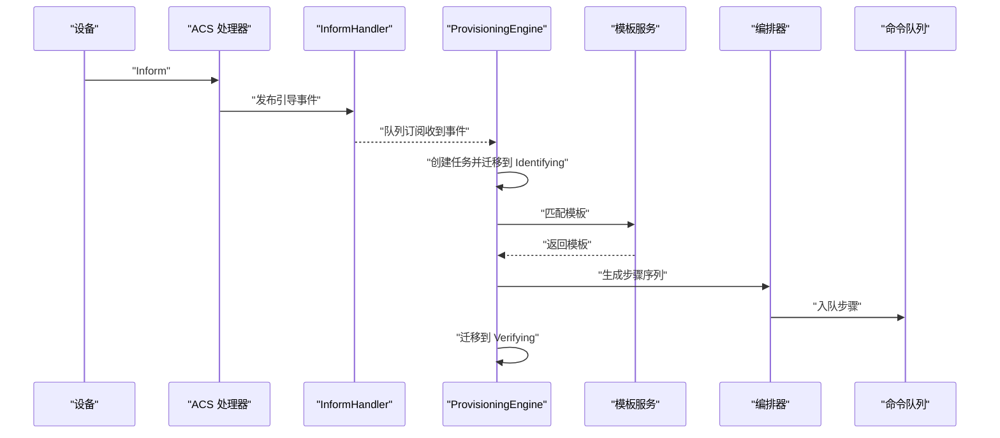
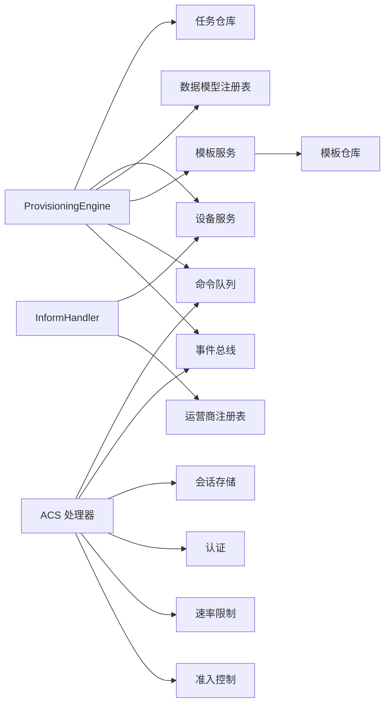

# 自动开站引擎

<cite>
**本文引用的文件**
- [engine.go](file://omcgo/internal/provision/engine.go)
- [matcher.go](file://omcgo/internal/provision/matcher.go)
- [orchestrator.go](file://omcgo/internal/provision/orchestrator.go)
- [state_machine.go](file://omcgo/internal/provision/state_machine.go)
- [model.go](file://omcgo/internal/provision/model.go)
- [handler.go](file://omcgo/internal/provision/handler.go)
- [service.go](file://omcgo/internal/config/template/service.go)
- [model.go](file://omcgo/internal/config/template/model.go)
- [inform_handler.go](file://omcgo/internal/device/inform_handler.go)
- [bus.go](file://omcgo/internal/core/event/bus.go)
- [handler.go](file://omcgo/internal/acs/handler.go)
- [state_machine.go](file://omcgo/internal/device/state_machine.go)
- [model.go](file://omcgo/internal/config/datamodel/model.go)
</cite>

## 目录
1. [简介](#简介)
2. [项目结构](#项目结构)
3. [核心组件](#核心组件)
4. [架构总览](#架构总览)
5. [详细组件分析](#详细组件分析)
6. [依赖分析](#依赖分析)
7. [性能考虑](#性能考虑)
8. [故障排查指南](#故障排查指南)
9. [结论](#结论)
10. [附录](#附录)

## 简介
本文件面向自动开站引擎（Provisioning Engine），系统性阐述从设备首次接入到参数下发并验证完成的全流程设计、参数匹配机制、配置下发编排、状态机与任务编排、进度监控与控制、最佳实践、性能优化与故障处理策略，并提供可操作的配置模板使用指南与常见问题解决方案。

## 项目结构
自动开站引擎位于 omcgo/internal/provision 目录，围绕“设备引导事件 → 识别设备 → 匹配模板 → 构建步骤 → 下发命令 → 验证结果 → 完成或失败”的闭环展开；同时通过事件总线与 ACS 层、设备层、模板与数据模型层解耦协作。

图表来源
- [engine.go:1-286](file://omcgo/internal/provision/engine.go#L1-L286)
- [handler.go:1-567](file://omcgo/internal/acs/handler.go#L1-L567)
- [inform_handler.go:1-175](file://omcgo/internal/device/inform_handler.go#L1-L175)
- [service.go:1-53](file://omcgo/internal/config/template/service.go#L1-L53)
- [model.go:1-46](file://omcgo/internal/config/template/model.go#L1-L46)

章节来源
- [engine.go:1-286](file://omcgo/internal/provision/engine.go#L1-L286)
- [handler.go:1-567](file://omcgo/internal/acs/handler.go#L1-L567)
- [inform_handler.go:1-175](file://omcgo/internal/device/inform_handler.go#L1-L175)

## 核心组件
- ProvisioningEngine：自动开站引擎核心，负责订阅设备引导事件、创建任务、识别设备、匹配模板、构建步骤、入队命令、处理 RPC 结果并推进状态机。
- ProvisioningTask/ProvisioningStep：任务与步骤的数据模型，记录状态、重试次数、步骤计数、超时等。
- StateMachine：定义合法状态与转移，确保任务按序推进且不可逆地进入终止态。
- Orchestrator：根据模板生成标准 RPC 步骤序列（读取参数、设置参数、可选重启）并入队。
- TemplateService：基于设备属性（运营商、制式、产品类）匹配最优模板。
- InformHandler：将 TR069 Inform 事件转换为内部事件，驱动设备注册与状态迁移。
- EventBus：事件总线接口，支撑跨模块解耦通信。
- ACS Handler：解析 SOAP 请求、发布事件、调度命令队列、回传 RPC。

章节来源
- [engine.go:1-286](file://omcgo/internal/provision/engine.go#L1-L286)
- [model.go:1-66](file://omcgo/internal/provision/model.go#L1-L66)
- [state_machine.go:1-55](file://omcgo/internal/provision/state_machine.go#L1-L55)
- [orchestrator.go:1-101](file://omcgo/internal/provision/orchestrator.go#L1-L101)
- [service.go:1-53](file://omcgo/internal/config/template/service.go#L1-L53)
- [inform_handler.go:1-175](file://omcgo/internal/device/inform_handler.go#L1-L175)
- [bus.go:1-26](file://omcgo/internal/core/event/bus.go#L1-L26)
- [handler.go:1-567](file://omcgo/internal/acs/handler.go#L1-L567)

## 架构总览
自动开站引擎采用事件驱动与命令队列解耦的设计：设备侧 TR069 Inform 触发内部引导事件；引擎订阅事件后创建任务并推进状态机；模板服务与数据模型注册表参与设备识别与参数匹配；步骤序列由编排器生成并通过命令队列入队；设备侧返回 RPC 响应后，引擎更新任务并继续下一步。

图表来源
- [engine.go:77-286](file://omcgo/internal/provision/engine.go#L77-L286)
- [handler.go:280-342](file://omcgo/internal/acs/handler.go#L280-L342)
- [inform_handler.go:69-114](file://omcgo/internal/device/inform_handler.go#L69-L114)
- [service.go:25-47](file://omcgo/internal/config/template/service.go#L25-L47)
- [model.go:20-35](file://omcgo/internal/config/template/model.go#L20-L35)

## 详细组件分析

### 状态机与任务编排
- 任务状态：discovered → identifying → matching → configuring → verifying → completed/failed。
- 合法转移：严格单向前进，失败态为终止态；happy-path 下一步由 NextState 计算。
- 终止条件：全部步骤完成或达到最大重试次数。

图表来源
- [state_machine.go:5-36](file://omcgo/internal/provision/state_machine.go#L5-L36)
- [model.go:10-21](file://omcgo/internal/provision/model.go#L10-L21)

章节来源
- [state_machine.go:1-55](file://omcgo/internal/provision/state_machine.go#L1-L55)
- [model.go:1-66](file://omcgo/internal/provision/model.go#L1-L66)

### 参数匹配机制
- 匹配优先级：运营商+制式+产品类 > 运营商+制式（无产品类约束）。
- 评分策略：命中产品类得 2 分，仅命中运营商+制式得 1 分；同分时以模板优先级更高者胜出。
- 模板类型：provisioning 模板用于自动开站；firmware/batch_config 用于其他场景。

图表来源
- [matcher.go:8-48](file://omcgo/internal/provision/matcher.go#L8-L48)
- [service.go:25-47](file://omcgo/internal/config/template/service.go#L25-L47)
- [model.go:11-18](file://omcgo/internal/config/template/model.go#L11-L18)

章节来源
- [matcher.go:1-49](file://omcgo/internal/provision/matcher.go#L1-L49)
- [service.go:1-53](file://omcgo/internal/config/template/service.go#L1-L53)
- [model.go:1-46](file://omcgo/internal/config/template/model.go#L1-L46)

### 配置下发与步骤编排
- 步骤序列：先读取参数（GetParameterValues），再批量写入模板参数（SetParameterValues），最后可选重启（Reboot）。
- 入队策略：按步骤顺序与方法名生成命令键，推送到设备专属队列，ACS 层在后续 Empty POST 中拉取执行。
- 参数提取：从模板参数 JSON 中抽取路径集合，用于读取当前值。

图表来源
- [orchestrator.go:24-86](file://omcgo/internal/provision/orchestrator.go#L24-L86)
- [model.go:20-35](file://omcgo/internal/config/template/model.go#L20-L35)

章节来源
- [orchestrator.go:1-101](file://omcgo/internal/provision/orchestrator.go#L1-L101)
- [model.go:1-46](file://omcgo/internal/config/template/model.go#L1-L46)

### 引擎处理流程与事件链路
- 设备引导事件：TR069 Inform → ACS 解析 → 发布引导事件 → ProvisioningEngine 订阅并创建任务。
- 识别阶段：获取设备信息，解析数据模型，记录模型信息。
- 匹配阶段：模板服务按优先级匹配最佳模板，记录模板ID。
- 下发阶段：编排步骤并入队，状态迁移到 verifying。
- 验证阶段：处理 RPC 响应，推进步骤计数；成功则继续，失败则重试或终止。

图表来源
- [inform_handler.go:46-114](file://omcgo/internal/device/inform_handler.go#L46-L114)
- [engine.go:77-163](file://omcgo/internal/provision/engine.go#L77-L163)
- [service.go:25-47](file://omcgo/internal/config/template/service.go#L25-L47)
- [orchestrator.go:71-86](file://omcgo/internal/provision/orchestrator.go#L71-L86)

章节来源
- [engine.go:64-163](file://omcgo/internal/provision/engine.go#L64-L163)
- [inform_handler.go:1-175](file://omcgo/internal/device/inform_handler.go#L1-L175)
- [handler.go:444-498](file://omcgo/internal/acs/handler.go#L444-L498)

### 设备状态跟踪与验证
- 设备状态机：设备在注册、开站、活跃、维护、离线、退役之间迁移，开站过程会短暂处于开站中状态。
- 引擎完成任务后，尝试将设备状态迁移到 Active；若失败仅记录警告，不影响任务完成。

章节来源
- [state_machine.go:9-31](file://omcgo/internal/device/state_machine.go#L9-L31)
- [engine.go:247-274](file://omcgo/internal/provision/engine.go#L247-L274)

### REST API 与手动触发
- 提供任务列表、详情、手动创建、失败重试等接口。
- 手动创建任务用于异常场景或批量补救。

章节来源
- [handler.go:1-128](file://omcgo/internal/provision/handler.go#L1-L128)

## 依赖分析
- 组件耦合
  - ProvisioningEngine 依赖任务仓库、设备服务、数据模型注册表、模板服务、命令队列、事件总线。
  - 模板服务依赖模板仓库与日志。
  - ACS 处理器依赖会话存储、命令队列、事件总线、认证、速率限制、准入控制。
  - InformHandler 依赖设备服务、运营商注册表与默认运营商。
- 外部依赖
  - 事件总线接口抽象，便于替换实现。
  - Redis 作为命令队列后端，保证命令有序可靠投递。

图表来源
- [engine.go:19-52](file://omcgo/internal/provision/engine.go#L19-L52)
- [service.go:11-23](file://omcgo/internal/config/template/service.go#L11-L23)
- [handler.go:27-41](file://omcgo/internal/acs/handler.go#L27-L41)
- [inform_handler.go:23-44](file://omcgo/internal/device/inform_handler.go#L23-L44)

章节来源
- [engine.go:1-52](file://omcgo/internal/provision/engine.go#L1-L52)
- [service.go:1-23](file://omcgo/internal/config/template/service.go#L1-L23)
- [handler.go:1-41](file://omcgo/internal/acs/handler.go#L1-L41)
- [inform_handler.go:1-44](file://omcgo/internal/device/inform_handler.go#L1-L44)

## 性能考虑
- 速率限制与准入控制：ACS 层对设备请求进行速率限制与并发准入控制，避免突发流量冲击。
- 会话清理：后台清理陈旧连接绑定，释放资源并记录会话时长分布。
- 步骤超时：默认步骤超时与重启步骤较长超时，平衡稳定性与速度。
- 重试策略：任务内置最大重试次数，避免无限循环；失败即刻上报事件，便于监控告警。
- 队列化执行：命令队列保证命令有序下发，减少设备侧并发压力。

章节来源
- [handler.go:43-68](file://omcgo/internal/acs/handler.go#L43-L68)
- [orchestrator.go:21-22](file://omcgo/internal/provision/orchestrator.go#L21-L22)
- [engine.go:196-208](file://omcgo/internal/provision/engine.go#L196-L208)

## 故障排查指南
- 无匹配模板
  - 现象：识别成功但无法匹配模板，任务失败。
  - 排查：确认模板是否激活、运营商/制式/产品类是否与设备一致、优先级是否足够高。
  - 参考
    - [engine.go:121-130](file://omcgo/internal/provision/engine.go#L121-L130)
    - [service.go:25-47](file://omcgo/internal/config/template/service.go#L25-L47)
- 步骤失败与重试
  - 现象：某一步骤失败，记录错误信息并重试；超过最大重试次数后任务失败。
  - 排查：查看命令队列中对应步骤是否被正确入队；检查设备侧响应与参数合法性。
  - 参考
    - [engine.go:165-215](file://omcgo/internal/provision/engine.go#L165-L215)
    - [orchestrator.go:71-86](file://omcgo/internal/provision/orchestrator.go#L71-L86)
- 设备未进入活跃态
  - 现象：任务完成但设备仍非 Active。
  - 排查：检查设备服务状态迁移逻辑与外部依赖；关注引擎日志中的警告。
  - 参考
    - [engine.go:256-261](file://omcgo/internal/provision/engine.go#L256-L261)
    - [state_machine.go:19-31](file://omcgo/internal/device/state_machine.go#L19-L31)
- 事件未到达
  - 现象：ProvisioningEngine 未收到引导事件。
  - 排查：确认事件总线订阅是否成功、主题是否正确、队列组是否一致。
  - 参考
    - [engine.go:64-75](file://omcgo/internal/provision/engine.go#L64-L75)
    - [bus.go:10-16](file://omcgo/internal/core/event/bus.go#L10-L16)
- 模板参数路径不正确
  - 现象：读取参数步骤失败或参数未生效。
  - 排查：核对模板参数 JSON 的路径是否与数据模型一致；必要时使用数据模型注册表校验。
  - 参考
    - [model.go:41-50](file://omcgo/internal/config/datamodel/model.go#L41-L50)
    - [orchestrator.go:88-100](file://omcgo/internal/provision/orchestrator.go#L88-L100)

章节来源
- [engine.go:121-215](file://omcgo/internal/provision/engine.go#L121-L215)
- [service.go:25-47](file://omcgo/internal/config/template/service.go#L25-L47)
- [orchestrator.go:71-100](file://omcgo/internal/provision/orchestrator.go#L71-L100)
- [state_machine.go:19-31](file://omcgo/internal/device/state_machine.go#L19-L31)
- [bus.go:10-16](file://omcgo/internal/core/event/bus.go#L10-L16)
- [model.go:41-50](file://omcgo/internal/config/datamodel/model.go#L41-L50)

## 结论
自动开站引擎通过事件驱动与命令队列实现了高内聚、低耦合的开站流程：从设备引导到模板匹配、步骤编排、命令下发与结果验证形成闭环。严格的有限状态机与重试机制保障了可靠性；REST API 支持手动干预与运维；性能层面结合速率限制、准入控制与会话清理提升整体稳定性。建议在生产环境持续完善模板与数据模型，强化监控与告警，以获得更稳健的开站体验。

## 附录

### 开站流程示例（步骤化）
- 设备发送 Inform，ACS 解析并发布引导事件。
- 引擎订阅事件，创建任务并迁移到 identifying。
- 获取设备信息并解析数据模型，迁移到 matching。
- 模板服务匹配最佳模板，记录模板ID，迁移到 configuring。
- 编排器生成步骤序列并入队，迁移到 verifying。
- 设备侧返回 RPC 响应，引擎推进步骤；全部成功则完成，否则重试或失败。

章节来源
- [engine.go:77-163](file://omcgo/internal/provision/engine.go#L77-L163)
- [handler.go:280-342](file://omcgo/internal/acs/handler.go#L280-L342)

### 配置模板使用指南
- 模板字段
  - 运营商、制式、产品类：决定匹配优先级与范围。
  - 模板类型：provisioning 用于自动开站。
  - 参数：JSON 结构，包含待设置的参数路径与值。
  - 激活状态与优先级：影响匹配结果。
- 最佳实践
  - 优先提供“运营商+制式+产品类”模板，确保精准匹配。
  - 参数路径务必与数据模型一致，避免下发失败。
  - 对于大规模参数变更，保留可选重启步骤以确保生效。

章节来源
- [model.go:20-46](file://omcgo/internal/config/template/model.go#L20-L46)
- [model.go:20-50](file://omcgo/internal/config/datamodel/model.go#L20-L50)