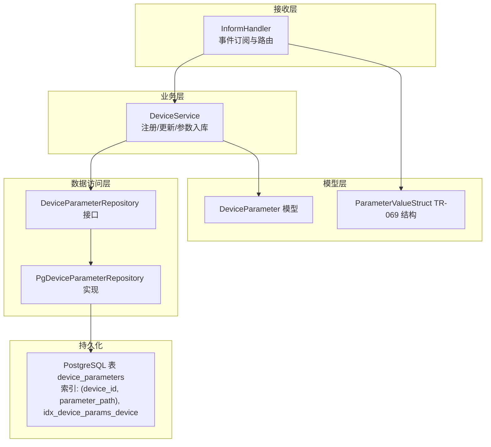
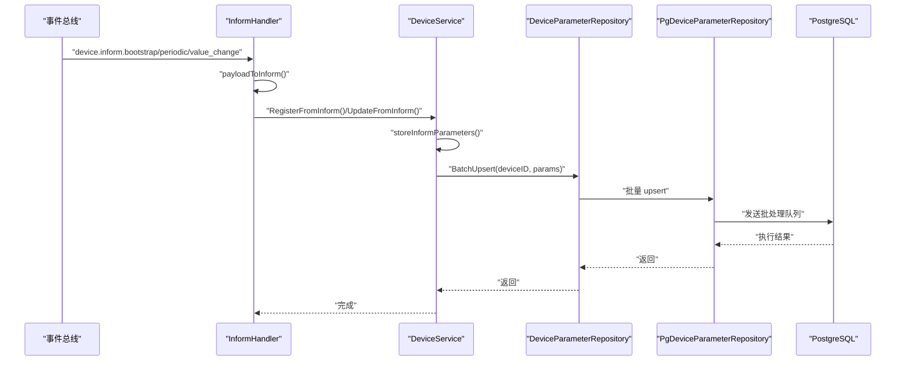
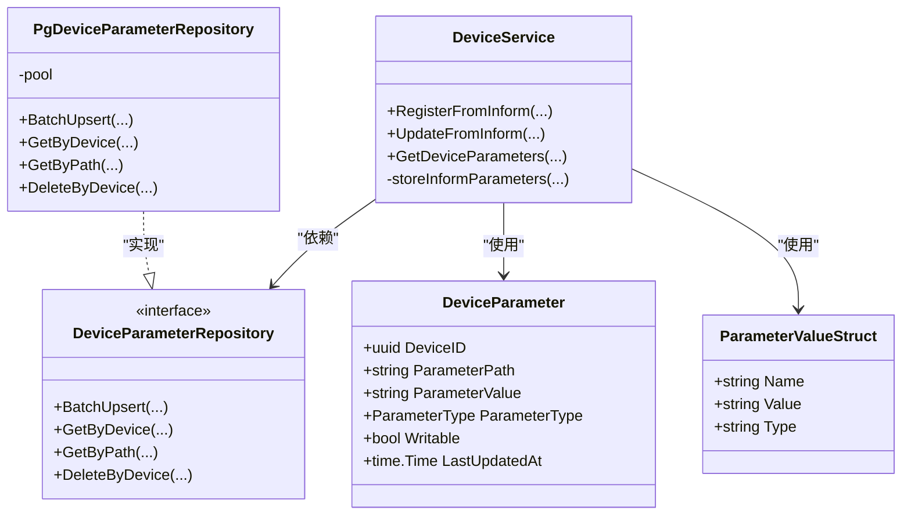
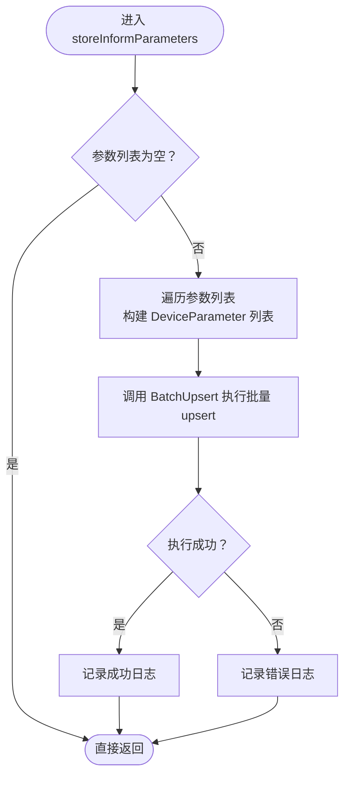
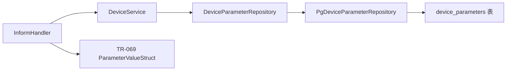

# 设备参数管理

<cite>
**本文引用的文件**
- [service.go](file://omcgo/internal/device/service.go)
- [param_repository.go](file://omcgo/internal/device/param_repository.go)
- [pg_param_repository.go](file://omcgo/internal/device/pg_param_repository.go)
- [parameter.go](file://omcgo/internal/core/model/parameter.go)
- [types.go](file://omcgo/pkg/tr069/types.go)
- [inform_handler.go](file://omcgo/internal/device/inform_handler.go)
- [000002_create_device_parameters.up.sql](file://omcgo/migrations/000002_create_device_parameters.up.sql)
- [000017_optimize_device_sn_index.up.sql](file://omcgo/migrations/000017_optimize_device_sn_index.up.sql)
- [inform_handler_test.go](file://omcgo/internal/device/inform_handler_test.go)
- [03-common-domain-models.md](file://omcgo/docs/detailed-design/03-common-domain-models.md)
</cite>

## 目录
1. [简介](#简介)
2. [项目结构](#项目结构)
3. [核心组件](#核心组件)
4. [架构总览](#架构总览)
5. [详细组件分析](#详细组件分析)
6. [依赖分析](#依赖分析)
7. [性能考虑](#性能考虑)
8. [故障排查指南](#故障排查指南)
9. [结论](#结论)
10. [附录](#附录)

## 简介
本文件面向设备参数管理子系统，围绕以下目标展开：  
- 深入解释设备参数的存储结构、参数类型定义、参数批量操作机制  
- 详解 storeInformParameters 方法的参数处理逻辑（参数值提取、参数类型判断、批量插入优化、参数去重处理）  
- 解释设备参数的查询接口、参数过滤机制、参数更新策略  
- 说明参数存储的性能优化措施（批量操作、索引设计、内存管理）  
- 提供参数管理的最佳实践（命名规范、分类管理、变更跟踪）  
- 给出参数增删改查的具体使用路径与参考示例

## 项目结构
设备参数管理位于后端服务的设备域内，采用分层设计：  
- 接收层：事件处理器接收 TR-069 Inform 事件并转交业务层  
- 业务层：设备服务负责设备生命周期与参数入库流程  
- 数据访问层：参数仓库接口与 PostgreSQL 实现，提供批量写入、按设备/路径查询、删除等能力  
- 模型层：统一的设备参数模型与 TR-069 参数结构体  
- 迁移层：数据库表结构与索引定义  

图表来源
- [inform_handler.go:24-67](file://omcgo/internal/device/inform_handler.go#L24-L67)
- [service.go:16-40](file://omcgo/internal/device/service.go#L16-L40)
- [param_repository.go:10-16](file://omcgo/internal/device/param_repository.go#L10-L16)
- [pg_param_repository.go:15-23](file://omcgo/internal/device/pg_param_repository.go#L15-L23)
- [parameter.go:9-17](file://omcgo/internal/core/model/parameter.go#L9-L17)
- [types.go:13-34](file://omcgo/pkg/tr069/types.go#L13-L34)
- [000002_create_device_parameters.up.sql:1-13](file://omcgo/migrations/000002_create_device_parameters.up.sql#L1-L13)

章节来源
- [inform_handler.go:24-67](file://omcgo/internal/device/inform_handler.go#L24-L67)
- [service.go:16-40](file://omcgo/internal/device/service.go#L16-L40)
- [param_repository.go:10-16](file://omcgo/internal/device/param_repository.go#L10-L16)
- [pg_param_repository.go:15-23](file://omcgo/internal/device/pg_param_repository.go#L15-L23)
- [parameter.go:9-17](file://omcgo/internal/core/model/parameter.go#L9-L17)
- [types.go:13-34](file://omcgo/pkg/tr069/types.go#L13-L34)
- [000002_create_device_parameters.up.sql:1-13](file://omcgo/migrations/000002_create_device_parameters.up.sql#L1-L13)

## 核心组件
- 设备服务 DeviceService：封装设备注册、更新与参数入库流程；提供参数查询接口；内部实现 storeInformParameters 完成批量入库  
- 参数仓库接口 DeviceParameterRepository：定义批量写入、按设备查询、按路径查询、按设备删除等契约  
- PostgreSQL 参数仓库 PgDeviceParameterRepository：基于 pgx 批处理队列执行批量 upsert，并提供查询与删除  
- 设备参数模型 DeviceParameter：统一的参数实体，包含路径、值、类型、可写性、更新时间等字段  
- TR-069 参数结构体 ParameterValueStruct：从 Inform 消息中提取的参数名-值对，携带可选类型属性  
- InformHandler：事件订阅器，将设备 Inform 事件转换为业务调用

章节来源
- [service.go:16-40](file://omcgo/internal/device/service.go#L16-L40)
- [param_repository.go:10-16](file://omcgo/internal/device/param_repository.go#L10-L16)
- [pg_param_repository.go:15-23](file://omcgo/internal/device/pg_param_repository.go#L15-L23)
- [parameter.go:9-17](file://omcgo/internal/core/model/parameter.go#L9-L17)
- [types.go:13-34](file://omcgo/pkg/tr069/types.go#L13-L34)
- [inform_handler.go:24-67](file://omcgo/internal/device/inform_handler.go#L24-L67)

## 架构总览
设备参数管理遵循“事件驱动 + 业务服务 + 数据访问”的分层架构。事件处理器负责解码 TR-069 Inform 事件，设备服务负责业务编排，参数仓库负责持久化。

图表来源
- [inform_handler.go:69-150](file://omcgo/internal/device/inform_handler.go#L69-L150)
- [service.go:42-130](file://omcgo/internal/device/service.go#L42-L130)
- [service.go:132-202](file://omcgo/internal/device/service.go#L132-L202)
- [service.go:256-279](file://omcgo/internal/device/service.go#L256-L279)
- [param_repository.go:10-16](file://omcgo/internal/device/param_repository.go#L10-L16)
- [pg_param_repository.go:25-54](file://omcgo/internal/device/pg_param_repository.go#L25-L54)

## 详细组件分析

### 参数模型与类型定义
- 设备参数模型 DeviceParameter：包含设备标识、参数路径、参数值、参数类型、是否可写、最后更新时间等字段  
- TR-069 参数结构体 ParameterValueStruct：包含参数名、值、可选类型属性，用于从 Inform 消息中提取参数  
- 参数类型枚举：字符串、整数、无符号整数、布尔、日期时间等（在通用模型文档中有定义）

图表来源
- [parameter.go:9-17](file://omcgo/internal/core/model/parameter.go#L9-L17)
- [types.go:13-34](file://omcgo/pkg/tr069/types.go#L13-L34)
- [service.go:16-40](file://omcgo/internal/device/service.go#L16-L40)
- [param_repository.go:10-16](file://omcgo/internal/device/param_repository.go#L10-L16)
- [pg_param_repository.go:15-23](file://omcgo/internal/device/pg_param_repository.go#L15-L23)

章节来源
- [parameter.go:9-17](file://omcgo/internal/core/model/parameter.go#L9-L17)
- [types.go:13-34](file://omcgo/pkg/tr069/types.go#L13-L34)
- [03-common-domain-models.md:130-151](file://omcgo/docs/detailed-design/03-common-domain-models.md#L130-L151)

### storeInformParameters 方法处理逻辑
该方法负责将 TR-069 Inform 中的参数列表转换为内部模型并进行批量写入，同时进行去重与更新时间维护。

图表来源
- [service.go:256-279](file://omcgo/internal/device/service.go#L256-L279)
- [pg_param_repository.go:25-54](file://omcgo/internal/device/pg_param_repository.go#L25-L54)

章节来源
- [service.go:256-279](file://omcgo/internal/device/service.go#L256-L279)
- [pg_param_repository.go:25-54](file://omcgo/internal/device/pg_param_repository.go#L25-L54)

### 批量插入与去重策略
- 批量 upsert 使用 PostgreSQL 的 ON CONFLICT 子句，按 (device_id, parameter_path) 唯一键冲突时更新参数值、类型、可写性与更新时间  
- 使用 pgx 的批处理队列发送多个 upsert 语句，减少往返开销  
- 通过预分配切片容量避免扩容带来的额外分配成本

章节来源
- [pg_param_repository.go:25-54](file://omcgo/internal/device/pg_param_repository.go#L25-L54)
- [000002_create_device_parameters.up.sql:1-13](file://omcgo/migrations/000002_create_device_parameters.up.sql#L1-L13)

### 查询接口与过滤机制
- 按设备查询：返回指定设备的所有参数，按参数路径升序排序  
- 按路径查询：返回指定设备下某参数路径的参数项，不存在则返回空  
- 删除接口：按设备删除其所有参数，用于设备注销或重置场景

章节来源
- [pg_param_repository.go:56-85](file://omcgo/internal/device/pg_param_repository.go#L56-L85)
- [pg_param_repository.go:87-105](file://omcgo/internal/device/pg_param_repository.go#L87-L105)
- [pg_param_repository.go:107-111](file://omcgo/internal/device/pg_param_repository.go#L107-L111)

### 更新策略与事件集成
- 设备注册/更新时均会调用 storeInformParameters，确保参数与设备状态同步  
- InformHandler 订阅多种事件主题，分别处理首次引导、周期上报与参数变化事件  
- 事件负载转换为 TR-069 Inform 消息结构，便于统一处理

章节来源
- [service.go:42-130](file://omcgo/internal/device/service.go#L42-L130)
- [service.go:132-202](file://omcgo/internal/device/service.go#L132-L202)
- [inform_handler.go:69-150](file://omcgo/internal/device/inform_handler.go#L69-L150)
- [inform_handler.go:163-174](file://omcgo/internal/device/inform_handler.go#L163-L174)

### 参数类型判断与处理
- 当前实现将 TR-069 参数值统一存为字符串类型，参数类型字段固定为字符串  
- 若需支持多类型参数，可在上游解析阶段根据 TR-069 类型属性或数据模型定义进行类型推断与转换，再写入对应类型字段

章节来源
- [service.go:261-271](file://omcgo/internal/device/service.go#L261-L271)
- [types.go:13-18](file://omcgo/pkg/tr069/types.go#L13-L18)

### 参数去重与幂等性
- 主键为 (device_id, parameter_path)，天然保证同一设备下同路径参数的唯一性  
- 冲突时仅更新参数值、类型、可写性与更新时间，避免重复插入

章节来源
- [000002_create_device_parameters.up.sql:1-13](file://omcgo/migrations/000002_create_device_parameters.up.sql#L1-L13)
- [pg_param_repository.go:33-42](file://omcgo/internal/device/pg_param_repository.go#L33-L42)

### 参数变更跟踪
- 每条参数记录包含最后更新时间字段，可用于变更审计与增量拉取  
- 可结合事件总线发布参数变更事件，实现下游订阅与联动

章节来源
- [parameter.go:16](file://omcgo/internal/core/model/parameter.go#L16)
- [pg_param_repository.go:35](file://omcgo/internal/device/pg_param_repository.go#L35)

## 依赖分析
- DeviceService 依赖 DeviceParameterRepository 接口，便于替换不同存储实现  
- PgDeviceParameterRepository 依赖 pgx 连接池，执行 SQL 与批处理  
- InformHandler 依赖事件总线与载荷解码，桥接外部 TR-069 事件到业务层  
- 数据库层面依赖 device_parameters 表与索引，保障主键唯一性与按设备查询效率

图表来源
- [service.go:16-40](file://omcgo/internal/device/service.go#L16-L40)
- [param_repository.go:10-16](file://omcgo/internal/device/param_repository.go#L10-L16)
- [pg_param_repository.go:15-23](file://omcgo/internal/device/pg_param_repository.go#L15-L23)
- [inform_handler.go:24-67](file://omcgo/internal/device/inform_handler.go#L24-L67)
- [types.go:13-34](file://omcgo/pkg/tr069/types.go#L13-L34)

章节来源
- [service.go:16-40](file://omcgo/internal/device/service.go#L16-L40)
- [param_repository.go:10-16](file://omcgo/internal/device/param_repository.go#L10-L16)
- [pg_param_repository.go:15-23](file://omcgo/internal/device/pg_param_repository.go#L15-L23)
- [inform_handler.go:24-67](file://omcgo/internal/device/inform_handler.go#L24-L67)
- [types.go:13-34](file://omcgo/pkg/tr069/types.go#L13-L34)

## 性能考虑
- 批量操作：使用 pgx 批处理队列一次性提交多个 upsert，降低网络往返与事务开销  
- 内存管理：预分配模型参数切片容量，避免频繁扩容  
- 索引设计：主键 (device_id, parameter_path) 保证唯一性与高效 upsert；额外索引 idx_device_params_device 支持按设备查询  
- 并发与吞吐：批处理队列顺序执行，适合高并发下的参数入库场景；如需更高吞吐，可评估分片或分区策略（当前表未分区）  
- 查询优化：按设备查询默认按参数路径排序，利于前端展示与二分查找

章节来源
- [pg_param_repository.go:25-54](file://omcgo/internal/device/pg_param_repository.go#L25-L54)
- [000002_create_device_parameters.up.sql:1-13](file://omcgo/migrations/000002_create_device_parameters.up.sql#L1-L13)

## 故障排查指南
- 参数入库失败：检查 BatchUpsert 返回的错误，关注 SQL 构建与执行阶段的异常  
- 查询无结果：确认设备 ID 与参数路径是否正确；确认索引是否存在  
- 事件未触发：检查 InformHandler 是否成功订阅事件主题，以及载荷解码是否正确  
- 测试辅助：可使用模拟仓库接口进行单元测试，验证参数入库逻辑

章节来源
- [pg_param_repository.go:25-54](file://omcgo/internal/device/pg_param_repository.go#L25-L54)
- [inform_handler_test.go:89-126](file://omcgo/internal/device/inform_handler_test.go#L89-L126)

## 结论
设备参数管理通过清晰的分层设计与事件驱动机制，实现了 TR-069 参数的高效入库、查询与维护。当前实现以字符串类型存储参数值，具备良好的兼容性与扩展空间；批量 upsert 与主键约束确保了性能与一致性。建议后续在上游解析阶段引入参数类型推断与校验，进一步提升参数管理的准确性与可观测性。

## 附录

### 参数增删改查使用路径
- 新增/更新参数（批量）：调用设备服务的 RegisterFromInform 或 UpdateFromInform，内部会调用 storeInformParameters 完成批量 upsert  
- 查询参数（按设备）：调用 GetDeviceParameters 获取设备全部参数  
- 查询参数（按路径）：调用 GetByPath 获取单个参数  
- 删除参数（按设备）：调用 DeleteByDevice 清空设备参数  

章节来源
- [service.go:246-249](file://omcgo/internal/device/service.go#L246-L249)
- [service.go:256-279](file://omcgo/internal/device/service.go#L256-L279)
- [param_repository.go:10-16](file://omcgo/internal/device/param_repository.go#L10-L16)
- [pg_param_repository.go:56-85](file://omcgo/internal/device/pg_param_repository.go#L56-L85)
- [pg_param_repository.go:87-105](file://omcgo/internal/device/pg_param_repository.go#L87-L105)
- [pg_param_repository.go:107-111](file://omcgo/internal/device/pg_param_repository.go#L107-L111)

### 最佳实践
- 参数命名规范：使用标准 TR-069 路径格式，保持层级清晰、语义明确  
- 参数分类管理：依据业务域（如无线、传输、安全）对参数路径进行分组与文档化  
- 参数变更跟踪：利用最后更新时间字段进行变更审计；必要时发布参数变更事件  
- 参数类型支持：在上游解析阶段识别并映射参数类型，避免统一存储为字符串导致的类型丢失  
- 性能优化：优先使用批量 upsert；合理设置索引；控制单次批量大小以平衡内存与吞吐