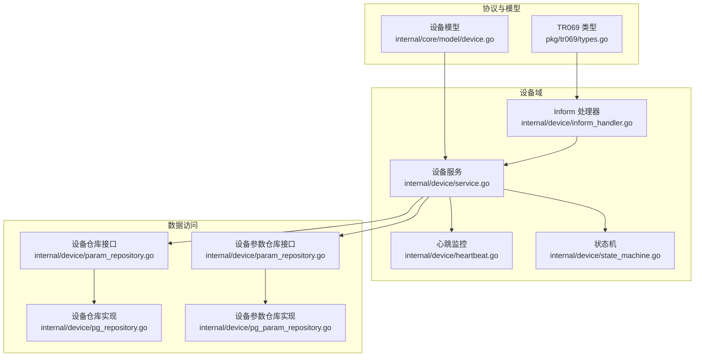
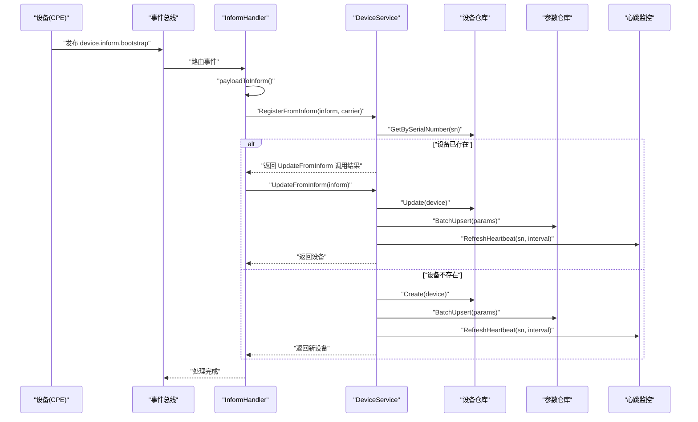
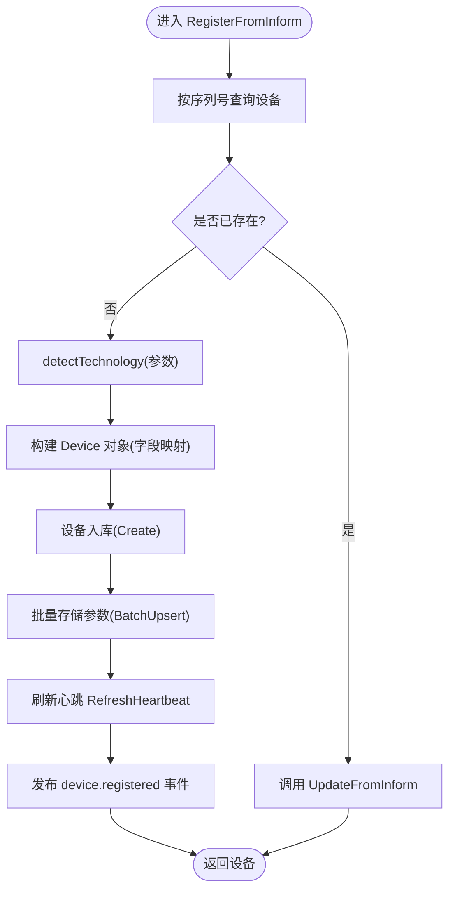
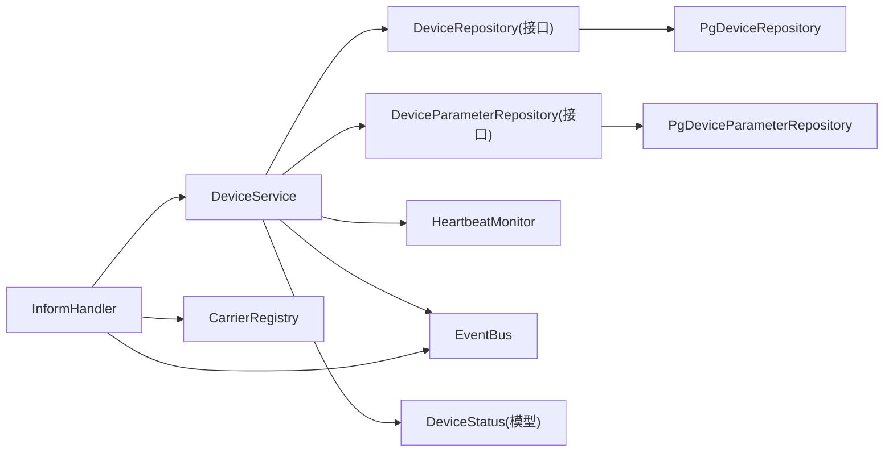
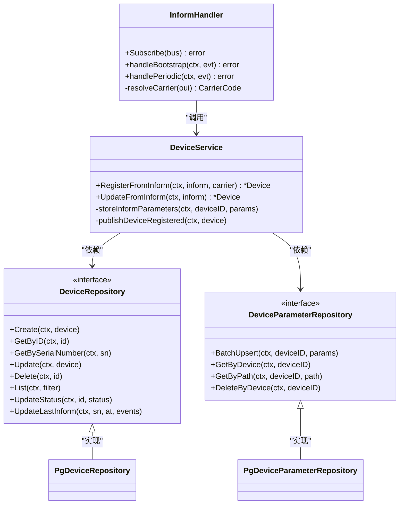

# 设备注册与发现

<cite>
**本文引用的文件**
- [inform_handler.go](file://omcgo/internal/device/inform_handler.go)
- [service.go](file://omcgo/internal/device/service.go)
- [pg_repository.go](file://omcgo/internal/device/pg_repository.go)
- [param_repository.go](file://omcgo/internal/device/param_repository.go)
- [pg_param_repository.go](file://omcgo/internal/device/pg_param_repository.go)
- [types.go](file://omcgo/pkg/tr069/types.go)
- [device.go](file://omcgo/internal/core/model/device.go)
- [state_machine.go](file://omcgo/internal/device/state_machine.go)
- [heartbeat.go](file://omcgo/internal/device/heartbeat.go)
- [inform_register_test.go](file://omcgo/test/integration/inform_register_test.go)
- [inform_handler_test.go](file://omcgo/internal/device/inform_handler_test.go)
- [service_test.go](file://omcgo/internal/device/service_test.go)
- [06-tr069-protocol-library.md](file://omcgo/docs/detailed-design/06-tr069-protocol-library.md)
- [09-device-management.md](file://omcgo/docs/detailed-design/09-device-management.md)
</cite>

## 目录
1. [简介](#简介)
2. [项目结构](#项目结构)
3. [核心组件](#核心组件)
4. [架构总览](#架构总览)
5. [详细组件分析](#详细组件分析)
6. [依赖分析](#依赖分析)
7. [性能考虑](#性能考虑)
8. [故障排查指南](#故障排查指南)
9. [结论](#结论)
10. [附录](#附录)

## 简介
本文件围绕 TR069 Inform 消息驱动的设备注册与发现流程，系统化阐述从设备首次引导上报到设备入库、状态初始化、参数持久化、心跳维护与事件发布的完整链路。重点解析 RegisterFromInform 与 UpdateFromInform 两大核心方法的实现细节，覆盖设备唯一性检查、设备信息提取、技术类型检测（LTE/NR/5G）、错误处理与重复设备策略、参数验证规则，并提供扩展支持新设备类型的方法论。

## 项目结构
设备注册与发现相关代码主要分布在以下模块：
- TR069 类型与协议：pkg/tr069/types.go 定义 InformMessage、DeviceId、参数与事件结构
- 设备领域模型：internal/core/model/device.go 定义 Device 结构
- 设备服务层：internal/device/service.go 提供 RegisterFromInform/UpdateFromInform 等业务逻辑
- 事件与处理器：internal/device/inform_handler.go 订阅并路由 device.inform.* 事件
- 数据访问层：internal/device/pg_repository.go、internal/device/param_repository.go 及其实现
- 心跳与状态机：internal/device/heartbeat.go、internal/device/state_machine.go
- 测试与集成验证：test/integration/inform_register_test.go、internal/device/inform_handler_test.go、internal/device/service_test.go

图表来源
- [inform_handler.go:1-175](file://omcgo/internal/device/inform_handler.go#L1-L175)
- [service.go:1-417](file://omcgo/internal/device/service.go#L1-L417)
- [pg_repository.go:1-333](file://omcgo/internal/device/pg_repository.go#L1-L333)
- [param_repository.go:1-17](file://omcgo/internal/device/param_repository.go#L1-L17)
- [heartbeat.go:1-120](file://omcgo/internal/device/heartbeat.go#L1-L120)
- [state_machine.go:1-32](file://omcgo/internal/device/state_machine.go#L1-L32)
- [types.go:1-34](file://omcgo/pkg/tr069/types.go#L1-L34)
- [device.go:1-35](file://omcgo/internal/core/model/device.go#L1-L35)

章节来源
- [inform_handler.go:1-175](file://omcgo/internal/device/inform_handler.go#L1-L175)
- [service.go:1-417](file://omcgo/internal/device/service.go#L1-L417)
- [pg_repository.go:1-333](file://omcgo/internal/device/pg_repository.go#L1-L333)
- [param_repository.go:1-17](file://omcgo/internal/device/param_repository.go#L1-L17)
- [heartbeat.go:1-120](file://omcgo/internal/device/heartbeat.go#L1-L120)
- [state_machine.go:1-32](file://omcgo/internal/device/state_machine.go#L1-L32)
- [types.go:1-34](file://omcgo/pkg/tr069/types.go#L1-L34)
- [device.go:1-35](file://omcgo/internal/core/model/device.go#L1-L35)

## 核心组件
- InformHandler：订阅 device.inform.bootstrap、device.inform.periodic、device.inform.value_change 事件，解码 payload 为 tr069.InformMessage，调用 DeviceService 的注册或更新流程，并根据 OUI 解析运营商。
- DeviceService：核心业务逻辑，负责设备唯一性检查、技术类型检测、字段映射、数据库写入、参数批量存储、心跳刷新与事件发布；提供 RegisterFromInform（首次引导）与 UpdateFromInform（周期 Inform）。
- 设备仓库与参数仓库：抽象接口与 PostgreSQL 实现，支持设备与参数的增删改查、批量 upsert、分页查询与状态统计。
- 心跳监控：基于 Redis TTL 维护设备心跳，定时扫描活跃设备并标记离线。
- 状态机：定义合法状态转换，确保设备生命周期状态变更合规。

章节来源
- [inform_handler.go:23-175](file://omcgo/internal/device/inform_handler.go#L23-L175)
- [service.go:42-202](file://omcgo/internal/device/service.go#L42-L202)
- [pg_repository.go:18-333](file://omcgo/internal/device/pg_repository.go#L18-L333)
- [param_repository.go:10-17](file://omcgo/internal/device/param_repository.go#L10-L17)
- [heartbeat.go:14-120](file://omcgo/internal/device/heartbeat.go#L14-L120)
- [state_machine.go:9-31](file://omcgo/internal/device/state_machine.go#L9-L31)

## 架构总览
下图展示了从 TR069 引导 Inform 到设备入库与参数持久化的端到端流程。

图表来源
- [inform_handler.go:69-114](file://omcgo/internal/device/inform_handler.go#L69-L114)
- [service.go:42-130](file://omcgo/internal/device/service.go#L42-L130)
- [service.go:132-202](file://omcgo/internal/device/service.go#L132-L202)
- [pg_repository.go:28-125](file://omcgo/internal/device/pg_repository.go#L28-L125)
- [pg_param_repository.go:25-54](file://omcgo/internal/device/pg_param_repository.go#L25-L54)
- [heartbeat.go:53-64](file://omcgo/internal/device/heartbeat.go#L53-L64)

章节来源
- [inform_handler.go:47-114](file://omcgo/internal/device/inform_handler.go#L47-L114)
- [service.go:42-202](file://omcgo/internal/device/service.go#L42-L202)
- [pg_repository.go:28-125](file://omcgo/internal/device/pg_repository.go#L28-L125)
- [pg_param_repository.go:25-54](file://omcgo/internal/device/pg_param_repository.go#L25-L54)
- [heartbeat.go:53-64](file://omcgo/internal/device/heartbeat.go#L53-L64)

## 详细组件分析

### InformHandler：事件订阅与路由
- 订阅 device.inform.bootstrap、device.inform.periodic、device.inform.value_change 三类事件，分别对应引导注册、周期更新与参数变化。
- 将事件负载解码为 InformEventPayload，再转换为 tr069.InformMessage。
- 依据 OUI 通过 CarrierRegistry 解析运营商，若未配置则使用默认运营商。
- 调用 DeviceService.RegisterFromInform 或 UpdateFromInform，并记录日志与错误。

章节来源
- [inform_handler.go:47-175](file://omcgo/internal/device/inform_handler.go#L47-L175)

### DeviceService：注册与更新主流程
- RegisterFromInform
  - 唯一性检查：按序列号查询设备，若存在则直接进入 UpdateFromInform。
  - 技术类型检测：通过 detectTechnology 从参数列表推断 LTE/NR/5G。
  - 字段映射：填充 Device 结构（序列号、OUI、厂商、产品类、固件版本、连接请求地址、最近 Inform 时间与事件、心跳间隔等）。
  - 数据库写入：创建设备记录。
  - 参数存储：批量 upsert 参数到 device_parameters。
  - 心跳刷新：根据 inform_interval 刷新 Redis 心跳键。
  - 事件发布：发布 device.registered 事件。
- UpdateFromInform
  - 查找设备：按序列号获取设备，不存在则返回错误。
  - 字段更新：更新 OUI、产品类、厂商、固件版本、连接请求地址、最近 Inform 时间与事件、IP 地址（如存在）。
  - 状态自动切换：若设备处于 discovered/discovered/offline/registered，则自动转为 active。
  - 数据库更新：写回设备记录。
  - 参数存储与心跳刷新：同上。

图表来源
- [service.go:42-130](file://omcgo/internal/device/service.go#L42-L130)
- [service.go:132-202](file://omcgo/internal/device/service.go#L132-L202)
- [service.go:303-336](file://omcgo/internal/device/service.go#L303-L336)

章节来源
- [service.go:42-202](file://omcgo/internal/device/service.go#L42-L202)
- [service.go:303-336](file://omcgo/internal/device/service.go#L303-L336)

### TR069 类型与参数提取
- TR069 InformMessage 包含 DeviceId、事件列表、参数列表等字段。
- 参数路径映射：通过 findParamValue 在参数列表中查找特定路径（如 SoftwareVersion、ConnectionRequestURL、UDPConnectionRequestAddress）。
- 事件编码：tr069.EventCodes 将事件结构数组转换为字符串切片，用于记录最近一次 Inform 的事件集合。

章节来源
- [types.go:26-34](file://omcgo/pkg/tr069/types.go#L26-L34)
- [service.go:329-336](file://omcgo/internal/device/service.go#L329-L336)

### 技术类型检测（LTE/NR/5G）
- 检测逻辑：优先检查 Device.DeviceInfo.ModelName 与 Device.DeviceInfo.Description，若包含 NR、5G、gNB 关键字则判定为 NR，否则默认 LTE。
- 测试覆盖：包含多种关键字组合与无关路径的边界用例，确保检测稳健性。

章节来源
- [service.go:303-314](file://omcgo/internal/device/service.go#L303-L314)
- [service_test.go:502-556](file://omcgo/internal/device/service_test.go#L502-L556)

### 设备唯一性检查与重复设备处理
- 唯一性：以序列号为唯一键进行查询；若存在则不创建，直接走更新流程。
- 重复设备策略：更新流程会同步最新参数与状态，避免重复创建带来的脏数据。

章节来源
- [service.go:51-67](file://omcgo/internal/device/service.go#L51-L67)

### 参数存储与批量 upsert
- 参数结构：DeviceParameter 包含设备 ID、参数路径、参数值、类型、可写标志与更新时间。
- 批量 upsert：使用 PostgreSQL 的 ON CONFLICT DO UPDATE，保证并发场景下的参数一致性与幂等性。

章节来源
- [pg_param_repository.go:25-54](file://omcgo/internal/device/pg_param_repository.go#L25-L54)
- [param_repository.go:10-17](file://omcgo/internal/device/param_repository.go#L10-L17)

### 心跳监控与离线标记
- 心跳键：Redis 键格式为 "acs:heartbeat:{sn}"，TTL 为 2 × inform_interval，最小 600s。
- 定时扫描：每 60s 扫描所有 active 设备，若心跳键不存在则标记为 offline。

章节来源
- [heartbeat.go:53-115](file://omcgo/internal/device/heartbeat.go#L53-L115)

### 设备状态机与状态转换
- 合法转换：discovered → registered/provisioning/active；registered → provisioning/active；provisioning → active/registered；active → maintenance/offline/decommissioned；maintenance → active；offline → active；decommissioned 为终态。
- 转换校验：ValidateTransition 校验目标状态是否允许，防止非法状态跃迁。

章节来源
- [state_machine.go:9-31](file://omcgo/internal/device/state_machine.go#L9-L31)

### 错误处理与验证规则
- 设备不存在：UpdateFromInform 在按序列号查询不到设备时返回错误。
- 参数缺失：findParamValue 未命中时返回空字符串，不影响整体流程但可能影响部分字段。
- 事件总线：发布 device.registered 事件失败仅记录警告，不影响主流程。
- 集成测试：验证引导 Inform 的解析、入库、参数存储与事件总线可用性。

章节来源
- [service.go:137-148](file://omcgo/internal/device/service.go#L137-L148)
- [inform_register_test.go:26-120](file://omcgo/test/integration/inform_register_test.go#L26-L120)

## 依赖分析
- InformHandler 依赖 DeviceService、CarrierRegistry 与事件总线；DeviceService 依赖设备与参数仓库、心跳监控与事件总线。
- 设备仓库与参数仓库采用接口抽象，当前实现为 PostgreSQL；心跳监控依赖 Redis。
- TR069 类型与设备模型为跨模块共享的基础类型。

图表来源
- [inform_handler.go:24-44](file://omcgo/internal/device/inform_handler.go#L24-L44)
- [service.go:17-40](file://omcgo/internal/device/service.go#L17-L40)
- [pg_repository.go:18-26](file://omcgo/internal/device/pg_repository.go#L18-L26)
- [pg_param_repository.go:15-23](file://omcgo/internal/device/pg_param_repository.go#L15-L23)
- [heartbeat.go:18-32](file://omcgo/internal/device/heartbeat.go#L18-L32)
- [device.go:9-35](file://omcgo/internal/core/model/device.go#L9-L35)

章节来源
- [inform_handler.go:24-44](file://omcgo/internal/device/inform_handler.go#L24-L44)
- [service.go:17-40](file://omcgo/internal/device/service.go#L17-L40)
- [pg_repository.go:18-26](file://omcgo/internal/device/pg_repository.go#L18-L26)
- [pg_param_repository.go:15-23](file://omcgo/internal/device/pg_param_repository.go#L15-L23)
- [heartbeat.go:18-32](file://omcgo/internal/device/heartbeat.go#L18-L32)
- [device.go:9-35](file://omcgo/internal/core/model/device.go#L9-L35)

## 性能考虑
- 批量 upsert：参数批量 upsert 使用事务批处理，减少网络往返与锁竞争。
- 心跳 TTL：心跳键 TTL 与 inform_interval 成正比，避免频繁写入；最小 TTL 保障离线检测及时性。
- 分页查询：设备列表与状态统计使用分页与排序，避免大结果集扫描。
- 并发安全：参数 upsert 的 ON CONFLICT 保证并发更新一致性。

## 故障排查指南
- 设备未入库
  - 检查 InformHandler 是否正确订阅事件与解析 payload。
  - 确认 DeviceService 的唯一性检查与创建流程是否执行。
  - 核查数据库连接与权限。
- 参数未更新
  - 确认参数路径是否匹配（如 SoftwareVersion、ConnectionRequestURL、UDPConnectionRequestAddress）。
  - 检查 BatchUpsert 是否成功执行。
- 心跳异常
  - 检查 Redis 连接与键空间；确认 inform_interval 设置合理。
  - 观察定时任务是否正常运行。
- 状态异常
  - 使用 ValidateTransition 校验状态转换是否合法。
  - 检查 UpdateFromInform 中的状态自动切换逻辑。

章节来源
- [inform_handler.go:69-114](file://omcgo/internal/device/inform_handler.go#L69-L114)
- [service.go:132-202](file://omcgo/internal/device/service.go#L132-L202)
- [pg_param_repository.go:25-54](file://omcgo/internal/device/pg_param_repository.go#L25-L54)
- [heartbeat.go:53-115](file://omcgo/internal/device/heartbeat.go#L53-L115)
- [state_machine.go:19-31](file://omcgo/internal/device/state_machine.go#L19-L31)

## 结论
该实现以 TR069 Inform 为入口，通过 InformHandler 与 DeviceService 构建了完整的设备注册与发现闭环：唯一性检查、参数提取与映射、技术类型识别、数据库持久化、心跳维护与事件发布。状态机与心跳监控共同保障设备生命周期的可观测与可控。测试覆盖了关键流程与边界条件，便于扩展与演进。

## 附录

### 代码级类图（核心类型与关系）

图表来源
- [inform_handler.go:24-44](file://omcgo/internal/device/inform_handler.go#L24-L44)
- [service.go:17-40](file://omcgo/internal/device/service.go#L17-L40)
- [pg_repository.go:18-26](file://omcgo/internal/device/pg_repository.go#L18-L26)
- [pg_param_repository.go:15-23](file://omcgo/internal/device/pg_param_repository.go#L15-L23)

### TR069 数据模型概览
- DeviceId：包含 Manufacturer、OUI、ProductClass、SerialNumber。
- ParameterValueStruct：参数名、值与类型。
- EventStruct：事件码与命令键。
- InformMessage：设备标识、事件列表、最大包数、当前时间、重试次数、参数列表。

章节来源
- [types.go:5-34](file://omcgo/pkg/tr069/types.go#L5-L34)
- [06-tr069-protocol-library.md:26-66](file://omcgo/docs/detailed-design/06-tr069-protocol-library.md#L26-L66)

### 设备模型字段说明
- Device：包含序列号、OUI、产品类、厂商、型号、运营商、技术类型、状态、固件版本、IP、连接请求地址、最近 Inform 时间与事件、心跳间隔、站点信息、经纬度、扩展数据、创建与更新时间等。

章节来源
- [device.go:9-35](file://omcgo/internal/core/model/device.go#L9-L35)

### 扩展支持新设备类型
- 在 detectTechnology 中增加对新关键字或参数路径的判断，例如针对新模型名称或描述字段的关键词匹配。
- 若需要更复杂的判定逻辑，可在参数中引入额外字段（如硬件版本、频段信息等），并在 DeviceService 中扩展映射与存储逻辑。
- 保持测试用例覆盖新增的关键字与边界情况，确保检测稳健性。

章节来源
- [service.go:303-314](file://omcgo/internal/device/service.go#L303-L314)
- [service_test.go:502-556](file://omcgo/internal/device/service_test.go#L502-L556)