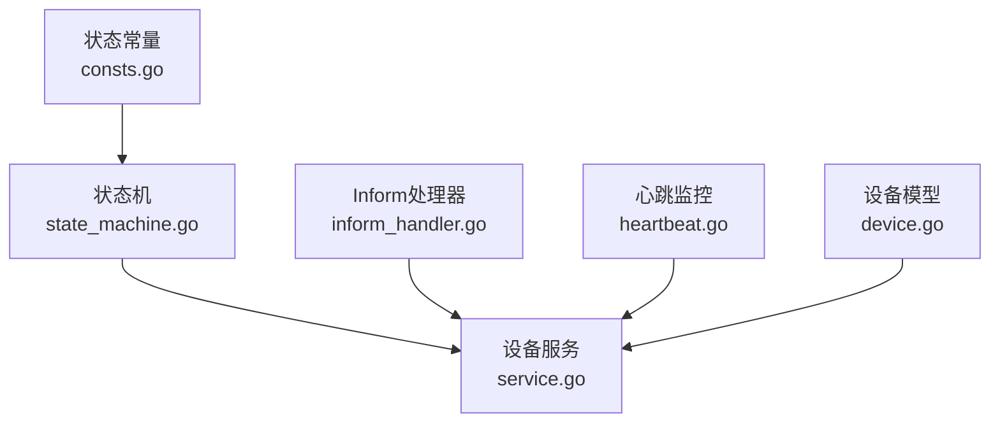
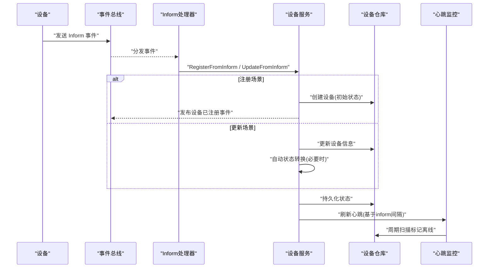
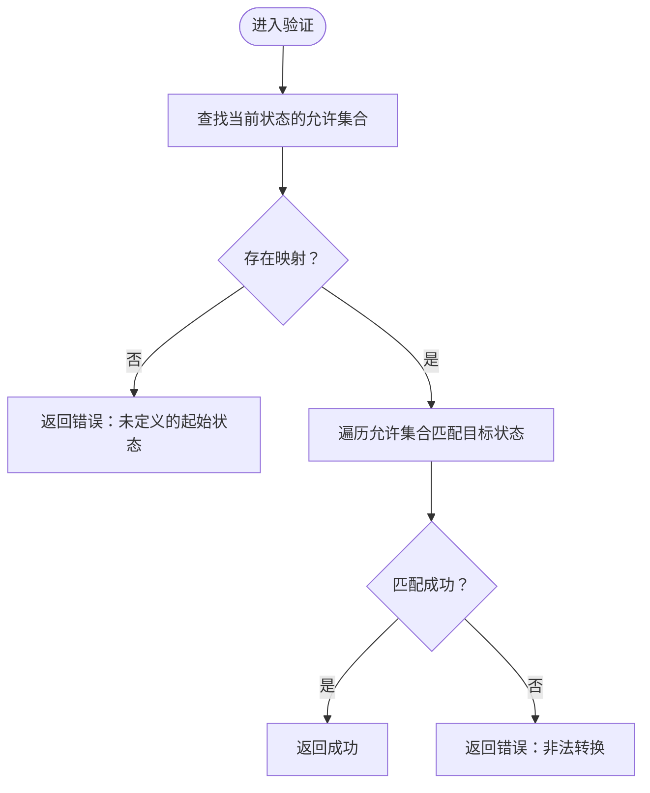
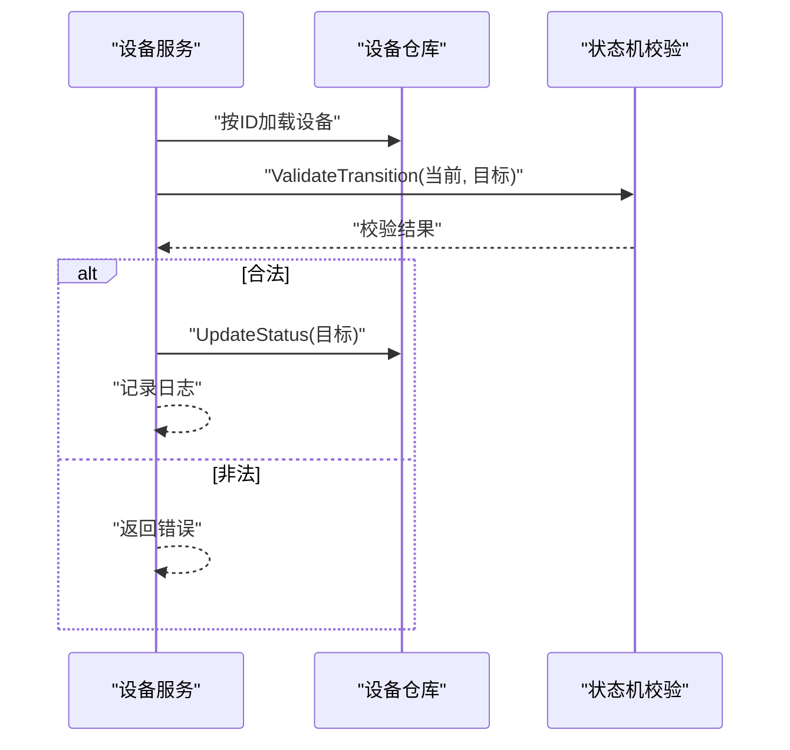
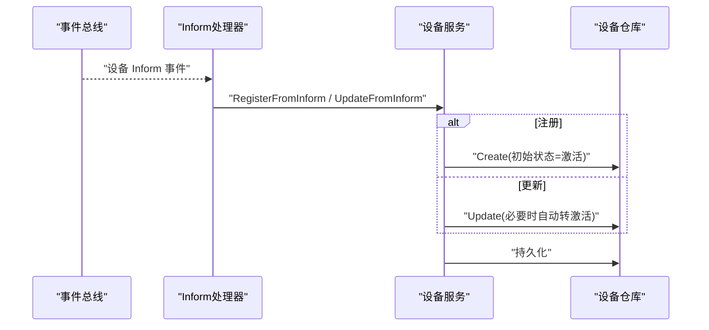
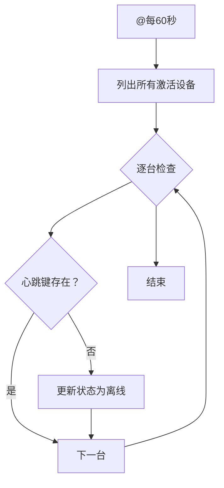
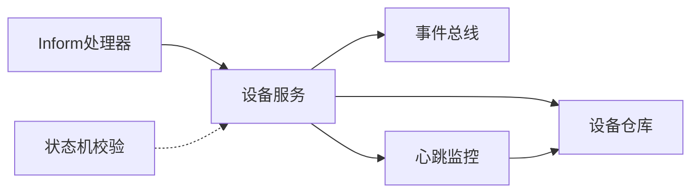

# 设备生命周期管理

<cite>
**本文引用的文件**
- [state_machine.go](file://omcgo/internal/device/state_machine.go)
- [state_machine_test.go](file://omcgo/internal/device/state_machine_test.go)
- [inform_handler.go](file://omcgo/internal/device/inform_handler.go)
- [service.go](file://omcgo/internal/device/service.go)
- [heartbeat.go](file://omcgo/internal/device/heartbeat.go)
- [consts.go](file://global/consts.go)
- [device.go](file://omcgo/internal/core/model/device.go)
</cite>

## 目录
1. [简介](#简介)
2. [项目结构](#项目结构)
3. [核心组件](#核心组件)
4. [架构总览](#架构总览)
5. [详细组件分析](#详细组件分析)
6. [依赖分析](#依赖分析)
7. [性能考虑](#性能考虑)
8. [故障排查指南](#故障排查指南)
9. [结论](#结论)
10. [附录](#附录)

## 简介
本文件面向设备生命周期管理场景，系统性阐述设备状态机的设计原理、状态转换规则、自动与手动转换机制、状态转换验证逻辑以及事件通知流程。重点覆盖以下状态：设备发现（Discovered）、设备注册（Registered）、设备激活（Active）、设备离线（Offline），并补充维护（Maintenance）与退役（Decommissioned）等状态。文档提供状态转换规则表、时序图与类图，帮助开发者快速理解并正确实现设备生命周期管理。

## 项目结构
与设备生命周期管理直接相关的关键文件分布如下：
- 状态机与验证：omcgo/internal/device/state_machine.go、omcgo/internal/device/state_machine_test.go
- 设备服务与状态转换：omcgo/internal/device/service.go
- Inform事件处理与自动状态转换：omcgo/internal/device/inform_handler.go
- 心跳检测与离线判定：omcgo/internal/device/heartbeat.go
- 状态枚举与设备模型：global/consts.go、omcgo/internal/core/model/device.go

图表来源
- [state_machine.go:1-32](file://omcgo/internal/device/state_machine.go#L1-L32)
- [service.go:16-40](file://omcgo/internal/device/service.go#L16-L40)
- [inform_handler.go:24-44](file://omcgo/internal/device/inform_handler.go#L24-L44)
- [heartbeat.go:18-32](file://omcgo/internal/device/heartbeat.go#L18-L32)
- [consts.go:43-54](file://global/consts.go#L43-L54)
- [device.go:9-35](file://omcgo/internal/core/model/device.go#L9-L35)

章节来源
- [state_machine.go:1-32](file://omcgo/internal/device/state_machine.go#L1-L32)
- [service.go:16-40](file://omcgo/internal/device/service.go#L16-L40)
- [inform_handler.go:24-44](file://omcgo/internal/device/inform_handler.go#L24-L44)
- [heartbeat.go:18-32](file://omcgo/internal/device/heartbeat.go#L18-L32)
- [consts.go:43-54](file://global/consts.go#L43-L54)
- [device.go:9-35](file://omcgo/internal/core/model/device.go#L9-L35)

## 核心组件
- 状态机与验证
  - 通过映射表定义允许的设备状态转换，提供 ValidateTransition 校验函数，确保状态变更合法。
- 设备服务
  - 提供注册、更新、状态转换、参数存储、事件发布等能力；在 Inform 更新时执行自动状态转换。
- Inform处理器
  - 订阅设备 Inform 事件，调用服务进行注册或更新，并解析载荷。
- 心跳监控
  - 基于 Redis TTL 维护设备心跳，周期扫描标记离线设备。
- 状态与模型
  - 定义设备状态枚举与设备实体字段，包含状态字段与时间戳等。

章节来源
- [state_machine.go:9-31](file://omcgo/internal/device/state_machine.go#L9-L31)
- [service.go:204-229](file://omcgo/internal/device/service.go#L204-L229)
- [inform_handler.go:46-67](file://omcgo/internal/device/inform_handler.go#L46-L67)
- [heartbeat.go:34-115](file://omcgo/internal/device/heartbeat.go#L34-L115)
- [consts.go:43-54](file://global/consts.go#L43-L54)
- [device.go:9-35](file://omcgo/internal/core/model/device.go#L9-L35)

## 架构总览
设备生命周期管理由“事件驱动 + 状态机校验 + 自动/手动转换”构成的闭环：
- 事件来源：设备通过 TR-069 Inform 上报（引导/周期）
- 处理路径：InformHandler 解析事件 -> DeviceService 执行注册/更新 -> 自动状态转换 -> 心跳监控判定离线
- 管控入口：管理员可通过 API 或业务流程触发手动状态转换
- 通知机制：设备注册完成后发布事件，便于其他模块订阅

图表来源
- [inform_handler.go:46-175](file://omcgo/internal/device/inform_handler.go#L46-L175)
- [service.go:42-202](file://omcgo/internal/device/service.go#L42-L202)
- [heartbeat.go:34-115](file://omcgo/internal/device/heartbeat.go#L34-L115)

## 详细组件分析

### 状态机与状态转换规则
- 状态定义
  - Discovered（发现）、Registered（注册）、Provisioning（配置中）、Active（激活）、Maintenance（维护）、Offline（离线）、Decommissioned（退役）
- 合法转换矩阵
  - 发现 -> 注册、激活
  - 注册 -> 配置中、激活
  - 配置中 -> 激活、注册
  - 激活 -> 维护、离线、退役
  - 维护 -> 激活、退役
  - 离线 -> 激活、退役
  - 退役 -> 无出边（终止态）
- 验证逻辑
  - ValidateTransition 依据映射表判断当前状态是否允许目标状态；若不存在映射或目标不在允许集合内则返回错误

图表来源
- [state_machine.go:19-31](file://omcgo/internal/device/state_machine.go#L19-L31)

章节来源
- [state_machine.go:9-31](file://omcgo/internal/device/state_machine.go#L9-L31)
- [state_machine_test.go:15-113](file://omcgo/internal/device/state_machine_test.go#L15-L113)
- [consts.go:46-53](file://global/consts.go#L46-L53)

### 设备服务中的状态转换
- 手动转换
  - TransitionStatus 获取设备、调用 ValidateTransition 校验、写入新状态并记录日志
- 自动转换
  - UpdateFromInform 在设备处于“发现/离线/注册”且收到 Inform 时，自动转为“激活”
- 参数存储与心跳刷新
  - 更新后批量写入参数快照，刷新心跳键以延长存活窗口

图表来源
- [service.go:204-229](file://omcgo/internal/device/service.go#L204-L229)
- [state_machine.go:19-31](file://omcgo/internal/device/state_machine.go#L19-L31)

章节来源
- [service.go:204-229](file://omcgo/internal/device/service.go#L204-L229)
- [service.go:132-202](file://omcgo/internal/device/service.go#L132-L202)

### Inform事件处理与自动状态转换
- 事件订阅
  - 订阅引导、周期、参数变化三类 Inform 事件，分别路由到注册或更新流程
- 引导注册
  - 若设备不存在则创建并设置初始状态为“激活”，同时存储参数、刷新心跳、发布注册事件
- 周期更新
  - 若设备存在则更新字段，必要时自动转为“激活”，并刷新心跳
- 载荷解析
  - 将事件载荷转换为 InformMessage 结构，便于后续处理

图表来源
- [inform_handler.go:46-175](file://omcgo/internal/device/inform_handler.go#L46-L175)
- [service.go:42-202](file://omcgo/internal/device/service.go#L42-L202)

章节来源
- [inform_handler.go:46-175](file://omcgo/internal/device/inform_handler.go#L46-L175)
- [service.go:42-202](file://omcgo/internal/device/service.go#L42-L202)

### 心跳监控与离线判定
- 心跳刷新
  - 根据设备 Inform 间隔计算 TTL，最小保护阈值，写入 Redis 键
- 离线扫描
  - 周期列出所有“激活”设备，检查心跳键是否存在；不存在则标记为“离线”
- 自动转换
  - “激活”设备若失去心跳将被标记为“离线”，等待后续恢复或人工干预

图表来源
- [heartbeat.go:34-115](file://omcgo/internal/device/heartbeat.go#L34-L115)

章节来源
- [heartbeat.go:34-115](file://omcgo/internal/device/heartbeat.go#L34-L115)

### 设备模型与状态字段
- 设备实体包含状态字段 Status，用于持久化当前生命周期状态
- 其他关键字段：序列号、厂商、产品类、固件版本、IP地址、最后 Inform 时间、心跳间隔、站点信息等

章节来源
- [device.go:9-35](file://omcgo/internal/core/model/device.go#L9-L35)

## 依赖分析
- 组件耦合
  - InformHandler 依赖 DeviceService 与事件总线；DeviceService 依赖仓库、事件总线与心跳监控；HeartbeatMonitor 依赖 Redis 与仓库
- 关键依赖链
  - InformHandler -> DeviceService -> 仓库/事件总线/心跳
  - HeartbeatMonitor -> 仓库
- 状态机独立性
  - ValidateTransition 仅依赖状态枚举与映射表，低耦合、可复用

图表来源
- [inform_handler.go:24-44](file://omcgo/internal/device/inform_handler.go#L24-L44)
- [service.go:16-40](file://omcgo/internal/device/service.go#L16-L40)
- [heartbeat.go:18-32](file://omcgo/internal/device/heartbeat.go#L18-L32)
- [state_machine.go:19-31](file://omcgo/internal/device/state_machine.go#L19-L31)

章节来源
- [inform_handler.go:24-44](file://omcgo/internal/device/inform_handler.go#L24-L44)
- [service.go:16-40](file://omcgo/internal/device/service.go#L16-L40)
- [heartbeat.go:18-32](file://omcgo/internal/device/heartbeat.go#L18-L32)
- [state_machine.go:19-31](file://omcgo/internal/device/state_machine.go#L19-L31)

## 性能考虑
- 心跳扫描批处理
  - HeartbeatMonitor 使用分页列举“激活”设备，避免一次性加载过多数据
- 心跳键 TTL 与最小保护
  - TTL 至少为固定阈值，防止过短导致频繁离线误判
- Inform 参数批量写入
  - 参数更新采用批量 Upsert，减少数据库往返次数
- 状态转换校验开销
  - 映射表查找为 O(n) 匹配，n 通常较小（状态数有限），开销可忽略

## 故障排查指南
- 状态转换失败
  - 现象：调用 TransitionStatus 返回“非法转换”或“未定义的起始状态”
  - 排查：确认当前状态是否在映射表中，目标状态是否在允许集合内
- 设备未自动转为激活
  - 现象：设备 Inform 后仍为“发现/离线/注册”
  - 排查：检查 UpdateFromInform 的自动转换条件与日志；确认 Inform 是否到达服务
- 设备被误标记为离线
  - 现象：设备在线但状态变为“离线”
  - 排查：检查心跳键是否存在、TTL 是否过期、心跳刷新是否正常；核对 Inform 间隔与最小保护阈值
- 注册事件未发布
  - 现象：设备已注册但无“已注册”事件
  - 排查：确认事件总线可用、发布流程未被吞错、日志中是否有错误

章节来源
- [state_machine.go:19-31](file://omcgo/internal/device/state_machine.go#L19-L31)
- [service.go:132-202](file://omcgo/internal/device/service.go#L132-L202)
- [heartbeat.go:66-115](file://omcgo/internal/device/heartbeat.go#L66-L115)
- [service.go:281-301](file://omcgo/internal/device/service.go#L281-L301)

## 结论
该设备生命周期管理方案以状态机为核心，结合 Inform 事件驱动的自动转换与心跳监控的离线判定，辅以手动转换接口与事件通知，形成完整的闭环。通过清晰的转换规则与严格的校验逻辑，保证了状态演进的可控性与一致性。建议在生产环境中持续监控心跳与转换日志，确保系统稳定运行。

## 附录

### 状态转换规则表
- 起始状态 -> 允许目标状态
  - 发现 -> 注册、激活
  - 注册 -> 配置中、激活
  - 配置中 -> 激活、注册
  - 激活 -> 维护、离线、退役
  - 维护 -> 激活、退役
  - 离线 -> 激活、退役
  - 退役 -> 无出边（终止态）

章节来源
- [state_machine.go:10-17](file://omcgo/internal/device/state_machine.go#L10-L17)
- [consts.go:46-53](file://global/consts.go#L46-L53)