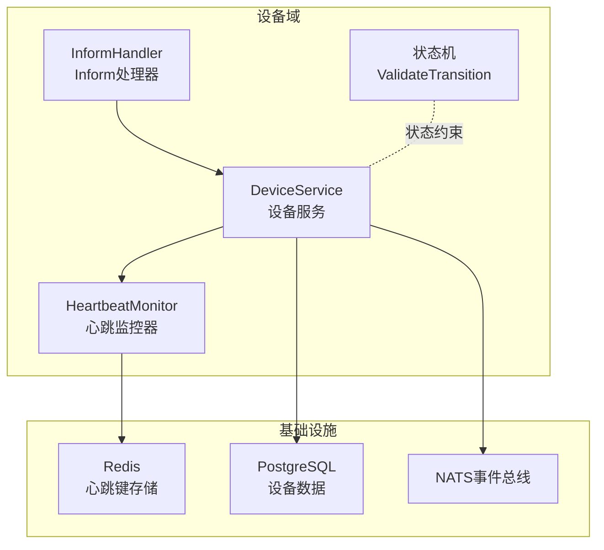
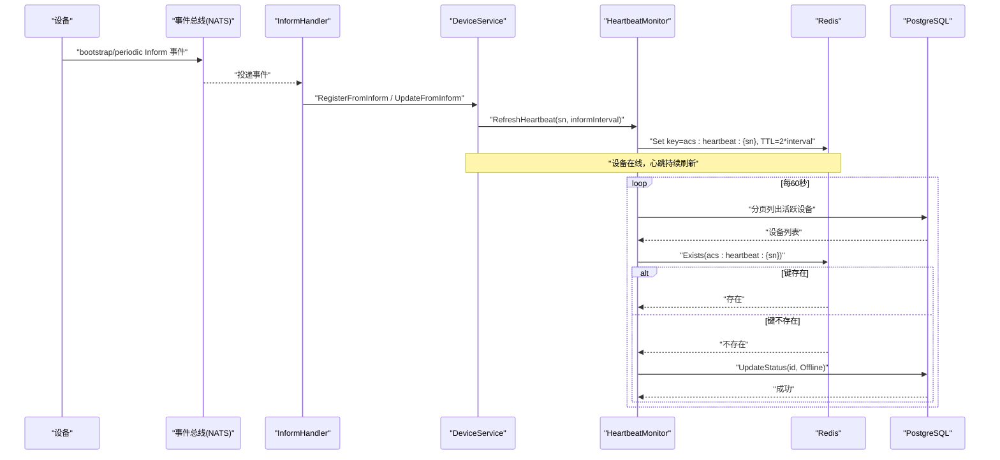
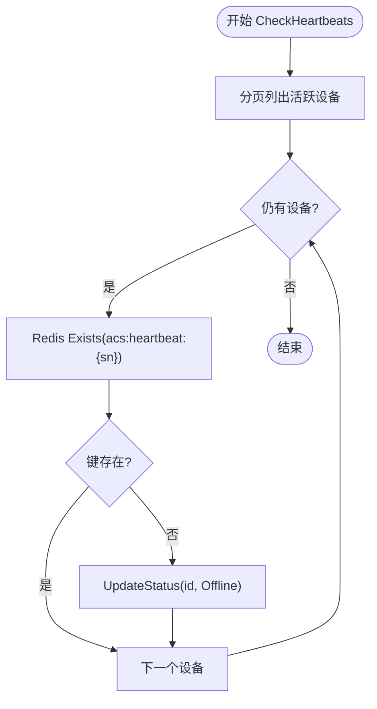
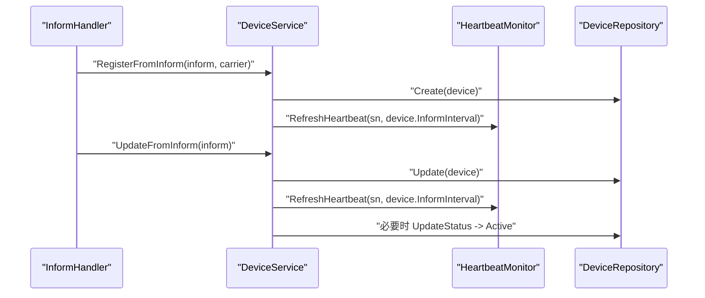
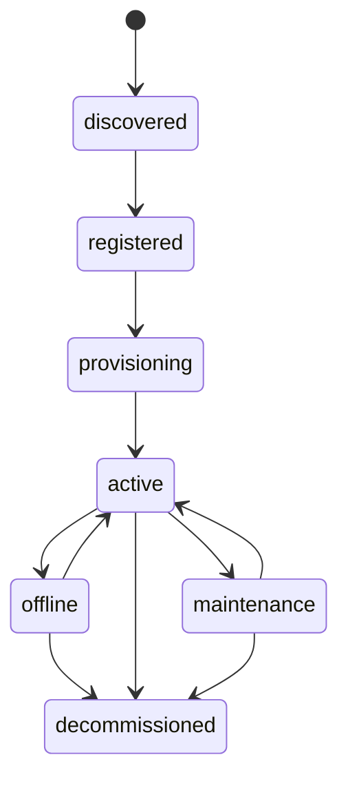
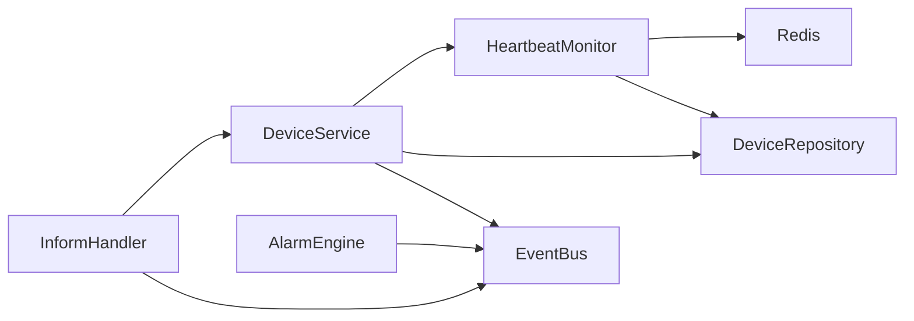

# 设备监控与心跳

<cite>
**本文引用的文件**
- [heartbeat.go](file://omcgo/internal/device/heartbeat.go)
- [heartbeat_test.go](file://omcgo/internal/device/heartbeat_test.go)
- [service.go](file://omcgo/internal/device/service.go)
- [inform_handler.go](file://omcgo/internal/device/inform_handler.go)
- [state_machine.go](file://omcgo/internal/device/state_machine.go)
- [09-device-management.md](file://omcgo/docs/detailed-design/09-device-management.md)
- [05-device-management.md](file://omcgo/docs/go-zero-design/05-device-management.md)
- [config.dev.yaml(acs)](file://omcgo/cmd/acs/etc/config.dev.yaml)
- [config.dev.yaml(app)](file://omcgo/cmd/app/etc/config.dev.yaml)
- [engine.go(告警引擎)](file://omcgo/internal/alarm/engine.go)
</cite>

## 目录
1. [简介](#简介)
2. [项目结构](#项目结构)
3. [核心组件](#核心组件)
4. [架构总览](#架构总览)
5. [详细组件分析](#详细组件分析)
6. [依赖分析](#依赖分析)
7. [性能考虑](#性能考虑)
8. [故障排查指南](#故障排查指南)
9. [结论](#结论)
10. [附录：配置与最佳实践](#附录配置与最佳实践)

## 简介
本文件聚焦于“设备监控与心跳”能力，系统性阐述心跳监控机制的设计原理与实现细节，包括心跳间隔配置、心跳超时检测、设备在线状态判断等核心功能；深入解析 HeartbeatMonitor 的实现逻辑（心跳刷新机制、超时检测算法、设备状态自动更新）；明确设备在线状态的判定规则（心跳丢失处理、状态回退机制、异常设备处理策略）；说明心跳监控与设备服务、告警系统、性能监控等模块的集成方式；并提供心跳配置的最佳实践与使用示例路径。

## 项目结构
与心跳监控直接相关的代码主要位于 omcgo/internal/device 目录，文档与设计说明位于 docs/detailed-design 与 docs/go-zero-design 中，配置样例位于 cmd/*/etc/config.dev.yaml。

图表来源
- [heartbeat.go:18-51](file://omcgo/internal/device/heartbeat.go#L18-L51)
- [service.go:16-40](file://omcgo/internal/device/service.go#L16-L40)
- [inform_handler.go:24-44](file://omcgo/internal/device/inform_handler.go#L24-L44)
- [state_machine.go:9-31](file://omcgo/internal/device/state_machine.go#L9-L31)

章节来源
- [heartbeat.go:1-120](file://omcgo/internal/device/heartbeat.go#L1-L120)
- [service.go:1-417](file://omcgo/internal/device/service.go#L1-L417)
- [inform_handler.go:1-175](file://omcgo/internal/device/inform_handler.go#L1-L175)
- [state_machine.go:1-32](file://omcgo/internal/device/state_machine.go#L1-L32)
- [09-device-management.md:191-247](file://omcgo/docs/detailed-design/09-device-management.md#L191-L247)
- [config.dev.yaml(acs):29-38](file://omcgo/cmd/acs/etc/config.dev.yaml#L29-L38)
- [config.dev.yaml(app):33-43](file://omcgo/cmd/app/etc/config.dev.yaml#L33-L43)

## 核心组件
- HeartbeatMonitor：基于 Redis TTL 的轻量级心跳监控器，周期扫描活跃设备，检测心跳键是否存在，决定是否标记离线。
- DeviceService：设备业务服务，负责从 Inform 事件中创建/更新设备，并在注册与周期 Inform 时刷新心跳。
- InformHandler：订阅设备 Inform 事件，桥接事件总线与 DeviceService。
- 状态机：定义设备状态合法转换，确保状态变更符合业务规则。
- 文档与设计：明确心跳键结构、设备状态机与 Inform 流程。

章节来源
- [heartbeat.go:16-51](file://omcgo/internal/device/heartbeat.go#L16-L51)
- [service.go:16-40](file://omcgo/internal/device/service.go#L16-L40)
- [inform_handler.go:23-44](file://omcgo/internal/device/inform_handler.go#L23-L44)
- [state_machine.go:9-31](file://omcgo/internal/device/state_machine.go#L9-L31)
- [09-device-management.md:191-247](file://omcgo/docs/detailed-design/09-device-management.md#L191-L247)

## 架构总览
心跳监控以“事件驱动 + 定时扫描”的方式运行：设备通过 Inform 事件上报，服务层在注册与周期 Inform 时刷新心跳键；后台定时器周期扫描活跃设备，若心跳键缺失则将设备标记为离线。

图表来源
- [inform_handler.go:69-150](file://omcgo/internal/device/inform_handler.go#L69-L150)
- [service.go:42-202](file://omcgo/internal/device/service.go#L42-L202)
- [heartbeat.go:34-115](file://omcgo/internal/device/heartbeat.go#L34-L115)

## 详细组件分析

### HeartbeatMonitor 组件
- 职责
  - 启动/停止定时任务（默认每60秒执行一次心跳检查）。
  - 刷新心跳：根据设备 Inform 间隔计算 TTL=2×informInterval，最小 TTL 限制为10分钟。
  - 检测超时：遍历活跃设备，检查心跳键是否存在，不存在则标记为离线。
- 关键点
  - 心跳键命名空间：acs:heartbeat:{serial}
  - 最小 TTL 保护：避免过短 TTL 导致频繁过期
  - 分页扫描：避免一次性拉取过多活跃设备
  - 错误处理：对仓库查询失败与 Redis 访问失败进行日志记录与容错

图表来源
- [heartbeat.go:66-115](file://omcgo/internal/device/heartbeat.go#L66-L115)

章节来源
- [heartbeat.go:16-119](file://omcgo/internal/device/heartbeat.go#L16-L119)
- [heartbeat_test.go:104-212](file://omcgo/internal/device/heartbeat_test.go#L104-L212)

### 设备服务与 Inform 集成
- 注册流程：首次收到 Bootstrap Inform 时创建设备并刷新心跳。
- 周期流程：后续周期 Inform 时更新设备状态与参数，并刷新心跳。
- 自动状态迁移：当设备处于 discovered/registered/offline 等状态且收到 Inform 时，自动迁移到 active。

图表来源
- [inform_handler.go:69-150](file://omcgo/internal/device/inform_handler.go#L69-L150)
- [service.go:42-202](file://omcgo/internal/device/service.go#L42-L202)

章节来源
- [service.go:42-202](file://omcgo/internal/device/service.go#L42-L202)
- [inform_handler.go:69-150](file://omcgo/internal/device/inform_handler.go#L69-L150)

### 设备状态机与离线回退
- 状态定义与合法转换由状态机约束，确保状态变迁符合业务规则。
- 离线状态可通过恢复心跳自动回到 active；维护/退网等状态为终态或需要人工干预。

图表来源
- [state_machine.go:9-31](file://omcgo/internal/device/state_machine.go#L9-L31)
- [05-device-management.md:310-348](file://omcgo/docs/go-zero-design/05-device-management.md#L310-L348)

章节来源
- [state_machine.go:9-31](file://omcgo/internal/device/state_machine.go#L9-L31)
- [05-device-management.md:310-379](file://omcgo/docs/go-zero-design/05-device-management.md#L310-L379)

## 依赖分析
- HeartbeatMonitor 依赖
  - Redis：心跳键的存取与 TTL 控制
  - 设备仓库：分页查询活跃设备与更新状态
  - 日志：错误与关键事件记录
- DeviceService 依赖
  - HeartbeatMonitor：刷新心跳
  - 设备仓库：创建/更新/查询/计数
  - 事件总线：发布设备事件
- InformHandler 依赖
  - 事件总线：订阅设备 Inform 事件
  - 运营商注册表：根据 OUI 解析运营商
- 告警系统
  - 通过事件总线与告警引擎协作，实现异常设备的告警联动

图表来源
- [heartbeat.go:18-32](file://omcgo/internal/device/heartbeat.go#L18-L32)
- [service.go:16-40](file://omcgo/internal/device/service.go#L16-L40)
- [inform_handler.go:24-44](file://omcgo/internal/device/inform_handler.go#L24-L44)
- [engine.go(告警引擎):15-39](file://omcgo/internal/alarm/engine.go#L15-L39)

章节来源
- [heartbeat.go:1-120](file://omcgo/internal/device/heartbeat.go#L1-L120)
- [service.go:1-417](file://omcgo/internal/device/service.go#L1-L417)
- [inform_handler.go:1-175](file://omcgo/internal/device/inform_handler.go#L1-L175)
- [engine.go(告警引擎):1-200](file://omcgo/internal/alarm/engine.go#L1-L200)

## 性能考虑
- 心跳键 TTL 设计
  - TTL=2×informInterval，最小保护为10分钟，避免频繁过期与抖动
- 扫描策略
  - 分页扫描活跃设备，避免一次性加载过多数据
  - 每60秒执行一次检查，平衡实时性与资源消耗
- Redis 与数据库
  - Redis 仅做键存在性检查与 TTL 管理，读写压力低
  - 设备仓库查询采用分页与过滤，减少内存占用
- 并发与超时
  - 定时任务内部使用上下文超时，防止长时间阻塞

章节来源
- [heartbeat.go:34-115](file://omcgo/internal/device/heartbeat.go#L34-L115)

## 故障排查指南
- 现象：设备长时间显示离线但心跳键仍存在
  - 检查 Redis 连接与可用性
  - 确认设备是否仍在发送 Inform 事件
- 现象：心跳检查未触发或报错
  - 确认 HeartbeatMonitor 已启动，定时任务已加入
  - 查看日志中的“list active devices for heartbeat check”与“check heartbeat key”错误
- 现象：设备状态未从离线恢复
  - 确认设备再次发送 Inform 事件，服务层会自动迁移到 active
  - 检查状态机约束，确认当前状态允许迁移到 active
- 现象：心跳 TTL 异常
  - 检查 informInterval 是否合理，最小 TTL 为10分钟

章节来源
- [heartbeat.go:34-115](file://omcgo/internal/device/heartbeat.go#L34-L115)
- [heartbeat_test.go:104-212](file://omcgo/internal/device/heartbeat_test.go#L104-L212)
- [service.go:132-202](file://omcgo/internal/device/service.go#L132-L202)

## 结论
心跳监控通过“事件驱动刷新 + 定时扫描检测”的双轨机制，实现了对设备在线状态的可靠判定。结合设备状态机与 Inform 流程，系统能够在设备恢复通信后自动回到在线状态，同时具备良好的扩展性与可观测性。通过合理的 TTL 与扫描策略，系统在准确性与性能之间取得平衡。

## 附录：配置与最佳实践

### 心跳键与 TTL 设计
- Redis 键结构：acs:heartbeat:{device_serial}
- TTL 计算：TTL = 2 × inform_interval；最小 TTL 为 600 秒（10 分钟）

章节来源
- [09-device-management.md:191-196](file://omcgo/docs/detailed-design/09-device-management.md#L191-L196)
- [heartbeat.go:53-64](file://omcgo/internal/device/heartbeat.go#L53-L64)

### 心跳间隔与超时阈值建议
- 心跳间隔（inform_interval）
  - 建议与设备端 Inform 间隔保持一致或略大，以覆盖网络抖动
  - 若设备端无法稳定上报，可适当增大 inform_interval，从而延长 TTL
- 超时阈值
  - 默认每 60 秒检查一次，建议保持不变以兼顾实时性与资源消耗
  - 如需更敏感的离线检测，可缩短检查周期，但需评估数据库与 Redis 压力

章节来源
- [heartbeat.go:34-44](file://omcgo/internal/device/heartbeat.go#L34-L44)
- [heartbeat.go:66-115](file://omcgo/internal/device/heartbeat.go#L66-L115)

### 与设备服务的协作
- 注册阶段：RegisterFromInform 成功后立即刷新心跳
- 周期阶段：UpdateFromInform 成功后刷新心跳
- 状态迁移：收到 Inform 时自动迁移到 active（若当前状态允许）

章节来源
- [service.go:42-202](file://omcgo/internal/device/service.go#L42-L202)

### 与告警系统的联动
- 告警引擎通过事件总线接收告警事件，心跳导致的设备离线可作为触发条件之一
- 建议在设备离线时发布相应事件，以便告警引擎进行规则匹配与告警生成

章节来源
- [engine.go(告警引擎):41-134](file://omcgo/internal/alarm/engine.go#L41-L134)

### 与性能监控的配合
- Redis 与数据库的健康检查与指标采集应纳入统一监控体系
- 心跳检查的耗时与错误率可作为关键指标

章节来源
- [config.dev.yaml(acs):49-55](file://omcgo/cmd/acs/etc/config.dev.yaml#L49-L55)
- [config.dev.yaml(app):76-82](file://omcgo/cmd/app/etc/config.dev.yaml#L76-L82)

### 配置示例路径
- Redis 连接配置（心跳与告警均依赖）
  - [config.dev.yaml(acs):29-38](file://omcgo/cmd/acs/etc/config.dev.yaml#L29-L38)
  - [config.dev.yaml(app):33-43](file://omcgo/cmd/app/etc/config.dev.yaml#L33-L43)
- 心跳监控启动与检查周期
  - [heartbeat.go:34-44](file://omcgo/internal/device/heartbeat.go#L34-L44)
- Inform 事件订阅与处理
  - [inform_handler.go:46-67](file://omcgo/internal/device/inform_handler.go#L46-L67)