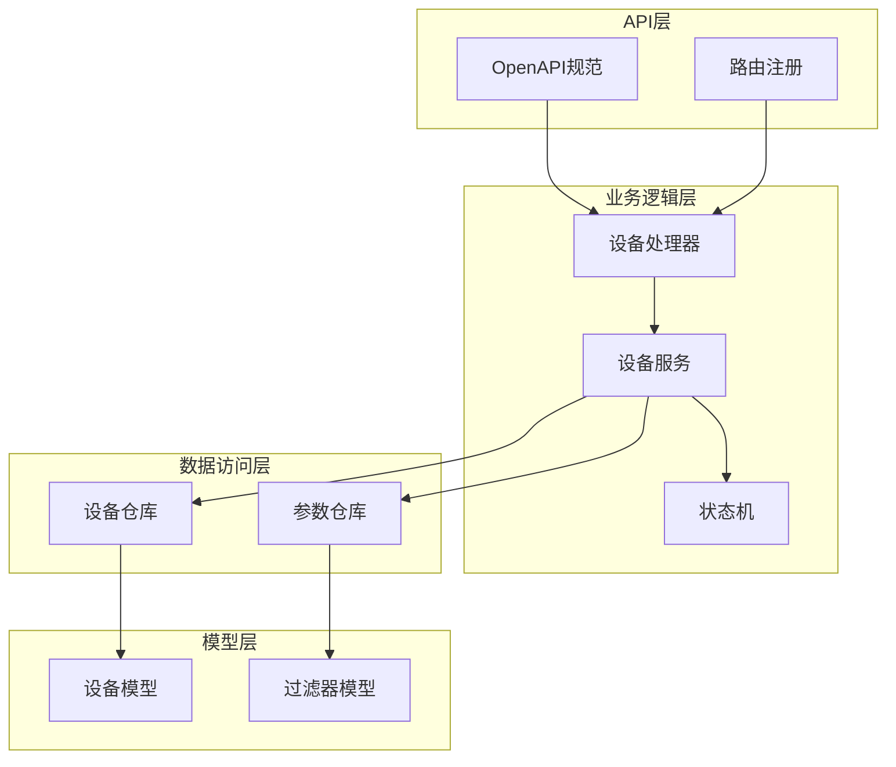
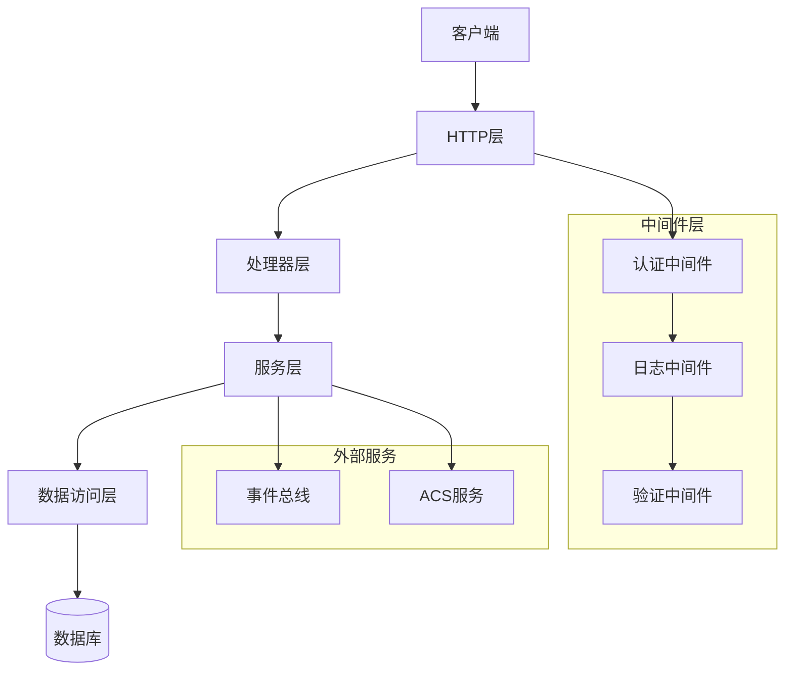
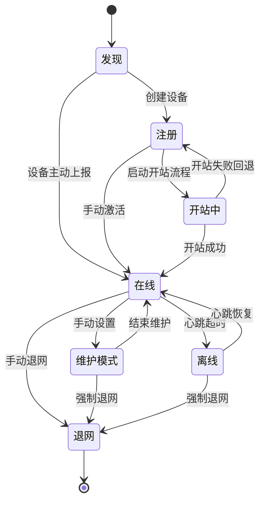
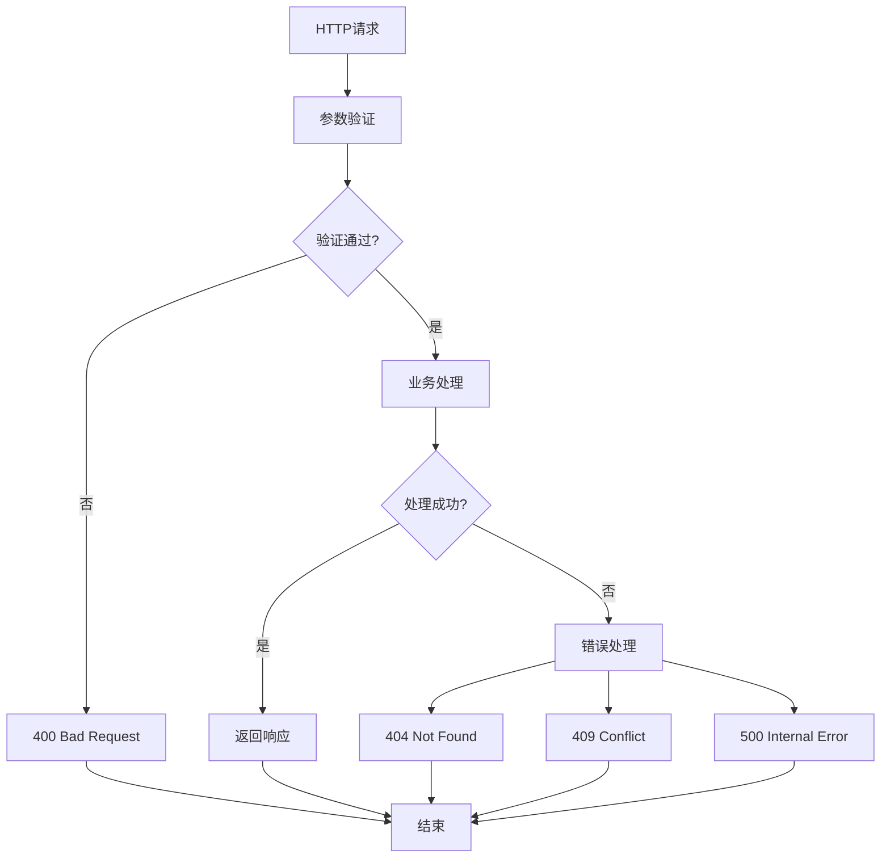
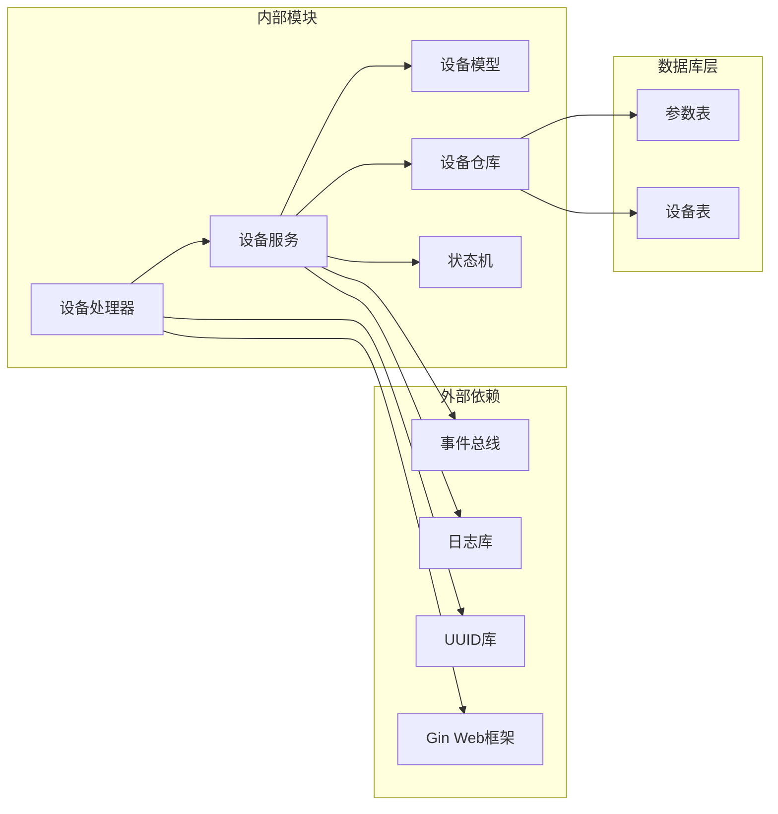

# 设备管理API接口

<cite>
**本文档引用的文件**
- [openapi.yaml](file://omcgo/api/openapi/openapi.yaml)
- [handler.go](file://omcgo/internal/device/handler.go)
- [service.go](file://omcgo/internal/device/service.go)
- [repository.go](file://omcgo/internal/device/repository.go)
- [state_machine.go](file://omcgo/internal/device/state_machine.go)
- [device.go](file://omcgo/internal/core/model/device.go)
</cite>

## 目录
1. [简介](#简介)
2. [项目结构](#项目结构)
3. [核心组件](#核心组件)
4. [架构概览](#架构概览)
5. [详细组件分析](#详细组件分析)
6. [依赖关系分析](#依赖关系分析)
7. [性能考虑](#性能考虑)
8. [故障排除指南](#故障排除指南)
9. [结论](#结论)

## 简介

设备管理API接口是OMC（操作维护中心）系统的核心组件之一，负责管理网络设备的全生命周期。该API提供了完整的REST接口，支持设备的创建、查询、更新、删除以及状态管理等功能。

本系统基于GoZero框架构建，采用分层架构设计，包括HTTP路由层、业务逻辑层、数据访问层和外部服务集成层。API接口遵循RESTful设计原则，使用JSON格式进行数据交换，并通过Bearer Token进行身份认证。

## 项目结构

设备管理API在项目中的组织结构如下：



**图表来源**
- [handler.go:23-35](file://omcgo/internal/device/handler.go#L23-L35)
- [service.go:16-40](file://omcgo/internal/device/service.go#L16-L40)
- [repository.go:22-33](file://omcgo/internal/device/repository.go#L22-L33)

**章节来源**
- [handler.go:12-35](file://omcgo/internal/device/handler.go#L12-L35)
- [service.go:16-40](file://omcgo/internal/device/service.go#L16-L40)

## 核心组件

### 设备处理器（Handler）

设备处理器负责处理HTTP请求和响应，提供RESTful API接口。它实现了以下核心功能：

- **路由注册**：注册所有设备相关的HTTP路由
- **请求验证**：验证输入参数的格式和有效性
- **响应处理**：格式化API响应数据
- **错误处理**：统一处理各种异常情况

### 设备服务（Service）

设备服务封装了业务逻辑，提供设备管理的核心功能：

- **设备生命周期管理**：创建、更新、删除设备
- **状态转换控制**：验证和执行设备状态转换
- **数据持久化**：与数据库交互存储设备信息
- **事件发布**：发布设备相关的业务事件

### 设备仓库（Repository）

设备仓库定义了数据访问接口，负责与数据库的交互：

- **CRUD操作**：提供设备的基本增删改查功能
- **查询过滤**：支持复杂的查询条件和过滤
- **聚合统计**：提供设备状态统计和计数功能

**章节来源**
- [handler.go:12-20](file://omcgo/internal/device/handler.go#L12-L20)
- [service.go:16-40](file://omcgo/internal/device/service.go#L16-L40)
- [repository.go:22-33](file://omcgo/internal/device/repository.go#L22-L33)

## 架构概览

设备管理API采用分层架构设计，确保关注点分离和代码的可维护性：



**图表来源**
- [handler.go:23-35](file://omcgo/internal/device/handler.go#L23-L35)
- [service.go:17-40](file://omcgo/internal/device/service.go#L17-L40)

## 详细组件分析

### 设备管理API接口

#### 设备创建接口

**接口定义**
- **方法**：POST
- **路径**：`/api/v1/devices`
- **功能**：创建新的网络设备记录

**请求参数**
- `serial_number` (string, 必填)：设备序列号
- `oui` (string, 必填)：厂商识别码
- `product_class` (string, 可选)：产品类别
- `manufacturer` (string, 可选)：制造商名称
- `model_name` (string, 可选)：设备型号
- `carrier` (string, 必填)：运营商代码
- `technology` (string, 必填)：技术类型
- `site_name` (string, 可选)：站点名称
- `site_id` (string, 可选)：站点ID
- `latitude` (number, 可选)：纬度坐标
- `longitude` (number, 可选)：经度坐标

**响应数据结构**
```json
{
  "id": "string(uuid)",
  "serial_number": "string",
  "oui": "string",
  "product_class": "string",
  "manufacturer": "string",
  "model_name": "string",
  "carrier": "string",
  "technology": "string",
  "status": "string",
  "firmware_version": "string",
  "ip_address": "string",
  "connection_request_url": "string",
  "last_inform_at": "datetime",
  "last_inform_events": ["string"],
  "inform_interval": "integer",
  "site_name": "string",
  "site_id": "string",
  "latitude": "number",
  "longitude": "number",
  "extension_data": {},
  "created_at": "datetime",
  "updated_at": "datetime"
}
```

**HTTP状态码**
- 201：设备创建成功
- 400：请求参数无效
- 401：未授权访问
- 409：设备已存在
- 500：服务器内部错误

**章节来源**
- [openapi.yaml:158-221](file://omcgo/api/openapi/openapi.yaml#L158-L221)
- [handler.go:62-81](file://omcgo/internal/device/handler.go#L62-L81)
- [service.go:339-376](file://omcgo/internal/device/service.go#L339-L376)

#### 设备查询接口

**接口定义**
- **方法**：GET
- **路径**：`/api/v1/devices/{id}`
- **功能**：根据ID获取特定设备的详细信息

**路径参数**
- `id` (string, 必填)：设备唯一标识符（UUID格式）

**响应数据结构**
与设备创建接口相同

**HTTP状态码**
- 200：查询成功
- 401：未授权访问
- 404：设备不存在
- 500：服务器内部错误

**章节来源**
- [openapi.yaml:238-256](file://omcgo/api/openapi/openapi.yaml#L238-L256)
- [handler.go:168-187](file://omcgo/internal/device/handler.go#L168-L187)

#### 设备列表查询接口

**接口定义**
- **方法**：GET
- **路径**：`/api/v1/devices`
- **功能**：获取设备列表，支持分页、过滤和搜索

**查询参数**
- `page` (integer, 可选)：页码，默认值为1
- `page_size` (integer, 可选)：每页大小，默认值为20
- `carrier` (string, 可选)：运营商过滤
- `technology` (string, 可选)：技术类型过滤
- `status` (string, 可选)：设备状态过滤
- `oui` (string, 可选)：厂商识别码过滤
- `sn` (string, 可选)：序列号精确匹配
- `search` (string, 可选)：模糊搜索（支持序列号和站点名称）

**响应数据结构**
```json
{
  "items": [DEVICE_OBJECT],
  "total": "integer",
  "page": "integer",
  "page_size": "integer"
}
```

**HTTP状态码**
- 200：查询成功
- 401：未授权访问
- 500：服务器内部错误

**章节来源**
- [openapi.yaml:158-200](file://omcgo/api/openapi/openapi.yaml#L158-L200)
- [handler.go:126-166](file://omcgo/internal/device/handler.go#L126-L166)

#### 设备更新接口

**接口定义**
- **方法**：PUT
- **路径**：`/api/v1/devices/{id}`
- **功能**：更新现有设备的信息

**路径参数**
- `id` (string, 必填)：设备唯一标识符

**请求参数**
- `site_name` (string, 可选)：站点名称
- `site_id` (string, 可选)：站点ID
- `model_name` (string, 可选)：设备型号
- `latitude` (number, 可选)：纬度坐标
- `longitude` (number, 可选)：经度坐标
- `status` (string, 可选)：设备状态

**响应数据结构**
与设备创建接口相同

**HTTP状态码**
- 200：更新成功
- 400：请求参数无效
- 401：未授权访问
- 404：设备不存在
- 500：服务器内部错误

**章节来源**
- [openapi.yaml:256-281](file://omcgo/api/openapi/openapi.yaml#L256-L281)
- [handler.go:83-108](file://omcgo/internal/device/handler.go#L83-L108)

#### 设备删除接口

**接口定义**
- **方法**：DELETE
- **路径**：`/api/v1/devices/{id}`
- **功能**：删除指定的设备记录

**路径参数**
- `id` (string, 必填)：设备唯一标识符

**HTTP状态码**
- 204：删除成功
- 401：未授权访问
- 404：设备不存在
- 500：服务器内部错误

**章节来源**
- [openapi.yaml:281-294](file://omcgo/api/openapi/openapi.yaml#L281-L294)
- [handler.go:110-124](file://omcgo/internal/device/handler.go#L110-L124)

#### 设备参数查询接口

**接口定义**
- **方法**：GET
- **路径**：`/api/v1/devices/{id}/parameters`
- **功能**：获取设备的所有参数列表

**路径参数**
- `id` (string, 必填)：设备唯一标识符

**响应数据结构**
```json
{
  "items": [
    {
      "name": "string",
      "value": "string",
      "type": "string(enum)",
      "writable": "boolean"
    }
  ],
  "total": "integer"
}
```

**HTTP状态码**
- 200：查询成功
- 401：未授权访问
- 404：设备不存在
- 500：服务器内部错误

**章节来源**
- [openapi.yaml:295-315](file://omcgo/api/openapi/openapi.yaml#L295-L315)
- [handler.go:189-204](file://omcgo/internal/device/handler.go#L189-L204)

#### 设备重启接口

**接口定义**
- **方法**：POST
- **路径**：`/api/v1/devices/{id}/reboot`
- **功能**：向设备发送重启命令

**路径参数**
- `id` (string, 必填)：设备唯一标识符

**响应数据结构**
```json
{
  "message": "reboot command queued"
}
```

**HTTP状态码**
- 202：重启命令已接受
- 401：未授权访问
- 404：设备不存在
- 500：服务器内部错误

**章节来源**
- [openapi.yaml:316-330](file://omcgo/api/openapi/openapi.yaml#L316-L330)
- [handler.go:223-234](file://omcgo/internal/device/handler.go#L223-L234)

#### 设备统计查询接口

**接口定义**
- **方法**：GET
- **路径**：`/api/v1/devices/stats`
- **功能**：获取设备按状态分组的统计信息

**查询参数**
- `carrier` (string, 可选)：运营商过滤

**响应数据结构**
```json
{
  "counts": {
    "status_type": "integer"
  }
}
```

**HTTP状态码**
- 200：查询成功
- 401：未授权访问
- 500：服务器内部错误

**章节来源**
- [openapi.yaml:222-237](file://omcgo/api/openapi/openapi.yaml#L222-L237)
- [handler.go:206-221](file://omcgo/internal/device/handler.go#L206-L221)

### 设备状态管理

设备状态管理是设备生命周期的重要组成部分，系统实现了完整的状态机管理：



**图表来源**
- [state_machine.go:9-31](file://omcgo/internal/device/state_machine.go#L9-L31)

**状态转换规则**
- 发现状态只能转换为注册或在线状态
- 注册状态可以转换为开站中或在线状态
- 开站中状态可以转换为在线或注册状态（失败回退）
- 在线状态可以转换为维护模式、离线或退网状态
- 维护模式可以转换为在线或退网状态
- 离线状态可以转换为在线或退网状态
- 退网状态为终止状态，不可再转换

**章节来源**
- [state_machine.go:9-31](file://omcgo/internal/device/state_machine.go#L9-L31)

### 错误处理机制

系统实现了统一的错误处理机制：



**图表来源**
- [handler.go:65-78](file://omcgo/internal/device/handler.go#L65-L78)

**错误类型**
- **400 Bad Request**：请求参数格式错误
- **401 Unauthorized**：认证失败或令牌过期
- **404 Not Found**：设备不存在
- **409 Conflict**：设备已存在
- **500 Internal Server Error**：服务器内部错误

**章节来源**
- [handler.go:65-104](file://omcgo/internal/device/handler.go#L65-L104)

## 依赖关系分析

设备管理API的依赖关系如下：



**图表来源**
- [handler.go:3-10](file://omcgo/internal/device/handler.go#L3-L10)
- [service.go:3-14](file://omcgo/internal/device/service.go#L3-L14)

**依赖特点**
- **低耦合高内聚**：各层职责明确，依赖关系清晰
- **接口隔离**：通过接口定义实现模块间的解耦
- **可测试性**：依赖注入机制便于单元测试
- **扩展性**：插件化设计支持功能扩展

**章节来源**
- [handler.go:3-20](file://omcgo/internal/device/handler.go#L3-L20)
- [service.go:3-40](file://omcgo/internal/device/service.go#L3-L40)

## 性能考虑

### 查询优化

1. **索引策略**
   - 设备序列号建立唯一索引
   - 常用查询字段建立复合索引
   - 模糊查询避免在高频字段上使用

2. **分页机制**
   - 默认每页20条记录
   - 最大分页大小限制为100条
   - 使用游标分页减少偏移量查询

3. **缓存策略**
   - 设备基本信息缓存
   - 热点查询结果缓存
   - 缓存失效策略和一致性保证

### 并发处理

1. **请求限流**
   - 基于IP的请求频率限制
   - 用户级别的并发请求控制
   - 关键操作的互斥锁保护

2. **异步处理**
   - 大批量操作异步执行
   - 长时间运行的任务队列
   - 进度跟踪和状态查询

## 故障排除指南

### 常见问题诊断

**设备创建失败**
- 检查序列号是否重复
- 验证必填字段完整性
- 确认运营商和设备类型匹配

**设备查询超时**
- 检查数据库连接状态
- 分析慢查询日志
- 优化查询条件和索引

**状态转换异常**
- 验证当前状态是否允许转换
- 检查业务规则约束
- 查看状态转换历史记录

### 监控指标

**关键性能指标**
- API响应时间分布
- 请求成功率和错误率
- 数据库查询性能
- 内存和CPU使用率

**告警阈值**
- 响应时间超过5秒
- 错误率超过1%
- 数据库连接池耗尽
- 内存使用率超过80%

**章节来源**
- [handler.go:65-104](file://omcgo/internal/device/handler.go#L65-L104)
- [service.go:204-229](file://omcgo/internal/device/service.go#L204-L229)

## 结论

设备管理API接口设计合理，功能完整，具有良好的扩展性和可维护性。系统采用了现代化的架构设计，实现了清晰的关注点分离和职责划分。

**主要优势**
- 完整的设备生命周期管理
- 清晰的状态机设计
- 统一的错误处理机制
- 良好的性能和可扩展性
- 详细的API文档和示例

**改进建议**
- 增加更多的数据验证规则
- 优化复杂查询的性能
- 完善监控和告警机制
- 增强API版本管理能力

该API接口为网络设备管理提供了坚实的技术基础，能够满足现代通信网络的管理需求。