# 设备管理模块

<cite>
**本文档引用的文件**
- [inform_handler.go](file://omcgo/internal/device/inform_handler.go)
- [service.go](file://omcgo/internal/device/service.go)
- [state_machine.go](file://omcgo/internal/device/state_machine.go)
- [heartbeat.go](file://omcgo/internal/device/heartbeat.go)
- [repository.go](file://omcgo/internal/device/repository.go)
- [pg_repository.go](file://omcgo/internal/device/pg_repository.go)
- [param_repository.go](file://omcgo/internal/device/param_repository.go)
- [pg_param_repository.go](file://omcgo/internal/device/pg_param_repository.go)
- [handler.go](file://omcgo/internal/device/handler.go)
- [device.go](file://omcgo/internal/core/model/device.go)
- [09-device-management.md](file://omcgo/docs/detailed-design/09-device-management.md)
- [05-device-management.md](file://omcgo/docs/go-zero-design/05-device-management.md)
- [000001_create_devices.up.sql](file://omcgo/migrations/000001_create_devices.up.sql)
- [000002_create_device_parameters.up.sql](file://omcgo/migrations/000002_create_device_parameters.up.sql)
- [03-device-grouping.md](file://omcmb/design/04-modules/03-device-management/03-device-grouping.md)
- [01-device-list.md](file://omcmb/design/04-modules/03-device-management/01-device-list.md)
- [04-device-detail.md](file://omcmb/design/04-modules/03-device-management/04-device-detail.md)
- [index.tsx](file://omcmb/webcode/src/pages/device/DeviceGrouping/index.tsx)
- [useDevices.ts](file://omcmb/webcode/src/hooks/api/useDevices.ts)
- [device.ts](file://omcmb/webcode/src/types/device.ts)
</cite>

## 更新摘要
**所做更改**
- 新增设备分组界面重大UI改进章节，涵盖层次化树结构、抽屉式界面、设备名称过滤、TAC/LAC匹配等功能
- 更新设备管理API章节，增加设备分组相关接口和批量操作能力
- 新增设备分组状态机管理章节，详细说明设备安装状态跟踪机制
- 更新架构图和数据流图，反映新的设备分组工作流程
- 增加设备分组最佳实践和性能优化建议

## 目录
1. [简介](#简介)
2. [项目结构](#项目结构)
3. [核心组件](#核心组件)
4. [架构总览](#架构总览)
5. [详细组件分析](#详细组件分析)
6. [设备分组界面重大UI改进](#设备分组界面重大ui改进)
7. [设备分组状态机管理](#设备分组状态机管理)
8. [依赖分析](#依赖分析)
9. [性能考虑](#性能考虑)
10. [故障排查指南](#故障排查指南)
11. [结论](#结论)
12. [附录](#附录)

## 简介
本文件面向设备管理模块，围绕以下目标展开：设备注册流程（从TR069 Inform消息到数据库创建）、设备状态机管理（生命周期状态转换）、设备参数存储与同步机制、心跳监控与在线状态检测；同时覆盖设备服务的核心API接口（创建、更新、删除、查询等），并解释状态转换验证逻辑、设备信息提取算法、参数批量存储机制。文档还提供最佳实践、性能优化建议与常见问题解决方案，并给出具体API使用示例的代码路径。

**更新** 新增设备分组界面重大UI改进，包括层次化树结构、抽屉式界面、设备名称过滤、TAC/LAC匹配等功能，以及安装状态跟踪和批量操作能力。

## 项目结构
设备管理模块位于 omcgo/internal/device，主要由以下层次构成：
- 接口层：REST API处理器，定义HTTP路由与请求/响应结构
- 业务层：设备服务，封装设备生命周期、状态机、参数存储、心跳刷新等核心逻辑
- 事件层：Inform事件订阅器，将TR069事件转换为设备服务调用
- 数据访问层：设备与参数的Repository接口及PostgreSQL实现
- 模型层：设备与参数的数据模型
- 文档与迁移：详细设计文档、Go-Zero RPC设计文档、数据库迁移脚本

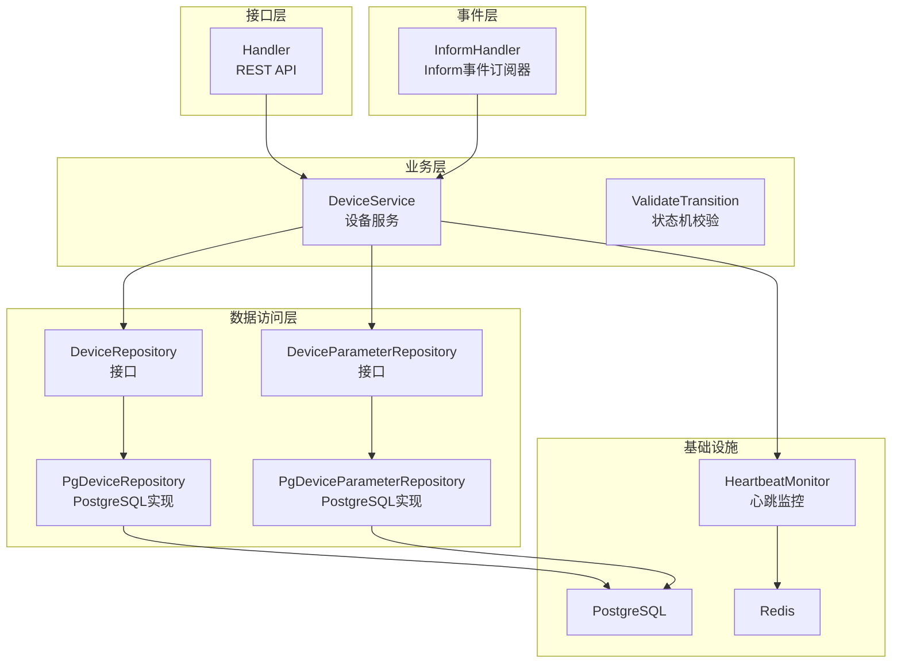

**图表来源**
- [handler.go:12-35](file://omcgo/internal/device/handler.go#L12-L35)
- [service.go:16-40](file://omcgo/internal/device/service.go#L16-L40)
- [inform_handler.go:24-44](file://omcgo/internal/device/inform_handler.go#L24-L44)
- [repository.go:22-33](file://omcgo/internal/device/repository.go#L22-L33)
- [param_repository.go:10-16](file://omcgo/internal/device/param_repository.go#L10-L16)
- [pg_repository.go:18-26](file://omcgo/internal/device/pg_repository.go#L18-L26)
- [pg_param_repository.go:15-23](file://omcgo/internal/device/pg_param_repository.go#L15-L23)
- [heartbeat.go:18-32](file://omcgo/internal/device/heartbeat.go#L18-L32)

**章节来源**
- [handler.go:22-35](file://omcgo/internal/device/handler.go#L22-L35)
- [service.go:16-40](file://omcgo/internal/device/service.go#L16-L40)
- [inform_handler.go:24-44](file://omcgo/internal/device/inform_handler.go#L24-L44)
- [repository.go:22-33](file://omcgo/internal/device/repository.go#L22-L33)
- [param_repository.go:10-16](file://omcgo/internal/device/param_repository.go#L10-L16)
- [pg_repository.go:18-26](file://omcgo/internal/device/pg_repository.go#L18-L26)
- [pg_param_repository.go:15-23](file://omcgo/internal/device/pg_param_repository.go#L15-L23)
- [heartbeat.go:18-32](file://omcgo/internal/device/heartbeat.go#L18-L32)

## 核心组件
- 设备服务 DeviceService：负责设备注册/更新、状态转换、参数批量存储、事件发布、API调用入口
- Inform事件订阅器 InformHandler：订阅TR069 Inform事件，驱动设备服务完成注册或更新
- 心跳监控 HeartbeatMonitor：基于Redis TTL维护设备在线状态，周期性扫描并标记离线
- 设备仓库 PgDeviceRepository：PostgreSQL持久化设备实体，支持分页、过滤、计数
- 参数仓库 PgDeviceParameterRepository：批量写入设备参数，支持按设备/路径查询
- REST处理器 Handler：提供设备CRUD、参数查询、统计等HTTP接口

**更新** 新增设备分组管理组件，包括分组树结构管理、自动分组规则引擎、批量设备操作等前端组件。

**章节来源**
- [service.go:16-40](file://omcgo/internal/device/service.go#L16-L40)
- [inform_handler.go:24-44](file://omcgo/internal/device/inform_handler.go#L24-L44)
- [heartbeat.go:18-32](file://omcgo/internal/device/heartbeat.go#L18-L32)
- [pg_repository.go:18-26](file://omcgo/internal/device/pg_repository.go#L18-L26)
- [pg_param_repository.go:15-23](file://omcgo/internal/device/pg_param_repository.go#L15-L23)
- [handler.go:12-20](file://omcgo/internal/device/handler.go#L12-L20)

## 架构总览
设备管理模块采用清晰的分层架构：接口层接收外部请求，业务层协调状态机与参数存储，事件层承接TR069 Inform消息，数据访问层负责持久化，基础设施层提供Redis与PostgreSQL支撑。

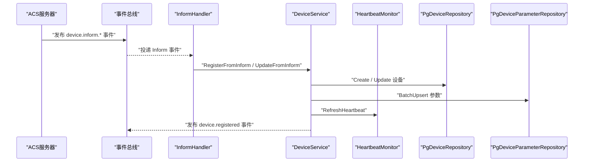

**图表来源**
- [inform_handler.go:47-67](file://omcgo/internal/device/inform_handler.go#L47-L67)
- [service.go:42-130](file://omcgo/internal/device/service.go#L42-L130)
- [pg_repository.go:28-67](file://omcgo/internal/device/pg_repository.go#L28-L67)
- [pg_param_repository.go:25-54](file://omcgo/internal/device/pg_param_repository.go#L25-L54)
- [heartbeat.go:53-64](file://omcgo/internal/device/heartbeat.go#L53-L64)

## 详细组件分析

### 设备注册流程（从TR069 Inform到数据库创建）
- 事件订阅：InformHandler订阅设备引导与周期Inform事件，解码负载并构造Inform消息
- 设备查找：若设备已存在则走更新流程，否则进入创建流程
- 信息提取：从参数列表中提取固件版本、连接请求URL、IP地址等关键字段
- 技术识别：根据参数中的型号/描述关键词判断技术类型（如NR/5G）
- 参数存储：批量写入参数，使用ON CONFLICT UPSERT保持一致性
- 心跳刷新：根据inform_interval刷新Redis心跳键，最小TTL为10分钟
- 事件发布：成功创建后发布设备注册事件

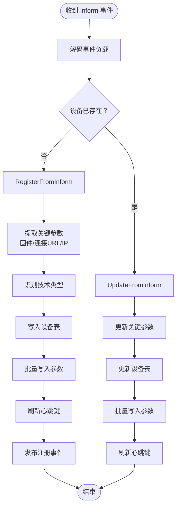

**图表来源**
- [inform_handler.go:69-114](file://omcgo/internal/device/inform_handler.go#L69-L114)
- [service.go:42-130](file://omcgo/internal/device/service.go#L42-L130)
- [pg_repository.go:28-67](file://omcgo/internal/device/pg_repository.go#L28-L67)
- [pg_param_repository.go:25-54](file://omcgo/internal/device/pg_param_repository.go#L25-L54)
- [heartbeat.go:53-64](file://omcgo/internal/device/heartbeat.go#L53-L64)

**章节来源**
- [inform_handler.go:69-114](file://omcgo/internal/device/inform_handler.go#L69-L114)
- [service.go:42-130](file://omcgo/internal/device/service.go#L42-L130)
- [pg_repository.go:28-67](file://omcgo/internal/device/pg_repository.go#L28-L67)
- [pg_param_repository.go:25-54](file://omcgo/internal/device/pg_param_repository.go#L25-L54)
- [heartbeat.go:53-64](file://omcgo/internal/device/heartbeat.go#L53-L64)

### 设备状态机管理（生命周期状态转换）
- 状态定义：discovered、registered、provisioning、active、maintenance、offline、decommissioned
- 转换矩阵：定义了允许的状态转移，例如从registered可转为provisioning或active
- 校验逻辑：ValidateTransition根据当前状态返回允许的目标状态集合，不合法则报错
- 自动转换：UpdateFromInform在设备通信时自动将状态转为active

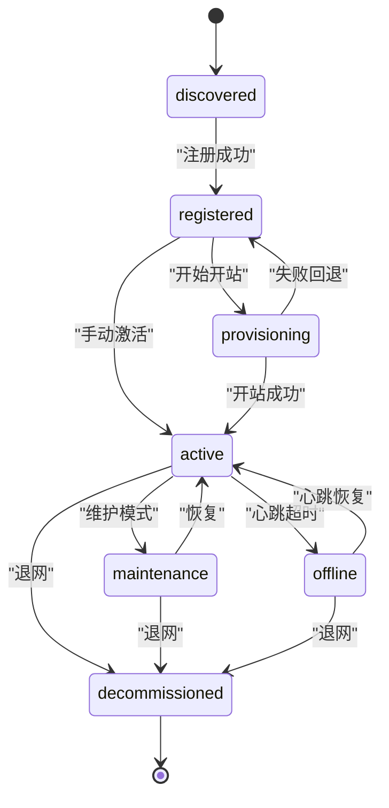

**图表来源**
- [state_machine.go:9-31](file://omcgo/internal/device/state_machine.go#L9-L31)
- [service.go:169-177](file://omcgo/internal/device/service.go#L169-L177)

**章节来源**
- [state_machine.go:9-31](file://omcgo/internal/device/state_machine.go#L9-L31)
- [service.go:169-177](file://omcgo/internal/device/service.go#L169-L177)

### 设备参数存储与同步机制
- 批量写入：DeviceService将TR069参数转换为模型后调用BatchUpsert，逐条构建UPSERT语句
- 冲突处理：ON CONFLICT DO UPDATE确保参数路径唯一性下的值与类型一致性
- 查询能力：支持按设备ID列出全部参数，或按参数路径精确查询
- 删除清理：支持按设备删除其参数记录

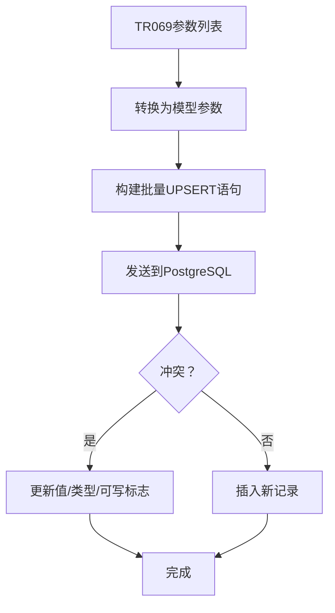

**图表来源**
- [service.go:256-279](file://omcgo/internal/device/service.go#L256-L279)
- [pg_param_repository.go:25-54](file://omcgo/internal/device/pg_param_repository.go#L25-L54)

**章节来源**
- [service.go:256-279](file://omcgo/internal/device/service.go#L256-L279)
- [pg_param_repository.go:25-54](file://omcgo/internal/device/pg_param_repository.go#L25-L54)

### 心跳监控与在线状态检测
- 心跳刷新：每次设备Inform时，根据inform_interval设置Redis键TTL=2×interval，最小10分钟
- 周期检查：每60秒扫描所有active设备，检查心跳键是否存在
- 状态变更：心跳过期则将设备状态更新为offline
- 离线事件：可选发布设备连接丢失事件（当前实现未直接发布）

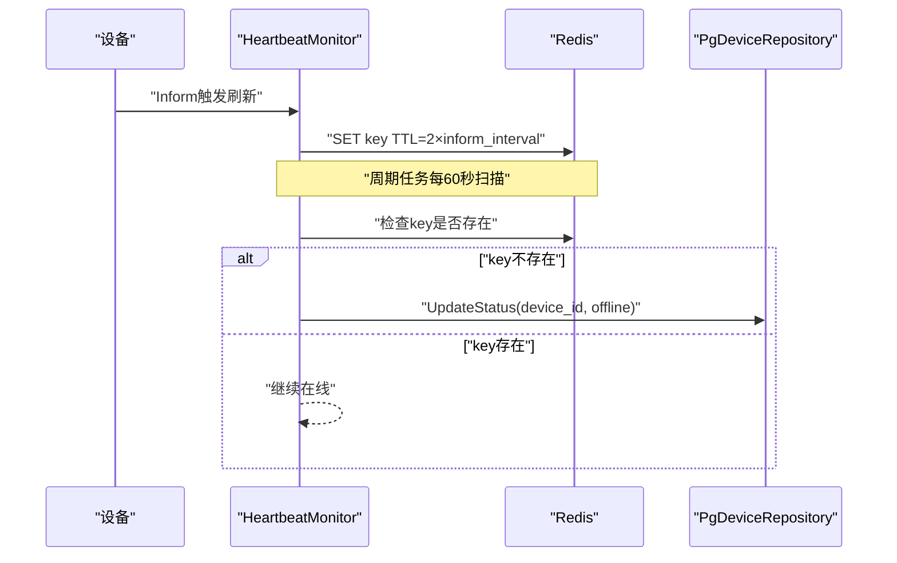

**图表来源**
- [heartbeat.go:53-115](file://omcgo/internal/device/heartbeat.go#L53-L115)
- [pg_repository.go:210-217](file://omcgo/internal/device/pg_repository.go#L210-L217)

**章节来源**
- [heartbeat.go:34-115](file://omcgo/internal/device/heartbeat.go#L34-L115)
- [pg_repository.go:210-217](file://omcgo/internal/device/pg_repository.go#L210-L217)

### 设备服务核心API接口
- 创建设备：POST /api/v1/devices
- 更新设备：PUT /api/v1/devices/:id
- 删除设备：DELETE /api/v1/devices/:id
- 查询设备：GET /api/v1/devices/:id
- 列表查询：GET /api/v1/devices（支持分页、过滤）
- 参数查询：GET /api/v1/devices/:id/parameters
- 统计查询：GET /api/v1/devices/stats
- 远程重启：POST /api/v1/devices/:id/reboot（占位，实际需调用ACS命令队列）

**更新** 新增设备分组相关API接口：
- 获取设备分组树：GET /api/v1/device-groups/tree
- 创建设备分组：POST /api/v1/device-groups
- 更新设备分组：PUT /api/v1/device-groups/:id
- 删除设备分组：DELETE /api/v1/device-groups/:id
- 获取分组设备列表：GET /api/v1/device-groups/:id/devices
- 批量移动设备到分组：POST /api/v1/device-groups/:id/move-devices
- 自动分组规则：POST /api/v1/device-groups/:id/auto-rules

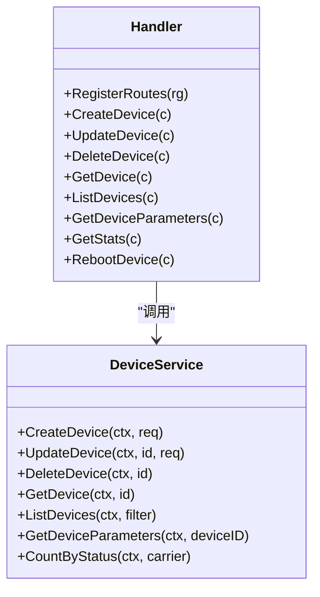

**图表来源**
- [handler.go:22-35](file://omcgo/internal/device/handler.go#L22-L35)
- [handler.go:62-124](file://omcgo/internal/device/handler.go#L62-L124)
- [handler.go:126-204](file://omcgo/internal/device/handler.go#L126-L204)
- [handler.go:206-233](file://omcgo/internal/device/handler.go#L206-L233)
- [service.go:338-416](file://omcgo/internal/device/service.go#L338-L416)

**章节来源**
- [handler.go:22-35](file://omcgo/internal/device/handler.go#L22-L35)
- [handler.go:62-124](file://omcgo/internal/device/handler.go#L62-L124)
- [handler.go:126-204](file://omcgo/internal/device/handler.go#L126-L204)
- [handler.go:206-233](file://omcgo/internal/device/handler.go#L206-L233)
- [service.go:338-416](file://omcgo/internal/device/service.go#L338-L416)

### 设备信息提取算法与状态转换验证逻辑
- 信息提取：从参数列表中查找特定路径的值（如固件版本、连接URL、UDP连接地址）
- 技术识别：通过关键词匹配（如NR、5G、gNB）判断技术类型，默认LTE
- 状态验证：ValidateTransition检查目标状态是否在当前状态允许集合内

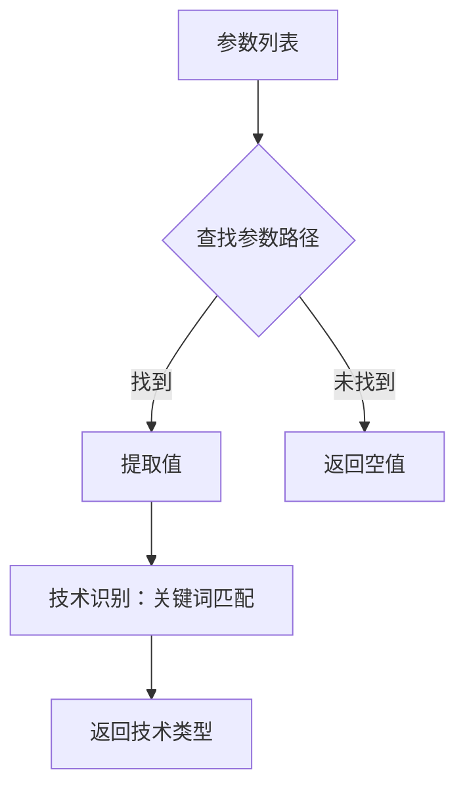

**图表来源**
- [service.go:329-336](file://omcgo/internal/device/service.go#L329-L336)
- [service.go:303-314](file://omcgo/internal/device/service.go#L303-L314)
- [state_machine.go:19-31](file://omcgo/internal/device/state_machine.go#L19-L31)

**章节来源**
- [service.go:329-336](file://omcgo/internal/device/service.go#L329-L336)
- [service.go:303-314](file://omcgo/internal/device/service.go#L303-L314)
- [state_machine.go:19-31](file://omcgo/internal/device/state_machine.go#L19-L31)

### 数据模型与数据库设计
- 设备模型：包含序列号、OUI、产品类别、制造商、运营商、技术类型、状态、固件版本、IP地址、连接URL、最近Inform时间、位置信息、扩展数据等
- 设备表：按运营商分区，主键含carrier，确保跨运营商隔离与高效查询
- 参数表：以(device_id, parameter_path)为主键，支持参数值、类型、可写标志与更新时间
- 索引设计：覆盖序列号唯一性、运营商+状态、OUI、运营商+技术、状态、最近Inform时间等

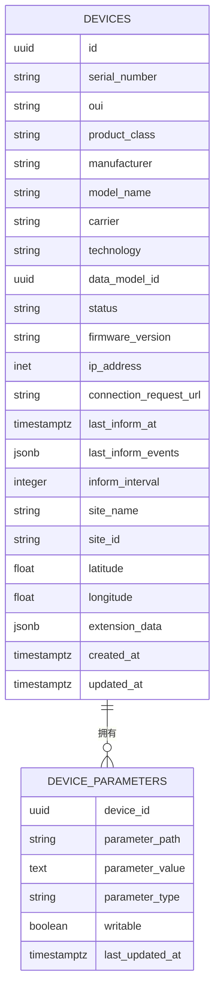

**图表来源**
- [device.go:9-34](file://omcgo/internal/core/model/device.go#L9-L34)
- [000001_create_devices.up.sql:1-55](file://omcgo/migrations/000001_create_devices.up.sql#L1-L55)
- [000002_create_device_parameters.up.sql:1-13](file://omcgo/migrations/000002_create_device_parameters.up.sql#L1-L13)

**章节来源**
- [device.go:9-34](file://omcgo/internal/core/model/device.go#L9-L34)
- [000001_create_devices.up.sql:1-55](file://omcgo/migrations/000001_create_devices.up.sql#L1-L55)
- [000002_create_device_parameters.up.sql:1-13](file://omcgo/migrations/000002_create_device_parameters.up.sql#L1-L13)

## 设备分组界面重大UI改进

### 层次化树结构设计
设备分组界面采用全新的层次化树结构，支持多级分组管理：

- **树组件规格**：使用Ant Design Tree组件，宽度280px，支持拖拽调整
- **默认展开**：展开第一级节点，便于快速定位
- **搜索功能**：顶部搜索框支持分组名称模糊匹配
- **特殊节点**：包含"全部设备"根节点和"未分组"虚拟节点
- **右键菜单**：支持新建子分组、编辑、删除、自动规则等操作

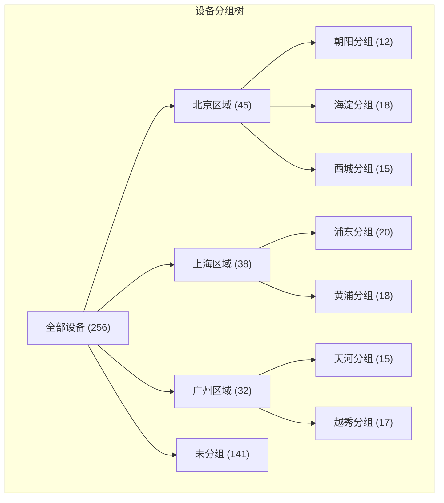

**图表来源**
- [03-device-grouping.md:51-79](file://omcmb/design/04-modules/03-device-management/03-device-grouping.md#L51-L79)

### 抽屉式界面设计
新增抽屉式界面用于创建子分组，提供更好的用户体验：

- **宽度设置**：520px，支持子分组名称、自动匹配开关、匹配规则配置
- **自动匹配功能**：支持按设备名称、TAC、LAC等条件自动分组
- **条件构建器**：支持多条件组合，AND/OR逻辑运算
- **实时预览**：自动匹配规则的自然语言描述预览

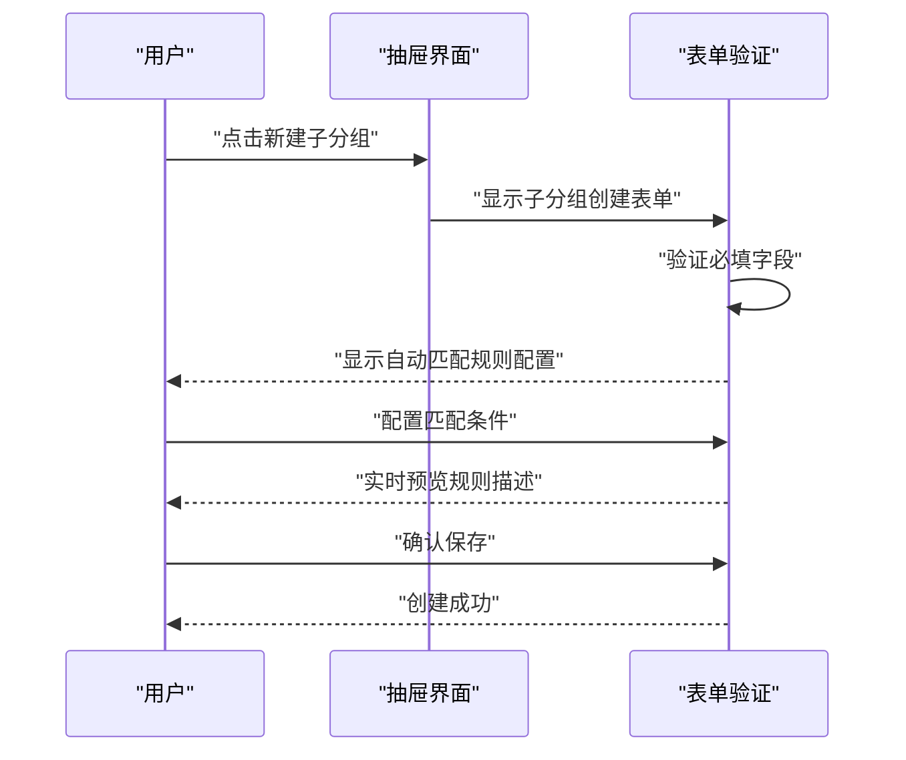

**图表来源**
- [index.tsx:876-1037](file://omcmb/webcode/src/pages/device/DeviceGrouping/index.tsx#L876-L1037)

### 设备名称过滤与TAC/LAC匹配
支持多种设备匹配条件，提升分组自动化程度：

- **设备名称过滤**：支持包含、不包含、开头为、结尾为、等于等操作符
- **TAC/LAC匹配**：支持数值范围匹配，格式如"1,2,3,1-3"
- **条件组合**：支持最多10个条件，AND/OR逻辑运算
- **实时验证**：自动验证输入格式和范围有效性

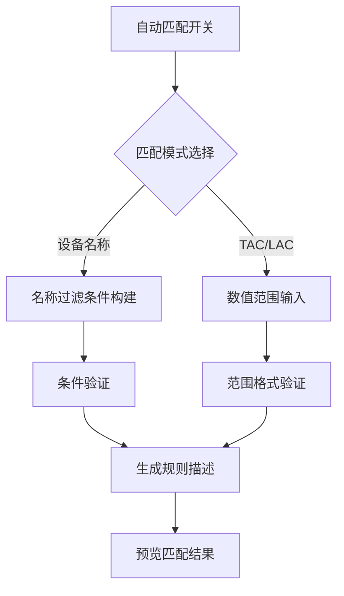

**图表来源**
- [index.tsx:461-518](file://omcmb/webcode/src/pages/device/DeviceGrouping/index.tsx#L461-L518)

### 安装状态跟踪与批量操作
增强设备管理能力，支持安装状态跟踪和批量操作：

- **安装状态**：commissioned、uncommissioned、decommissioned三种状态
- **批量操作**：支持批量移动到分组、批量回收、批量删除
- **状态可视化**：使用彩色标签显示设备安装状态
- **离线天数计算**：自动计算设备离线天数

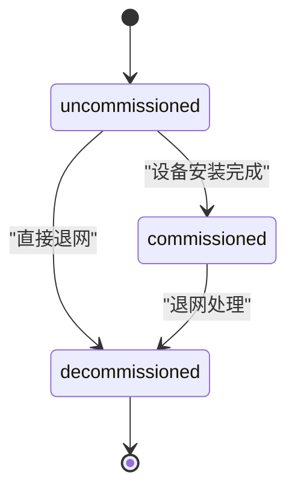

**图表来源**
- [index.tsx:591-639](file://omcmb/webcode/src/pages/device/DeviceGrouping/index.tsx#L591-L639)

**章节来源**
- [03-device-grouping.md:1-197](file://omcmb/design/04-modules/03-device-management/03-device-grouping.md#L1-L197)
- [index.tsx:1-1041](file://omcmb/webcode/src/pages/device/DeviceGrouping/index.tsx#L1-L1041)
- [useDevices.ts:33-39](file://omcmb/webcode/src/hooks/api/useDevices.ts#L33-L39)
- [device.ts:138-144](file://omcmb/webcode/src/types/device.ts#L138-L144)

## 设备分组状态机管理

### 分组树管理状态
设备分组界面包含完整的树结构管理状态：

- **树节点状态**：展开/折叠、选中状态、加载状态
- **搜索状态**：实时过滤分组列表
- **操作状态**：新建、编辑、删除确认对话框状态
- **拖拽状态**：节点拖拽排序过程中的视觉反馈

### 自动分组规则状态
自动分组规则引擎包含以下状态管理：

- **规则构建状态**：条件添加、删除、修改状态
- **验证状态**：输入验证、格式检查状态
- **执行状态**：规则应用过程中的进度提示
- **预览状态**：规则描述的实时生成和显示

### 批量操作状态
批量操作功能的状态管理：

- **选择状态**：设备选择状态跟踪
- **目标状态**：目标分组选择状态
- **执行状态**：批量操作执行状态
- **结果状态**：操作结果反馈状态

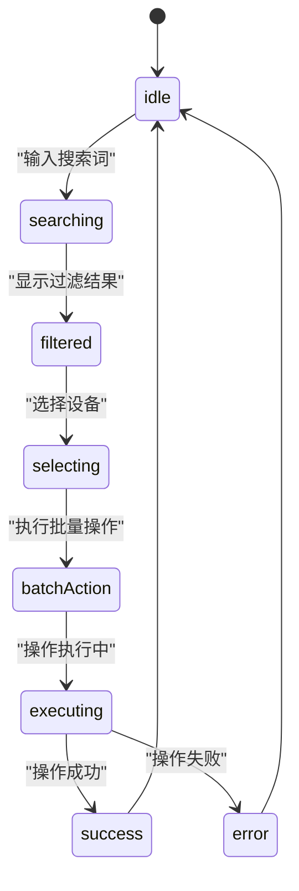

**图表来源**
- [index.tsx:249-764](file://omcmb/webcode/src/pages/device/DeviceGrouping/index.tsx#L249-L764)

**章节来源**
- [index.tsx:249-764](file://omcmb/webcode/src/pages/device/DeviceGrouping/index.tsx#L249-L764)

## 依赖分析
- 组件耦合：Handler仅依赖DeviceService；DeviceService依赖仓库接口与心跳监控；仓库接口由PostgreSQL实现；InformHandler依赖事件总线与DeviceService
- 外部依赖：PostgreSQL用于持久化，Redis用于心跳键与TTL控制
- 循环依赖：未见循环依赖迹象

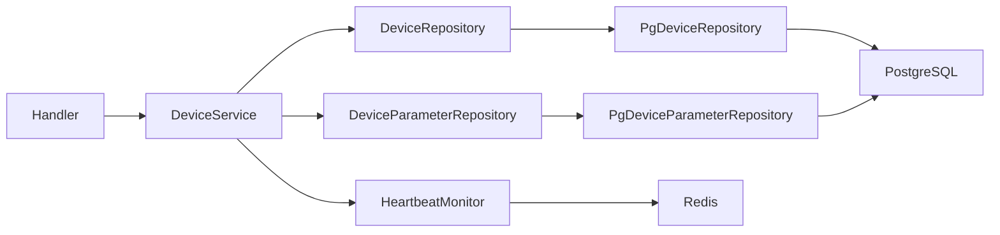

**图表来源**
- [handler.go:12-20](file://omcgo/internal/device/handler.go#L12-L20)
- [service.go:16-40](file://omcgo/internal/device/service.go#L16-L40)
- [repository.go:22-33](file://omcgo/internal/device/repository.go#L22-L33)
- [param_repository.go:10-16](file://omcgo/internal/device/param_repository.go#L10-L16)
- [pg_repository.go:18-26](file://omcgo/internal/device/pg_repository.go#L18-L26)
- [pg_param_repository.go:15-23](file://omcgo/internal/device/pg_param_repository.go#L15-L23)
- [heartbeat.go:18-32](file://omcgo/internal/device/heartbeat.go#L18-L32)

**章节来源**
- [handler.go:12-20](file://omcgo/internal/device/handler.go#L12-L20)
- [service.go:16-40](file://omcgo/internal/device/service.go#L16-L40)
- [repository.go:22-33](file://omcgo/internal/device/repository.go#L22-L33)
- [param_repository.go:10-16](file://omcgo/internal/device/param_repository.go#L10-L16)
- [pg_repository.go:18-26](file://omcgo/internal/device/pg_repository.go#L18-L26)
- [pg_param_repository.go:15-23](file://omcgo/internal/device/pg_param_repository.go#L15-L23)
- [heartbeat.go:18-32](file://omcgo/internal/device/heartbeat.go#L18-L32)

## 性能考虑
- 批量参数写入：使用pgx.Batch与ON CONFLICT UPSERT减少往返，提升参数入库吞吐
- 分页与过滤：设备列表查询支持分页、排序与多维度过滤，结合索引避免全表扫描
- 心跳扫描：每60秒扫描active设备，建议限制单次扫描数量或分批处理，避免阻塞
- Redis TTL：心跳键TTL至少10分钟，避免频繁刷新导致热点写压力
- 索引优化：序列号唯一索引、运营商+状态、OUI、运营商+技术、状态、最近Inform时间等索引有助于查询与统计

**更新** 新增设备分组界面性能优化建议：
- 树结构懒加载：分组树支持懒加载，避免一次性加载大量节点
- 条件缓存：自动分组规则的条件验证结果缓存
- 批量操作优化：批量移动设备时使用事务处理，确保数据一致性
- 状态缓存：设备安装状态的本地缓存，减少重复查询

## 故障排查指南
- 设备未创建：确认InformHandler是否正确订阅事件、DeviceService是否成功查找/创建设备、参数是否为空导致未写入
- 状态异常：检查ValidateTransition是否允许该转换，确认UpdateFromInform是否触发自动激活
- 参数缺失：核对BatchUpsert是否执行、参数路径是否唯一、冲突处理是否生效
- 心跳不更新：检查RefreshHeartbeat是否被调用、Redis连接是否正常、TTL是否过小
- 离线未标记：确认心跳扫描任务是否运行、active设备筛选是否正确、Redis键是否存在

**更新** 新增设备分组界面故障排查：
- 分组树加载失败：检查分组数据API是否正常、树组件渲染是否报错
- 自动分组规则无效：验证规则条件格式、TAC/LAC范围输入、设备匹配逻辑
- 批量操作失败：检查设备选择状态、目标分组有效性、网络连接状态
- 状态显示异常：确认设备安装状态数据源、状态映射配置、本地缓存同步

**章节来源**
- [inform_handler.go:47-67](file://omcgo/internal/device/inform_handler.go#L47-L67)
- [service.go:204-229](file://omcgo/internal/device/service.go#L204-L229)
- [pg_param_repository.go:25-54](file://omcgo/internal/device/pg_param_repository.go#L25-L54)
- [heartbeat.go:34-115](file://omcgo/internal/device/heartbeat.go#L34-L115)

## 结论
设备管理模块通过清晰的分层设计实现了从TR069 Inform到设备入库、参数同步、状态机管理与心跳监控的完整闭环。REST API提供了完备的设备管理能力，PostgreSQL与Redis分别承担持久化与实时状态判定。遵循本文的最佳实践与性能建议，可在大规模设备场景下保持稳定与高效。

**更新** 设备分组界面的重大UI改进显著提升了设备管理效率，层次化树结构、抽屉式界面、自动分组规则等功能大幅简化了设备分组操作。配合安装状态跟踪和批量操作能力，为运维人员提供了更加直观、高效的设备管理体验。

## 附录

### 设备管理API使用示例（代码路径）
- 创建设备
  - 请求：POST /api/v1/devices
  - 代码路径：[handler.go:62-81](file://omcgo/internal/device/handler.go#L62-L81)，[service.go:338-376](file://omcgo/internal/device/service.go#L338-L376)
- 更新设备
  - 请求：PUT /api/v1/devices/:id
  - 代码路径：[handler.go:83-108](file://omcgo/internal/device/handler.go#L83-L108)，[service.go:378-411](file://omcgo/internal/device/service.go#L378-L411)
- 删除设备
  - 请求：DELETE /api/v1/devices/:id
  - 代码路径：[handler.go:110-124](file://omcgo/internal/device/handler.go#L110-L124)，[service.go:413-416](file://omcgo/internal/device/service.go#L413-L416)
- 查询设备
  - 请求：GET /api/v1/devices/:id
  - 代码路径：[handler.go:168-187](file://omcgo/internal/device/handler.go#L168-L187)，[service.go:231-239](file://omcgo/internal/device/service.go#L231-L239)
- 列出设备
  - 请求：GET /api/v1/devices
  - 代码路径：[handler.go:126-166](file://omcgo/internal/device/handler.go#L126-L166)，[repository.go:11-20](file://omcgo/internal/device/repository.go#L11-L20)，[pg_repository.go:133-208](file://omcgo/internal/device/pg_repository.go#L133-L208)
- 获取参数
  - 请求：GET /api/v1/devices/:id/parameters
  - 代码路径：[handler.go:189-204](file://omcgo/internal/device/handler.go#L189-L204)，[service.go:246-249](file://omcgo/internal/device/service.go#L246-L249)，[pg_param_repository.go:56-85](file://omcgo/internal/device/pg_param_repository.go#L56-L85)
- 统计状态
  - 请求：GET /api/v1/devices/stats
  - 代码路径：[handler.go:206-221](file://omcgo/internal/device/handler.go#L206-L221)，[service.go:251-254](file://omcgo/internal/device/service.go#L251-L254)，[pg_repository.go:230-253](file://omcgo/internal/device/pg_repository.go#L230-L253)

**更新** 新增设备分组相关API使用示例：
- 获取设备分组树
  - 请求：GET /api/v1/device-groups/tree
  - 代码路径：[useDevices.ts:33-39](file://omcmb/webcode/src/hooks/api/useDevices.ts#L33-L39)
- 创建设备分组
  - 请求：POST /api/v1/device-groups
  - 代码路径：[index.tsx:407-413](file://omcmb/webcode/src/pages/device/DeviceGrouping/index.tsx#L407-L413)
- 批量移动设备到分组
  - 请求：POST /api/v1/device-groups/:id/move-devices
  - 代码路径：[index.tsx:646-655](file://omcmb/webcode/src/pages/device/DeviceGrouping/index.tsx#L646-L655)

**章节来源**
- [handler.go:62-233](file://omcgo/internal/device/handler.go#L62-L233)
- [service.go:231-416](file://omcgo/internal/device/service.go#L231-L416)
- [repository.go:11-33](file://omcgo/internal/device/repository.go#L11-L33)
- [pg_repository.go:133-253](file://omcgo/internal/device/pg_repository.go#L133-L253)
- [pg_param_repository.go:56-85](file://omcgo/internal/device/pg_param_repository.go#L56-L85)
- [useDevices.ts:33-39](file://omcmb/webcode/src/hooks/api/useDevices.ts#L33-L39)
- [index.tsx:407-413](file://omcmb/webcode/src/pages/device/DeviceGrouping/index.tsx#L407-L413)
- [index.tsx:646-655](file://omcmb/webcode/src/pages/device/DeviceGrouping/index.tsx#L646-L655)