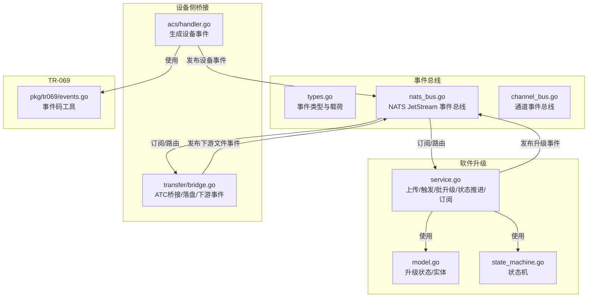
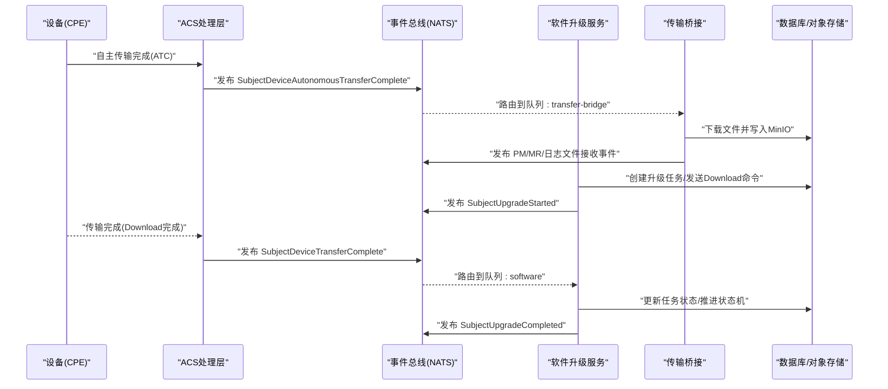
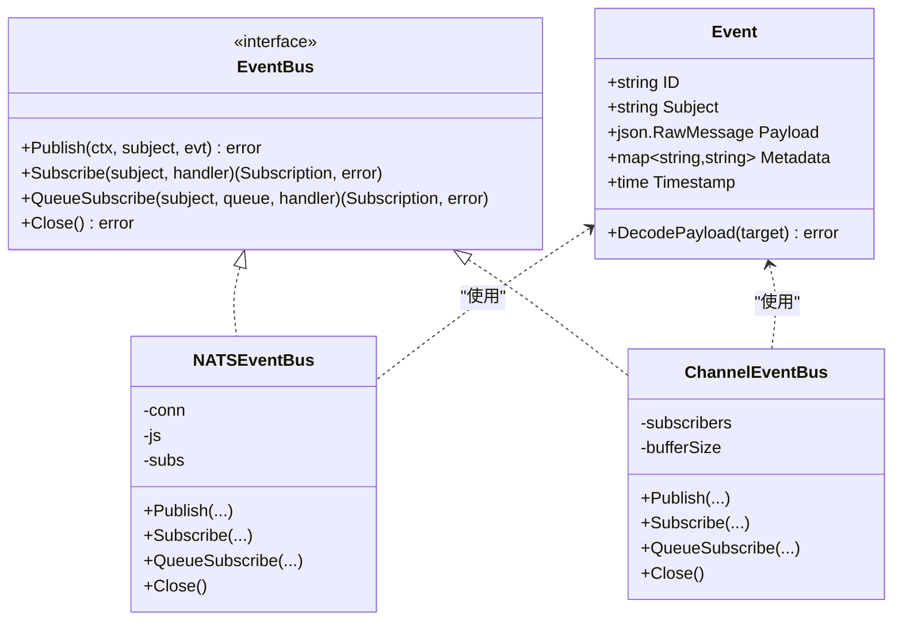
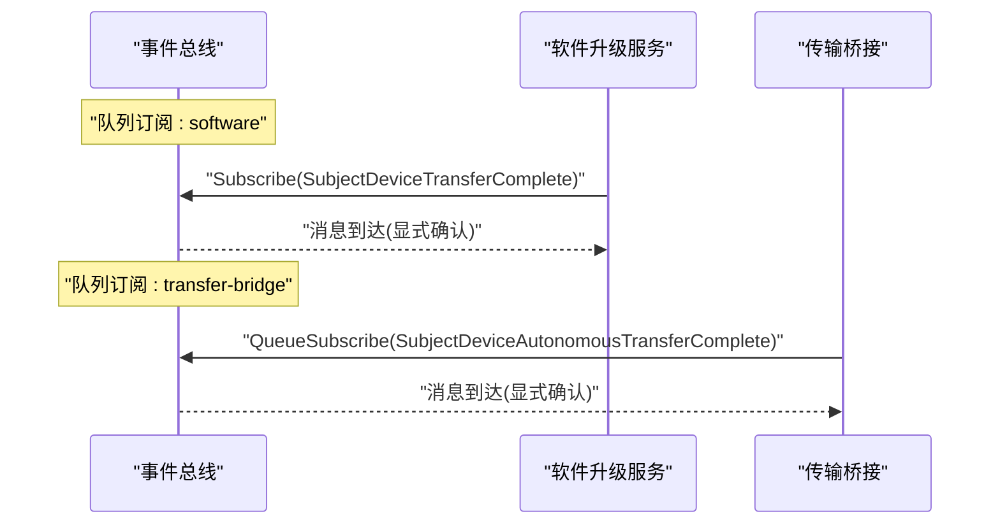
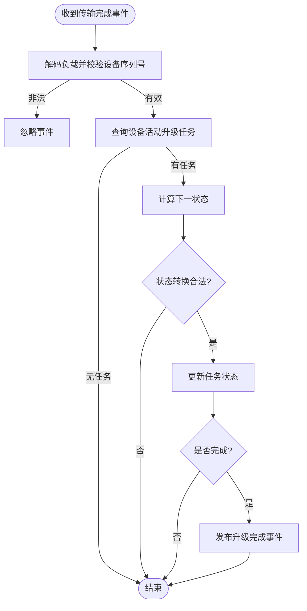
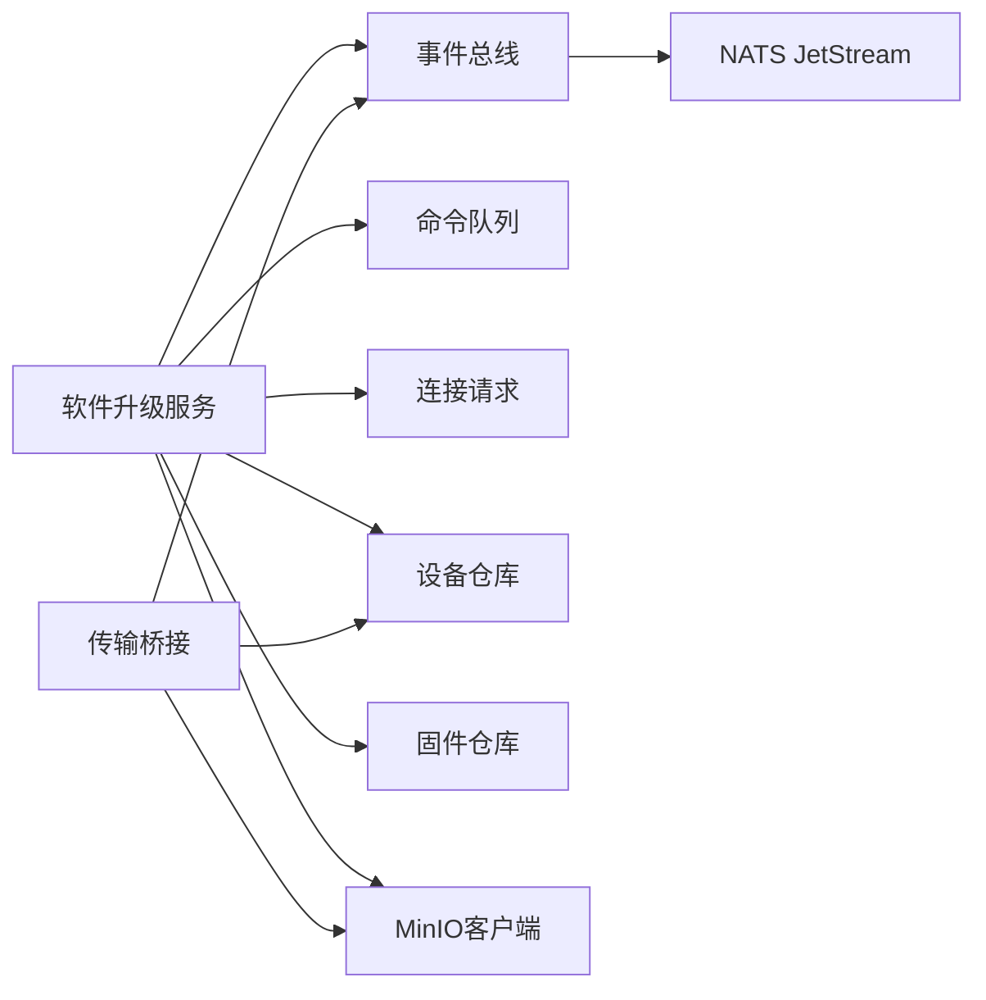

# 事件处理机制

<cite>
**本文引用的文件**
- [omcgo/internal/software/service.go](file://omcgo/internal/software/service.go)
- [omcgo/internal/software/model.go](file://omcgo/internal/software/model.go)
- [omcgo/internal/software/state_machine.go](file://omcgo/internal/software/state_machine.go)
- [omcgo/internal/core/event/types.go](file://omcgo/internal/core/event/types.go)
- [omcgo/internal/core/event/nats_bus.go](file://omcgo/internal/core/event/nats_bus.go)
- [omcgo/internal/core/event/channel_bus.go](file://omcgo/internal/core/event/channel_bus.go)
- [omcgo/internal/acs/handler.go](file://omcgo/internal/acs/handler.go)
- [omcgo/internal/transfer/bridge.go](file://omcgo/internal/transfer/bridge.go)
- [omcgo/internal/device/inform_handler.go](file://omcgo/internal/device/inform_handler.go)
- [omcgo/docs/detailed-design/14-software-management.md](file://omcgo/docs/detailed-design/14-software-management.md)
- [omcgo/pkg/tr069/events.go](file://omcgo/pkg/tr069/events.go)
</cite>

## 目录
1. [简介](#简介)
2. [项目结构](#项目结构)
3. [核心组件](#核心组件)
4. [架构总览](#架构总览)
5. [详细组件分析](#详细组件分析)
6. [依赖分析](#依赖分析)
7. [性能考虑](#性能考虑)
8. [故障排查指南](#故障排查指南)
9. [结论](#结论)
10. [附录](#附录)

## 简介
本文件面向“软件升级事件处理机制”，系统化阐述事件驱动架构在升级流程中的应用，包括事件类型定义、事件传播与路由、事件订阅与幂等性保障、序列化与负载结构、事件溯源能力、性能优化与重试策略、死信处理方案，以及事件监听示例、自定义事件扩展与监控指标建议。文档以实际代码为依据，结合升级流程的关键事件：固件上传完成、升级开始、传输完成、升级完成，给出端到端的处理链路与最佳实践。

## 项目结构
围绕事件处理与软件升级，关键代码分布在以下模块：
- 事件总线与类型：core/event（NATS JetStream 与通道事件总线）
- 升级服务与状态机：software（上传、触发、批量化、状态推进、事件订阅）
- 设备侧事件桥接：transfer（从设备自主传输完成事件到下游文件事件）
- 设备接入层：acs（生成设备侧事件并发布）
- TR-069 事件码工具：pkg/tr069（事件码识别辅助）

**图表来源**
- [omcgo/internal/core/event/types.go:11-41](file://omcgo/internal/core/event/types.go#L11-L41)
- [omcgo/internal/core/event/nats_bus.go:16-136](file://omcgo/internal/core/event/nats_bus.go#L16-L136)
- [omcgo/internal/core/event/channel_bus.go:12-201](file://omcgo/internal/core/event/channel_bus.go#L12-L201)
- [omcgo/internal/software/service.go:20-31](file://omcgo/internal/software/service.go#L20-L31)
- [omcgo/internal/software/model.go:10-82](file://omcgo/internal/software/model.go#L10-L82)
- [omcgo/internal/software/state_machine.go:5-52](file://omcgo/internal/software/state_machine.go#L5-L52)
- [omcgo/internal/acs/handler.go:433-466](file://omcgo/internal/acs/handler.go#L433-L466)
- [omcgo/internal/transfer/bridge.go:18-259](file://omcgo/internal/transfer/bridge.go#L18-L259)
- [omcgo/pkg/tr069/events.go:5-95](file://omcgo/pkg/tr069/events.go#L5-L95)

**章节来源**
- [omcgo/internal/core/event/types.go:11-41](file://omcgo/internal/core/event/types.go#L11-L41)
- [omcgo/internal/core/event/nats_bus.go:16-136](file://omcgo/internal/core/event/nats_bus.go#L16-L136)
- [omcgo/internal/core/event/channel_bus.go:12-201](file://omcgo/internal/core/event/channel_bus.go#L12-L201)
- [omcgo/internal/software/service.go:20-31](file://omcgo/internal/software/service.go#L20-L31)
- [omcgo/internal/software/model.go:10-82](file://omcgo/internal/software/model.go#L10-L82)
- [omcgo/internal/software/state_machine.go:5-52](file://omcgo/internal/software/state_machine.go#L5-L52)
- [omcgo/internal/acs/handler.go:433-466](file://omcgo/internal/acs/handler.go#L433-L466)
- [omcgo/internal/transfer/bridge.go:18-259](file://omcgo/internal/transfer/bridge.go#L18-L259)
- [omcgo/pkg/tr069/events.go:5-95](file://omcgo/pkg/tr069/events.go#L5-L95)

## 核心组件
- 事件总线（EventBus）
  - NATS JetStream 实现：支持显式确认、可配置重试与最大投递次数、队列分组、持久化与回放。
  - 通道事件总线：进程内广播/队列分组，便于测试与本地开发。
- 事件类型与载荷
  - 统一事件载体包含：事件ID、主题、时间戳、元数据、负载；提供负载解码方法。
- 软件升级服务
  - 提供固件上传、触发单/批量升级、状态机推进、事件订阅注册。
- 设备侧桥接
  - 订阅设备自主传输完成事件，下载文件至对象存储，并发布下游文件接收事件。
- TR-069 事件码工具
  - 提供常见事件码判断与集合提取，辅助设备侧事件识别。

**章节来源**
- [omcgo/internal/core/event/nats_bus.go:16-136](file://omcgo/internal/core/event/nats_bus.go#L16-L136)
- [omcgo/internal/core/event/channel_bus.go:12-201](file://omcgo/internal/core/event/channel_bus.go#L12-L201)
- [omcgo/internal/core/event/types.go:11-41](file://omcgo/internal/core/event/types.go#L11-L41)
- [omcgo/internal/software/service.go:20-31](file://omcgo/internal/software/service.go#L20-L31)
- [omcgo/internal/transfer/bridge.go:18-259](file://omcgo/internal/transfer/bridge.go#L18-L259)
- [omcgo/pkg/tr069/events.go:5-95](file://omcgo/pkg/tr069/events.go#L5-L95)

## 架构总览
事件驱动的升级流程由“设备侧事件”和“应用侧事件”协同完成。设备侧通过 TR-069 的自主传输完成事件上报，应用侧通过桥接组件下载文件并发布下游事件；同时，应用侧在升级生命周期中发布“固件上传完成”“升级开始”“升级完成”等事件，形成闭环。

**图表来源**
- [omcgo/internal/acs/handler.go:433-466](file://omcgo/internal/acs/handler.go#L433-L466)
- [omcgo/internal/transfer/bridge.go:54-209](file://omcgo/internal/transfer/bridge.go#L54-L209)
- [omcgo/internal/software/service.go:92-162](file://omcgo/internal/software/service.go#L92-L162)
- [omcgo/internal/software/service.go:245-290](file://omcgo/internal/software/service.go#L245-L290)
- [omcgo/internal/core/event/nats_bus.go:48-78](file://omcgo/internal/core/event/nats_bus.go#L48-L78)

## 详细组件分析

### 事件类型与序列化
- 事件载体
  - 字段：事件ID、主题、时间戳、元数据、负载（JSON原始字节）。
  - 负载解码：提供解码方法将负载反序列化到目标结构体。
- 序列化与负载结构
  - 发布前统一进行JSON序列化；消费时先反序列化为事件对象，再按主题解码到具体负载。
- 主题命名约定
  - 使用点分隔的层级主题，便于匹配与路由（如设备类、传输类、升级类）。

**图表来源**
- [omcgo/internal/core/event/types.go:11-41](file://omcgo/internal/core/event/types.go#L11-L41)
- [omcgo/internal/core/event/nats_bus.go:16-136](file://omcgo/internal/core/event/nats_bus.go#L16-L136)
- [omcgo/internal/core/event/channel_bus.go:12-201](file://omcgo/internal/core/event/channel_bus.go#L12-L201)

**章节来源**
- [omcgo/internal/core/event/types.go:11-41](file://omcgo/internal/core/event/types.go#L11-L41)
- [omcgo/internal/core/event/nats_bus.go:34-78](file://omcgo/internal/core/event/nats_bus.go#L34-L78)
- [omcgo/internal/core/event/channel_bus.go:47-150](file://omcgo/internal/core/event/channel_bus.go#L47-L150)

### 事件订阅机制与路由策略
- 订阅方式
  - 普通订阅：所有消费者均收到消息。
  - 队列订阅：同一队列内的多个实例采用轮询或负载均衡，确保每条消息仅被一个实例处理。
- 路由策略
  - 支持主题匹配（通配符），便于按设备、事件类型、业务域进行路由。
- 示例
  - 软件升级服务订阅“设备传输完成”事件，用于推进升级状态机。
  - 传输桥接订阅“设备自主传输完成”事件，用于下载文件并发布下游事件。

**图表来源**
- [omcgo/internal/software/service.go:292-298](file://omcgo/internal/software/service.go#L292-L298)
- [omcgo/internal/transfer/bridge.go:54-67](file://omcgo/internal/transfer/bridge.go#L54-L67)
- [omcgo/internal/core/event/nats_bus.go:48-78](file://omcgo/internal/core/event/nats_bus.go#L48-L78)

**章节来源**
- [omcgo/internal/software/service.go:292-298](file://omcgo/internal/software/service.go#L292-L298)
- [omcgo/internal/transfer/bridge.go:54-67](file://omcgo/internal/transfer/bridge.go#L54-L67)
- [omcgo/internal/core/event/nats_bus.go:48-78](file://omcgo/internal/core/event/nats_bus.go#L48-L78)

### 事件传播与幂等性保证
- 幂等性策略
  - 事件ID唯一：每个事件携带唯一ID，可用于去重与审计。
  - 显式确认：NATS JetStream 使用显式确认，避免重复处理。
  - 最大投递次数：超过阈值后终止消息，避免无限重试。
  - 负载校验：处理器在处理前校验必要字段（如设备序列号），非法负载直接忽略。
- 错误处理
  - 解析失败：永久终止，避免循环重试。
  - 业务错误：记录日志并根据投递次数决定重试或终止。
- 传输桥接的幂等性
  - 对于“故障”或“空URL”的ATC事件直接跳过，避免重复处理无效事件。

**章节来源**
- [omcgo/internal/core/event/nats_bus.go:93-127](file://omcgo/internal/core/event/nats_bus.go#L93-L127)
- [omcgo/internal/transfer/bridge.go:83-121](file://omcgo/internal/transfer/bridge.go#L83-L121)

### 升级事件处理流程

#### 固件上传事件
- 触发时机：上传固件成功后，服务创建记录并发布“固件上传完成”事件。
- 负载内容：包含固件ID、运营商、版本号等。
- 处理要点：事件发布后即结束，不阻塞上传流程。

**章节来源**
- [omcgo/internal/software/service.go:58-90](file://omcgo/internal/software/service.go#L58-L90)
- [omcgo/docs/detailed-design/14-software-management.md:39-90](file://omcgo/docs/detailed-design/14-software-management.md#L39-L90)

#### 升级开始事件
- 触发时机：创建升级任务并进入“下载中”状态后，发布“升级开始”事件。
- 负载内容：包含任务ID、设备ID、固件ID等。
- 处理要点：用于通知下游系统开始准备资源或记录升级计划。

**章节来源**
- [omcgo/internal/software/service.go:92-162](file://omcgo/internal/software/service.go#L92-L162)
- [omcgo/docs/detailed-design/14-software-management.md:49-51](file://omcgo/docs/detailed-design/14-software-management.md#L49-L51)

#### 传输完成事件
- 触发时机：设备侧报告下载完成，ACS生成“设备传输完成”事件并发布。
- 软件侧处理：升级服务订阅该事件，查找当前设备的活动任务，推进状态机到下一状态；若达到最终状态则发布“升级完成”事件。
- 负载内容：包含设备序列号等。

**图表来源**
- [omcgo/internal/software/service.go:245-290](file://omcgo/internal/software/service.go#L245-L290)
- [omcgo/internal/software/state_machine.go:16-35](file://omcgo/internal/software/state_machine.go#L16-L35)

**章节来源**
- [omcgo/internal/software/service.go:245-290](file://omcgo/internal/software/service.go#L245-L290)
- [omcgo/internal/software/state_machine.go:16-35](file://omcgo/internal/software/state_machine.go#L16-L35)
- [omcgo/internal/acs/handler.go:433-466](file://omcgo/internal/acs/handler.go#L433-L466)

#### 传输完成事件（设备侧）
- 触发时机：设备完成文件传输（如固件下载）后上报。
- 处理：ACS生成事件并发布；软件侧订阅并推进升级状态机。

**章节来源**
- [omcgo/internal/acs/handler.go:433-466](file://omcgo/internal/acs/handler.go#L433-L466)

### 事件溯源能力
- 事件持久化：事件总线（NATS JetStream）具备消息持久化与回放能力，可基于主题进行历史回放与审计。
- 负载结构：事件包含时间戳与元数据，便于排序与关联分析。
- 建议实践：为关键业务事件（如升级开始/完成）建立独立主题与索引，便于事件溯源与问题复盘。

**章节来源**
- [omcgo/internal/core/event/nats_bus.go:48-78](file://omcgo/internal/core/event/nats_bus.go#L48-L78)
- [omcgo/internal/core/event/types.go:11-41](file://omcgo/internal/core/event/types.go#L11-L41)

### 自定义事件扩展
- 新增事件主题：遵循“域.子域.动作”的层级命名，便于路由与聚合。
- 负载设计：保持最小必要字段，避免过度耦合；必要时引入元数据承载上下文信息。
- 订阅策略：对高吞吐事件采用队列订阅，对广播型事件采用普通订阅。

**章节来源**
- [omcgo/internal/core/event/nats_bus.go:48-78](file://omcgo/internal/core/event/nats_bus.go#L48-L78)
- [omcgo/internal/core/event/channel_bus.go:106-150](file://omcgo/internal/core/event/channel_bus.go#L106-L150)

### 事件监听示例
- 软件升级服务订阅
  - 订阅“设备传输完成”事件，推进升级状态机。
- 传输桥接订阅
  - 订阅“设备自主传输完成”事件，下载文件并发布下游文件接收事件。

**章节来源**
- [omcgo/internal/software/service.go:292-298](file://omcgo/internal/software/service.go#L292-L298)
- [omcgo/internal/transfer/bridge.go:54-67](file://omcgo/internal/transfer/bridge.go#L54-L67)

## 依赖分析
- 组件耦合
  - 软件升级服务依赖事件总线、命令队列、连接请求客户端、设备与固件仓库、MinIO 客户端。
  - 传输桥接依赖设备仓库、MinIO 客户端、事件总线。
- 依赖方向
  - 事件总线作为基础设施，向上提供发布/订阅能力。
  - 业务服务通过事件总线与外部系统解耦，提升可扩展性与可观测性。

**图表来源**
- [omcgo/internal/software/service.go:20-31](file://omcgo/internal/software/service.go#L20-L31)
- [omcgo/internal/transfer/bridge.go:18-52](file://omcgo/internal/transfer/bridge.go#L18-L52)
- [omcgo/internal/core/event/nats_bus.go:16-32](file://omcgo/internal/core/event/nats_bus.go#L16-L32)

**章节来源**
- [omcgo/internal/software/service.go:20-31](file://omcgo/internal/software/service.go#L20-L31)
- [omcgo/internal/transfer/bridge.go:18-52](file://omcgo/internal/transfer/bridge.go#L18-L52)
- [omcgo/internal/core/event/nats_bus.go:16-32](file://omcgo/internal/core/event/nats_bus.go#L16-L32)

## 性能考虑
- 并发与限流
  - 批量升级采用信号量控制并发，避免对设备与网络造成冲击。
- 异步处理
  - 事件驱动解耦I/O密集型操作（如文件下载、命令下发），提升整体吞吐。
- 缓冲与背压
  - 通道事件总线支持缓冲区大小配置；NATS JetStream 通过队列订阅与确认机制实现背压控制。
- 指数退避与最大重试
  - NATS JetStream 实现指数退避与最大投递次数，平衡可靠性与资源消耗。

**章节来源**
- [omcgo/internal/software/service.go:164-243](file://omcgo/internal/software/service.go#L164-L243)
- [omcgo/internal/core/event/nats_bus.go:103-127](file://omcgo/internal/core/event/nats_bus.go#L103-L127)

## 故障排查指南
- 事件未达
  - 检查订阅主题与队列名称是否一致；确认事件总线连接与JetStream上下文可用。
- 重复处理
  - 校验事件ID与业务主键组合的去重逻辑；检查确认机制是否正确使用。
- 解析失败
  - 查看事件负载结构是否符合预期；关注总线日志中的“解析失败”终止记录。
- 死信与重试
  - 关注最大投递次数阈值与退避延迟；必要时人工干预死信消息。
- 设备侧事件异常
  - 检查设备上报的事件码与文件传输URL；对于故障或空URL的ATC事件应被桥接组件跳过。

**章节来源**
- [omcgo/internal/core/event/nats_bus.go:93-127](file://omcgo/internal/core/event/nats_bus.go#L93-L127)
- [omcgo/internal/transfer/bridge.go:83-121](file://omcgo/internal/transfer/bridge.go#L83-L121)

## 结论
本机制通过事件总线实现设备侧与应用侧的松耦合协作，借助状态机与队列订阅保障升级流程的有序推进与幂等处理。结合NATS JetStream的可靠投递与回放能力，系统具备良好的可扩展性、可观测性与可维护性。建议在生产环境中完善监控指标、告警策略与死信治理流程，持续优化并发与重试参数以适配不同规模的升级场景。

## 附录

### 升级状态机与实体
- 升级状态：待下载、下载中、重启中、验证中、已完成、失败。
- 状态转换：严格限制合法转换，终端状态不可逆。

**章节来源**
- [omcgo/internal/software/model.go:10-52](file://omcgo/internal/software/model.go#L10-L52)
- [omcgo/internal/software/state_machine.go:5-52](file://omcgo/internal/software/state_machine.go#L5-L52)

### TR-069 事件码辅助
- 提供常用事件码判断函数，便于设备侧事件识别与处理。

**章节来源**
- [omcgo/pkg/tr069/events.go:5-95](file://omcgo/pkg/tr069/events.go#L5-L95)