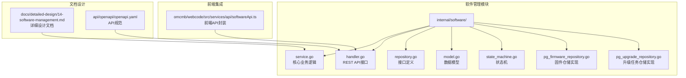
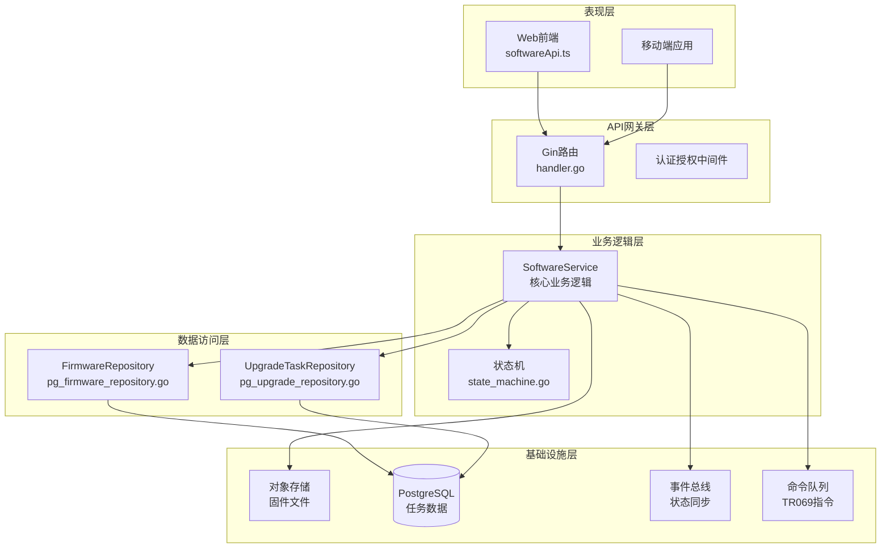
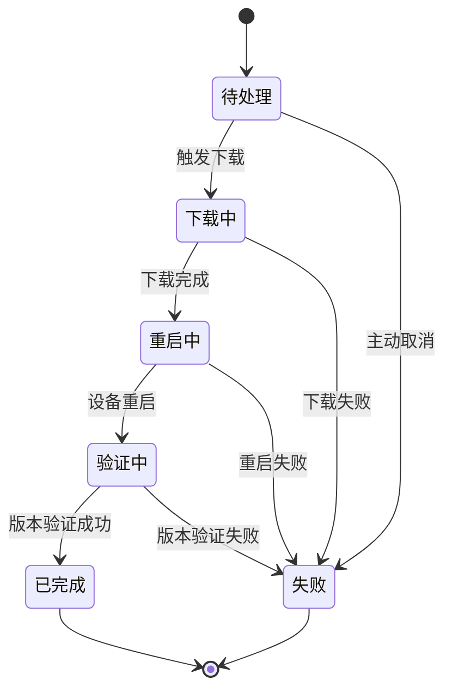
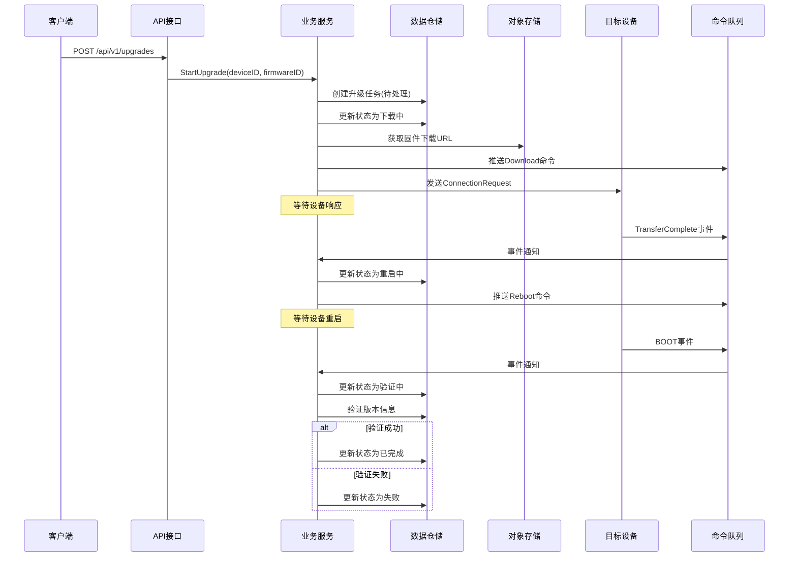
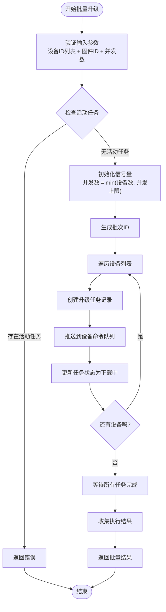
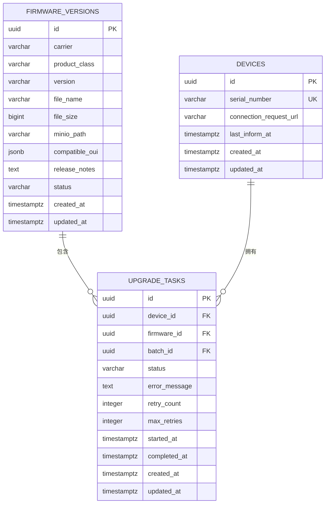
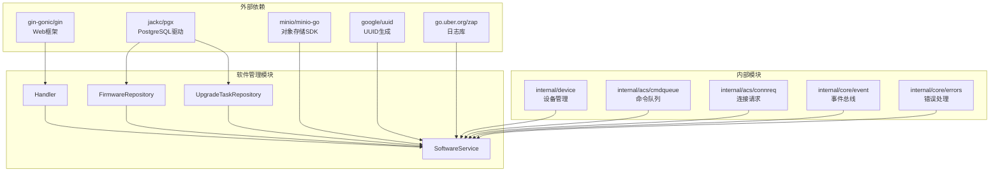
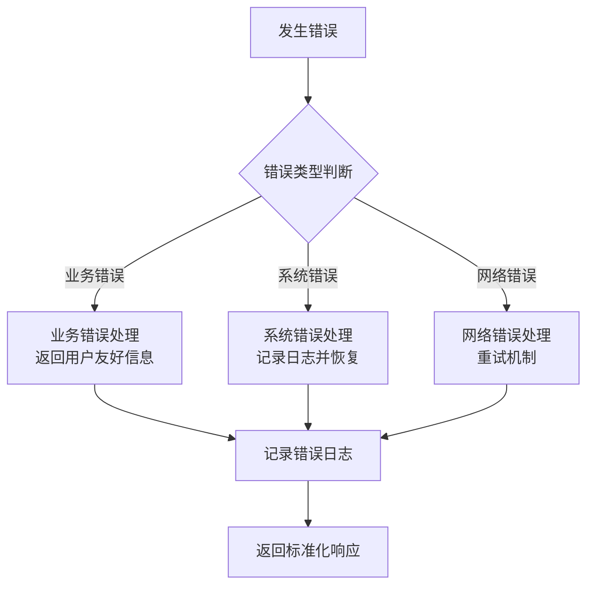

# 升级任务管理

<cite>
**本文档引用的文件**
- [service.go](file://omcgo/internal/software/service.go)
- [handler.go](file://omcgo/internal/software/handler.go)
- [repository.go](file://omcgo/internal/software/repository.go)
- [model.go](file://omcgo/internal/software/model.go)
- [state_machine.go](file://omcgo/internal/software/state_machine.go)
- [pg_firmware_repository.go](file://omcgo/internal/software/pg_firmware_repository.go)
- [pg_upgrade_repository.go](file://omcgo/internal/software/pg_upgrade_repository.go)
- [14-software-management.md](file://omcgo/docs/detailed-design/14-software-management.md)
- [openapi.yaml](file://omcgo/api/openapi/openapi.yaml)
- [softwareApi.ts](file://omcmb/webcode/src/services/api/softwareApi.ts)
</cite>

## 目录
1. [简介](#简介)
2. [项目结构](#项目结构)
3. [核心组件](#核心组件)
4. [架构概览](#架构概览)
5. [详细组件分析](#详细组件分析)
6. [依赖关系分析](#依赖关系分析)
7. [性能考虑](#性能考虑)
8. [故障排除指南](#故障排除指南)
9. [结论](#结论)
10. [附录](#附录)

## 简介

升级任务管理系统是OMC-R核心功能模块的重要组成部分，负责基站设备的固件版本管理和远程升级编排。该系统通过TR069协议实现固件推送，支持单设备升级和批量升级两种模式，并提供了完整的状态管理、重试机制和监控功能。

系统采用分层架构设计，包括API层、服务层、数据访问层和外部集成层。通过事件驱动的方式实现异步处理，确保升级过程的可靠性和可追踪性。

## 项目结构

升级任务管理功能主要分布在以下目录结构中：



**图表来源**
- [service.go:1-299](file://omcgo/internal/software/service.go#L1-L299)
- [handler.go:1-183](file://omcgo/internal/software/handler.go#L1-L183)
- [repository.go:1-27](file://omcgo/internal/software/repository.go#L1-L27)

**章节来源**
- [service.go:1-56](file://omcgo/internal/software/service.go#L1-L56)
- [handler.go:32-45](file://omcgo/internal/software/handler.go#L32-L45)

## 核心组件

### 业务服务层 (SoftwareService)

SoftwareService是升级任务管理的核心业务逻辑组件，负责协调各个子系统的协作。其主要职责包括：

- **固件上传管理**：处理固件文件的存储和元数据管理
- **升级任务编排**：创建、调度和监控升级任务
- **状态转换控制**：基于状态机规则管理升级流程
- **事件处理**：响应设备事件并更新任务状态
- **并发控制**：实现批量升级的并发限制

### 数据访问层

系统采用仓储模式实现数据持久化，包含两个核心仓储：

- **FirmwareRepository**：固件版本数据访问接口
- **UpgradeTaskRepository**：升级任务数据访问接口

每个仓储都有对应的PostgreSQL实现，提供完整的CRUD操作和复杂查询能力。

### API接口层

提供RESTful API接口，支持以下核心功能：
- 固件版本的增删改查
- 单设备升级触发
- 批量升级执行
- 升级任务查询和监控

**章节来源**
- [service.go:20-56](file://omcgo/internal/software/service.go#L20-L56)
- [repository.go:10-26](file://omcgo/internal/software/repository.go#L10-L26)

## 架构概览

升级任务管理系统的整体架构采用分层设计，各层职责清晰分离：



**图表来源**
- [service.go:34-55](file://omcgo/internal/software/service.go#L34-L55)
- [handler.go:14-30](file://omcgo/internal/software/handler.go#L14-L30)
- [pg_firmware_repository.go:27-35](file://omcgo/internal/software/pg_firmware_repository.go#L27-L35)

## 详细组件分析

### 升级状态机

升级任务遵循严格的有限状态机模型，确保升级过程的可控性和可预测性：



**图表来源**
- [state_machine.go:5-14](file://omcgo/internal/software/state_machine.go#L5-L14)

#### 状态转换规则

系统定义了明确的状态转换规则，确保升级流程的正确性：

| 当前状态 | 允许转换 | 触发条件 |
|---------|---------|---------|
| 待处理 | 下载中 | 成功创建任务 |
| 下载中 | 重启中 | 下载完成通知 |
| 重启中 | 验证中 | 设备重启完成 |
| 验证中 | 已完成 | 版本验证成功 |
| 验证中 | 失败 | 版本验证失败 |

**章节来源**
- [state_machine.go:16-30](file://omcgo/internal/software/state_machine.go#L16-L30)

### 单设备升级流程

单设备升级是最基础的升级模式，适用于小规模部署或测试场景：



**图表来源**
- [service.go:92-162](file://omcgo/internal/software/service.go#L92-L162)
- [service.go:245-290](file://omcgo/internal/software/service.go#L245-L290)

#### 流程关键节点

1. **任务创建**：验证设备和固件有效性，创建待处理任务
2. **状态初始化**：自动推进到下载中状态，准备开始升级
3. **命令下发**：生成固件下载URL，推送到设备命令队列
4. **设备唤醒**：发送ConnectionRequest确保设备在线
5. **事件监听**：等待TransferComplete事件确认下载完成
6. **状态推进**：根据事件自动推进到下一个状态
7. **结果验证**：最终验证升级结果并更新状态

**章节来源**
- [service.go:92-162](file://omcgo/internal/software/service.go#L92-L162)

### 批量升级机制

批量升级支持大规模设备的自动化升级，具有完善的并发控制和错误处理机制：



**图表来源**
- [service.go:164-243](file://omcgo/internal/software/service.go#L164-L243)

#### 并发控制策略

系统实现了灵活的并发控制机制：

- **信号量限制**：使用Go语言的channel作为信号量，严格控制同时执行的任务数量
- **动态调整**：并发数默认设置为5，可根据实际环境调整
- **资源隔离**：每个升级任务在独立的goroutine中执行，避免相互阻塞
- **错误隔离**：单个设备的失败不会影响其他设备的升级进程

**章节来源**
- [service.go:164-243](file://omcgo/internal/software/service.go#L164-L243)

### 数据模型设计

系统采用清晰的数据模型设计，确保数据的一致性和完整性：



**图表来源**
- [model.go:22-52](file://omcgo/internal/software/model.go#L22-L52)
- [14-software-management.md:99-123](file://omcgo/docs/detailed-design/14-software-management.md#L99-L123)

#### 关键字段说明

| 字段名 | 类型 | 描述 | 约束 |
|-------|------|------|------|
| id | UUID | 主键标识 | PK |
| device_id | UUID | 设备外键 | FK |
| firmware_id | UUID | 固件版本外键 | FK |
| batch_id | UUID | 批次标识 | FK |
| status | String | 任务状态 | NOT NULL |
| error_message | Text | 错误信息 | 可选 |
| retry_count | Integer | 重试次数 | 默认0 |
| max_retries | Integer | 最大重试次数 | 默认3 |
| started_at | Timestamp | 开始时间 | 可选 |
| completed_at | Timestamp | 完成时间 | 可选 |

**章节来源**
- [model.go:38-52](file://omcgo/internal/software/model.go#L38-L52)

### API接口设计

系统提供完整的RESTful API接口，支持升级任务的全生命周期管理：

#### 固件管理接口

| 方法 | 路径 | 描述 | 请求体 | 响应 |
|------|------|------|--------|------|
| GET | `/api/v1/firmware` | 获取固件列表 | 查询参数 | 分页结果 |
| POST | `/api/v1/firmware` | 上传固件 | Multipart表单 | 固件信息 |
| GET | `/api/v1/firmware/{id}` | 获取固件详情 | - | 固件信息 |
| DELETE | `/api/v1/firmware/{id}` | 删除固件 | - | 状态信息 |

#### 升级任务接口

| 方法 | 路径 | 描述 | 请求体 | 响应 |
|------|------|------|--------|------|
| GET | `/api/v1/upgrades` | 获取任务列表 | 查询参数 | 分页结果 |
| POST | `/api/v1/upgrades` | 创建单设备升级 | JSON请求 | 任务信息 |
| GET | `/api/v1/upgrades/{id}` | 获取任务详情 | - | 任务信息 |
| POST | `/api/v1/upgrades/batch` | 批量升级 | JSON请求 | 批量结果 |

**章节来源**
- [handler.go:32-45](file://omcgo/internal/software/handler.go#L32-L45)
- [openapi.yaml:1897-2077](file://omcgo/api/openapi/openapi.yaml#L1897-L2077)

## 依赖关系分析

升级任务管理模块的依赖关系呈现清晰的层次结构：



**图表来源**
- [service.go:3-18](file://omcgo/internal/software/service.go#L3-L18)
- [handler.go:3-12](file://omcgo/internal/software/handler.go#L3-L12)

### 内聚性分析

模块内聚性良好，各组件职责明确：

- **高内聚**：SoftwareService集中处理所有升级相关的业务逻辑
- **低耦合**：通过接口抽象隐藏具体实现细节
- **单一职责**：每个组件只关注特定的功能领域

### 外部依赖管理

系统对外部依赖进行了有效管理：

- **数据库访问**：使用pgx提供高性能的PostgreSQL访问
- **对象存储**：集成MinIO实现固件文件的分布式存储
- **消息传递**：通过事件总线实现松耦合的组件通信

**章节来源**
- [service.go:3-18](file://omcgo/internal/software/service.go#L3-L18)

## 性能考虑

### 数据库优化

系统在数据库层面采用了多项优化措施：

- **索引设计**：为常用查询字段建立合适的索引
- **分页查询**：默认每页20条记录，最大100条，防止大数据量查询
- **连接池**：使用pgxpool实现数据库连接复用
- **事务管理**：合理使用事务确保数据一致性

### 缓存策略

虽然当前实现未引入缓存层，但系统设计预留了缓存扩展空间：

- **固件元数据缓存**：可考虑缓存常用的固件信息
- **设备状态缓存**：缓存活跃设备的升级状态
- **配置信息缓存**：缓存系统配置参数

### 并发优化

批量升级的并发控制经过精心设计：

- **信号量机制**：使用channel实现高效的并发控制
- **goroutine池**：避免创建过多goroutine造成资源浪费
- **错误隔离**：单个任务失败不影响整体执行效率

## 故障排除指南

### 常见问题诊断

#### 升级任务状态异常

当遇到升级任务状态异常时，可以按以下步骤进行诊断：

1. **检查任务状态**：确认任务是否处于预期状态
2. **查看错误信息**：检查error_message字段获取详细错误
3. **验证设备连接**：确认目标设备是否在线且可访问
4. **检查固件有效性**：验证固件文件是否完整可用

#### 并发控制问题

批量升级出现性能问题时：

1. **调整并发数**：根据网络和设备性能调整并发参数
2. **监控系统资源**：检查CPU、内存和网络使用情况
3. **优化数据库连接**：确保数据库连接池配置合理

### 错误处理机制

系统实现了多层次的错误处理机制：



**图表来源**
- [service.go:92-162](file://omcgo/internal/software/service.go#L92-L162)

### 监控和日志

系统提供了完善的监控和日志功能：

- **结构化日志**：使用zap提供结构化的日志输出
- **性能指标**：记录关键性能指标便于监控
- **错误追踪**：完整的错误堆栈信息便于问题定位

**章节来源**
- [service.go:245-290](file://omcgo/internal/software/service.go#L245-L290)

## 结论

升级任务管理系统是一个设计合理、实现完善的软件升级解决方案。系统采用分层架构设计，具有良好的可扩展性和可维护性。

### 主要优势

1. **状态机驱动**：严格的有限状态机确保升级流程的可控性
2. **事件驱动**：基于事件的异步处理提高系统响应性
3. **并发控制**：智能的并发管理支持大规模升级需求
4. **错误处理**：完善的错误处理机制保证系统稳定性
5. **监控完备**：全面的日志和监控功能便于运维管理

### 改进建议

1. **重试机制**：可以考虑实现更智能的重试策略
2. **回滚功能**：增加升级失败后的自动回滚机制
3. **进度跟踪**：提供更详细的升级进度可视化
4. **批量策略**：支持更多样化的批量升级策略

## 附录

### API使用示例

#### 单设备升级请求

```json
{
  "device_id": "123e4567-e89b-12d3-a456-426614174000",
  "firmware_id": "823e4567-e89b-12d3-a456-426614174000"
}
```

#### 批量升级请求

```json
{
  "device_ids": [
    "123e4567-e89b-12d3-a456-426614174001",
    "123e4567-e89b-12d3-a456-426614174002"
  ],
  "firmware_id": "823e4567-e89b-12d3-a456-426614174000",
  "concurrency": 10
}
```

### 配置参数说明

| 参数名 | 类型 | 默认值 | 描述 |
|--------|------|--------|------|
| concurrency | Integer | 5 | 批量升级并发数 |
| max_retries | Integer | 3 | 最大重试次数 |
| page_size | Integer | 20 | 分页大小 |
| max_page_size | Integer | 100 | 最大分页大小 |

### 任务状态说明

| 状态 | 描述 | 典型场景 |
|------|------|----------|
| pending | 待处理 | 任务已创建但未开始 |
| downloading | 下载中 | 设备正在下载固件 |
| rebooting | 重启中 | 设备正在重启 |
| verifying | 验证中 | 系统正在验证升级结果 |
| completed | 已完成 | 升级成功完成 |
| failed | 失败 | 升级过程中出现错误 |