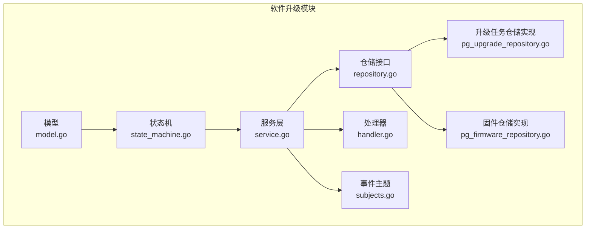
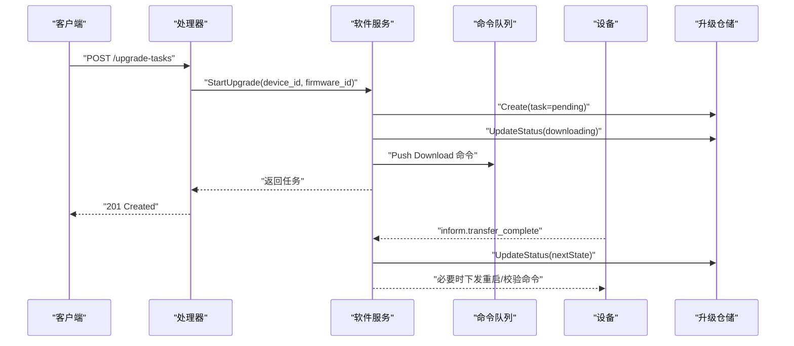
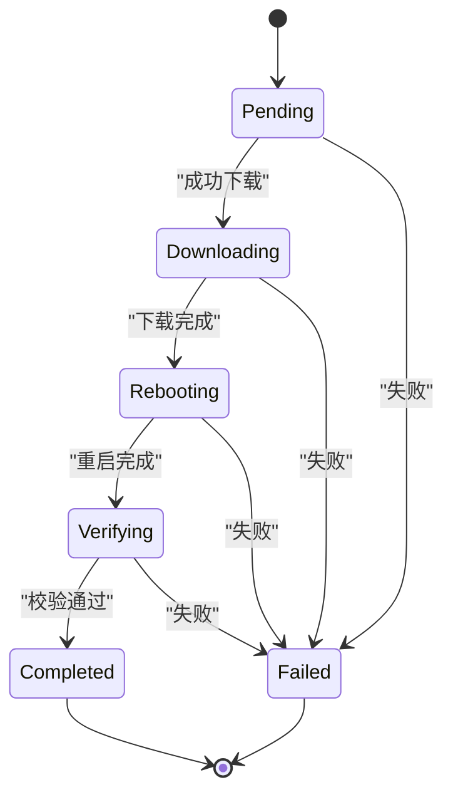
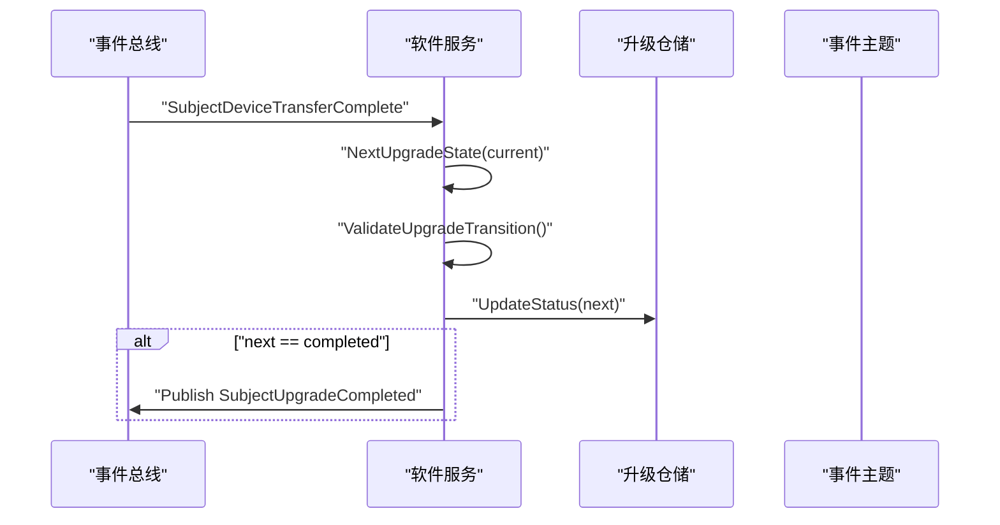
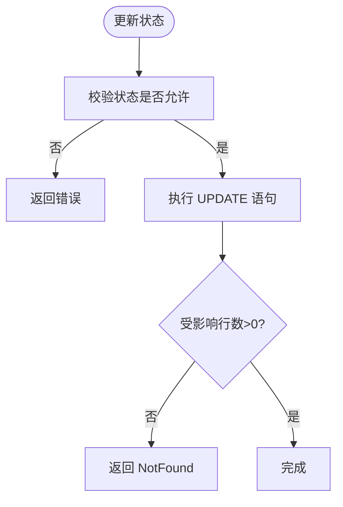
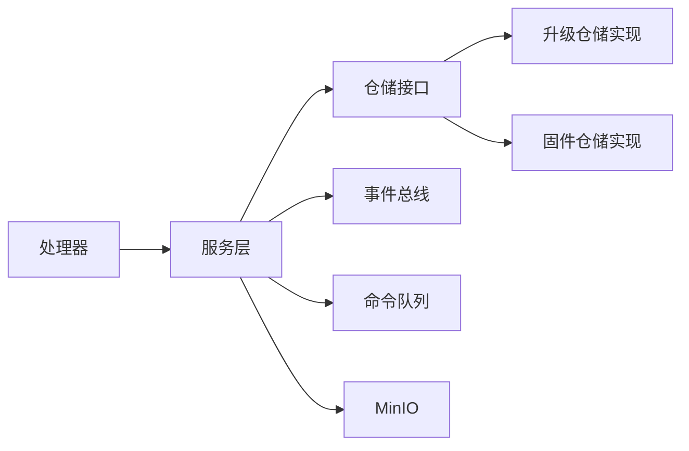

# 升级状态机

<cite>
**本文引用的文件**
- [state_machine.go](file://omcgo/internal/software/state_machine.go)
- [model.go](file://omcgo/internal/software/model.go)
- [service.go](file://omcgo/internal/software/service.go)
- [repository.go](file://omcgo/internal/software/repository.go)
- [handler.go](file://omcgo/internal/software/handler.go)
- [pg_upgrade_repository.go](file://omcgo/internal/software/pg_upgrade_repository.go)
- [pg_firmware_repository.go](file://omcgo/internal/software/pg_firmware_repository.go)
- [000016_create_firmware.up.sql](file://omcgo/migrations/000016_create_firmware.up.sql)
- [subjects.go](file://omcgo/internal/core/event/subjects.go)
- [state_machine_test.go](file://omcgo/internal/software/state_machine_test.go)
</cite>

## 目录
1. [简介](#简介)
2. [项目结构](#项目结构)
3. [核心组件](#核心组件)
4. [架构总览](#架构总览)
5. [详细组件分析](#详细组件分析)
6. [依赖分析](#依赖分析)
7. [性能考虑](#性能考虑)
8. [故障排查指南](#故障排查指南)
9. [结论](#结论)
10. [附录](#附录)

## 简介
本文件围绕“升级状态机”功能，系统性阐述状态定义、状态转换规则、状态验证机制、事件驱动流转、状态持久化与并发安全、调试方法、状态查询与监控方案，并给出状态转换示例、错误处理策略与恢复机制。目标是帮助开发者与运维人员准确理解并高效维护该状态机。

## 项目结构
软件升级能力位于 omcgo 内部模块的 software 包中，采用分层设计：
- 模型层：定义升级状态与实体
- 状态机：定义允许的转换与校验
- 服务层：编排升级生命周期（触发、命令下发、事件推进）
- 仓储层：持久化升级任务与固件信息
- 处理器层：对外暴露 REST 接口
- 事件层：设备上报事件驱动状态推进
- 迁移层：数据库 schema 与索引

图表来源
- [model.go:10-52](file://omcgo/internal/software/model.go#L10-L52)
- [state_machine.go:5-14](file://omcgo/internal/software/state_machine.go#L5-L14)
- [service.go:20-31](file://omcgo/internal/software/service.go#L20-L31)
- [repository.go:10-26](file://omcgo/internal/software/repository.go#L10-L26)
- [pg_upgrade_repository.go:24-34](file://omcgo/internal/software/pg_upgrade_repository.go#L24-L34)
- [pg_firmware_repository.go:25-35](file://omcgo/internal/software/pg_firmware_repository.go#L25-L35)
- [handler.go:14-30](file://omcgo/internal/software/handler.go#L14-L30)
- [subjects.go:69-75](file://omcgo/internal/core/event/subjects.go#L69-L75)

章节来源
- [model.go:10-52](file://omcgo/internal/software/model.go#L10-L52)
- [state_machine.go:5-14](file://omcgo/internal/software/state_machine.go#L5-L14)
- [service.go:20-31](file://omcgo/internal/software/service.go#L20-L31)
- [repository.go:10-26](file://omcgo/internal/software/repository.go#L10-L26)
- [handler.go:32-45](file://omcgo/internal/software/handler.go#L32-L45)

## 核心组件
- 升级状态枚举：pending、downloading、rebooting、verifying、completed、failed
- 状态机：定义合法转换集合与校验函数
- 服务：触发升级、批量升级、事件驱动推进状态
- 仓储：升级任务与固件的 CRUD、列表与状态更新
- 处理器：REST API 对外暴露
- 事件：设备上报 transfer_complete 等事件驱动状态推进
- 数据库：schema 定义与索引优化

章节来源
- [model.go:10-20](file://omcgo/internal/software/model.go#L10-L20)
- [state_machine.go:5-14](file://omcgo/internal/software/state_machine.go#L5-L14)
- [service.go:92-162](file://omcgo/internal/software/service.go#L92-L162)
- [repository.go:18-26](file://omcgo/internal/software/repository.go#L18-L26)
- [handler.go:151-182](file://omcgo/internal/software/handler.go#L151-L182)
- [subjects.go:69-75](file://omcgo/internal/core/event/subjects.go#L69-L75)
- [000016_create_firmware.up.sql:26-50](file://omcgo/migrations/000016_create_firmware.up.sql#L26-L50)

## 架构总览
升级状态机以事件驱动为核心，结合服务层编排与仓储层持久化，形成闭环：
- 触发升级：服务层创建任务并推进到 downloading，同时下发下载命令
- 设备上报：设备在不同阶段上报事件（如 transfer_complete），服务层据此推进状态
- 终止条件：completed 或 failed 为终止态，不可再转换
- 查询接口：提供 REST 列表与详情查询

图表来源
- [handler.go:151-164](file://omcgo/internal/software/handler.go#L151-L164)
- [service.go:92-162](file://omcgo/internal/software/service.go#L92-L162)
- [service.go:245-290](file://omcgo/internal/software/service.go#L245-L290)
- [repository.go:18-26](file://omcgo/internal/software/repository.go#L18-L26)
- [subjects.go:9-11](file://omcgo/internal/core/event/subjects.go#L9-L11)

## 详细组件分析

### 状态定义与含义
- Pending：待下载。任务已创建，等待开始下载。
- Downloading：下载中。已下发下载命令，设备正在传输固件。
- Rebooting：重启中。下载完成后设备重启。
- Verifying：校验中。设备启动后进行版本校验。
- Completed：完成。升级成功。
- Failed：失败。升级失败，可记录错误信息。

章节来源
- [model.go:13-20](file://omcgo/internal/software/model.go#L13-L20)

### 状态转换规则与验证
- 合法转换：
  - pending → downloading | failed
  - downloading → rebooting | failed
  - rebooting → verifying | failed
  - verifying → completed | failed
- 终止态：completed、failed 不再允许任何转换
- 验证逻辑：通过映射表与校验函数判断当前态是否允许目标态；未知状态直接报错

图表来源
- [state_machine.go:5-14](file://omcgo/internal/software/state_machine.go#L5-L14)

章节来源
- [state_machine.go:16-30](file://omcgo/internal/software/state_machine.go#L16-L30)
- [state_machine_test.go:9-44](file://omcgo/internal/software/state_machine_test.go#L9-L44)

### 事件驱动机制
- 订阅主题：设备 inform.transfer_complete
- 处理流程：根据当前任务状态计算期望下一状态，校验后更新仓储；若到达 completed，发布 upgrade.completed 事件

图表来源
- [service.go:245-290](file://omcgo/internal/software/service.go#L245-L290)
- [subjects.go:9-11](file://omcgo/internal/core/event/subjects.go#L9-L11)
- [subjects.go:72-74](file://omcgo/internal/core/event/subjects.go#L72-L74)

章节来源
- [service.go:245-290](file://omcgo/internal/software/service.go#L245-L290)
- [subjects.go:69-75](file://omcgo/internal/core/event/subjects.go#L69-L75)

### 业务逻辑与前置条件
- 触发升级（单次）：
  - 校验设备与固件存在性
  - 确保设备无活动升级任务
  - 创建任务并推进到 downloading
  - 下发 Download 命令，必要时发送连接请求唤醒设备
- 批量升级：
  - 支持并发控制，逐台创建任务并推进到 downloading
  - 为每台设备下发 Download 命令与连接请求
- 事件推进：
  - 仅当存在活动任务时推进，否则忽略
  - 若校验不通过则记录警告并忽略

章节来源
- [service.go:92-162](file://omcgo/internal/software/service.go#L92-L162)
- [service.go:164-243](file://omcgo/internal/software/service.go#L164-L243)
- [service.go:245-290](file://omcgo/internal/software/service.go#L245-L290)

### 异常处理与错误策略
- 未知状态转换：返回明确错误，避免非法推进
- 无活动任务：事件处理忽略，不报错
- 更新失败：返回错误并记录日志
- 业务错误：如设备已有活动升级，返回业务错误码

章节来源
- [state_machine.go:19-29](file://omcgo/internal/software/state_machine.go#L19-L29)
- [service.go:106-110](file://omcgo/internal/software/service.go#L106-L110)
- [service.go:260-278](file://omcgo/internal/software/service.go#L260-L278)

### 状态持久化与并发安全
- 升级任务仓储：
  - Create：插入任务并回填 ID
  - UpdateStatus：按 ID 更新状态，首次 downloading 设置 started_at，completed/failed 设置 completed_at
  - List/Filter：支持按设备、固件、批次、状态过滤
- 并发安全：
  - 使用数据库事务与唯一索引保障幂等
  - 事件处理更新使用行级更新，未命中返回 NotFound
  - 批量升级使用信号量限制并发

图表来源
- [pg_upgrade_repository.go:112-141](file://omcgo/internal/software/pg_upgrade_repository.go#L112-L141)

章节来源
- [pg_upgrade_repository.go:67-91](file://omcgo/internal/software/pg_upgrade_repository.go#L67-L91)
- [pg_upgrade_repository.go:112-141](file://omcgo/internal/software/pg_upgrade_repository.go#L112-L141)
- [pg_firmware_repository.go:54-75](file://omcgo/internal/software/pg_firmware_repository.go#L54-L75)

### 状态查询接口与监控方案
- 查询接口：
  - GET /api/v1/upgrade-tasks：分页列出升级任务，支持按设备/固件/批次/状态过滤
  - GET /api/v1/upgrade-tasks/:id：获取单个任务详情
- 监控建议：
  - 指标：各状态任务数量、平均耗时（started_at 到 completed_at）、失败率
  - 告警：长时间停留在 downloading/rebooting/verifying 的任务
  - 日志：事件推进的警告与错误

章节来源
- [handler.go:121-149](file://omcgo/internal/software/handler.go#L121-L149)
- [000016_create_firmware.up.sql:42-45](file://omcgo/migrations/000016_create_firmware.up.sql#L42-L45)

### 调试方法
- 单元测试覆盖：
  - 转换合法性、终止态判断、期望下一状态
- 行为验证：
  - 事件驱动推进、未知状态转换报错
- 建议步骤：
  - 使用测试工具触发升级，观察状态变化
  - 模拟设备上报事件，验证推进链路
  - 查看日志中的状态推进与错误信息

章节来源
- [state_machine_test.go:9-80](file://omcgo/internal/software/state_machine_test.go#L9-L80)

## 依赖分析
- 组件耦合：
  - 服务层依赖仓储接口与事件总线
  - 仓储实现依赖数据库连接池
  - 处理器依赖服务层
- 外部依赖：
  - 命令队列用于下发 Download 命令
  - MinIO 用于固件存储
  - 设备 inform 事件用于推进状态

图表来源
- [handler.go:14-30](file://omcgo/internal/software/handler.go#L14-L30)
- [service.go:20-31](file://omcgo/internal/software/service.go#L20-L31)
- [repository.go:10-26](file://omcgo/internal/software/repository.go#L10-L26)
- [pg_upgrade_repository.go:24-34](file://omcgo/internal/software/pg_upgrade_repository.go#L24-L34)
- [pg_firmware_repository.go:25-35](file://omcgo/internal/software/pg_firmware_repository.go#L25-L35)

章节来源
- [service.go:13-29](file://omcgo/internal/software/service.go#L13-L29)
- [repository.go:10-26](file://omcgo/internal/software/repository.go#L10-L26)

## 性能考虑
- 数据库层面：
  - 为 upgrade_tasks 建立 device、firmware、batch、status 索引，提升查询与聚合效率
  - 使用 updated_at 触发器统一时间戳更新
- 服务层面：
  - 批量升级使用信号量控制并发，避免过载
  - 事件处理幂等：重复事件不会改变已完成任务状态
- 存储层面：
  - 固件对象路径按 carrier/product_class/version 组织，便于清理与检索

章节来源
- [000016_create_firmware.up.sql:17-24](file://omcgo/migrations/000016_create_firmware.up.sql#L17-L24)
- [000016_create_firmware.up.sql:42-50](file://omcgo/migrations/000016_create_firmware.up.sql#L42-L50)
- [service.go:164-175](file://omcgo/internal/software/service.go#L164-L175)

## 故障排查指南
- 常见问题与定位
  - 无法推进状态：检查当前任务状态与期望下一状态是否在允许集合内
  - 事件未生效：确认设备是否上报 transfer_complete，且存在活动任务
  - 更新失败：查看受影响行数是否为 0，确认任务 ID 有效
- 建议操作
  - 通过查询接口核对任务状态
  - 查看服务日志中的状态推进与错误信息
  - 在测试环境复现事件驱动流程，验证转换逻辑

章节来源
- [service.go:245-290](file://omcgo/internal/software/service.go#L245-L290)
- [pg_upgrade_repository.go:133-140](file://omcgo/internal/software/pg_upgrade_repository.go#L133-L140)

## 结论
升级状态机通过清晰的状态定义、严格的转换校验、事件驱动推进与完善的持久化设计，实现了从“触发升级”到“完成/失败”的完整闭环。配合 REST 查询接口与监控指标，能够满足生产环境的可观测性与稳定性要求。建议在上线前充分验证事件驱动链路与边界场景，确保状态推进的正确性与一致性。

## 附录

### 状态转换示例
- 正常链路：pending → downloading → rebooting → verifying → completed
- 失败回退：pending → failed；downloading → failed；rebooting → failed；verifying → failed
- 非法转换：如 pending → completed、completed → downloading 等会被拒绝

章节来源
- [state_machine_test.go:25-32](file://omcgo/internal/software/state_machine_test.go#L25-L32)

### 错误处理策略
- 未知状态：立即返回错误，阻止非法推进
- 无活动任务：事件处理忽略，不中断流程
- 更新失败：返回错误并记录日志，便于后续重试或人工干预

章节来源
- [state_machine.go:19-29](file://omcgo/internal/software/state_machine.go#L19-L29)
- [service.go:260-278](file://omcgo/internal/software/service.go#L260-L278)

### 状态恢复机制
- 终止态不可逆：completed/failed 为最终态
- 失败任务：可基于错误信息重试或重新触发升级
- 幂等设计：事件重复上报不会破坏状态一致性

章节来源
- [state_machine.go:32-35](file://omcgo/internal/software/state_machine.go#L32-L35)
- [service.go:245-290](file://omcgo/internal/software/service.go#L245-L290)