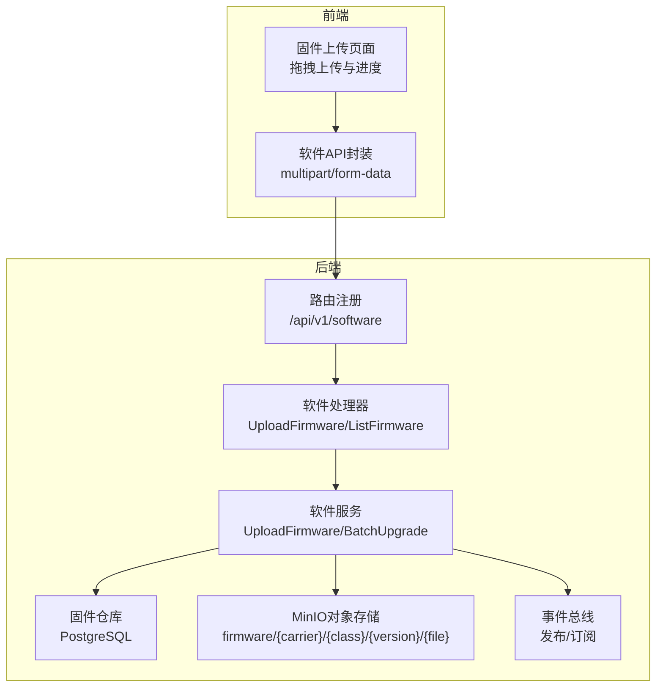
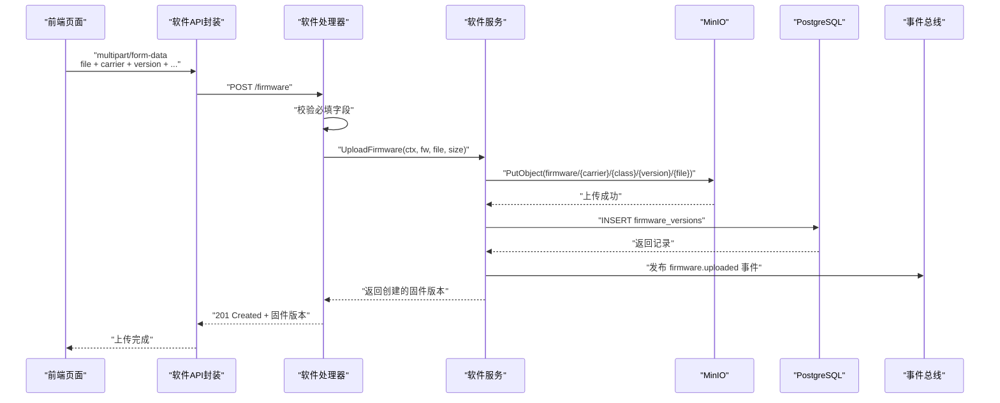
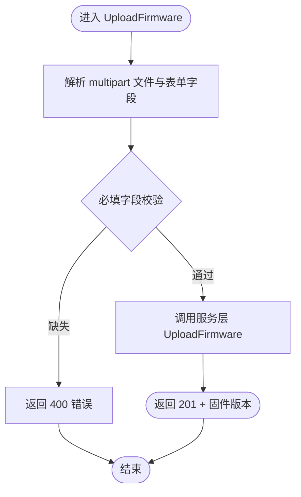
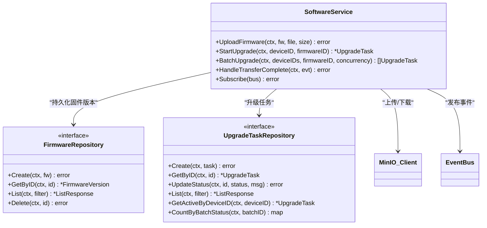
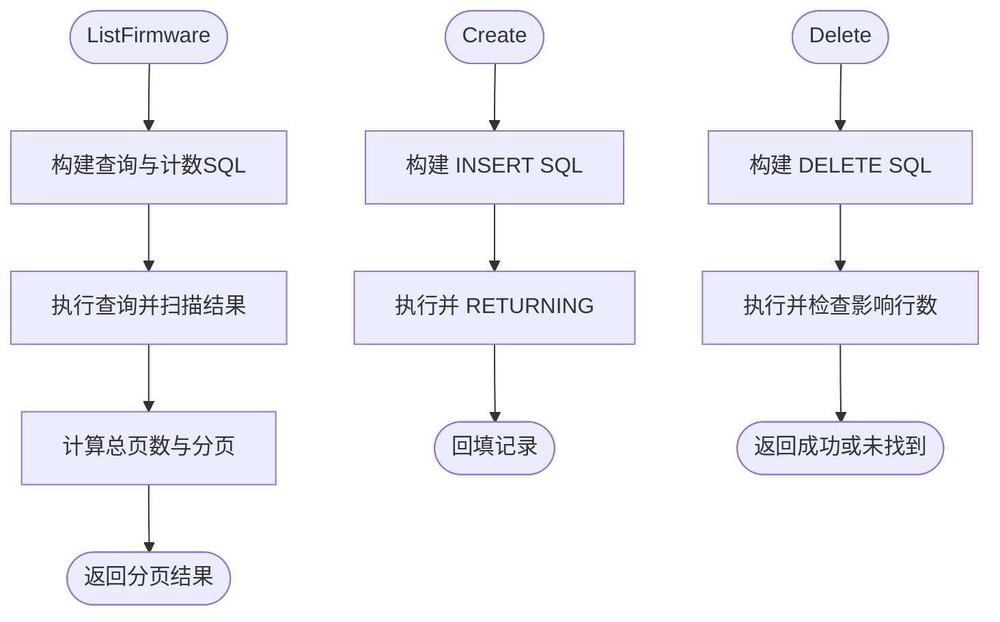
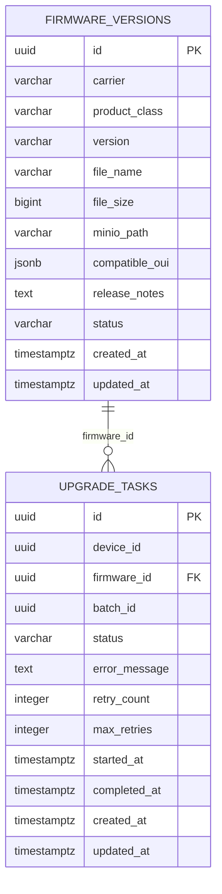
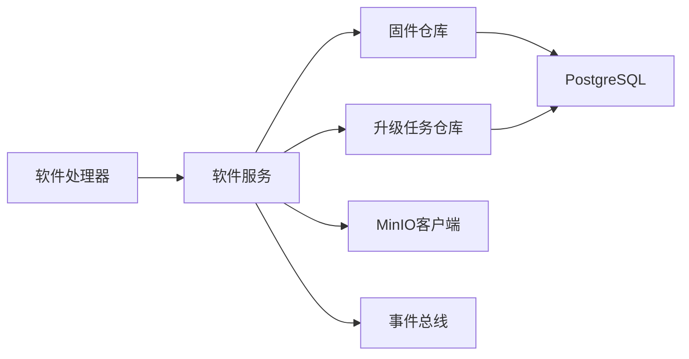

# 固件文件管理

<cite>
**本文引用的文件**   
- [omcgo/internal/software/handler.go](file://omcgo/internal/software/handler.go)
- [omcgo/internal/software/service.go](file://omcgo/internal/software/service.go)
- [omcgo/internal/software/model.go](file://omcgo/internal/software/model.go)
- [omcgo/internal/software/repository.go](file://omcgo/internal/software/repository.go)
- [omcgo/internal/software/pg_firmware_repository.go](file://omcgo/internal/software/pg_firmware_repository.go)
- [omcgo/migrations/000016_create_firmware.up.sql](file://omcgo/migrations/000016_create_firmware.up.sql)
- [omcgo/migrations/000016_create_firmware.down.sql](file://omcgo/migrations/000016_create_firmware.down.sql)
- [omcgo/internal/filemanager/handler.go](file://omcgo/internal/filemanager/handler.go)
- [omcgo/internal/filemanager/model.go](file://omcgo/internal/filemanager/model.go)
- [omcgo/internal/filemanager/repository.go](file://omcgo/internal/filemanager/repository.go)
- [omcgo/migrations/000023_create_managed_files.up.sql](file://omcgo/migrations/000023_create_managed_files.up.sql)
- [omcmb/webcode/src/services/api/softwareApi.ts](file://omcmb/webcode/src/services/api/softwareApi.ts)
- [omcmb/webcode/src/pages/software/FirmwareUpload/index.tsx](file://omcmb/webcode/src/pages/software/FirmwareUpload/index.tsx)
- [omcmb/design/04-modules/14-software-version/04-firmware-upload.md](file://omcmb/design/04-modules/14-software-version/04-firmware-upload.md)
- [omcmb/design/04-modules/15-file-management/07-firmware-file-management.md](file://omcmb/design/04-modules/15-file-management/07-firmware-file-management.md)
</cite>

## 目录
1. [简介](#简介)
2. [项目结构](#项目结构)
3. [核心组件](#核心组件)
4. [架构总览](#架构总览)
5. [详细组件分析](#详细组件分析)
6. [依赖关系分析](#依赖关系分析)
7. [性能考量](#性能考量)
8. [故障排除指南](#故障排除指南)
9. [结论](#结论)
10. [附录](#附录)

## 简介
本技术文档围绕固件文件管理功能，系统阐述固件上传流程、文件存储机制、版本控制策略与文件验证过程；详细说明固件元数据的存储结构、文件路径组织方式、大小限制与格式要求；并提供固件上传的API接口文档、错误处理机制与安全验证措施。此外，给出最佳实践、存储优化策略与备份恢复方案，并包含上传示例、文件校验方法与故障排除指南。

## 项目结构
固件文件管理由后端服务与前端界面协同实现：
- 后端提供REST API，负责固件上传、版本记录、升级任务调度与事件驱动的状态推进。
- 存储层使用PostgreSQL持久化元数据，使用MinIO对象存储固件文件。
- 前端通过拖拽上传与进度反馈，调用后端API完成固件版本入库与文件落盘。

**图表来源**
- [omcgo/internal/software/handler.go:32-45](file://omcgo/internal/software/handler.go#L32-L45)
- [omcgo/internal/software/service.go:58-90](file://omcgo/internal/software/service.go#L58-L90)
- [omcgo/internal/software/pg_firmware_repository.go:54-75](file://omcgo/internal/software/pg_firmware_repository.go#L54-L75)
- [omcgo/internal/filemanager/handler.go:86-146](file://omcgo/internal/filemanager/handler.go#L86-L146)

**章节来源**
- [omcgo/internal/software/handler.go:32-45](file://omcgo/internal/software/handler.go#L32-L45)
- [omcgo/internal/software/service.go:58-90](file://omcgo/internal/software/service.go#L58-L90)
- [omcgo/internal/software/pg_firmware_repository.go:19-23](file://omcgo/internal/software/pg_firmware_repository.go#L19-L23)
- [omcgo/migrations/000016_create_firmware.up.sql:1-25](file://omcgo/migrations/000016_create_firmware.up.sql#L1-L25)

## 核心组件
- 软件处理器（Handler）：暴露REST接口，接收multipart上传，校验请求参数，委派服务层处理。
- 软件服务（Service）：构建MinIO路径、上传文件、写入数据库、发布事件、推送下载命令。
- 固件仓库（PgFirmwareRepository）：基于SQL构建CRUD操作，支持分页与过滤。
- 数据模型（Model）：定义固件版本、升级任务、过滤条件等结构体。
- 文件管理处理器（FileManager Handler）：通用文件上传/下载/分发，用于非固件类文件管理（可复用固件文件管理的MinIO路径策略）。

**章节来源**
- [omcgo/internal/software/handler.go:14-30](file://omcgo/internal/software/handler.go#L14-L30)
- [omcgo/internal/software/service.go:20-56](file://omcgo/internal/software/service.go#L20-L56)
- [omcgo/internal/software/pg_firmware_repository.go:27-35](file://omcgo/internal/software/pg_firmware_repository.go#L27-L35)
- [omcgo/internal/software/model.go:22-52](file://omcgo/internal/software/model.go#L22-L52)
- [omcgo/internal/filemanager/handler.go:20-38](file://omcgo/internal/filemanager/handler.go#L20-L38)

## 架构总览
固件上传端到端流程如下：

**图表来源**
- [omcgo/internal/software/handler.go:62-90](file://omcgo/internal/software/handler.go#L62-L90)
- [omcgo/internal/software/service.go:58-90](file://omcgo/internal/software/service.go#L58-L90)
- [omcgo/internal/software/pg_firmware_repository.go:54-75](file://omcgo/internal/software/pg_firmware_repository.go#L54-L75)
- [omcgo/migrations/000016_create_firmware.up.sql:1-15](file://omcgo/migrations/000016_create_firmware.up.sql#L1-L15)

## 详细组件分析

### 1) 软件处理器（HTTP接口）
- 路由注册：/firmware 支持列表、上传、按ID获取、删除。
- 上传接口：解析multipart文件，读取表单字段（carrier、version、product_class、release_notes），进行基础校验后调用服务层。
- 获取与删除：按ID查询与删除固件版本记录。

**图表来源**
- [omcgo/internal/software/handler.go:62-90](file://omcgo/internal/software/handler.go#L62-L90)

**章节来源**
- [omcgo/internal/software/handler.go:32-45](file://omcgo/internal/software/handler.go#L32-L45)
- [omcgo/internal/software/handler.go:62-90](file://omcgo/internal/software/handler.go#L62-L90)

### 2) 软件服务（业务逻辑）
- 上传流程：构造MinIO路径（firmware/{carrier}/{product_class}/{version}/{file_name}），以二进制流上传，记录文件大小与路径，创建版本记录，发布“固件已上传”事件。
- 单次升级：校验设备与固件存在性，检查是否存在活动升级，创建任务并推送到命令队列，必要时发送连接请求唤醒设备。
- 批量升级：并发控制（信号量），为每个设备创建任务并推送下载命令，更新状态为“下载中”。

**图表来源**
- [omcgo/internal/software/service.go:20-56](file://omcgo/internal/software/service.go#L20-L56)
- [omcgo/internal/software/repository.go:10-26](file://omcgo/internal/software/repository.go#L10-L26)

**章节来源**
- [omcgo/internal/software/service.go:58-90](file://omcgo/internal/software/service.go#L58-L90)
- [omcgo/internal/software/service.go:92-162](file://omcgo/internal/software/service.go#L92-L162)
- [omcgo/internal/software/service.go:164-243](file://omcgo/internal/software/service.go#L164-L243)

### 3) 固件仓库（数据持久化）
- 列出固件：支持按运营商、产品类别过滤，分页排序（按创建时间倒序）。
- 创建固件：插入记录并回填主键与时间戳。
- 删除固件：按ID删除，不存在则返回未找到。

**图表来源**
- [omcgo/internal/software/pg_firmware_repository.go:96-176](file://omcgo/internal/software/pg_firmware_repository.go#L96-L176)
- [omcgo/internal/software/pg_firmware_repository.go:54-75](file://omcgo/internal/software/pg_firmware_repository.go#L54-L75)
- [omcgo/internal/software/pg_firmware_repository.go:178-194](file://omcgo/internal/software/pg_firmware_repository.go#L178-L194)

**章节来源**
- [omcgo/internal/software/pg_firmware_repository.go:96-176](file://omcgo/internal/software/pg_firmware_repository.go#L96-L176)
- [omcgo/internal/software/pg_firmware_repository.go:54-75](file://omcgo/internal/software/pg_firmware_repository.go#L54-L75)
- [omcgo/internal/software/pg_firmware_repository.go:178-194](file://omcgo/internal/software/pg_firmware_repository.go#L178-L194)

### 4) 数据模型与数据库结构
- 固件版本模型：包含运营商、产品类别、版本号、文件名、文件大小、MinIO路径、兼容OUI、发布说明、状态、时间戳。
- 升级任务模型：设备ID、固件ID、批次ID、状态、重试次数、开始/完成时间、创建/更新时间。
- 数据库表结构：firmware_versions（含唯一索引：carrier+product_class+version），触发器维护updated_at；upgrade_tasks关联firmware_versions。

**图表来源**
- [omcgo/migrations/000016_create_firmware.up.sql:1-51](file://omcgo/migrations/000016_create_firmware.up.sql#L1-L51)
- [omcgo/internal/software/model.go:22-52](file://omcgo/internal/software/model.go#L22-L52)

**章节来源**
- [omcgo/internal/software/model.go:22-52](file://omcgo/internal/software/model.go#L22-L52)
- [omcgo/migrations/000016_create_firmware.up.sql:1-25](file://omcgo/migrations/000016_create_firmware.up.sql#L1-L25)

### 5) 文件存储机制与路径组织
- MinIO路径策略：firmware/{carrier}/{product_class}/{version}/{file_name}，便于按运营商、产品类别、版本聚合与清理。
- 文件内容类型：上传时默认octet-stream，便于二进制固件传输。
- 元数据持久化：记录文件名、大小、MinIO路径、状态、创建/更新时间。

**章节来源**
- [omcgo/internal/software/service.go:58-90](file://omcgo/internal/software/service.go#L58-L90)
- [omcgo/internal/software/model.go:22-36](file://omcgo/internal/software/model.go#L22-L36)

### 6) 版本控制策略
- 唯一约束：carrier+product_class+version，避免重复版本覆盖。
- 状态字段：默认active，可用于灰度与禁用。
- 兼容OUI：JSON数组，标识可升级的设备厂商前缀集合。

**章节来源**
- [omcgo/migrations/000016_create_firmware.up.sql:17-20](file://omcgo/migrations/000016_create_firmware.up.sql#L17-L20)
- [omcgo/internal/software/model.go:22-36](file://omcgo/internal/software/model.go#L22-L36)

### 7) 文件验证与完整性保障
- 上传完成后的MD5校验：在前端设计文档中明确“上传完成后自动校验”，建议在服务层补充哈希计算与比对逻辑，确保文件一致性。
- 事件驱动状态机：设备上报传输完成事件后，服务推进升级状态（下载中→重启中→验证中→完成）。

**章节来源**
- [omcmb/design/04-modules/14-software-version/04-firmware-upload.md:147-155](file://omcmb/design/04-modules/14-software-version/04-firmware-upload.md#L147-L155)
- [omcgo/internal/software/service.go:245-290](file://omcgo/internal/software/service.go#L245-L290)

### 8) API接口文档（固件上传）
- 路径：POST /api/v1/software/firmware
- 请求头：Content-Type: multipart/form-data
- 请求体字段：
  - file: 二进制文件（.bin/.img/.tar.gz/.zip）
  - carrier: 运营商代码（必填）
  - version: 版本号（必填）
  - product_class: 产品类别（可选）
  - release_notes: 发布说明（可选）
- 成功响应：201 Created，返回固件版本对象（包含id、carrier、product_class、version、file_name、file_size、minio_path、compatible_oui、release_notes、status、created_at、updated_at）

**章节来源**
- [omcgo/internal/software/handler.go:62-90](file://omcgo/internal/software/handler.go#L62-L90)
- [omcgo/internal/software/service.go:58-90](file://omcgo/internal/software/service.go#L58-L90)
- [omcmb/webcode/src/services/api/softwareApi.ts:183-211](file://omcmb/webcode/src/services/api/softwareApi.ts#L183-L211)

### 9) 前端上传交互与校验
- 支持拖拽上传，限制文件类型为.tar.gz、.zip、.bin、.img。
- 显示上传进度，最大文件大小2GB（依据设计文档）。
- 上传完成后触发服务层校验（MD5）与事件发布。

**章节来源**
- [omcmb/webcode/src/pages/software/FirmwareUpload/index.tsx:186-207](file://omcmb/webcode/src/pages/software/FirmwareUpload/index.tsx#L186-L207)
- [omcmb/design/04-modules/14-software-version/04-firmware-upload.md:147-155](file://omcmb/design/04-modules/14-software-version/04-firmware-upload.md#L147-L155)

### 10) 错误处理机制
- 参数校验失败：返回400错误，携带业务错误码与消息。
- 未找到资源：返回404错误。
- 业务冲突（如设备已有活动升级）：返回业务错误。
- 存储异常：返回500错误，记录日志以便排查。

**章节来源**
- [omcgo/internal/software/handler.go:78-82](file://omcgo/internal/software/handler.go#L78-L82)
- [omcgo/internal/software/service.go:106-111](file://omcgo/internal/software/service.go#L106-L111)

### 11) 安全验证措施
- 认证与授权：前端调用需具备相应权限（软件:firmware:upload），后端路由由中间件保护。
- 输入校验：必填字段校验、文件类型白名单、大小限制。
- 事件驱动：通过事件总线解耦升级状态推进，避免直接暴露内部状态机细节。

**章节来源**
- [omcmb/design/04-modules/14-software-version/04-firmware-upload.md:212-222](file://omcmb/design/04-modules/14-software-version/04-firmware-upload.md#L212-L222)
- [omcgo/internal/software/service.go:245-290](file://omcgo/internal/software/service.go#L245-L290)

## 依赖关系分析
- 组件耦合：
  - Handler依赖Service；Service依赖FirmwareRepository、UpgradeTaskRepository、MinIO客户端与事件总线。
  - 数据库Schema由迁移脚本定义，仓库实现依赖SQL构建器。
- 外部依赖：
  - MinIO SDK用于对象存储；PostgreSQL通过pgx访问；事件总线用于跨模块通信。

**图表来源**
- [omcgo/internal/software/handler.go:14-30](file://omcgo/internal/software/handler.go#L14-L30)
- [omcgo/internal/software/service.go:20-56](file://omcgo/internal/software/service.go#L20-L56)
- [omcgo/internal/software/pg_firmware_repository.go:27-35](file://omcgo/internal/software/pg_firmware_repository.go#L27-L35)

**章节来源**
- [omcgo/internal/software/handler.go:14-30](file://omcgo/internal/software/handler.go#L14-L30)
- [omcgo/internal/software/service.go:20-56](file://omcgo/internal/software/service.go#L20-L56)
- [omcgo/internal/software/pg_firmware_repository.go:27-35](file://omcgo/internal/software/pg_firmware_repository.go#L27-L35)

## 性能考量
- 并发批量升级：通过信号量控制并发度，默认5，避免对设备与网络造成瞬时压力。
- 分页查询：列表接口内置分页与排序，避免一次性加载过多记录。
- 索引优化：firmware_versions上建立运营商、(carrier,product_class)与唯一版本索引，提升查询效率。
- 对象存储：按版本聚合的路径结构便于冷热分层与生命周期管理。

**章节来源**
- [omcgo/internal/software/service.go:164-243](file://omcgo/internal/software/service.go#L164-L243)
- [omcgo/migrations/000016_create_firmware.up.sql:17-20](file://omcgo/migrations/000016_create_firmware.up.sql#L17-L20)

## 故障排除指南
- 上传失败（500）：检查MinIO连接、桶权限与路径权限；查看服务日志定位PutObject错误。
- 400参数错误：确认carrier与version必填字段是否缺失；检查文件类型是否在白名单内。
- 404资源不存在：确认firmware版本ID或文件ID是否正确。
- 设备无响应：确认连接请求URL配置；检查命令队列是否正常推送下载命令。
- 升级卡住：检查事件总线订阅是否生效；核对设备上报的传输完成事件是否被正确处理。

**章节来源**
- [omcgo/internal/software/handler.go:62-90](file://omcgo/internal/software/handler.go#L62-L90)
- [omcgo/internal/software/service.go:92-162](file://omcgo/internal/software/service.go#L92-L162)
- [omcgo/internal/software/service.go:245-290](file://omcgo/internal/software/service.go#L245-L290)

## 结论
固件文件管理通过清晰的职责划分与事件驱动机制，实现了从上传、存储、版本控制到升级任务的完整闭环。合理的路径组织、索引与并发策略提升了系统性能与可维护性。建议在后续迭代中完善服务层的MD5校验与断点续传能力，进一步增强可靠性与用户体验。

## 附录

### A. 文件元数据与存储结构对照
- 固件版本表字段映射至模型字段，兼容OUI以JSONB存储，便于灵活扩展。
- 升级任务表与固件版本表关联，支持按批次与状态统计。

**章节来源**
- [omcgo/internal/software/model.go:22-52](file://omcgo/internal/software/model.go#L22-L52)
- [omcgo/migrations/000016_create_firmware.up.sql:1-51](file://omcgo/migrations/000016_create_firmware.up.sql#L1-L51)

### B. 文件路径组织与清理策略
- 路径：firmware/{carrier}/{product_class}/{version}/{file_name}
- 清理建议：删除固件版本记录时，应同步删除对应MinIO对象；可结合生命周期策略对旧版本进行归档或删除。

**章节来源**
- [omcgo/internal/software/service.go:58-90](file://omcgo/internal/software/service.go#L58-L90)
- [omcgo/internal/software/pg_firmware_repository.go:178-194](file://omcgo/internal/software/pg_firmware_repository.go#L178-L194)

### C. 最佳实践与备份恢复
- 最佳实践：
  - 上传前进行文件类型与大小校验；上传后进行哈希校验；使用唯一版本号与产品类别组合避免冲突。
  - 使用事件驱动推进升级状态，保证可观测性与可追溯性。
- 备份恢复：
  - PostgreSQL定期备份；MinIO对象存储建议开启版本化与生命周期策略；升级任务状态可作为恢复依据。

**章节来源**
- [omcmb/design/04-modules/14-software-version/04-firmware-upload.md:147-155](file://omcmb/design/04-modules/14-software-version/04-firmware-upload.md#L147-L155)
- [omcgo/migrations/000016_create_firmware.up.sql:1-25](file://omcgo/migrations/000016_create_firmware.up.sql#L1-L25)