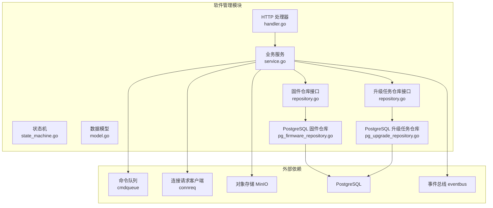
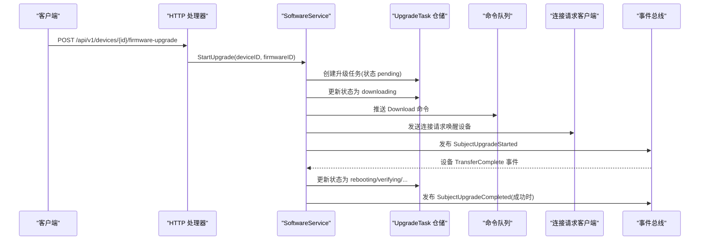
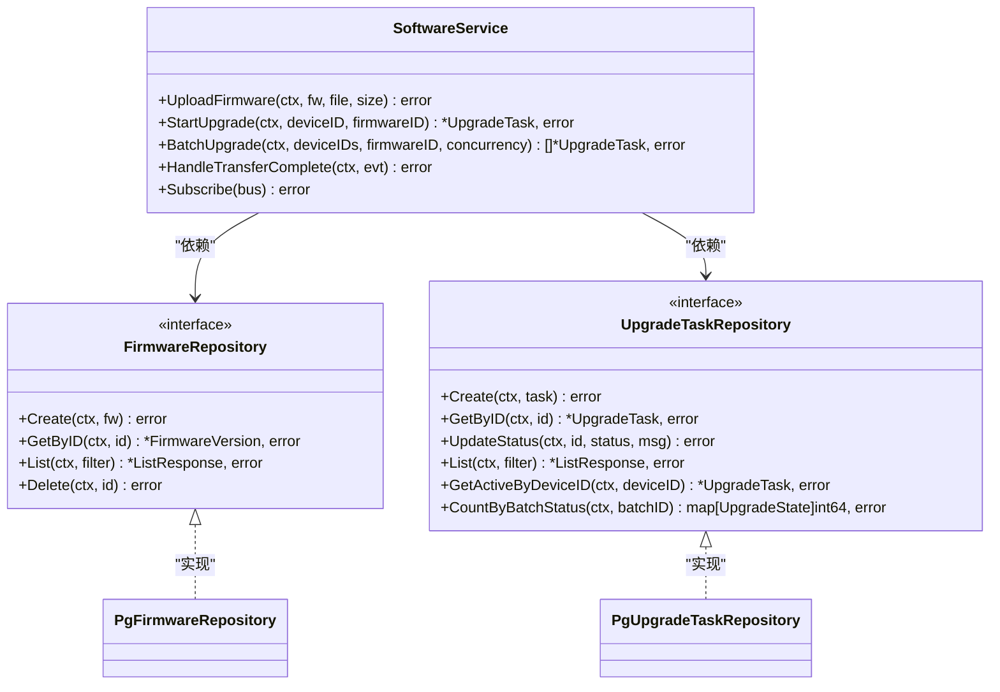
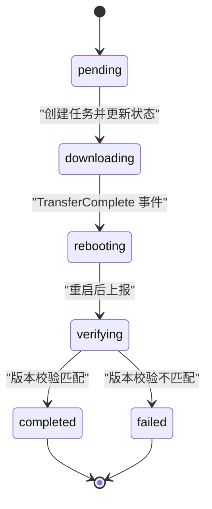
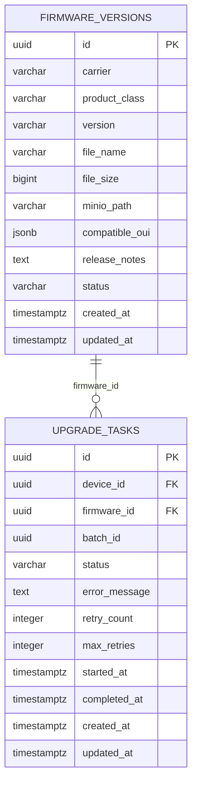
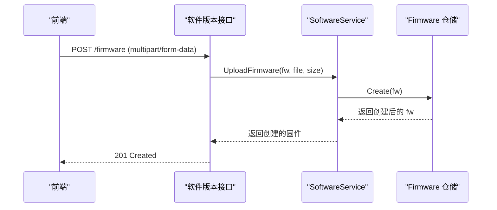
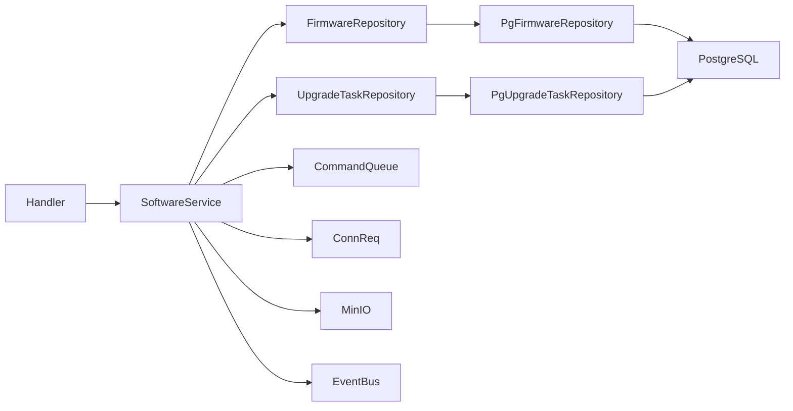

# 软件管理模块

<cite>
**本文引用的文件**
- [软件管理模块设计文档](file://omcgo/docs/detailed-design/14-software-management.md)
- [服务实现 service.go](file://omcgo/internal/software/service.go)
- [数据模型 model.go](file://omcgo/internal/software/model.go)
- [状态机 state_machine.go](file://omcgo/internal/software/state_machine.go)
- [仓库接口 repository.go](file://omcgo/internal/software/repository.go)
- [PostgreSQL 固件仓库 pg_firmware_repository.go](file://omcgo/internal/software/pg_firmware_repository.go)
- [PostgreSQL 升级任务仓库 pg_upgrade_repository.go](file://omcgo/internal/software/pg_upgrade_repository.go)
- [HTTP 处理器 handler.go](file://omcgo/internal/software/handler.go)
- [单元测试 service_test.go](file://omcgo/internal/software/service_test.go)
- [数据库迁移 000016_create_firmware.up.sql](file://omcgo/migrations/000016_create_firmware.up.sql)
- [数据库迁移 000016_create_firmware.down.sql](file://omcgo/migrations/000016_create_firmware.down.sql)
- [前端 API 调用软件版本接口](file://omcmb/webcode/src/services/api/softwareApi.ts)
</cite>

## 目录
1. [简介](#简介)
2. [项目结构](#项目结构)
3. [核心组件](#核心组件)
4. [架构总览](#架构总览)
5. [详细组件分析](#详细组件分析)
6. [依赖关系分析](#依赖关系分析)
7. [性能考量](#性能考量)
8. [故障排除指南](#故障排除指南)
9. [结论](#结论)
10. [附录](#附录)

## 简介
本文件为“软件管理模块”的全面技术文档，聚焦于固件升级的完整流程、版本控制机制、升级策略配置与执行、软件状态机设计与实现、升级任务调度与监控、升级结果验证与回滚机制、固件文件上传与管理、版本信息存储与查询、升级进度跟踪与通知等主题。同时提供最佳实践、安全与风险控制建议，并给出升级流程示例、API 使用指南与故障排除方法。

## 项目结构
软件管理模块位于后端工程的 internal/software 目录下，采用分层设计：HTTP 层（Handler）、业务层（Service）、仓储层（Repository + PostgreSQL 实现）、状态机与数据模型。前端通过统一的软件版本接口进行上传与管理。

图表来源
- [HTTP 处理器 handler.go:1-183](file://omcgo/internal/software/handler.go#L1-L183)
- [业务服务 service.go:1-299](file://omcgo/internal/software/service.go#L1-L299)
- [状态机 state_machine.go:1-52](file://omcgo/internal/software/state_machine.go#L1-L52)
- [数据模型 model.go:1-82](file://omcgo/internal/software/model.go#L1-L82)
- [仓库接口 repository.go:1-27](file://omcgo/internal/software/repository.go#L1-L27)
- [PostgreSQL 固件仓库 pg_firmware_repository.go:1-206](file://omcgo/internal/software/pg_firmware_repository.go#L1-L206)
- [PostgreSQL 升级任务仓库 pg_upgrade_repository.go:1-298](file://omcgo/internal/software/pg_upgrade_repository.go#L1-L298)

章节来源
- [软件管理模块设计文档:1-162](file://omcgo/docs/detailed-design/14-software-management.md#L1-L162)
- [HTTP 处理器 handler.go:1-183](file://omcgo/internal/software/handler.go#L1-L183)
- [业务服务 service.go:1-299](file://omcgo/internal/software/service.go#L1-L299)
- [状态机 state_machine.go:1-52](file://omcgo/internal/software/state_machine.go#L1-L52)
- [数据模型 model.go:1-82](file://omcgo/internal/software/model.go#L1-L82)
- [仓库接口 repository.go:1-27](file://omcgo/internal/software/repository.go#L1-L27)
- [PostgreSQL 固件仓库 pg_firmware_repository.go:1-206](file://omcgo/internal/software/pg_firmware_repository.go#L1-L206)
- [PostgreSQL 升级任务仓库 pg_upgrade_repository.go:1-298](file://omcgo/internal/software/pg_upgrade_repository.go#L1-L298)

## 核心组件
- 业务服务 SoftwareService：封装固件上传、单设备/批量升级触发、事件处理与状态推进、并发控制与错误处理。
- 数据模型：定义固件版本、升级任务、过滤参数与请求体结构。
- 状态机：定义升级状态与合法转换，确保升级流程的有序性。
- 仓储层：抽象持久化接口，提供 PostgreSQL 实现以支持分页、过滤、聚合统计。
- HTTP 处理器：暴露 REST API，绑定请求参数并调用服务层。
- 事件与通知：通过事件总线发布上传完成、升级开始、升级完成等事件，供其他模块订阅。

章节来源
- [业务服务 service.go:20-56](file://omcgo/internal/software/service.go#L20-L56)
- [数据模型 model.go:10-82](file://omcgo/internal/software/model.go#L10-L82)
- [状态机 state_machine.go:5-52](file://omcgo/internal/software/state_machine.go#L5-L52)
- [仓库接口 repository.go:10-27](file://omcgo/internal/software/repository.go#L10-L27)
- [HTTP 处理器 handler.go:14-45](file://omcgo/internal/software/handler.go#L14-L45)

## 架构总览
软件管理模块遵循清晰的分层与解耦原则：
- 表现层：HTTP 路由与控制器，负责参数校验与响应。
- 领域层：业务服务封装核心升级编排，协调命令队列、连接请求、对象存储与事件总线。
- 持久层：PostgreSQL 仓储实现，提供高效查询与统计能力。
- 外部集成：MinIO 对象存储用于固件文件；TR-069 下载命令通过命令队列下发；设备连接请求触发设备主动上报。

图表来源
- [HTTP 处理器 handler.go:151-164](file://omcgo/internal/software/handler.go#L151-L164)
- [业务服务 service.go:92-162](file://omcgo/internal/software/service.go#L92-L162)
- [业务服务 service.go:245-290](file://omcgo/internal/software/service.go#L245-L290)

章节来源
- [软件管理模块设计文档:81-93](file://omcgo/docs/detailed-design/14-software-management.md#L81-L93)
- [业务服务 service.go:92-162](file://omcgo/internal/software/service.go#L92-L162)
- [HTTP 处理器 handler.go:151-164](file://omcgo/internal/software/handler.go#L151-L164)

## 详细组件分析

### 组件一：软件服务 SoftwareService
- 职责
  - 固件上传：写入 MinIO，记录版本元数据，发布上传事件。
  - 单设备升级：校验设备与固件、检查活动任务、创建任务、推进状态、下发 Download 命令、发送连接请求、发布事件。
  - 批量升级：并发控制（信号量），批量创建任务并下发命令，支持批内状态统计。
  - 事件处理：监听 TransferComplete，推进状态机，发布完成事件。
  - 订阅注册：注册事件订阅以便异步处理设备上报。
- 关键点
  - 状态推进：NextUpgradeState 提供“顺路”状态，ValidateUpgradeTransition 确保合法性。
  - 错误处理：业务错误码与通用错误映射，日志记录。
  - 并发：批量升级使用 goroutine + 信号量，避免资源争用。
  - 重试：升级任务内置最大重试次数字段，便于后续扩展重试策略。

图表来源
- [业务服务 service.go:20-56](file://omcgo/internal/software/service.go#L20-L56)
- [仓库接口 repository.go:10-27](file://omcgo/internal/software/repository.go#L10-L27)
- [PostgreSQL 固件仓库 pg_firmware_repository.go:27-35](file://omcgo/internal/software/pg_firmware_repository.go#L27-L35)
- [PostgreSQL 升级任务仓库 pg_upgrade_repository.go:26-34](file://omcgo/internal/software/pg_upgrade_repository.go#L26-L34)

章节来源
- [业务服务 service.go:58-90](file://omcgo/internal/software/service.go#L58-L90)
- [业务服务 service.go:92-162](file://omcgo/internal/software/service.go#L92-L162)
- [业务服务 service.go:164-243](file://omcgo/internal/software/service.go#L164-L243)
- [业务服务 service.go:245-290](file://omcgo/internal/software/service.go#L245-L290)
- [状态机 state_machine.go:16-51](file://omcgo/internal/software/state_machine.go#L16-L51)
- [仓库接口 repository.go:10-27](file://omcgo/internal/software/repository.go#L10-L27)

### 组件二：状态机与升级流程
- 状态定义：pending → downloading → rebooting → verifying → completed 或 failed。
- 合法转换：仅允许顺路推进，failed/completed 为终止状态。
- 事件驱动：TransferComplete 事件触发状态推进，最终完成或失败。

图表来源
- [状态机 state_machine.go:5-51](file://omcgo/internal/software/state_machine.go#L5-L51)
- [业务服务 service.go:245-290](file://omcgo/internal/software/service.go#L245-L290)

章节来源
- [状态机 state_machine.go:5-51](file://omcgo/internal/software/state_machine.go#L5-L51)
- [软件管理模块设计文档:81-93](file://omcgo/docs/detailed-design/14-software-management.md#L81-L93)

### 组件三：仓储层与数据库设计
- 固件版本表 firmware_versions：存储 carrier、product_class、version、文件名、大小、MinIO 路径、兼容 OUI 列表、发布说明、状态与时间戳。
- 升级任务表 upgrade_tasks：关联设备与固件，批 ID、状态、错误信息、重试计数、起止时间与创建时间。
- 索引与触发器：为高频查询建立索引，使用更新时间戳触发器保持记录时效。
- 分页与过滤：仓储实现支持分页、过滤与聚合统计，便于前端展示与运营分析。

图表来源
- [数据库迁移 000016_create_firmware.up.sql:1-51](file://omcgo/migrations/000016_create_firmware.up.sql#L1-L51)
- [PostgreSQL 固件仓库 pg_firmware_repository.go:19-52](file://omcgo/internal/software/pg_firmware_repository.go#L19-L52)
- [PostgreSQL 升级任务仓库 pg_upgrade_repository.go:18-65](file://omcgo/internal/software/pg_upgrade_repository.go#L18-L65)

章节来源
- [数据库迁移 000016_create_firmware.up.sql:1-51](file://omcgo/migrations/000016_create_firmware.up.sql#L1-L51)
- [PostgreSQL 固件仓库 pg_firmware_repository.go:54-94](file://omcgo/internal/software/pg_firmware_repository.go#L54-L94)
- [PostgreSQL 升级任务仓库 pg_upgrade_repository.go:67-110](file://omcgo/internal/software/pg_upgrade_repository.go#L67-L110)
- [PostgreSQL 升级任务仓库 pg_upgrade_repository.go:247-269](file://omcgo/internal/software/pg_upgrade_repository.go#L247-L269)

### 组件四：HTTP 接口与前端交互
- 接口清单
  - GET /api/v1/firmware：列出固件版本（支持 carrier、product_class 分页过滤）
  - POST /api/v1/firmware：上传固件（multipart/form-data）
  - GET /api/v1/firmware/:id：获取固件详情
  - DELETE /api/v1/firmware/:id：删除固件
  - GET /api/v1/upgrade-tasks：列出升级任务（支持 device_id、firmware_id、batch_id、status 分页过滤）
  - GET /api/v1/upgrade-tasks/:id：获取升级任务详情
  - POST /api/v1/upgrade-tasks：触发单设备升级
  - POST /api/v1/upgrade-tasks/batch：触发批量升级
- 前端调用
  - 上传固件：通过 multipart/form-data 调用 /firmware，设置超时与内容类型。
  - 获取升级计划：拉取 /upgrade-tasks 并按 batch 聚合统计。

图表来源
- [HTTP 处理器 handler.go:62-90](file://omcgo/internal/software/handler.go#L62-L90)
- [业务服务 service.go:58-90](file://omcgo/internal/software/service.go#L58-L90)
- [前端 API 调用软件版本接口:183-211](file://omcmb/webcode/src/services/api/softwareApi.ts#L183-L211)

章节来源
- [软件管理模块设计文档:131-139](file://omcgo/docs/detailed-design/14-software-management.md#L131-L139)
- [HTTP 处理器 handler.go:32-45](file://omcgo/internal/software/handler.go#L32-L45)
- [HTTP 处理器 handler.go:62-90](file://omcgo/internal/software/handler.go#L62-L90)
- [HTTP 处理器 handler.go:121-149](file://omcgo/internal/software/handler.go#L121-L149)
- [HTTP 处理器 handler.go:151-182](file://omcgo/internal/software/handler.go#L151-L182)
- [前端 API 调用软件版本接口:183-211](file://omcmb/webcode/src/services/api/softwareApi.ts#L183-L211)

## 依赖关系分析
- 内聚与耦合
  - SoftwareService 通过接口依赖 FirmwareRepository 与 UpgradeTaskRepository，降低对具体实现的耦合。
  - Handler 仅依赖服务与仓储接口，保持薄控制器。
- 外部依赖
  - MinIO：用于固件文件存储与访问。
  - 命令队列：用于下发 TR-069 Download 命令。
  - 连接请求：用于唤醒设备主动上报。
  - 事件总线：用于跨模块解耦的通知与编排。
- 循环依赖
  - 未发现循环依赖，模块边界清晰。

图表来源
- [业务服务 service.go:20-56](file://omcgo/internal/software/service.go#L20-L56)
- [HTTP 处理器 handler.go:14-30](file://omcgo/internal/software/handler.go#L14-L30)
- [PostgreSQL 固件仓库 pg_firmware_repository.go:27-35](file://omcgo/internal/software/pg_firmware_repository.go#L27-L35)
- [PostgreSQL 升级任务仓库 pg_upgrade_repository.go:26-34](file://omcgo/internal/software/pg_upgrade_repository.go#L26-L34)

章节来源
- [业务服务 service.go:20-56](file://omcgo/internal/software/service.go#L20-L56)
- [HTTP 处理器 handler.go:14-30](file://omcgo/internal/software/handler.go#L14-L30)
- [仓库接口 repository.go:10-27](file://omcgo/internal/software/repository.go#L10-L27)

## 性能考量
- 批量升级并发控制：使用信号量限制并发度，避免对命令队列与设备造成瞬时压力。
- 数据库索引：为 carrier、product_class、version、device_id、firmware_id、batch_id、status 建立索引，提升查询与统计效率。
- 分页与过滤：仓储实现支持分页与多维过滤，避免一次性返回大量数据。
- 对象存储：上传时设置合适的 Content-Type，路径组织遵循 firmware/{carrier}/{product_class}/{version}/firmware.bin，便于清理与检索。
- 事件驱动：通过事件总线解耦升级状态推进，避免阻塞主流程。

## 故障排除指南
- 上传失败
  - 检查 MinIO 连接与桶权限、对象路径是否符合约定。
  - 查看服务日志中的上传错误与仓储创建错误。
- 升级未开始
  - 确认设备是否存在且有连接请求 URL。
  - 检查命令队列是否成功推送 Download 命令。
- 升级卡在 downloading
  - 设备未上报 TransferComplete，检查连接请求是否成功、网络是否正常。
- 升级失败但状态未推进
  - 校验事件负载是否包含 device_sn，确认事件订阅是否注册。
- 批量升级异常
  - 检查并发度设置、信号量是否被正确释放、错误是否被正确记录与返回。

章节来源
- [业务服务 service.go:58-90](file://omcgo/internal/software/service.go#L58-L90)
- [业务服务 service.go:92-162](file://omcgo/internal/software/service.go#L92-L162)
- [业务服务 service.go:245-290](file://omcgo/internal/software/service.go#L245-L290)
- [单元测试 service_test.go:226-271](file://omcgo/internal/software/service_test.go#L226-L271)
- [单元测试 service_test.go:314-351](file://omcgo/internal/software/service_test.go#L314-L351)

## 结论
软件管理模块通过清晰的分层设计、严格的升级状态机与事件驱动机制，实现了从固件上传到升级执行、监控与结果验证的完整闭环。结合 PostgreSQL 的高效查询与统计能力，以及 MinIO 的稳定存储，能够支撑大规模设备的固件升级编排。建议在生产环境中配合完善的监控与告警体系，持续优化并发策略与重试机制，确保升级过程的可靠性与可追溯性。

## 附录

### 升级流程示例（单设备）
- 步骤
  - 上传固件至 MinIO 并创建版本记录。
  - 调用触发升级接口，创建升级任务并推进至 downloading。
  - 设备上报 TransferComplete，服务推进至 rebooting。
  - 设备重启后上报 BOOT，服务推进至 verifying 并校验版本。
  - 校验通过则完成，否则标记失败。
- 关键接口
  - POST /api/v1/firmware
  - POST /api/v1/upgrade-tasks

章节来源
- [软件管理模块设计文档:81-93](file://omcgo/docs/detailed-design/14-software-management.md#L81-L93)
- [HTTP 处理器 handler.go:62-90](file://omcgo/internal/software/handler.go#L62-L90)
- [HTTP 处理器 handler.go:151-164](file://omcgo/internal/software/handler.go#L151-L164)

### API 使用指南
- 列出固件版本
  - 方法：GET /api/v1/firmware
  - 查询参数：carrier、product_class、page、pageSize
- 上传固件
  - 方法：POST /api/v1/firmware
  - 请求体：multipart/form-data，字段包括 file、carrier、version、product_class、release_notes
- 删除固件
  - 方法：DELETE /api/v1/firmware/:id
- 列出升级任务
  - 方法：GET /api/v1/upgrade-tasks
  - 查询参数：device_id、firmware_id、batch_id、status、page、pageSize
- 触发单设备升级
  - 方法：POST /api/v1/upgrade-tasks
  - 请求体：{ device_id, firmware_id }
- 触发批量升级
  - 方法：POST /api/v1/upgrade-tasks/batch
  - 请求体：{ device_ids[], firmware_id, concurrency }

章节来源
- [软件管理模块设计文档:131-139](file://omcgo/docs/detailed-design/14-software-management.md#L131-L139)
- [HTTP 处理器 handler.go:32-45](file://omcgo/internal/software/handler.go#L32-L45)
- [HTTP 处理器 handler.go:47-119](file://omcgo/internal/software/handler.go#L47-L119)
- [HTTP 处理器 handler.go:121-182](file://omcgo/internal/software/handler.go#L121-L182)

### 最佳实践与安全建议
- 最佳实践
  - 固件版本唯一性约束：按 carrier+product_class+version 建立唯一索引，避免重复上传。
  - 分批滚动升级：优先选择较低并发度，观察设备反馈后再逐步提高。
  - 回滚预案：保留上一版本固件，升级失败自动回滚或提供快速回退通道。
  - 监控与告警：对 failed 状态的任务与 TransferComplete 缺失进行告警。
- 安全与风险控制
  - 上传校验：校验文件大小、文件名、版本号必填项，防止空输入。
  - 权限控制：对上传与删除接口增加鉴权与审计。
  - 存储安全：MinIO 访问控制与 HTTPS 传输，定期清理过期固件。
  - 事件幂等：事件处理需具备幂等性，避免重复推进状态。

章节来源
- [数据库迁移 000016_create_firmware.up.sql:17-19](file://omcgo/migrations/000016_create_firmware.up.sql#L17-L19)
- [数据库迁移 000016_create_firmware.up.sql:42-45](file://omcgo/migrations/000016_create_firmware.up.sql#L42-L45)
- [HTTP 处理器 handler.go:78-82](file://omcgo/internal/software/handler.go#L78-L82)
- [业务服务 service.go:106-111](file://omcgo/internal/software/service.go#L106-L111)