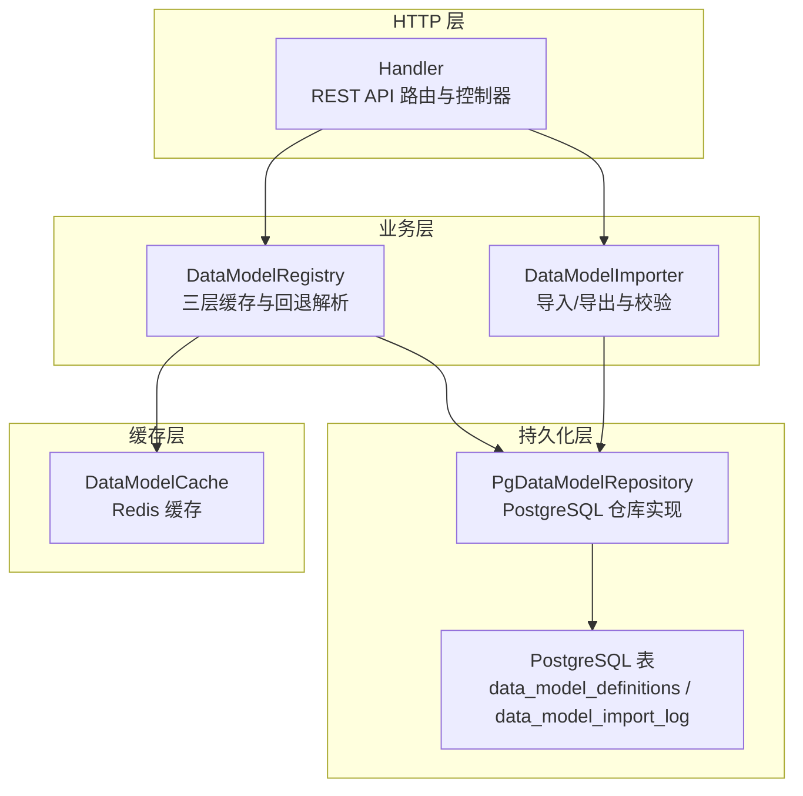
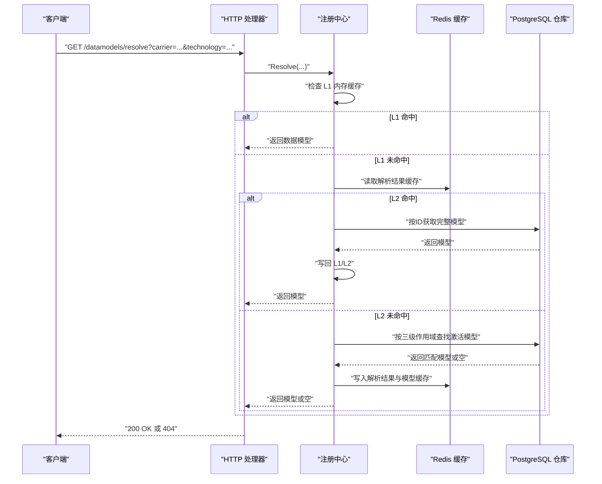
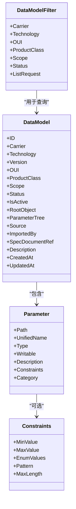
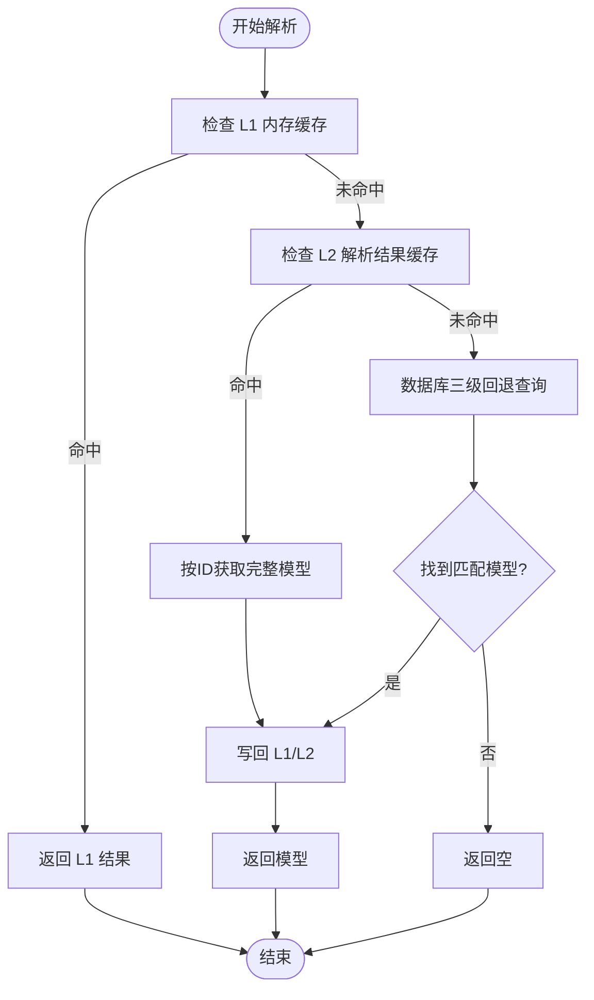
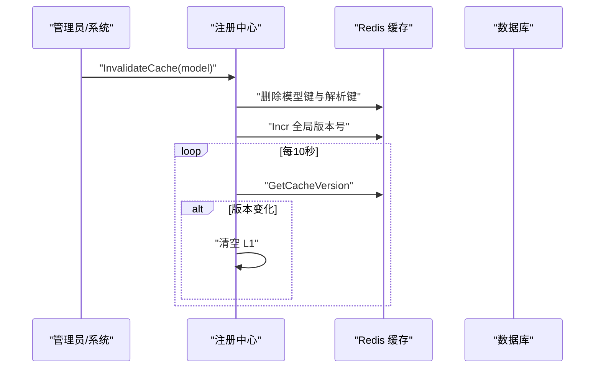
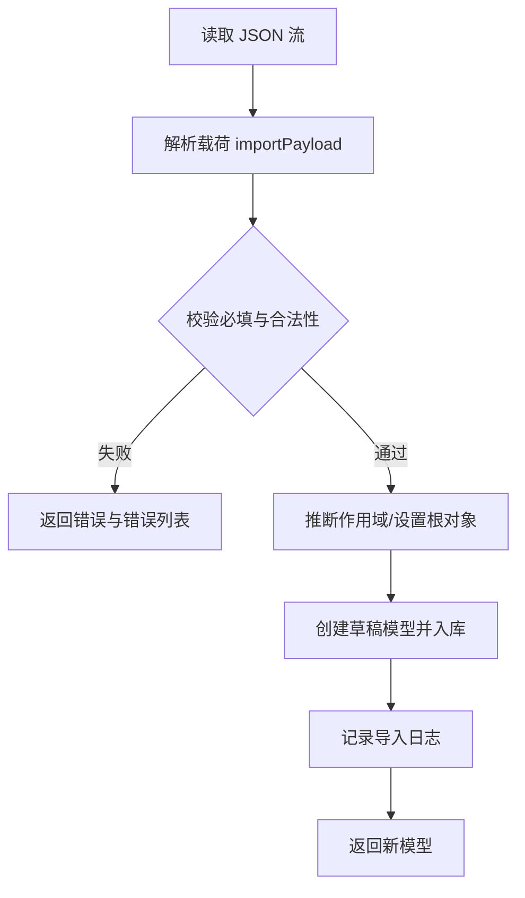
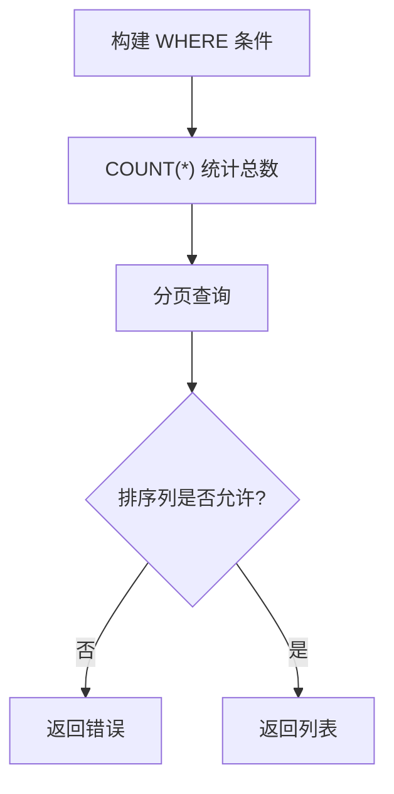
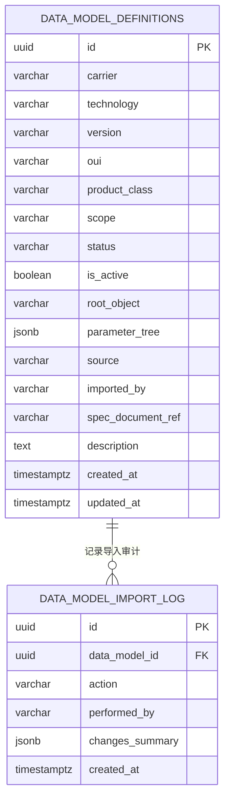
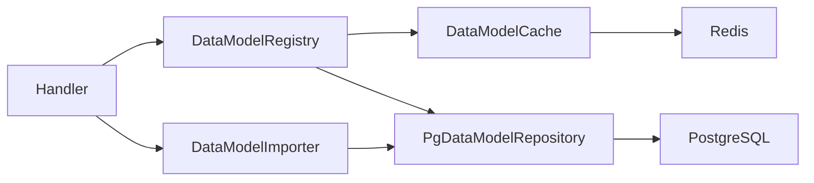

# 数据模型管理

<cite>
**本文引用的文件**
- [omcgo/internal/config/datamodel/model.go](file://omcgo/internal/config/datamodel/model.go)
- [omcgo/internal/config/datamodel/cache.go](file://omcgo/internal/config/datamodel/cache.go)
- [omcgo/internal/config/datamodel/importer.go](file://omcgo/internal/config/datamodel/importer.go)
- [omcgo/internal/config/datamodel/registry.go](file://omcgo/internal/config/datamodel/registry.go)
- [omcgo/internal/config/datamodel/handler.go](file://omcgo/internal/config/datamodel/handler.go)
- [omcgo/internal/config/datamodel/repository.go](file://omcgo/internal/config/datamodel/repository.go)
- [omcgo/internal/config/datamodel/pg_repository.go](file://omcgo/internal/config/datamodel/pg_repository.go)
- [omcgo/internal/config/datamodel/handler_test.go](file://omcgo/internal/config/datamodel/handler_test.go)
- [omcgo/migrations/000003_create_data_model_definitions.up.sql](file://omcgo/migrations/000003_create_data_model_definitions.up.sql)
- [omcgo/migrations/000005_create_data_model_import_log.up.sql](file://omcgo/migrations/000005_create_data_model_import_log.up.sql)
- [omcgo/datamodels/seed/carrier_defaults/cmcc_lte.json](file://omcgo/datamodels/seed/carrier_defaults/cmcc_lte.json)
</cite>

## 目录
1. [简介](#简介)
2. [项目结构](#项目结构)
3. [核心组件](#核心组件)
4. [架构总览](#架构总览)
5. [详细组件分析](#详细组件分析)
6. [依赖分析](#依赖分析)
7. [性能考虑](#性能考虑)
8. [故障排查指南](#故障排查指南)
9. [结论](#结论)
10. [附录](#附录)

## 简介
本文件面向数据模型管理系统，围绕 TR069 数据模型的注册机制、导入流程、缓存策略、标准化处理、字段映射与验证规则、版本管理与兼容性、迁移机制、查询接口与过滤排序、导入步骤与错误处理、性能优化与最佳实践进行系统化技术文档化。目标是帮助开发者与运维人员快速理解并高效使用该子系统。

## 项目结构
数据模型管理位于后端服务的配置模块下，采用分层架构：HTTP 处理器负责路由与请求绑定；注册中心负责三层缓存与回退解析；导入器负责 JSON 导入/导出与校验；仓库层对接 PostgreSQL；迁移脚本定义表结构与约束。

图表来源
- [omcgo/internal/config/datamodel/handler.go:30-53](file://omcgo/internal/config/datamodel/handler.go#L30-L53)
- [omcgo/internal/config/datamodel/registry.go:21-38](file://omcgo/internal/config/datamodel/registry.go#L21-L38)
- [omcgo/internal/config/datamodel/importer.go:42-53](file://omcgo/internal/config/datamodel/importer.go#L42-L53)
- [omcgo/internal/config/datamodel/cache.go:35-42](file://omcgo/internal/config/datamodel/cache.go#L35-L42)
- [omcgo/internal/config/datamodel/pg_repository.go:43-51](file://omcgo/internal/config/datamodel/pg_repository.go#L43-L51)
- [omcgo/migrations/000003_create_data_model_definitions.up.sql:4-29](file://omcgo/migrations/000003_create_data_model_definitions.up.sql#L4-L29)
- [omcgo/migrations/000005_create_data_model_import_log.up.sql:4-12](file://omcgo/migrations/000005_create_data_model_import_log.up.sql#L4-L12)

章节来源
- [omcgo/internal/config/datamodel/handler.go:30-53](file://omcgo/internal/config/datamodel/handler.go#L30-L53)
- [omcgo/internal/config/datamodel/registry.go:14-38](file://omcgo/internal/config/datamodel/registry.go#L14-L38)
- [omcgo/internal/config/datamodel/importer.go:41-53](file://omcgo/internal/config/datamodel/importer.go#L41-L53)
- [omcgo/internal/config/datamodel/cache.go:31-42](file://omcgo/internal/config/datamodel/cache.go#L31-L42)
- [omcgo/internal/config/datamodel/pg_repository.go:43-51](file://omcgo/internal/config/datamodel/pg_repository.go#L43-L51)
- [omcgo/migrations/000003_create_data_model_definitions.up.sql:4-29](file://omcgo/migrations/000003_create_data_model_definitions.up.sql#L4-L29)
- [omcgo/migrations/000005_create_data_model_import_log.up.sql:4-12](file://omcgo/migrations/000005_create_data_model_import_log.up.sql#L4-L12)

## 核心组件
- 数据模型实体与过滤器：定义模型字段、参数约束、过滤与统计结构。
- 注册中心：三层缓存（内存、Redis、数据库）与三段式回退解析。
- 缓存：Redis 缓存模型内容与解析结果，并维护全局版本号以跨实例失效。
- 导入器：JSON 导入/导出、干运行校验、参数计数与范围警告。
- 仓库接口与实现：PostgreSQL 存储，支持分页、过滤、激活/弃用、统计。
- HTTP 处理器：REST API 路由、参数绑定、调用注册中心与导入器、触发缓存失效。

章节来源
- [omcgo/internal/config/datamodel/model.go:20-100](file://omcgo/internal/config/datamodel/model.go#L20-L100)
- [omcgo/internal/config/datamodel/registry.go:14-38](file://omcgo/internal/config/datamodel/registry.go#L14-L38)
- [omcgo/internal/config/datamodel/cache.go:31-42](file://omcgo/internal/config/datamodel/cache.go#L31-L42)
- [omcgo/internal/config/datamodel/importer.go:41-53](file://omcgo/internal/config/datamodel/importer.go#L41-L53)
- [omcgo/internal/config/datamodel/repository.go:10-36](file://omcgo/internal/config/datamodel/repository.go#L10-L36)
- [omcgo/internal/config/datamodel/pg_repository.go:43-51](file://omcgo/internal/config/datamodel/pg_repository.go#L43-L51)
- [omcgo/internal/config/datamodel/handler.go:12-28](file://omcgo/internal/config/datamodel/handler.go#L12-L28)

## 架构总览
系统通过 HTTP 处理器接收请求，调用注册中心进行数据模型解析或调用导入器进行导入/导出；注册中心内部实现三层缓存与数据库回退；导入器在导入时写入数据库并记录导入日志；仓库层通过 PostgreSQL 提供持久化能力。

图表来源
- [omcgo/internal/config/datamodel/handler.go:289-311](file://omcgo/internal/config/datamodel/handler.go#L289-L311)
- [omcgo/internal/config/datamodel/registry.go:40-130](file://omcgo/internal/config/datamodel/registry.go#L40-L130)
- [omcgo/internal/config/datamodel/cache.go:101-131](file://omcgo/internal/config/datamodel/cache.go#L101-L131)
- [omcgo/internal/config/datamodel/pg_repository.go:132-164](file://omcgo/internal/config/datamodel/pg_repository.go#L132-L164)

## 详细组件分析

### 数据模型实体与标准化
- 实体字段覆盖运营商、技术、版本、作用域、状态、根对象、参数树、来源、导入人、规范引用、描述等。
- 参数约束支持最小值、最大值、枚举、正则、最大长度等，便于统一校验。
- 统一的过滤器支持多维过滤与分页排序。

图表来源
- [omcgo/internal/config/datamodel/model.go:20-80](file://omcgo/internal/config/datamodel/model.go#L20-L80)

章节来源
- [omcgo/internal/config/datamodel/model.go:20-80](file://omcgo/internal/config/datamodel/model.go#L20-L80)

### 注册中心与三层缓存
- 解析优先级：产品级 > OUI 级 > 运营商默认级。
- 三层缓存：L1 内存（sync.Map）、L2 Redis（解析结果与模型内容）、L3 数据库。
- 跨实例一致性：通过 Redis 全局版本号增量，后台定时刷新本地缓存。
- 激活/弃用后主动失效对应缓存键，确保一致性。

图表来源
- [omcgo/internal/config/datamodel/registry.go:40-130](file://omcgo/internal/config/datamodel/registry.go#L40-L130)
- [omcgo/internal/config/datamodel/cache.go:101-131](file://omcgo/internal/config/datamodel/cache.go#L101-L131)
- [omcgo/internal/config/datamodel/pg_repository.go:132-164](file://omcgo/internal/config/datamodel/pg_repository.go#L132-L164)

章节来源
- [omcgo/internal/config/datamodel/registry.go:14-130](file://omcgo/internal/config/datamodel/registry.go#L14-L130)
- [omcgo/internal/config/datamodel/cache.go:31-131](file://omcgo/internal/config/datamodel/cache.go#L31-L131)
- [omcgo/internal/config/datamodel/pg_repository.go:132-164](file://omcgo/internal/config/datamodel/pg_repository.go#L132-L164)

### 缓存策略与失效机制
- 模型缓存键按作用域生成，解析结果缓存独立键。
- 模型内容 TTL 24 小时，解析结果 TTL 1 小时。
- 支持单模型失效与全量失效，全量失效通过 SCAN 批量删除并递增全局版本号。
- 后台守护进程定期检查 Redis 版本并清空 L1，保证跨实例一致性。

图表来源
- [omcgo/internal/config/datamodel/cache.go:159-217](file://omcgo/internal/config/datamodel/cache.go#L159-L217)
- [omcgo/internal/config/datamodel/registry.go:185-240](file://omcgo/internal/config/datamodel/registry.go#L185-L240)
- [omcgo/internal/config/datamodel/registry.go:271-297](file://omcgo/internal/config/datamodel/registry.go#L271-L297)

章节来源
- [omcgo/internal/config/datamodel/cache.go:14-217](file://omcgo/internal/config/datamodel/cache.go#L14-L217)
- [omcgo/internal/config/datamodel/registry.go:185-297](file://omcgo/internal/config/datamodel/registry.go#L185-L297)

### 导入流程与验证规则
- JSON 导入：解析载荷、自动推断作用域、创建草稿模型、记录导入日志。
- 干运行校验：必填项校验、JSON 合法性、参数树叶子节点计数、缺失可选字段警告。
- 导出：按统一结构导出模型，保留来源与描述等元信息。
- 错误处理：解析失败、校验失败、持久化失败均有明确错误码与返回。

图表来源
- [omcgo/internal/config/datamodel/importer.go:55-105](file://omcgo/internal/config/datamodel/importer.go#L55-L105)
- [omcgo/internal/config/datamodel/importer.go:107-147](file://omcgo/internal/config/datamodel/importer.go#L107-L147)
- [omcgo/internal/config/datamodel/importer.go:177-224](file://omcgo/internal/config/datamodel/importer.go#L177-L224)

章节来源
- [omcgo/internal/config/datamodel/importer.go:13-259](file://omcgo/internal/config/datamodel/importer.go#L13-L259)

### 查询接口、过滤与排序
- 列表接口支持按运营商、技术、OUI、产品类、作用域、状态过滤，分页与排序。
- 排序列白名单控制，避免任意列排序带来的风险。
- 统计接口返回总数、各状态分布、按运营商与作用域分布。

图表来源
- [omcgo/internal/config/datamodel/pg_repository.go:166-200](file://omcgo/internal/config/datamodel/pg_repository.go#L166-L200)
- [omcgo/internal/config/datamodel/pg_repository.go:30-39](file://omcgo/internal/config/datamodel/pg_repository.go#L30-L39)
- [omcgo/internal/config/datamodel/handler.go:55-89](file://omcgo/internal/config/datamodel/handler.go#L55-L89)

章节来源
- [omcgo/internal/config/datamodel/pg_repository.go:166-200](file://omcgo/internal/config/datamodel/pg_repository.go#L166-L200)
- [omcgo/internal/config/datamodel/pg_repository.go:30-39](file://omcgo/internal/config/datamodel/pg_repository.go#L30-L39)
- [omcgo/internal/config/datamodel/handler.go:55-89](file://omcgo/internal/config/datamodel/handler.go#L55-L89)

### 版本管理、兼容性与迁移
- 版本字段用于区分不同规范版本；同一分类仅允许一个激活模型（唯一索引）。
- 作用域约束：运营商默认、OUI 级、产品级，分别对应不同的非空字段组合。
- 迁移脚本定义表结构、唯一索引与更新时间触发器，确保数据一致性与查询效率。

图表来源
- [omcgo/migrations/000003_create_data_model_definitions.up.sql:4-29](file://omcgo/migrations/000003_create_data_model_definitions.up.sql#L4-L29)
- [omcgo/migrations/000005_create_data_model_import_log.up.sql:4-12](file://omcgo/migrations/000005_create_data_model_import_log.up.sql#L4-L12)

章节来源
- [omcgo/migrations/000003_create_data_model_definitions.up.sql:4-29](file://omcgo/migrations/000003_create_data_model_definitions.up.sql#L4-L29)
- [omcgo/migrations/000005_create_data_model_import_log.up.sql:4-12](file://omcgo/migrations/000005_create_data_model_import_log.up.sql#L4-L12)

### 字段映射与标准化处理
- 参数树中的每个叶子节点代表一个可配置参数，支持统一命名、类型、可写性、描述、约束与分类。
- 导入时若未指定根对象，默认使用标准根对象；作用域根据 OUI 与产品类自动推断。
- 导入校验会统计参数树中的叶子节点数量，作为容量评估参考。

章节来源
- [omcgo/internal/config/datamodel/model.go:41-60](file://omcgo/internal/config/datamodel/model.go#L41-L60)
- [omcgo/internal/config/datamodel/importer.go:67-88](file://omcgo/internal/config/datamodel/importer.go#L67-L88)
- [omcgo/internal/config/datamodel/importer.go:226-235](file://omcgo/internal/config/datamodel/importer.go#L226-L235)
- [omcgo/internal/config/datamodel/importer.go:237-258](file://omcgo/internal/config/datamodel/importer.go#L237-L258)

### 导入步骤、格式要求与错误处理
- 步骤：准备 JSON 文件（包含必要字段与参数树），POST 到导入接口，系统自动创建草稿模型并记录导入日志。
- 格式要求：必须包含运营商、技术、版本、参数树；可选字段如来源、描述、规范引用等。
- 错误处理：解析失败、校验失败、数据库约束冲突、唯一索引冲突均返回明确错误信息。

章节来源
- [omcgo/internal/config/datamodel/handler.go:262-270](file://omcgo/internal/config/datamodel/handler.go#L262-L270)
- [omcgo/internal/config/datamodel/importer.go:177-224](file://omcgo/internal/config/datamodel/importer.go#L177-L224)
- [omcgo/internal/config/datamodel/importer.go:107-147](file://omcgo/internal/config/datamodel/importer.go#L107-L147)

### 示例数据模型（种子）
- 提供运营商默认的数据模型示例，展示参数树结构、约束与描述字段的组织方式，便于理解导入后的参数布局。

章节来源
- [omcgo/datamodels/seed/carrier_defaults/cmcc_lte.json:1-285](file://omcgo/datamodels/seed/carrier_defaults/cmcc_lte.json#L1-L285)

## 依赖分析
- 处理器依赖注册中心与导入器；注册中心依赖仓库与缓存；导入器依赖仓库与导入日志仓库；仓库实现依赖 PostgreSQL 连接池。
- Redis 用于 L2 缓存与全局版本号；PostgreSQL 用于持久化与唯一索引约束。

图表来源
- [omcgo/internal/config/datamodel/handler.go:13-28](file://omcgo/internal/config/datamodel/handler.go#L13-L28)
- [omcgo/internal/config/datamodel/registry.go:21-38](file://omcgo/internal/config/datamodel/registry.go#L21-L38)
- [omcgo/internal/config/datamodel/importer.go:42-53](file://omcgo/internal/config/datamodel/importer.go#L42-L53)
- [omcgo/internal/config/datamodel/cache.go:35-42](file://omcgo/internal/config/datamodel/cache.go#L35-L42)
- [omcgo/internal/config/datamodel/pg_repository.go:43-51](file://omcgo/internal/config/datamodel/pg_repository.go#L43-L51)

章节来源
- [omcgo/internal/config/datamodel/handler.go:13-28](file://omcgo/internal/config/datamodel/handler.go#L13-L28)
- [omcgo/internal/config/datamodel/registry.go:21-38](file://omcgo/internal/config/datamodel/registry.go#L21-L38)
- [omcgo/internal/config/datamodel/importer.go:42-53](file://omcgo/internal/config/datamodel/importer.go#L42-L53)
- [omcgo/internal/config/datamodel/cache.go:35-42](file://omcgo/internal/config/datamodel/cache.go#L35-L42)
- [omcgo/internal/config/datamodel/pg_repository.go:43-51](file://omcgo/internal/config/datamodel/pg_repository.go#L43-L51)

## 性能考虑
- 三层缓存：L1 内存命中优先，L2 Redis 解析结果与模型内容缓存，显著降低数据库压力。
- 索引优化：唯一激活索引确保同一分类仅有一个激活模型；查询索引覆盖常用过滤列。
- 扫描批量失效：全量失效使用 SCAN 与批处理删除，避免阻塞。
- 后台版本同步：每 10 秒轮询一次 Redis 版本，及时刷新 L1，平衡一致性与开销。
- 参数树统计：导入时统计叶子节点数量，辅助容量规划与性能评估。

章节来源
- [omcgo/internal/config/datamodel/cache.go:189-217](file://omcgo/internal/config/datamodel/cache.go#L189-L217)
- [omcgo/internal/config/datamodel/registry.go:271-297](file://omcgo/internal/config/datamodel/registry.go#L271-L297)
- [omcgo/migrations/000003_create_data_model_definitions.up.sql:31-50](file://omcgo/migrations/000003_create_data_model_definitions.up.sql#L31-L50)
- [omcgo/internal/config/datamodel/importer.go:237-258](file://omcgo/internal/config/datamodel/importer.go#L237-L258)

## 故障排查指南
- 解析失败：确认 carrier 与 technology 必填；检查参数树 JSON 合法性；查看解析结果缓存是否命中。
- 404 未找到：可能未配置任何匹配的作用域模型；检查数据库中是否存在激活模型。
- 导入失败：核对必填字段与 JSON 格式；关注干运行校验返回的错误列表；查看导入日志。
- 缓存不一致：执行缓存刷新接口或等待后台版本同步；确认 Redis 可用且版本号可读。
- 数据库约束：唯一激活模型冲突时需先弃用旧模型再激活新模型。

章节来源
- [omcgo/internal/config/datamodel/handler.go:289-311](file://omcgo/internal/config/datamodel/handler.go#L289-L311)
- [omcgo/internal/config/datamodel/handler.go:262-270](file://omcgo/internal/config/datamodel/handler.go#L262-L270)
- [omcgo/internal/config/datamodel/importer.go:107-147](file://omcgo/internal/config/datamodel/importer.go#L107-L147)
- [omcgo/internal/config/datamodel/registry.go:217-240](file://omcgo/internal/config/datamodel/registry.go#L217-L240)

## 结论
该数据模型管理系统通过三层缓存与数据库回退解析，结合严格的导入校验与审计日志，实现了高可用、可扩展、可维护的 TR069 数据模型管理能力。配合完善的查询过滤、排序与统计接口，满足了多运营商、多技术、多厂商场景下的参数配置与版本演进需求。

## 附录
- API 路由概览（部分）
  - GET /api/v1/datamodels：分页列出模型，支持多维过滤与排序
  - GET /api/v1/datamodels/:id：按 ID 获取模型
  - POST /api/v1/datamodels：创建草稿模型
  - PUT /api/v1/datamodels/:id：更新模型（草稿或激活）
  - DELETE /api/v1/datamodels/:id：删除草稿模型
  - POST /api/v1/datamodels/:id/activate：激活模型并失效缓存
  - POST /api/v1/datamodels/:id/deprecate：弃用模型并失效缓存
  - POST /api/v1/datamodels/import：导入 JSON 模型
  - GET /api/v1/datamodels/:id/export：导出模型为 JSON
  - GET /api/v1/datamodels/resolve：按参数解析模型
  - GET /api/v1/datamodels/statistics：统计模型分布
  - POST /api/v1/datamodels/cache/refresh：刷新缓存
  - GET /api/v1/oui：列出 OUI 注册
  - POST /api/v1/oui：创建 OUI 注册

章节来源
- [omcgo/internal/config/datamodel/handler.go:30-53](file://omcgo/internal/config/datamodel/handler.go#L30-L53)
- [omcgo/internal/config/datamodel/handler.go:55-330](file://omcgo/internal/config/datamodel/handler.go#L55-L330)