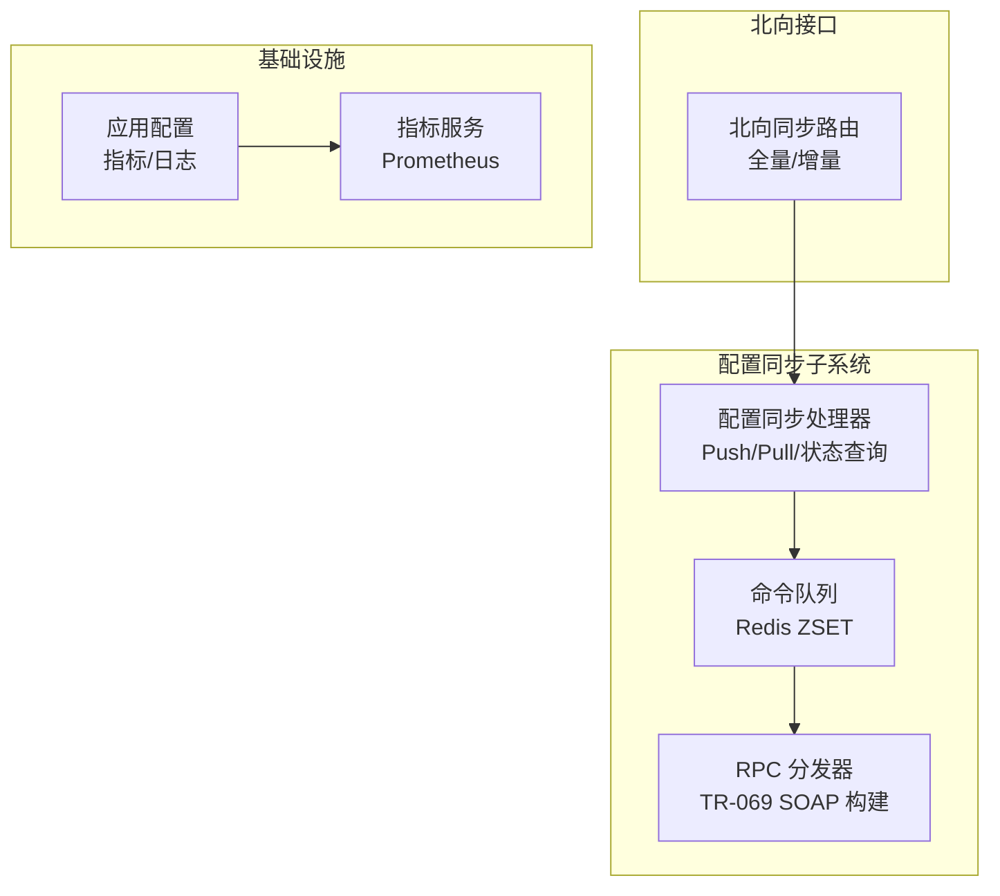
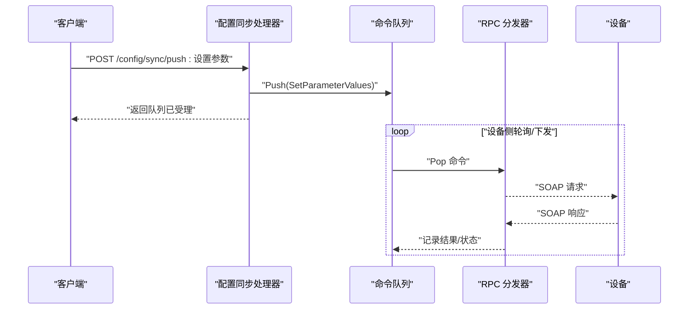
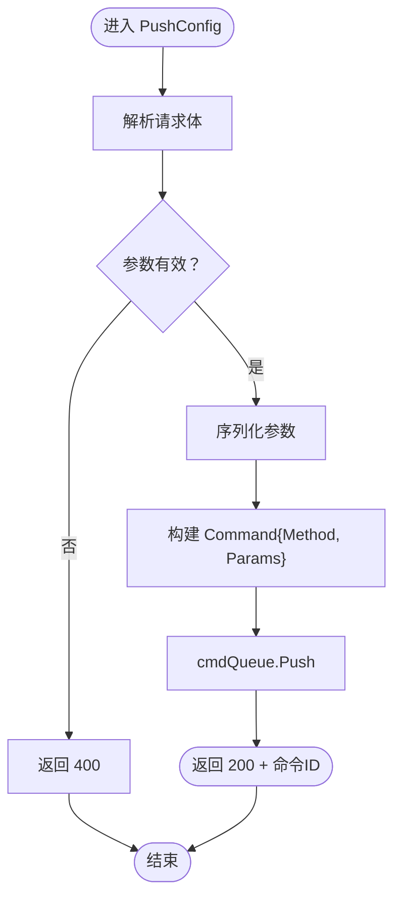
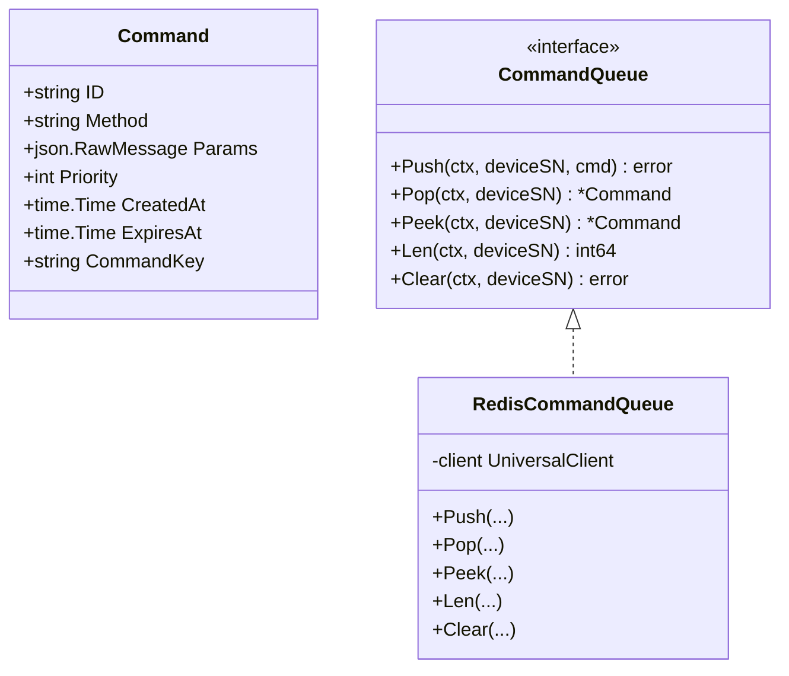
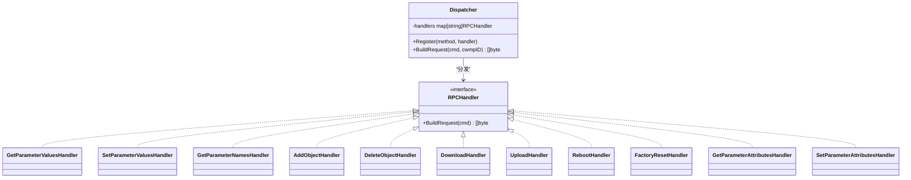
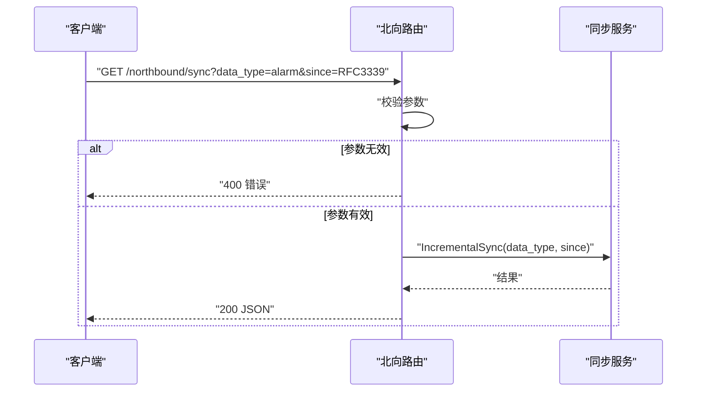
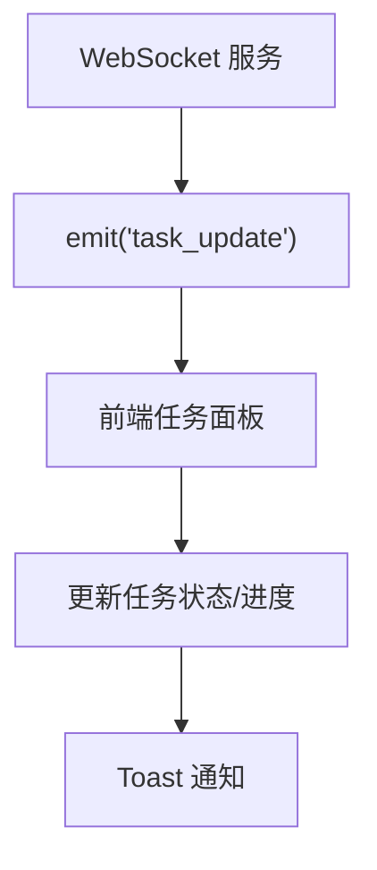
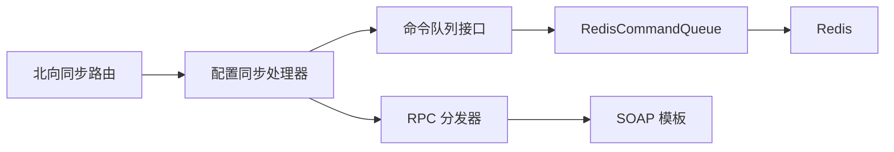

# 配置同步处理

<cite>
**本文引用的文件**
- [sync_handler.go](file://omcgo/internal/config/sync_handler.go)
- [queue.go](file://omcgo/internal/acs/cmdqueue/queue.go)
- [dispatcher.go](file://omcgo/internal/acs/rpc/dispatcher.go)
- [sync_handler_test.go](file://omcgo/internal/config/sync_handler_test.go)
- [router.go](file://omcgo/internal/northbound/router.go)
- [config.go](file://omcgo/internal/core/appconfig/config.go)
- [bootstrap.go](file://omcgo/internal/core/bootstrap/bootstrap.go)
- [metrics.go](file://omcgo/internal/core/components/monitor/metrics.go)
- [phase4-analysis-report.md](file://omcgo/docs/phase4-analysis-report.md)
- [index.tsx](file://omcgo/omcmb/webcode/src/pages/alarm/AlarmSync/index.tsx)
- [taskWebSocket.ts](file://omcgo/omcgo/webcode/src/mock/websocket/taskWebSocket.ts)
</cite>

## 目录
1. [简介](#简介)
2. [项目结构](#项目结构)
3. [核心组件](#核心组件)
4. [架构总览](#架构总览)
5. [详细组件分析](#详细组件分析)
6. [依赖关系分析](#依赖关系分析)
7. [性能考量](#性能考量)
8. [故障排查指南](#故障排查指南)
9. [结论](#结论)
10. [附录](#附录)

## 简介
本文件围绕“配置同步处理机制”进行系统化技术文档编制，聚焦以下主题：
- 触发条件与处理流程：实时同步（请求即发）、批量同步（队列化执行）与状态管理
- 实时同步与批量同步的差异、适用场景与性能权衡
- 配置变更的通知机制、冲突处理与一致性保障
- 错误处理、重试与失败恢复策略
- 监控指标、日志记录与调试方法
- 性能优化、网络传输优化与大规模部署实践

## 项目结构
配置同步涉及的关键模块包括：
- 配置同步 HTTP 入口：提供 Push/Pull/状态查询等接口
- 命令队列：基于 Redis 的有序集合，承载设备命令的排队与调度
- RPC 分发器：将命令转换为 TR-069 SOAP 请求
- 北向同步路由：提供全量/增量同步的 API
- 应用配置与指标：Prometheus 指标服务与日志配置
- 前端任务状态模拟：展示批量任务的进度与状态更新

**图表来源**
- [sync_handler.go:52-59](file://omcgo/internal/config/sync_handler.go#L52-L59)
- [queue.go:39-47](file://omcgo/internal/acs/cmdqueue/queue.go#L39-L47)
- [dispatcher.go:47-54](file://omcgo/internal/acs/rpc/dispatcher.go#L47-L54)
- [router.go:105-125](file://omcgo/internal/northbound/router.go#L105-L125)
- [config.go:192-210](file://omcgo/internal/core/appconfig/config.go#L192-L210)
- [metrics.go:65-85](file://omcgo/internal/core/components/monitor/metrics.go#L65-L85)

**章节来源**
- [sync_handler.go:14-59](file://omcgo/internal/config/sync_handler.go#L14-L59)
- [queue.go:13-31](file://omcgo/internal/acs/cmdqueue/queue.go#L13-L31)
- [dispatcher.go:16-40](file://omcgo/internal/acs/rpc/dispatcher.go#L16-L40)
- [router.go:105-125](file://omcgo/internal/northbound/router.go#L105-L125)
- [config.go:192-210](file://omcgo/internal/core/appconfig/config.go#L192-L210)
- [metrics.go:65-85](file://omcgo/internal/core/components/monitor/metrics.go#L65-L85)

## 核心组件
- 配置同步处理器：负责接收 Push/Pull 请求，构造命令并入队；提供设备同步状态查询
- 命令队列：以设备序列号为键，使用 Redis ZSET 存储命令，支持优先级与过期控制
- RPC 分发器：根据命令方法选择对应处理器，渲染 TR-069 SOAP 请求体
- 北向同步路由：提供全量/增量同步接口，支持参数校验与错误响应
- 指标与日志：内置 Prometheus 指标服务与结构化日志配置，便于观测与排障

**章节来源**
- [sync_handler.go:14-157](file://omcgo/internal/config/sync_handler.go#L14-L157)
- [queue.go:13-135](file://omcgo/internal/acs/cmdqueue/queue.go#L13-L135)
- [dispatcher.go:16-230](file://omcgo/internal/acs/rpc/dispatcher.go#L16-L230)
- [router.go:105-125](file://omcgo/internal/northbound/router.go#L105-L125)
- [config.go:192-210](file://omcgo/internal/core/appconfig/config.go#L192-L210)
- [metrics.go:65-85](file://omcgo/internal/core/components/monitor/metrics.go#L65-L85)

## 架构总览
配置同步采用“请求即发 + 队列化执行”的模式：
- 客户端调用配置同步接口，服务端将命令入队
- 后续由 RPC 分发器将命令转换为 TR-069 SOAP 请求发送给设备
- 北向接口提供全量/增量同步能力，作为数据层面的补充

**图表来源**
- [sync_handler.go:62-97](file://omcgo/internal/config/sync_handler.go#L62-L97)
- [queue.go:49-72](file://omcgo/internal/acs/cmdqueue/queue.go#L49-L72)
- [dispatcher.go:47-54](file://omcgo/internal/acs/rpc/dispatcher.go#L47-L54)

## 详细组件分析

### 配置同步处理器（Push/Pull/状态）
- PushConfig：接收参数列表，封装为 SetParameterValues 命令入队
- PullConfig：接收参数名列表，封装为 GetParameterValues 命令入队
- GetSyncStatus：查询指定设备的待处理命令数量

**图表来源**
- [sync_handler.go:62-97](file://omcgo/internal/config/sync_handler.go#L62-L97)

**章节来源**
- [sync_handler.go:62-156](file://omcgo/internal/config/sync_handler.go#L62-L156)
- [sync_handler_test.go:75-112](file://omcgo/internal/config/sync_handler_test.go#L75-L112)

### 命令队列（Redis ZSET）
- 命令结构包含 ID、方法、参数、优先级、创建时间、过期时间与命令键
- Push：按优先级与时间戳计算分数入队
- Pop：迭代跳过过期命令，支持并发竞争下的幂等弹出
- Peek/Length/Clear：用于状态查询与运维清理

**图表来源**
- [queue.go:13-31](file://omcgo/internal/acs/cmdqueue/queue.go#L13-L31)
- [queue.go:39-135](file://omcgo/internal/acs/cmdqueue/queue.go#L39-L135)

**章节来源**
- [queue.go:13-135](file://omcgo/internal/acs/cmdqueue/queue.go#L13-L135)

### RPC 分发器（TR-069 SOAP 构建）
- 内置多种 RPC 方法处理器（Get/SetParameterValues、Get/SetParameterNames、Add/DeleteObject、Download/Upload、Reboot、FactoryReset、Get/SetParameterAttributes）
- BuildRequest：根据命令方法选择处理器，渲染模板生成 SOAP 请求

**图表来源**
- [dispatcher.go:16-40](file://omcgo/internal/acs/rpc/dispatcher.go#L16-L40)
- [dispatcher.go:47-230](file://omcgo/internal/acs/rpc/dispatcher.go#L47-L230)

**章节来源**
- [dispatcher.go:16-230](file://omcgo/internal/acs/rpc/dispatcher.go#L16-L230)

### 北向同步（全量/增量）
- 增量同步路由：要求提供 RFC3339 格式的 since 参数，否则返回 400
- 业务层根据 data_type 与 since 执行增量同步逻辑（返回结果由服务层实现）

**图表来源**
- [router.go:105-125](file://omcgo/internal/northbound/router.go#L105-L125)

**章节来源**
- [router.go:105-125](file://omcgo/internal/northbound/router.go#L105-L125)
- [phase4-analysis-report.md:172-180](file://omcgo/docs/phase4-analysis-report.md#L172-L180)

### 前端任务状态与批量同步
- 前端页面展示不同类型的同步任务（全量、增量、实时），包含状态、进度与统计
- WebSocket 模拟批量任务更新，支持单任务与批量任务的状态广播

**图表来源**
- [index.tsx:31-62](file://omcgo/omcmb/webcode/src/pages/alarm/AlarmSync/index.tsx#L31-L62)
- [taskWebSocket.ts:126-175](file://omcgo/omcgo/webcode/src/mock/websocket/taskWebSocket.ts#L126-L175)

**章节来源**
- [index.tsx:31-62](file://omcgo/omcmb/webcode/src/pages/alarm/AlarmSync/index.tsx#L31-L62)
- [taskWebSocket.ts:126-175](file://omcgo/omcgo/webcode/src/mock/websocket/taskWebSocket.ts#L126-L175)

## 依赖关系分析
- 配置同步处理器依赖命令队列接口，实现解耦与可替换性
- 命令队列使用 Redis 作为存储后端，具备高吞吐与低延迟特性
- RPC 分发器与 SOAP 模板解耦，便于扩展新的 TR-069 方法
- 北向同步路由与配置同步处理器相互独立，分别服务于不同数据域与场景

**图表来源**
- [sync_handler.go:15-26](file://omcgo/internal/config/sync_handler.go#L15-L26)
- [queue.go:39-47](file://omcgo/internal/acs/cmdqueue/queue.go#L39-L47)
- [dispatcher.go:47-54](file://omcgo/internal/acs/rpc/dispatcher.go#L47-L54)
- [router.go:105-125](file://omcgo/internal/northbound/router.go#L105-L125)

**章节来源**
- [sync_handler.go:15-26](file://omcgo/internal/config/sync_handler.go#L15-L26)
- [queue.go:39-47](file://omcgo/internal/acs/cmdqueue/queue.go#L39-L47)
- [dispatcher.go:47-54](file://omcgo/internal/acs/rpc/dispatcher.go#L47-L54)
- [router.go:105-125](file://omcgo/internal/northbound/router.go#L105-L125)

## 性能考量
- 实时同步（Push/Pull）：请求即发，延迟低，适合紧急配置变更
- 批量同步（队列化）：通过 Redis ZSET 实现高吞吐与优先级控制，适合大规模设备配置下发
- 北向同步（全量/增量）：全量适合初始化或修复，增量适合持续对账与低延迟更新
- 指标与日志：内置 Prometheus 指标服务与结构化日志，便于容量规划与性能分析

**章节来源**
- [phase4-analysis-report.md:172-180](file://omcgo/docs/phase4-analysis-report.md#L172-L180)
- [metrics.go:65-85](file://omcgo/internal/core/components/monitor/metrics.go#L65-L85)
- [config.go:192-210](file://omcgo/internal/core/appconfig/config.go#L192-L210)

## 故障排查指南
- 常见错误与处理
  - 参数校验失败：Push/Pull 请求体解析失败返回 400
  - 设备参数缺失：路由参数为空返回 404 或 400
  - 队列操作异常：入队/出队失败记录错误日志并返回 500
  - 增量同步参数错误：缺少或格式不正确的 since 参数返回 400
- 日志与指标
  - 使用结构化日志定位具体设备与命令
  - 通过 /metrics 暴露的指标观察队列长度、处理延迟与错误率
- 重试与恢复
  - 队列 Pop 过程中自动跳过过期命令，避免阻塞
  - 建议在上层实现幂等与去重，确保重复下发的安全性

**章节来源**
- [sync_handler.go:62-156](file://omcgo/internal/config/sync_handler.go#L62-L156)
- [sync_handler_test.go:136-204](file://omcgo/internal/config/sync_handler_test.go#L136-L204)
- [router.go:105-125](file://omcgo/internal/northbound/router.go#L105-L125)
- [bootstrap.go:251-266](file://omcgo/internal/core/bootstrap/bootstrap.go#L251-L266)
- [metrics.go:65-85](file://omcgo/internal/core/components/monitor/metrics.go#L65-L85)

## 结论
配置同步处理机制以“请求即发 + 队列化执行”为核心，结合 Redis 高效队列与 TR-069 RPC 分发，实现了低延迟与高吞吐的平衡。配合北向全量/增量同步、完善的监控与日志体系，能够满足从单机到大规模集群的部署需求。建议在生产环境中强化幂等性与去重策略，并结合指标进行容量与性能优化。

## 附录
- 相关文档与报告
  - 同步模式对比与北向同步能力说明
  - K8s 部署拓扑与扩缩容策略
  - 负载测试脚本与监控面板清单

**章节来源**
- [phase4-analysis-report.md:172-180](file://omcgo/docs/phase4-analysis-report.md#L172-L180)
- [phase4-analysis-report.md:236-287](file://omcgo/docs/phase4-analysis-report.md#L236-L287)