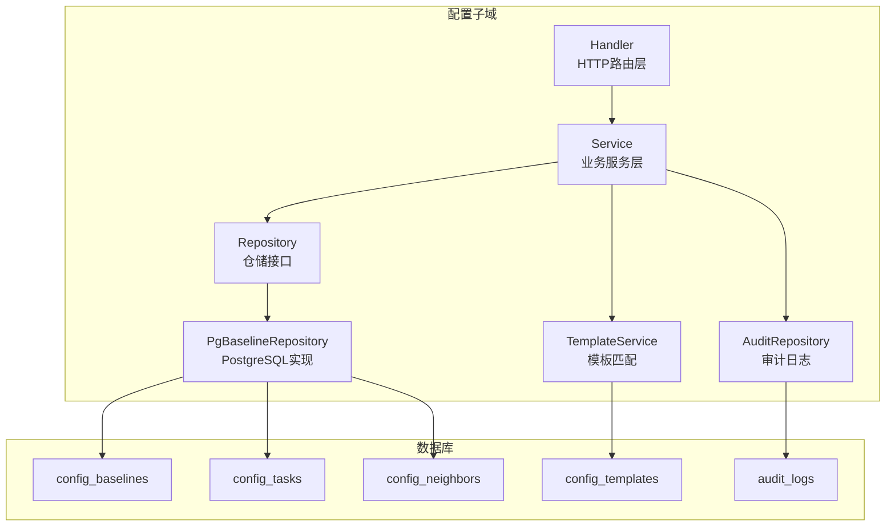
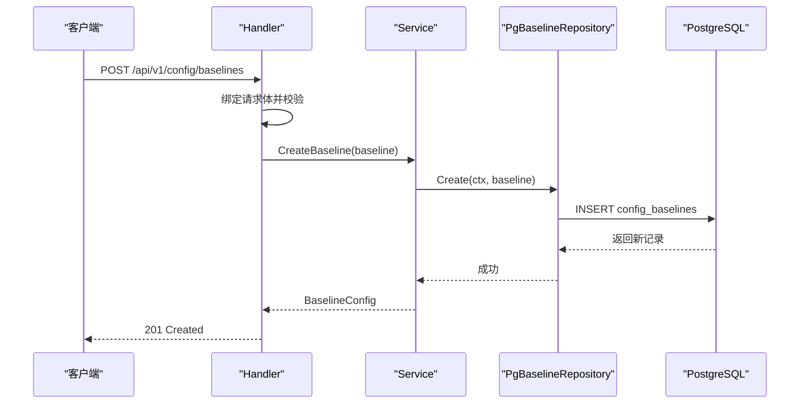
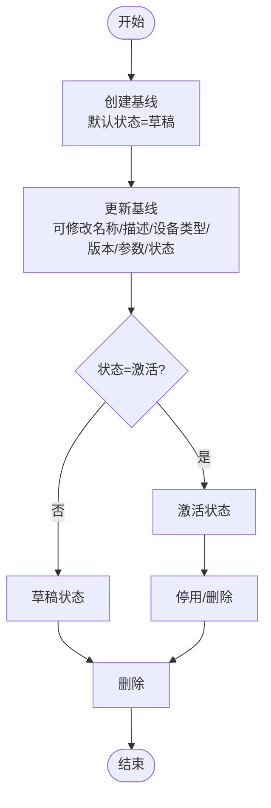
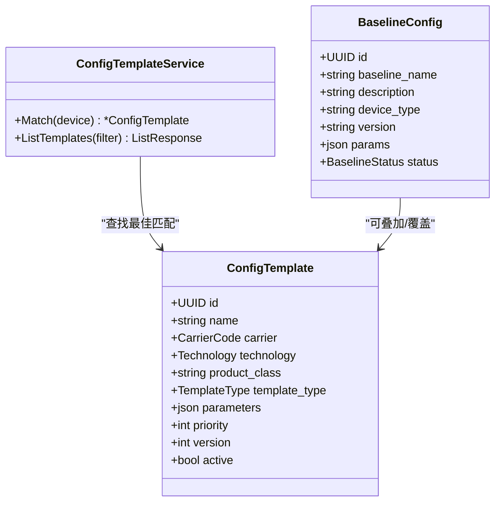
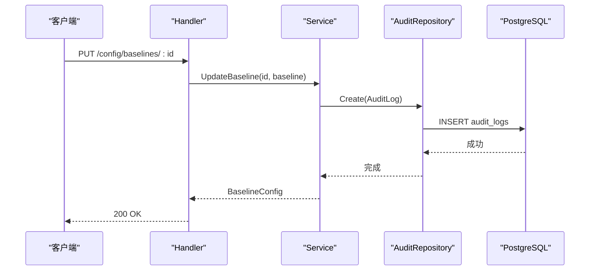
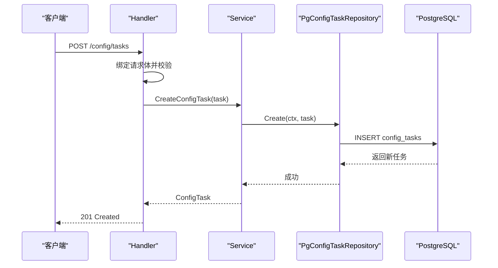
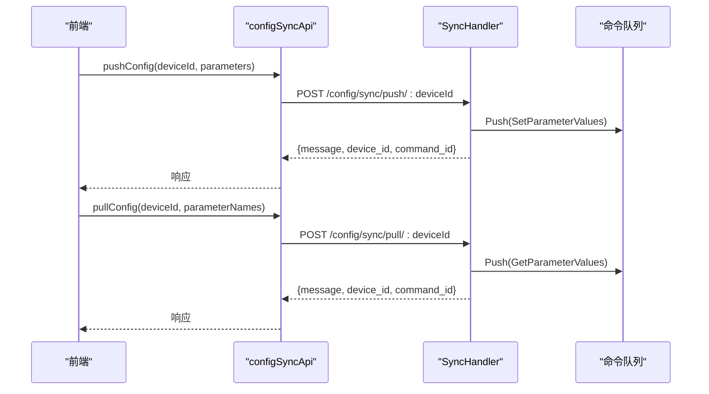
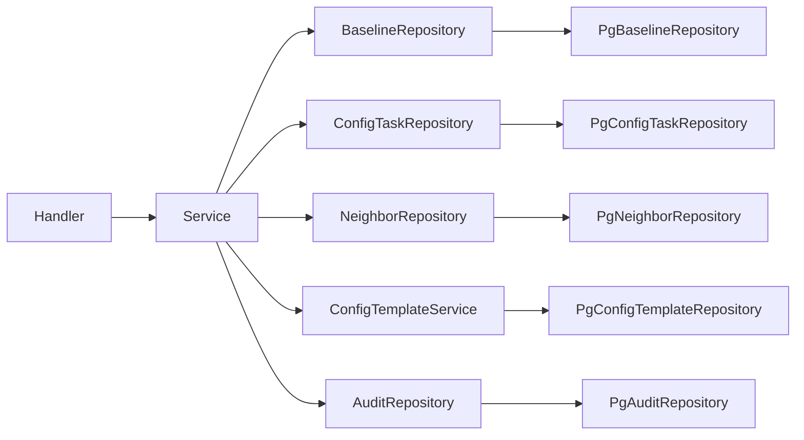
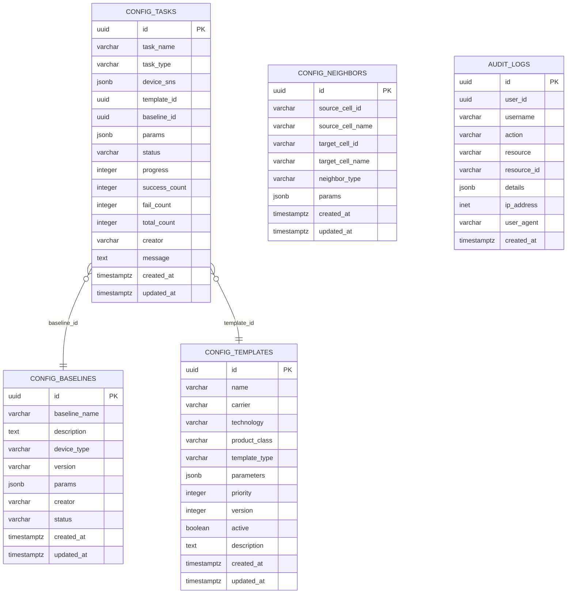

# 配置基线管理

<cite>
**本文档引用的文件**
- [model.go](file://omcgo/internal/config/baseline/model.go)
- [service.go](file://omcgo/internal/config/baseline/service.go)
- [repository.go](file://omcgo/internal/config/baseline/repository.go)
- [handler.go](file://omcgo/internal/config/baseline/handler.go)
- [pg_repository.go](file://omcgo/internal/config/baseline/pg_repository.go)
- [handler_test.go](file://omcgo/internal/config/baseline/handler_test.go)
- [service_test.go](file://omcgo/internal/config/baseline/service_test.go)
- [model.go](file://omcgo/internal/config/template/model.go)
- [service.go](file://omcgo/internal/config/template/service.go)
- [000027_create_config_baselines.up.sql](file://omcgo/migrations/000027_create_config_baselines.up.sql)
- [000027_create_config_baselines.down.sql](file://omcgo/migrations/000027_create_config_baselines.down.sql)
- [000006_create_config_templates.up.sql](file://omcgo/migrations/000006_create_config_templates.up.sql)
- [000015_create_audit_logs.up.sql](file://omcgo/migrations/000015_create_audit_logs.up.sql)
- [pg_audit_repository.go](file://omcgo/internal/admin/pg_audit_repository.go)
- [sync_handler.go](file://omcgo/internal/config/sync_handler.go)
- [configSyncApi.ts](file://omcmb/webcode/src/services/api/configSyncApi.ts)
- [index.tsx](file://omcmb/webcode/src/pages/config/ParamSync/index.tsx)
</cite>

## 目录
1. [简介](#简介)
2. [项目结构](#项目结构)
3. [核心组件](#核心组件)
4. [架构概览](#架构概览)
5. [详细组件分析](#详细组件分析)
6. [依赖关系分析](#依赖关系分析)
7. [性能考量](#性能考量)
8. [故障排除指南](#故障排除指南)
9. [结论](#结论)
10. [附录](#附录)

## 简介
本文件为配置基线管理系统的技术文档，围绕配置基线的概念、作用与管理流程进行深入阐述。系统提供基线的创建、激活、停用与删除等生命周期管理；定义了基线与模板的关系、继承机制与优先级规则；文档化了版本控制、变更追踪与审计日志；说明了批量应用、差异化配置与回滚机制；并给出使用场景、最佳实践与安全考虑，以及性能优化建议与常见问题解决方案。

## 项目结构
配置基线管理位于后端服务的配置子域中，采用分层架构：HTTP路由层负责REST API入口，业务服务层封装核心逻辑，仓储层负责数据持久化，模板模块提供匹配与优先级规则，审计模块提供变更追踪能力。

**图表来源**
- [handler.go:30-46](file://omcgo/internal/config/baseline/handler.go#L30-L46)
- [service.go:14-35](file://omcgo/internal/config/baseline/service.go#L14-L35)
- [repository.go:10-28](file://omcgo/internal/config/baseline/repository.go#L10-L28)
- [pg_repository.go:45-53](file://omcgo/internal/config/baseline/pg_repository.go#L45-L53)
- [model.go:20-35](file://omcgo/internal/config/template/model.go#L20-L35)
- [000027_create_config_baselines.up.sql:1-62](file://omcgo/migrations/000027_create_config_baselines.up.sql#L1-L62)
- [000006_create_config_templates.up.sql:4-30](file://omcgo/migrations/000006_create_config_templates.up.sql#L4-L30)
- [000015_create_audit_logs.up.sql:3-15](file://omcgo/migrations/000015_create_audit_logs.up.sql#L3-L15)

**章节来源**
- [handler.go:30-46](file://omcgo/internal/config/baseline/handler.go#L30-L46)
- [service.go:14-35](file://omcgo/internal/config/baseline/service.go#L14-L35)
- [repository.go:10-28](file://omcgo/internal/config/baseline/repository.go#L10-L28)
- [pg_repository.go:45-53](file://omcgo/internal/config/baseline/pg_repository.go#L45-L53)
- [model.go:20-35](file://omcgo/internal/config/template/model.go#L20-L35)
- [000027_create_config_baselines.up.sql:1-62](file://omcgo/migrations/000027_create_config_baselines.up.sql#L1-L62)
- [000006_create_config_templates.up.sql:4-30](file://omcgo/migrations/000006_create_config_templates.up.sql#L4-L30)
- [000015_create_audit_logs.up.sql:3-15](file://omcgo/migrations/000015_create_audit_logs.up.sql#L3-L15)

## 核心组件
- 基线配置实体：包含唯一标识、名称、描述、设备类型、版本、参数集合、状态、创建者与时间戳等字段。
- 配置任务实体：用于批量应用或参数同步，包含任务名、类型、设备序列号集合、模板ID、基线ID、参数、执行状态、进度与计数等。
- 模板实体：提供按运营商、技术与产品类别的匹配，支持优先级与版本控制。
- 审计日志：记录用户在资源上的操作行为，便于变更追踪与合规审计。

**章节来源**
- [model.go:50-95](file://omcgo/internal/config/baseline/model.go#L50-L95)
- [model.go:20-35](file://omcgo/internal/config/template/model.go#L20-L35)
- [000015_create_audit_logs.up.sql:3-15](file://omcgo/migrations/000015_create_audit_logs.up.sql#L3-L15)

## 架构概览
系统通过HTTP路由暴露REST API，Handler将请求转换为领域对象并调用Service层处理，Service层协调仓储与模板匹配逻辑，并可产生审计日志。数据持久化由PostgreSQL实现，包含基线、任务、邻区与模板等表。

**图表来源**
- [handler.go:115-140](file://omcgo/internal/config/baseline/handler.go#L115-L140)
- [service.go:39-58](file://omcgo/internal/config/baseline/service.go#L39-L58)
- [pg_repository.go:55-78](file://omcgo/internal/config/baseline/pg_repository.go#L55-L78)
- [000027_create_config_baselines.up.sql:1-13](file://omcgo/migrations/000027_create_config_baselines.up.sql#L1-L13)

**章节来源**
- [handler.go:115-140](file://omcgo/internal/config/baseline/handler.go#L115-L140)
- [service.go:39-58](file://omcgo/internal/config/baseline/service.go#L39-L58)
- [pg_repository.go:55-78](file://omcgo/internal/config/baseline/pg_repository.go#L55-L78)
- [000027_create_config_baselines.up.sql:1-13](file://omcgo/migrations/000027_create_config_baselines.up.sql#L1-L13)

## 详细组件分析

### 基线生命周期管理
- 创建：默认状态为草稿，参数为空数组时自动填充。
- 更新：支持部分字段更新，状态变更需显式传入。
- 查询与列表：支持按设备类型与状态过滤，分页排序。
- 删除：根据ID删除，不存在时返回未找到错误。

**图表来源**
- [service.go:39-99](file://omcgo/internal/config/baseline/service.go#L39-L99)
- [model.go:14-18](file://omcgo/internal/config/baseline/model.go#L14-L18)

**章节来源**
- [service.go:39-99](file://omcgo/internal/config/baseline/service.go#L39-L99)
- [model.go:14-18](file://omcgo/internal/config/baseline/model.go#L14-L18)

### 基线与模板的关系、继承机制与优先级规则
- 匹配策略：模板匹配优先级为“运营商+技术+产品类别”优于“运营商+技术”，仅在激活模板中生效。
- 继承与覆盖：模板提供基础参数集，基线可叠加差异化参数；执行时以基线为准，模板作为默认值来源。
- 优先级规则：模板按优先级与版本升序排列，取最高优先级且激活的模板；若无匹配模板，则仅使用基线参数。

**图表来源**
- [model.go:20-35](file://omcgo/internal/config/template/model.go#L20-L35)
- [service.go:25-47](file://omcgo/internal/config/template/service.go#L25-L47)
- [model.go:50-62](file://omcgo/internal/config/baseline/model.go#L50-L62)

**章节来源**
- [service.go:25-47](file://omcgo/internal/config/template/service.go#L25-L47)
- [model.go:20-35](file://omcgo/internal/config/template/model.go#L20-L35)
- [000006_create_config_templates.up.sql:4-30](file://omcgo/migrations/000006_create_config_templates.up.sql#L4-L30)

### 版本控制、变更追踪与审计日志
- 版本控制：模板具备版本字段，变更时递增版本号；基线具备版本字符串，便于区分不同发布版本。
- 变更追踪：服务层记录关键事件（创建、更新），Handler层记录HTTP请求结果。
- 审计日志：审计表记录用户、动作、资源、详情与时间，支持按用户与时间范围查询。

**图表来源**
- [handler.go:159-190](file://omcgo/internal/config/baseline/handler.go#L159-L190)
- [service.go:65-94](file://omcgo/internal/config/baseline/service.go#L65-L94)
- [pg_audit_repository.go:28-49](file://omcgo/internal/admin/pg_audit_repository.go#L28-L49)
- [000015_create_audit_logs.up.sql:3-15](file://omcgo/migrations/000015_create_audit_logs.up.sql#L3-L15)

**章节来源**
- [pg_audit_repository.go:28-49](file://omcgo/internal/admin/pg_audit_repository.go#L28-L49)
- [000015_create_audit_logs.up.sql:3-15](file://omcgo/migrations/000015_create_audit_logs.up.sql#L3-L15)

### 批量应用、差异化配置与回滚机制
- 批量应用：通过配置任务（任务类型为批量配置）指定设备序列号集合与目标模板或基线，系统异步执行。
- 差异化配置：基线参数与模板参数叠加，基线优先覆盖模板同名参数。
- 回滚机制：当前实现未直接提供回滚API，可通过创建新基线并切换至新版本的方式实现“回滚”。

**图表来源**
- [handler.go:235-262](file://omcgo/internal/config/baseline/handler.go#L235-L262)
- [service.go:108-128](file://omcgo/internal/config/baseline/service.go#L108-L128)
- [pg_repository.go:268-294](file://omcgo/internal/config/baseline/pg_repository.go#L268-L294)
- [000027_create_config_baselines.up.sql:20-38](file://omcgo/migrations/000027_create_config_baselines.up.sql#L20-L38)

**章节来源**
- [handler.go:235-262](file://omcgo/internal/config/baseline/handler.go#L235-L262)
- [service.go:108-128](file://omcgo/internal/config/baseline/service.go#L108-L128)
- [pg_repository.go:268-294](file://omcgo/internal/config/baseline/pg_repository.go#L268-L294)
- [000027_create_config_baselines.up.sql:20-38](file://omcgo/migrations/000027_create_config_baselines.up.sql#L20-L38)

### 参数同步与实时状态
- 参数推送/拉取：通过同步处理器将SetParameterValues/GetParameterValues命令推送到队列，支持查询设备待处理命令数量。
- 前端集成：前端提供参数同步页面，展示同步状态与任务进度。

**图表来源**
- [configSyncApi.ts:24-56](file://omcmb/webcode/src/services/api/configSyncApi.ts#L24-L56)
- [sync_handler.go:61-97](file://omcgo/internal/config/sync_handler.go#L61-L97)
- [index.tsx:48-69](file://omcmb/webcode/src/pages/config/ParamSync/index.tsx#L48-L69)

**章节来源**
- [configSyncApi.ts:24-56](file://omcmb/webcode/src/services/api/configSyncApi.ts#L24-L56)
- [sync_handler.go:61-97](file://omcgo/internal/config/sync_handler.go#L61-L97)
- [index.tsx:48-69](file://omcmb/webcode/src/pages/config/ParamSync/index.tsx#L48-L69)

## 依赖关系分析
- Handler依赖Service；Service依赖仓储接口与模板服务；仓储接口由PostgreSQL实现；审计日志独立于配置域但共享数据库。
- 数据库层面：config_baselines、config_tasks、config_neighbors、config_templates、audit_logs五张表相互解耦，通过外键与业务逻辑关联。

**图表来源**
- [handler.go:16-27](file://omcgo/internal/config/baseline/handler.go#L16-L27)
- [service.go:15-34](file://omcgo/internal/config/baseline/service.go#L15-L34)
- [repository.go:10-28](file://omcgo/internal/config/baseline/repository.go#L10-L28)
- [pg_repository.go:45-53](file://omcgo/internal/config/baseline/pg_repository.go#L45-L53)

**章节来源**
- [handler.go:16-27](file://omcgo/internal/config/baseline/handler.go#L16-L27)
- [service.go:15-34](file://omcgo/internal/config/baseline/service.go#L15-L34)
- [repository.go:10-28](file://omcgo/internal/config/baseline/repository.go#L10-L28)
- [pg_repository.go:45-53](file://omcgo/internal/config/baseline/pg_repository.go#L45-L53)

## 性能考量
- 数据库索引：基线表按状态与设备类型建立索引；任务表按状态与创建时间建立索引；邻区表按源/目标小区建立索引；模板表按激活状态与匹配组合建立索引。
- 分页与排序：列表接口支持分页与排序，默认按创建时间降序，避免全表扫描。
- JSONB存储：参数以JSONB存储，便于灵活扩展与查询，但需注意大对象的内存占用。
- 异步任务：批量配置与参数同步通过队列异步执行，降低请求延迟。

**章节来源**
- [000027_create_config_baselines.up.sql:14-18](file://omcgo/migrations/000027_create_config_baselines.up.sql#L14-L18)
- [000027_create_config_baselines.up.sql:39-43](file://omcgo/migrations/000027_create_config_baselines.up.sql#L39-L43)
- [000027_create_config_baselines.up.sql:57-61](file://omcgo/migrations/000027_create_config_baselines.up.sql#L57-L61)
- [000006_create_config_templates.up.sql:21-25](file://omcgo/migrations/000006_create_config_templates.up.sql#L21-L25)

## 故障排除指南
- HTTP 400错误：请求体绑定失败或必填字段缺失（如基线名称、任务名称与类型）。
- HTTP 404错误：查询或删除不存在的基线ID。
- HTTP 500错误：服务内部异常，检查日志与数据库连接。
- 审计日志查询：确认审计表存在且索引正常，按用户与时间范围查询。

**章节来源**
- [handler_test.go:418-450](file://omcgo/internal/config/baseline/handler_test.go#L418-L450)
- [handler_test.go:260-271](file://omcgo/internal/config/baseline/handler_test.go#L260-L271)
- [000015_create_audit_logs.up.sql:3-15](file://omcgo/migrations/000015_create_audit_logs.up.sql#L3-L15)

## 结论
配置基线管理系统提供了完整的基线生命周期管理、模板匹配与优先级控制、任务驱动的批量应用、参数同步与审计追踪能力。通过清晰的分层架构与完善的数据库索引，系统在保证功能完整性的同时兼顾性能与可维护性。建议在生产环境中结合模板版本管理与审计策略，确保变更可控与可追溯。

## 附录

### 数据模型图

**图表来源**
- [000027_create_config_baselines.up.sql:1-62](file://omcgo/migrations/000027_create_config_baselines.up.sql#L1-L62)
- [000006_create_config_templates.up.sql:4-30](file://omcgo/migrations/000006_create_config_templates.up.sql#L4-L30)
- [000015_create_audit_logs.up.sql:3-15](file://omcgo/migrations/000015_create_audit_logs.up.sql#L3-L15)