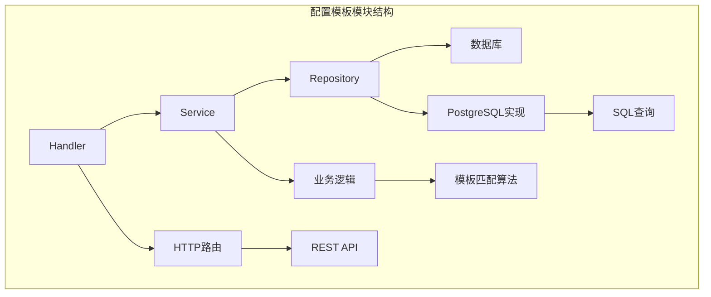
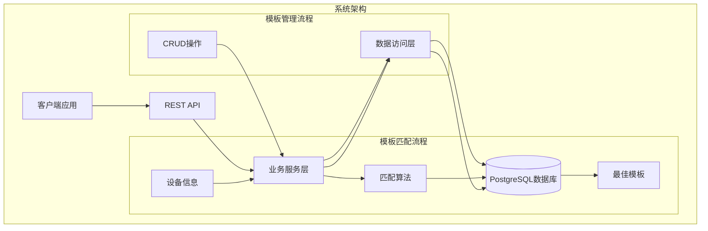
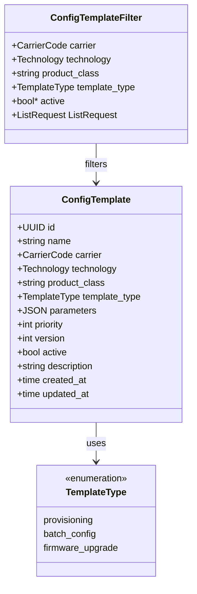
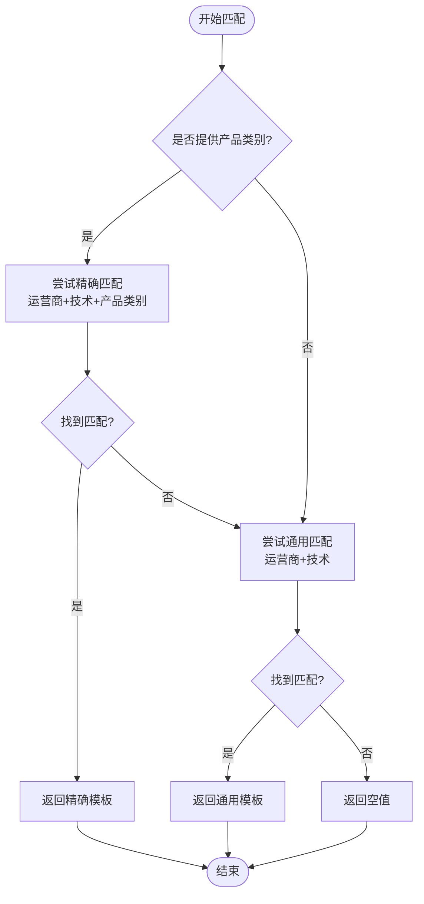
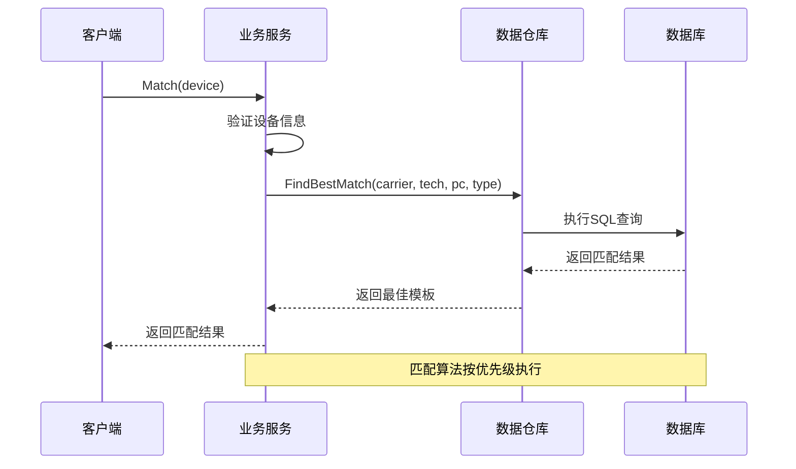
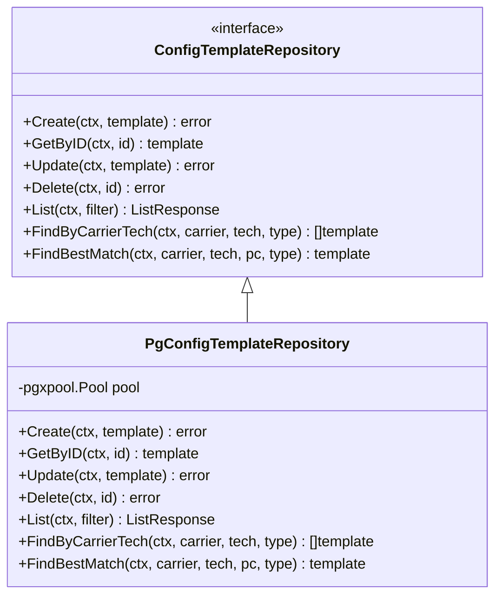
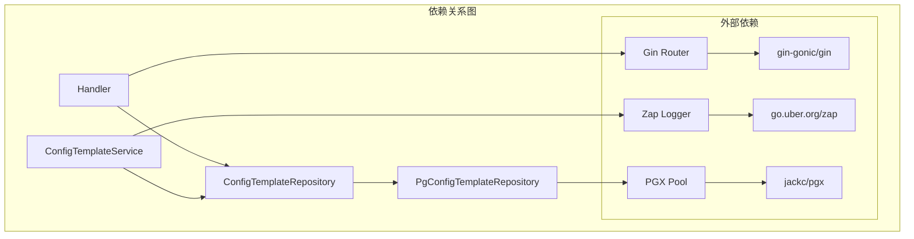

# 配置模板系统

<cite>
**本文档引用的文件**
- [model.go](file://omcgo/internal/config/template/model.go)
- [service.go](file://omcgo/internal/config/template/service.go)
- [repository.go](file://omcgo/internal/config/template/repository.go)
- [handler.go](file://omcgo/internal/config/template/handler.go)
- [pg_repository.go](file://omcgo/internal/config/template/pg_repository.go)
- [matcher.go](file://omcgo/internal/provision/matcher.go)
- [000006_create_config_templates.up.sql](file://omcgo/migrations/000006_create_config_templates.up.sql)
- [service_test.go](file://omcgo/internal/config/template/service_test.go)
- [handler_test.go](file://omcgo/internal/config/template/handler_test.go)
</cite>

## 目录
1. [简介](#简介)
2. [项目结构](#项目结构)
3. [核心组件](#核心组件)
4. [架构概览](#架构概览)
5. [详细组件分析](#详细组件分析)
6. [依赖关系分析](#依赖关系分析)
7. [性能考虑](#性能考虑)
8. [故障排除指南](#故障排除指南)
9. [结论](#结论)
10. [附录](#附录)

## 简介

配置模板系统是OMC（操作维护中心）平台中的关键组件，用于为不同运营商、技术和产品类别的设备提供标准化的配置参数。该系统实现了智能模板匹配机制，支持优先级排序和版本控制，确保设备能够获得最适合的配置模板。

系统采用分层架构设计，包含数据模型、业务服务、数据访问层和REST API接口，支持完整的模板生命周期管理，包括创建、查询、更新、删除和匹配等功能。

## 项目结构

配置模板系统位于OMC后端服务的配置模块中，采用清晰的分层组织结构：

**图表来源**
- [handler.go:12-32](file://omcgo/internal/config/template/handler.go#L12-L32)
- [service.go:11-23](file://omcgo/internal/config/template/service.go#L11-L23)
- [repository.go:10-19](file://omcgo/internal/config/template/repository.go#L10-L19)

**章节来源**
- [handler.go:12-32](file://omcgo/internal/config/template/handler.go#L12-L32)
- [service.go:11-23](file://omcgo/internal/config/template/service.go#L11-L23)
- [repository.go:10-19](file://omcgo/internal/config/template/repository.go#L10-L19)

## 核心组件

配置模板系统由四个核心层次组成，每个层次都有明确的职责分工：

### 数据模型层
负责定义模板的数据结构和验证规则，包括模板类型、过滤条件和字段约束。

### 服务层
实现业务逻辑，包括模板匹配算法、查询过滤和版本控制管理。

### 数据访问层
提供数据持久化接口，定义模板的CRUD操作规范。

### API层
暴露REST接口，提供模板的HTTP访问能力。

**章节来源**
- [model.go:20-45](file://omcgo/internal/config/template/model.go#L20-L45)
- [service.go:11-53](file://omcgo/internal/config/template/service.go#L11-L53)
- [repository.go:10-19](file://omcgo/internal/config/template/repository.go#L10-L19)

## 架构概览

系统采用经典的三层架构模式，通过接口抽象实现松耦合设计：

**图表来源**
- [service.go:25-47](file://omcgo/internal/config/template/service.go#L25-L47)
- [pg_repository.go:240-292](file://omcgo/internal/config/template/pg_repository.go#L240-L292)

系统的关键特性包括：
- **智能匹配**：基于运营商、技术类型和产品类别的多级匹配
- **优先级排序**：支持模板优先级和版本控制
- **灵活查询**：支持多种过滤条件和排序选项
- **事务安全**：完整的CRUD操作支持

## 详细组件分析

### 数据模型设计

配置模板的数据模型定义了完整的模板结构和约束条件：

**图表来源**
- [model.go:21-45](file://omcgo/internal/config/template/model.go#L21-L45)

模板类型支持三种主要用途：
- **provisioning**：设备配置模板
- **batch_config**：批量配置模板  
- **firmware_upgrade**：固件升级模板

**章节来源**
- [model.go:11-35](file://omcgo/internal/config/template/model.go#L11-L35)

### 模板匹配算法

系统实现了智能的模板匹配算法，支持多级优先级匹配：

**图表来源**
- [pg_repository.go:240-292](file://omcgo/internal/config/template/pg_repository.go#L240-L292)

匹配算法的优先级规则：
1. **最高优先级**：运营商 + 技术 + 产品类别完全匹配
2. **次高优先级**：运营商 + 技术匹配（忽略产品类别）
3. **未找到匹配**：返回空值

**章节来源**
- [pg_repository.go:240-292](file://omcgo/internal/config/template/pg_repository.go#L240-L292)
- [matcher.go:8-48](file://omcgo/internal/provision/matcher.go#L8-L48)

### 业务服务层

服务层提供了完整的业务逻辑实现，包括模板管理和匹配功能：

**图表来源**
- [service.go:25-47](file://omcgo/internal/config/template/service.go#L25-L47)
- [pg_repository.go:240-292](file://omcgo/internal/config/template/pg_repository.go#L240-L292)

**章节来源**
- [service.go:25-53](file://omcgo/internal/config/template/service.go#L25-L53)

### 数据访问层实现

数据访问层提供了完整的数据库操作实现，包括CRUD操作和复杂查询：

**图表来源**
- [repository.go:10-19](file://omcgo/internal/config/template/repository.go#L10-L19)
- [pg_repository.go:36-44](file://omcgo/internal/config/template/pg_repository.go#L36-L44)

**章节来源**
- [repository.go:10-19](file://omcgo/internal/config/template/repository.go#L10-L19)
- [pg_repository.go:36-371](file://omcgo/internal/config/template/pg_repository.go#L36-L371)

### REST API接口

系统提供了完整的REST API接口，支持模板的完整生命周期管理：

| 方法 | 路径 | 描述 | 请求体 | 响应 |
|------|------|------|--------|------|
| GET | /api/v1/templates | 获取模板列表 | 查询参数 | ListResponse |
| GET | /api/v1/templates/:id | 获取单个模板 | 无 | ConfigTemplate |
| POST | /api/v1/templates | 创建新模板 | CreateTemplateRequest | ConfigTemplate |
| PUT | /api/v1/templates/:id | 更新模板 | UpdateTemplateRequest | ConfigTemplate |
| DELETE | /api/v1/templates/:id | 删除模板 | 无 | 204 No Content |

**章节来源**
- [handler.go:22-32](file://omcgo/internal/config/template/handler.go#L22-L32)
- [handler.go:34-188](file://omcgo/internal/config/template/handler.go#L34-L188)

## 依赖关系分析

系统采用接口驱动的设计模式，通过依赖注入实现松耦合架构：

**图表来源**
- [handler.go:13-20](file://omcgo/internal/config/template/handler.go#L13-L20)
- [service.go:12-23](file://omcgo/internal/config/template/service.go#L12-L23)
- [pg_repository.go:37-44](file://omcgo/internal/config/template/pg_repository.go#L37-L44)

**章节来源**
- [handler.go:13-20](file://omcgo/internal/config/template/handler.go#L13-L20)
- [service.go:12-23](file://omcgo/internal/config/template/service.go#L12-L23)
- [pg_repository.go:37-44](file://omcgo/internal/config/template/pg_repository.go#L37-L44)

## 性能考虑

配置模板系统在设计时充分考虑了性能优化，采用了多种优化策略：

### 数据库优化
- **复合索引**：为常用查询条件建立复合索引
- **条件索引**：仅对活跃模板建立索引
- **查询优化**：使用LIMIT 1避免全表扫描

### 缓存策略
- **内存缓存**：热门模板可考虑引入Redis缓存
- **查询缓存**：针对频繁查询的结果进行缓存

### 并发处理
- **连接池**：使用PGX连接池管理数据库连接
- **异步处理**：批量操作可采用异步处理方式

## 故障排除指南

### 常见问题及解决方案

**模板匹配失败**
- 检查设备信息是否正确设置
- 验证模板的激活状态
- 确认模板的优先级设置

**数据库连接问题**
- 检查数据库连接字符串
- 验证数据库服务状态
- 查看连接池配置

**API调用错误**
- 确认请求格式是否正确
- 检查必填字段是否完整
- 验证权限认证

**章节来源**
- [service_test.go:79-169](file://omcgo/internal/config/template/service_test.go#L79-L169)
- [handler_test.go:158-322](file://omcgo/internal/config/template/handler_test.go#L158-L322)

## 结论

配置模板系统通过清晰的分层架构、智能的匹配算法和完善的API接口，为OMC平台提供了强大的配置管理能力。系统支持多级优先级匹配、灵活的查询过滤和完整的生命周期管理，能够满足不同运营商和设备类型的配置需求。

未来可以考虑的功能增强包括：
- 模板版本历史管理
- 模板继承和扩展机制
- 更丰富的查询过滤选项
- 模板导入导出功能

## 附录

### 数据库表结构

配置模板表包含以下关键字段：
- `id`: 主键UUID
- `carrier`: 运营商代码
- `technology`: 技术类型
- `product_class`: 产品类别
- `template_type`: 模板类型
- `parameters`: JSON参数
- `priority`: 优先级
- `version`: 版本号
- `active`: 激活状态

### 最佳实践建议

**模板创建规范**
- 合理设置模板优先级
- 使用描述性模板名称
- 保持参数结构一致性
- 及时更新模板版本

**模板使用建议**
- 优先使用精确匹配模板
- 定期清理过期模板
- 监控模板使用情况
- 建立模板变更流程

**性能优化建议**
- 合理使用索引
- 优化查询条件
- 实施缓存策略
- 监控系统性能