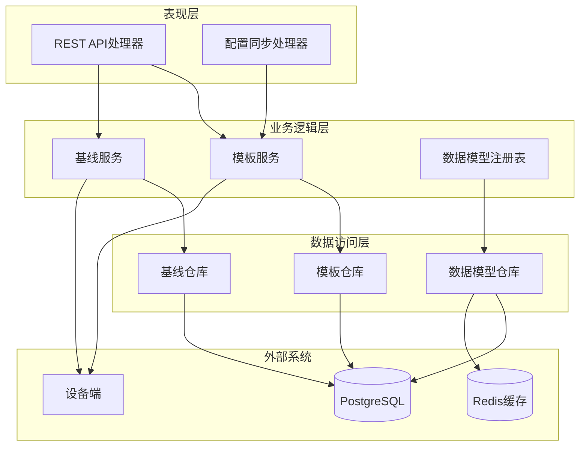
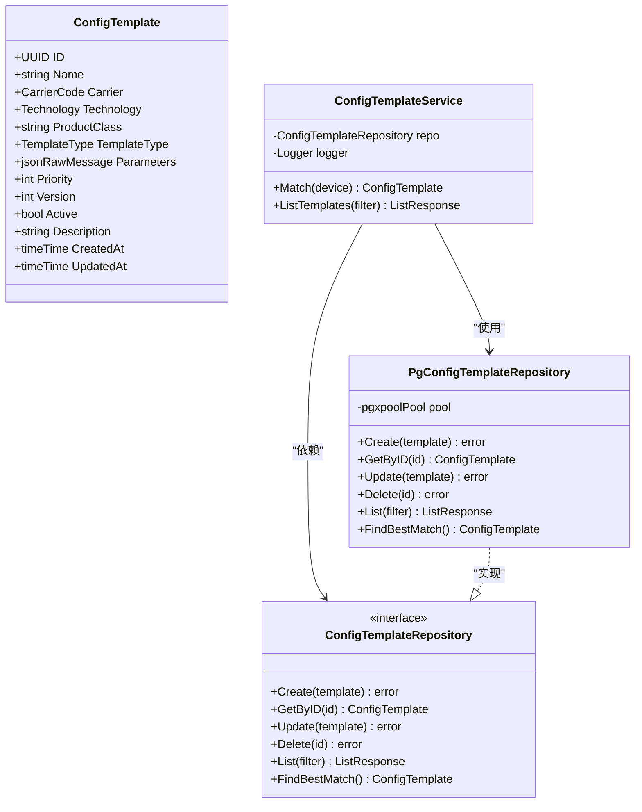
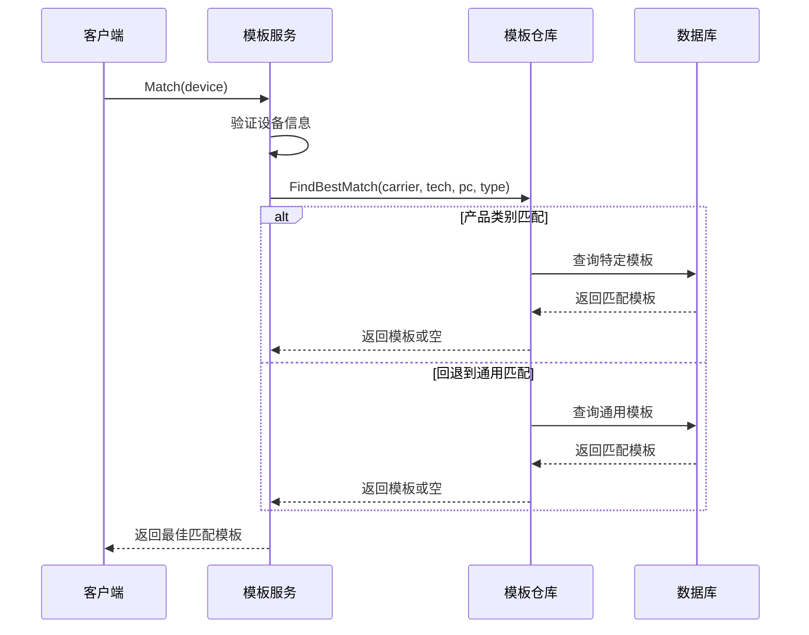
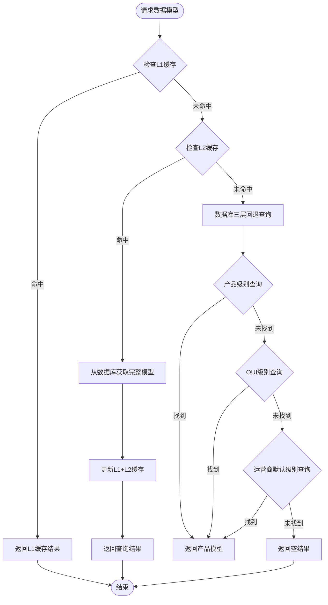
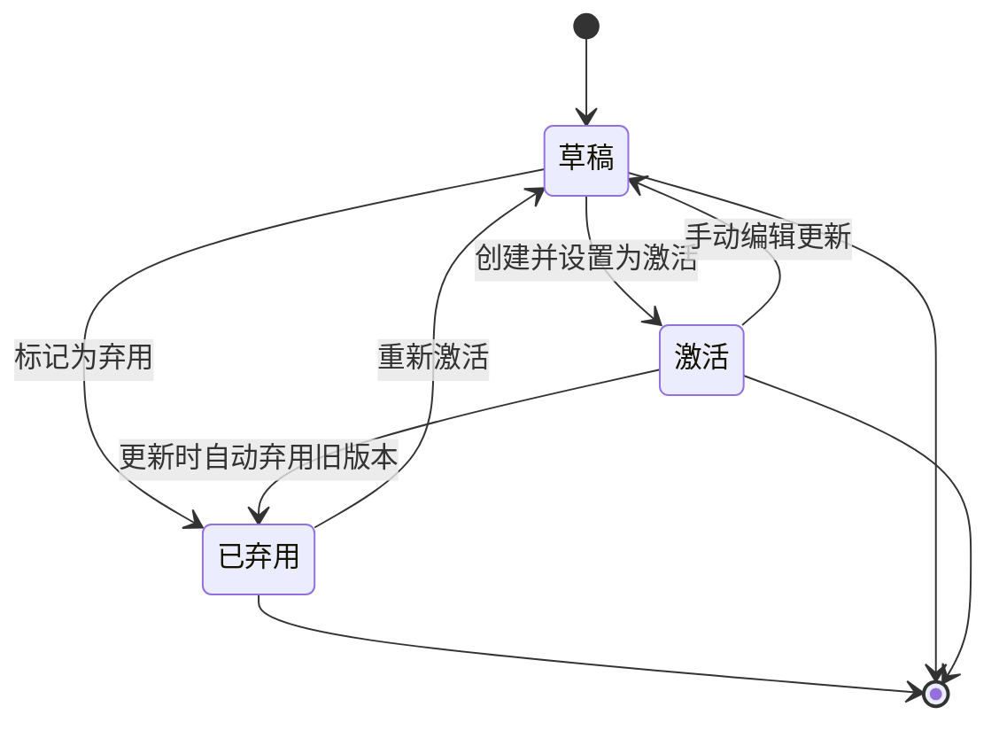
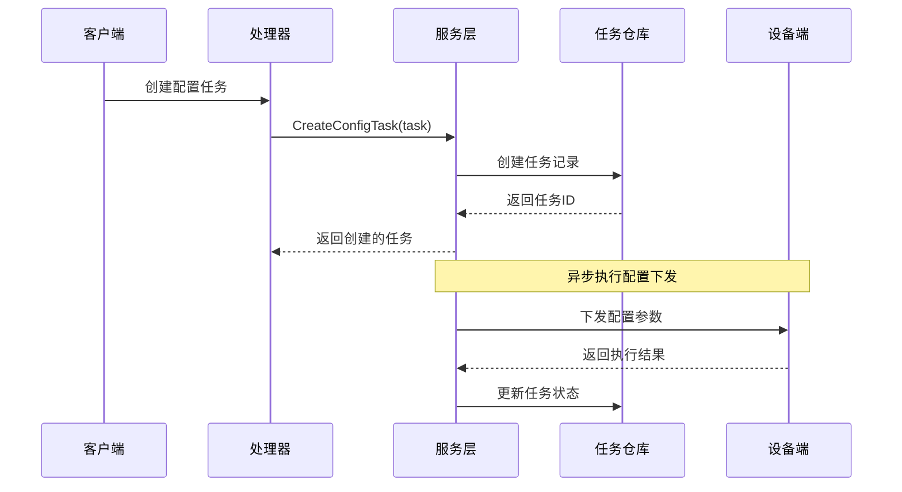
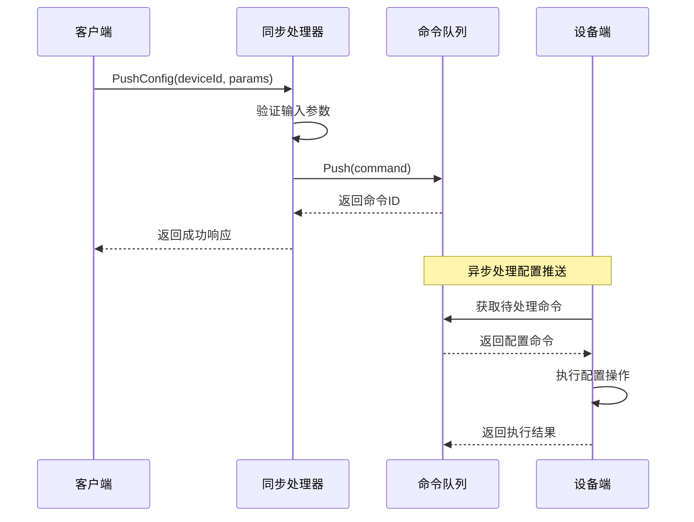
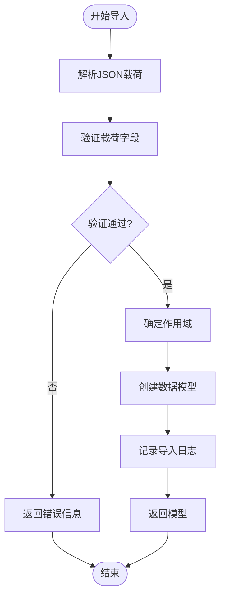
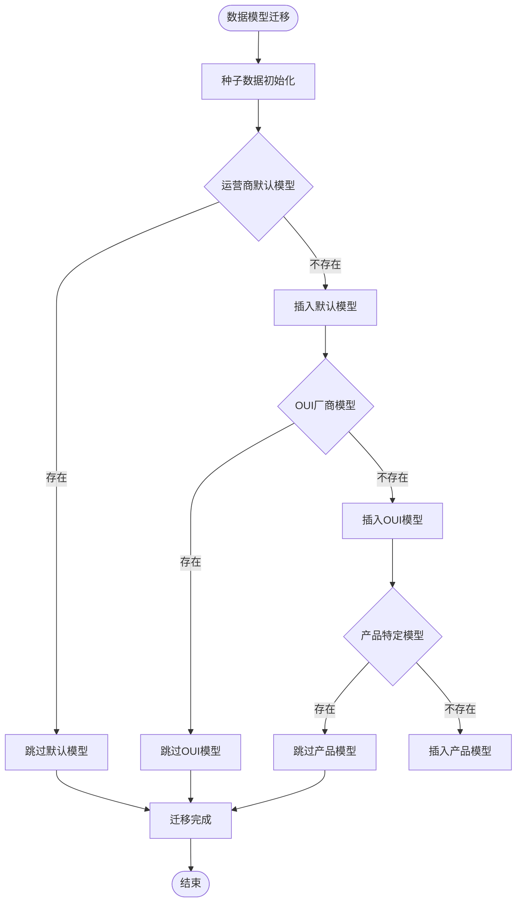
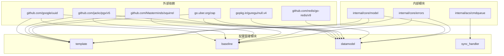

# 配置管理模块

<cite>
**本文档引用的文件**
- [omcgo/internal/config/template/model.go](file://omcgo/internal/config/template/model.go)
- [omcgo/internal/config/template/service.go](file://omcgo/internal/config/template/service.go)
- [omcgo/internal/config/template/handler.go](file://omcgo/internal/config/template/handler.go)
- [omcgo/internal/config/template/pg_repository.go](file://omcgo/internal/config/template/pg_repository.go)
- [omcgo/internal/config/baseline/model.go](file://omcgo/internal/config/baseline/model.go)
- [omcgo/internal/config/baseline/service.go](file://omcgo/internal/config/baseline/service.go)
- [omcgo/internal/config/baseline/handler.go](file://omcgo/internal/config/baseline/handler.go)
- [omcgo/internal/config/baseline/pg_repository.go](file://omcgo/internal/config/baseline/pg_repository.go)
- [omcgo/internal/config/datamodel/model.go](file://omcgo/internal/config/datamodel/model.go)
- [omcgo/internal/config/datamodel/registry.go](file://omcgo/internal/config/datamodel/registry.go)
- [omcgo/internal/config/datamodel/importer.go](file://omcgo/internal/config/datamodel/importer.go)
- [omcgo/internal/config/datamodel/pg_repository.go](file://omcgo/internal/config/datamodel/pg_repository.go)
- [omcgo/internal/config/datamodel/cache.go](file://omcgo/internal/config/datamodel/cache.go)
- [omcgo/internal/config/sync_handler.go](file://omcgo/internal/config/sync_handler.go)
- [omcgo/migrations/000046_add_default_data_models.up.sql](file://omcgo/migrations/000046_add_default_data_models.up.sql)
- [omcgo/migrations/000047_seed_data_models.up.sql](file://omcgo/migrations/000047_seed_data_models.up.sql)
- [omcgo/datamodels/seed/carrier_defaults/cmcc_lte.json](file://omcgo/datamodels/seed/carrier_defaults/cmcc_lte.json)
</cite>

## 更新摘要
**所做更改**
- 更新了数据模型注册表部分，反映了三层回退机制的重大改进
- 新增了默认数据模型迁移系统的详细说明
- 增强了数据模型解析流程的架构图和工作原理
- 补充了缓存架构和迁移系统的相关内容

## 目录
1. [简介](#简介)
2. [项目结构](#项目结构)
3. [核心组件](#核心组件)
4. [架构概览](#架构概览)
5. [详细组件分析](#详细组件分析)
6. [依赖分析](#依赖分析)
7. [性能考虑](#性能考虑)
8. [故障排除指南](#故障排除指南)
9. [结论](#结论)
10. [附录](#附录)

## 简介

配置管理模块是OMC系统中的关键基础设施组件，负责设备配置参数的统一管理、模板化配置、基线配置管理和实时同步机制。该模块采用分层架构设计，实现了完整的配置生命周期管理，包括配置模板的创建、验证、应用和审计，以及配置参数的导入导出和批量下发。

模块主要包含三个核心子系统：
- **配置模板系统**：提供模板化的配置参数管理，支持按运营商、技术类型和产品类别的多级匹配
- **数据模型注册表**：实现TR069数据模型的三层缓存架构，提供高效的参数定义解析和验证
- **配置基线管理**：支持配置基线的创建、激活和任务调度，实现批量配置下发和状态跟踪

**更新** 新增了三层回退机制（产品级别、OUI级别、carrier_default级别）和默认数据模型迁移系统，显著提升了数据模型解析的可靠性和性能。

## 项目结构

配置管理模块位于`omcgo/internal/config/`目录下，采用按功能域划分的组织方式：

```mermaid
graph TB
subgraph "配置管理模块结构"
A[template/] -- 配置模板系统
B[baseline/] -- 配置基线管理
C[datamodel/] -- 数据模型管理
D[sync_handler.go] -- 同步处理机制
A --> A1[model.go]
A --> A2[service.go]
A --> A3[handler.go]
A --> A4[pg_repository.go]
B --> B1[model.go]
B --> B2[service.go]
B --> B3[handler.go]
B --> B4[pg_repository.go]
C --> C1[model.go]
C --> C2[registry.go]
C --> C3[importer.go]
C --> C4[pg_repository.go]
C --> C5[cache.go]
end
```

**图表来源**
- [omcgo/internal/config/template/model.go:1-46](file://omcgo/internal/config/template/model.go#L1-L46)
- [omcgo/internal/config/baseline/model.go:1-115](file://omcgo/internal/config/baseline/model.go#L1-L115)
- [omcgo/internal/config/datamodel/model.go:1-100](file://omcgo/internal/config/datamodel/model.go#L1-L100)

**章节来源**
- [omcgo/internal/config/template/model.go:1-46](file://omcgo/internal/config/template/model.go#L1-L46)
- [omcgo/internal/config/baseline/model.go:1-115](file://omcgo/internal/config/baseline/model.go#L1-L115)
- [omcgo/internal/config/datamodel/model.go:1-100](file://omcgo/internal/config/datamodel/model.go#L1-L100)

## 核心组件

### 配置模板系统

配置模板系统提供了灵活的模板化配置管理能力，支持多种模板类型和优先级匹配机制。

**模板类型定义**：
- provisioning：设备配置模板
- batch_config：批量配置模板  
- firmware_upgrade：固件升级模板

**匹配算法**：
模板匹配采用三层优先级策略：
1. 最精确匹配：运营商 + 技术 + 产品类别
2. 通用匹配：运营商 + 技术（无产品类别）
3. 默认匹配：仅运营商 + 技术

### 数据模型注册表

**更新** 数据模型注册表实现了TR069数据模型的三层回退架构，确保高性能的数据模型解析和验证。

**缓存层次**：
- L1内存缓存：本地进程内缓存，使用sync.Map实现
- L2 Redis缓存：分布式缓存，支持跨实例共享
- L3数据库缓存：持久化存储，使用PostgreSQL

**解析策略**：
1. **产品级别（最具体）**：需要完整的OUI和产品类别信息
2. **OUI级别**：基于厂商的默认配置
3. **运营商默认级别**：最广泛的配置回退

**三层回退机制**：
- Level 1 (product)：最具体，要求同时具备OUI和产品类别
- Level 2 (oui)：厂商级默认，要求具备OUI
- Level 3 (carrier_default)：最广泛回退，不依赖特定OUI或产品类别

### 配置基线管理

配置基线管理提供了配置基线的完整生命周期管理，支持多种任务类型和状态跟踪。

**基线状态**：
- draft：草稿状态
- active：激活状态  
- deprecated：已弃用状态

**任务类型**：
- param-sync：参数同步任务
- batch-config：批量配置任务
- baseline-apply：基线应用任务
- neighbor-update：邻区关系更新任务

## 架构概览

配置管理模块采用清晰的分层架构，实现了关注点分离和高内聚低耦合的设计原则。



**图表来源**
- [omcgo/internal/config/template/service.go:11-23](file://omcgo/internal/config/template/service.go#L11-L23)
- [omcgo/internal/config/baseline/service.go:14-35](file://omcgo/internal/config/baseline/service.go#L14-L35)
- [omcgo/internal/config/datamodel/registry.go:21-38](file://omcgo/internal/config/datamodel/registry.go#L21-L38)

## 详细组件分析

### 配置模板组件分析

#### 类结构图



**图表来源**
- [omcgo/internal/config/template/model.go:21-35](file://omcgo/internal/config/template/model.go#L21-L35)
- [omcgo/internal/config/template/service.go:11-23](file://omcgo/internal/config/template/service.go#L11-L23)
- [omcgo/internal/config/template/pg_repository.go:36-44](file://omcgo/internal/config/template/pg_repository.go#L36-L44)

#### 模板匹配流程



**图表来源**
- [omcgo/internal/config/template/service.go:25-47](file://omcgo/internal/config/template/service.go#L25-L47)
- [omcgo/internal/config/template/pg_repository.go:240-292](file://omcgo/internal/config/template/pg_repository.go#L240-L292)

**章节来源**
- [omcgo/internal/config/template/model.go:11-46](file://omcgo/internal/config/template/model.go#L11-L46)
- [omcgo/internal/config/template/service.go:25-53](file://omcgo/internal/config/template/service.go#L25-L53)
- [omcgo/internal/config/template/handler.go:34-189](file://omcgo/internal/config/template/handler.go#L34-L189)
- [omcgo/internal/config/template/pg_repository.go:240-292](file://omcgo/internal/config/template/pg_repository.go#L240-L292)

### 数据模型注册表组件分析

#### **更新** 三层回退机制架构



**图表来源**
- [omcgo/internal/config/datamodel/registry.go:40-191](file://omcgo/internal/config/datamodel/registry.go#L40-L191)

#### 注册表工作原理

**更新** 数据模型注册表实现了智能的三层缓存架构，通过以下策略确保高效的数据模型解析：

1. **本地缓存优先**：使用sync.Map实现的L1缓存提供最快的访问速度
2. **分布式缓存支持**：Redis作为L2缓存，支持多实例间的缓存一致性
3. **数据库回退机制**：完整的三层回退查询策略，确保数据完整性

**解析算法详细流程**：
- **Level 1 (产品级别)**：当同时提供OUI和产品类别时，查询最具体的配置
- **Level 2 (OUI级别)**：当仅提供OUI时，查询厂商级默认配置
- **Level 3 (运营商默认级别)**：当仅提供运营商和技术类型时，查询最广泛的默认配置

**缓存失效机制**：
- 当数据模型被激活、弃用或更新时，自动失效相关缓存
- 使用缓存版本号机制实现多实例间的一致性通知
- 支持全量缓存失效和增量缓存失效

**章节来源**
- [omcgo/internal/config/datamodel/registry.go:14-336](file://omcgo/internal/config/datamodel/registry.go#L14-L336)

### 配置基线管理组件分析

#### 基线生命周期管理



#### 任务执行流程



**图表来源**
- [omcgo/internal/config/baseline/service.go:108-128](file://omcgo/internal/config/baseline/service.go#L108-L128)
- [omcgo/internal/config/baseline/handler.go:235-262](file://omcgo/internal/config/baseline/handler.go#L235-L262)

**章节来源**
- [omcgo/internal/config/baseline/model.go:50-115](file://omcgo/internal/config/baseline/model.go#L50-L115)
- [omcgo/internal/config/baseline/service.go:39-141](file://omcgo/internal/config/baseline/service.go#L39-L141)
- [omcgo/internal/config/baseline/handler.go:87-289](file://omcgo/internal/config/baseline/handler.go#L87-L289)

### 配置同步处理机制

#### 实时同步流程



**图表来源**
- [omcgo/internal/config/sync_handler.go:61-97](file://omcgo/internal/config/sync_handler.go#L61-L97)

**章节来源**
- [omcgo/internal/config/sync_handler.go:14-157](file://omcgo/internal/config/sync_handler.go#L14-L157)

### 数据模型导入导出流程

#### 导入验证流程



**图表来源**
- [omcgo/internal/config/datamodel/importer.go:55-105](file://omcgo/internal/config/datamodel/importer.go#L55-L105)

**章节来源**
- [omcgo/internal/config/datamodel/importer.go:41-259](file://omcgo/internal/config/datamodel/importer.go#L41-L259)

### **新增** 默认数据模型迁移系统

#### 迁移架构流程



**图表来源**
- [omcgo/migrations/000046_add_default_data_models.up.sql:1-110](file://omcgo/migrations/000046_add_default_data_models.up.sql#L1-L110)
- [omcgo/migrations/000047_seed_data_models.up.sql:1-186](file://omcgo/migrations/000047_seed_data_models.up.sql#L1-L186)

#### 迁移系统特性

**更新** 默认数据模型迁移系统提供了完整的数据模型初始化和管理能力：

1. **多级默认模型**：
   - 运营商默认级别（carrier_default）：最广泛的配置回退
   - 厂商级别（oui）：基于OUI的厂商默认配置
   - 产品级别（product）：针对特定产品的精确配置

2. **种子数据管理**：
   - 提供运营商特定的默认配置模板
   - 支持TR069标准参数的完整定义
   - 包含约束条件和验证规则

3. **迁移策略**：
   - 使用ON CONFLICT避免重复插入
   - 支持部分覆盖和增量更新
   - 保持向后兼容性

**章节来源**
- [omcgo/migrations/000046_add_default_data_models.up.sql:1-110](file://omcgo/migrations/000046_add_default_data_models.up.sql#L1-L110)
- [omcgo/migrations/000047_seed_data_models.up.sql:1-186](file://omcgo/migrations/000047_seed_data_models.up.sql#L1-L186)
- [omcgo/datamodels/seed/carrier_defaults/cmcc_lte.json:1-285](file://omcgo/datamodels/seed/carrier_defaults/cmcc_lte.json#L1-L285)

## 依赖分析

配置管理模块的依赖关系体现了清晰的分层架构设计，各层之间保持松耦合。



**图表来源**
- [omcgo/internal/config/template/pg_repository.go:3-17](file://omcgo/internal/config/template/pg_repository.go#L3-L17)
- [omcgo/internal/config/baseline/pg_repository.go:3-15](file://omcgo/internal/config/baseline/pg_repository.go#L3-L15)
- [omcgo/internal/config/datamodel/pg_repository.go:3-17](file://omcgo/internal/config/datamodel/pg_repository.go#L3-L17)

**章节来源**
- [omcgo/internal/config/template/pg_repository.go:1-371](file://omcgo/internal/config/template/pg_repository.go#L1-L371)
- [omcgo/internal/config/baseline/pg_repository.go:1-521](file://omcgo/internal/config/baseline/pg_repository.go#L1-L521)
- [omcgo/internal/config/datamodel/pg_repository.go:1-770](file://omcgo/internal/config/datamodel/pg_repository.go#L1-L770)

## 性能考虑

### 缓存策略优化

**更新** 配置管理模块采用了多层次的缓存策略来优化性能：

1. **本地缓存优化**：使用sync.Map实现的L1缓存，避免锁竞争
2. **分布式缓存协调**：通过缓存版本号机制实现多实例间的一致性
3. **查询优化**：模板匹配采用单次查询策略，避免多次数据库往返
4. **三层回退优化**：数据模型解析采用渐进式查询，减少不必要的数据库访问

### 数据库性能优化

1. **索引设计**：在常用查询字段上建立适当的索引
2. **批量操作**：支持批量配置任务的并发处理
3. **连接池管理**：合理配置数据库连接池大小

### 内存使用优化

1. **零拷贝设计**：使用json.RawMessage避免不必要的数据复制
2. **对象复用**：在可能的情况下重用对象实例
3. **延迟加载**：只在需要时加载完整的数据模型

## 故障排除指南

### 常见问题诊断

**模板匹配失败**
- 检查设备信息是否正确设置
- 验证模板的激活状态
- 确认模板的优先级设置

**数据模型解析错误**
- 验证JSON格式的有效性
- 检查参数树的结构完整性
- 确认作用域和OUI信息的正确性
- **更新** 检查三层回退机制是否正常工作

**配置同步超时**
- 检查设备连接状态
- 验证命令队列的可用性
- 监控网络连接质量

**缓存一致性问题**
- **更新** 检查Redis缓存连接状态
- 验证缓存版本号同步机制
- 确认缓存失效触发是否正常

### 错误处理机制

模块实现了完善的错误处理和日志记录机制：

1. **结构化日志**：使用Zap Logger记录详细的错误信息
2. **错误传播**：保持错误上下文信息的完整性
3. **降级策略**：在网络异常时提供合理的降级行为

**章节来源**
- [omcgo/internal/config/sync_handler.go:61-157](file://omcgo/internal/config/sync_handler.go#L61-L157)

## 结论

配置管理模块通过精心设计的架构和实现，提供了完整的配置生命周期管理能力。模块采用分层架构设计，实现了高内聚低耦合的代码结构，支持大规模设备的配置管理需求。

**更新** 主要优势包括：
- **可扩展性**：模块化设计支持功能的独立扩展
- **高性能**：多级缓存架构确保了系统的响应性能
- **可靠性**：完善的错误处理和监控机制保证了系统的稳定性
- **易维护性**：清晰的代码结构和文档便于后续维护
- **三层回退机制**：显著提升了数据模型解析的可靠性和容错能力
- **默认迁移系统**：提供了完整的数据模型初始化和管理能力

该模块为OMC系统的配置管理提供了坚实的基础，支持运营商级别的配置管理需求，并通过三层回退机制和默认迁移系统确保了系统的稳定性和可维护性。

## 附录

### API使用示例

**配置模板API**
- GET `/api/v1/templates` - 列出所有配置模板
- POST `/api/v1/templates` - 创建新的配置模板
- GET `/api/v1/templates/:id` - 获取指定模板详情
- PUT `/api/v1/templates/:id` - 更新配置模板
- DELETE `/api/v1/templates/:id` - 删除配置模板

**配置基线API**
- GET `/api/v1/config/baselines` - 列出所有基线配置
- POST `/api/v1/config/baselines` - 创建基线配置
- GET `/api/v1/config/tasks` - 列出配置任务
- POST `/api/v1/config/tasks` - 创建配置任务

**配置同步API**
- POST `/api/v1/config/sync/push/:deviceId` - 推送配置参数
- POST `/api/v1/config/sync/pull/:deviceId` - 拉取配置参数
- GET `/api/v1/config/sync/status/:deviceId` - 获取同步状态

**数据模型API**
- GET `/api/v1/config/datamodels` - 列出所有数据模型
- POST `/api/v1/config/datamodels` - 创建数据模型
- GET `/api/v1/config/datamodels/:id` - 获取数据模型详情
- POST `/api/v1/config/datamodels/import` - 导入数据模型
- POST `/api/v1/config/datamodels/export/:id` - 导出数据模型

### 最佳实践建议

1. **模板设计**：遵循模板优先级设计原则，确保模板的层次结构清晰
2. **数据模型管理**：定期清理过期的数据模型，保持注册表的准确性
3. **缓存策略**：根据实际使用情况调整缓存参数，平衡内存使用和性能
4. **监控告警**：建立完善的监控体系，及时发现和处理异常情况
5. **安全考虑**：实施严格的权限控制和审计机制，确保配置变更的安全性
6. **三层回退机制**：合理配置不同级别的数据模型，确保解析的准确性和可靠性
7. **迁移管理**：定期检查和更新默认数据模型，保持与最新标准的同步

### **新增** 数据模型迁移最佳实践

1. **迁移策略**：使用ON CONFLICT避免重复数据，确保迁移的幂等性
2. **版本管理**：为数据模型设置明确的版本号，支持向后兼容
3. **约束验证**：在迁移过程中验证参数约束和业务规则
4. **回滚机制**：提供完整的数据模型回滚能力，确保迁移的安全性
5. **性能监控**：监控迁移过程中的数据库性能，避免影响生产环境