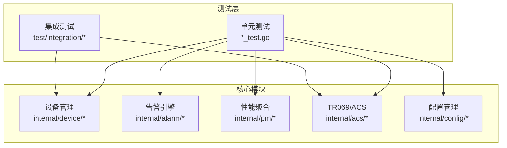
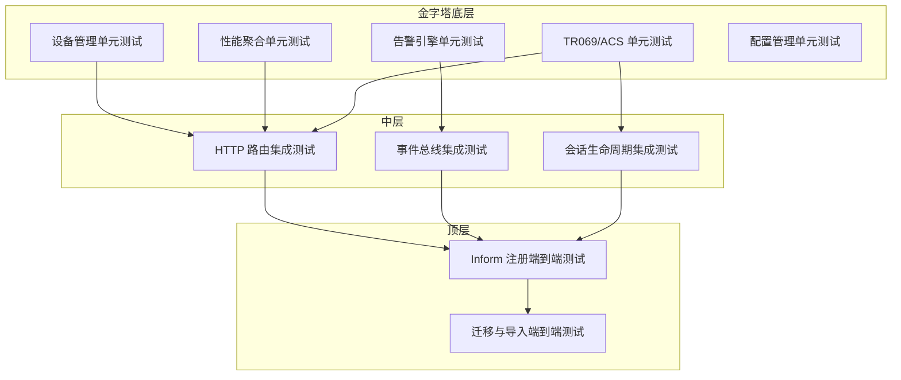
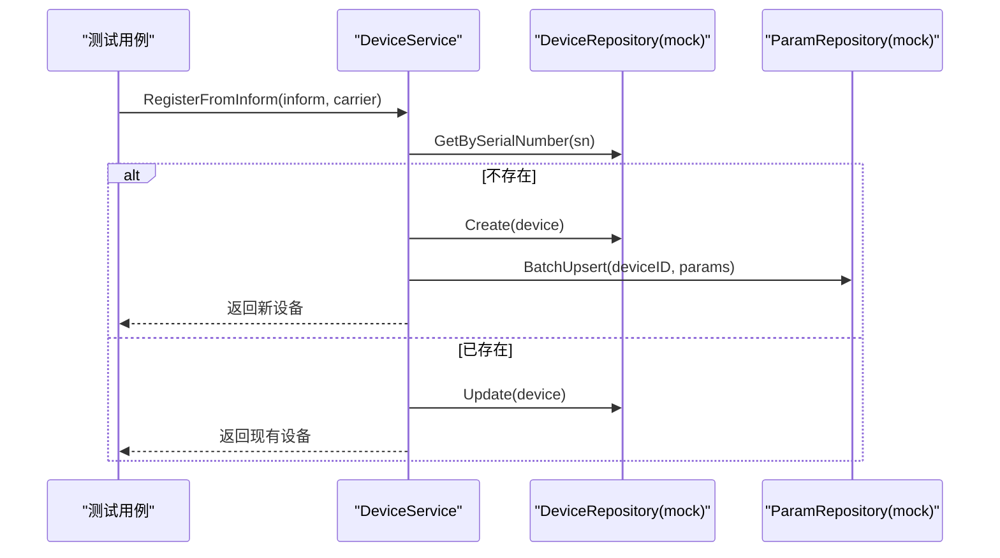
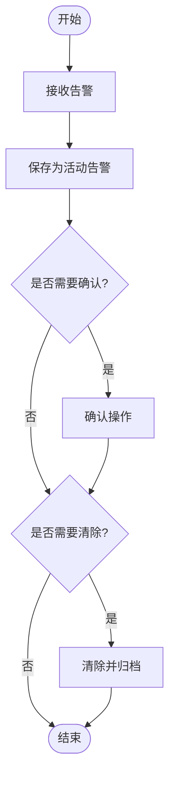
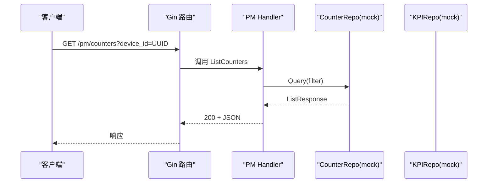
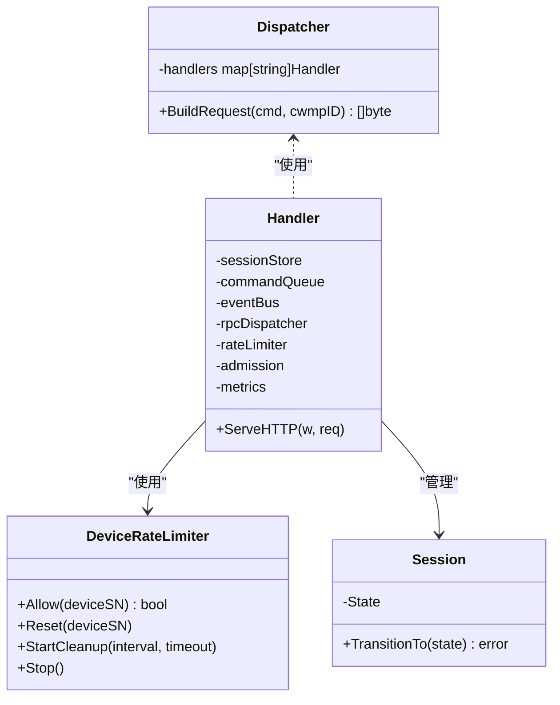
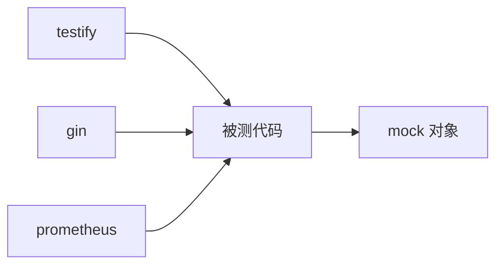

# 单元测试

<cite>
**本文引用的文件**
- [go.mod](file://omcgo/go.mod)
- [.golangci.yml](file://omcgo/.golangci.yml)
- [device/service_test.go](file://omcgo/internal/device/service_test.go)
- [alarm/engine_test.go](file://omcgo/internal/alarm/engine_test.go)
- [pm/handler_test.go](file://omcgo/internal/pm/handler_test.go)
- [provision/engine_test.go](file://omcgo/internal/provision/engine_test.go)
- [acs/rpc/dispatcher_test.go](file://omcgo/internal/acs/rpc/dispatcher_test.go)
- [acs/handler_test.go](file://omcgo/internal/acs/handler_test.go)
- [acs/metrics_test.go](file://omcgo/internal/acs/metrics_test.go)
- [acs/ratelimit_test.go](file://omcgo/internal/acs/ratelimit_test.go)
- [acs/session_test.go](file://omcgo/internal/acs/session_test.go)
- [config/baseline/handler_test.go](file://omcgo/internal/config/baseline/handler_test.go)
- [config/template/handler_test.go](file://omcgo/internal/config/template/handler_test.go)
- [config/datamodel/importer_test.go](file://omcgo/internal/config/datamodel/importer_test.go)
- [test/integration/api_sprint1_test.go](file://omcgo/test/integration/api_sprint1_test.go)
- [test/integration/api_sprint2_test.go](file://omcgo/test/integration/api_sprint2_test.go)
- [test/integration/api_sprint3_test.go](file://omcgo/test/integration/api_sprint3_test.go)
- [test/integration/api_sprint4_test.go](file://omcgo/test/integration/api_sprint4_test.go)
- [test/integration/api_sprint5_test.go](file://omcgo/test/integration/api_sprint5_test.go)
- [test/integration/inform_register_test.go](file://omcgo/test/integration/inform_register_test.go)
</cite>

## 目录
1. [简介](#简介)
2. [项目结构](#项目结构)
3. [核心组件](#核心组件)
4. [架构总览](#架构总览)
5. [详细组件分析](#详细组件分析)
6. [依赖关系分析](#依赖关系分析)
7. [性能考虑](#性能考虑)
8. [故障排查指南](#故障排查指南)
9. [结论](#结论)
10. [附录](#附录)

## 简介
本文件面向 Baicells OMC 项目的单元测试，系统性阐述测试设计原则、测试金字塔底层结构、Go 测试框架与 testify 断言库的使用方式，并结合实际模块（设备管理、告警引擎、性能聚合、TR069 处理等）给出测试策略、用例设计与最佳实践。同时提供覆盖率与代码质量标准建议，帮助团队建立可持续的测试体系。

## 项目结构
- 单元测试遵循 Go 标准约定，以 _test.go 结尾，位于各模块内部，便于就近维护与复用。
- 项目使用 testify 作为断言与测试辅助库；集成 Prometheus 指标测试；部分模块使用 Gin 路由进行 HTTP 接口测试。
- 集成测试位于 test/integration 下，覆盖端到端场景（如 Inform 注册流程）。

**图表来源**
- [device/service_test.go:1-646](file://omcgo/internal/device/service_test.go#L1-L646)
- [alarm/engine_test.go:1-275](file://omcgo/internal/alarm/engine_test.go#L1-L275)
- [pm/handler_test.go:1-287](file://omcgo/internal/pm/handler_test.go#L1-L287)
- [acs/handler_test.go:1-812](file://omcgo/internal/acs/handler_test.go#L1-L812)
- [config/baseline/handler_test.go:1-451](file://omcgo/internal/config/baseline/handler_test.go#L1-L451)

**章节来源**
- [go.mod:1-121](file://omcgo/go.mod#L1-L121)
- [.golangci.yml:1-39](file://omcgo/.golangci.yml#L1-L39)

## 核心组件
- 测试框架与断言
  - 使用 testify 的断言与 require 包进行断言与前置校验，统一风格、提升可读性。
  - 使用 testify 的 suite 或自定义测试辅助函数组织复杂测试场景。
- 模拟对象与依赖注入
  - 通过“函数字段型”或“结构体实现型”mock 对象隔离外部依赖，精确控制输入输出。
  - 在服务层构造最小化协作对象（如 DeviceService、KPIEngine），避免真实数据库/缓存/消息总线。
- HTTP 接口测试
  - 使用 httptest 创建请求与响应，配合 Gin 路由注册，验证控制器行为与状态码。
- 指标与并发测试
  - 使用 Prometheus 客户端注册表验证指标增减、标签值与观测值。
  - 并发场景下使用 WaitGroup、原子变量与断言，确保无竞态与死锁。

**章节来源**
- [device/service_test.go:1-646](file://omcgo/internal/device/service_test.go#L1-L646)
- [pm/handler_test.go:1-287](file://omcgo/internal/pm/handler_test.go#L1-L287)
- [acs/handler_test.go:1-812](file://omcgo/internal/acs/handler_test.go#L1-L812)
- [acs/metrics_test.go:1-52](file://omcgo/internal/acs/metrics_test.go#L1-L52)

## 架构总览
测试金字塔底层结构强调：
- 单元测试（模块内服务/处理器）：数量最多、执行最快、覆盖最细。
- 集成测试（路由/事件/会话）：验证跨组件交互与端到端流程。
- 端到端测试（Inform 注册/迁移）：覆盖真实协议与业务闭环。

**图表来源**
- [device/service_test.go:1-646](file://omcgo/internal/device/service_test.go#L1-L646)
- [alarm/engine_test.go:1-275](file://omcgo/internal/alarm/engine_test.go#L1-L275)
- [pm/handler_test.go:1-287](file://omcgo/internal/pm/handler_test.go#L1-L287)
- [acs/handler_test.go:1-812](file://omcgo/internal/acs/handler_test.go#L1-L812)
- [config/baseline/handler_test.go:1-451](file://omcgo/internal/config/baseline/handler_test.go#L1-L451)
- [config/template/handler_test.go:1-322](file://omcgo/internal/config/template/handler_test.go#L1-L322)
- [config/datamodel/importer_test.go:1-177](file://omcgo/internal/config/datamodel/importer_test.go#L1-L177)
- [test/integration/inform_register_test.go](file://omcgo/test/integration/inform_register_test.go)

## 详细组件分析

### 设备管理模块（device）
- 测试策略
  - 使用“函数字段型”mock 实现 DeviceRepository/DeviceParameterRepository，隔离数据库与存储。
  - 验证注册/更新/删除/状态机转换等核心路径，覆盖 Inform 解析与参数落库。
  - 边界条件：重复序列号、未知设备、空参数、非法技术类型识别。
- 关键用例
  - 注册新设备：断言创建、参数批量写入、状态与技术类型推断。
  - 更新设备：断言字段变更、状态自动流转（离线→在线）。
  - 创建/更新/删除 API：断言返回值与仓库调用。
- 最佳实践
  - 使用测试辅助函数构建 Inform 消息与期望参数，减少重复。
  - 对状态转换使用白盒断言，确保状态机约束被满足。

**图表来源**
- [device/service_test.go:168-243](file://omcgo/internal/device/service_test.go#L168-L243)

**章节来源**
- [device/service_test.go:1-646](file://omcgo/internal/device/service_test.go#L1-L646)

### 告警引擎模块（alarm）
- 测试策略
  - 使用内存存储模拟 AlarmStore，覆盖活动/历史告警、去重、确认、清除完整生命周期。
  - 验证不同设备/告警码组合下的并发与幂等行为。
- 关键用例
  - 新告警入库：状态 Active，ID 非空。
  - 重复告警：合并/更新描述与严重级别。
  - 确认/清除：状态流转与历史归档。
- 最佳实践
  - 使用结构体字段断言状态变化，避免魔法字符串。
  - 统一错误信息断言，便于定位问题。

**图表来源**
- [alarm/engine_test.go:101-274](file://omcgo/internal/alarm/engine_test.go#L101-L274)

**章节来源**
- [alarm/engine_test.go:1-275](file://omcgo/internal/alarm/engine_test.go#L1-L275)

### 性能聚合模块（pm）
- 测试策略
  - 使用 mock 仓库（计数器/KPI/任务）验证处理器路由、分页、过滤与请求体校验。
  - 验证 KPI 引擎在不同过滤条件下的查询与聚合结果。
- 关键用例
  - 列表计数器：默认分页、设备过滤、无效 UUID 场景。
  - 聚合计数器：聚合计算与返回结构。
  - KPI 查询与定义：分页与空结果。
  - 任务列表与创建：状态默认值与必填字段校验。
- 最佳实践
  - 使用 httptest.NewRecorder 与 gin.TestMode，确保路由行为与状态码一致。
  - 对错误场景断言 4xx 状态码与错误结构。

**图表来源**
- [pm/handler_test.go:103-152](file://omcgo/internal/pm/handler_test.go#L103-L152)

**章节来源**
- [pm/handler_test.go:1-287](file://omcgo/internal/pm/handler_test.go#L1-L287)

### TR069/ACS 模块（rpc/dispatcher、handler、metrics、ratelimit、session）
- 测试策略
  - Dispatcher：验证所有已知 RPC 方法注册与请求构建，未知方法返回错误。
  - Handler：覆盖 HTTP 方法限制、空体处理、SOAP 方法识别、会话状态机、速率限制、准入控制、事件发布与会话清理。
  - Metrics：验证指标注册、标签值与观测。
  - RateLimit：验证令牌桶、突发、逐设备独立限制、最大设备数与 LRU 淘汰。
  - Session：验证状态机合法/非法转换。
- 关键用例
  - Dispatcher：Get/Set/Download/Reboot 等方法构建请求体与类型。
  - Handler：Inform/Empty/RPCResponse/TransferComplete 生命周期与事件。
  - Metrics：指标增减、标签观测、重复注册保护。
  - RateLimit：并发访问、清理策略、Stop 安全。
  - Session：状态转换矩阵。
- 最佳实践
  - 使用最小化依赖构造 Handler，避免真实网络与外部服务。
  - 对会话绑定、连接池、资源释放进行显式断言。

**图表来源**
- [acs/rpc/dispatcher_test.go:1-180](file://omcgo/internal/acs/rpc/dispatcher_test.go#L1-L180)
- [acs/handler_test.go:1-812](file://omcgo/internal/acs/handler_test.go#L1-L812)
- [acs/metrics_test.go:1-52](file://omcgo/internal/acs/metrics_test.go#L1-L52)
- [acs/ratelimit_test.go:1-224](file://omcgo/internal/acs/ratelimit_test.go#L1-L224)
- [acs/session_test.go:1-43](file://omcgo/internal/acs/session_test.go#L1-L43)

**章节来源**
- [acs/rpc/dispatcher_test.go:1-180](file://omcgo/internal/acs/rpc/dispatcher_test.go#L1-L180)
- [acs/handler_test.go:1-812](file://omcgo/internal/acs/handler_test.go#L1-L812)
- [acs/metrics_test.go:1-52](file://omcgo/internal/acs/metrics_test.go#L1-L52)
- [acs/ratelimit_test.go:1-224](file://omcgo/internal/acs/ratelimit_test.go#L1-L224)
- [acs/session_test.go:1-43](file://omcgo/internal/acs/session_test.go#L1-L43)

### 配置管理模块（baseline/template/datamodel/importer）
- 测试策略
  - Baseline/Template：验证 CRUD 路由、分页、错误场景（400/404/500）。
  - Importer：验证载荷校验、作用域判定、参数计数与 JSON 有效性。
- 关键用例
  - Baseline：创建/更新/删除/列表/详情，缺失字段触发 400。
  - Template：匹配最佳模板（含产品类与回退）、分页与状态。
  - Importer：必填字段缺失、非法载体、JSON 无效等。
- 最佳实践
  - 使用 httptest 与 gin.TestMode，确保路由与状态码一致性。
  - 对错误映射进行显式断言，保证 HTTPStatusFromError 行为可预期。

**章节来源**
- [config/baseline/handler_test.go:1-451](file://omcgo/internal/config/baseline/handler_test.go#L1-L451)
- [config/template/handler_test.go:1-322](file://omcgo/internal/config/template/handler_test.go#L1-L322)
- [config/datamodel/importer_test.go:1-177](file://omcgo/internal/config/datamodel/importer_test.go#L1-L177)

### Provisioning 引擎（综合状态机与事件）
- 测试策略
  - 使用多类 mock（任务、命令队列、事件总线、设备仓库）验证状态机推进、重试与失败路径。
  - 验证设备状态从 Provisioning 到 Active 的自动转换。
- 关键用例
  - HandleRPCResult：成功推进步骤、最后一步完成后完成任务并发布事件。
  - 失败重试：达到最大重试后标记失败。
  - HandleBootstrap：创建任务失败、设备不存在、无匹配模板等错误路径。
  - 任务完成：设备状态转换。
- 最佳实践
  - 通过 captured published events 断言事件主题与负载。
  - 对终端状态（Completed/Failed）不再更新任务。

**章节来源**
- [provision/engine_test.go:1-800](file://omcgo/internal/provision/engine_test.go#L1-L800)

## 依赖关系分析
- 测试依赖
  - testify：断言、require、suite（可选）。
  - gin：HTTP 路由测试。
  - prometheus：指标注册与观测。
  - testify/mock：mock 对象（本项目主要采用函数字段型 mock）。
- 代码质量与覆盖率
  - golangci-lint 启用多项静态检查，排除测试文件与 cmd 目录的特定规则。
  - 测试覆盖率建议：核心模块（设备、告警、性能、TR069、配置）达到 80%+，关键路径 90%+。

**图表来源**
- [go.mod:1-121](file://omcgo/go.mod#L1-L121)
- [.golangci.yml:1-39](file://omcgo/.golangci.yml#L1-L39)

**章节来源**
- [go.mod:1-121](file://omcgo/go.mod#L1-L121)
- [.golangci.yml:1-39](file://omcgo/.golangci.yml#L1-L39)

## 性能考虑
- 单元测试执行效率
  - 使用内存存储与轻量级 mock，避免真实网络与数据库 IO。
  - 对并发场景使用短超时与 Eventually 断言，避免长时间等待。
- 指标与可观测性
  - 通过 Prometheus 注册表验证指标行为，确保生产指标与测试一致。
- 集成测试边界
  - 仅在必要时引入外部依赖（如 NATS、Redis、Postgres），并在 CI 中隔离运行。

## 故障排查指南
- 常见问题
  - 400/404/500 错误：检查请求体结构、必填字段与路由参数。
  - 会话状态异常：核对状态机转换矩阵与事件发布顺序。
  - 指标未更新：确认指标注册与标签值设置。
  - 并发竞态：使用 WaitGroup 与原子变量，避免共享可变状态。
- 排查步骤
  - 缩小用例范围，逐步注释 mock 行为，定位具体依赖。
  - 打印关键上下文（设备 SN、CWMP ID、命令键）辅助定位。
  - 使用 testify 的 require 系列在失败前快速中断，减少后续断言噪音。

**章节来源**
- [acs/handler_test.go:1-812](file://omcgo/internal/acs/handler_test.go#L1-L812)
- [acs/metrics_test.go:1-52](file://omcgo/internal/acs/metrics_test.go#L1-L52)
- [acs/ratelimit_test.go:1-224](file://omcgo/internal/acs/ratelimit_test.go#L1-L224)

## 结论
本项目单元测试遵循测试金字塔底层结构，以模块内服务与处理器为核心，结合 HTTP 路由与事件总线进行集成验证，并通过端到端测试覆盖真实业务闭环。通过 testify 断言、函数字段型 mock、Prometheus 指标验证与严格的错误处理断言，测试具备高可读性与可维护性。建议持续提升覆盖率与静态检查强度，确保代码质量与交付稳定性。

## 附录

### 测试金字塔与覆盖率建议
- 单元测试：核心业务逻辑、状态机、错误路径、边界条件。
- 集成测试：路由、事件、会话、指标。
- 端到端测试：Inform 注册、迁移导入等。

覆盖率目标（建议）
- 设备管理：≥85%
- 告警引擎：≥85%
- 性能聚合：≥80%
- TR069/ACS：≥80%
- 配置管理：≥80%

### 测试命名规范与组织结构
- 文件命名：模块名_test.go，按功能拆分文件（如 handler_test.go、engine_test.go）。
- 函数命名：TestXxx_场景_期望，例如 TestDeviceService_RegisterFromInform_NewDevice。
- 目录组织：与被测包同目录，便于就近维护与查找。

### 测试维护策略
- 重构优先：先改测试，再改实现，保持断言稳定。
- 回归清单：关键路径与错误路径定期回归。
- 文档化：复杂用例补充注释，说明输入、期望与边界。

**章节来源**
- [test/integration/api_sprint1_test.go](file://omcgo/test/integration/api_sprint1_test.go)
- [test/integration/api_sprint2_test.go](file://omcgo/test/integration/api_sprint2_test.go)
- [test/integration/api_sprint3_test.go](file://omcgo/test/integration/api_sprint3_test.go)
- [test/integration/api_sprint4_test.go](file://omcgo/test/integration/api_sprint4_test.go)
- [test/integration/api_sprint5_test.go](file://omcgo/test/integration/api_sprint5_test.go)
- [test/integration/inform_register_test.go](file://omcgo/test/integration/inform_register_test.go)