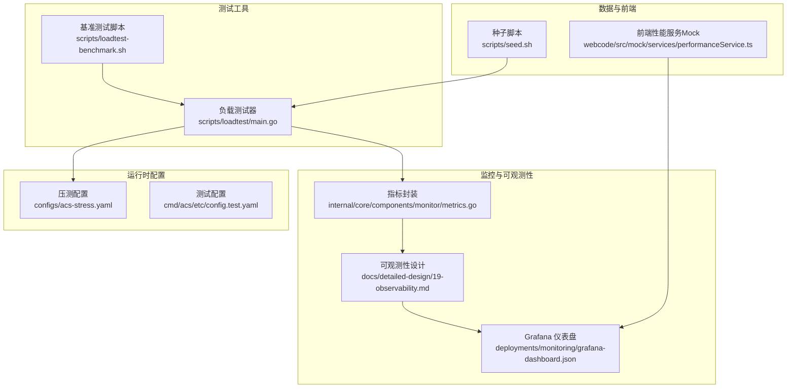
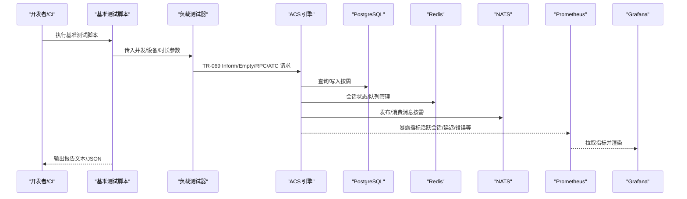
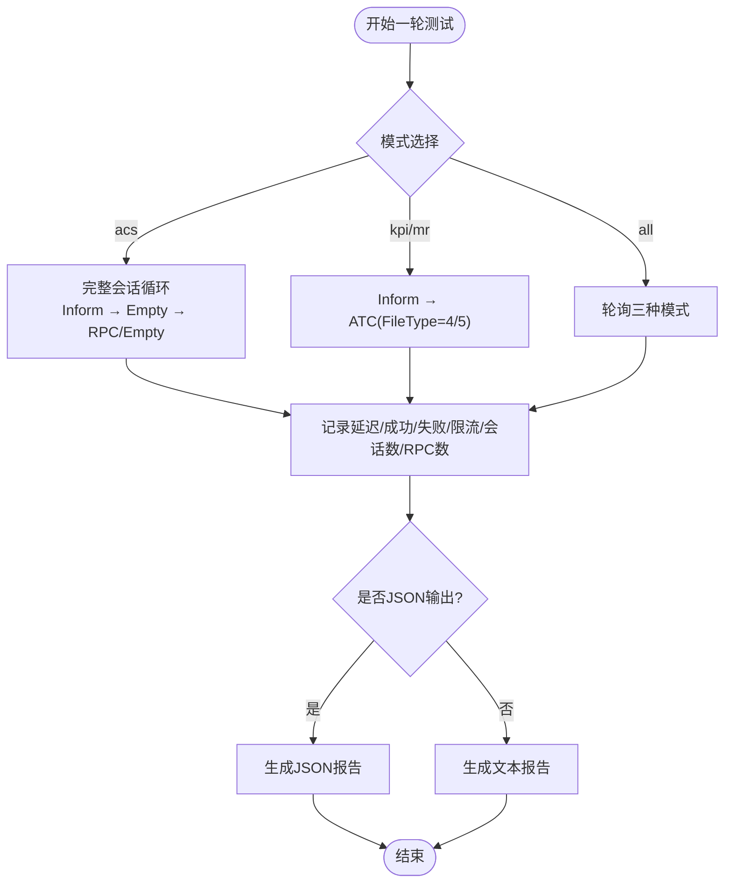
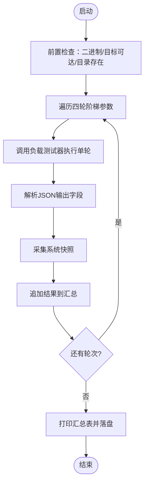
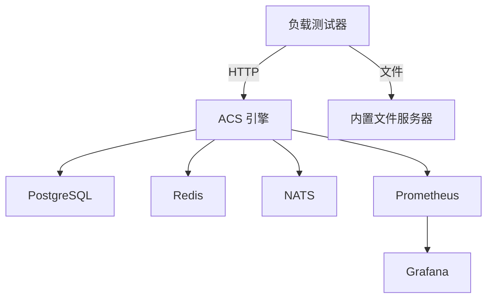

# 性能测试

<cite>
**本文引用的文件**
- [omcgo/scripts/loadtest/main.go](file://omcgo/scripts/loadtest/main.go)
- [omcgo/scripts/loadtest-benchmark.sh](file://omcgo/scripts/loadtest-benchmark.sh)
- [omcgo/configs/acs-stress.yaml](file://omcgo/configs/acs-stress.yaml)
- [omcgo/cmd/acs/etc/config.test.yaml](file://omcgo/cmd/acs/etc/config.test.yaml)
- [omcgo/internal/core/components/monitor/metrics.go](file://omcgo/internal/core/components/monitor/metrics.go)
- [omcgo/docs/detailed-design/19-observability.md](file://omcgo/docs/detailed-design/19-observability.md)
- [omcgo/deployments/monitoring/grafana-dashboard.json](file://omcgo/deployments/monitoring/grafana-dashboard.json)
- [omcgo/test/benchmark-report-20260306-172214.txt](file://omcgo/test/benchmark-report-20260306-172214.txt)
- [omcgo/scripts/seed.sh](file://omcgo/scripts/seed.sh)
- [omcgo/internal/interop/runner.go](file://omcgo/internal/interop/runner.go)
- [omcgo/internal/interop/model.go](file://omcgo/internal/interop/model.go)
- [omcgo/internal/pm/handler_test.go](file://omcgo/internal/pm/handler_test.go)
- [omcmb/webcode/src/mock/services/performanceService.ts](file://omcmb/webcode/src/mock/services/performanceService.ts)
- [omcmb/webcode/src/hooks/api/usePerformance.ts](file://omcmb/webcode/src/hooks/api/usePerformance.ts)
</cite>

## 目录
1. [简介](#简介)
2. [项目结构](#项目结构)
3. [核心组件](#核心组件)
4. [架构总览](#架构总览)
5. [详细组件分析](#详细组件分析)
6. [依赖分析](#依赖分析)
7. [性能考虑](#性能考虑)
8. [故障排查指南](#故障排查指南)
9. [结论](#结论)
10. [附录](#附录)

## 简介
本文件面向 Baicells OMC 项目的性能测试工作，系统化阐述性能测试策略与实践，覆盖基准测试、负载测试、压力测试、稳定性测试等类型；说明性能测试工具链（Go 内置 testing/quick、自定义负载测试脚本、Prometheus/Grafana 监控）的使用方法；定义并解释关键性能指标（响应时间、吞吐量、资源利用率、并发处理能力等）；给出数据库、API、内存/CPU 等维度的实操示例；总结性能测试报告分析方法与瓶颈定位技巧，并提出在持续集成中集成与自动化的落地建议。

## 项目结构
围绕性能测试的关键位置与文件如下：
- 负载测试工具：Go 实现的 TR-069 负载测试器，支持阶梯式压力测试与多模式（acs/kpi/mr/all），内置文件服务器用于 PM/MR 文件上传场景。
- 基准测试脚本：Bash 脚本驱动的阶梯式压力测试，聚合输出 JSON 报告并生成文本报告。
- 配置：生产与压测专用配置，控制速率限制、会话并发、Redis 连接池、日志级别等。
- 监控与可观测性：Prometheus 指标端点、Grafana 仪表盘、基础设施指标封装。
- 数据准备：种子脚本加载初始数据，便于稳定复现实验。
- 前端性能模拟：前端 mock 服务对性能页面接口进行延迟模拟，辅助前端性能评估。

图示来源
- [omcgo/scripts/loadtest/main.go:1-1313](file://omcgo/scripts/loadtest/main.go#L1-L1313)
- [omcgo/scripts/loadtest-benchmark.sh:1-157](file://omcgo/scripts/loadtest-benchmark.sh#L1-L157)
- [omcgo/configs/acs-stress.yaml:1-67](file://omcgo/configs/acs-stress.yaml#L1-L67)
- [omcgo/cmd/acs/etc/config.test.yaml:1-70](file://omcgo/cmd/acs/etc/config.test.yaml#L1-L70)
- [omcgo/internal/core/components/monitor/metrics.go:1-18](file://omcgo/internal/core/components/monitor/metrics.go#L1-L18)
- [omcgo/docs/detailed-design/19-observability.md:63-102](file://omcgo/docs/detailed-design/19-observability.md#L63-L102)
- [omcgo/deployments/monitoring/grafana-dashboard.json:1-142](file://omcgo/deployments/monitoring/grafana-dashboard.json#L1-L142)
- [omcgo/scripts/seed.sh:1-61](file://omcgo/scripts/seed.sh#L1-L61)
- [omcmb/webcode/src/mock/services/performanceService.ts:1-98](file://omcmb/webcode/src/mock/services/performanceService.ts#L1-L98)

章节来源
- [omcgo/scripts/loadtest/main.go:1-1313](file://omcgo/scripts/loadtest/main.go#L1-L1313)
- [omcgo/scripts/loadtest-benchmark.sh:1-157](file://omcgo/scripts/loadtest-benchmark.sh#L1-L157)
- [omcgo/configs/acs-stress.yaml:1-67](file://omcgo/configs/acs-stress.yaml#L1-L67)
- [omcgo/cmd/acs/etc/config.test.yaml:1-70](file://omcgo/cmd/acs/etc/config.test.yaml#L1-L70)
- [omcgo/internal/core/components/monitor/metrics.go:1-18](file://omcgo/internal/core/components/monitor/metrics.go#L1-L18)
- [omcgo/docs/detailed-design/19-observability.md:63-102](file://omcgo/docs/detailed-design/19-observability.md#L63-L102)
- [omcgo/deployments/monitoring/grafana-dashboard.json:1-142](file://omcgo/deployments/monitoring/grafana-dashboard.json#L1-L142)
- [omcgo/scripts/seed.sh:1-61](file://omcgo/scripts/seed.sh#L1-L61)
- [omcmb/webcode/src/mock/services/performanceService.ts:1-98](file://omcmb/webcode/src/mock/services/performanceService.ts#L1-L98)

## 核心组件
- 负载测试器（TR-069）
  - 支持四种模式：acs（完整会话）、kpi（PM 文件上传）、mr（MR 文件上传）、all（轮询混合）。
  - 提供阶梯式压力测试（ramp）与单轮测试两种执行方式。
  - 内置 per-device HTTP Transport 池，保证同一设备复用 TCP 连接，提升真实感与吞吐。
  - 统计指标：成功/失败/错误/限流次数、会话数、RPC 循环数、文件上传数、延迟分位数、会话耗时分位数。
- 基准测试脚本
  - 固定四轮阶梯并发与设备组合，自动采集系统快照（Redis 内存/连接、活跃会话）。
  - 解析负载测试器 JSON 输出，生成对比汇总表格与文本报告。
- 配置
  - 压测配置（acs-stress.yaml）：大幅提高 per_device 限额、并发上限、Redis 连接池大小，降低日志级别以减少开销。
  - 测试配置（config.test.yaml）：默认速率限制更严格，适合常规回归与稳定性验证。
- 监控与可观测性
  - 指标封装：基础设施级直方图/计数器（DB 查询、Redis 操作、NATS 发布/消费）。
  - 指标清单与端点：包含 ACS、设备、PM/KPI、告警、基础设施等指标及端口映射。
  - Grafana 仪表盘：集中展示活跃会话、Inform/RPC 指标、组件请求速率、队列深度、CPU/内存、Go 运行时等。
- 数据准备与前端模拟
  - 种子脚本：批量导入数据模型定义，确保测试数据一致性。
  - 前端 Mock：对性能页面接口增加随机延迟，模拟真实网络与前端渲染开销。

章节来源
- [omcgo/scripts/loadtest/main.go:1-1313](file://omcgo/scripts/loadtest/main.go#L1-L1313)
- [omcgo/scripts/loadtest-benchmark.sh:1-157](file://omcgo/scripts/loadtest-benchmark.sh#L1-L157)
- [omcgo/configs/acs-stress.yaml:1-67](file://omcgo/configs/acs-stress.yaml#L1-L67)
- [omcgo/cmd/acs/etc/config.test.yaml:1-70](file://omcgo/cmd/acs/etc/config.test.yaml#L1-L70)
- [omcgo/internal/core/components/monitor/metrics.go:1-18](file://omcgo/internal/core/components/monitor/metrics.go#L1-L18)
- [omcgo/docs/detailed-design/19-observability.md:63-102](file://omcgo/docs/detailed-design/19-observability.md#L63-L102)
- [omcgo/deployments/monitoring/grafana-dashboard.json:1-142](file://omcgo/deployments/monitoring/grafana-dashboard.json#L1-L142)
- [omcgo/scripts/seed.sh:1-61](file://omcgo/scripts/seed.sh#L1-L61)
- [omcmb/webcode/src/mock/services/performanceService.ts:1-98](file://omcmb/webcode/src/mock/services/performanceService.ts#L1-L98)

## 架构总览
下图展示了性能测试从“发起者”到“被测系统”的端到端路径，以及监控与可视化环节：

图示来源
- [omcgo/scripts/loadtest-benchmark.sh:1-157](file://omcgo/scripts/loadtest-benchmark.sh#L1-L157)
- [omcgo/scripts/loadtest/main.go:1-1313](file://omcgo/scripts/loadtest/main.go#L1-L1313)
- [omcgo/docs/detailed-design/19-observability.md:63-102](file://omcgo/docs/detailed-design/19-observability.md#L63-L102)
- [omcgo/deployments/monitoring/grafana-dashboard.json:1-142](file://omcgo/deployments/monitoring/grafana-dashboard.json#L1-L142)

## 详细组件分析

### 负载测试器（TR-069）实现与特性
- 模式与会话
  - acs：完整 TR-069 会话（Inform → InformResponse → Empty → RPC/Empty 循环），统计会话数、RPC 循环数、会话耗时分位数。
  - kpi/mr：先 Inform，再发送 AutonomousTransferComplete（FileType=4/5），统计文件上传数与上传速率。
  - all：三模式轮询，平衡不同业务负载。
- 并发与连接
  - per-device Transport 池，MaxConnsPerHost=1，确保同一设备复用连接，更贴近真实设备行为。
  - 共享 Transport 用于 acs 模式下的 Inform-only 场景，控制空闲连接上限。
- 统计与输出
  - 成功/失败/错误/限流计数；吞吐 req/s；延迟分位数（p50/p90/p95/p99/max）；可选 JSON 报告。
  - 会话模式下额外输出会话速率、平均每次会话 RPC 次数、会话耗时分位数。
- 阶梯式压力（ramp）
  - 五阶段逐步提升并发与设备数，阶段间暂停，避免瞬态冲击。

图示来源
- [omcgo/scripts/loadtest/main.go:1-1313](file://omcgo/scripts/loadtest/main.go#L1-L1313)

章节来源
- [omcgo/scripts/loadtest/main.go:1-1313](file://omcgo/scripts/loadtest/main.go#L1-L1313)

### 基准测试脚本（阶梯式压力）
- 四轮阶梯并发与设备组合，固定每轮时长，自动采集系统快照（Redis 内存/连接、活跃会话）。
- 解析负载测试器 JSON 输出，计算总请求数、成功率、吞吐、延迟分位数，并汇总对比。
- 输出文本报告文件，便于归档与对比历史版本。

图示来源
- [omcgo/scripts/loadtest-benchmark.sh:1-157](file://omcgo/scripts/loadtest-benchmark.sh#L1-L157)

章节来源
- [omcgo/scripts/loadtest-benchmark.sh:1-157](file://omcgo/scripts/loadtest-benchmark.sh#L1-L157)
- [omcgo/test/benchmark-report-20260306-172214.txt:1-129](file://omcgo/test/benchmark-report-20260306-172214.txt#L1-L129)

### 配置与运行参数
- 压测配置（acs-stress.yaml）
  - rate_limit.per_device 提升至极高值，global_burst 扩大，session.max_concurrent 提高，redis.pool_size 增大，log.level 降为 warn，降低系统开销。
- 测试配置（config.test.yaml）
  - 默认速率限制更严格，适合回归与稳定性验证，避免过早触发限流。
- 运行提示
  - 高并发场景建议设置文件描述符上限，避免连接/文件句柄耗尽。

章节来源
- [omcgo/configs/acs-stress.yaml:1-67](file://omcgo/configs/acs-stress.yaml#L1-L67)
- [omcgo/cmd/acs/etc/config.test.yaml:1-70](file://omcgo/cmd/acs/etc/config.test.yaml#L1-L70)
- [omcgo/scripts/loadtest/main.go:452-461](file://omcgo/scripts/loadtest/main.go#L452-L461)

### 监控与可观测性
- 指标封装
  - 基础设施级直方图/计数器：DB 查询耗时、Redis 操作耗时、NATS 发布/消费总量。
- 指标清单与端点
  - 包含 ACS、设备、PM/KPI、告警、基础设施等指标，端口映射见设计文档。
- Grafana 仪表盘
  - 展示活跃会话、Inform/RPC 指标、组件请求速率、队列深度、CPU/内存、Go 运行时等。

图示来源
- [omcgo/internal/core/components/monitor/metrics.go:1-18](file://omcgo/internal/core/components/monitor/metrics.go#L1-L18)
- [omcgo/docs/detailed-design/19-observability.md:63-102](file://omcgo/docs/detailed-design/19-observability.md#L63-L102)
- [omcgo/deployments/monitoring/grafana-dashboard.json:1-142](file://omcgo/deployments/monitoring/grafana-dashboard.json#L1-L142)

章节来源
- [omcgo/internal/core/components/monitor/metrics.go:1-18](file://omcgo/internal/core/components/monitor/metrics.go#L1-L18)
- [omcgo/docs/detailed-design/19-observability.md:63-102](file://omcgo/docs/detailed-design/19-observability.md#L63-L102)
- [omcgo/deployments/monitoring/grafana-dashboard.json:1-142](file://omcgo/deployments/monitoring/grafana-dashboard.json#L1-L142)

### 数据准备与前端性能模拟
- 种子脚本
  - 导入数据模型定义，确保测试数据一致且可复现。
- 前端 Mock
  - 对性能页面接口增加随机延迟，模拟真实网络与前端渲染开销，辅助前端性能评估。

章节来源
- [omcgo/scripts/seed.sh:1-61](file://omcgo/scripts/seed.sh#L1-L61)
- [omcmb/webcode/src/mock/services/performanceService.ts:1-98](file://omcmb/webcode/src/mock/services/performanceService.ts#L1-L98)

## 依赖分析
- 耦合与内聚
  - 负载测试器内部模块化良好：模板/数据类型、传输池、文件服务器、统计与输出、阶梯式压力等职责清晰。
  - 与监控解耦：通过独立指标端点与 Grafana，不侵入业务代码。
- 外部依赖
  - PostgreSQL、Redis、NATS、Prometheus、Grafana。
- 潜在循环依赖
  - 未发现直接循环依赖；监控封装与指标清单分离，避免双向耦合。

图示来源
- [omcgo/scripts/loadtest/main.go:1-1313](file://omcgo/scripts/loadtest/main.go#L1-L1313)
- [omcgo/docs/detailed-design/19-observability.md:63-102](file://omcgo/docs/detailed-design/19-observability.md#L63-L102)
- [omcgo/deployments/monitoring/grafana-dashboard.json:1-142](file://omcgo/deployments/monitoring/grafana-dashboard.json#L1-L142)

章节来源
- [omcgo/scripts/loadtest/main.go:1-1313](file://omcgo/scripts/loadtest/main.go#L1-L1313)
- [omcgo/docs/detailed-design/19-observability.md:63-102](file://omcgo/docs/detailed-design/19-observability.md#L63-L102)
- [omcgo/deployments/monitoring/grafana-dashboard.json:1-142](file://omcgo/deployments/monitoring/grafana-dashboard.json#L1-L142)

## 性能考虑
- 指标定义与测量
  - 响应时间：请求往返延迟分位数（p50/p90/p95/p99），会话级耗时分位数。
  - 吞吐量：总请求数/测试时长（req/s），文件上传速率（uploads/s）。
  - 资源利用率：CPU/内存使用、Redis 连接数/内存、NATS 队列深度、数据库连接池使用。
  - 并发处理能力：活跃会话数、最大并发会话、限流触发比例。
- 性能测试类型
  - 基准测试：固定参数，建立基线，便于跨版本对比。
  - 负载测试：在预期负载下验证系统稳定性与性能边界。
  - 压力测试：逐步提升并发与设备数，直至系统出现限流/错误/崩溃，识别拐点与瓶颈。
  - 稳定性测试：长时间高负载运行，观察内存泄漏、连接泄漏、指标漂移等。
- 工具与脚本
  - Go 内置 testing/quick：适合单元/集成层面的快速性能探索与回归。
  - 自定义负载测试脚本：阶梯式压力、系统快照、报告汇总，适合端到端性能评估。
  - 监控工具：Prometheus 指标 + Grafana 可视化，实时掌握系统状态。
- 数据库与缓存
  - 使用压测配置降低限流与日志开销，关注 DB 查询耗时直方图、Redis 操作耗时直方图。
  - 注意连接池大小与超时设置，避免连接饥饿。
- 前端性能
  - 利用前端 Mock 的延迟模拟，评估页面渲染与交互在不同网络条件下的表现。

[本节为通用指导，无需特定文件来源]

## 故障排查指南
- 常见问题与定位
  - 成功率低（<50%）：检查速率限制配置是否正确、Redis 连通性、设备数量是否足够（devices ≥ concurrency × 5）、是否存在连接超时。
  - 大量 errors（非 failures）：通常由 TCP 连接超时或文件描述符耗尽导致，适当降低并发或提高 ulimit。
  - 压测后 active_sessions 不归零：connSessions 泄漏等待清理（每 30s 扫描，5min TTL），等待一段时间后指标应回落。
  - Rate Limiter 警告：当 concurrency × 2 / devices × 60 > per_device 时触发限流，确保使用压测配置或增大设备数。
- 指标与日志
  - 通过 Grafana 查看活跃会话、RPC 延迟分位数、组件请求速率、队列深度、CPU/内存、GC 暂停时间等。
  - 关注 ACS 指标（活跃会话、Inform 总数、RPC 持续时间、RPC 错误数）与基础设施指标（DB/Redis/NATS）。
- 配置核对
  - 使用压测配置运行 ACS，确认 per_device、max_concurrent、pool_size、log.level 设置合理。
  - 确认数据库连接池参数与健康检查间隔，避免连接泄漏。

章节来源
- [omcgo/configs/acs-stress.yaml:1-67](file://omcgo/configs/acs-stress.yaml#L1-L67)
- [omcgo/scripts/loadtest-benchmark.sh:363-387](file://omcgo/scripts/loadtest-benchmark.sh#L363-L387)
- [omcgo/docs/detailed-design/19-observability.md:63-102](file://omcgo/docs/detailed-design/19-observability.md#L63-L102)
- [omcgo/deployments/monitoring/grafana-dashboard.json:1-142](file://omcgo/deployments/monitoring/grafana-dashboard.json#L1-L142)

## 结论
本项目提供了完善的性能测试工具链：可扩展的 TR-069 负载测试器、阶梯式压力测试脚本、压测专用配置、丰富的 Prometheus 指标与 Grafana 可视化。结合种子数据与前端 Mock，能够系统地评估数据库、API、文件上传、内存/CPU 等关键维度的性能表现。通过基准测试与多类型压力测试，可以识别系统拐点与瓶颈，形成可追溯的报告与可视化证据，支撑持续改进与自动化集成。

[本节为总结，无需特定文件来源]

## 附录

### 性能测试实施策略与示例

- 基准测试
  - 目标：建立稳定基线，便于跨版本对比。
  - 步骤：使用压测配置启动 ACS，执行基准测试脚本，记录文本报告与 JSON 指标。
  - 关注：吞吐、p50/p99 延迟、成功率、活跃会话、系统快照（Redis/连接）。
  - 示例参考：基准测试报告文件与脚本输出。

- 负载测试
  - 目标：在预期负载下验证系统稳定性与性能。
  - 步骤：设定合理并发与设备数，运行单轮测试，观察指标与报告。
  - 关注：吞吐、延迟分位数、错误/限流比例、资源利用率。

- 压力测试
  - 目标：逐步提升并发与设备数，识别系统拐点与瓶颈。
  - 步骤：使用阶梯式压力脚本，记录每轮结果，绘制对比汇总。
  - 关注：成功率骤降、p99 飙升、限流触发、资源耗尽迹象。

- 稳定性测试
  - 目标：长时间高负载运行，观察系统稳定性。
  - 步骤：延长测试时长，持续监控指标与日志，关注内存/CPU/连接泄漏。

- 数据库性能测试
  - 方法：在压测配置下运行负载测试，重点观察 DB 查询耗时直方图、连接池使用、慢查询。
  - 指标：db_query_duration_seconds 直方图、活跃会话、错误率。

- API 响应性能测试
  - 方法：针对关键 API（如 Inform、RPC、文件上传）单独运行 acs/kpi/mr 模式，记录延迟分位数与吞吐。
  - 指标：acs_rpc_duration_seconds、acs_inform_total、acs_active_sessions。

- 内存与 CPU 使用情况
  - 方法：结合 Grafana 面板查看容器 CPU/内存使用、Go 运行时 goroutines、GC 暂停时间。
  - 指标：container_cpu_usage_seconds_total、container_memory_working_set_bytes、go_goroutines、go_gc_duration_seconds_sum。

- 前端性能测试
  - 方法：启用前端 Mock，模拟不同网络条件下的延迟，评估页面渲染与交互性能。
  - 指标：页面加载时间、首屏渲染时间、交互响应时间。

章节来源
- [omcgo/scripts/loadtest-benchmark.sh:1-157](file://omcgo/scripts/loadtest-benchmark.sh#L1-L157)
- [omcgo/test/benchmark-report-20260306-172214.txt:1-129](file://omcgo/test/benchmark-report-20260306-172214.txt#L1-L129)
- [omcgo/docs/detailed-design/19-observability.md:63-102](file://omcgo/docs/detailed-design/19-observability.md#L63-L102)
- [omcgo/deployments/monitoring/grafana-dashboard.json:1-142](file://omcgo/deployments/monitoring/grafana-dashboard.json#L1-L142)
- [omcmb/webcode/src/mock/services/performanceService.ts:1-98](file://omcmb/webcode/src/mock/services/performanceService.ts#L1-L98)

### 性能测试报告分析方法
- 基准测试报告解读
  - 对比不同版本的吞吐、延迟分位数、成功率，识别回归或改进。
  - 关注系统快照变化，判断资源瓶颈。
- 性能瓶颈识别
  - 若 p99 显著升高且错误/限流增多，优先检查速率限制、连接池、缓存命中率。
  - 若 DB 查询耗时直方图尾部拉长，优化慢查询与索引。
- 优化建议制定
  - 调整压测配置参数（per_device、max_concurrent、pool_size），观察指标变化。
  - 优化热点路径（RPC/文件上传）、缓存策略、数据库索引与连接池。
  - 前端侧优化：减少不必要的请求、合并请求、启用缓存与懒加载。

[本节为通用指导，无需特定文件来源]

### 持续集成中的集成与自动化
- 自动化执行策略
  - 在 CI 中添加基准测试与压力测试步骤，固定并发/设备组合，输出报告与指标。
  - 将 Grafana 截图或指标导出作为测试附件，便于回溯。
- 报告与告警
  - 将 JSON 报告与文本报告归档；若关键指标异常（如成功率低于阈值、p99 超过阈值），触发告警。
- 版本对比
  - 对比不同分支/版本的基准测试报告，形成趋势图，辅助决策。

[本节为通用指导，无需特定文件来源]

### 相关测试与互操作性
- 互操作性测试运行器
  - 提供测试用例注册、分类、执行与结果收集，可用于端到端性能回归。
- 测试结果模型
  - 包含用例 ID、名称、类别、通过状态、耗时、详情与错误信息，便于报告与可视化。

章节来源
- [omcgo/internal/interop/runner.go:47-85](file://omcgo/internal/interop/runner.go#L47-L85)
- [omcgo/internal/interop/model.go:46-61](file://omcgo/internal/interop/model.go#L46-L61)