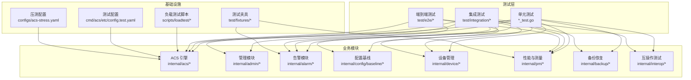
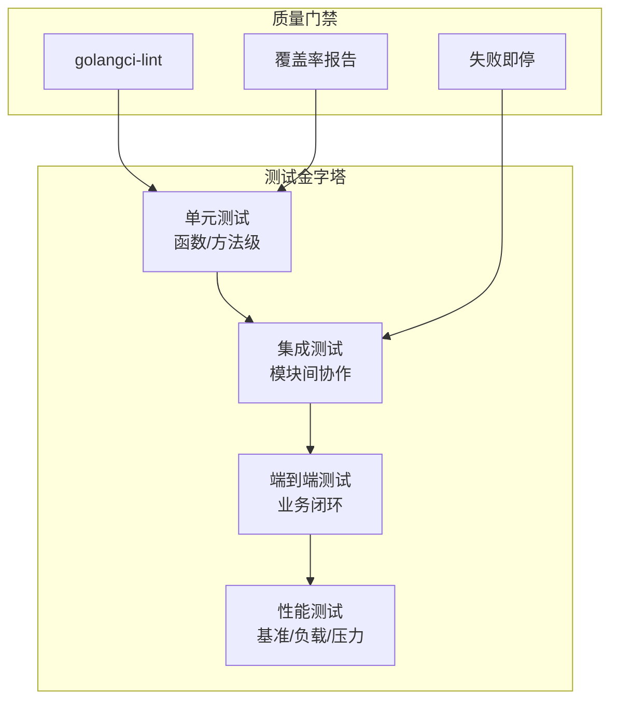
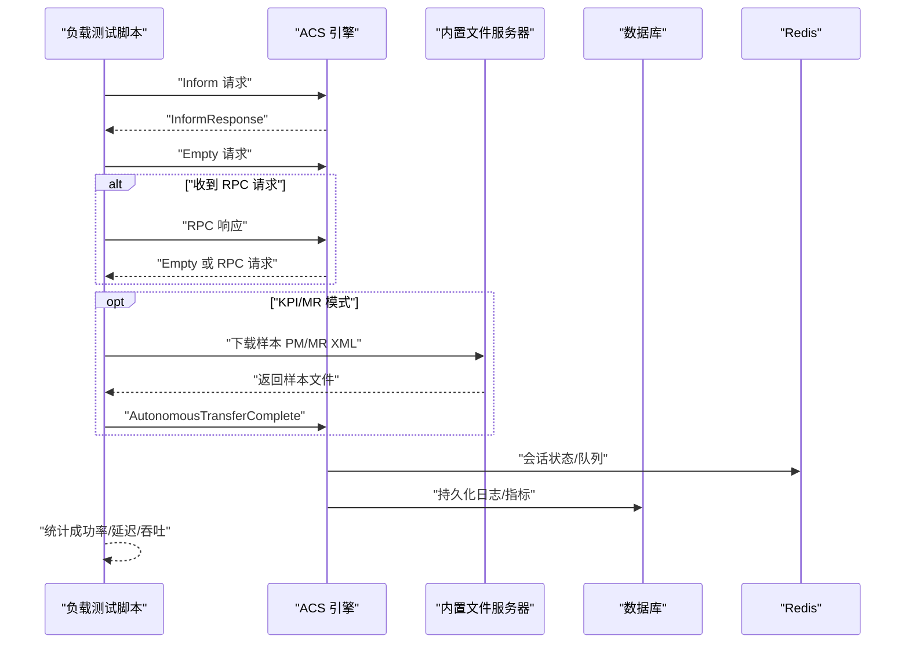
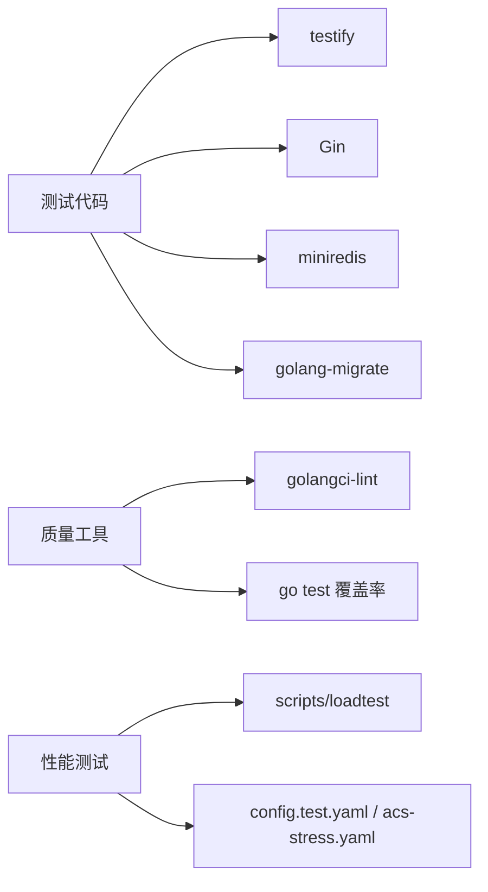

# 测试策略

<cite>
**本文引用的文件**
- [go.mod](file://omcgo/go.mod)
- [.golangci.yml](file://omcgo/.golangci.yml)
- [Makefile](file://omcgo/Makefile)
- [cmd/acs/etc/config.test.yaml](file://omcgo/cmd/acs/etc/config.test.yaml)
- [configs/acs-stress.yaml](file://omcgo/configs/acs-stress.yaml)
- [scripts/loadtest/main.go](file://omcgo/scripts/loadtest/main.go)
- [test/integration/api_sprint1_test.go](file://omcgo/test/integration/api_sprint1_test.go)
- [test/fixtures/mr/sample_mre.xml](file://omcgo/test/fixtures/mr/sample_mre.xml)
- [test/fixtures/pm/sample_pm.xml](file://omcgo/test/fixtures/pm/sample_pm.xml)
- [internal/acs/auth/authenticator_test.go](file://omcgo/internal/acs/auth/authenticator_test.go)
- [internal/acs/rpc/dispatcher_test.go](file://omcgo/internal/acs/rpc/dispatcher_test.go)
- [internal/acs/admission_test.go](file://omcgo/internal/acs/admission_test.go)
- [internal/acs/handler_test.go](file://omcgo/internal/acs/handler_test.go)
- [internal/acs/metrics_test.go](file://omcgo/internal/acs/metrics_test.go)
- [internal/acs/ratelimit_test.go](file://omcgo/internal/acs/ratelimit_test.go)
- [internal/acs/session_test.go](file://omcgo/internal/acs/session_test.go)
- [internal/admin/handler_test.go](file://omcgo/internal/admin/handler_test.go)
- [internal/admin/jwt_test.go](file://omcgo/internal/admin/jwt_test.go)
- [internal/admin/middleware_test.go](file://omcgo/internal/admin/middleware_test.go)
- [internal/admin/service_test.go](file://omcgo/internal/admin/service_test.go)
- [internal/alarm/engine_test.go](file://omcgo/internal/alarm/engine_test.go)
- [internal/alarm/handler_test.go](file://omcgo/internal/alarm/handler_test.go)
- [internal/alarm/receiver_test.go](file://omcgo/internal/alarm/receiver_test.go)
- [internal/alarm/rule_handler_test.go](file://omcgo/internal/alarm/rule_handler_test.go)
- [internal/backup/executor_test.go](file://omcgo/internal/backup/executor_test.go)
- [internal/backup/handler_test.go](file://omcgo/internal/backup/handler_test.go)
- [internal/backup/service_test.go](file://omcgo/internal/backup/service_test.go)
- [internal/config/baseline/handler_test.go](file://omcgo/internal/config/baseline/handler_test.go)
- [internal/config/baseline/service_test.go](file://omcgo/internal/config/baseline/service_test.go)
- [pkg/soap/decoder_test.go](file://omcgo/pkg/soap/decoder_test.go)
- [pkg/tr069/events_test.go](file://omcgo/pkg/tr069/events_test.go)
</cite>

## 目录
1. [简介](#简介)
2. [项目结构](#项目结构)
3. [核心组件](#核心组件)
4. [架构总览](#架构总览)
5. [详细组件分析](#详细组件分析)
6. [依赖分析](#依赖分析)
7. [性能考虑](#性能考虑)
8. [故障排查指南](#故障排查指南)
9. [结论](#结论)
10. [附录](#附录)

## 简介
本测试策略面向 Baicells OMC 后端（omcgo）项目，围绕测试金字塔（单元测试、集成测试、端到端测试）构建完整测试体系，覆盖 TR069 ACS 引擎、设备管理、配置下发、性能与测量上报、告警、软件升级、互操作测试等核心能力。文档重点阐述：
- Go 语言测试框架与 testify 的使用方式
- Mock 对象与测试数据准备策略
- 性能测试方案：基准测试、负载测试、压力测试
- 测试数据管理：测试夹具、种子数据、测试环境隔离
- 持续集成流程：自动化测试、代码覆盖率、质量门禁
- 测试最佳实践：用例设计、断言策略、可维护性

## 项目结构
omcgo 采用多模块分层组织，测试相关主要分布在以下位置：
- 单元测试：各模块内部以 *_test.go 形式存在，广泛使用 testify 断言与 require
- 集成测试：test/integration 下按业务阶段划分（如 sprint1/2/3/4/5）
- 端到端测试：test/e2e 目录存在但内容为空，建议后续补充
- 性能与负载测试：scripts/loadtest 提供大规模 TR069 会话模拟
- 测试夹具：test/fixtures 提供 MR/PM/XML 示例
- 配置：cmd/acs/etc/config.test.yaml 用于测试环境；configs/acs-stress.yaml 用于压测

图表来源
- [Makefile:24-32](file://omcgo/Makefile#L24-L32)
- [cmd/acs/etc/config.test.yaml:1-70](file://omcgo/cmd/acs/etc/config.test.yaml#L1-L70)
- [configs/acs-stress.yaml:1-67](file://omcgo/configs/acs-stress.yaml#L1-L67)
- [scripts/loadtest/main.go:1-120](file://omcgo/scripts/loadtest/main.go#L1-L120)

章节来源
- [Makefile:1-74](file://omcgo/Makefile#L1-L74)
- [go.mod:1-121](file://omcgo/go.mod#L1-L121)

## 核心组件
- 测试框架与工具
  - Go 内置 testing 包配合 testify（assert/require）进行断言与前置条件校验
  - golangci-lint 作为静态检查工具，排除测试文件 lint 规则
  - Makefile 提供统一测试命令：单元测试、覆盖率、集成测试、代码检查
- 测试数据与夹具
  - test/fixtures 提供 MR/PM/Soap 示例 XML，便于解析与入库流程测试
  - test/integration 中通过 Gin 测试上下文与 httptest 模拟请求
- 配置与环境
  - config.test.yaml 为测试服务默认配置，acs-stress.yaml 用于高并发压测场景

章节来源
- [go.mod:21-21](file://omcgo/go.mod#L21-L21)
- [.golangci.yml:1-39](file://omcgo/.golangci.yml#L1-L39)
- [Makefile:24-32](file://omcgo/Makefile#L24-L32)
- [cmd/acs/etc/config.test.yaml:1-70](file://omcgo/cmd/acs/etc/config.test.yaml#L1-L70)
- [configs/acs-stress.yaml:1-67](file://omcgo/configs/acs-stress.yaml#L1-L67)
- [test/fixtures/mr/sample_mre.xml:1-14](file://omcgo/test/fixtures/mr/sample_mre.xml#L1-L14)
- [test/fixtures/pm/sample_pm.xml:1-46](file://omcgo/test/fixtures/pm/sample_pm.xml#L1-L46)

## 架构总览
测试架构遵循金字塔原则：
- 单元测试：针对函数/方法级行为，快速反馈，保证基础逻辑正确
- 集成测试：跨模块协作，验证路由、中间件、数据库/缓存交互
- 端到端测试：覆盖真实业务流，如 TR069 会话、PM/MR 文件上传、告警处理
- 性能测试：基准测试（benchmarks）、负载测试（loadtest）、压力测试（stress config）

## 详细组件分析

### 测试框架与工具
- testify 使用
  - 断言：assert 用于非致命断言，适合多条件组合
  - 前置：require 用于致命断言，确保后续步骤有前提条件
  - 示例路径：[internal/acs/auth/authenticator_test.go:15-58](file://omcgo/internal/acs/auth/authenticator_test.go#L15-L58)
- 静态检查与质量门禁
  - golangci-lint 启用 errcheck、govet、staticcheck、unused、gosimple、ineffassign、typecheck、misspell、gofmt、goimports、gocritic
  - 排除规则：测试文件与 cmd 目录不执行 errcheck，限制最大问题数
  - 示例路径：[.golangci.yml:1-39](file://omcgo/.golangci.yml#L1-L39)
- 统一测试命令
  - 单元测试：go test ./... -v -race -count=1
  - 覆盖率：go test ./... -coverprofile=coverage.out && go tool cover -html=coverage.out -o coverage.html
  - 集成测试：go test ./test/integration/... -v -tags=integration -count=1
  - 示例路径：[Makefile:24-32](file://omcgo/Makefile#L24-L32)

章节来源
- [internal/acs/auth/authenticator_test.go:15-58](file://omcgo/internal/acs/auth/authenticator_test.go#L15-L58)
- [.golangci.yml:1-39](file://omcgo/.golangci.yml#L1-L39)
- [Makefile:24-32](file://omcgo/Makefile#L24-L32)

### 单元测试策略与示例
- 认证器（Basic/Digest/Noop）
  - 覆盖成功认证、错误凭据、缺失认证、挑战头生成、构造 digest 响应等场景
  - 示例路径：[internal/acs/auth/authenticator_test.go:25-129](file://omcgo/internal/acs/auth/authenticator_test.go#L25-L129)
- RPC 分发器
  - 校验已注册方法数量与完整性，未知方法报错，参数序列化正确
  - 示例路径：[internal/acs/rpc/dispatcher_test.go:12-48](file://omcgo/internal/acs/rpc/dispatcher_test.go#L12-L48)
- 会话与速率限制
  - 会话生命周期、超时、并发控制；速率限制阈值与清理机制
  - 示例路径：[internal/acs/session_test.go](file://omcgo/internal/acs/session_test.go)，[internal/acs/ratelimit_test.go](file://omcgo/internal/acs/ratelimit_test.go)
- 管理与鉴权中间件
  - JWT 解析、权限校验、CORS 头设置
  - 示例路径：[internal/admin/jwt_test.go](file://omcgo/internal/admin/jwt_test.go)，[internal/admin/middleware_test.go](file://omcgo/internal/admin/middleware_test.go)

章节来源
- [internal/acs/auth/authenticator_test.go:25-129](file://omcgo/internal/acs/auth/authenticator_test.go#L25-L129)
- [internal/acs/rpc/dispatcher_test.go:12-48](file://omcgo/internal/acs/rpc/dispatcher_test.go#L12-L48)
- [internal/acs/session_test.go](file://omcgo/internal/acs/session_test.go)
- [internal/acs/ratelimit_test.go](file://omcgo/internal/acs/ratelimit_test.go)
- [internal/admin/jwt_test.go](file://omcgo/internal/admin/jwt_test.go)
- [internal/admin/middleware_test.go](file://omcgo/internal/admin/middleware_test.go)

### 集成测试策略与示例
- 基于 Gin 测试上下文与 httptest
  - CORS 中间件、健康检查、登录请求体绑定、分页默认值等
  - 示例路径：[test/integration/api_sprint1_test.go:62-166](file://omcgo/test/integration/api_sprint1_test.go#L62-L166)
- 数据库/Redis/外部依赖
  - 集成测试需运行 PostgreSQL、Redis 等基础设施，通过环境变量 OMCGO_TEST_DB_DSN 控制
  - 示例路径：[test/integration/api_sprint1_test.go:27-34](file://omcgo/test/integration/api_sprint1_test.go#L27-L34)

章节来源
- [test/integration/api_sprint1_test.go:27-34](file://omcgo/test/integration/api_sprint1_test.go#L27-L34)
- [test/integration/api_sprint1_test.go:62-166](file://omcgo/test/integration/api_sprint1_test.go#L62-L166)

### 端到端测试策略
- 当前状态：test/e2e 目录存在但内容为空
- 建议范围
  - TR069 完整会话：Inform → InformResponse → Empty → RPC/Empty 循环
  - PM/MR 文件上传：Inform → ATC FileType=4/5 → 结束
  - 告警规则触发与存储
  - 软件升级任务编排与状态机
- 工具与夹具
  - 使用 scripts/loadtest 作为会话与文件上传的参考实现
  - test/fixtures 提供样本 XML 作为输入
- 示例路径：[scripts/loadtest/main.go:1-120](file://omcgo/scripts/loadtest/main.go#L1-L120)，[test/fixtures/pm/sample_pm.xml:1-46](file://omcgo/test/fixtures/pm/sample_pm.xml#L1-L46)

章节来源
- [scripts/loadtest/main.go:1-120](file://omcgo/scripts/loadtest/main.go#L1-L120)
- [test/fixtures/pm/sample_pm.xml:1-46](file://omcgo/test/fixtures/pm/sample_pm.xml#L1-L46)

### 性能测试方案
- 基准测试（benchmarks）
  - 建议在关键路径（解析、序列化、RPC 构建、存储写入）添加 benchmark
  - 使用 go test -bench=. -benchmem 执行
- 负载测试（loadtest）
  - 支持模式：acs（完整 TR069 会话）、kpi（PM 文件上传）、mr（MR 文件上传）、all（轮询）
  - 渐进式加压（ramp）：5 轮逐步提升并发与设备数
  - 参考配置：acs-stress.yaml（提高会话并发、禁用速率限制、降低日志级别）
- 压力测试
  - 使用 acs-stress.yaml 启动服务，结合高并发客户端进行极限压力验证
- 示例路径：[scripts/loadtest/main.go:384-474](file://omcgo/scripts/loadtest/main.go#L384-L474)，[configs/acs-stress.yaml:1-67](file://omcgo/configs/acs-stress.yaml#L1-L67)

图表来源
- [scripts/loadtest/main.go:709-800](file://omcgo/scripts/loadtest/main.go#L709-L800)
- [configs/acs-stress.yaml:27-30](file://omcgo/configs/acs-stress.yaml#L27-L30)

章节来源
- [scripts/loadtest/main.go:384-474](file://omcgo/scripts/loadtest/main.go#L384-L474)
- [configs/acs-stress.yaml:1-67](file://omcgo/configs/acs-stress.yaml#L1-L67)

### 测试数据管理策略
- 测试夹具
  - test/fixtures 提供 MR/PM/Soap 示例 XML，便于解析与入库流程测试
  - 示例路径：[test/fixtures/mr/sample_mre.xml:1-14](file://omcgo/test/fixtures/mr/sample_mre.xml#L1-L14)，[test/fixtures/pm/sample_pm.xml:1-46](file://omcgo/test/fixtures/pm/sample_pm.xml#L1-L46)
- 种子数据
  - 通过数据库迁移脚本初始化基础数据，确保测试一致性
  - 示例路径：[omcgo/migrations/000035_seed_initial_data.up.sql](file://omcgo/migrations/000035_seed_initial_data.up.sql)
- 测试环境隔离
  - 使用 config.test.yaml 与 acs-stress.yaml 分离测试与压测配置
  - 集成测试通过 OMCGO_TEST_DB_DSN 指定独立 DSN

章节来源
- [test/fixtures/mr/sample_mre.xml:1-14](file://omcgo/test/fixtures/mr/sample_mre.xml#L1-L14)
- [test/fixtures/pm/sample_pm.xml:1-46](file://omcgo/test/fixtures/pm/sample_pm.xml#L1-L46)
- [cmd/acs/etc/config.test.yaml:41-47](file://omcgo/cmd/acs/etc/config.test.yaml#L41-L47)
- [configs/acs-stress.yaml:48-54](file://omcgo/configs/acs-stress.yaml#L48-L54)

### 持续集成流程
- 自动化测试
  - 单元测试：go test ./... -v -race -count=1
  - 集成测试：go test ./test/integration/... -v -tags=integration -count=1
  - 代码检查：golangci-lint run ./...
- 代码覆盖率
  - 生成覆盖率文件并导出 HTML 报告
  - 示例路径：[Makefile:27-29](file://omcgo/Makefile#L27-L29)
- 质量门禁
  - golangci-lint 作为质量门禁，排除测试与 cmd 目录的 errcheck
  - 示例路径：[.golangci.yml:26-33](file://omcgo/.golangci.yml#L26-L33)

章节来源
- [Makefile:24-39](file://omcgo/Makefile#L24-L39)
- [.golangci.yml:1-39](file://omcgo/.golangci.yml#L1-L39)

### 测试最佳实践
- 用例设计
  - 每个函数/方法至少覆盖正常路径与边界条件
  - 对外部依赖（数据库、缓存、消息队列）使用最小化 mock 或内存替代
- 断言策略
  - 使用 assert 进行非致命断言，require 进行致命断言
  - 针对 JSON 结构、HTTP 响应头、CORS 行为进行精确断言
- 可维护性
  - 将公共断言封装为辅助函数，减少重复
  - 保持测试命名清晰，体现前置条件与期望结果
- 示例路径：[internal/acs/auth/authenticator_test.go:15-58](file://omcgo/internal/acs/auth/authenticator_test.go#L15-L58)，[test/integration/api_sprint1_test.go:62-166](file://omcgo/test/integration/api_sprint1_test.go#L62-L166)

章节来源
- [internal/acs/auth/authenticator_test.go:15-58](file://omcgo/internal/acs/auth/authenticator_test.go#L15-L58)
- [test/integration/api_sprint1_test.go:62-166](file://omcgo/test/integration/api_sprint1_test.go#L62-L166)

## 依赖分析
- 测试依赖
  - testify：断言与 require
  - Gin：HTTP 测试与路由
  - miniredis：Redis 内存替代
  - golang-migrate：数据库迁移
- 质量工具
  - golangci-lint：静态检查
  - go test：单元测试与覆盖率
- 配置与脚本
  - config.test.yaml、acs-stress.yaml：测试与压测配置
  - scripts/loadtest：负载测试工具

图表来源
- [go.mod:6-28](file://omcgo/go.mod#L6-L28)
- [Makefile:24-39](file://omcgo/Makefile#L24-L39)
- [cmd/acs/etc/config.test.yaml:1-70](file://omcgo/cmd/acs/etc/config.test.yaml#L1-L70)
- [configs/acs-stress.yaml:1-67](file://omcgo/configs/acs-stress.yaml#L1-L67)
- [scripts/loadtest/main.go:1-120](file://omcgo/scripts/loadtest/main.go#L1-L120)

章节来源
- [go.mod:6-28](file://omcgo/go.mod#L6-L28)
- [Makefile:24-39](file://omcgo/Makefile#L24-L39)

## 性能考虑
- 基准测试
  - 在高频路径（RPC 构建、XML 解析、参数序列化）添加 benchmark
- 负载测试
  - 使用 scripts/loadtest 的 ramp 模式进行渐进式压测
  - 高并发场景下注意文件描述符限制与网络栈调优
- 压测配置
  - 使用 acs-stress.yaml 提升会话并发与连接池大小，降低日志级别
- 监控与指标
  - 启用 Prometheus 指标端口，结合 Grafana 展示关键指标

## 故障排查指南
- 集成测试跳过
  - 未设置 OMCGO_TEST_DB_DSN 时，集成测试会跳过
  - 示例路径：[test/integration/api_sprint1_test.go:27-34](file://omcgo/test/integration/api_sprint1_test.go#L27-L34)
- CORS 问题
  - 通过 httptest 与 Gin 测试上下文验证预检与实际请求头
  - 示例路径：[test/integration/api_sprint1_test.go:62-92](file://omcgo/test/integration/api_sprint1_test.go#L62-L92)
- 认证失败
  - Basic/Digest 认证错误信息明确提示缺失或无效凭据
  - 示例路径：[internal/acs/auth/authenticator_test.go:37-58](file://omcgo/internal/acs/auth/authenticator_test.go#L37-L58)
- RPC 方法未知
  - Dispatcher 对未知方法返回错误，确保方法名与参数正确
  - 示例路径：[internal/acs/rpc/dispatcher_test.go:36-48](file://omcgo/internal/acs/rpc/dispatcher_test.go#L36-L48)

章节来源
- [test/integration/api_sprint1_test.go:27-34](file://omcgo/test/integration/api_sprint1_test.go#L27-L34)
- [test/integration/api_sprint1_test.go:62-92](file://omcgo/test/integration/api_sprint1_test.go#L62-L92)
- [internal/acs/auth/authenticator_test.go:37-58](file://omcgo/internal/acs/auth/authenticator_test.go#L37-L58)
- [internal/acs/rpc/dispatcher_test.go:36-48](file://omcgo/internal/acs/rpc/dispatcher_test.go#L36-L48)

## 结论
本测试策略以测试金字塔为核心，结合 testify 框架、golangci-lint 质量门禁与 Makefile 统一命令，形成从单元到端到端、从功能到性能的完整测试体系。建议尽快完善端到端测试（test/e2e），并在关键路径补充基准测试，持续优化覆盖率与稳定性。

## 附录
- 测试命令速查
  - 单元测试：make test
  - 集成测试：make test-integration
  - 覆盖率：make test-coverage
  - 代码检查：make lint
- 配置文件
  - 测试配置：cmd/acs/etc/config.test.yaml
  - 压测配置：configs/acs-stress.yaml
- 测试夹具
  - MR/PM/XML 示例：test/fixtures/mr、test/fixtures/pm、test/fixtures/soap