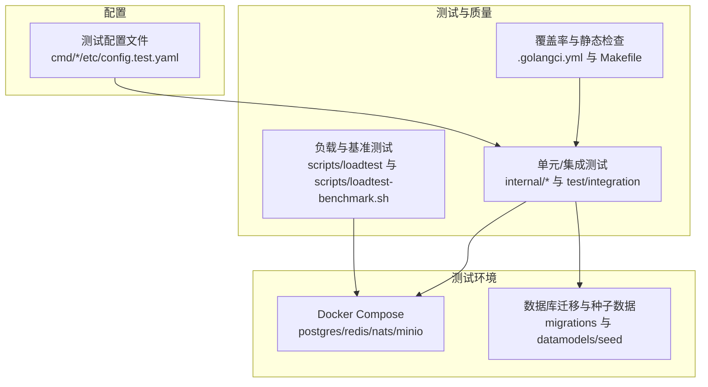
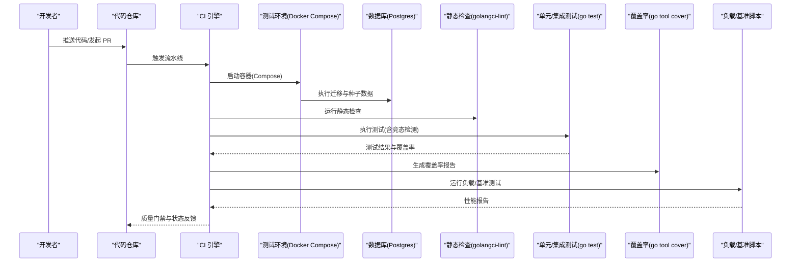
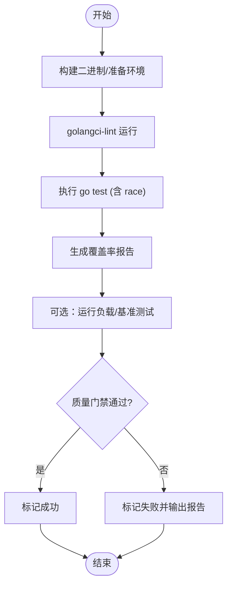
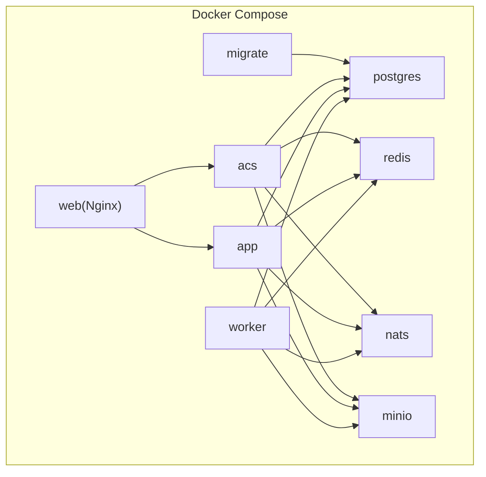
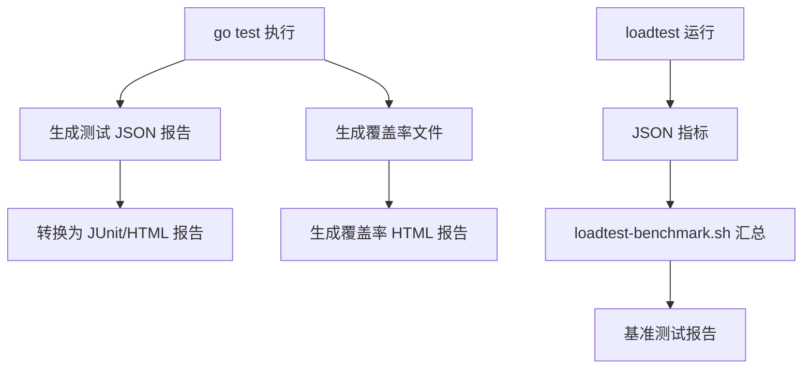
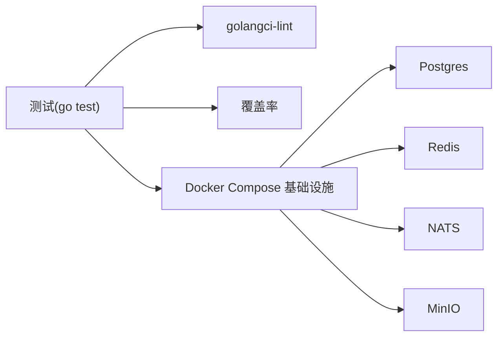

# 测试自动化与持续集成

<cite>
**本文引用的文件**   
- [omcgo/.golangci.yml](file://omcgo/.golangci.yml)
- [omcgo/Makefile](file://omcgo/Makefile)
- [omcgo/deployments/docker/docker-compose.yml](file://omcgo/deployments/docker/docker-compose.yml)
- [omcgo/scripts/seed.sh](file://omcgo/scripts/seed.sh)
- [omcgo/scripts/loadtest/main.go](file://omcgo/scripts/loadtest/main.go)
- [omcgo/scripts/loadtest-benchmark.sh](file://omcgo/scripts/loadtest-benchmark.sh)
- [omcgo/cmd/acs/etc/config.test.yaml](file://omcgo/cmd/acs/etc/config.test.yaml)
- [omcgo/cmd/app/etc/config.test.yaml](file://omcgo/cmd/app/etc/config.test.yaml)
- [omcgo/cmd/worker/etc/config.test.yaml](file://omcgo/cmd/worker/etc/config.test.yaml)
- [omcgo/internal/acs/admission_test.go](file://omcgo/internal/acs/admission_test.go)
- [omcgo/internal/admin/jwt_test.go](file://omcgo/internal/admin/jwt_test.go)
- [omcgo/internal/device/inform_handler_test.go](file://omcgo/internal/device/inform_handler_test.go)
- [omcgo/internal/provision/engine_test.go](file://omcgo/internal/provision/engine_test.go)
- [omcgo/internal/pm/pg_file_store_test.go](file://omcgo/internal/pm/pg_file_store_test.go)
- [omcgo/test/integration/api_sprint1_test.go](file://omcgo/test/integration/api_sprint1_test.go)
- [omcgo/test/integration/api_sprint2_test.go](file://omcgo/test/integration/api_sprint2_test.go)
- [omcgo/test/integration/api_sprint3_test.go](file://omcgo/test/integration/api_sprint3_test.go)
- [omcgo/test/integration/api_sprint4_test.go](file://omcgo/test/integration/api_sprint4_test.go)
- [omcgo/test/integration/api_sprint5_test.go](file://omcgo/test/integration/api_sprint5_test.go)
- [omcgo/test/integration/inform_register_test.go](file://omcgo/test/integration/inform_register_test.go)
- [omcgo/docs/design/database-migration.md](file://omcgo/docs/design/database-migration.md)
- [omcgo/docs/detailed-design/21-database-migrations.md](file://omcgo/docs/detailed-design/21-database-migrations.md)
- [omcmb/original-omc/OMCWebServer/docs/JACOCO_USAGE_GUIDE.md](file://omcmb/original-omc/OMCWebServer/docs/JACOCO_USAGE_GUIDE.md)
</cite>

## 目录
1. [简介](#简介)
2. [项目结构](#项目结构)
3. [核心组件](#核心组件)
4. [架构总览](#架构总览)
5. [详细组件分析](#详细组件分析)
6. [依赖关系分析](#依赖关系分析)
7. [性能考量](#性能考量)
8. [故障排查指南](#故障排查指南)
9. [结论](#结论)
10. [附录](#附录)

## 简介
本实施文档面向 Baicells OMC 项目的测试自动化与持续集成，围绕以下目标展开：
- 在 CI/CD 流水线中集成自动化测试、代码覆盖率检查与质量门禁
- 自动化测试环境配置：Docker 容器化测试、数据库初始化、测试数据准备
- 测试报告生成与分析：JUnit 格式、覆盖率、性能报告的收集与处理
- 提供 GitHub Actions、GitLab CI 的配置示例与最佳实践
- 测试失败处理机制：失败重试、测试分类、问题定位
- 测试维护与优化：用例重构、性能优化、环境维护

## 项目结构
OMC 后端采用 Go 语言与多服务架构，测试相关能力集中在 omcgo 子项目中，包含：
- 单元测试与集成测试：位于 internal/* 与 test/integration 下
- Docker 编排与测试环境：deployments/docker/docker-compose.yml
- 数据库迁移与种子数据：migrations 与 datamodels/seed
- 质量工具：Makefile 中的 lint、vet、test、test-coverage
- 覆盖率与静态检查：.golangci.yml
- 负载与基准测试：scripts/loadtest 与 scripts/loadtest-benchmark.sh
- Web 前端覆盖率参考：omcmb/original-omc/OMCWebServer/docs/JACOCO_USAGE_GUIDE.md

**图表来源**
- [omcgo/deployments/docker/docker-compose.yml:1-194](file://omcgo/deployments/docker/docker-compose.yml#L1-L194)
- [omcgo/Makefile:24-47](file://omcgo/Makefile#L24-L47)
- [omcgo/.golangci.yml:1-39](file://omcgo/.golangci.yml#L1-L39)

**章节来源**
- [omcgo/Makefile:1-74](file://omcgo/Makefile#L1-L74)
- [omcgo/.golangci.yml:1-39](file://omcgo/.golangci.yml#L1-L39)
- [omcgo/deployments/docker/docker-compose.yml:1-194](file://omcgo/deployments/docker/docker-compose.yml#L1-L194)

## 核心组件
- 测试执行与覆盖率
  - 单元测试与竞态检测：通过 Makefile 的 test 目标执行
  - 覆盖率生成与可视化：通过 test-coverage 目标生成 coverage.out 与 coverage.html
- 静态检查与质量门禁
  - golangci-lint：启用 errcheck、govet、staticcheck、unused 等
  - 排除规则：测试文件与 cmd 目录的特定 linter
- 测试环境
  - Docker Compose：一键启动 postgres、redis、nats、minio，并由 migrate 服务自动执行数据库迁移
  - 种子数据：通过 seed.sh 脚本批量导入 carrier_defaults 与 product_models
- 负载与基准
  - loadtest：模拟 TR069 会话、PM/MR 文件上传，支持阶梯式压力测试
  - loadtest-benchmark.sh：自动化基准报告生成与汇总

**章节来源**
- [omcgo/Makefile:24-47](file://omcgo/Makefile#L24-L47)
- [omcgo/.golangci.yml:1-39](file://omcgo/.golangci.yml#L1-L39)
- [omcgo/deployments/docker/docker-compose.yml:80-91](file://omcgo/deployments/docker/docker-compose.yml#L80-L91)
- [omcgo/scripts/seed.sh:1-60](file://omcgo/scripts/seed.sh#L1-L60)
- [omcgo/scripts/loadtest/main.go:1-800](file://omcgo/scripts/loadtest/main.go#L1-L800)
- [omcgo/scripts/loadtest-benchmark.sh:1-157](file://omcgo/scripts/loadtest-benchmark.sh#L1-L157)

## 架构总览
下图展示了测试自动化在 CI 中的总体流程：从代码检出、环境准备、测试执行、报告产出到质量门禁。

**图表来源**
- [omcgo/deployments/docker/docker-compose.yml:80-91](file://omcgo/deployments/docker/docker-compose.yml#L80-L91)
- [omcgo/Makefile:24-47](file://omcgo/Makefile#L24-L47)
- [omcgo/.golangci.yml:1-39](file://omcgo/.golangci.yml#L1-L39)
- [omcgo/scripts/loadtest-benchmark.sh:1-157](file://omcgo/scripts/loadtest-benchmark.sh#L1-L157)

## 详细组件分析

### 测试执行与质量门禁
- 单元/集成测试
  - 使用 go test 执行，启用 -race 与 -count=1，确保并发安全与稳定性
  - 集成测试通过标签 -tags=integration 运行
- 覆盖率
  - 生成 coverage.out 并导出 HTML 报告，便于人工审查
- 静态检查
  - golangci-lint 启用多项 linter，针对测试与 cmd 目录设置排除规则，避免误报

**图表来源**
- [omcgo/Makefile:24-47](file://omcgo/Makefile#L24-L47)
- [omcgo/.golangci.yml:1-39](file://omcgo/.golangci.yml#L1-L39)

**章节来源**
- [omcgo/Makefile:24-47](file://omcgo/Makefile#L24-L47)
- [omcgo/.golangci.yml:1-39](file://omcgo/.golangci.yml#L1-L39)

### 测试环境自动化配置
- Docker Compose
  - postgres、redis、nats、minio 一键启动
  - migrate 服务在应用启动前执行数据库迁移，确保 Schema 就绪
- 数据库迁移与种子数据
  - 迁移文件位于 migrations/，按顺序执行 up/down
  - 种子数据通过 seed.sh 脚本批量导入 carrier_defaults 与 product_models
- 测试配置
  - 各服务的 config.test.yaml 提供测试专用配置项（如 DB DSN、日志级别等）

**图表来源**
- [omcgo/deployments/docker/docker-compose.yml:19-194](file://omcgo/deployments/docker/docker-compose.yml#L19-L194)

**章节来源**
- [omcgo/deployments/docker/docker-compose.yml:1-194](file://omcgo/deployments/docker/docker-compose.yml#L1-L194)
- [omcgo/docs/design/database-migration.md:1-225](file://omcgo/docs/design/database-migration.md#L1-L225)
- [omcgo/docs/detailed-design/21-database-migrations.md:112-166](file://omcgo/docs/detailed-design/21-database-migrations.md#L112-L166)
- [omcgo/scripts/seed.sh:1-60](file://omcgo/scripts/seed.sh#L1-L60)

### 测试报告生成与分析
- 单元/集成测试报告
  - go test 默认输出到控制台；建议在 CI 中结合 -json 生成 JUnit 兼容报告（见附录示例）
- 覆盖率报告
  - 通过 go test -coverprofile 生成覆盖率文件，再用 go tool cover 生成 HTML 报告
  - 可结合 JaCoCo（Java 侧）用于前端覆盖率分析，参考 OMCWebServer 文档
- 性能报告
  - loadtest 以 JSON 输出关键指标（吞吐、延迟分位数、成功率等）
  - loadtest-benchmark.sh 自动汇总并生成文本报告

**图表来源**
- [omcgo/Makefile:24-47](file://omcgo/Makefile#L24-L47)
- [omcgo/scripts/loadtest/main.go:1-800](file://omcgo/scripts/loadtest/main.go#L1-L800)
- [omcgo/scripts/loadtest-benchmark.sh:1-157](file://omcgo/scripts/loadtest-benchmark.sh#L1-L157)
- [omcmb/original-omc/OMCWebServer/docs/JACOCO_USAGE_GUIDE.md:1-138](file://omcmb/original-omc/OMCWebServer/docs/JACOCO_USAGE_GUIDE.md#L1-L138)

**章节来源**
- [omcgo/Makefile:24-47](file://omcgo/Makefile#L24-L47)
- [omcgo/scripts/loadtest-benchmark.sh:1-157](file://omcgo/scripts/loadtest-benchmark.sh#L1-L157)
- [omcmb/original-omc/OMCWebServer/docs/JACOCO_USAGE_GUIDE.md:1-138](file://omcmb/original-omc/OMCWebServer/docs/JACOCO_USAGE_GUIDE.md#L1-L138)

### CI 配置示例（GitHub Actions / GitLab CI）
以下为通用配置思路与步骤，具体 YAML 请在各自 CI 平台中实现：
- 触发条件
  - push 到主分支、PR 合并、tag 推送
- 步骤
  - 设置 Go 环境与缓存
  - 拉起 Docker Compose 测试环境
  - 执行数据库迁移与种子数据加载
  - 运行 golangci-lint
  - 执行单元/集成测试并生成覆盖率
  - 可选：运行负载/基准测试并生成报告
  - 上传测试与覆盖率报告
  - 质量门禁：覆盖率阈值、静态检查通过、测试通过
- 失败重试
  - 对网络/外部依赖不稳定场景，对测试步骤进行最多 2 次重试
- 测试分类
  - 将测试拆分为：单元测试、集成测试、负载测试、基准测试
- 产物归档
  - 归档 coverage.html、Junit XML、基准报告 txt

[本节为概念性指导，不直接分析具体文件，故无“章节来源”]

### 测试失败处理机制
- 失败重试
  - 对数据库/网络波动导致的偶发失败，可在 CI 层对测试步骤进行有限重试
- 测试分类与隔离
  - 将易受外部因素影响的测试（如负载/基准）与核心单元/集成测试分离
- 问题定位
  - 保留完整日志与报告，结合覆盖率报告定位未覆盖路径
  - 使用 -race 输出并发问题线索

[本节为通用实践，不直接分析具体文件，故无“章节来源”]

### 测试维护与优化策略
- 测试用例重构
  - 针对高复杂度函数补充边界与分支测试
  - 使用表驱动测试提升可维护性
- 测试性能优化
  - 减少外部依赖（Redis/NATS/MinIO）对单测的影响，必要时使用内存替代
  - 合理拆分测试套件，缩短 CI 时间
- 测试环境维护
  - 迁移文件与种子数据保持幂等性
  - Docker Compose 健康检查确保服务可用后再执行测试

[本节为通用实践，不直接分析具体文件，故无“章节来源”]

## 依赖关系分析
- 组件耦合
  - 测试依赖 Docker Compose 提供的基础设施
  - 覆盖率与静态检查独立于测试执行，作为质量门禁
- 外部依赖
  - Postgres、Redis、NATS、MinIO 由 Compose 管理
  - golangci-lint 与 Go 工具链

**图表来源**
- [omcgo/Makefile:24-47](file://omcgo/Makefile#L24-L47)
- [omcgo/.golangci.yml:1-39](file://omcgo/.golangci.yml#L1-L39)
- [omcgo/deployments/docker/docker-compose.yml:19-194](file://omcgo/deployments/docker/docker-compose.yml#L19-L194)

**章节来源**
- [omcgo/Makefile:24-47](file://omcgo/Makefile#L24-L47)
- [omcgo/.golangci.yml:1-39](file://omcgo/.golangci.yml#L1-L39)
- [omcgo/deployments/docker/docker-compose.yml:19-194](file://omcgo/deployments/docker/docker-compose.yml#L19-L194)

## 性能考量
- 负载测试
  - loadtest 支持阶梯式压力测试，逐步提升并发与设备数量，观察吞吐与延迟变化
  - 建议在 CI 中定期运行基准测试，形成趋势对比
- 覆盖率与性能
  - 高覆盖率有助于发现性能瓶颈与回归问题
- 环境资源
  - CI 节点需具备足够 CPU/内存/FD 限制，满足高并发场景

[本节为通用指导，不直接分析具体文件，故无“章节来源”]

## 故障排查指南
- 数据库未就绪
  - 检查 migrate 服务是否在应用启动前完成 up 操作
  - 确认健康检查与依赖条件配置正确
- 种子数据缺失
  - 确认 seed.sh 脚本执行成功，carrier_defaults 与 product_models 文件存在
- 覆盖率异常
  - 检查测试是否被排除（如测试文件中的 errcheck 排除规则）
  - 确认覆盖率文件生成与 HTML 导出步骤执行
- 负载测试失败
  - 检查 ACS 端点可达性与速率限制配置
  - 关注 JSON 输出中的错误计数与失败原因

**章节来源**
- [omcgo/deployments/docker/docker-compose.yml:80-91](file://omcgo/deployments/docker/docker-compose.yml#L80-L91)
- [omcgo/scripts/seed.sh:1-60](file://omcgo/scripts/seed.sh#L1-L60)
- [omcgo/.golangci.yml:26-33](file://omcgo/.golangci.yml#L26-L33)
- [omcgo/scripts/loadtest/main.go:452-474](file://omcgo/scripts/loadtest/main.go#L452-L474)

## 结论
通过将 Docker Compose 测试环境、数据库迁移与种子数据、golangci-lint、go test 覆盖率与负载/基准测试整合到 CI/CD 流水线，OMC 项目可以实现稳定、可重复且可度量的测试自动化。配合质量门禁与报告归档，能够有效保障交付质量与性能稳定性。

## 附录
- 测试用例分布示例（路径）
  - 单元测试：internal/acs/admission_test.go、internal/admin/jwt_test.go、internal/device/inform_handler_test.go、internal/provision/engine_test.go、internal/pm/pg_file_store_test.go
  - 集成测试：test/integration/api_sprint1_test.go、api_sprint2_test.go、api_sprint3_test.go、api_sprint4_test.go、api_sprint5_test.go、inform_register_test.go
- 测试配置示例（路径）
  - 测试配置：cmd/acs/etc/config.test.yaml、cmd/app/etc/config.test.yaml、cmd/worker/etc/config.test.yaml
- 覆盖率与前端参考
  - JaCoCo 使用指南：omcmb/original-omc/OMCWebServer/docs/JACOCO_USAGE_GUIDE.md

**章节来源**
- [omcgo/internal/acs/admission_test.go](file://omcgo/internal/acs/admission_test.go)
- [omcgo/internal/admin/jwt_test.go](file://omcgo/internal/admin/jwt_test.go)
- [omcgo/internal/device/inform_handler_test.go](file://omcgo/internal/device/inform_handler_test.go)
- [omcgo/internal/provision/engine_test.go](file://omcgo/internal/provision/engine_test.go)
- [omcgo/internal/pm/pg_file_store_test.go](file://omcgo/internal/pm/pg_file_store_test.go)
- [omcgo/test/integration/api_sprint1_test.go](file://omcgo/test/integration/api_sprint1_test.go)
- [omcgo/test/integration/api_sprint2_test.go](file://omcgo/test/integration/api_sprint2_test.go)
- [omcgo/test/integration/api_sprint3_test.go](file://omcgo/test/integration/api_sprint3_test.go)
- [omcgo/test/integration/api_sprint4_test.go](file://omcgo/test/integration/api_sprint4_test.go)
- [omcgo/test/integration/api_sprint5_test.go](file://omcgo/test/integration/api_sprint5_test.go)
- [omcgo/test/integration/inform_register_test.go](file://omcgo/test/integration/inform_register_test.go)
- [omcgo/cmd/acs/etc/config.test.yaml](file://omcgo/cmd/acs/etc/config.test.yaml)
- [omcgo/cmd/app/etc/config.test.yaml](file://omcgo/cmd/app/etc/config.test.yaml)
- [omcgo/cmd/worker/etc/config.test.yaml](file://omcgo/cmd/worker/etc/config.test.yaml)
- [omcmb/original-omc/OMCWebServer/docs/JACOCO_USAGE_GUIDE.md:1-138](file://omcmb/original-omc/OMCWebServer/docs/JACOCO_USAGE_GUIDE.md#L1-L138)